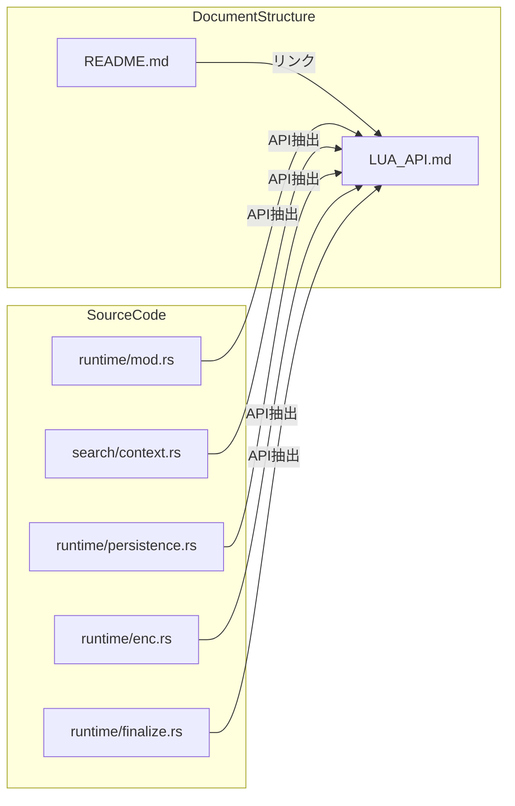

# Design Document: lua-api-documentation

## Overview

**Purpose**: pasta_luaクレートがRust側からLua VMに公開しているAPIモジュール群の包括的なリファレンスドキュメントを提供する。

**Users**: Luaスクリプト開発者（Pastaスクリプトを拡張・カスタマイズする開発者）および上級開発者（カスタムローダー・テスト環境を構築する開発者）がAPIを効率的に利用できるようにする。

**Impact**: 新規ファイル `crates/pasta_lua/LUA_API.md` を作成し、既存の `README.md` からリンクを追加する。

### Goals
- すべてのRust→Lua公開モジュールを網羅的に文書化
- 関数シグネチャ、パラメータ、戻り値、エラーケースを明確に記載
- 実用的なコード例を各APIに付与
- 既存ドキュメント体系との整合性を維持

### Non-Goals
- Rust側の内部実装詳細の文書化（公開APIのみ）
- mlua-stdlibモジュールの完全なAPI仕様（外部リンクで参照）
- 自動生成ドキュメントシステムの構築

## Architecture

### Architecture Pattern & Boundary Map

本仕様はドキュメント作成のみであり、コード変更を伴わない。アーキテクチャ変更は不要。



**Architecture Integration**:
- 選択パターン: 静的ドキュメント（Markdown）— シンプルで保守しやすい
- 既存パターン維持: README.md形式に準拠
- ステアリング準拠: `crates/pasta_lua/` 配下に配置

### Technology Stack

| Layer | Choice / Version | Role in Feature | Notes |
|-------|------------------|-----------------|-------|
| Documentation | Markdown | ドキュメント形式 | GitHub互換 |
| Language | Japanese | 記述言語 | spec.json準拠 |

## Requirements Traceability

| Requirement | Summary | Components | Interfaces | Flows |
|-------------|---------|------------|------------|-------|
| 1.1 | モジュール一覧 | LUA_API.md §モジュールカタログ | — | — |
| 1.2 | モジュール名・説明・バージョン表示 | LUA_API.md §モジュールカタログ | — | — |
| 1.3 | 機能別カテゴリ分類 | LUA_API.md §目次 | — | — |
| 2.1 | search_scene文書化 | LUA_API.md §@pasta_search | — | — |
| 2.2 | search_word文書化 | LUA_API.md §@pasta_search | — | — |
| 2.3 | set_*_selector文書化 | LUA_API.md §@pasta_search | — | — |
| 2.4 | フォールバック検索説明 | LUA_API.md §@pasta_search | — | — |
| 3.1 | load()文書化 | LUA_API.md §@pasta_persistence | — | — |
| 3.2 | save()文書化 | LUA_API.md §@pasta_persistence | — | — |
| 3.3 | gzip圧縮オプション説明 | LUA_API.md §@pasta_persistence | — | — |
| 3.4 | ファイル未存在時の動作説明 | LUA_API.md §@pasta_persistence | — | — |
| 4.1 | to_ansi()文書化 | LUA_API.md §@enc | — | — |
| 4.2 | to_utf8()文書化 | LUA_API.md §@enc | — | — |
| 4.3 | タプル戻り値パターン説明 | LUA_API.md §@enc | — | — |
| 4.4 | Windowsファイルパス例 | LUA_API.md §@enc | — | — |
| 5.1 | 読み取り専用テーブル説明 | LUA_API.md §@pasta_config | — | — |
| 5.2 | pasta.tomlフィールド公開説明 | LUA_API.md §@pasta_config | — | — |
| 5.3 | ネスト値アクセス例 | LUA_API.md §@pasta_config | — | — |
| 6.1 | finalize_scene目的・タイミング | LUA_API.md §finalize_scene | — | — |
| 6.2 | シーン収集説明 | LUA_API.md §finalize_scene | — | — |
| 6.3 | 単語収集説明 | LUA_API.md §finalize_scene | — | — |
| 6.4 | @pasta_search登録説明 | LUA_API.md §finalize_scene | — | — |
| 7.1 | mlua-stdlibモジュール一覧 | LUA_API.md §mlua-stdlib統合 | — | — |
| 7.2 | @env無効化説明 | LUA_API.md §mlua-stdlib統合 | — | — |
| 7.3 | RuntimeConfig説明 | LUA_API.md §mlua-stdlib統合 | — | — |
| 7.4 | 外部ドキュメントリンク | LUA_API.md §mlua-stdlib統合 | — | — |
| 8.1 | crates/pasta_lua/配置 | LUA_API.md | — | — |
| 8.2 | 日本語Markdown形式 | LUA_API.md | — | — |
| 8.3 | 目次 | LUA_API.md §目次 | — | — |
| 8.4 | README.mdからの参照 | README.md更新 | — | — |

## Components and Interfaces

| Component | Domain/Layer | Intent | Req Coverage | Key Dependencies | Contracts |
|-----------|--------------|--------|--------------|------------------|-----------|
| LUA_API.md | Documentation | Lua公開APIリファレンス | 1-7 | ソースコード | — |
| README.md更新 | Documentation | LUA_API.mdへのリンク追加 | 8.4 | LUA_API.md | — |

### Documentation

#### LUA_API.md

| Field | Detail |
|-------|--------|
| Intent | Rust→Lua公開APIの包括的リファレンスドキュメント |
| Requirements | 1.1-1.3, 2.1-2.4, 3.1-3.4, 4.1-4.4, 5.1-5.3, 6.1-6.4, 7.1-7.4, 8.1-8.3 |

**Responsibilities & Constraints**
- pasta_luaが公開するすべてのLuaモジュールを網羅
- 各関数のシグネチャ、パラメータ、戻り値、エラーケースを明記
- 実用的なコード例を付与
- 日本語で記述（spec.json準拠）

**Dependencies**
- Inbound: ソースコード（runtime/, search/）— API仕様の根拠（P0）
- Outbound: README.md — リンク参照（P1）
- External: mlua-stdlib — 外部モジュールドキュメント（P2）

**Implementation Notes**
- Integration: README.mdの「## API リファレンス」セクションからリンク
- Validation: 全要件のカバレッジを確認
- Risks: API変更時のドキュメント陳腐化

## Data Models

本仕様はドキュメント作成のみであり、データモデル変更なし。

## Document Structure Specification

### LUA_API.md 構造

```markdown
# Pasta Lua API リファレンス

## 目次
1. モジュールカタログ
2. @pasta_search モジュール
3. @pasta_persistence モジュール
4. @enc モジュール
5. @pasta_config モジュール
6. pasta.finalize_scene 関数
7. mlua-stdlib 統合モジュール

## 1. モジュールカタログ
### 概要テーブル
| モジュール名 | カテゴリ | バージョン | 説明 |
|--------------|----------|------------|------|

## 2. @pasta_search モジュール
### 概要
### 関数一覧
#### search_scene(name, global_scene_name?)
- パラメータ
- 戻り値
- 例
- 備考（フォールバック検索）
#### search_word(name, global_scene_name?)
#### set_scene_selector(...)
#### set_word_selector(...)

## 3. @pasta_persistence モジュール
（同様の構造）

## 4. @enc モジュール
（同様の構造）

## 5. @pasta_config モジュール
（同様の構造）

## 6. pasta.finalize_scene 関数
### 目的
### 処理フロー
### 使用タイミング

## 7. mlua-stdlib 統合モジュール
### 有効なモジュール一覧
### セキュリティ上の注意（@env）
### RuntimeConfig カスタマイズ
### 外部リファレンスリンク
```

## Testing Strategy

### Manual Verification
- 全要件のカバレッジチェック（トレーサビリティマトリクス照合）
- コード例の動作確認（Lua REPLで実行）
- リンク切れチェック（README.md → LUA_API.md）
- 日本語文法・表記の校正

### Review Checklist
- [ ] 全モジュールがカタログに含まれている
- [ ] 各関数のシグネチャが正確
- [ ] コード例が実行可能
- [ ] 目次からの内部リンクが機能する
- [ ] README.mdからのリンクが機能する
