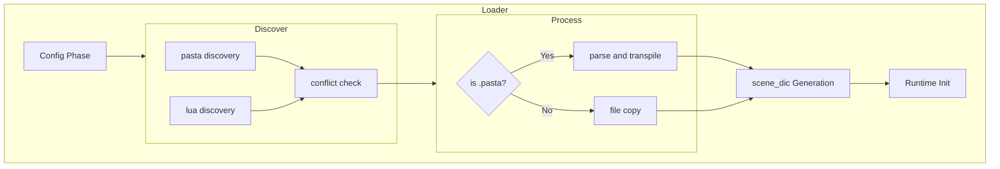
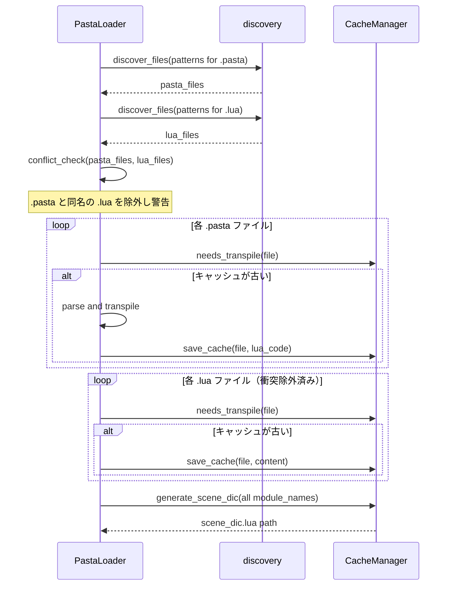

# Design Document: lua-passthrough

## Overview

**Purpose**: 辞書ディレクトリ（`dic/*/`）に配置された `.lua` ファイルを、トランスパイルなしにキャッシュディレクトリへ直接コピーし、`scene_dic.lua` から読み込む仕組みを提供する。Pasta DSLのボイラープレートなしにLuaコードを直接記述できる簡便な手段。

**Users**: ゴースト開発者が、Pasta DSLでは表現しにくい高度なLuaロジックを直接記述する際に利用する。

**Impact**: 既存の Loader パイプライン（検出→トランスパイル→キャッシュ→scene_dic生成）に `.lua` ファイルのパススルー分岐を追加する。

### Goals
- `.lua` ファイルを辞書ディレクトリに配置するだけで自動認識・自動読み込み
- トランスパイラ・パーサーを経由しない直接コピー
- 既存の `.pasta` ワークフローに一切影響を与えない

### Non-Goals
- `.lua` ファイル専用の設定項目（`lua_patterns` 等）の追加
- `.lua` ファイル内のシーン/単語レジストリへの自動登録
- `.lua` ファイルの構文チェックやlint統合

## Architecture

### Existing Architecture Analysis

現在の Loader パイプラインは以下の7フェーズで構成される:

1. **Config** → `PastaConfig::load` で `pasta.toml` 読み込み
2. **Prepare** → ディレクトリ作成、CacheManager 初期化
3. **Discover** → `discovery::discover_files` で `.pasta` ファイル検出
4. **Transpile** → `transpile_incremental` で各 `.pasta` をパース→トランスパイル→キャッシュ保存
5. **scene_dic** → `generate_scene_dic` でモジュール一覧の `require` コード生成
6. **Logger** → インスタンスログ初期化
7. **Runtime** → Lua VM 起動、scene_dic 実行

変更対象は **Phase 3（Discover）** と **Phase 4（Transpile）** のみ。Phase 5〜7 は既存コードがそのまま機能する。

### Architecture Pattern & Boundary Map



**Architecture Integration**:
- **Selected pattern**: 既存パイプライン拡張（Extension）。`discover_files` で `.lua` を追加検出し、`transpile_incremental` 内で拡張子に基づく分岐を追加
- **Domain/feature boundaries**: Loader レイヤー内で完結。CacheManager、Runtime、Parser には変更なし
- **Existing patterns preserved**: インクリメンタル更新、タイムスタンプ比較、孤立キャッシュ検出、非致命的エラー処理
- **New components rationale**: 新コンポーネントは不要。既存関数の拡張のみ
- **Steering compliance**: Loader レイヤー内の変更に限定。`tech.md` のレイヤー分離原則を維持

### Technology Stack

| Layer | Choice / Version | Role in Feature | Notes |
|-------|------------------|-----------------|-------|
| Backend | Rust 2024 edition | Loader パイプライン拡張 | 既存 |
| File I/O | std::fs | `.lua` ファイルコピー | 既存の `save_cache` を再利用 |
| Glob | glob crate | `.lua` パターン検出 | 既存依存関係 |
| Logging | tracing 0.1 | 衝突警告、統計情報 | 既存依存関係 |

新規依存関係の追加は不要。

## System Flows

### Lua パススルー処理フロー



## Requirements Traceability

| Requirement | Summary | Components | Interfaces | Flows |
|-------------|---------|------------|------------|-------|
| 1.1 | `.lua` 検出 | discover_files | discover_files() | Discover Phase |
| 1.2 | `pasta_patterns` 派生 | PastaLoader | — | Discover Phase |
| 1.3 | `profile/` 除外 | discover_files | is_in_profile_dir() | Discover Phase |
| 1.4 | `init.*` 拒否 | PastaLoader | check_invalid_filenames | Discover Phase |
| 1.5 | `.pasta` 優先（モジュール名ベース） | PastaLoader | conflict_check | Discover Phase |
| 1.6 | 衝突警告 | PastaLoader | tracing::warn | Discover Phase |
| 2.1 | パーサー非経由 | PastaLoader | — | Process Phase |
| 2.2 | キャッシュコピー | CacheManager | save_cache() | Process Phase |
| 2.3 | ディレクトリ構造・モジュール命名 | CacheManager | source_to_cache_path(), source_to_module_name() | Process Phase |
| 2.4 | インクリメンタル更新 | CacheManager | needs_transpile() | Process Phase |
| 2.5 | スキップ | CacheManager | needs_transpile() | Process Phase |
| 2.6 | scene_dic 統合 | CacheManager | generate_scene_dic() | scene_dic Phase |
| 2.7 | コピー失敗時の警告 | PastaLoader | tracing::warn | Process Phase |
| 3.1 | 孤立キャッシュ検出 | CacheManager | find_orphaned_caches() | Orphan Phase |
| 3.2 | 既存ロジック共用 | CacheManager | find_orphaned_caches() | Orphan Phase |

## Components and Interfaces

| Component | Domain/Layer | Intent | Req Coverage | Key Dependencies | Contracts |
|-----------|-------------|--------|-------------|-----------------|-----------|
| PastaLoader | Loader | スタートアップシーケンス統合。`.lua` 分岐処理と衝突チェック | 1.1-1.5, 2.1-2.2, 2.6-2.7 | CacheManager (P0), discovery (P0) | Service |
| discovery | Loader | ファイル検出（既存 `.pasta` + 新規 `.lua`） | 1.1-1.3 | glob (P0) | Service |
| CacheManager | Loader | キャッシュ管理（変更なし、既存メソッド再利用） | 2.2-2.5, 2.6, 3.1-3.2 | std::fs (P0) | Service |
| TranspileStats | Loader | 統計情報構造体。`copied` フィールド追加 | 2.7 | — | State |

### Loader Layer

#### PastaLoader（既存拡張）

| Field | Detail |
|-------|--------|
| Intent | `.lua` パススルー分岐、`init.*`拒否、衝突チェックを `load_with_config` に追加 |
| Requirements | 1.1-1.6, 2.1-2.2, 2.6-2.7 |

**Responsibilities & Constraints**
- Phase 3 で `.lua` ファイルを追加検出
- `init.lua` / `init.pasta` が検出された場合はエラーを返して処理中断
- `.pasta` と `.lua` のモジュール名衝突を検出し、`.lua` を除外して警告
- Phase 4 でファイル拡張子に基づく分岐（`.pasta` → トランスパイル / `.lua` → コピー）
- `.lua` ファイルのモジュール名を `module_names` に追加

**Dependencies**
- Inbound: pasta_shiori — Loader 呼び出し (P0)
- Outbound: CacheManager — キャッシュ操作 (P0)
- Outbound: discovery — ファイル検出 (P0)
- Outbound: LuaTranspiler — `.pasta` トランスパイル (P0)

**Contracts**: Service [x] / State [x]

##### Service Interface

```rust
impl PastaLoader {
    /// Phase 3 拡張: .pasta と .lua を検出し、衝突チェック済みリストを返す
    fn discover_all_files(
        base_dir: &Path,
        pasta_patterns: &[String],
    ) -> Result<(Vec<PathBuf>, Vec<PathBuf>), LoaderError>;
    // Returns: (pasta_files, lua_files) — lua_files は衝突除外済み

    /// Phase 4 拡張: .pasta はトランスパイル、.lua はコピー
    fn process_incremental(
        base_dir: &Path,
        pasta_files: &[PathBuf],
        lua_files: &[PathBuf],
        cache_manager: &CacheManager,
    ) -> Result<(TranspileContext, Vec<String>, ProcessStats), LoaderError>;
}
```

- Preconditions: `base_dir` が存在し、CacheManager が初期化済み
- Postconditions: `module_names` に `.pasta` 由来と `.lua` 由来のモジュール名がすべて含まれる
- Invariants: `.lua` ファイルは `parse_str` / `transpile` に渡されない

##### State Management

```rust
/// 処理統計情報（TranspileStats から改名）
struct ProcessStats {
    /// トランスパイルされた .pasta ファイル数
    transpiled: usize,
    /// キャッシュが最新でスキップされたファイル数
    skipped: usize,
    /// トランスパイル/コピー失敗ファイル数
    failed: usize,
    /// コピーされた .lua ファイル数
    copied: usize,
}
```

**Implementation Notes**
- Integration: `load_with_config` の Phase 3/4 を拡張。Phase 5〜7 は変更不要
- Validation:
  - `init.lua` / `init.pasta` 検出時は `LoaderError::InvalidFileName` を返して処理中断
  - 衝突チェックは各ファイルを `CacheManager::source_to_module_name()` でモジュール名に変換し、`.pasta` 由来のモジュール名を HashSet に格納、`.lua` ファイルのモジュール名と照合
- Risks: 処理順序は `.pasta` 先 → `.lua` 後で固定し、決定的な動作を保証

#### discovery（既存モジュール）

| Field | Detail |
|-------|--------|
| Intent | ファイル検出。変更なし — 呼び出し側でパターンを変えるだけ |
| Requirements | 1.1-1.3 |

**Responsibilities & Constraints**
- 既存の `discover_files(base_dir, patterns)` はパターン汎用。変更不要
- `profile/` 除外は既存の `is_in_profile_dir` で処理済み

**Implementation Notes**
- Integration: `PastaLoader::discover_all_files` から `discover_files` を2回呼び出す（`.pasta` パターン、`.lua` パターン）
- `.lua` パターンは `pasta_patterns` の各要素の拡張子を `.lua` に変換して生成（例: `dic/*/*.pasta` → `dic/*/*.lua`）

#### CacheManager（変更なし）

| Field | Detail |
|-------|--------|
| Intent | キャッシュ管理。既存メソッドがすべて拡張子非依存で動作するため変更不要 |
| Requirements | 2.2-2.5, 2.6, 3.1-3.2 |

**Implementation Notes**
- `source_to_module_name`: `.lua` でも `.pasta` でも `with_extension("")` で拡張子除去 → 同じモジュール名
- `source_to_cache_path`: `.lua` でも `with_extension("lua")` → 同じキャッシュパス
- `needs_transpile`: タイムスタンプ比較のみ → ファイル種別無関係
- `save_cache`: `.lua` ファイルの内容をそのまま `lua_code` 引数として渡せばコピーと同等
- `generate_scene_dic`: `module_names` リスト受け取り → 由来を問わない
- `find_orphaned_caches`: `.lua` ソースを `source_paths` に含めれば自動で検出対象

## Error Handling

### Error Strategy

既存の `LoaderError` を拡張なしで再利用する。`.lua` ファイルのコピー失敗は `TranspileFailure` と同じ非致命的パターンで処理する。

### Error Categories and Responses

| エラー種別 | 発生箇所 | 処理 | Requirement |
|-----------|---------|------|------------|
| `init.lua` / `init.pasta` 検出 | `discover_all_files` | エラー（`LoaderError::InvalidFileName`）を返して処理中断 | 1.4 |
| `.lua` ファイル読み込み失敗 | `process_incremental` | 警告ログ出力、`failed` カウント増加、処理継続 | 2.7 |
| `.lua` キャッシュ書き込み失敗 | `save_cache` | 警告ログ出力、処理継続（既存パターン） | 2.7 |
| モジュール名衝突検出 | `discover_all_files` | 警告ログ出力、`.lua` をリストから除外 | 1.5, 1.6 |
| glob パターン変換失敗 | `discover_all_files` | `.lua` 検出をスキップ、警告ログ | — |

## Testing Strategy

### Unit Tests

1. **`init.*` ファイル拒否**: `init.lua` または `init.pasta` が検出された場合に `LoaderError::InvalidFileName` が返されること
2. **モジュール名ベース衝突チェック**: 同じモジュール名を生成する `.pasta` と `.lua` が存在する場合に `.lua` が除外されること
3. **パターン変換**: `dic/*/*.pasta` → `dic/*/*.lua` の変換が正しいこと
4. **ProcessStats の `copied` カウント**: `.lua` ファイルのコピー時に正しくカウントされること

### Integration Tests

1. **`init.*` ファイル拒否**: `init.lua` または `init.pasta` が辞書ディレクトリに存在する場合、`PastaLoader::load` がエラーを返すこと
2. **`.lua` パススルー E2E**: 辞書ディレクトリに `.lua` ファイルを配置し、`PastaLoader::load` で正常にロードされること
3. **`.pasta` + `.lua` 混在**: 両方のファイルが存在し、scene_dic.lua に両方の require が含まれること
4. **モジュール名衝突**: `foo/bar.pasta` と `foo/bar.lua` が存在する場合、`.pasta` のみが処理されること
5. **孤立キャッシュ**: `.lua` ファイルを削除後、対応するキャッシュが孤立として検出されること
6. **インクリメンタル更新**: `.lua` ファイルの内容変更後、キャッシュが更新されること
