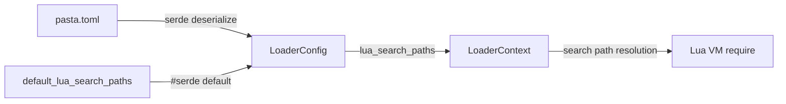

# Design Document: lua-path-restructure

## Overview

Lua検索パスを再構成し、pasta標準ランタイムスクリプト（`pasta_scripts/`）とユーザー作成スクリプト（`scripts/`）を物理的・論理的に分離する。現行の `scripts`（標準ランタイム）/ `user_scripts`（ユーザー用）構成を反転・リネームし、ユーザーが標準ランタイムを誤って上書きするリスクを排除する。

**Users**: ゴースト開発者（辞書・Luaスクリプト作成者）、パッケージメンテナー（hello-pastaビルド・リリース担当）、AI支援ツール（ステアリング・スキル参照）。

**Impact**: `default_lua_search_paths()` の戻り値変更、`crates/pasta_lua/scripts/` → `pasta_scripts/` のディレクトリ移動、テスト・設定・ドキュメント約30ファイルのパス文字列更新。

### Goals
- ユーザースクリプト配置先をフォルダー名で直感的に識別可能にする
- 標準ランタイムの誤上書きを防止する（物理ディレクトリの分離 + README による案内）
- 全テスト・ビルド・ドキュメントの整合性を維持する

### Non-Goals
- Lua検索パスの優先順位ロジック自体の変更（既存の順序走査メカニズムは維持）
- `pasta.toml` スキーマの変更（`lua_search_paths` フィールドの型・構造は不変）
- 新ランタイム機能の追加（純粋なリネーム・再配置）
- `scriptlibs/` や `profile/` パスの変更

## Architecture

### Existing Architecture Analysis

Lua検索パスは `LoaderConfig` 構造体の `lua_search_paths` フィールドで管理される。`pasta.toml` に明示指定がなければ `default_lua_search_paths()` が呼ばれ、デフォルト値が使用される。



- パス解決は `LoaderContext` が担当し、`lua_search_paths` の順序に従って先頭から走査する
- この走査ロジック自体は変更しない（パス値の変更のみ）
- `pasta.toml` で明示指定すればデフォルト値は完全に無視される（Req 1.3）

### Architecture Pattern & Boundary Map

**Architecture Integration**:
- 選択パターン: 既存コンポーネント拡張（関数内文字列値の変更 + ディレクトリリネーム）
- ドメイン境界: Loader ドメイン内で完結。他ドメイン（Transpiler, Runtime, SakuraScript 等）への影響なし
- 既存パターン維持: `#[serde(default)]` によるデフォルト値注入、`LoaderContext` のパス走査
- 新規コンポーネント: なし
- ステアリング準拠: 既存の structure.md / tech.md のパス記述を更新

### Technology Stack

| Layer | Choice / Version | Role in Feature | Notes |
|-------|------------------|-----------------|-------|
| Backend | Rust 2024 edition | `default_lua_search_paths()` 修正 | 関数本体の文字列定数のみ |
| Runtime | Lua 5.5 (mlua 0.11) | パス解決の実行環境 | ロジック変更なし |
| Config | toml 0.9.8 / serde 1 | `pasta.toml` デシリアライゼーション | スキーマ変更なし |
| Build | release.ps1 (PowerShell) | hello-pasta 配布物生成 | コピー元パス更新 |
| Test | tempfile 3 / insta 1.46 | テストフィクスチャのパス更新 | 文字列置換のみ |

## Requirements Traceability

| Requirement | Summary | Components | Interfaces | Flows |
|-------------|---------|------------|------------|-------|
| 1.1 | デフォルトパス順序再定義 | DefaultPaths | `default_lua_search_paths()` | — |
| 1.2 | `user_scripts` 削除 | DefaultPaths | `default_lua_search_paths()` | — |
| 1.3 | pasta.toml 明示指定優先 | — (既存動作、変更なし) | — | — |
| 2.1 | ディレクトリリネーム | DirRename | `git mv` 操作 | — |
| 2.2 | コードロジック保持 | DirRename | — | — |
| 2.3 | ビルド時パス解決 | DefaultPaths, DirRename | `LoaderContext` | パス走査フロー |
| 2.4 | `pasta_scripts/` README配置 | DirReadme | — | — |
| 2.5 | `scripts/` README配置 | DirReadme | — | — |
| 2.6 | hello.lua テストフィクスチャ移動 | TestFixture | — | — |
| 3.1 | hello-pasta pasta.toml更新 | HelloPastaConfig | — | — |
| 3.2 | release.ps1 パス更新 | HelloPastaBuild | — | ビルドフロー |
| 3.3 | 配布物に `pasta_scripts/` 含む | HelloPastaBuild | — | ビルドフロー |
| 3.4 | `user_scripts/` 参照除去 | HelloPastaConfig, HelloPastaBuild | — | — |
| 4.1 | `cargo test --all` パス | TestUpdate | — | — |
| 4.2 | テストフィクスチャパス更新 | TestUpdate | — | — |
| 4.3 | テスト用一時ディレクトリ更新 | TestUpdate | — | — |
| 4.4 | デフォルト値アサーション更新 | TestUpdate | — | — |
| 5.1 | structure.md 更新 | DocUpdate | — | — |
| 5.2 | pasta_lua README 更新 | DocUpdate | — | — |
| 5.3 | pasta_sample_ghost README/RELEASE.md 更新 | DocUpdate | — | — |
| 5.4 | ドキュメント内パス表記統一 | DocUpdate | — | — |

## Components and Interfaces

| Component | Domain/Layer | Intent | Req Coverage | Key Dependencies | Contracts |
|-----------|-------------|--------|--------------|------------------|-----------|
| DefaultPaths | Loader/Config | デフォルト検索パスの値定義 | 1.1, 1.2, 2.3 | — | — |
| DirRename | Loader/FileSystem | 物理ディレクトリのリネーム | 2.1, 2.2 | DefaultPaths (P0) | — |
| DirReadme | Loader/Documentation | README.md 配置による役割案内 | 2.4, 2.5 | DirRename (P0) | — |
| TestFixture | Test | hello.lua の再配置 | 2.6 | — | — |
| HelloPastaConfig | SampleGhost/Config | pasta.toml のパス更新 | 3.1, 3.4 | DefaultPaths (P0) | — |
| HelloPastaBuild | SampleGhost/Build | release.ps1 / 配布物生成 | 3.2, 3.3, 3.4 | DirRename (P0), HelloPastaConfig (P0) | — |
| TestUpdate | Test | テストコードのパス文字列更新 | 4.1, 4.2, 4.3, 4.4 | DefaultPaths (P0), DirRename (P0) | — |
| DocUpdate | Documentation | ドキュメント・ステアリングの整合性 | 5.1, 5.2, 5.3, 5.4 | DirRename (P0) | — |

### Loader / Config

#### DefaultPaths

| Field | Detail |
|-------|--------|
| Intent | `default_lua_search_paths()` の戻り値を新構成に変更する |
| Requirements | 1.1, 1.2, 2.3 |

**Responsibilities & Constraints**
- デフォルト検索パス順序を `profile/pasta/save/lua` → `scripts` → `pasta_scripts` → `profile/pasta/cache/lua` → `scriptlibs` に変更
- `user_scripts` エントリを削除
- 関数シグネチャ `fn default_lua_search_paths() -> Vec<String>` は不変
- `LoaderConfig` の `#[serde(default)]` アトリビュートによるデフォルト注入メカニズムは維持

**Dependencies**
- Inbound: `LoaderConfig.lua_search_paths` — serde デフォルト値供給 (P0)
- Outbound: なし

**対象ファイル**: `crates/pasta_lua/src/loader/config.rs` L166-173

**変更前**:
```
["profile/pasta/save/lua", "user_scripts", "scripts", "profile/pasta/cache/lua", "scriptlibs"]
```

**変更後**:
```
["profile/pasta/save/lua", "scripts", "pasta_scripts", "profile/pasta/cache/lua", "scriptlibs"]
```

### Loader / FileSystem

#### DirRename

| Field | Detail |
|-------|--------|
| Intent | 標準ランタイムスクリプトの物理ディレクトリを `scripts/` → `pasta_scripts/` にリネームする |
| Requirements | 2.1, 2.2 |

**Responsibilities & Constraints**
- `crates/pasta_lua/scripts/` を `crates/pasta_lua/pasta_scripts/` にリネーム（`git mv`）
- 配下の全ファイル（`main.lua`, `ct.lua`, `pasta/` サブツリー）を内容変更なく保持
- ただし `main.lua` 内の案内コメント中の `user_scripts` パス参照は `scripts` に更新
- 既存の `scripts/README.md` は `pasta_scripts/README.md` として更新（次項 DirReadme）

**Dependencies**
- Inbound: なし
- Outbound: DefaultPaths — 新パス名との整合性 (P0)

#### DirReadme

| Field | Detail |
|-------|--------|
| Intent | 各ディレクトリに README.md を配置し、役割と注意事項を明示する |
| Requirements | 2.4, 2.5 |

**Responsibilities & Constraints**

`pasta_scripts/README.md`（標準ランタイム — 編集禁止案内）:
```markdown
# Pasta Runtime Scripts

pasta.dll に同梱される標準ランタイムスクリプトです。

このフォルダーのファイルはパッケージビルド時に自動的に配布物へコピーされます。
ゴースト開発者はこのフォルダーのファイルを編集しないでください。
動作の変更が必要な場合は `scripts/` フォルダーに同名ファイルを配置することで上書きできます。
```

`scripts/README.md`（ユーザーカスタム — 優先読み込み案内）:
```markdown
# User Scripts

ゴースト開発者が自由に配置できるカスタム Lua スクリプト用のフォルダーです。

ここに置いたファイルは `pasta_scripts/`（標準ランタイム）より優先して読み込まれます。
同名ファイルを配置することで、標準ランタイムの動作を上書きできます。

例: `scripts/main.lua` を作成すると `pasta_scripts/main.lua` の代わりに実行されます。
```

**Dependencies**
- Inbound: DirRename — ディレクトリ構成確定後に配置 (P0)

### Test

#### TestFixture

| Field | Detail |
|-------|--------|
| Intent | `hello.lua` およびそれを参照するテスト・デバッグ設定を削除する |
| Requirements | 2.6 |

**Responsibilities & Constraints**
- `crates/pasta_lua/pasta_scripts/hello.lua` を削除（ランタイムとは無関係なサンプルファイル）
- `crates/pasta_lua/tests/lua_specs/transpiler_test.lua` を削除（`require("hello")` のみを検証するテスト。hello.lua 削除に伴い意味を失う）
- `crates/pasta_lua/tests/lua_specs/init.lua` の `"transpiler_test"` エントリを削除
- `.vscode/launch.json` の `"Lua (pasta_lua scripts)"` エントリ（`hello.lua` をデバッグ対象とする設定）を削除
- 配布物（updates2.dau, updates.txt）から hello.lua を除去（HelloPastaBuild の配布物再生成で自動解決）

**Dependencies**
- Inbound: DirRename — リネーム後に削除 (P0)

### SampleGhost / Config

#### HelloPastaConfig

| Field | Detail |
|-------|--------|
| Intent | hello-pasta の pasta.toml を新パス構成に更新する |
| Requirements | 3.1, 3.4 |

**Responsibilities & Constraints**
- `dist-src/ghost/master/pasta.toml` と `ghosts/hello-pasta/ghost/master/pasta.toml` の `lua_search_paths` を更新
- `user_scripts` エントリを `scripts` に、`scripts` エントリを `pasta_scripts` に変更
- TOML スキーマ自体の変更なし

**Dependencies**
- Inbound: DefaultPaths — 新デフォルト値との整合性 (P0)

### SampleGhost / Build

#### HelloPastaBuild

| Field | Detail |
|-------|--------|
| Intent | release.ps1 のコピーパスを更新し、配布物を再生成する |
| Requirements | 3.2, 3.3, 3.4 |

**Responsibilities & Constraints**
- `release.ps1`: `$ScriptsDest` 変数とコピー元パスを `pasta_scripts` に変更
- `release.ps1`: コメント内の `scripts/` 参照を `pasta_scripts/` に更新
- `src/main.rs`, `src/lib.rs`: ソースコメント内の `scripts/` 参照を更新
- 配布物再生成: release.ps1 実行により `ghosts/hello-pasta/` 配下のファイル群（updates2.dau, updates.txt, Luaスクリプト群）を自動更新

**Dependencies**
- Inbound: DirRename — コピー元ディレクトリ名の確定 (P0)
- Inbound: HelloPastaConfig — pasta.toml 更新済み (P0)

### Test

#### TestUpdate

| Field | Detail |
|-------|--------|
| Intent | テストコード内のパス文字列を新ディレクトリ構成に合わせて更新する |
| Requirements | 4.1, 4.2, 4.3, 4.4 |

**Responsibilities & Constraints**
- テストヘルパー（`common/mod.rs`, `common/e2e_helpers.rs`）: `.join("scripts")` → `.join("pasta_scripts")`
- デフォルト値テスト（`config_test.rs`）: アサーション内の `user_scripts` → `scripts`, `scripts` → `pasta_scripts`
- ライフサイクルテスト（`lifecycle_test.rs`）: `PastaLoader::load()` 使用箇所の一時ディレクトリ構成を更新
- 各種テスト（`startup_test.rs`, `encoding_test.rs`, `finalize_scene_test.rs`, `fallback_search_integration_test.rs`）: `.join("scripts")` 参照を更新
- `pasta_sample_ghost` テスト（`common/mod.rs`, `integration_test.rs`）: パス参照とアサーション更新
- `context.rs` 内テスト: **変更不要**（任意パス名による汎用テスト、デフォルト値テストではない）

**Dependencies**
- Inbound: DefaultPaths — 新デフォルト値の確定 (P0)
- Inbound: DirRename — 物理パスの確定 (P0)

**影響ファイル一覧**: gap-analysis.md Req 4 セクション参照

### Documentation

#### DocUpdate

| Field | Detail |
|-------|--------|
| Intent | ドキュメント・ステアリング・AIスキルのパス記述を新構成に統一する |
| Requirements | 5.1, 5.2, 5.3, 5.4 |

**Responsibilities & Constraints**
- `.kiro/steering/structure.md`: ディレクトリツリー表記の `scripts/` → `pasta_scripts/`
- `crates/pasta_lua/README.md`: 検索パス説明・コード例のパス更新
- `crates/pasta_sample_ghost/README.md`, `RELEASE.md`: ビルド手順のパス更新
- `TEST_COVERAGE.md`: テスト名の `user_scripts` 参照更新
- AIスキル（`.agents/skills/pasta-lua-coding/`）: SKILL.md, references/ 内のパス参照更新

**Dependencies**
- Inbound: DirRename — ディレクトリ名称の確定 (P0)

**影響ファイル一覧**: gap-analysis.md Req 5 セクション参照
