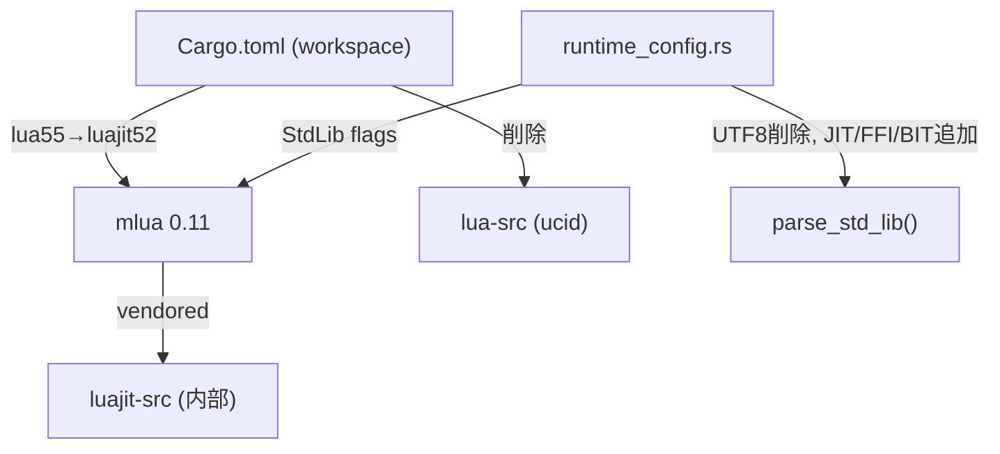

# Design Document: luajit-migration

## Overview
**Purpose**: pasta_luaクレートのLuaランタイムをLua 5.5からLuaJIT 2.1に切り替え、JITコンパイルによるパフォーマンス向上、FFI機能、ネイティブUTF-8マルチバイト識別子サポートを得る。

**Users**: ゴースト開発者はトランスパイルされたLuaスクリプトの実行速度向上とFFIアクセスを得る。プロジェクトメンテナは`lua-src`依存の除去による依存関係の簡素化を得る。

**Impact**: pasta_luaの内部ランタイムをLua 5.5からLuaJIT 2.1に変更。外部APIの変更なし。

### Goals
- mlua featureを`lua55`→`luajit52`に切り替え、LuaJIT 2.1ランタイムで動作させる
- `lua-src`依存を完全に除去する
- `StdLib`マッピングをLuaJIT互換に更新する
- 全テストスイートのパスを維持する

### Non-Goals
- LuaJIT FFIを活用した新機能の開発
- LuaJIT固有のパフォーマンスチューニング
- `.luacheckrc`設定の変更（既にlua51互換）
- mlua-stdlibの設定変更

## Boundary Commitments

### This Spec Owns
- Cargo.toml（ワークスペース・pasta_lua）の依存設定変更
- `runtime_config.rs`の`StdLib`マッピング更新（UTF8除去、JIT/FFI/BIT追加）
- `scriptlibs/lua_test/toDebugString.lua`の`table.move`互換修正（Gap Analysis GAP-2）
- 関連ドキュメント・コメントの更新
- `tech.md`ステアリングの更新

### Out of Boundary
- pasta_luaの公開APIの変更
- Luaスクリプト（pasta_scripts/, scripts/）の変更（テストツール`toDebugString.lua`を除く）
- mlua-stdlibの設定変更
- 下流クレート（pasta_shiori, pasta_check, pasta_sample_ghost）のコード変更
- LuaJIT FFI機能の利用
- `.luacheckrc`の変更

### Allowed Dependencies
- mlua 0.11（`luajit52` + `vendored` + `serialize` features）
- mlua-stdlib 0.1（変更なし）
- luajit-src（mlua vendoredが内部的に使用、明示依存不要）

### Revalidation Triggers
- mlua のメジャーバージョン変更
- LuaJITバックエンドの変更（例: luajit52 → luajit）
- `StdLib` フラグの追加・変更

## Architecture

### Existing Architecture Analysis

現在のアーキテクチャは変更しない。影響を受けるのは以下の2層のみ：

1. **依存設定層**（Cargo.toml）: mlua feature flags と lua-src 依存
2. **ランタイム設定層**（runtime_config.rs）: `StdLib` フラグマッピング



### Architecture Pattern & Boundary Map
- **Selected pattern**: 最小差分変更 — 依存設定とStdLibマッピングのみ変更
- **Domain boundaries**: pasta_lua内部のruntime_config.rsのみ
- **Existing patterns preserved**: RuntimeConfig、to_stdlib()、parse_std_lib() のAPI構造
- **Steering compliance**: vendored build維持、テスト全パス維持

### Technology Stack

| Layer                    | Choice / Version                    | Role in Feature             | Notes                 |
| ------------------------ | ----------------------------------- | --------------------------- | --------------------- |
| Infrastructure / Runtime | LuaJIT 2.1 via mlua 0.11 `luajit52` | Luaスクリプト実行ランタイム | Lua 5.5からの切り替え |
| Build                    | mlua `vendored` feature             | LuaJITソースの自動ビルド    | luajit-srcを内部使用  |

## File Structure Plan

### Modified Files
- `Cargo.toml`（ワークスペースルート） — mlua feature変更（`lua55`→`luajit52`）、`lua-src`依存削除
- `crates/pasta_lua/Cargo.toml` — `[build-dependencies]`の`lua-src`削除
- `crates/pasta_lua/src/runtime/runtime_config.rs` — `parse_std_lib()`のStdLibマッピング更新
- `crates/pasta_lua/scriptlibs/lua_test/toDebugString.lua` — `table.move`をLua 5.1互換forループに置換（GAP-2）
- `.kiro/steering/tech.md` — Luaランタイム記載の更新

### 変更なし（確認のみ）
- `crates/pasta_lua/tests/ucid_test.rs` — LuaJIT 2.1ネイティブUTF-8識別子で動作確認
- `crates/pasta_lua/tests/runtime/unit_test.rs` — StdLib関連テストの動作確認

## Requirements Traceability

| Requirement   | Summary                      | Components                                    | Files                                       |
| ------------- | ---------------------------- | --------------------------------------------- | ------------------------------------------- |
| 1.1, 1.2, 1.3 | LuaJIT 2.1ランタイム切り替え | Cargo.toml依存設定                            | `Cargo.toml`, `crates/pasta_lua/Cargo.toml` |
| 2.1, 2.2      | lua-src依存除去              | Cargo.toml依存設定                            | `Cargo.toml`, `crates/pasta_lua/Cargo.toml` |
| 3.1, 3.2      | UTF-8識別子互換性            | LuaJIT 2.1ネイティブ                          | `ucid_test.rs`（確認のみ）                  |
| 4.1, 4.2, 4.3 | テストスイート互換性         | 全テスト                                      | 変更なし                                    |
| 5.1, 5.2, 5.3 | 下流クレート互換性           | pasta_shiori, pasta_check, pasta_sample_ghost | 変更なし                                    |
| 6.1, 6.2, 6.3 | mlua-stdlib互換性            | mlua-stdlib                                   | 変更なし                                    |
| 7.1, 7.2      | ステアリング更新             | tech.md                                       | `.kiro/steering/tech.md`                    |

## Components and Interfaces

| Component        | Domain/Layer   | Intent                            | Req Coverage | Key Dependencies  | Contracts |
| ---------------- | -------------- | --------------------------------- | ------------ | ----------------- | --------- |
| Cargo依存設定    | Build          | mlua feature切り替えとlua-src除去 | 1, 2         | mlua 0.11 (P0)    | —         |
| StdLibマッピング | Runtime Config | parse_std_lib()のLuaJIT互換化     | 1            | mlua::StdLib (P0) | Service   |

### Runtime Config Layer

#### parse_std_lib() 更新

| Field        | Detail                                      |
| ------------ | ------------------------------------------- |
| Intent       | StdLib名→フラグマッピングをLuaJIT互換に更新 |
| Requirements | 1.1                                         |

**Responsibilities & Constraints**
- `"std_utf8"` マッピングを削除（LuaJITに `StdLib::UTF8` は存在しない）
- LuaJIT固有マッピングを追加: `"std_jit"` → `StdLib::JIT`, `"std_ffi"` → `StdLib::FFI`, `"std_bit"` → `StdLib::BIT`
- ドキュメントコメントの `std_utf8` を `std_jit`, `std_ffi`, `std_bit` に置換
- `"std_all"` → `StdLib::ALL_SAFE` は変更不要（mlua側でLuaJIT用に適切に定義される）

**Dependencies**
- Inbound: RuntimeConfig::to_stdlib() — StdLibフラグ変換 (P0)
- External: mlua::StdLib — フラグ定義 (P0)

##### Service Interface
```rust
// 変更前
fn parse_std_lib(name: &str) -> Result<StdLib, ConfigError> {
    match name {
        // ...
        "std_utf8" => Ok(StdLib::UTF8),    // 削除
        // ...
    }
}

// 変更後
fn parse_std_lib(name: &str) -> Result<StdLib, ConfigError> {
    match name {
        // ...existing mappings (utf8除く)...
        "std_jit" => Ok(StdLib::JIT),      // 追加
        "std_ffi" => Ok(StdLib::FFI),      // 追加
        "std_bit" => Ok(StdLib::BIT),      // 追加
        // ...
    }
}
```

## Testing Strategy

### Unit Tests
- `runtime_config.rs` の `parse_std_lib()` テスト: `"std_jit"`, `"std_ffi"`, `"std_bit"` の新マッピングを検証
- `to_stdlib()` の既存テスト: `StdLib::ALL_SAFE`, `StdLib::ALL`, 個別フラグ、減算テストがLuaJITで通ることを確認
- `"std_utf8"` が `UnknownLibrary` エラーを返すことを確認（破壊的変更の明示テスト）

### Integration Tests
- `ucid_test.rs`: UTF-8識別子（日本語変数名、関数名、テーブルフィールド）がLuaJIT 2.1で動作することを確認
- `cargo test --workspace`: ワークスペース全体のテストスイートがパスすることを確認

### E2E Tests
- `pasta_sample_ghost` のビルドとテスト: 下流クレートの完全な動作確認
