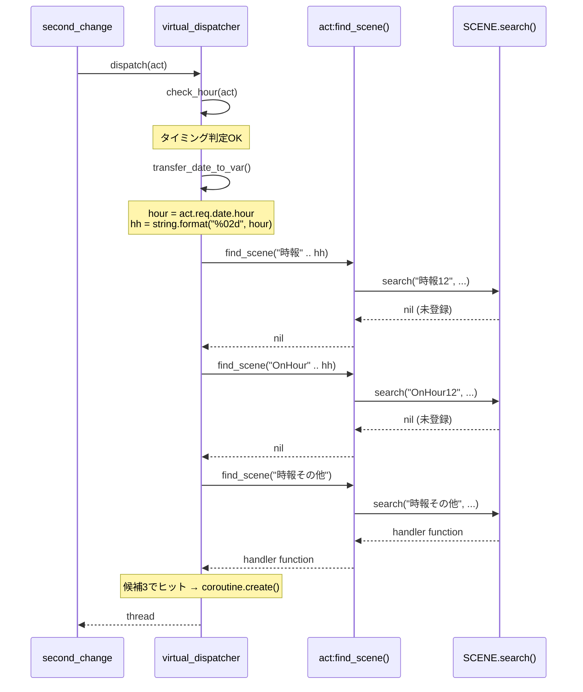

# 技術設計: onhour-fallback-chain

## 概要

**目的**: OnHour仮想イベント発火時のシーン解決に4段階フォールバックチェーンを導入し、ゴースト辞書作者が時刻ごとの個別時報シーンを柔軟に定義できるようにする。

**ユーザー**: ゴースト辞書作者が、`＊時報12` のような時刻別シーンを定義するだけで、正午専用の時報トークを実現できる。

**影響**: `virtual_dispatcher.lua` の `check_hour()` 関数末尾を変更し、固定シーン名 `"OnHour"` の代わりに4候補の逐次検索を行う。サンプルゴースト辞書のシーン名リネームを伴う。

### ゴール
- `check_hour()` のシーン解決を4段階フォールバックチェーンに置き換える
- 既存の `act:find_scene()` 5段階フォールバックをそのまま活用する
- テストモック構造（`_set_scene_executor`）との互換性を維持する

### ノンゴール
- `check_talk()` や他の仮想イベントのフォールバック化（将来検討）
- `create_scene_thread()` の汎用フォールバック対応（YAGNI）
- Rust側（`scene_table.rs`, `context.rs`）の変更

## アーキテクチャ

### 既存アーキテクチャ分析

現在の `check_hour()` は末尾で `create_scene_thread("OnHour", act)` を1回呼ぶだけの単純な構造:

```
check_hour(act)
  → タイミング判定（初回/未到達/トーク中）
  → transfer_date_to_var()
  → create_scene_thread("OnHour", act)
      → scene_executor(event_name, act)  [テスト時]
      → SCENE.co_exec(act, "OnHour")     [本番時]
          → act:find_scene("OnHour")
          → coroutine.create(wrapped_fn)
```

`act:find_scene("OnHour")` の Level 2/5 で `SCENE.search()` → `resolve_scene_id()` が呼ばれ、内部で `iter_prefix("OnHour")` が実行される。このため `OnHour` で検索すると `OnHour00`〜`OnHour23` や `OnHourOther` も候補に含まれる。

### アーキテクチャパターンと境界

変更後のフロー（太字が変更箇所）:

```
check_hour(act)
  → タイミング判定（変更なし）
  → transfer_date_to_var()（変更なし）
  → **4候補の逐次検索**
      → scene_executor("時報{HH}", act)  [テスト時、候補ごとに呼ぶ]
      → act:find_scene("時報{HH}")       [本番時]
      → act:find_scene("OnHour{HH}")     [候補1で未発見の場合]
      → act:find_scene("時報その他")      [候補2で未発見の場合]
      → act:find_scene("OnHourOther")    [候補3で未発見の場合]
      → 見つかった関数で coroutine.create()
      → 全候補未発見なら nil
```

**アーキテクチャ統合**:
- 選択パターン: 既存の `act:find_scene()` 5段階フォールバックを候補名ごとに呼ぶシンプルなループ
- ドメイン境界: 変更は `virtual_dispatcher.lua` の `check_hour()` 関数内に閉じる
- 既存パターン維持: `_set_scene_executor` モック注入、`act:find_scene()` API、`SCENE.co_exec()` API
- 新規コンポーネント: なし（既存関数の末尾変更のみ）
- ステアリング準拠: YAGNI原則（汎用化しない）、変更箇所最小化

### 技術スタック

| レイヤー | 選択 / バージョン | 本機能での役割 | 備考 |
|---------|------------------|--------------|------|
| ランタイム | Lua 5.5 (mlua 0.11) | フォールバックロジック実行 | 変更なし |
| シーン検索 | `act:find_scene()` | 候補名ごとのシーン解決 | 既存APIをそのまま利用 |
| テスト | `_set_scene_executor` | フォールバック結果のモック | 既存フックを候補名対応に拡張 |
| シーン登録 | `fast_radix_trie` (pasta_core) | prefix_index によるシーン検索 | 変更なし、前方一致の制約を認識 |

## システムフロー

### OnHour フォールバックチェーン シーケンス



## 要件トレーサビリティ

| 要件 | 概要 | コンポーネント | インターフェース | フロー |
|------|------|--------------|----------------|-------|
| 1.1 | 4段階フォールバック検索 | check_hour() | act:find_scene() | OnHour シーケンス |
| 1.2 | 全候補未発見で nil | check_hour() | — | OnHour シーケンス |
| 1.3 | 早期打ち切り（最初のヒットで返却） | check_hour() | — | OnHour シーケンス |
| 2.1 | HH 0埋め2桁フォーマット | check_hour() | string.format() | — |
| 2.2 | `＊時報12` で正午選択 | check_hour() | act:find_scene() | — |
| 3.1 | transfer_date_to_var() 事前呼び出し | check_hour() | act:transfer_date_to_var() | — |
| 4.1 | `OnHour` を候補名に使用しない | check_hour() | — | — |
| 4.2 | 既存辞書の移行ガイダンス | — (ドキュメント) | — | — |
| 5.1 | サンプル辞書 `＊OnHour` → リネーム | talk.pasta | — | — |
| 5.2 | 時刻別シーン使用例追加 | talk.pasta | — | — |

## コンポーネントとインターフェース

| コンポーネント | ドメイン/レイヤー | 意図 | 要件カバレッジ | 主要依存 | 契約 |
|--------------|-----------------|------|-------------|---------|------|
| check_hour() | virtual_dispatcher / Event | OnHourフォールバックチェーン実行 | 1.1-1.3, 2.1-2.2, 3.1, 4.1 | act:find_scene() (P0), SCENE.co_exec() 相当 (P0) | Service |
| talk.pasta | サンプルゴースト / Dictionary | リファレンス辞書のシーン名更新 | 5.1, 5.2 | — | — |

### Event レイヤー

#### check_hour() フォールバック拡張

| フィールド | 詳細 |
|-----------|------|
| 意図 | OnHour発火時に4段階フォールバックチェーンでシーンを解決する |
| 要件 | 1.1, 1.2, 1.3, 2.1, 2.2, 3.1, 4.1 |

**責務と制約**
- `check_hour()` の末尾、`create_scene_thread("OnHour", act)` を置き換える
- フォールバック候補の生成と逐次検索は `check_hour()` 内に閉じる
- `SCENE.co_exec()` と同等のコルーチン生成を行う（`act:find_scene()` + `coroutine.create()`）
- `create_scene_thread()` と `check_talk()` は変更しない

**依存**
- Inbound: `dispatch(act)` → `check_hour(act)` — OnHour判定とスレッド返却 (P0)
- Outbound: `act:find_scene(key)` — 候補名ごとのシーン検索 (P0)
- Outbound: `coroutine.create(fn)` — シーン関数のコルーチン化 (P0)
- Outbound: `act:build()` — コルーチン内でのレスポンス構築 (P0)

**契約**: Service

##### サービスインターフェース

```lua
--- check_hour() 末尾のフォールバックチェーン（擬似コード）
---
--- @param act ShioriAct
--- @return thread|nil
---
--- 前提条件:
---   act.req.date.hour が 0〜23 の整数として利用可能
---   act:transfer_date_to_var() が呼び出し済み
---
--- 事後条件:
---   候補1〜4のいずれかでハンドラが見つかれば、そのハンドラの coroutine thread を返す
---   全候補未発見なら nil を返す
---
--- 不変条件:
---   候補の検索順序は 時報{HH} → OnHour{HH} → 時報その他 → OnHourOther で固定
---   最初にヒットした候補で検索を打ち切る（早期リターン）
---   OnHour は候補に含めない（前方一致バグ回避）
```

**フォールバック候補名の生成規則**:

| 候補 | シーン名テンプレート | 例 (12時) | 生成方法 |
|------|---------------------|----------|---------|
| 1 | `時報{HH}` | `時報12` | `"時報" .. string.format("%02d", hour)` |
| 2 | `OnHour{HH}` | `OnHour12` | `"OnHour" .. string.format("%02d", hour)` |
| 3 | `時報その他` | `時報その他` | 固定文字列 |
| 4 | `OnHourOther` | `OnHourOther` | 固定文字列 |

**実装上の注意**
- `create_scene_thread(name, act)` を候補名ごとに呼ぶ。`create_scene_thread()` が `scene_executor` 分岐と `SCENE.co_exec()` 分岐を内包しているため、`check_hour()` では意識不要
- `string.format("%02d", hour)` は `check_hour()` 内で1回だけ計算する
- `act.req.date.hour` は `check_hour()` 進入時点で利用可能（`transfer_date_to_var()` より前に取得可能）

**`check_hour()` 末尾の実装（擬似コード）**:

```lua
local hh = string.format("%02d", act.req.date.hour)
local candidates = {"時報" .. hh, "OnHour" .. hh, "時報その他", "OnHourOther"}
for _, name in ipairs(candidates) do
    local t = create_scene_thread(name, act)
    if t then return t end
end
return nil
```

`create_scene_thread()` は変更しない。テスト時は `scene_executor(name, act)` が呼ばれ、本番時は `SCENE.co_exec(act, name)` が呼ばれる。

### サンプルゴースト辞書

#### talk.pasta シーン名更新

| フィールド | 詳細 |
|-----------|------|
| 意図 | `＊OnHour` シーンのリネームと時刻別シーンの使用例追加 |
| 要件 | 5.1, 5.2 |

**変更内容**:
1. 既存の `＊OnHour` シーン（3つ）を `＊時報その他` にリネーム
2. 時刻別シーン `＊時報12` を1つ追加（正午の時報例）

**変更しない要素**:
- シーン内のトーク内容（`＄時１２` 変数参照、アクター指定、表情指定）
- コメント行（`＃ ＄時１２ 変数は...`）

## テスト戦略

### 既存テストへの影響と対応

| テストファイル | 影響 | 対応方針 |
|-------------|------|---------|
| `tests/lua_specs/virtual_dispatcher_thread_test.lua` | `scene_executor` の event_name が `"OnHour"` 固定 | event_name を候補名（`"OnHourOther"` 等）に更新。候補名ごとの返却制御を追加 |
| `tests/lua_specs/global_fallback_integration_test.lua` | `GLOBAL.OnHour` 設定 | `GLOBAL.OnHourOther` に変更 |
| `tests/shiori/virtual_event_dispatch_test.rs` | Lua側の `_set_scene_executor` 経由のモック | Lua側の変更に追従 |
| `tests/lua_specs/second_change_thread_test.lua` | `scene_executor` 経由 | 候補名の変更に追従（影響軽微） |

### 新規テスト要件

1. **フォールバック順序テスト**: 候補1〜4の順序で検索されることを、`scene_executor` のevent_name引数で検証
2. **早期打ち切りテスト**: 候補1でヒットした場合、候補2〜4が呼ばれないことを検証
3. **全候補未発見テスト**: 全候補で nil を返した場合、`check_hour()` が nil を返すことを検証
4. **HHフォーマットテスト**: `hour=0` → `"時報00"`, `hour=9` → `"時報09"`, `hour=12` → `"時報12"` の候補名生成を検証
