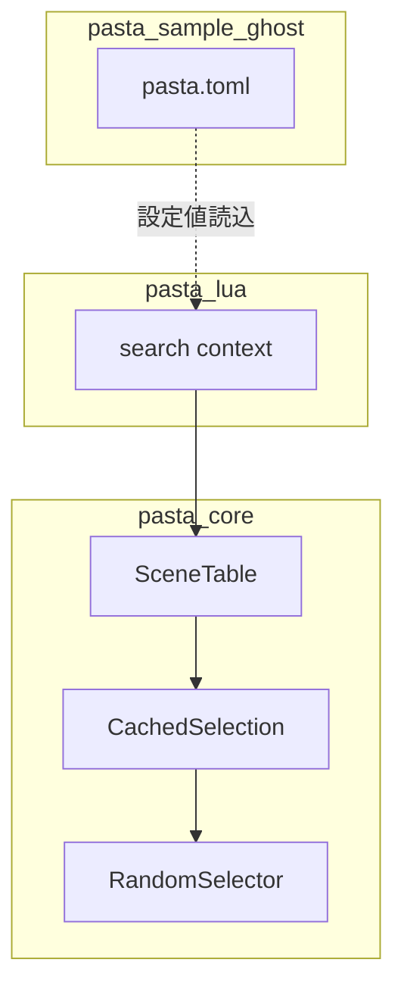

# 技術設計書

## 概要

### 機能サマリ

SceneTableのシーン候補キャッシュに循環リセット機構を追加し、OnTalkなど重複シーンの永久沈黙バグを修正する。併せてサンプルゴーストの発動間隔を30〜60秒に調整する。

| 区分 | 内容 |
|------|------|
| 分類 | Extension（既存システム改修） |
| 影響範囲 | pasta_core（SceneTable）、pasta_sample_ghost（設定）、テスト |
| 工数 | S（1〜3日） |
| リスク | Low |

### 要件→コンポーネント対応表

| 要件 | コンポーネント | 概要 |
|------|--------------|------|
| R1: シーンキャッシュの循環リセット | SceneTable (pasta_core) | Phase 4でインデックスリセット＋再シャッフル |
| R2: サンプルゴースト発動間隔調整 | pasta.toml (pasta_sample_ghost) | 設定値変更のみ |
| R3: OnTalk発火の継続性テスト | テストスイート (pasta_core) | 循環検証テストの追加＋既存テスト修正 |

## アーキテクチャ

### 変更範囲図



### 設計判断

**DJ-1: NoMoreScenesエラーバリアントの扱い**

- **選択**: 維持する（dead codeとして残す）
- **根拠**: `NoMoreScenes` は `SceneTableError` enum の一員であり、削除すると外部crateのパターンマッチに破壊的変更が生じる。循環リセット後は通常到達しないが、将来的に「意図的に循環を禁止する」機能の拡張点として有用。
- **代替案**: 削除してコンパイラ警告を受け入れる → 破壊的変更のリスクあり、却下。

**DJ-2: historyクリアのタイミング**

- **選択**: リセット時に `history` をクリアする
- **根拠**: `history` は現在「消費済み候補の追跡」に使用されている。循環リセット時にクリアしないと無限に膨張する。historyの参照箇所は他にないため、クリアによる副作用はない。
- **代替案**: historyを保持し続ける → メモリ膨張のリスク、参照者なし。却下。

**DJ-3: 既存テストの修正方針**

- **選択**: `test_resolve_scene_id_unified_local_found` のアサーションを循環動作の検証に変更
- **根拠**: ローカルスコープで候補が1件の場合でも、循環リセットにより同一シーンが再度返却される仕様に変更となる。`is_err()` → `is_ok()` に変更し、返却されたシーンIDが有効であることを検証する。

## コンポーネント設計

### Component 1: CachedSelection 循環リセット

**責務**: 全候補消費後のインデックスリセットと再シャッフル

**対象ファイル**: `crates/pasta_core/src/registry/scene_table.rs`

**変更内容**:

`resolve_scene_id` および `resolve_scene_id_unified` の Phase 3〜4 を Phase 3〜5 に分割する:

```
現行（Phase 3〜4）:
  let cached = self.cache.entry(cache_key).or_insert_with(|| { ... });
  
  // Phase 4: Sequential selection
  if cached.next_index >= cached.candidates.len() {
      return Err(SceneTableError::NoMoreScenes { ... });
  }
  let selected_id = cached.candidates[cached.next_index];
  // ...

改修後（Phase 3〜5に分割）:
  // Phase 3: Get or create cache entry
  let needs_reset = {
      let cached = self.cache.entry(cache_key).or_insert_with(|| { ... });
      cached.next_index >= cached.candidates.len()
  };
  
  // Phase 4: Reset if needed (借用解放済み)
  if needs_reset {
      let cached = self.cache.get_mut(&cache_key).unwrap();
   entry()` API は `&mut self` を借用するため、Phase 3とPhase 4の間でスコープを分離する必要がある（Split Borrowは成立しない）
- `shuffle_usize` は `&mut [usize]` を受け取る。`candidates` は `Vec<SceneId>` であり `SceneId = usize` のため型変換不要
- `cache_key` はPhase 4で再利用するため、Phase 3の外側で定義する
      if self.shuffle_enabled {
          self.random_selector.shuffle_usize(&mut cached.candidates);
      }
  }
  
  // Phase 5: Sequential selection
  let cached = self.cache.get_mut(&cache_key).unwrap();
  let selected_id = cached.candidates[cached.next_index];
  // ...
```

**Borrow Checker対応**: Phase 3の `entry()` は `&mut self` を借用するため、`cached` 参照が生存中は `self.random_selector` にアクセスできない。Phase 3とPhase 4の間でスコープを分離し、Phase 4で `get_mut()` による再取得を行う。

**インターフェース変更**: なし
- 戻り値型 `Result<SceneId, SceneTableError>` は不変
- 呼び出し元 `search/context.rs` の `NoMoreScenes → Ok(None)` 変換ロジックは到達しなくなるが、防御的コードとして残す

**制約事項**:
- `random_selector` は `&mut self` 経由でアクセスされるため、`cached` の可変借用と同時に使用可能（`cache` フィールドと `random_selector` フィールドは別フィールドのため、split borrowが成立する）
- `shuffle_usize` は `&mut [usize]` を受け取る。`candidates` は `Vec<SceneId>` であり `SceneId = usize` のため型変換不要

### Component 2: サンプルゴースト設定変更

**責務**: 発動間隔の短縮

**対象ファイル**: `crates/pasta_sample_ghost/ghosts/pasta/pasta.toml`

**変更内容**:

```toml
[ghost]
talk_interval_min = 30   # 180 → 30
talk_interval_max = 60   # 300 → 60
```

**影響**: pasta_lua の `register_config_module` → Lua `@pasta_config` → `virtual_dispatcher.get_config()` の既存パイプラインで読み込まれる。コード変更なし。

### Component 3: テストスイート

**責務**: 循環リセットの検証とリグレッション防止

**対象ファイル**: `crates/pasta_core/src/registry/scene_table.rs` (インラインテスト)

#### 新規テスト: `test_resolve_scene_id_cycling`

- 3件のOnTalkシーンを登録
- 4回目の `resolve_scene_id` 呼び出しが `Ok(SceneId)` を返すことを検証
- 返却されたSceneIdが3件の候補のいずれかであることを検証

#### 新規テスト: `test_resolve_scene_id_unified_cycling`

- unified版でも同様の循環検証を実施
- ローカル/グローバルの混在環境での循環動作を検証

#### 既存テスト修正: `test_resolve_scene_id_unified_local_found`

- `assert!(result2.is_err())` → `assert!(result2.is_ok())` に変更
- 循環リセット後に同一のローカルシーンが再返却されることを検証

## データモデル

### 変更対象構造体

**CachedSelection** (変更なし — フィールド追加不要)

```
struct CachedSelection {
    candidates: Vec<SceneId>,  // 不変（リセット時は再シャッフルのみ）
    next_index: usize,         // リセット時に0に戻す
    history: Vec<SceneId>,     // リセット時にクリア
}
```

- `candidates` の要素自体は変更しない（シャッフルは順序のみ変更）
- 新フィールドの追加は不要。既存フィールドの動作変更のみ

## エラーハンドリング

### エラー戦略

循環リセットにより `NoMoreScenes` エラーは通常到達不能となる。

| エラー | 改修前の動作 | 改修後の動作 |
|--------|------------|------------|
| `NoMoreScenes` | 全候補消費後に永久返却 | 到達不能（dead code） |
| `SceneNotFound` | 変更なし | 変更なし |
| `RandomSelectionFailed` | 変更なし | 変更なし |

**`NoMoreScenes` をdead codeとして残す理由**:
- enum バリアント削除は破壊的変更（外部crateがパターンマッチしている可能性）
- 将来「循環禁止モード」を追加する場合の拡張点として有用
- `search/context.rs` の `NoMoreScenes → Ok(None)` 変換も防御的コードとして残す

## テスト戦略

### ユニットテスト (pasta_core)

| テスト | 検証内容 | 対応要件 |
|--------|---------|---------|
| `test_resolve_scene_id_cycling` | 候補数超過後の循環リセット成功 | R1-AC1, R3-AC1 |
| `test_resolve_scene_id_cycling_reshuffles` | シャッフル有効時のリセット後再シャッフル | R1-AC2 |
| `test_resolve_scene_id_cycling_preserves_candidates` | リセット後も候補リスト保持 | R1-AC3 |
| `test_resolve_scene_id_unified_cycling` | unified版での循環検証 | R1-AC1, R3-AC1 |
| `test_resolve_scene_id_unified_local_found` (修正) | ローカル候補1件での循環動作 | R1-AC1 |

### 統合テスト

| テスト | 検証内容 | 対応要件 |
|--------|---------|---------|
| 既存の `virtual_event_dispatcher_test.rs` | 変更なし（設定値テストは既存のデフォルト値180/300を検証） | R2-AC3 |

### 設定値テスト

R2のACは設定ファイル変更のみで充足される。pasta_luaの既存テスト（`virtual_event_dispatcher_test.rs`）はデフォルト値（180/300）の検証を含んでおり、サンプルゴースト固有設定（30/60）がデフォルトを上書きしないことを間接的に保証する。

## 要件トレーサビリティ

| 要件 | AC | コンポーネント | テスト |
|------|-----|--------------|--------|
| R1-AC1 | 候補リセット | CachedSelection循環リセット | `test_resolve_scene_id_cycling` |
| R1-AC2 | 再シャッフル | CachedSelection循環リセット | `test_resolve_scene_id_cycling_reshuffles` |
| R1-AC3 | 候補リスト保持 | CachedSelection循環リセット | `test_resolve_scene_id_cycling_preserves_candidates` |
| R2-AC1 | min=30 | pasta.toml変更 | 設定ファイル直接確認 |
| R2-AC2 | max=60 | pasta.toml変更 | 設定ファイル直接確認 |
| R2-AC3 | デフォルト値維持 | 変更なし | 既存テスト（dispatcher_test） |
| R3-AC1 | 候補超過テスト | テストスイート | `test_resolve_scene_id_cycling`, `test_resolve_scene_id_unified_cycling` |
| R3-AC2 | リセット後の有効性 | テストスイート | 全cycling系テスト |
