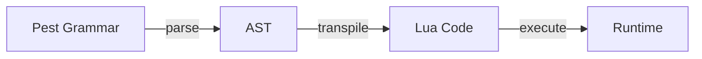

# 設計ドキュメント

## 概要

**目的**: ローカルシーン分岐においてアクション行を持たない空の分岐を許容し、Pasta DSL作者がプレースホルダ分岐や段階的な辞書構築を柔軟に行えるようにする。

**ユーザー**: Pasta DSLでゴースト辞書を記述するゴースト作者が、ローカルシーン分岐の直後に次の分岐を続ける構文を利用する。

**影響**: Pest文法ファイルの2ルールにおける量指定子を `+`（1個以上）から `*`（0個以上）に変更する。既存のパーサー・トランスパイラ・ランタイムコードは変更不要。

### ゴール
- ローカルシーン分岐でアクション行0個を文法的に許容する
- パース→トランスパイル→実行の全レイヤーでエラーなく動作することを検証する
- 既存テストに対するリグレッションを発生させない

### ノンゴール
- グローバルシーン（`＊シーン名`）の空許容（スコープ外）
- LSPにおける空シーン警告の実装（将来検討）
- 空シーンに対するコンパイル時警告の追加

## 要件トレーサビリティ

| 要件 | 概要 | コンポーネント | 検証方法 |
|------|------|----------------|----------|
| 1.1 | 空ローカルシーンのパース許容 | grammar.pest | 1.1 を含むE2Eテスト |
| 1.2 | 既存パースのリグレッションなし | grammar.pest | `cargo test --all` |
| 1.3 | 空 `local_start_scene_scope` のパース | grammar.pest | 4.2 テストケース |
| 2.1 | 空シーンのLuaトランスパイル | scope_gen.rs（変更不要） | 4.1, 4.2 テストケース |
| 2.2 | 混在シーンのトランスパイル | scope_gen.rs（変更不要） | 4.1 テストケース |
| 3.1 | 空シーンの実行時動作 | act.lua（変更不要） | 4.1 テストケース |
| 4.1 | 名前付き空ローカルシーンE2Eテスト | scene_test.rs | テスト追加 |
| 4.2 | 空スタートスコープE2Eテスト | scene_test.rs | テスト追加 |
| 4.3 | 全テストパス | — | `cargo test --all` |

## アーキテクチャ

### 既存アーキテクチャ分析

Pasta DSLのコンパイルパイプラインは3層構造:



- **Pest Grammar** (`grammar.pest`): PEG文法定義 → パースルール
- **Parser** (`parse_scene.rs`): Pestペア → AST変換
- **Transpiler** (`scope_gen.rs`): AST → Luaコード生成
- **Runtime** (`act.lua`, `scene.lua`): Luaコード実行

本変更はPest Grammar層のみに影響する。下流の3層は既に空の `Vec<LocalSceneItem>` を安全に処理するため、コード変更は不要。詳細な調査結果は `research.md` を参照。

### テクノロジースタック

| レイヤー | 選択 / バージョン | 本機能での役割 | 備考 |
|----------|-------------------|----------------|------|
| パーサー | Pest 2.8.6 | 文法ルール変更 | 変更対象 |
| AST | Rust (pasta_dsl) | 空itemsリストの保持 | 変更不要 |
| トランスパイラ | Rust (pasta_lua) | 空シーンのLua関数生成 | 変更不要 |
| ランタイム | Lua 5.5 (mlua 0.11) | 空シーン関数の実行 | 変更不要 |

## コンポーネントとインターフェース

| コンポーネント | レイヤー | 意図 | 要件カバレッジ | 変更内容 |
|----------------|----------|------|----------------|----------|
| grammar.pest | パーサー | 空ローカルシーンの文法許容 | 1.1, 1.2, 1.3 | `+` → `*` （2箇所） |
| scene_test.rs | テスト | E2Eインテグレーションテスト | 4.1, 4.2, 4.3 | テスト2件追加 |

### パーサー層

#### grammar.pest

| フィールド | 詳細 |
|------------|------|
| 意図 | ローカルシーンスコープの `local_scene_item` 量指定子を緩和 |
| 要件 | 1.1, 1.2, 1.3 |

**変更内容**

変更前:
```pest
local_start_scene_scope = {                     local_scene_item+ ~ code_scope* }
local_scene_scope       = { local_scene_start ~ local_scene_item+ ~ code_scope* }
```

変更後:
```pest
local_start_scene_scope = {                     local_scene_item* ~ code_scope* }
local_scene_scope       = { local_scene_start ~ local_scene_item* ~ code_scope* }
```

**実装メモ**
- 変更は2文字のみ（各ルールの `+` → `*`）
- 文法の緩和は厳密なスーパーセットであり、既存の有効な入力は全て引き続き有効
- `code_scope*` は変更不要（既に0個以上）

### テスト層

#### scene_test.rs — 名前付き空ローカルシーンテスト（4.1）

| フィールド | 詳細 |
|------------|------|
| 意図 | 名前付き空ローカルシーンがE2Eパイプラインで動作することを検証 |
| 要件 | 4.1（1.1, 2.1, 2.2, 3.1 を間接検証） |

**テスト仕様**

入力Pastaコード:
```pasta
＊サンプル
　ぱすた：分岐するよ！
　　＞分岐

　　・分岐会話無し
　　・分岐会話アリ
　ぱすた：分岐したよ！
```

検証項目:
- パースエラーが発生しないこと
- トランスパイルが成功すること（生成Luaコードに空ローカルシーン関数が含まれること: Req 2.1直接検証）
- Luaランタイムで `finalize_scene` までエラーなく完了すること
- シーンが検索可能であること
- **Req 3.1検証**: 空ローカルシーン関数は Lua 言語仕様上、呼び出し後に必ずコントロールを呼び出し元へ返す（`return` を明示しない Lua 関数は `nil` を返して即終了）。「エラーなく完了」= 暗黙的な制御返却の証明であり、追加のランタイム実行テストは不要。

テストパターン: `test_e2e_pipeline_basic()` と同様のパース→トランスパイル→実行フロー

#### scene_test.rs — 空スタートスコープテスト（4.2）

| フィールド | 詳細 |
|------------|------|
| 意図 | `local_start_scene_scope` がアクション行0個で動作することを検証 |
| 要件 | 4.2（1.3 を直接検証） |

**テスト仕様**

入力Pastaコード:
```pasta
＊空スタート
　　・分岐A
　ぱすた：Aルート！
```

検証項目:
- スタートスコープにアクション行がない状態でパース成功
- トランスパイルが成功すること
- Luaランタイムでエラーなく実行できること

## テスト戦略

### インテグレーションテスト（E2E）
- **名前付き空ローカルシーン**: 空ローカルシーンと非空ローカルシーンが混在するシーンの全パイプライン検証（4.1）
- **空スタートスコープ**: `local_start_scene_scope` がアクション行0個のシーンの全パイプライン検証（4.2）

### リグレッションテスト
- **既存全テスト**: `cargo test --all` で950+テストが全てパスすることを確認（4.3）
- **スナップショット**: 文法の緩和はスーパーセットであり、既存スナップショットへの影響なし
