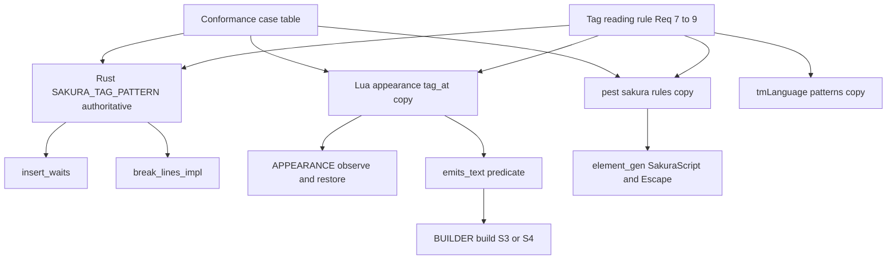
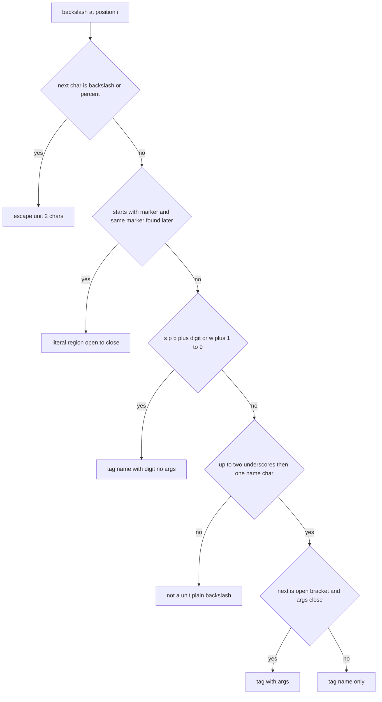
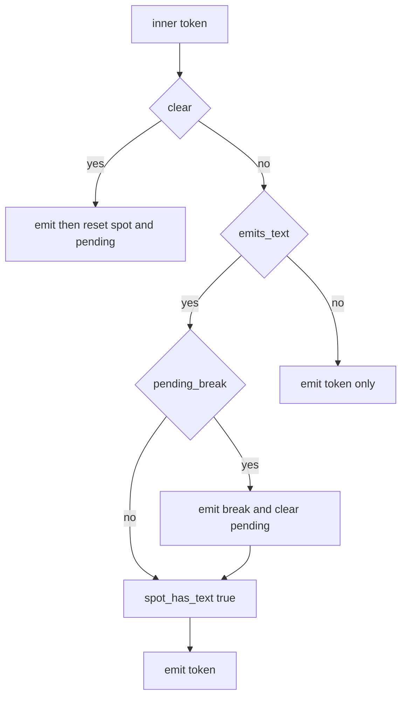

# Design Document: paragraph-break-tag-only-talk

## Overview

**Purpose**: 2 つのことを行う。

1. 段落区切りの改行（`\n[spot_newlines×100]`）の判定で、タグを除くと字が残らない `talk` を「字なし」として扱う。表情や着せ替えのタグだけを返す単語（`＠通常` の値が `\s[1000]` だけ、など）で、バルーンに余分な空きができないようにする。
2. タグの読み取り（どこからどこまでが 1 つのタグか）を SSP（UKADOC）にそろえる。現行はタグ名を貪欲に読むため、`\nHello` を名前 `nHello` の 1 つのタグと読む。これを `\n` ＋ `Hello` と読むようにし、あわせてエスケープ `\\`・`\%` と囲み `\_?…\_?` の読み方を決める。

**Users**: 表情を単語で返すゴーストの作者と利用者（emo2 ほか。areka・SSP の両方で再現）。タグの直後に ASCII の字を書く作者。

**Impact**:
- タグの定義を持つ 3 か所（Rust の `Tokenizer::SAKURA_TAG_PATTERN`、Lua の `appearance.lua` の `tag_at`、DSL の `grammar.pest`）と VS Code の `pasta.tmLanguage.json` を、同じ規則に書き換える。
- `sakura_builder.lua` の内側トークンの振り分け（S3/S4）の条件を「空でない `talk`」から「字を出すトークン」に改める。
- 段落区切りの規則そのもの、ウェイトの挿入と BudouX の改行の規則、外見の観測・復旧の規則は変えない。変わるのは「どこが単位か」と「字があるか」だけである。
- 既存の出力を変える破壊的変更を含む（要件 11）。

### Goals
- 字の無い `talk` は保留中の改行を出さず、スポットを字を出したスポットにしない（2.1, 2.2）。申し送りの (a)・(b) で余分な `\n[150]` が出ない（4.1, 4.2）。
- 3 つの読み取りが、同じ文字列を要件 7〜9 のとおり同じ位置で切り出す（10.1）。1 つの事例の表でそれを保つ（10.4）。
- 読みの変わらないテキストだけのビルドの出力がバイト単位で変わらない（3.2）。
- マニュアル（文法・Lua・内部設計・`pasta.toml`）が新しい挙動で一致し、スキル `references/` が最新である（5.1〜5.6）。

### Non-Goals
- 段落区切りの規則（`sakura-script-newline` の完全遅延方式）の変更。
- タグの意味の解釈と、既知のタグ名の一覧。
- 単語の値の種別判定（タグだけの値を `talk` 以外のトークンにする）、`pasta/act.lua` のトークン化・グループ化、コード生成の Call の腕。
- 単語の値 `＠x：\nOK` を受理するための規則（既存の「コマンド 1 個で終わる」規則のままパースエラーにする）。
- Lua から囲みの開きと閉じを別々のトークンで積む書き方への対応（トークンをまたぐ状態は持たない）。
- `talk` の中のスコープ切替タグの後ろの字を別スポットの字として数えること。
- BudouX の改行で、エスケープや囲みが表示する字の幅を数えること（現行の `\\` と同じく幅 0 のまま）。

## Boundary Commitments

### This Spec Owns
- **タグの読み取りの定義**（単位の切り出し: タグの名前と引数、エスケープ、囲み）。正は Rust の `Tokenizer::SAKURA_TAG_PATTERN`。写しは Lua の `appearance.lua`（`tag_at`）と DSL の `grammar.pest`（`sakura_script`・`sakura_escape` とその下位規則）、VS Code の `pasta.tmLanguage.json`（`inline-sakura-script`・`inline-escape`）。
- **3 つの読み取りの適合テスト**と、その事例の表。
- **外見の観測の名前の判定**（`appearance.lua` の `surface_id`・`is_scope`）を正確な名前の一致にすること。
- **コード生成の Escape の腕**（`element_gen.rs`）で `\%` を 2 文字のまま出すこと。
- **段落区切りの判定で「トークンが字を出すか」を決める述語**と、`BUILDER.build` の S3/S4 の振り分け条件。文字を表示するタグの一覧（`_u`・`_m`・`&`）。
- 上記を固定するテストと、マニュアルの該当箇所（後述の Docs）、生成スキルの再生成、破壊的変更の告知。

### Out of Boundary
- `crates/pasta_lua/pasta_scripts/pasta/act.lua`（`call-execution-correctness` が Wave 3 で持つ）と、`element_gen.rs` の Call の腕。
- ウェイトの挿入（`wait_inserter.rs`）と BudouX の改行（`line_breaker.rs`）の処理そのもの。どちらも正規表現を受け取って使うだけで、コードは変えない（テストだけ足す）。
- 外見の観測・復旧の規則（`classify` より後ろの処理、`parse_bind`、`restore_*`）。
- `pasta_lsp`（`visit_action.rs` は AST の `SakuraScript`・`Escape` の範囲を色分けするだけで、文法の変更に自動で従う）。
- `pasta.shiori.act` の `escape_tag_arg`、ビルダーの `escape_choice`（すでに `\]`・`""` を出しており、新しい読み取りと合う）。
- areka 側の `areka-P0-budoux-reveal-reflow`。

### Allowed Dependencies
- `sakura_builder.lua` → `appearance.lua`（`APPEARANCE.tag_at` と、既存の `APPEARANCE.new`・`observe`・`restore`）。向きは既存と同じ。`appearance.lua` からビルダーへの依存は作らない。
- `appearance.lua` は `STORE`・`@pasta_*` を `require` しない（10.2。現行の不変条件）。
- `line_breaker.rs`・`wait_inserter.rs` → `Tokenizer`（既存）。
- 適合テスト（`crates/pasta_lua/tests/`）→ `pasta_lua::sakura_script::tokenizer::Tokenizer`、`pasta_dsl::parser::parse_str`、`mlua`（`pasta_lua` の既存の依存）。新しい依存クレートは足さない。
- `sakura-script-newline`（完了）の状態機械、`act-token-grouping-fix`（完了）のグループ化・`merge_consecutive_talks` の結果を、そのまま受け取る。

### Revalidation Triggers
- `SAKURA_TAG_PATTERN`・`tag_at`・`grammar.pest` の `sakura_*` のどれか 1 つの変更（写しの同時変更と適合テストの表の更新が要る）。
- `merge_consecutive_talks` の結合規則の変更（字の無い `talk` と字のある `talk` が 1 つに結合されるか、囲みの開きと閉じが同じテキストに入るかが変わる）。
- DSL の `action`・`word` の選択順の変更（`sakura_escape` → `sakura_script` → `talk` の順に依存する）。
- `talk_to_script` に渡す前のテキストの形の変更（字の判定は変換前のテキストで行う）。
- 文字を表示するタグの追加（`CHAR_TAGS` とマニュアルの字の定義）。

## Architecture

### Existing Architecture Analysis
- **タグの定義が 4 か所にある**。Rust の `SAKURA_TAG_PATTERN`（`\\\\|\\[0-9a-zA-Z_!+*?&-]+(?:\[[^\]]*\])?`）、Lua の `NAME_PATTERN`・`ARG_PATTERN`（同じ貪欲な読み方）、pest の `sakura_id`（1 文字以上の連続）・`sakura_args`（`"…"` の引用は読むが `\]` は読まない）、tmLanguage の正規表現。互いに少しずつ違い、SSP とも違う。
- **Rust の利用者は正規表現を受け取るだけ**。`Tokenizer::tokenize` は `\` の位置で `find` して先頭一致を見る。`line_breaker::break_lines_impl` は `tag_regex.find_iter` で一致範囲を集める。どちらも「一致したものは幅 0 でウェイトを付けない 1 単位」として扱うため、正規表現を差し替えるだけで要件 7〜9 のウェイト・改行の扱い（7.4・8.2・9.2）が決まる。
- **Lua の利用者は `tag_at` の戻り値を使う**。`next_tag`（`observe`）と `scan_leading_text`（`restore` の先頭タグ列）である。`surface_id`・`is_scope` には、貪欲な名前（`s3やあ` の `s3x…`、`0abc` など）を救うための前方一致がある。
- **DSL は `sakura_script` を 1 つの `Action::SakuraScript` にする**。`parse_action.rs`・`parse_elements.rs` は `Rule::sakura_script` と `Rule::sakura_escape` しか見ない（下位規則は原子規則の中で対を作らない）。文法の中身を変えても Rust のパーサーのコードは変わらない。
- **`BUILDER.build` の S3/S4**。S3（`talk` かつ非空: 保留の改行をフラッシュ → `spot_has_text[last_spot] = true` → 出力）、S4（それ以外: 出力と外見の観測だけ）。字の無い `talk` を S4 に流せば、2.1〜2.5 は既存の状態機械からそのまま得られる。新しい状態は要らない。
- 現行の挙動を固定している既存のテスト・ゴールデンは、静的な走査では見つからなかった（`research.md`「設計の再生成で確かめた事実」）。

### Architecture Pattern & Boundary Map



**Architecture Integration**:
- Selected pattern: 1 つの規則を 3 か所（＋ tmLanguage）に写し、共有の事例の表で一致を保つ。Rust を Lua から呼ぶ案（`appearance.lua` が `@pasta_*` に依存する）と、pest から Rust の正規表現を使う案（文法の外に字句解析が出る）は採らない（比較は `research.md`）。
- Domain/feature boundaries: 「どこが単位か」は読み取り（Rust・Lua・pest）が持つ。「字か」はビルダーが持つ。「外見に効くタグか」は `appearance` が持つ。
- Existing patterns preserved: 正規表現を渡す Rust の構成、`appearance` の局所関数構成、pest の原子規則、S3/S4 の状態機械。
- New components rationale: 適合テスト（3 か所の写しを保つ唯一の仕組み）と、述語 `emits_text`（S3 の条件を 1 か所にまとめ、`BUILDER.build` の複雑度を増やさない）だけを足す。
- Steering compliance: 新しい依存・設定キー・モジュールを足さない。マニュアルが正（挙動と同じ変更でマニュアルを直す）。

### Technology Stack

| Layer | Choice / Version | Role in Feature | Notes |
|-------|------------------|-----------------|-------|
| Runtime (Rust) | `regex` クレート（既存） | タグの読み取りの正 | 先読み・後方参照なし。最短一致 `.*?` と `(?s)` は使える |
| Runtime (Lua) | LuaJIT 2.1（mlua 0.11） | `appearance.lua`・`sakura_builder.lua` | Lua パターンと `string.find` の平文検索だけ |
| Parser | pest（既存） | DSL の `sakura_script`・`sakura_escape` | スタック（`PUSH`/`POP`）を使わない形に単純化する |
| Editor | TextMate 文法（Oniguruma） | 色分け | `vscode-textmate` の既存のテストで確かめる |
| Test | `cargo test`、`lua_test`、`tmGrammar.test.ts` | 適合テスト・挙動の固定 | 既存の仕組み |
| Docs | mdBook、`book/tools/gen-skill-refs.mjs` | マニュアルとスキル `references/` | 既存の仕組み |

## File Structure Plan

### Directory Structure（新規ファイル）
```
crates/pasta_lua/tests/sakura_script/
└── conformance_test.rs   # 事例の表 1 つを Rust・Lua・DSL の 3 つの読み取りに通す（10.1, 10.4）
```

### Modified Files

ソース:
- `crates/pasta_lua/src/sakura_script/tokenizer.rs` — `SAKURA_TAG_PATTERN` を新しい正規表現に差し替え、説明のコメント（ReDoS の説明を含む）を改める。モジュール内のテストに新しい読み方の事例を足す。
- `crates/pasta_lua/pasta_scripts/pasta/shiori/appearance.lua` — `NAME_PATTERN`・`ARG_PATTERN` を廃し、`tag_at` を新しい規則で書き直す（局所関数 `args_end` を足す）。`next_tag` は `tag_at` の返す次の位置を使う。`surface_id`・`is_scope` を正確な名前の一致にする（`SCOPE_HEAD` の前方一致を廃する）。`scan_leading_text` は中身のある囲みで先頭タグ列を終える。`APPEARANCE.tag_at` を公開する。
- `crates/pasta_lua/pasta_scripts/pasta/shiori/sakura_builder.lua` — `CHAR_TAGS`、局所関数 `has_text`・`emits_text` を足し、S3 の条件を `emits_text(inner)` に置き換える。S3/S4 のコメントを改める。
- `crates/pasta_dsl/src/parser/grammar.pest` — `sakura_script`・`sakura_id`・`sakura_args`・`sakura_str`・`sakura_escape` を書き換え、`sakura_literal`・`sakura_digit_id`・`sakura_name_char`・`sakura_pair` を足す。`sakura_open`・`sakura_body`・`sakura_close`・`sakura_str_open`・`sakura_str_body`・`sakura_str_close` は削る。
- `crates/pasta_lua/src/code_gen/element_gen.rs` — Escape の腕の 1 か所。「2 文字目が `\`」の判定を「1 文字目が `\`」に改める（`\\` と `\%` を 2 文字のまま `talk` にする）。Call の腕には触れない。
- `editors/vscode/syntaxes/pasta.tmLanguage.json` — `inline-sakura-script` と `inline-escape` の `match` を差し替える。

テスト:
- `crates/pasta_lua/tests/sakura_script/main.rs` — `mod conformance_test;` を足す。
- `crates/pasta_lua/tests/sakura_script/edge_case_test.rs` — トークナイザとウェイトの挿入の事例（7.4・8.2・9.2）。
- `crates/pasta_lua/tests/sakura_script/budoux_test.rs` — BudouX の改行がエスケープ・囲みの途中に入らない事例（8.2・9.2）。
- `crates/pasta_lua/tests/lua_specs/appearance_test.lua` — 囲み・`\%`・正確な名前の判定の事例（8.3・9.3・10.5）。
- `crates/pasta_lua/tests/lua_specs/sakura_builder_test.lua` — 申し送り (a)・(b)、字の境界、保留の扱い（6.1〜6.3）。
- `crates/pasta_lua/tests/lua_specs/shiori_act_test.lua` — `act:talk` にタグだけの文字列を渡す経路（4.4）。
- `crates/pasta_dsl/tests/sakura_symbol_tag_test.rs` — DSL の分割・`\%`・囲み・単語の値・行をまたがないこと（8.4・9.5・10.3・10.7・10.8）。
- `crates/pasta_lua/src/code_gen/element_gen_tests.rs` — Escape の腕の `\%`（8.4）。
- `editors/vscode/src/test/tmGrammar.test.ts` — 色分けの事例（10.6）。

マニュアルとスキル:
- `book/src/grammar/sakura-script.md`・`book/src/grammar/action-line.md`・`book/src/grammar/words.md`
- `book/src/lua/modules/pasta-sakura-script.md`・`book/src/lua/script-api.md`
- `book/src/internals/talk-output.md`
- `book/src/reference/pasta-toml.md`
- `.claude/skills/pasta-ghost-authoring/references/`（`sakura-script.md`・`action-line.md`・`words.md`・`pasta-toml.md`）と `.claude/skills/pasta-lua-coding/references/`（`pasta-sakura-script.md`・`script-api.md`）— `gen-skill-refs.mjs` で再生成（手で編集しない）。

触れないファイル: `crates/pasta_lua/pasta_scripts/pasta/act.lua`、`wait_inserter.rs`・`line_breaker.rs`（コード）、`parse_action.rs`・`parse_elements.rs`、`crates/pasta_lsp/`。

## System Flows

### 単位の読み取り（3 か所で共通の規則）

`\` の位置で、次の順に判定する。先に当たったものを採る。



- 「marker」は `\_?` または `\_!`。開きと同じ印でだけ閉じる。
- 「args close」は、`[` の次から読み進め、`\` ＋ 1 文字の組と、引数の先頭（`[` または `,` の直後）の `"` から始まる引用 `"…"`（中の `""` は 1 文字）を読み飛ばして、最初に現れる `]` で閉じること。引数の途中の `"` は通常の文字である。テキストの終わりに達したら（先頭の引用が閉じない場合を含む）閉じない。

### 段落区切りの振り分け



- 変わるのは菱形 `emits_text` の条件だけである（旧: `talk` かつテキストが非空）。
- 判定は `talk_to_script` に渡す前の `inner.text` に対して行う（1.8）。

## Requirements Traceability

| Requirement | Summary | Components | Interfaces | Flows |
|-------------|---------|------------|------------|-------|
| 1.1 | 単位を除いて残れば字あり | TextPredicate | `has_text` | emits_text |
| 1.2 | 単位だけなら字なし | TextPredicate、LuaTagReader | `has_text`、`APPEARANCE.tag_at` | emits_text |
| 1.3 | `\\`・`\%` は字 | TextPredicate | `tag_at` が名前 `nil` を返す位置を字とする | emits_text |
| 1.4 | `\_u`・`\_m`・`\&` は字 | TextPredicate | `CHAR_TAGS` | emits_text |
| 1.5 | 空白は字 | TextPredicate | `\` 以外の文字はすべて字 | emits_text |
| 1.6 | `\q[…]` など他のタグは字でない | TextPredicate | `CHAR_TAGS` 以外のタグは読み飛ばす | emits_text |
| 1.7 | `\` ＋ 単位にならない文字は字 | TextPredicate | `tag_at` が名前 `nil` | emits_text |
| 1.8 | 変換前のテキストで判定 | BuilderDispatch | `emits_text(inner)` を `inner.text` に適用 | emits_text |
| 1.9 | 文字を表示するタグの `sakura_script` は字 | TextPredicate | `emits_text` の `sakura_script` 分岐 | emits_text → S3 |
| 1.10 | 中身のある囲みは字 | TextPredicate、LuaTagReader | `tag_at` の 4 番目の戻り値 `literal` | emits_text |
| 2.1 | 字なしは保留を出さず解除しない | BuilderDispatch | S4 | S4 |
| 2.2 | 字なしはスポットを字ありにしない | BuilderDispatch | S4 | S4 |
| 2.3 | 字なしの出力と観測は従来どおり | BuilderDispatch | `emit_inner_token` | S4 |
| 2.4 | 改行は字のある `talk` の直前に 1 つ | BuilderDispatch | S3 のフラッシュ | S4 → S3 |
| 2.5 | 字なしだけで離脱・終端なら破棄 | BuilderDispatch | 既存の S1・S7 | S4 |
| 3.1 | 字のある `talk` は従来どおり | BuilderDispatch | S3 | S3 |
| 3.2 | 読みの変わらないビルドはバイト不変 | TagPattern、LuaTagReader、BuilderDispatch | 新旧の読みと判定がこの入力で一致 | Testing 回帰 |
| 3.3 | 段落区切りの規則は不変 | BuilderDispatch | S1・S4b・S5・S7 に手を入れない | — |
| 3.4 | `talk`・`sakura_script` 以外は不変 | TextPredicate | `emits_text` は他の型で偽 | S4 |
| 4.1 | 申し送り (a) | BuilderDispatch | — | Testing (a) |
| 4.2 | 申し送り (b) | BuilderDispatch | — | Testing (b) |
| 4.3 | 字のあるスポットへ戻れば 1 つ | BuilderDispatch | S1 の再評価＋S3 | S3 |
| 4.4 | DSL の単語参照の経路 | BuilderDispatch | `ACT_IMPL.talk` が作る `talk` をそのまま判定 | Testing 4.4 |
| 5.1 | `pasta.toml` リファレンス | Docs | `reference/pasta-toml.md` | — |
| 5.2 | 内部設計の判定基準と字の定義 | Docs | `internals/talk-output.md` | — |
| 5.3 | スキル再生成と鮮度照合 | Docs | `gen-skill-refs.mjs`・`--check` | — |
| 5.4 | 章どうしが矛盾しない | Docs | 同じ用語（単位・字・囲み） | — |
| 5.5 | 文法の章 | Docs | `grammar/sakura-script.md`・`action-line.md`・`words.md` | — |
| 5.6 | Lua の章と内部設計の読み方 | Docs | `pasta-sakura-script.md`・`script-api.md`・`talk-output.md` | — |
| 6.1 | (a)・(b) のバイト検証 | Tests | `sakura_builder_test.lua` | — |
| 6.2 | 字の境界のケース | Tests | `sakura_builder_test.lua` | — |
| 6.3 | 保留の扱い | Tests | `sakura_builder_test.lua` | — |
| 6.4 | 既存テストを期待値を変えずに通す | Tests | 全体のテスト | — |
| 6.5 | ウェイト・改行の検証 | Tests | `edge_case_test.rs`・`budoux_test.rs` | — |
| 7.1 | 名前は `_` 0〜2 個＋ 1 文字 | TagPattern、LuaTagReader、DslGrammar | 正規表現の `_{0,2}[名前の文字]`、`tag_at`、`sakura_id` | 単位の読み取り |
| 7.2 | `s`・`p`・`b` ＋ 数字 1 桁、引数なし | TagPattern、LuaTagReader、DslGrammar | `[spb][0-9]`、`sakura_digit_id` | 単位の読み取り |
| 7.3 | `w` ＋ 1〜9、引数なし | TagPattern、LuaTagReader、DslGrammar | `w[1-9]`、`sakura_digit_id` | 単位の読み取り |
| 7.4 | 名前の後ろの文字はタグの外 | TagPattern、LuaTagReader、DslGrammar | 名前が 1 文字で終わる。後ろは `insert_waits`・`break_lines_impl` が通常の文字として扱う | 単位の読み取り |
| 7.5 | 引数は最初の閉じる `]` まで | TagPattern、LuaTagReader、DslGrammar | 引数の正規表現、`args_end`、`sakura_args` | 単位の読み取り |
| 7.6 | 引数の中の `\` ＋ 1 文字 | TagPattern、LuaTagReader、DslGrammar | `\\.`、`args_end`、`sakura_pair` | 単位の読み取り |
| 7.7 | 引数の先頭の `"…"`（`""`）だけが引用 | TagPattern、LuaTagReader、DslGrammar | ARG の先頭の `(?:"(?:[^"]|"")*")?`、`args_end` の `at_start`、`sakura_arg` | 単位の読み取り |
| 7.8 | 閉じなければ名前までがタグ | TagPattern、LuaTagReader、DslGrammar | 引数の部分が任意（`?`） | 単位の読み取り |
| 7.9 | 未知のタグも受理・透過 | TagPattern、LuaTagReader、DslGrammar | 名前の一覧を持たない | — |
| 7.10 | 単位にならない `\` は通常の文字 | TagPattern、LuaTagReader | 一致なし → 1 文字ずつ分類。`tag_at` は名前 `nil`・次の位置 `i + 1` | 単位の読み取り |
| 8.1 | `\\`・`\%` は 2 文字で 1 単位 | TagPattern、LuaTagReader、DslGrammar | `\\[\\%]`、`tag_at` の先頭の判定、`sakura_escape` | 単位の読み取り |
| 8.2 | エスケープにウェイト・改行を入れない | TagPattern | 一致は `TokenKind::SakuraScript`（ウェイトなし・幅 0） | — |
| 8.3 | 外見の観測はエスケープを読み飛ばす | LuaTagReader | `tag_at` が名前 `nil`・次の位置 `i + 2` | — |
| 8.4 | DSL が `\%` を受理し 2 文字の `talk` にする | DslGrammar、EscapeCodegen | `sakura_escape`、Escape の腕 | — |
| 9.1 | 囲みは開きから閉じまで 1 単位 | TagPattern、LuaTagReader、DslGrammar | 最短一致の選択肢、`tag_at` の囲みの判定、`sakura_literal` | 単位の読み取り |
| 9.2 | 囲みにウェイト・改行を入れない | TagPattern | 一致は `TokenKind::SakuraScript` | — |
| 9.3 | 外見の観測は囲みの中を見ない | LuaTagReader | `tag_at` が囲みの直後を次の位置として返す | — |
| 9.4 | 閉じの無い印はただのタグ | TagPattern、LuaTagReader、DslGrammar | 囲みの選択肢が外れ、名前の選択肢に落ちる | 単位の読み取り |
| 9.5 | DSL では囲み全体が 1 つのさくらスクリプト | DslGrammar | `sakura_script` の先頭の選択肢 `sakura_literal` | — |
| 9.6 | 囲みは 1 つのテキストの中でだけ判定 | TagPattern、LuaTagReader | 状態を持たない純粋な読み取り | — |
| 10.1 | 3 つの読み取りが同じ位置で切る | ConformanceTest | 事例の表 | — |
| 10.2 | Rust が正、Lua・pest は写し、`appearance` は `@pasta_*` 非依存 | TagPattern、LuaTagReader | `appearance.lua` の `require` なし | — |
| 10.3 | DSL は単位にならない `\` をパースエラー | DslGrammar | `talk_word` が `\` を除く（既存） | — |
| 10.4 | 1 つの表を 3 つに通す適合テスト | ConformanceTest | `conformance_test.rs` の `CASES` | — |
| 10.5 | 外見の観測は正確な名前で判定 | LuaTagReader | `surface_id`・`is_scope` | — |
| 10.6 | VS Code の色分けが同じ規則 | EditorGrammar | `inline-sakura-script`・`inline-escape` | — |
| 10.7 | 単語の値は「コマンド 1 個」のまま | DslGrammar | `word` の選択順は変えない | — |
| 10.8 | DSL は引数・引用・囲みを 1 行の中で読む | DslGrammar | 下位規則で `eol` を除く | — |
| 11.1 | 統合コミットと PR で破壊的変更を告知 | ReleaseNotice | 件名の `!`、PR 本文の節 | — |
| 11.2 | マニュアルに新しい挙動を規則として書く | Docs | 5.5・5.6 の各章 | — |

## Components and Interfaces

| Component | Domain/Layer | Intent | Req Coverage | Key Dependencies (P0/P1) | Contracts |
|-----------|--------------|--------|--------------|--------------------------|-----------|
| TagPattern | `pasta_lua::sakura_script::tokenizer` | 読み取りの正（正規表現） | 7.1〜7.10, 8.1, 8.2, 9.1, 9.2, 9.4, 9.6, 10.2, 3.2 | `regex` (P0) | Service |
| LuaTagReader | `pasta.shiori.appearance` | 読み取りの写しと、正確な名前の判定 | 7.1〜7.10, 8.1, 8.3, 9.1, 9.3, 9.4, 9.6, 10.2, 10.5, 1.2, 1.10 | なし | Service |
| DslGrammar | `pasta_dsl::parser`（`grammar.pest`） | 読み取りの写し（DSL） | 7.1〜7.9, 8.1, 8.4, 9.1, 9.4, 9.5, 10.3, 10.7, 10.8 | pest (P0) | Service |
| EscapeCodegen | `pasta_lua::code_gen::element_gen` | `\%` を 2 文字のまま `talk` にする | 8.4 | DslGrammar (P0) | Service |
| EditorGrammar | `editors/vscode/syntaxes` | 色分けの写し | 10.6 | なし | — |
| ConformanceTest | `crates/pasta_lua/tests/sakura_script` | 3 つの読み取りの一致を保つ | 10.1, 10.4 | TagPattern・LuaTagReader・DslGrammar (P0) | — |
| TextPredicate | `pasta.shiori.sakura_builder`（局所） | トークンが字を出すかを決める | 1.1〜1.7, 1.9, 1.10, 3.4 | LuaTagReader (P0) | Service |
| BuilderDispatch | `pasta.shiori.sakura_builder` | 述語で S3/S4 を振り分ける | 1.8, 2.1〜2.5, 3.1〜3.3, 4.1〜4.4 | TextPredicate (P0) | State |
| Docs | `book/`・スキル `references/` | 新しい挙動をマニュアルに書く | 5.1〜5.6, 11.2 | `gen-skill-refs.mjs` (P1) | — |
| Tests | `crates/*/tests`・`editors/vscode/src/test` | 挙動を固定する | 6.1〜6.5 | 既存のテストランナー (P0) | — |
| ReleaseNotice | 統合コミット・PR | 破壊的変更を告知する | 11.1 | `kiro-complete`・`release-workflow` (P1) | — |

### pasta_lua::sakura_script

#### TagPattern（`Tokenizer::SAKURA_TAG_PATTERN`）

| Field | Detail |
|-------|--------|
| Intent | 単位（タグ・エスケープ・囲み）に一致する正規表現。読み取りの正 |
| Requirements | 7.1〜7.10, 8.1, 8.2, 9.1, 9.2, 9.4, 9.6, 10.2, 3.2 |

**Responsibilities & Constraints**
- 定数 1 つを差し替える。`Tokenizer::new`・`tokenize`・`tag_regex`、`wait_inserter.rs`、`line_breaker.rs` のコードは変えない。
- 一致したものはすべて `TokenKind::SakuraScript` になる。ウェイトは付かず（`insert_waits` の規則 1）、BudouX の改行では幅 0 で前の文字に付いて運ばれる（`tokenize_plain_chars`）。これで 8.2・9.2 が満たされる。
- 名前の後ろの文字は一致に入らないので、1 文字ずつ `CharSets::classify` で分類され、ウェイトと改行の対象になる（7.4）。

**Contracts**: Service [x]

##### Service Interface
```rust
/// 単位（タグ・エスケープ・囲み）に一致する。選択肢は左から優先。
///   1. 囲み   `\_?` … 次の `\_?`（最短一致）／ `\_!` … 次の `\_!`
///   2. エスケープ `\\` `\%`
///   3. タグ   `\` ＋（`[spb]` ＋ 数字 | `w` ＋ 1〜9 | `_` 0〜2 個 ＋ 名前の 1 文字 ＋ 任意の引数）
/// 引数は `[` ARG (`,` ARG)* `]`。ARG は「先頭の任意の引用 `"…"`（中の `""`）」と、
/// 「`\` ＋ 1 文字の組・`]` `\` `,` 以外の 1 文字」の並び。引用の直後と、引用の無い ARG の先頭は `"` で始まれない。
pub const SAKURA_TAG_PATTERN: &'static str = r#"(?s)\\_\?.*?\\_\?|\\_!.*?\\_!|\\[\\%]|\\(?:[spb][0-9]|w[1-9]|_{0,2}[0-9A-Za-z!+*?&-](?:\[(?:"(?:[^"]|"")*")?(?:(?:\\.|[^\]\\,"])(?:\\.|[^\]\\,])*)?(?:,(?:"(?:[^"]|"")*")?(?:(?:\\.|[^\]\\,"])(?:\\.|[^\]\\,])*)?)*\])?)"#;
```
- 引数 1 つ分（ARG）の形は `(?:"(?:[^"]|"")*")?(?:(?:\\.|[^\]\\,"])(?:\\.|[^\]\\,])*)?` で、正規表現の中に 2 回現れる（先頭の引数と、`,` の後ろの引数）。後方参照が使えないため同じ形を 2 回書く。実装では `concat!` で部品から組み立ててよい（定数のままにする）。
- Preconditions: なし。
- Postconditions: 事例での一致（スクラッチのスクリプトで確認済み。`research.md`）。

| 入力 | 読み（`|` で区切る。`〔〕` は一致、それ以外は通常の文字） |
|------|------|
| `\nHello` | 〔`\n`〕`Hello` |
| `\w9OK` | 〔`\w9`〕`OK` |
| `\w0` | 〔`\w`〕`0` |
| `\s12` | 〔`\s1`〕`2` |
| `\_w[100]` | 〔`\_w[100]`〕 |
| `\__w[1]` | 〔`\__w[1]`〕 |
| `\![raise,X,"a]b"]` | 〔`\![raise,X,"a]b"]`〕 |
| `\q[a\]b,X]` | 〔`\q[a\]b,X]`〕 |
| `\s[0`（閉じない） | 〔`\s`〕`[0` |
| `\\` | 〔`\\`〕 |
| `\%` | 〔`\%`〕 |
| `\あ` | `\あ`（一致なし） |
| 末尾の `\` | `\`（一致なし） |
| `\_?\s[1]\_?` | 〔`\_?\s[1]\_?`〕 |
| `\_?abc`（閉じない） | 〔`\_?`〕`abc` |
| `\-`・`\+`・`\*` | 〔`\-`〕・〔`\+`〕・〔`\*`〕 |
| `\&[amp]` | 〔`\&[amp]`〕 |
| `\s3[x]` | 〔`\s3`〕`[x]` |
| `\_`・`\___a` | 一致なし |
| `\n!?` | 〔`\n`〕`!?` |
| `\_?\_?` | 〔`\_?\_?`〕（中身が空の囲み） |
| `\![a,"b""c]d"]e` | 〔`\![a,"b""c]d"]`〕`e` |
| `\![call,ghost,"the ""Name"""]` | 〔`\![call,ghost,"the ""Name"""]`〕 |
| `\q[5"x,OnX]`（引数の途中の `"`） | 〔`\q[5"x,OnX]`〕 |
| `\![raise,X,a"]b]`（引数の途中の `"`） | 〔`\![raise,X,a"]`〕`b]` |
| `\q["a]b"c,X]z`（引用の後ろに続く字） | 〔`\q["a]b"c,X]`〕`z` |
| `\q[a\,"b]c"]`（`\,` は区切りでない） | 〔`\q[a\,"b]`〕`c"]` |
| `\q["abc,OnX]y`（先頭の引用が閉じない） | 〔`\q`〕`["abc,OnX]y` |
| `\![a,"b""]`（先頭の引用が閉じない） | 〔`\!`〕`[a,"b""]` |

- Invariants:
  - 先読みも後方参照も使わない。`regex` クレートは線形時間で一致を求めるため、ReDoS は起きない（コメントの説明を新しい形に合わせて書き直す）。
  - 後戻りの有無で結果が変わらない形にしてある。引数の先頭が `"` なら引用として読むしかない（引用の無い ARG は `"` で始まれない）。引用を早く閉じて残りの `"` を通常の文字として読む道も無い（引用の直後は `"` で始まれない）。引用の中で `""` を「中の 1 文字」と読んでも「閉じて開き直す」と読んでも状態は同じになる。そのため、左から 1 回読むだけの読み取り（Lua・pest）と結果が一致する（スクラッチのスクリプトで、無作為な 60 万件の文字列について線形の読み取りと一致することを確認済み）。

**Implementation Notes**
- Integration: 文字列に `"` を含むため、定数は `r#"…"#` で書く。`(?s)` は `.` を改行にも一致させる（テキストに改行文字が入っていても読みが変わらないようにする）。
- Validation: モジュール内の既存のテスト（`test_tokenize_existing_tags_unchanged` など）は新しい正規表現でも通る（`\w8`・`\_?` 単独・`\&[ID]` を含む）。`edge_case_test.rs` の閉じない `[`・末尾の `\`・`\あ` も通る。
- Risks: 引数の先頭の `"` が閉じないとき（`\q["abc,OnX]`）は、引数全体が閉じていないものとして読まれる（7.8）。引数の途中の `"` は通常の文字なので、`\q[5"x,OnX]` は現行どおり 1 つのタグである。

### pasta.shiori.appearance

#### LuaTagReader（`tag_at`・`next_tag`・`surface_id`・`is_scope`）

| Field | Detail |
|-------|--------|
| Intent | Rust の正規表現と同じ規則で単位を読む。外見に効くタグを正確な名前で見分ける |
| Requirements | 7.1〜7.10, 8.1, 8.3, 9.1, 9.3, 9.4, 9.6, 10.2, 10.5, 1.2, 1.10 |

**Responsibilities & Constraints**
- 状態を持たず、文字列を読むだけで変えない。`STORE`・`@pasta_*` を `require` しない（10.2）。
- `tag_at` は「単位の読み取り」のフローをそのまま実装する。左から 1 回読むだけで、後戻りしない。
- `classify` より後ろ（`observe_bind`・`restore_*`・`parse_bind`）は変えない。引数は生の文字列のまま渡す（`\]` や `"` を含む引数は、`parse_bind` が従来どおり解釈できないものとして扱う）。

**Contracts**: Service [x]

##### Service Interface
```lua
--- 位置 i の `\` から始まる単位を読む。
--- @param s string
--- @param i integer  s:sub(i, i) == "\\" であること（呼び出し側の責任）
--- @return string|nil name     タグ名（`\` を除く。数字付きは "s3" の形。囲みは "_?"・"_!"）。
---                             タグでも囲みでもなければ nil（エスケープ、単位にならない `\`）
--- @return string|nil arg      角括弧の中身（外側の括弧を除く生の文字列）。無ければ nil
--- @return integer next_pos    単位の直後の位置。エスケープは i + 2、単位にならない `\` は i + 1
--- @return string|nil literal  囲みの中身（囲みのときだけ。空の囲みは ""）
function APPEARANCE.tag_at(s, i) end
```

`tag_at` の手順（`c1` は `i + 1` の 1 文字、`c2` は `i + 2` の 1 文字）:

1. `c1` が `\` または `%` → `nil, nil, i + 2`（エスケープ。8.1・8.3）。
2. `c1` が `_` で `c2` が `?` または `!` → 印 `s:sub(i, i + 2)` を `i + 3` 以降から平文検索する。見つかれば（位置 `e`）`s:sub(i + 1, i + 2), nil, e + 3, s:sub(i + 3, e - 1)` を返す（囲み。9.1）。見つからなければ 4 へ進む（9.4）。
3. `s:match("^[spb]%d", i + 1)` または `s:match("^w[1-9]", i + 1)` に一致 → `その 2 文字, nil, i + 3`（7.2・7.3）。
4. `name = s:match("^_?_?[0-9A-Za-z!+*?&%-]", i + 1)`。`nil` なら `nil, nil, i + 1`（7.10）。
5. `j = i + 1 + #name`。`s:sub(j, j)` が `[` なら `e = args_end(s, j)`。`e` があれば `name, s:sub(j + 1, e - 2), e`（7.5）。
6. それ以外は `name, nil, j`（7.8）。

`args_end(s, j)`（`j` は `[` の位置。戻り値は `]` の次の位置、閉じなければ `nil`）: `k = j + 1` から 1 文字ずつ見る。
「引数の先頭か」を表す局所の真偽値 `at_start` を持つ（初めは真）。
- 文字が無い → `nil`。
- `at_start` が真で文字が `"` → 引用を読む。`k + 1` 以降から `"` を平文検索する。無ければ `nil`（先頭の引用が閉じない。7.8）。見つけた `"` の次も `"` なら、その次から検索を続ける。そうでなければ `k = 見つけた位置 + 1`。`at_start` を偽にする（7.7）。
- それ以外は、まず `at_start` を偽にしてから次を見る。
  - `]` → `k + 1` を返す。
  - `\` → 次の文字が無ければ `nil`。あれば `k = k + 2`（7.6。続く 1 文字が多バイト文字でも、残りのバイトは `]`・`,`・`\` にならないので結果は変わらない）。
  - `,` → `k = k + 1`、`at_start` を真にする。
  - それ以外（引数の途中の `"` を含む）→ `k = k + 1`。

名前の判定（10.5）:
- `surface_id(name, arg)`: `name == "s"` で `arg` があればその `arg`、または `name:match("^s(%d)$")`。空の ID は従来どおり無視する。
- `is_scope(name, arg)`: `name` が `0`・`1`・`h`・`u` のいずれかに等しい、または `name == "p"` で `arg` がある、または `name:match("^p%d$")`。`SCOPE_HEAD` の前方一致（`name:sub(1, 1)`）は廃する。

呼び出し側の変更:
- `next_tag`: 名前が `nil` のとき `pos = next_pos` で進める（`\\` を自前で判定する分岐を廃する）。囲みは名前 `_?`・`_!` のタグとして返るが、`classify` に当たらないため無視され、次の位置が囲みの直後なので中は観測されない（9.3）。
- `scan_leading_text`: 名前が `nil`、または `literal` が空でないとき、先頭タグ列の終わりとして `true` を返す（中身のある囲みは字である）。

- Preconditions: `i` の位置が `\`。
- Postconditions: 同じ文字列に対し、`tag_at` が単位と読む範囲は `SAKURA_TAG_PATTERN` の先頭一致と同じ（適合テストで保つ）。
- Invariants: 「読みの変わらないテキスト」では、名前・引数・次の位置が変更前と同じになる（3.2）。

**Implementation Notes**
- Integration: `NAME_PATTERN`・`ARG_PATTERN` は使う場所が無くなるので削る。モジュール冒頭の説明の「Rust Tokenizer::SAKURA_TAG_PATTERN と同じ」は残し、写しであることと適合テストの場所を書く。
- Validation: `appearance_test.lua` の既存の事例（`\s3やあ`・`\p3`・`\\s[5]`・`\![raise,OnX,\s[0]]あ` の入れ子・不正な入力 6 種）は新しい読み方でも同じ結果になる（入れ子の例は、引数の中の `\s` がエスケープの組として読まれ、同じ `]` で閉じる）。
- Risks: 写しのずれ。適合テストで検出する。

### pasta_dsl::parser

#### DslGrammar（`grammar.pest`）

| Field | Detail |
|-------|--------|
| Intent | DSL のさくらスクリプトとエスケープを、ランタイムと同じ規則で切り出す |
| Requirements | 7.1〜7.9, 8.1, 8.4, 9.1, 9.4, 9.5, 10.3, 10.7, 10.8 |

**Responsibilities & Constraints**
- 変えるのは `sakura_*` の規則だけ。`action`・`word`・`talk_word` の定義と選択順は変えない（`sakura_escape` → … → `sakura_script` → `talk`）。
- `sakura_script` と `sakura_escape` は原子規則（`@`）のままで、下位規則は対を作らない。`parse_action.rs`・`parse_elements.rs` は変えない。
- 引数・引用・囲みは行末（`eol`）をまたがない（10.8）。

**Contracts**: Service [x]

##### Service Interface
```pest
sakura_script    = @{ sakura_literal | sakura_marker ~ ( sakura_digit_id | sakura_id ~ sakura_args? ) }
sakura_literal   = _{ "\\_?" ~ ( !( "\\_?" | eol ) ~ ANY )* ~ "\\_?"
                    | "\\_!" ~ ( !( "\\_!" | eol ) ~ ANY )* ~ "\\_!" }
sakura_digit_id  = _{ ( "s" | "p" | "b" ) ~ ASCII_DIGIT | "w" ~ '1'..'9' }
sakura_id        = _{ "_"{0,2} ~ sakura_name_char }
sakura_name_char = _{ ASCII_ALPHANUMERIC | "!" | "-" | "+" | "*" | "?" | "&" }
sakura_args      = _{ "[" ~ sakura_arg ~ ( "," ~ sakura_arg )* ~ "]" }
sakura_arg       = _{ sakura_str ~ sakura_arg_rest | !"\"" ~ sakura_arg_rest }
sakura_arg_rest  = _{ ( sakura_pair | !( "]" | "\\" | "," | eol ) ~ ANY )* }
sakura_pair      = _{ "\\" ~ !eol ~ ANY }
sakura_str       = _{ "\"" ~ ( "\"\"" | !( "\"" | eol ) ~ ANY )* ~ "\"" }
sakura_escape    = @{ sakura_marker ~ ( sakura_marker | "%" ) }
sakura_marker    = _{ "\\" }
```
- Postconditions:
  - `ぱすた：\nHello` は `SakuraScript("\n")` ＋ `Talk("Hello")`（7.4）。
  - `ぱすた：\_?＠w\s[1]\_?z` は `SakuraScript("\_?＠w\s[1]\_?")` ＋ `Talk("z")`（9.5。囲みの先頭は `\` なので `action` の先の選択肢（`word_ref` など）に当たらず、`sakura_script` が囲み全体を取る。中の `＠w` は展開されない）。
  - `ぱすた：100\%です` は `Talk("100")` ＋ `Escape("\%")` ＋ `Talk("です")`（8.4）。
  - `ぱすた：\あ`・`ぱすた：\_`・行末の `\` はパースエラー（10.3。`talk_word` が `\` を取らないため。`\あ` と行末の `\` は現行もエラー）。
  - 単語の値 `＠x：\nOK` はパースエラー、`＠x：\_?\s[1]\_?` は値 1 個（10.7）。`word` は `string_literal | sakura_script | word_nofenced` の順のままで、`sakura_script` が `\n` に一致した時点で確定し、後ろの `OK` を値の続きとして読めない。
  - 単語の値 `＠x：\%` は従来どおり `word_nofenced`（`sakura_script` に一致しない）。値の文字列 `\%` はランタイムでエスケープとして読まれる。
- 引用（`sakura_str`）は引数の先頭でだけ試す。先頭が `"` で引用が閉じなければ `sakura_arg` が失敗し、`sakura_args` 全体が外れて名前だけのタグになる（7.8）。引数の区切りは半角の `,` だけである。
- Invariants: 選択肢の先頭の文字が重ならない（`sakura_pair` は `\`、`sakura_str` は引数の先頭の `"`）ので、pest の「後戻りしない順序付き選択」で Rust の正規表現と同じ位置で閉じる。`"_"{0,2}` は名前の文字に `_` が無いため、取りすぎで失敗することがない。
- この文法は、現行の `grammar.pest` に上の規則を当てたスクラッチのパーサー（pest 2.9.2）で、TagPattern の表の事例（引用の事例を含む）と単語の値・行またぎの事例について、上の Postconditions どおりに読むことを確認済み（`research.md`）。

**Implementation Notes**
- Integration: pest のスタック（`PUSH_LITERAL("]")`・`PUSH("\"")`）は使わなくなる。文字列リテラル（`strfence`）とコードブロックのスタックの使い方には影響しない。
- Validation: `sakura_symbol_tag_test.rs` の既存の事例（`\-`・`\+`・`\*`・`\_?` 単独・`\&[ID]`）は通る。
- Risks: 変更前は、閉じない `[` や引用が行をまたいで後ろの行の `]`・`"` まで読んでいた（スクラッチのプログラムで確認。`research.md`）。10.8 でその行の中に限る。

### pasta_lua::code_gen

#### EscapeCodegen（`element_gen.rs` の Escape の腕）

| Field | Detail |
|-------|--------|
| Intent | `\%` を `\\` と同じく 2 文字のまま `talk` にする |
| Requirements | 8.4 |

**Responsibilities & Constraints**
- 変更は 1 か所。2 文字のまま出す条件を「2 文字目が `\`」から「1 文字目が `\`」（`escape.starts_with('\\')`）に改める。`＠＠`・`＄＄` は従来どおり 2 文字目だけを出す。
- Call の腕と、ほかの腕には触れない（`call-execution-correctness` と編集箇所が重ならない）。

**Contracts**: Service [x]
- Postconditions: `Action::Escape { sequence: "\%" }` → `act:actor_proxy("…"):talk([[\%]])`。`"\\"`・`"＠＠"`・`"＄＄"`・`"@@"`・`"$$"` の出力は変わらない。

### editors/vscode

#### EditorGrammar（`pasta.tmLanguage.json`）
- `inline-sakura-script` の `match` を、`SAKURA_TAG_PATTERN` の 1 番目（囲み）と 3 番目（タグ）の選択肢と同じ形にする（JSON の文字列としてエスケープする。`(?s)` は付けない。行単位で読むため）。
- `inline-escape` の `match` の文字クラスに `%` を足す（`\%` を `constant.character.escape.pasta` にする）。
- 色分けだけに使う。パースの正は LSP（DSL の文法）である。

### pasta.shiori.sakura_builder

#### TextPredicate

| Field | Detail |
|-------|--------|
| Intent | トークンが段落区切りの判定で「字を出す」かを返す |
| Requirements | 1.1, 1.2, 1.3, 1.4, 1.5, 1.6, 1.7, 1.9, 1.10, 3.4 |

**Responsibilities & Constraints**
- 「字」の規則の唯一の置き場所。単位の切り出しは LuaTagReader に委ねる。
- 純粋関数。トークンもテキストも変更しない。

**Dependencies**
- Outbound: LuaTagReader — 単位の切り出し（P0）

**Contracts**: Service [x]

##### Service Interface
```lua
--- 文字を表示するタグの名前（1.4）
local CHAR_TAGS = { _u = true, _m = true, ["&"] = true }

--- 単位が字を表示するか（文字を表示するタグ、または中身のある囲み）
local function unit_shows_text(name, literal) end   -- CHAR_TAGS[name] or (literal ~= nil and literal ~= "")

--- テキストに字が 1 文字以上あるか（1.1〜1.7, 1.10）
--- 左から走査し、`\` 以外の文字があれば真。`\` の位置では APPEARANCE.tag_at で読み、
--- 名前が nil（エスケープ・単位にならない `\`）なら真、unit_shows_text なら真、それ以外は next_pos へ進む。
--- @param s string
--- @return boolean
local function has_text(s) end

--- 内側トークンが字を出すか（S3 の条件）
--- talk: テキストが nil でなく has_text(text) が真（1.1〜1.8, 1.10）
--- sakura_script: テキスト中の `\` を順に APPEARANCE.tag_at で読み、名前があり unit_shows_text が真のものが
---   1 つでもあれば真（1.9, 1.10。タグ以外の文字とエスケープは数えない）
--- それ以外の型: 偽（3.4）
--- @param inner table 内側トークン
--- @return boolean
local function emits_text(inner) end
```
- Preconditions: なし（`text` が `nil` の `talk` は偽）。
- Postconditions: 空文字列の `talk` は偽（旧条件と一致）。読みの変わらないテキストの字のある `talk` は真（旧条件と一致）。
- Invariants: 判定は `talk_to_script` の前のテキストに対して行う（1.8）。

**Implementation Notes**
- Integration: `has_text` は `appearance.lua` の `scan_leading_text` と同じ形の走査（`pos` を `next_pos` へ進める）。
- Validation: 字の境界の表（Testing Strategy）で網羅する。
- Risks: `sakura_script` のトークンでエスケープを数えないのは、設計ディスカッション #1 の決定（タグ以外の文字は数えない）による。DSL のエスケープは `talk` になるため、DSL の経路では差が出ない。

#### BuilderDispatch（`BUILDER.build` の S3/S4）

| Field | Detail |
|-------|--------|
| Intent | 内側トークンを TextPredicate で S3/S4 に振り分ける |
| Requirements | 1.8, 2.1, 2.2, 2.3, 2.4, 2.5, 3.1, 3.2, 3.3, 4.1, 4.2, 4.3, 4.4 |

**Responsibilities & Constraints**
- S3 の条件を `inner.type == "talk" and inner.text ~= nil and inner.text ~= ""` から `emits_text(inner)` に置き換える。S3 の中身（改行 → `spot_has_text` 設定 → 出力の順）、S4b・S4・S1・S5・S6・S7 は変えない。
- 字の無い `talk` と、字を表示しない `sakura_script` は S4 に流れる。

**Contracts**: State [x]

##### State Management
- State model: 既存の `spot_has_text: table<integer, boolean>`・`pending_break: boolean`（ビルドローカル）。意味を「空でない `talk` を出したか」から「字を出すトークンを出したか」に改める。
- Persistence & consistency: ビルドごとに作り直す（変更なし）。
- Concurrency strategy: なし（単一の VM スレッド内の同期処理）。

**Implementation Notes**
- Integration: 条件の外出しで `BUILDER.build` の論理演算子が減る。`luacheck` の `561` の無視指定はそのまま残す。
- Validation: 4.4 は `ACT_IMPL.talk` が単語の値を `tostring` して `talk` トークンにすることを前提にする（`pasta/act.lua` は変えない）。`＠通常` の行に同じアクターの字のある行が続くと `merge_consecutive_talks` で 1 つの `talk` になり、字のある `talk` として改行はその先頭に出る（3.1。申し送りの原文 `\p[0]\n[150]\s[1000]…つまり、、` と同じ形）。
- Risks: 既存のテストに 3.2 の条件を満たさない並びがあれば期待値が変わる。静的な走査では見つかっていない。実装時に全体のテストで確かめる（6.4）。

### book・スキル

#### Docs（章ごとに、改める箇所と書く内容）

**`book/src/grammar/sakura-script.md`**（→ `pasta-ghost-authoring/references/sakura-script.md`）
- 「コマンドの字句構造」: 構文の定義を新しい規則に書き直す（名前は `_` が 0〜2 個と 1 文字。`s`・`p`・`b` は数字 1 桁、`w` は 1〜9 を続けて取れ、その形は引数を取らない。引数の中では `\` ＋ 1 文字がエスケープの組、引数の先頭の `"` から始まる `"…"` が引用）。
  - 「コマンド名は…の連続である。`\w8` はコマンド名 `w8`」を「名前は 1 文字。`\w8` は `w` に数字 1 桁が付いた形。`\w10` は `\w1` と字 `0`」に改める。名前の後ろに続けて書いた字は台詞になること（`\nHello`）を書く。
  - 「`\]` は特別扱いされない」を削り、引数の中の `\` ＋ 1 文字と引用を書く。引用は引数全体を囲む書き方で、引数の先頭（`[` または `,` の直後）の `"` だけが引用を開くこと、引数の途中の `"` は普通の文字であること、引用が閉じた後ろは次の `,` か `]` まで普通に読むことを書く。引数が閉じない（引数の先頭の引用が閉じない場合を含む）ときは、名前までがコマンドで `[` 以降は台詞になることを書く。アクション行では引数・引用・囲みが 1 行の中で読まれることを書く。
  - 「`%` はコマンド名に使えない文字であり、`\%` はパースエラーになる」を、「`\%` は `%` を表示するエスケープ（[インライン要素](action-line.md)）」に改める。
  - `\` の後ろがコマンドにもエスケープにもならない書き方（`\あ`・`\_` だけ・行末の `\`）はパースエラーであることを書く。
- 「角括弧内のエスケープと引用」: 「`"` の外では、`\]` と書いても最初の `]` で閉じる。`ぱすた：\s[a\]b]` は `\s[a\]` と `b]` に分かれる」を、「`\]` は引数を閉じない。`ぱすた：\s[a\]b]` は 1 つのコマンド」に改める。「`"` で囲んだ部分の中にある `]` では角括弧は閉じない」は、引数の先頭から囲んだ引用に限ることを明記する（既存の例 `\![raise,OnTest,"100,2"]`・`\![call,ghost,"the ""Name"""]` はそのまま成り立つ）。
- 新しい小節「タグをそのまま表示する囲み」: `\_?…\_?`（旧式の `\_!…\_!`）は開きから閉じまでで 1 つのさくらスクリプトであること。中の `＠単語`・`＄変数` は展開されず、ウェイトも改行も入らないこと。同じ行の中に閉じが無い `\_?` はただのコマンドであること。
- 「配置ルール」: 単語の値は「コマンド 1 個で終わる」のまま。例に、囲みは全体で 1 個であることを足す。
- 「主要タグ早見」: `\w数字` の説明に「数字は 1〜9 の 1 桁」を足す。

**`book/src/grammar/action-line.md`**（→ `references/action-line.md`）
- インライン要素の表に「`%` のエスケープ `\%`: 『%』を 1 文字表示」の行を足す。
- `\\` の説明の箇条に `\%` を並べる（2 文字のまま出力され、間に何も入らない）。
- 判定順の説明のエスケープの列挙（`＠＠`・`＄＄`・`\\`）に `\%` を足す。

**`book/src/grammar/words.md`**（→ `references/words.md`）
- 値の形の箇条「さくらスクリプトのコマンド 1 個」に、囲みは全体で 1 個であることを足す。パースエラーの例に `＠w：\nOK`（名前は 1 文字で終わり、後ろに字が続く）を足す。代わりの書き方の手引きは足さない（既存の記述の範囲にとどめる）。

**`book/src/lua/modules/pasta-sakura-script.md`**（→ `pasta-lua-coding/references/pasta-sakura-script.md`）
- 「文字の分類」1: タグの形を新しい規則で書き直す（名前の規則、引数のエスケープと引用、エスケープ `\\`・`\%`、囲み）。タグの直後の ASCII の字は通常の文字として分類されること（`\nHello`、`\n!?`）。囲みは 1 つのテキスト（1 回の `talk_to_script` の入力）の中でだけ読まれること。
- 「ウェイトの挿入」「改行の入れ方」: エスケープと囲みはタグと同じ扱い（ウェイトなし・幅に数えない・途中に何も入らない）であることを書く。

**`book/src/lua/script-api.md`**（→ `references/script-api.md`）
- `sakura_script(actor, text)`: 囲みの開きと閉じは 1 回の呼び出しのテキストに入れること。別々のトークンで積むと囲みとして読まれないこと（9.6）を書く。

**`book/src/internals/talk-output.md`**（生成対象外）
- 状態表: `spot_has_text` を「字を出すトークン（字のある `talk`、字を表示する `sakura_script`）を出力したか」、`pending_break` を「次の字を出すトークンの前」に改める。
- 内側のトークンの本文: 「空でない `talk`」を「字を出すトークン」に置き換え、「それ以外のトークン（空の `talk`・字の無い `talk`・字を表示しない `sakura_script` を含む）は判定の状態を変えない」とする。
- 新しい小節「字の定義」: 単位として除くもの、字として数える単位（エスケープ、`\_u`・`\_m`・`\&`、中身のある囲み）、`\` ＋ 単位にならない文字、空白を特別扱いしないこと、判定は変換前のテキストで行うこと、`sakura_script` はトークン内のタグ・囲みだけで判定すること。
- 「さくらスクリプトの後処理」2（トークナイザ）: `SAKURA_TAG_PATTERN` の説明を新しい 3 つの選択肢（囲み・エスケープ・タグ）で書き直す。
- 「アピアランスの観測と復旧」: 「タグ名と引数の切り出しは Rust の `SAKURA_TAG_PATTERN` と同じ文字集合」を「同じ規則の写し（適合テストで一致を保つ）」に、スコープ切替の「名前が `0`・`1`・`h`・`u` で始まるタグ」を「`\0`・`\1`・`\h`・`\u`」に改める。囲みの中とエスケープは観測しないことを書く。
- モジュール表と境界表: `APPEARANCE.tag_at`（ビルダーが字の判定に使う）を足す。
- 「不変条件と制約」: タグの定義が Rust（正）・Lua・pest・tmLanguage の 4 か所にあり、`conformance_test.rs` の表で一致を保つこと。囲みはトークンをまたがないこと。
- 「ソースの所在」「経緯」: `conformance_test.rs` と本仕様を足す。

**`book/src/reference/pasta-toml.md`**（→ `references/pasta-toml.md`）
- `#### spot_newlines` の箇条に「表情や着せ替えのタグだけの出力（タグだけを返す単語など）は台詞に数えない。そのような出力だけをしたスポットへ戻っても改行を出さない」を足す。字の細かな定義は内部設計の章を正とする。

**再生成**: `node book/tools/gen-skill-refs.mjs` の後に `--check` が通ること（5.3）。対象は `GENERATION_MAP` の 6 章（上の `→` の付いた章）。`link-check.mjs`・`verify-content.mjs` も通す。

### 統合

#### ReleaseNotice
- 本体用の変更履歴ファイルは無い（`editors/vscode/CHANGELOG.md` は 0.1.5 で止まっており、使われていない）。リリースノートは `release-workflow` の Phase Z が、前回のタグ以降のコミットの件名を Conventional Commits で分類して作る。
- そのため告知は、`kiro-complete` が作る squash マージのコミットの件名と PR の本文に書く。件名は `fix(paragraph-break-tag-only-talk)!: …（破壊的変更）` の形（前例: `b7379789`）。PR の本文に「⚠️ 破壊的変更」の節を置き、要件 11.1 の項目を列挙する。

## Error Handling

### Error Strategy
- 新しい実行時エラーは無い。`tag_at`・`args_end`・`has_text`・`emits_text` は、どんな文字列でも例外を出さずに結果を返す（閉じない引数・引用・囲み、末尾の `\` を含む）。
- DSL では、単位にならない `\` は従来どおりパースエラーになる（10.3）。新しくパースエラーになる書き方（`＠x：\nOK`・`\_` だけ）は、既存のパースエラーの報告の仕組みでそのまま報告される。

### Monitoring
- ログは足さない（読み取りと判定は決定的で、出力の差はテストで観測できる）。

## Testing Strategy

### 適合テスト（`crates/pasta_lua/tests/sakura_script/conformance_test.rs`、10.1・10.4）
- 表 `CASES: &[Case]` を 1 つ置く。`Case { input, units, dsl }`。
  - `units`: 期待する単位の並び。各要素は種別（`Tag`・`Escape`・`Literal`・`Text`）と文字列。連続する通常の文字は 1 つの `Text` にまとめる。
  - `dsl`: `Same`（DSL も同じ並び）・`ParseError`（10.3 の事例）・`Skip`（DSL の記法と衝突する入力）。
- 3 つの読み取り関数が、同じ表を読む。
  - Rust: `Tokenizer::tokenize` の結果を、`SakuraScript` を単位、それ以外をまとめて `Text` として並べる（種別の区別はしない。範囲だけを比べる）。
  - Lua: `mlua` で `pasta_scripts` を `package.path` に入れ、`require("pasta.shiori.appearance")` の `tag_at` で左から読む小さな Lua のループを実行し、種別（名前あり → `Tag`、`literal` あり → `Literal`、名前 `nil` で次の位置が `+2` → `Escape`）付きの並びを得る。
  - DSL: `pasta_dsl::parser::parse_str("＊t\n　a：{input}\n", …)` のアクションの並びを、`SakuraScript` → 単位、`Escape` → `Escape`、`Talk` → `Text` として並べる。
- 表の事例: 要件 10.4 の 19 件と、TagPattern の表のその他の事例（`\s3[x]`・`\_`・`\n!?`・空の囲み・引用の事例（`\q[5"x,OnX]`・`\![raise,X,a"]b]`・`\q["a]b"c,X]z`・`\q[a\,"b]c"]`・`\![a,"b""c]d"]e`・`\![call,ghost,"the ""Name"""]`、先頭の引用が閉じない `\q["abc,OnX]y`・`\![a,"b""]`）・`\_?` と `\_!` の混在・`C:\\new`・`100\%です`・`\\s[0]`・`\\\s[0]`・既存の `\h\s[0]\_w[500]\![open,inputbox]\-\+\*\_?\&[ID]\n\w8\e`）。
- 移行中の扱い: 表の各事例に「読みが変わる事例か」の印を付け、まだ書き換えていない読み取りでは印の付いた事例を飛ばす。3 つとも書き換えたコミットで飛ばす処理を削る。

### ウェイトと改行（`edge_case_test.rs`・`budoux_test.rs`、6.5）
1. `talk_to_script`（`script_wait_normal = 100`）で `\nHello` → `\nH\_w[50]e\_w[50]…`（タグの直後の字にウェイトが付く。7.4）。
2. 既定値で `\n!?` → `\n!?\_w[450]`（7.4）。
3. `script_wait_normal = 100` で `100\%です` → `\%` の間にも直後にも何も入らない（8.2）。
4. `script_wait_normal = 100` で `あ\_?\s[1]abc\_?い` → 囲みの中に `\_w` が入らない（9.2）。
5. `budoux` を設定して、囲み・エスケープの途中に `\n` が入らない（8.2・9.2）。
6. `\q[a\]b,X]やあ`・`\![raise,X,"a]b"]やあ` で、引数の中にウェイトが入らない（7.6・7.7）。

### 外見の観測（`appearance_test.lua`、8.3・9.3・10.5）
1. `\%s[5]` はサーフェス変更として記録しない。
2. `\_?\s[1]\1\_?` は記録もスコープ切替の不明化もしない。閉じない `\_?\s[1]` は `\s[1]` を記録する（9.4）。
3. `\hello`・`\s3x`・`\p3x` は、それぞれ `\h`（スコープ切替）・`\s3`（サーフェス 3）・`\p3`（スコープ切替）として読まれる（正確な名前の判定で結果が保たれること）。`\_u[0x3042]` はスコープ切替でない。
4. `restore` の先頭タグ列: `talk "\_?x\_?\s[5]"` は、囲みで先頭タグ列が終わり、後ろの `\s[5]` を先頭のサーフェス変更として数えない。

### DSL（`sakura_symbol_tag_test.rs`・`element_gen_tests.rs`、8.4・9.5・10.3・10.7・10.8）
1. `a：\nHello` → `SakuraScript("\n")`・`Talk("Hello")`。`a：\w9OK`・`a：\s12` も同様。
2. `a：100\%です` → `Talk`・`Escape("\%")`・`Talk`。Escape の腕は `talk([[\%]])` を出す。
3. `a：\_?＠w\s[1]\_?z` → `SakuraScript` 1 つ＋ `Talk("z")`。`a：\_?abc` → `SakuraScript("\_?")`＋`Talk("abc")`。
4. `a：\s[a\]b]`・`a：\![raise,X,"a]b"]`・`a：\q[5"x,OnX]` → `SakuraScript` 1 つ。`a：\![raise,X,a"]b]` → `SakuraScript("\![raise,X,a"]")`＋`Talk("b]")`。`a：\q["abc,OnX]y` → `SakuraScript("\q")`＋`Talk`（7.7・7.8）。
5. `a：\s[0`（次の行に `]` がある）→ その行は `SakuraScript("\s")`＋`Talk("[0")`（10.8）。
6. `＠x：\nOK`・`＠x：\w10` はパースエラー。`＠x：\_?\s[1]\_?`・`＠x：\s[0]` は値 1 個（10.7）。
7. `a：\_`・`a：\あ` はパースエラー（10.3）。

### VS Code の文法（`tmGrammar.test.ts`、10.6）
- `\nHello` で `\n` だけが `string.other.sakura-script.pasta`。`\%` が `constant.character.escape.pasta`。`\_?＠w\_?` 全体が `string.other.sakura-script.pasta`。`\s[a\]b]` 全体が 1 つのトークン。

### 段落区切り（`sakura_builder_test.lua`、6.1〜6.3）
既存のヘルパー（`setup`・`group`・`talk`・`script`）を使い、テキストは句読点を含めずウェイトが入らない形にする。スポットは さくら=0・うにゅう=1 を `actor_spots` で明示する。

申し送りの最小例（6.1）:
1. (a)（4.1）: `うにゅう[talk "\s[10]\1\![move,-353,,,0,base,base]"]` → `さくら[talk "A1"]` → `うにゅう[talk "\s[11]B1"]`。期待値は `\p[1]\s[10]\1\![move,-353,,,0,base,base]\p[0]A1\p[1]\s[11]B1\e`（変更前は `\p[1]\n[150]\s[11]B1`）。
2. (b)（4.2）: `さくら[talk "A1"]` → `うにゅう[talk "B1"]` → `さくら[talk "\s[1000]\![bind,腕,組み,1]"]` → `うにゅう[talk "B2"]` → `さくら[talk "A2"]`。期待値は `\p[0]A1\p[1]B1\p[0]\s[1000]\![bind,腕,組み,1]\p[1]\n[150]B2\p[0]\n[150]A2\e`（変更前は 3 番目の手番にも `\n[150]` が付く）。
- 期待値は、変更前のコードでテストが落ち、差が当該の `\n[150]` だけであることを確かめてから固定する（復旧タグが出ないことの確認を兼ねる）。

字の境界（6.2）。共通の並び: `さくら[talk "A1"]` → `うにゅう[X]` → `さくら[talk "A2"]` → `うにゅう[talk "B2"]`。X が字を出すなら `\p[1]\n[150]B2` が出て、出さないなら `\p[1]B2` になる。

| X | 期待 | 要件 |
|---|------|------|
| talk `\s[1000]`・`\s[1000]\![bind,腕,組み,1]`・`\_w[500]`・`\n`・`\n[150]`・`\1\![move,-353,,,0,base,base]` | 字なし | 1.2 |
| talk `\\`・`\%` | 字あり | 1.3 |
| talk `\_u[0x3042]`・`\_m[0x41]`・`\&[amp]` | 字あり | 1.4 |
| talk `\s[0]`＋半角空白・全角空白・タブ | 字あり | 1.5 |
| talk `\q[はい,OnYes]`・`\q[a\]b,OnX]` | 字なし | 1.6, 7.6 |
| talk `\あ` | 字あり | 1.7 |
| talk `\nHello`・`\w9OK`・`\w0` | 字あり | 1.1, 7.4 |
| talk `\_?\s[1]\_?` | 字あり | 1.10 |
| talk `\_?\_?`・`\_?`（閉じない） | 字なし | 1.10 |
| sakura_script `\_u[0x3042]`・`\&[amp]`・`\s[1]\_u[0x3042]` | 字あり | 1.9 |
| sakura_script `\_?abc\_?` | 字あり | 1.10 |
| sakura_script `\s[5]` | 字なし（既存どおり） | 1.9, 3.4 |

改行の位置（1.9）: `さくら[talk "A1"]` → `うにゅう[talk "B1"]` → `さくら[sakura_script "\_u[0x3042]"]` で、`\p[0]\n[150]\_u[0x3042]` の並び。

保留中の改行（6.3）:
1. 2.4: `さくら[talk "A1"]` → `うにゅう[talk "B1"]` → `さくら[talk "\s[5]", wait 100, talk "A2"]`。期待は `\p[0]\s[5]\_w[100]\n[150]A2` の並び。
2. 2.5: `さくら[talk "A1"]` → `うにゅう[talk "B1"]` → `さくら[talk "\s[5]"]` で終端。`\n[150]` は出ない。続けて `うにゅう[talk "B2"]` → `さくら[talk "A2"]` を足した並びでは、`A2` の前に 1 つだけ出る（2.2）。

### DSL の経路（`shiori_act_test.lua`、4.4）
- `act:set_spot` でスポットを決め、`act:talk(sakura, "A1")`・`act:talk(kero, "B1")`・`act:talk(sakura, "\s[1000]")`・`act:talk(kero, "B2")` を積んで `act:build()`。`\p[0]\s[1000]` の直後に `\n[150]` が無く、`\p[1]\n[150]B2` があること。単語参照は `ACT_IMPL.talk` が値を `tostring` した `talk` トークンになるため、この経路で 4.4 を代表させる。

### 回帰（6.4・3.2・3.3）
- `cargo test --all` を、既存の期待値を変えずに通す（`pasta_shiori` の `byte_invariant_test.rs`・`codegen_runtime_safety_e2e_test.rs`・`kick_unused_byte_invariant_test.rs`、トランスパイラのスナップショットを含む）。実行前に `NoDefaultCurrentDirectoryInExePath` を外す。`sample.generated.lua` の改行だけの差分は戻す。期待値を変える必要が出たテストは、3.2 の条件のどれを満たさないかを添えて変える。
- `cargo clippy --all-targets --workspace -- -D warnings`、`luacheck`（`sakura_builder.lua`・`appearance.lua` に新しい警告が無いこと）。
- VS Code 拡張のテスト（`npm test`。`tmGrammar.test.ts`）。
- `node book/tools/gen-skill-refs.mjs --check`・`link-check.mjs`・`verify-content.mjs`（5.3）。

## Migration Strategy

読み取りを 1 か所ずつ、戻せる小さな手順で書き換える。各手順は 1 コミットで、手順ごとに全体のテストを通す。


0. **特性化**: 適合テストを、読みの変わらない事例だけで足す（現行のコードで 3 つとも通る）。既存のテストが 3.2 の範囲を固定していることを確かめる。
1. **Rust**: `SAKURA_TAG_PATTERN` を差し替え、表の「読みが変わる事例」を Rust の読み取りで有効にする。ウェイトと改行のテストを足す。
2. **Lua**: `tag_at`・`next_tag`・`surface_id`・`is_scope`・`scan_leading_text` を書き換え、`APPEARANCE.tag_at` を公開する。表を Lua で有効にする。
3. **DSL**: `grammar.pest`、Escape の腕、tmLanguage を書き換える。表を DSL で有効にし、飛ばす処理を削る。
4. **ビルダー**: `emits_text` を足して S3 の条件を置き換える。申し送りと字の境界のテストを足す。
5. **マニュアル**: 章を改め、スキル `references/` を再生成する。

- 手順 1〜3 の途中のコミットでは 3 つの読み取りが食い違う（ブランチの中だけの一時的な状態）。main への統合は squash で 1 コミットになる。
- 利用者の移行: 設定の変更もデータの移行も無い。出力やパース結果が変わる書き方は要件 11.1 の一覧で告知する。

## Open Questions / Risks

**工数**: M（3〜7 日）。読み取り 3 か所＋ tmLanguage の書き換え、適合テスト、マニュアル 7 章、再生成。**リスク**: Medium（既存の出力を変える。写しのずれは適合テストで抑える）。

1. **引数の中の `"` の扱い**（確定。2026-10-05）: 引用は引数の先頭（`[` または `,` の直後）の `"` に限る。UKADOC の「引数全体を `"…"` で囲む」に合わせる。引数の途中の `"` は普通の文字で、`\q[5"フロッピー,OnX]` は現行どおり 1 つのタグである（破壊的変更にならない）。引数の先頭で開いた引用が閉じないときは、引数が閉じていないものとして名前だけをタグにする。引用が閉じた後ろは `,` か `]` まで普通に読む。アクション行で引数の途中の `"…"` を引用として読んでいた現行の DSL の挙動だけが変わる（要件 11.1）。
2. **既存の出力が変わる**: 要件 11.1 の一覧のとおり。静的な走査では、リポジトリ内のテスト・フィクスチャ・マニュアルの例に該当する書き方は見つかっていない（`research.md`）。外部のゴーストへの影響はリリースノートで告知する。
3. **写しのずれ**: 定義が 4 か所にある。3 か所は適合テストで保つ。tmLanguage は色分けだけで、`tmGrammar.test.ts` の数件で確かめる（ずれてもパース結果には影響しない）。
4. **BudouX の幅**: エスケープと囲みは表示される字を持つが、改行の幅には数えない（現行の `\\` と同じ）。囲みが長いと行が上限を超えることがある。範囲外とし、内部設計のマニュアルに制約として書く。
5. **`sakura_script` トークンの判定範囲**（確定。設計ディスカッション #1）: トークン内のタグをすべて読み、文字を表示するタグ（または中身のある囲み）が 1 つでもあれば字を出すとする。タグ以外の文字は数えない。
6. **4.4 のテストの置き場所**（確定）: `shiori_act_test.lua` に 1 件足す。並走する `call-execution-correctness` はこのファイルに触れない。
