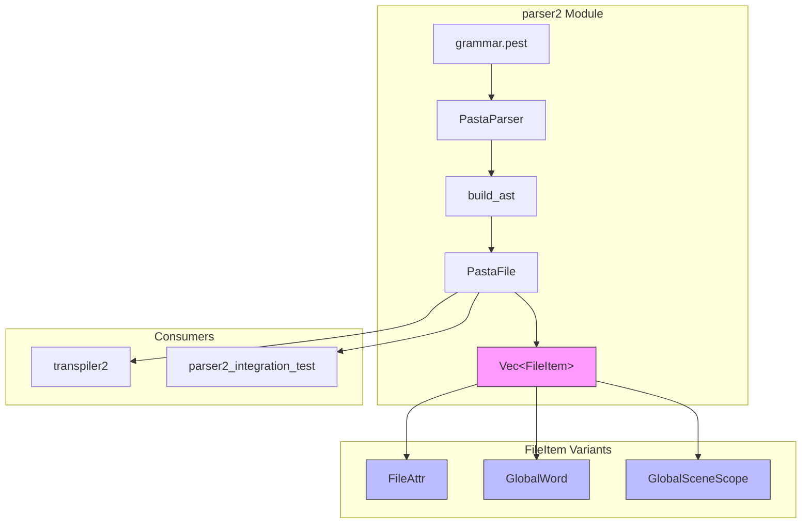
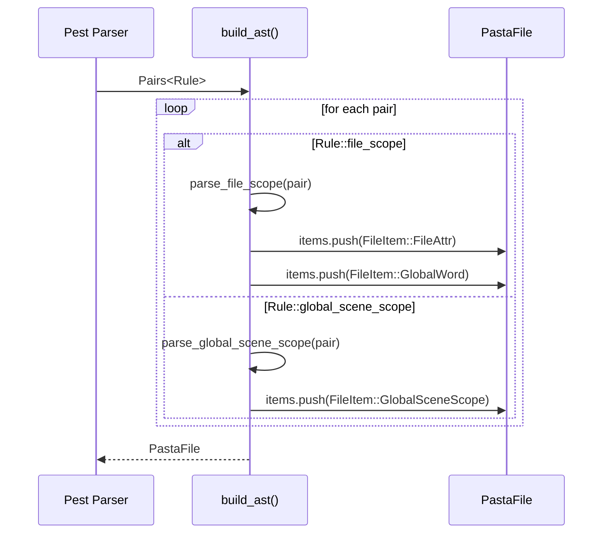
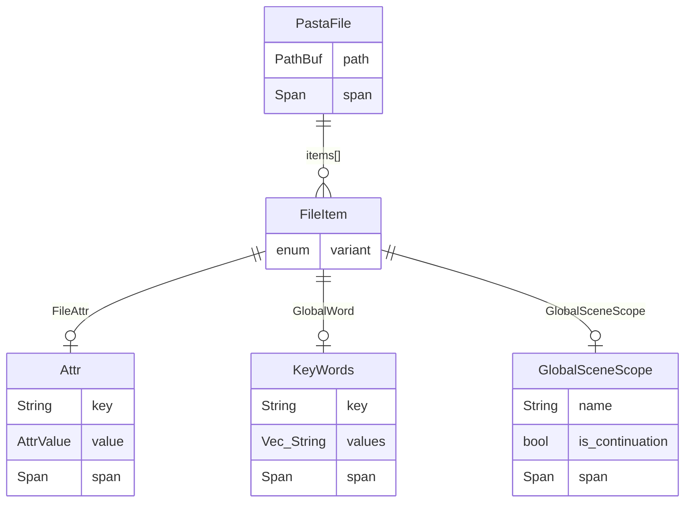

# 技術設計: parser2 FileScope複数出現バグ修正

## Overview

**Purpose**: parser2 が grammar.pest 仕様 `file = ( file_scope | global_scene_scope )*` に完全準拠し、複数の file_scope と global_scene_scope を任意順序・任意回数で正確に処理できるようにする。

**Users**: 
- **transpiler2開発者**: PastaFile.items を順次イテレートし、ファイルレベルコンテキストを積算
- **parser2メンテナー**: AST構造の文法準拠性を検証・保守
- **Pastaスクリプト作成者**: 複数の file_scope を使用した中規模スクリプト

**Impact**: PastaFile 構造体の破壊的変更（`file_scope` フィールド廃止、`items: Vec<FileItem>` 導入）により、既存の parser2 依存コードはコンパイルエラーで修正を強制される。

### Goals
- grammar.pest の `( file_scope | global_scene_scope )*` 仕様への完全準拠
- file_scope と global_scene_scope の交互出現順序を AST で保持
- transpiler2 が必要とする順次処理 API の提供
- 既存 transpiler（legacy parser 使用）への影響ゼロ

### Non-Goals
- parser（legacy）の修正
- transpiler2 の実装（本仕様はブロッキング依存解除のみ）
- grammar.pest 自体の変更

---

## Architecture

### Existing Architecture Analysis

**現行 parser2 AST 構造**:
```rust
pub struct PastaFile {
    pub path: PathBuf,
    pub file_scope: FileScope,              // ← 単一フィールド（バグ）
    pub global_scenes: Vec<GlobalSceneScope>,
    pub span: Span,
}
```

**問題点**:
- `file_scope` が単一フィールドのため、複数 file_scope 出現時に上書きされる
- grammar.pest の意図（交互出現・順序保持）を反映できない

**パーサーループの問題コード** (`src/parser2/mod.rs:135-138`):
```rust
Rule::file_scope => {
    file.file_scope = parse_file_scope(pair)?;  // BUG: 上書き
}
```

### Architecture Pattern & Boundary Map



**Architecture Integration**:
- **Selected Pattern**: Sum Type（列挙型）による多様なファイルレベルアイテムの統一表現
- **Domain Boundary**: parser2 モジュール内に閉じた変更、外部 API は PastaFile 型のみ
- **Existing Patterns Preserved**: 3層スコープ階層（File → GlobalScene → LocalScene）
- **New Component**: `FileItem` 列挙型（3バリアント）
- **Steering Compliance**: Rust 型安全性、文法準拠性、テスト必須

### Technology Stack

| Layer | Choice / Version | Role in Feature | Notes |
|-------|------------------|-----------------|-------|
| Parser | Pest 2.8 | PEG文法解析 | grammar.pest 変更なし |
| AST | Rust structs/enums | 型安全なAST表現 | FileItem 列挙型追加 |
| Runtime | N/A | - | 本仕様では変更なし |

---

## System Flows

### パーサーループフロー（修正後）



---

## Requirements Traceability

| Requirement | Summary | Components | Interfaces | Flows |
|-------------|---------|------------|------------|-------|
| 1.1 | Vec<FileItem> で 3 バリアント格納 | PastaFile, FileItem | items フィールド | Parser Loop |
| 1.2-1.4 | file_scope 内 attrs/words を個別 push | build_ast | parse_file_scope | Parser Loop |
| 1.5 | 順序保持 | PastaFile.items | - | Parser Loop |
| 1.6 | マージ禁止 | build_ast | - | - |
| 2.1 | FileItem 列挙型定義 | FileItem | enum variants | - |
| 2.2 | items フィールド追加 | PastaFile | items: Vec<FileItem> | - |
| 2.3-2.4 | 旧フィールド廃止 | PastaFile | - | - |
| 2.5 | ヘルパーメソッド | PastaFile | file_attrs(), words(), global_scene_scopes() | - |
| 3.1-3.4 | パーサーロジック修正 | build_ast | - | Parser Loop |
| 4.1-4.5 | テスト追加・移行 | Tests | - | - |
| 5.1-5.4 | transpiler2 互換 API | PastaFile | items イテレーション | - |
| 6.1-6.4 | エラー・ドキュメント | All | Span, docコメント | - |

---

## Components and Interfaces

| Component | Domain/Layer | Intent | Req Coverage | Key Dependencies | Contracts |
|-----------|--------------|--------|--------------|------------------|-----------|
| FileItem | AST | ファイルレベルアイテムの統一表現 | 2.1 | Attr, KeyWords, GlobalSceneScope (P0) | Enum |
| PastaFile | AST | ファイル全体のAST | 1.1, 2.2-2.5 | FileItem (P0) | Struct, Methods |
| build_ast | Parser | Pest出力→AST変換 | 1.2-1.6, 3.1-3.4 | PastaFile (P0), parse_file_scope (P0) | Function |
| parse_file_scope | Parser | file_scope ルール解析 | 1.2-1.3 | FileScope (P1) | Function |

### AST Layer

#### FileItem

| Field | Detail |
|-------|--------|
| Intent | ファイルレベルで出現する3種類のアイテムを統一的に表現 |
| Requirements | 2.1 |

**Responsibilities & Constraints**
- grammar.pest `( file_scope | global_scene_scope )*` の各要素を表現
- 所有権: 内包する Attr, KeyWords, GlobalSceneScope を所有

**Dependencies**
- Inbound: PastaFile.items — 格納先 (P0)
- Outbound: Attr — FileAttr バリアントの内部 (P0)
- Outbound: KeyWords — GlobalWord バリアントの内部 (P0)
- Outbound: GlobalSceneScope — バリアントの内部 (P0)

**Contracts**: Enum [x]

##### Enum Definition
```rust
/// ファイルレベルで出現するアイテムの統一表現
///
/// grammar.pest の `file = ( file_scope | global_scene_scope )*` に対応。
/// file_scope 内の attrs と words は個別のバリアントとして分離。
#[derive(Debug, Clone)]
pub enum FileItem {
    /// ファイルレベル属性（file_scope 内の attr）
    FileAttr(Attr),
    /// ファイルレベル単語定義（file_scope 内の key_words）
    GlobalWord(KeyWords),
    /// グローバルシーン
    GlobalSceneScope(GlobalSceneScope),
}
```

---

#### PastaFile

| Field | Detail |
|-------|--------|
| Intent | Pasta ファイル全体の AST 表現 |
| Requirements | 1.1, 2.2-2.5, 5.1-5.4 |

**Responsibilities & Constraints**
- ファイル内の全アイテムを記述順序で保持
- ヘルパーメソッドで型別アクセスを提供
- Span 情報でソース位置をトレース可能

**Dependencies**
- Inbound: build_ast — 構築元 (P0)
- Inbound: transpiler2 — 消費者 (P0)
- Outbound: FileItem — items 要素 (P0)

**Contracts**: Struct [x] / Methods [x]

##### Struct Definition
```rust
/// Pasta ファイル全体の AST 表現
///
/// grammar.pest `file = ( file_scope | global_scene_scope )*` に準拠。
/// 複数の file_scope と global_scene_scope を任意順序で保持。
#[derive(Debug, Clone)]
pub struct PastaFile {
    /// ソースファイルパス
    pub path: PathBuf,
    /// ファイルレベルアイテム（記述順序を保持）
    pub items: Vec<FileItem>,
    /// ソース位置
    pub span: Span,
}
```

##### Helper Methods
```rust
impl PastaFile {
    /// 新しい PastaFile を作成
    pub fn new(path: PathBuf) -> Self {
        Self {
            path,
            items: Vec::new(),
            span: Span::default(),
        }
    }

    /// すべてのファイルレベル属性を取得（記述順序）
    pub fn file_attrs(&self) -> Vec<&Attr> {
        self.items.iter().filter_map(|item| match item {
            FileItem::FileAttr(attr) => Some(attr),
            _ => None,
        }).collect()
    }

    /// すべてのファイルレベル単語定義を取得（記述順序）
    pub fn words(&self) -> Vec<&KeyWords> {
        self.items.iter().filter_map(|item| match item {
            FileItem::GlobalWord(word) => Some(word),
            _ => None,
        }).collect()
    }

    /// すべてのグローバルシーンを取得（記述順序）
    pub fn global_scene_scopes(&self) -> Vec<&GlobalSceneScope> {
        self.items.iter().filter_map(|item| match item {
            FileItem::GlobalSceneScope(gs) => Some(gs),
            _ => None,
        }).collect()
    }
}
```

---

### Parser Layer

#### build_ast

| Field | Detail |
|-------|--------|
| Intent | Pest パース結果を AST に変換 |
| Requirements | 1.2-1.6, 3.1-3.4 |

**Responsibilities & Constraints**
- file_scope 内の attrs/words を個別に FileItem として push
- 上書き代入を禁止し、すべて累積操作

**Dependencies**
- Inbound: Pest Pairs<Rule> — 入力 (P0)
- Outbound: PastaFile — 出力 (P0)
- Outbound: parse_file_scope — 一時的な FileScope 取得 (P1)

**Contracts**: Function [x]

##### Function Definition
```rust
/// Pest パース結果から AST を構築
///
/// # 修正点
/// - file_scope の上書き代入を廃止
/// - attrs/words を個別の FileItem として push
fn build_ast(pairs: Pairs<Rule>, filename: &str) -> Result<PastaFile, PastaError> {
    let mut file = PastaFile::new(std::path::PathBuf::from(filename));
    let mut last_global_scene_name: Option<String> = None;

    for pair in pairs {
        match pair.as_rule() {
            Rule::file_scope => {
                let fs = parse_file_scope(pair)?;
                // attrs を個別に push
                for attr in fs.attrs {
                    file.items.push(FileItem::FileAttr(attr));
                }
                // words を個別に push
                for word in fs.words {
                    file.items.push(FileItem::GlobalWord(word));
                }
            }
            Rule::global_scene_scope => {
                let scene = parse_global_scene_scope(
                    pair,
                    &mut last_global_scene_name,
                    filename,
                )?;
                file.items.push(FileItem::GlobalSceneScope(scene));
            }
            Rule::EOI => {}
            _ => {}
        }
    }

    Ok(file)
}
```

---

## Data Models

### Domain Model

**3層スコープ階層**（変更なし）:
```
PastaFile
  └── items: Vec<FileItem>
        ├── FileAttr(Attr)           ← file_scope 内
        ├── GlobalWord(KeyWords)     ← file_scope 内
        └── GlobalSceneScope         ← グローバルシーン
              └── local_scenes: Vec<LocalSceneScope>
```

### Logical Data Model



**Cardinality**:
- PastaFile : FileItem = 1 : 0..*（0個以上）
- FileItem は排他的に Attr, KeyWords, GlobalSceneScope のいずれか1つを保持

---

## Error Handling

### エラー報告の維持

**既存のエラーハンドリング機構**（PastaError）を継続使用:
- 各 FileItem バリアント内の型（Attr, KeyWords, GlobalSceneScope）は Span を保持
- パースエラー時は該当要素の Span から行番号・列番号を報告
- build_ast 内の `?` 演算子でエラー伝播

**新規エラーシナリオ**: なし（既存のエラーパターンで網羅）

---

## Test Strategy

### テストカテゴリ

| Category | Scope | Key Scenarios |
|----------|-------|---------------|
| Unit | FileItem enum | バリアント判定、パターンマッチ |
| Unit | PastaFile helpers | file_attrs(), words(), global_scene_scopes() |
| Integration | build_ast | 複数 file_scope、交互出現、順序保持 |
| Regression | 既存テスト移行 | parser2_integration_test.rs 6箇所 |

### テストフィクスチャ

**comprehensive_control_flow2.pasta**（更新済み）:
- 4つのグローバルシーン
- 3回のファイルスコープ（属性・単語）
- FileAttr, GlobalWord, GlobalSceneScope の交互出現

### 既存テスト移行パターン

```rust
// Before
assert!(file.file_scope.attrs.is_empty());
assert!(file.file_scope.words.is_empty());

// After
assert!(file.file_attrs().is_empty());
assert!(file.words().is_empty());
```

---

## Migration Guide

### 破壊的変更

| 廃止 | 代替 |
|------|------|
| `file.file_scope` | `file.items` + パターンマッチ or `file.file_attrs()` |
| `file.global_scenes` | `file.global_scene_scopes()` |
| `file.file_scope.attrs` | `file.file_attrs()` |
| `file.file_scope.words` | `file.words()` |

### セマンティックバージョニング

本変更は **メジャーバージョンアップ** が必要:
- PastaFile のパブリック API 変更
- 既存コードはコンパイルエラーで修正を強制

---

## Implementation Checklist

- [ ] **Phase 1**: FileItem enum 定義（`src/parser2/ast.rs`）
- [ ] **Phase 2**: PastaFile 構造体変更（items フィールド追加、旧フィールド廃止）
- [ ] **Phase 3**: ヘルパーメソッド実装
- [ ] **Phase 4**: build_ast 修正（上書き代入 → push 操作）
- [ ] **Phase 5**: 既存テスト修正（6箇所）
- [ ] **Phase 6**: 新規テスト追加（交互出現シナリオ）
- [ ] **Phase 7**: docコメント・移行ガイド更新

---

## References

- `src/parser2/grammar.pest:222` - 文法定義
- `src/parser2/ast.rs` - 現行 AST 構造
- `src/parser2/mod.rs:135-138` - バグのあるパーサーループ
- `.kiro/specs/parser2-filescope-bug-fix/research.md` - 詳細リサーチログ
- `.kiro/specs/parser2-filescope-bug-fix/gap-analysis.md` - 実装ギャップ分析
