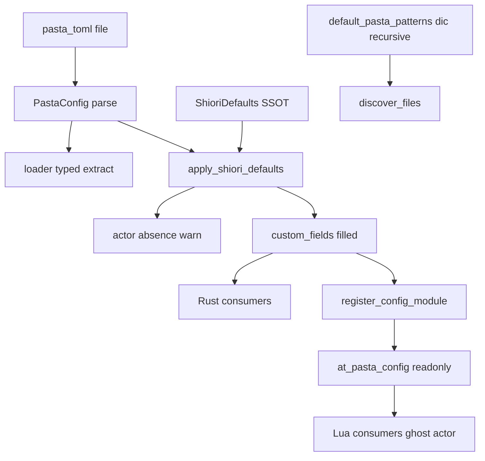
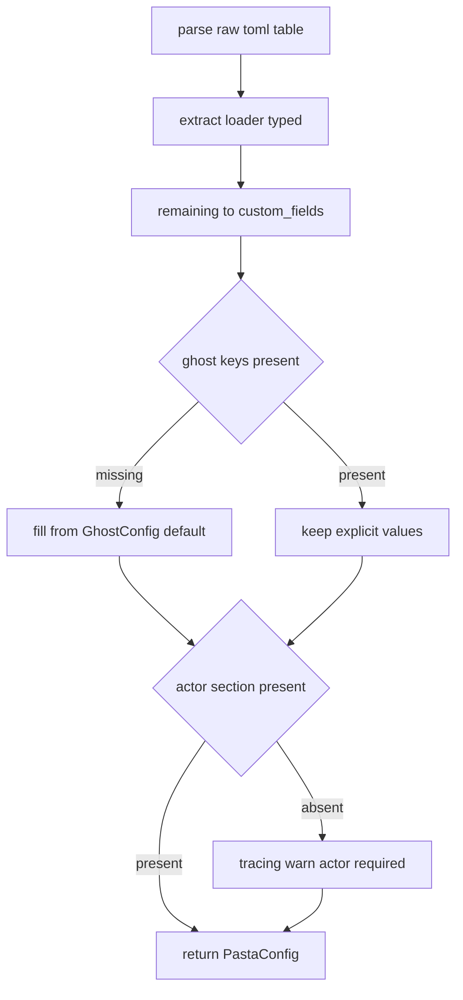

# Technical Design Document

## Overview

**Purpose**: 本機能は、ゴースト作者の `pasta.toml` 記述負担を軽減する。`pasta.toml` ロード後に**単一のデフォルト適用ステップ**を通し、省略された設定を **SHIORI プロファイルのデフォルト表（SSOT）** から補完することで、作者は「最小限の必須セクションだけ」でゴーストを起動できる。

**Users**: pasta DSL でゴーストを書く作者が、最小テンプレート（`[actor]` のみ）から始め、必要に応じてフルリファレンスを参照する。

**Impact**: 現状、デフォルト値は Rust の serde `Default` 実装と Lua リテラル（`CONFIG.get(...,1.5)` 等）に分散している。本機能はこれを **Rust 側の単一の補完ステップ（SSOT）** に集約し、`@pasta_config` 経由で Lua が見る値を Rust と一致させる。設定の解釈経路は変えず、補完の一元化と分類の確立、サンプル/ドキュメントの是正のみを行う（完全後方互換）。

### Goals
- `pasta.toml` 全セクション/フィールドを「SHIORI デフォルト有（省略可）/ 必須（デフォルト不能）/ エンジンプロファイル専用」へ一意分類する。
- ロード後の**単一補完ステップ**で省略値を SSOT から補完し、明示値は上書きしない。Rust/Lua 経路で同一値を提供する。
- 最小構成（`[actor]` のみ）で慣例 dic 配置（`dic/` 直下 `*.pasta` を含む）の辞書を読み込んで起動する。
- 最小テンプレート/フルリファレンステンプレートの2層を SSOT から提供し、値の乖離を自動ガードする。
- 既存フル記述（hello-pasta 等）の完全後方互換を回帰確認で担保する。

### Non-Goals
- 将来エンジンプロファイルのデフォルト**値の確定・実装**（概念と予約に留める）。
- セクション名のリネーム/名前空間による物理的再グルーピング（アプローチ B）。
- 設定値のバリデーション強化（型安全ラッパー等）。`[actor]` 不在の軽量警告を超える検証は行わない。
- `pasta.toml` ファイル不在の許容（存在は引き続き必須）。
- 設定解釈以外のランタイム挙動（トーク合成・永続化・デバッグ基盤）の変更。

## Boundary Commitments

### This Spec Owns
- `pasta.toml` 各セクション/フィールドの**3分類**（SHIORI デフォルト有 / 必須 / エンジンプロファイル専用）の確立。
- **SHIORI プロファイルのデフォルト表（SSOT）**と、ロード後の**単一補完ステップ** `PastaConfig::apply_shiori_defaults`。
- `[ghost]` のデフォルト値の権威ソース（新設 `GhostConfig`）。
- `pasta_patterns` の SHIORI デフォルト値（慣例 dic 配置を網羅する glob）。
- `[actor]` を唯一の必須とする定義と、不在時の軽量警告（`tracing::warn`）。
- `[package]` のエンジンプロファイル分類とサンプル/テンプレートからの除去。
- 最小/フルリファレンステンプレートの内容定義と、テンプレート値↔SSOT の自動ガード。
- 利用者ドキュメント（設定リファレンス・README・入門章）への分類反映。

### Out of Boundary
- 将来エンジンプロファイルのデフォルト値・スキーマの実装（予約のみ）。
- 設定構造体の型パース移管（`[ghost]`/`[actor]` は引き続き `custom_fields` 経由で Lua に透過。`GhostConfig` は**値の供給源**であり抽出経路ではない）。
- Lua ランタイムのモジュール構成・`@pasta_config` 公開機構そのものの変更。
- 永続化・トーク合成・デバッグ（`[debug]`）の挙動変更。

### Allowed Dependencies
- `crates/pasta_lua/src/loader/config.rs`（`PastaConfig` / 各 `*Config` / `default_*()`）— 補完ステップと SSOT の所在。
- `crates/pasta_lua/src/loader/discovery.rs`（glob 探索）— `pasta_patterns` 既定の消費側。
- `crates/pasta_lua/src/runtime/module_registry.rs`（`register_config_module` / `@pasta_config`）— 補完済み `custom_fields` の Lua 公開。
- `tracing`（既存ロギング基盤）— `[actor]` 不在警告。
- `toml` / `serde`（既存）— 補完とデフォルト。
- 既存ドリフト検出基盤（`book/tools/drift-check.mjs` / `manual-sources.toml`）— ドキュメント↔仕様の同期（任意流用）。

### Revalidation Triggers
- SHIORI プロファイルのデフォルト**値**の変更（SSOT 変更 → テンプレート/ドキュメント/Lua フォールバックの再確認）。
- `pasta_patterns` 既定 glob の変更（辞書探索挙動の変化 → 既存ゴーストの回帰）。
- `[actor]` 必須定義・警告契約の変更（下流の起動前提）。
- 将来エンジンプロファイルの値確定を行う別仕様の着手（`[package]` 予約の消費）。
- `custom_fields` → `@pasta_config` 公開形状の変更（Lua 消費側の前提）。

## Architecture

### Existing Architecture Analysis

設定は Phase 1（`PastaLoader::load_with_config`, `loader/mod.rs:110`）で `PastaConfig::load` が一度だけ生成する。`PastaConfig::parse`（`config.rs:59`）は `[loader]` のみ型抽出し、**残り全セクションを `custom_fields: toml::Table`** に保持する。

- 型セクション（`[loader]`/`[logging]`/`[persistence]`/`[lua]`/`[talk]`/`[debug]`）は serde `Default` で省略時補完済み（Rust が消費）。
- `[ghost]`/`[actor]` は **Rust 型を持たず**、`register_config_module`（`module_registry.rs:58`）が `custom_fields` を read-only Lua テーブル `@pasta_config` として公開し、Lua のみが消費する（`act.lua` / `virtual_dispatcher.lua` / `store.lua`）。`[ghost]` のデフォルトは **Lua リテラル**（`1.5`/`180`/`300`/`30`）が事実上の権威。
- `[package]` はどのコードパスからも未消費。
- `PastaConfig::load` はファイル不在で `ConfigNotFound`（維持）。

**保たれる制約**: `parse` が唯一の設定生成点であること、`custom_fields` が Lua 公開の単一経路であること、glob 探索（`discovery.rs`）が `pasta_patterns` を消費すること。

### Architecture Pattern & Boundary Map

選定パターン: **単一チョークポイントでのデフォルト正規化（Normalization at a single choke point）**。`parse` 内で `custom_fields` に SHIORI プロファイルのデフォルトを補完してから、Rust 消費・Lua 公開の両経路へ流す。これにより R1/R2/R3/R5 が単一機構で満たされる（generalization）。



**Architecture Integration**:
- Selected pattern: 単一補完チョークポイント（`apply_shiori_defaults`）。`parse` の戻り直前で適用。
- Domain boundaries: 「デフォルト値の供給（SSOT）」「補完の適用（`apply_shiori_defaults`）」「Lua 公開（既存 `register_config_module`）」を分離。
- Existing patterns preserved: serde `Default` 補完、`custom_fields` 単一公開経路、`tracing::warn` 警告（`RuntimeConfig::validate_and_warn` と同型）、glob `**`。
- New components rationale: `GhostConfig`（`[ghost]` の Rust SSOT・既存 `TalkConfig` を踏襲）、`apply_shiori_defaults`（補完チョークポイント）。
- Steering compliance: レイヤー依存方向（loader 内に閉じる）維持、テストは `<feature>_test.rs`、エラーは `Result<_, LoaderError>`。

### Technology Stack

| Layer | Choice / Version | Role in Feature | Notes |
|-------|------------------|-----------------|-------|
| Backend / Config | Rust 2024, `serde` 1, `toml` 1.1.2 | デフォルト補完・SSOT・分類 | 既存依存のみ。新規依存なし |
| Runtime bridge | `mlua` 0.11（既存） | 補完済み `custom_fields` の `@pasta_config` 公開 | 変更は補完済みデータの透過のみ |
| Discovery | `glob` 0.3（既存） | `dic/**/*.pasta` 既定での辞書探索 | `**` は flat+nested を網羅（discovery テストで確認） |
| Logging | `tracing` 0.1（既存） | `[actor]` 不在の軽量警告 | 起動は妨げない |
| Test | `insta` 1.47 / `tempfile` 3（既存） | テンプレート値↔SSOT ガード、最小/フル等価性 | 新規ツール不要 |

新規依存はない。

## File Structure Plan

### Modified Files
- `crates/pasta_lua/src/loader/config.rs` — 中核。(1) `GhostConfig`（`[ghost]` SSOT、`Default`、既存 `TalkConfig` を踏襲）を追加。(2) `default_pasta_patterns` を `["dic/**/*.pasta"]` へ拡張。(3) `PastaConfig::apply_shiori_defaults(&mut self)` を新設し、`custom_fields` の `[ghost]` 欠落キーを SSOT から補完しつつ `[actor]` 不在を `tracing::warn` で判別可能化。(4) `parse` の戻り直前で `apply_shiori_defaults` を1回呼ぶ。
- `crates/pasta_sample_ghost/ghosts/hello-pasta/ghost/master/pasta.toml` — `[package]` セクションと、冒頭コメント「必須項目は `[package]` と `[loader]` のみ」を除去・是正（最小は `[actor]` のみである旨へ）。
- `.claude/skills/pasta-ghost-authoring/references/pasta-toml.md` — 設定リファレンスをプロファイルモデルへ再構成（分類列・最小例・フルリファレンス・`[package]` 予約注記）。
- `crates/pasta_lua/README.md` — 「設定ファイル（pasta.toml）」章に分類と最小構成を反映。
- `book/src/getting-started/first-ghost.md` — 最小構成 `pasta.toml` 例（`[actor]` のみ）を提示。
- `crates/pasta_lua/tests/loader/config_test.rs` — `custom_fields.is_empty()`（[ghost] 実体化）と `pasta_patterns` 既定（`dic/**`）の期待値を改訂（Owned Test Updates）。
- `crates/pasta_lua/src/loader/discovery.rs` — 既定 glob 変更に伴うテスト期待値の更新（直下/多階層の発見、ネスト不変の回帰を追加）。
- `crates/pasta_sample_ghost/tests/integration_test.rs` — `[package]` 存在 assert を不在 assert へ改訂（cross-spec、R4 が旧 Req 7.1 を上書き）。

### New Files
- `crates/pasta_lua/tests/loader/config_defaults_test.rs` — 補完・SSOT・`[actor]` 警告・最小/フル等価性の統合テスト（`tests/loader/main.rs` に `mod` 追加）。
- `crates/pasta_lua/tests/fixtures/loader/minimal_actor_only/pasta.toml` — 最小構成フィクスチャ（`[actor]` のみ）。
- `crates/pasta_lua/tests/fixtures/loader/minimal_actor_only/dic/talk.pasta` — `dic/` 直下配置の辞書（R2.5 検証用）。

> 依存方向: SSOT（`GhostConfig`/`default_*`）→ `apply_shiori_defaults`（config.rs 内）→ `register_config_module`（runtime）。config は runtime に依存しない（既存方向を維持）。テンプレート/ドキュメントは値を SSOT から参照する側で、コードへ依存を持ち込まない。

## System Flows

### Flow: ロード時のデフォルト補完と actor 判別（Process）



補完はキー単位（フィールドごとに欠落のみ補完）で、明示値は不変（R3.2/R3.4）。`[actor]` 不在は警告のみで起動継続（R2.3）。この単一ステップの後、Rust 消費側も Lua 公開側（`@pasta_config`）も同一の補完済み値を見る（R3.1/R3.3）。

## Requirements Traceability

| Requirement | Summary | Components | Interfaces | Flows |
|-------------|---------|------------|------------|-------|
| 1.1, 1.5 | 全セクション/フィールドの一意3分類 | ShioriDefaults（分類定義）/ ドキュメント | 分類表（リファレンス） | — |
| 1.2, 1.3 | SHIORI デフォルトを SSOT として明示 | GhostDefaults + default_* | `GhostConfig::default`, `default_*()` | — |
| 1.4 | エンジンプロファイル専用の明示と予約 | 分類（[package]） | リファレンス注記 | — |
| 2.1, 2.4 | `[actor]` のみ必須、他は省略可 | apply_shiori_defaults | `PastaConfig::apply_shiori_defaults` | 補完フロー |
| 2.2 | 最小構成で起動 | apply_shiori_defaults + loader | `PastaConfig::parse` | 補完フロー |
| 2.3 | `[actor]` 不在の軽量警告（継続） | actor 警告 | `tracing::warn` | 補完フロー |
| 2.5 | 最小構成で慣例 dic 配置を読込 | default_pasta_patterns + discovery | `default_pasta_patterns` | — |
| 3.1, 3.3 | ロード後単一補完、Rust/Lua 一貫 | apply_shiori_defaults + register_config_module | `apply_shiori_defaults`, `register_config_module` | 補完フロー |
| 3.2, 3.4 | フィールド単位補完・明示値不変 | apply_shiori_defaults | `PastaConfig::apply_shiori_defaults` | 補完フロー |
| 3.5 | ファイル不在不許容（維持） | PastaConfig::load | `PastaConfig::load`（既存） | — |
| 4.1, 4.2 | `[package]` をエンジン予約に分類 | 分類 + ドキュメント | リファレンス注記 | — |
| 4.3, 4.4 | テンプレ/サンプルから `[package]` 除去 | hello-pasta pasta.toml + テンプレート | サンプル/最小テンプレート | — |
| 4.5 | 既存 `[package]` を無視起動 | custom_fields（未消費） | （挙動維持） | — |
| 5.1, 5.2, 5.3 | 最小/フルリファレンステンプレート2層 | テンプレート定義 | テンプレート（doc） | — |
| 5.4, 5.5 | テンプレ値が SSOT 由来・乖離しない | SSOT ガードテスト | `config_defaults_test` | — |
| 6.1, 6.2, 6.3 | 完全後方互換（既存テスト意図維持） | apply_shiori_defaults（非破壊） | 既存テスト群 | — |
| 6.4 | 回帰確認（フル/最小・起動/辞書読込） | config_defaults_test + fixtures | ローダ/統合テスト | 補完フロー |
| 7.1, 7.2, 7.3, 7.4 | ドキュメントへ分類・最小例反映 | リファレンス/README/入門章 | doc 群 | — |

## Components and Interfaces

| Component | Domain/Layer | Intent | Req Coverage | Key Dependencies (P0/P1) | Contracts |
|-----------|--------------|--------|--------------|--------------------------|-----------|
| GhostConfig | loader/config | `[ghost]` の SHIORI デフォルト SSOT | 1.2, 1.3, 3.3 | toml/serde (P1) | State |
| apply_shiori_defaults | loader/config | ロード後の単一補完＋actor 判別 | 2.1–2.4, 3.1–3.4 | GhostConfig (P0), tracing (P1) | Service |
| default_pasta_patterns | loader/config | 慣例 dic 配置を網羅する既定 glob | 2.5 | discovery (P0) | State |
| ConfigClassification & Templates | docs | 3分類・最小/フルテンプレート | 1.1,1.4,1.5,4.x,5.1–5.3,7.x | SSOT (P1) | — |
| config_defaults_test | tests | SSOT ガード・等価性・警告・回帰 | 5.4,5.5,6.x | apply_shiori_defaults (P0) | Batch |

### loader/config

#### GhostConfig

| Field | Detail |
|-------|--------|
| Intent | `[ghost]` の SHIORI デフォルト値の単一供給源（SSOT） |
| Requirements | 1.2, 1.3, 3.3 |

**Responsibilities & Constraints**
- `talk_interval_min=180` / `talk_interval_max=300` / `hour_margin=30` / `spot_newlines=1.5` を `Default` で保持する（現行 Lua リテラルと同値）。
- `[ghost]` を `custom_fields` から**抽出しない**。値の供給のみを担い、Lua 公開経路（`@pasta_config`）は不変。
- 既存 `TalkConfig`/`LoggingConfig` と同じ「`Default` ＋ `default_*()` 関数」規約に従う。

**Dependencies**
- Outbound: `apply_shiori_defaults` — 補完値の供給 (P0)
- External: `serde`/`toml` — 値表現 (P1)

**Contracts**: State [x]

##### State Management
- State model: 不変のデフォルト定数群（`Default` 実装）。
- Persistence & consistency: SSOT。テンプレート/ドキュメント/Lua フォールバックは本値と一致しなければならない（`config_defaults_test` が保証）。

**Implementation Notes**
- Integration: `apply_shiori_defaults` が `GhostConfig::default()` から欠落キーを補完。
- Validation: `Deserialize` 付与は任意（値供給のみが必須責務）。型抽出に転用しないこと。
- Risks: Lua フォールバックリテラルとの二重管理 → 等価性テストで固定。

#### apply_shiori_defaults

| Field | Detail |
|-------|--------|
| Intent | ロード後に SHIORI プロファイルのデフォルトを `custom_fields` へ補完する単一チョークポイント |
| Requirements | 2.1, 2.2, 2.3, 2.4, 3.1, 3.2, 3.3, 3.4 |

**Responsibilities & Constraints**
- `custom_fields["ghost"]` の欠落キーのみを `GhostConfig::default()` から補完する（フィールド単位・明示値不変）。
- `custom_fields` に `[actor]` セクションが存在しない場合に `tracing::warn`（利用者が判別可能・起動は継続）。
- `parse` の戻り直前で**ちょうど1回**呼ばれる。Rust 消費・Lua 公開の双方がこの補完後の状態を見る。
- 補完対象は SHIORI プロファイルの custom-field セクション（現状は `[ghost]` のみ）。型セクションの既定は各 `Default` 実装が担い、`[package]`（エンジン専用）は補完しない。

**Dependencies**
- Inbound: `PastaConfig::parse` — 唯一の呼び出し元 (P0)
- Outbound: `GhostConfig` — 既定値供給 (P0); `tracing` — 警告 (P1)

**Contracts**: Service [x]

##### Service Interface
```rust
impl PastaConfig {
    /// Fill missing SHIORI-profile defaults into custom_fields and warn when
    /// no `[actor]` is defined. Idempotent; never overrides explicit values.
    fn apply_shiori_defaults(&mut self);
}
```
- Preconditions: `custom_fields` は raw TOML（`[loader]` 抽出後）を保持。
- Postconditions: `custom_fields["ghost"]` の全既定キーが存在（明示値は不変）。`[actor]` 不在時に警告が1回発火。
- Invariants: 冪等（再適用で値が変わらない）。既存キー・既存値を破壊しない。

**Side Effect（@pasta_config 形状）**
- `[ghost]` を**常に実体化**するため、作者が `[ghost]` を書かなくても補完後の `custom_fields` に `ghost` セクションが現れ、`@pasta_config.ghost.*` が常に存在する。これは R3.3（Rust/Lua 一貫）を満たすための意図的挙動。
- Lua 消費側（`CONFIG.get("ghost", key, fallback)`）はフォールバック付きのため影響なし（補完値＝従来フォールバック値で観測上不変）。
- ただし `custom_fields` の内容を直接 assert する既存テストには影響する（下記 Testing → Owned Test Updates）。

**Implementation Notes**
- Integration: `parse` 内 `Ok(Self { loader, custom_fields })` 構築直後に `self.apply_shiori_defaults()` を適用してから返す。
- Validation: `[actor]` 検出は `custom_fields.get("actor")` がテーブルかで判定。空起動を妨げない。
- Risks: `[ghost]` 以外の Lua 消費が将来増えた場合は補完対象に追加（現状不要）。

#### default_pasta_patterns（既定 glob 拡張）

| Field | Detail |
|-------|--------|
| Intent | 最小構成で慣例 dic 配置（flat/nested 双方）の辞書を読み込む既定 |
| Requirements | 2.5 |

**Responsibilities & Constraints**
- 既定値を `["dic/*/*.pasta"]` から `["dic/**/*.pasta"]` へ変更する。`**` は 0 階層を含む**任意深さ**に一致し、`dic/talk.pasta`（直下）・`dic/greeting/hello.pasta`（一階層）・`dic/a/b/c.pasta`（多階層）を網羅する（`discovery.rs` の既存 `**` 取り扱いで確認済み）。
- **設計ディスカッションで再帰形（任意深さ）を明示採用**。従来既定（一階層のみ）では非対象だった「直下」と「二階層以深」がともに読込対象化する。これは意図的な既定拡張であり、加算的（既存の一階層マッチは不変）。
- 明示的に `pasta_patterns` を指定した既存ゴーストには影響しない（hello-pasta は自前指定）。

**Implementation Notes**
- Integration: `discovery::discover_files` が消費。`profile/` 除外・トラバーサル拒否・シンボリックリンク除外は不変。
- Validation: `discovery.rs` に flat（直下）・一階層・多階層の発見を検証するテストを追加。既存ネスト構成が従来通り読込まれることも回帰固定（検証 Issue 3）。
- Risks: 直下/多階層に `*.pasta` を持つ既存ゴーストで読込対象が増える（加算的・低リスク）。Revalidation Trigger に明記済み。

### docs

#### ConfigClassification & Templates（サマリ＋実装ノート）

| Field | Detail |
|-------|--------|
| Intent | 3分類の確立、最小/フルリファレンステンプレートの提供、ドキュメント反映 |
| Requirements | 1.1, 1.4, 1.5, 4.1, 4.3, 4.4, 5.1, 5.2, 5.3, 7.1, 7.2, 7.3, 7.4 |

**Implementation Notes**
- 分類（各セクション/フィールド → SHIORI デフォルト有 / 必須 / エンジンプロファイル専用）を設定リファレンス（`pasta-toml.md`）に表として確立。`[package]` はエンジンプロファイル専用＝SHIORI では不要と明示（1.4/4.1）。
- **最小テンプレート**: 必須 `[actor]` のみ（`[package]`/`[loader]` を含まない）。**フルリファレンステンプレート**: 全セクション/フィールドを分類・SHIORI デフォルト注記付きで網羅。
- テンプレート/ドキュメントに現れる既定値は **SSOT 由来**。値の乖離は `config_defaults_test` が固定（5.4/5.5）。文章レベルの同期は既存 `book` drift-check 基盤を任意流用。
- README（`pasta_lua`）・入門章（`first-ghost.md`）に最小構成例を反映（7.2/7.4）。

## Error Handling

### Error Strategy
本機能はエラー経路を増やさない。`[actor]` 不在は**エラーではなく警告**（`tracing::warn`、起動継続：R2.3）。ファイル不在は既存 `LoaderError::ConfigNotFound` を維持（R3.5）。デフォルト補完は失敗しない純粋操作（欠落キー挿入のみ）。

### Error Categories and Responses
- **User Errors**: `[actor]` 未定義 → 警告ログで判別可能化（起動は継続、沈黙しない）。`[package]` 等の不要記述 → 無視（エラー化しない：R4.5）。
- **System Errors**: `pasta.toml` 不在 → 既存 `ConfigNotFound`（変更なし）。TOML パース失敗 → 既存 `LoaderError::config`（変更なし）。
- **Business Logic Errors**: なし（バリデーション強化は対象外）。

### Monitoring
- `tracing::warn`（actor 不在）/ `tracing::debug`（補完済みセクション）を既存ロギング基盤へ出力。`RuntimeConfig::validate_and_warn` と同様の観測性。

## Testing Strategy

### Unit Tests
- `GhostConfig::default` が `180/300/30/1.5` を返す（SSOT 値固定）。
- `apply_shiori_defaults` が `[ghost]` 欠落キーのみ補完し、明示値（例: `talk_interval_min=120`）を上書きしない（3.2/3.4）。
- `apply_shiori_defaults` の冪等性（二重適用で不変）。
- `default_pasta_patterns` が `["dic/**/*.pasta"]` を返す（2.5）。

### Integration Tests（`config_defaults_test.rs` ＋ fixtures）
- 最小構成（`[actor]` のみ・`dic/talk.pasta` 直下配置）で起動し辞書が読み込まれる（2.2/2.5/6.4）。
- 最小構成と等価なフル記述で、`@pasta_config.ghost.*` が同値になる（Rust/Lua 一貫：3.1/3.3）。
- `[actor]` 不在で警告が発火し、かつ起動が停止しない（2.3）。`tracing-test` でログ捕捉。
- SSOT ガード: フルリファレンステンプレートの既定値が `GhostConfig::default()`/`default_*()` と一致（5.4/5.5）。Lua フォールバックリテラル（`1.5/180/300/30`）も SSOT と一致。
- 後方互換: `[package]` を含む既存フル記述（hello-pasta 形式）が無警告・無挙動変化で起動（6.1/6.2）。

### R6.3 の解釈（後方互換の射程）
R6.3「既存テストの意図を破壊しない」は、**ランタイム/パース挙動の互換**を指す。本仕様が**意図的に変更する**設定既定値・サンプル内容・`custom_fields` 形状については、対応する assert を本仕様が**改訂所有**して救済する（破壊ではなく仕様駆動の更新）。失敗テストは可能な限りコード（テスト）修正で救済し、放置・要件緩和は行わない。

### Owned Test Updates（本仕様がスコープ所有して改訂する既存テスト）
- `loader/config_test.rs:131` `custom_fields.is_empty()` → `[ghost]` 実体化に伴い、`ghost` 補完後の内容を assert する形へ改訂（明示カスタムフィールドの保持は維持）。
- `loader/config_test.rs:115,140,209` 等 `pasta_patterns == ["dic/*/*.pasta"]` → 新既定 `["dic/**/*.pasta"]` へ期待値更新。
- `loader/discovery.rs` テスト群 → 既定変更に伴う期待値更新。`profile/` 除外・トラバーサル拒否・シンボリックリンク除外は不変として固定。
- `pasta_sample_ghost/tests/integration_test.rs:75-102` `[package]` 存在 assert（旧サンプル仕様の「Req 7.1」）→ `[package]` **不在**を assert する形へ改訂。旧期待は本仕様 R4 が上書きする（cross-spec 改訂を本仕様が所有）。

### Regression（意図を維持すべき既存テスト：6.1/6.3）
- `loader/startup_test.rs`・`config_actors_initialization_test.rs`・`shiori/virtual_event_config_test.rs`・`pasta_sample_ghost/tests/dist_src_validation_test.rs` は**挙動不変**で通ること（フル記述・最小構成の双方）。
- `@pasta_config` 経由の Lua 消費（`act.lua`/`virtual_dispatcher.lua`/`store.lua`）が補完前後で同値であること（R3.3）。

## Security Considerations
- `[actor]` 警告はパスや機密を含まない一般メッセージに留める。
- `discovery.rs` の `**` 拡張後も既存のトラバーサル拒否・`profile/` 除外・シンボリックリンク/ジャンクション除外は不変であり、探索範囲は base_dir 内に限定される（新たな探索面を増やさない）。
