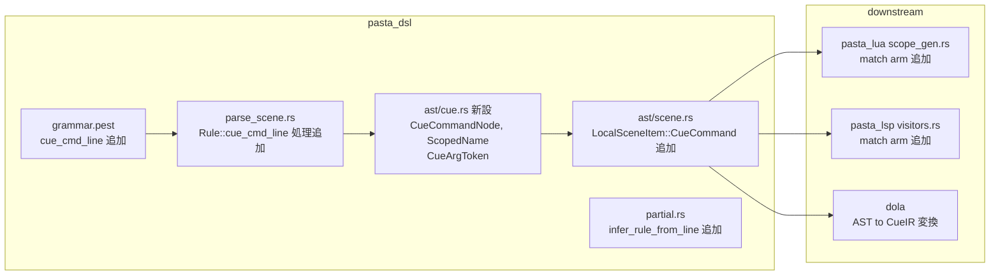

# 設計書: pasta-cue-dsl-extension

> **バージョン**: v1（2026-03-07）
> **親仕様**: `.kiro/specs/pasta-cue-dsl-extension/dola-cue-pasta-dsl-extension/`
> **要件定義書**: `requirements.md` v4

---

## 概要

**目的**: pasta_dsl クレートの PEG 文法と AST に `!` キューコマンド行の構文解析を追加し、下流処理系（dola, LSP）が型安全にキューコマンド情報にアクセスできるようにする。

**利用者**: dola クレート（CueIR 変換・CueSheet 構築）、pasta_lsp（エディタ支援）、スクリプト作者（構文エラー検出）。

**影響範囲**: pasta_dsl クレート内の文法拡張と AST 型追加。pasta_core は変更なし。pasta_lua、pasta_lsp は新 `LocalSceneItem::CueCommand` バリアントの match arm 追加のみ。既存スクリプトへの破壊的変更はゼロ。

### ゴール

- `!id[@scoped_ident][(args)]` 形式のキューコマンド行を `local_scene_item` としてパースする
- コマンド名・オプショナルな ScopedName・引数トークン列・Span を持つ `CueCommandNode` を AST に保持する
- シーン内に `!` 行が存在するかを AST レベルで検出可能にする
- 既存スクリプトの構文解析結果を一切変更しない

### 非ゴール

- コマンド名の意味解釈（emote/choice/mark 等の判定は dola 側）
- 日本語エイリアス解決（表情/選択肢 等は dola 側）
- CueIR 型の定義・保持（dola 側）
- start_time 計算、Duration Resolver（dola 側）
- mark/seek/alias/routing の意味解釈（dola 側）
- 未知コマンド名のエラー報告（dola 側）
- ActionLine / ContinueAction / SceneActorItem の変更

---

## アーキテクチャ

### 既存アーキテクチャ分析

現在の pasta_dsl パーサーは以下の構造を持つ:

- **grammar.pest**: pest 2.x PEG 文法。行指向。`local_scene_item` は silent rule で 4 バリアント（`var_set_line | call_scene_line | action_line | continue_action_line | blank_line`）
- **AST 型**: `ast/mod.rs` が `span.rs`, `scene.rs`, `action.rs` を re-export。`LocalSceneItem` enum は `VarSet`, `CallScene`, `ActionLine`, `ContinueAction` の 4 バリアント
- **パーサー**: `parse_scene.rs` が `parse_local_start_scene_scope` / `parse_local_scene_scope` で `Rule` マッチにより AST 構築
- **partial.rs**: `infer_rule_from_line` が行頭文字で pest Rule を推論

**既存マーカー使用状況**:
- `!` / `！` は**未使用マーカー**。既存の全角/半角ペアパターン（`＊/*`, `＠/@`, `＆/&` 等）に準拠して追加可能
- `lparen`/`rparen` は既存（lines 36-37）。`comma` も既存（line 41）
- `id` ルール（line 22）は `reserved_id` を除く任意の XID 識別子にマッチ
- `string_literal`（line 103）、`number_literal`（line 126）は既存
- `at`（line 26）は `@` / `＠` に既にマッチ

### アーキテクチャパターンと境界マップ

**採用パターン**: 既存パーサーの拡張。親仕様 Option C' に準拠し、pasta_core は構造的 AST 出力のみを担当する。



**境界の責務分担**:

| 境界 | 責務 | 責務外 |
|------|------|--------|
| pasta_dsl PEG 文法 | `!` 行の認識・構文解析・トークン抽出 | コマンドの意味解釈 |
| pasta_dsl AST | `CueCommandNode` に構造的情報を保持 | dola 型への変換 |
| dola コンパイラ | AST → CueIR 変換 | テキスト解析 |
| pasta_lua | 新バリアントを無視（skip） | キュー処理 |
| pasta_lsp | 新バリアントのトークン生成 | 意味解析 |

### テクノロジースタック

| レイヤー | 技術 / バージョン | 役割 | 備考 |
|---------|----------------|------|------|
| DSL 文法 | pest 2.8.6 | PEG ルール追加 | 既存依存、変更なし |
| 言語 | Rust 2024 Edition | AST 型・パーサー実装 | 既存スタック |
| エラー | thiserror 2 | ParseError 既存型利用 | 新エラー型不要 |

---

## 要件トレーサビリティ

| 要件 | サマリー | コンポーネント | インターフェース |
|------|---------|--------------|----------------|
| 1.1 | `!`/`！` 行を local_scene_item として解析 | PEG 文法, parse_scene.rs | `cue_cmd_line` ルール |
| 1.2 | コマンド名を任意の `id` として受理 | PEG 文法 | `cue_cmd_name` ルール |
| 1.3 | `!id@scoped_ident` を CueCommandNode に保持 | PEG 文法, AST | `ScopedName` 型 |
| 1.4 | `!id@scoped_ident(args)` を CueCommandNode に保持 | PEG 文法, AST | `CueArgToken` 型 |
| 1.5 | `!id(args)` を CueCommandNode に保持 | PEG 文法, AST | `CueCommandNode` |
| 1.6 | `!id` のみの形式を CueCommandNode に保持 | PEG 文法, AST | `CueCommandNode` |
| 1.7 | `partial.rs` に `!`/`！` 行種推定を追加 | partial.rs | `infer_rule_from_line` |
| 2.1 | シーン内に `!` 行が存在することを検出可能 | AST, LocalSceneScope | `has_cue_commands()` |
| 2.2 | シーン内に `!` 行が存在しないことを判定可能 | AST, LocalSceneScope | `has_cue_commands()` |
| 3.1 | CueCommandNode 型を提供 | ast/cue.rs | `CueCommandNode` |
| 3.2 | 引数トークンをカンマ区切りリストとしてパース | PEG 文法, AST | `Vec<CueArgToken>` |
| 3.3 | ScopedName 型を提供 | ast/cue.rs | `ScopedName` |
| 3.4 | LocalSceneItem に CueCommand バリアントを追加 | ast/scene.rs | `LocalSceneItem::CueCommand` |
| 4.1 | `!` 行なしシーンの解析結果を変更しない | PEG 文法 | 既存ルール不変 |
| 4.2 | 既存テストがリグレッションなくパスする | 全体 | `cargo test` |

---

## コンポーネントとインターフェース

### コンポーネントサマリー

| コンポーネント | 層 | 目的 | 要件カバレッジ | 主要依存 | 契約 |
|------------|---|------|--------------|---------|------|
| PEG 文法拡張 | pasta_dsl | `!` 行の構文ルール追加 | 1.1-1.7, 3.2 | pest 2.8.6 (P0) | 文法ルール |
| CueCommandNode 型 | pasta_dsl/ast | キューコマンドの構造的 AST ノード | 3.1, 3.3, 3.4 | Span (P0) | データ型 |
| parse_scene.rs 拡張 | pasta_dsl | cue_cmd_line の AST 構築 | 1.1-1.6 | PEG 文法 (P0) | パーサー |
| partial.rs 拡張 | pasta_dsl | `!` 行の行種推定 | 1.7 | Rule enum (P0) | ユーティリティ |
| has_cue_commands ヘルパー | pasta_dsl/ast | シーン内キュー行有無判定 | 2.1, 2.2 | LocalSceneItem (P0) | メソッド |
| pasta_lua match arm | pasta_lua | 新バリアントの無視 | 4.1, 4.2 | pasta_dsl AST (P0) | コード生成 |
| pasta_lsp match arm | pasta_lsp | 新バリアントのトークン生成 | 4.1, 4.2 | pasta_dsl AST (P0) | LSP |

---

### pasta_dsl 層: PEG 文法拡張

| フィールド | 詳細 |
|---------|------|
| **目的** | `!` キューコマンド行を `local_scene_item` に追加し、構造的にパースする |
| **要件** | 1.1-1.7, 3.2, 4.1 |

#### 文法ルール定義

以下のルールを `grammar.pest` に追加する。既存ルールは一切変更しない。

```peg
// ################################################# cue command
cue_cmd_marker  = _{ "!" | "！" }
cue_cmd_line    =  { pad ~ cue_cmd_marker ~ cue_cmd_name ~ cue_cmd_scope? ~ cue_cmd_args? ~ or_comment_eol }
cue_cmd_name    = @{ id }
cue_cmd_scope   =  { at ~ cue_scoped_ident }
cue_scoped_ident = @{ cue_ident_part ~ ( colon ~ cue_ident_part )? }
cue_ident_part  = @{ (!(space_chars | "(" | ")" | "（" | "）" | "," | "、" | "，" | ":" | "：" | "\r" | "\n" | "@" | "＠") ~ ANY)+ }
cue_cmd_args    =  { lparen ~ s ~ cue_arg_list? ~ s ~ rparen }
cue_arg_list    = _{ cue_arg ~ ( comma_sep ~ cue_arg )* }
cue_arg         = _{ cue_arg_at_ref | number_literal | string_literal | cue_arg_id }
cue_arg_at_ref  =  { at ~ id }
cue_arg_id      = @{ (!(space_chars | "(" | ")" | "（" | "）" | "," | "、" | "，" | "\r" | "\n") ~ ANY)+ }
```

#### local_scene_item への統合

```peg
// 変更前:
local_scene_item =_{ var_set_line | call_scene_line | action_line | continue_action_line | blank_line }

// 変更後:
local_scene_item =_{ var_set_line | call_scene_line | cue_cmd_line | action_line | continue_action_line | blank_line }
```

**挿入位置の根拠**: `cue_cmd_line` は `action_line` より前に配置する。`action_line` は `pad ~ id ~ kv_marker` にマッチするが、`cue_cmd_line` は `pad ~ cue_cmd_marker`（`!` / `！`）で始まり、`!` / `！` は `id` ルールの開始文字（`XID_START | _`）に含まれないため衝突しない。しかし PEG の ordered choice として明示的に先行させることで意図を明確にする。

#### 設計判断

- **`cue_cmd_name` に既存 `id` ルールを再利用**: `id` は `reserved_id`（`__xxx__`）を除く任意の XID 識別子にマッチする。コマンド名として十分な汎用性がある。`@` 型は `cue_cmd_name` の直後ではなく `cue_cmd_scope` に分離しているため、既存 `id` が安全に適用できる
- **`cue_scoped_ident` をアトミックルールにする**: `actor:name` 全体を単一文字列として取得し、Rust 側で `:` 分割する。PEG 側で `id ~ colon ~ id` に分解しない理由は、日本語名に `_` 以外の区切り文字を含まないため `id` ルールが先に消費しすぎるリスクがあるため
- **`cue_arg` に既存プリミティブを再利用**: `number_literal`、`string_literal` は既存文法で定義済み。`cue_arg_at_ref` は `@id` パターンで `Action::WordRef` と同形式。`cue_arg_id` は汎用フォールバック
- **`cue_cmd_line` の行末は `or_comment_eol`**: 既存の行レベルルール（`action_line` → `eol`、`var_set_line` / `call_scene_line` / `scene_actors_line` → `or_comment_eol`）と一貫したパターンを採用。インラインコメント（`!clear # 画面クリア`）も自然にサポートされる

> **注記**: 上記 PEG ルールは設計意図を示すものであり、実装時に pest 2.8.6 の挙動に合わせた微調整が必要になる可能性がある。

---

### pasta_dsl 層: AST 型定義

| フィールド | 詳細 |
|---------|------|
| **目的** | キューコマンド行を型安全に表現する AST ノードを提供する |
| **要件** | 3.1, 3.2, 3.3, 3.4 |

#### D1 解決: ファイル配置

**決定**: `ast/cue.rs` を新設する。

**理由**:
- `CueCommandNode`, `ScopedName`, `CueArgToken` の 3 型は Cue 拡張固有であり、既存の `scene.rs`（シーン構造）や `action.rs`（アクション/式）のドメインとは異なる
- 既存パターンに準拠: `ast/` ディレクトリは機能ドメイン別にファイルを分割している（`span.rs`, `scene.rs`, `action.rs`）
- `ast/mod.rs` に `mod cue;` と `pub use cue::*;` を追加して re-export する

#### Rust インターフェース定義

**配置モジュール: `pasta_dsl::parser::ast::cue`**

```rust
//! Cue command AST types for `!` command lines.

use super::Span;

/// キューコマンド行の AST ノード。
///
/// `!id[@scoped_ident][(args)]` 形式のキューコマンドを構造的に保持する。
/// コマンド名の意味解釈は行わない（dola 側の責務）。
///
/// # grammar.pest 対応
///
/// `cue_cmd_line = { cue_cmd_marker ~ cue_cmd_name ~ cue_cmd_scope? ~ cue_cmd_args? ~ s }`
#[derive(Debug, Clone)]
pub struct CueCommandNode {
    /// コマンド名（任意の `id`）。例: "emote", "mark", "choice", "yield"
    pub command: String,
    /// オプショナルなスコープ付き識別子。`@name` または `@actor:name`
    pub scope: Option<ScopedName>,
    /// 引数トークン列（カンマ区切り）
    pub args: Vec<CueArgToken>,
    /// ソース位置
    pub span: Span,
}

/// スコープ付き識別子。
///
/// `@name` または `@actor:name` 形式を表現する。
/// `:` で区切られた場合、前半が `actor`、後半が `name`。
///
/// # 例
///
/// - `@笑顔` → `ScopedName { actor: None, name: "笑顔" }`
/// - `@さくら:笑顔` → `ScopedName { actor: Some("さくら"), name: "笑顔" }`
#[derive(Debug, Clone, PartialEq, Eq)]
pub struct ScopedName {
    /// アクター名（`:` 区切りの前半）。None の場合はグローバルスコープ
    pub actor: Option<String>,
    /// 識別子名（`:` 区切りの後半、または全体）
    pub name: String,
    /// ソース位置
    pub span: Span,
}

/// キューコマンド引数のトークン。
///
/// 既存文法のプリミティブを組み合わせた引数トークンを表現する。
/// 各トークンは構文解析レベルの型情報のみを持ち、意味解釈は dola 側で行う。
///
/// # grammar.pest 対応
///
/// `cue_arg = _{ cue_arg_at_ref | number_literal | string_literal | cue_arg_id }`
#[derive(Debug, Clone, PartialEq)]
pub enum CueArgToken {
    /// 識別子トークン（例: "normal", "yes", "shell"）
    Ident(String),
    /// 文字列リテラル（例: 「はい、行きましょう！」, "hello"）
    StringLiteral(String),
    /// 数値リテラル — 整数（小数点なし）
    Integer(i64),
    /// 数値リテラル — 浮動小数点（小数点あり）
    Float(f64),
    /// @参照トークン（例: @name）— @ を除いた名前を保持
    AtRef(String),
}
```

#### LocalSceneItem への統合

`ast/scene.rs` の `LocalSceneItem` enum に新バリアントを追加する:

```rust
/// Items that can appear within a local scene.
#[derive(Debug, Clone)]
pub enum LocalSceneItem {
    /// Variable assignment (var_set_line)
    VarSet(VarSet),
    /// Scene call (call_scene_line)
    CallScene(CallScene),
    /// Action line (action_line)
    ActionLine(ActionLine),
    /// Continuation action line (continue_action_line)
    ContinueAction(ContinueAction),
    /// Cue command line (cue_cmd_line)
    CueCommand(CueCommandNode),
}
```

---

### pasta_dsl 層: parse_scene.rs 拡張

| フィールド | 詳細 |
|---------|------|
| **目的** | PEG パース結果から CueCommandNode を構築する |
| **要件** | 1.1-1.6 |

#### パース処理

`parse_local_start_scene_scope` と `parse_local_scene_scope` の match ブロックに `Rule::cue_cmd_line` arm を追加する。

**パースロジック（擬似コード）**:

```
Rule::cue_cmd_line => {
    let node = parse_cue_cmd_line(inner)?;
    scope.items.push(LocalSceneItem::CueCommand(node));
}
```

**`parse_cue_cmd_line` 関数**:

```
fn parse_cue_cmd_line(pair: Pair<Rule>) -> Result<CueCommandNode, ParseError> {
    span = Span::from(&pair.as_span())
    command = ""
    scope = None
    args = Vec::new()

    for inner in pair.into_inner():
        match inner.as_rule():
            Rule::cue_cmd_name =>
                command = inner.as_str().to_string()

            Rule::cue_cmd_scope =>
                scope = Some(parse_cue_cmd_scope(inner)?)

            Rule::cue_cmd_args =>
                args = parse_cue_cmd_args(inner)?

    Ok(CueCommandNode { command, scope, args, span })
}
```

**`parse_cue_cmd_scope` 関数**:

```
fn parse_cue_cmd_scope(pair: Pair<Rule>) -> Result<ScopedName, ParseError> {
    span = Span::from(&pair.as_span())
    // cue_cmd_scope = { at ~ cue_scoped_ident }
    // cue_scoped_ident は atomic なので全体を文字列として取得
    for inner in pair.into_inner():
        if inner.as_rule() == Rule::cue_scoped_ident:
            raw = inner.as_str()
            // ":" で分割してactor と name に分解
            if raw contains ":":
                parts = raw.splitn(2, ':')
                return ScopedName { actor: Some(parts[0]), name: parts[1], span }
            else:
                return ScopedName { actor: None, name: raw, span }
    // フォールバック（到達不能）
    ScopedName { actor: None, name: "".to_string(), span }
}
```

**`parse_cue_cmd_args` 関数**:

```
fn parse_cue_cmd_args(pair: Pair<Rule>) -> Result<Vec<CueArgToken>, ParseError> {
    tokens = Vec::new()
    // cue_cmd_args = { lparen ~ s ~ cue_arg_list? ~ s ~ rparen }
    // cue_arg_list は silent、cue_arg も silent → 内部ルールが直接出現
    for inner in pair.into_inner():
        match inner.as_rule():
            Rule::cue_arg_at_ref =>
                // cue_arg_at_ref = { at ~ id }
                for id_pair in inner.into_inner():
                    if id_pair.as_rule() == Rule::id:
                        tokens.push(CueArgToken::AtRef(id_pair.as_str().to_string()))

            Rule::number_literal =>
                normalized = normalize_number_str(inner.as_str())
                if normalized contains '.':
                    tokens.push(CueArgToken::Float(normalized.parse().unwrap_or(0.0)))
                else:
                    tokens.push(CueArgToken::Integer(normalized.parse().unwrap_or(0)))

            Rule::string_contents | Rule::string_blank =>
                tokens.push(CueArgToken::StringLiteral(inner.as_str().to_string()))

            Rule::cue_arg_id =>
                tokens.push(CueArgToken::Ident(inner.as_str().to_string()))
    Ok(tokens)
}
```

**配置**: 上記関数は `parse_scene.rs` に追加する（既存の `parse_scene_actors_line` と同レベル）。`normalize_number_str` は `parse_elements.rs` から `pub(crate)` で既にエクスポート済みであり、そのまま利用する。

---

### pasta_dsl 層: partial.rs 拡張

| フィールド | 詳細 |
|---------|------|
| **目的** | `!` / `！` 行の行種推定を追加する |
| **要件** | 1.7 |

#### 変更内容

`infer_rule_from_line` の `match first_char` ブロックに以下の arm を追加する:

```rust
'!' | '！' => Some(Rule::cue_cmd_line),
```

**挿入位置**: `'＞' | '>' => Some(Rule::call_scene_line)` の後、`'＃' | '#' => Some(Rule::or_comment_eol)` の前。

**`split_by_scope_markers` への影響**: `!` はスコープ境界マーカーではない（シーン内の行レベル要素）ため、`split_by_scope_markers` の `is_scope_boundary` 判定には追加しない。

---

### pasta_dsl 層: シーン内キューコマンド検出

| フィールド | 詳細 |
|---------|------|
| **目的** | シーン内にキューコマンド行が存在するかを判定するヘルパーを提供する |
| **要件** | 2.1, 2.2 |

#### インターフェース

`LocalSceneScope` に `has_cue_commands()` メソッドを追加する:

```rust
impl LocalSceneScope {
    /// シーン内にキューコマンド行が 1 つ以上存在するかを返す。
    ///
    /// dola がキューシートモード判定に使用する。
    pub fn has_cue_commands(&self) -> bool {
        self.items.iter().any(|item| matches!(item, LocalSceneItem::CueCommand(_)))
    }
}
```

`GlobalSceneScope` にも同様のヘルパーを追加する:

```rust
impl GlobalSceneScope {
    /// いずれかのローカルシーン内にキューコマンド行が存在するかを返す。
    pub fn has_cue_commands(&self) -> bool {
        self.local_scenes.iter().any(|ls| ls.has_cue_commands())
    }
}
```

---

### 下流クレート: pasta_lua match arm 追加

| フィールド | 詳細 |
|---------|------|
| **目的** | 新 `LocalSceneItem::CueCommand` バリアントでコンパイルを通す |
| **要件** | 4.1, 4.2 |

#### 変更箇所

**`crates/pasta_lua/src/code_gen/scope_gen.rs`**:

1. `is_callable_item` 関数（line 248）: `CueCommand` は callable ではないため変更不要（`matches!` が `CallScene` のみを対象としており、新バリアント追加時は自動的に false）
2. `generate_local_scene_items` 関数（line 267-286）: match ブロックに以下を追加:

```rust
LocalSceneItem::CueCommand(_) => {
    // キューコマンドは Lua コード生成の対象外（dola 側で処理）
}
```

---

### 下流クレート: pasta_lsp match arm 追加

| フィールド | 詳細 |
|---------|------|
| **目的** | 新 `LocalSceneItem::CueCommand` バリアントのセマンティックトークン生成 |
| **要件** | 4.1, 4.2 |

#### 変更箇所

**`crates/pasta_lsp/src/analysis/visitors.rs`**:

`visit_local_scene_item` 関数（line 558-567）の match ブロックに以下を追加:

```rust
LocalSceneItem::CueCommand(cue) => {
    // キューコマンド行のセマンティックトークン生成
    // 最低限: Span 全体を既存の適切な token_type で登録
    // 注: token_type::KEYWORD は存在しない。OPERATOR (13) が最も近いが、
    // 新しい token_type (e.g. CUE_COMMAND = 15) の追加も検討可。
    // 実装タスクで確定する。
    if cue.span.is_valid() {
        Self::add_token_from_span(&cue.span, source, token_type::OPERATOR, 0, tokens);
    }
}
```

---

## データモデル

### AST ノード関係

```
LocalSceneScope
└── items: Vec<LocalSceneItem>
    └── CueCommand(CueCommandNode)    ← 新規追加
        ├── command: String            (任意の id)
        ├── scope: Option<ScopedName>
        │   ├── actor: Option<String>  (":"前半、None=グローバル)
        │   └── name: String           (":"後半 or 全体)
        ├── args: Vec<CueArgToken>
        │   ├── Ident(String)
        │   ├── StringLiteral(String)
        │   ├── Integer(i64)
        │   ├── Float(f64)
        │   └── AtRef(String)
        └── span: Span
```

### 構文パターンと AST マッピング

| DSL 記法 | command | scope | args |
|---------|---------|-------|------|
| `!emote@普通(normal)` | `"emote"` | `ScopedName { actor: None, name: "普通" }` | `[Ident("normal")]` |
| `!emote@さくら:笑顔(sakura_smile)` | `"emote"` | `ScopedName { actor: Some("さくら"), name: "笑顔" }` | `[Ident("sakura_smile")]` |
| `!choice@はい(yes, 「はい！」)` | `"choice"` | `ScopedName { actor: None, name: "はい" }` | `[Ident("yes"), StringLiteral("はい！")]` |
| `!mark@挨拶後` | `"mark"` | `ScopedName { actor: None, name: "挨拶後" }` | `[]` |
| `!seek(@名前, 1.0)` | `"seek"` | `None` | `[AtRef("名前"), Float(1.0)]` |
| `!yield(10.0)` | `"yield"` | `None` | `[Float(10.0)]` |
| `!clear` | `"clear"` | `None` | `[]` |
| `!select(30.0)` | `"select"` | `None` | `[Float(30.0)]` |
| `！選択待ち（30）` | `"選択待ち"` | `None` | `[Integer(30)]` |
| `!route_add(shell, actor:さくら:shell)` | `"route_add"` | `None` | `[Ident("shell"), Ident("actor:さくら:shell")]` |

> **注記**: `route_add` の第2引数 `actor:さくら:shell` は `cue_arg_id` としてパースされる。dola 側が `entity_key` 形式として解釈する。pasta_core はトークンの意味を解釈しない。

---

## エラーハンドリング

### エラー戦略

pasta_dsl 層では PEG 文法レベルの自動保証のみを行う。新規エラー型の追加は不要。

**PEG 自動検出エラー**:
- `!` の後にコマンド名がない → pest の構文エラー（`cue_cmd_name` がマッチしない）
- `(` の後に `)` がない → pest の構文エラー（`rparen` がマッチしない）
- 引数リスト内の不正なトークン → pest の構文エラー（`cue_arg` がマッチしない）

**pasta_dsl が検出しないエラー（dola 側の責務）**:
- 未知のコマンド名（`!unknown_command`）
- 不正な引数の数や型（`!mark(arg1, arg2)`）
- `@scoped_ident` の意味的不整合
- mark 重複・未登録参照

---

## テスト戦略

### ユニットテスト

1. **`cue_cmd_line` パース基本テスト**: `!id` / `!id@name` / `!id(args)` / `!id@name(args)` の 4 形式がパースできること
2. **全角マーカーテスト**: `！` が `!` と等価にパースされること。`（）` が `()` と等価であること
3. **ScopedName 分割テスト**: `@name` が `actor: None, name: "name"` に、`@actor:name` が `actor: Some("actor"), name: "name"` にマッピングされること
4. **引数トークンテスト**: `id`, `string_literal`, `number_literal`, `@id` の各プリミティブが正しい `CueArgToken` バリアントに変換されること
5. **`has_cue_commands` テスト**: `!` 行を含むシーンで `true`、含まないシーンで `false` が返ること
6. **`infer_rule_from_line` テスト**: `!command` / `！コマンド` が `Rule::cue_cmd_line` を返すこと

### インテグレーションテスト

1. **サンプルシーンパーステスト**: 要件定義書の確認用サンプル（「起動挨拶」シーン）が全行パースエラーなく AST に変換されること
2. **後方互換性テスト**: `!` 行を含まない既存テストフィクスチャが従来通りパースできること（`cargo test` リグレッション確認）
3. **混在シーンテスト**: `!` 行とアクション行・継続行・変数設定行が混在するシーンが正しくパースされること
4. **pasta_lua コンパイルテスト**: `CueCommand` バリアントを含む AST が Lua コード生成を通過すること（`CueCommand` は無視される）

### E2E テスト

1. 親仕様の `cue.pasta` サンプルファイル（シーン1「起動挨拶」相当）のパースが成功すること

---

## 変更対象ファイル一覧

| ファイル | 変更種別 | 変更内容 |
|---------|---------|---------|
| `crates/pasta_dsl/src/parser/grammar.pest` | 拡張 | `cue_cmd_line` 関連ルール追加、`local_scene_item` にバリアント追加 |
| `crates/pasta_dsl/src/parser/ast/cue.rs` | 新規 | `CueCommandNode`, `ScopedName`, `CueArgToken` 型定義 |
| `crates/pasta_dsl/src/parser/ast/mod.rs` | 拡張 | `mod cue;` と `pub use cue::*;` 追加 |
| `crates/pasta_dsl/src/parser/ast/scene.rs` | 拡張 | `LocalSceneItem::CueCommand` バリアント追加、`has_cue_commands()` メソッド追加 |
| `crates/pasta_dsl/src/parser/parse_scene.rs` | 拡張 | `Rule::cue_cmd_line` パース処理追加 |
| `crates/pasta_dsl/src/partial.rs` | 拡張 | `infer_rule_from_line` に `!`/`！` 追加 |
| `crates/pasta_lua/src/code_gen/scope_gen.rs` | 拡張 | `CueCommand` match arm 追加（無視） |
| `crates/pasta_lsp/src/analysis/visitors.rs` | 拡張 | `CueCommand` match arm 追加（トークン生成） |
