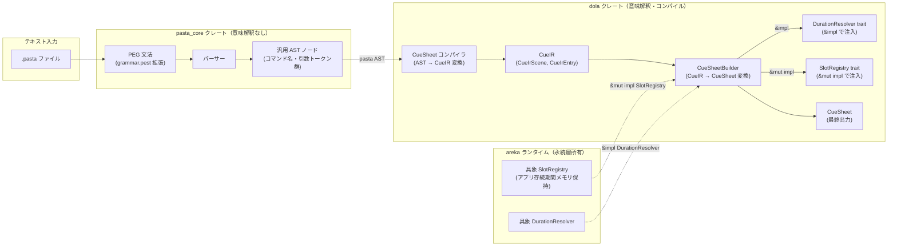
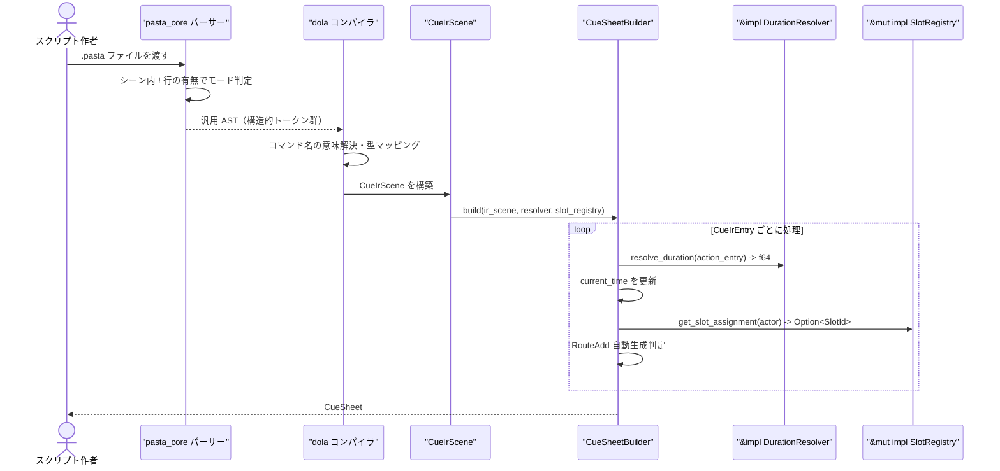
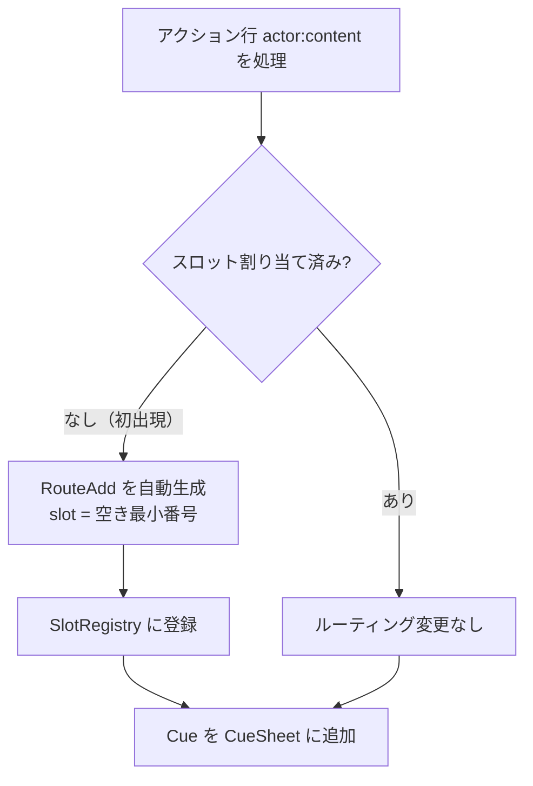

# 設計書：dola-cue-pasta-dsl-extension

> **バージョン**: v3（2026-03-06 — 要件 v4 に基づく全面再設計）
> **前バージョン**: v2（`&type:cuesheet` モード識別方式）は本書に統合・廃止

---

## 概要

**目的**: dola の `CueSheet` データモデル（`crates/dola/src/cue/`）をテキストで記述できるよう、pasta DSL の文法を拡張する。
**利用者**: ゴーストスクリプト作者。既存の `pasta` 会話スクリプトとシームレスに共存する演出台本を書く。
**影響範囲**: pasta_core パーサーへの文法ルール追加（構造的 AST 出力のみ）、dola クレートへの `CueSheetBuilder` / `DurationResolver` / `SlotRegistry` / CueIR 型追加。既存 pasta スクリプトへの破壊的変更はゼロ。

本設計書は **pasta_core 実装者向けの文法仕様指示（PEG 文法セクション）** と、**dola CueSheet コンパイラの設計仕様（CueIR 以降のセクション）** の 2 部構成である。コード実装は本フェーズのスコープ外。

### ゴール

- `!` コマンド行がシーン内に 1 つ以上存在すれば、そのシーン全体をキューシート拡張処理の対象とする（モード識別マーカー不要）
- 暗黙キーフレーム（行の出現順序）で時系列を表現し、Duration Resolver が時刻を算出
- `!` コマンド行でマーカー登録・シーク・Barrier・Clear・Routing を宣言
- `!command@alias(args)` で名前付き CueCommand を定義し、アクション行では `@alias` で参照
- `!mark@name` で現在時刻にマーカーを登録、`!seek(@name)` で基準時刻カーソルを移動
- 後方互換性：`!` コマンド行を持たないシーンは現行動作を維持

### 非ゴール

- CueSheet ↔ Storyboard 連携記法（将来拡張）
- キーフレーム相互変換（`start_time: f64` ↔ `Seek`）
- Lua ブロックからのキュー操作 API
- グローバルスコープ名前付きコマンド定義（将来拡張）
- コード実装（本設計書は仕様指示のみ）

---

## アーキテクチャ

### 既存アーキテクチャ分析

- **dola CueSheet**: `crates/dola/src/cue/` に実装済み。型は変更不要。
  - `Cue { actor: ActorKey, start_time: f64, payload: CuePayload }`
  - `CuePayload`: `Command(CueCommand)`, `Barrier(BarrierKind)`, `Routing(RoutingCommand)` の 3 種
- **pasta DSL**: `vendors/pasta` に外部実装。行指向文法。`&key:value` 属性行・`%actor、actor＝N` 配置行（C# enum 採番ルール）・`actor:content` アクション行・`:content` 継続行が既存構文。文字列リテラルは `「」`（1〜4 重ネスト）が主要、`""` も使用可。
- **キューシートモード判定**: シーン内に `!` コマンド行が 1 つ以上存在すれば暗黙的にそのシーンをキューシートモードとして扱う。明示的なモード識別マーカー（`&type:cuesheet` 等）は不要。

### アーキテクチャパターンと境界マップ

**採用パターン: ハイブリッド改（Option C'）** — pasta_core が構造的 AST（意味解釈なし）を出力し、dola が AST を CueIR へ変換（コンパイル）した上で `CueSheetBuilder` が時刻計算・ルーティング判定を担う。詳細は [research.md](research.md) の「決定 1」「決定 5」を参照。

**依存方向**: pasta_core は誰からも依存されない独立クレート。dola が pasta_core の AST データ型を参照する一方向依存。



**境界の責務分担**:

| 境界 | 責務 | 責務外 |
|------|------|--------|
| pasta_core PEG 文法 | 行の分類・構文解析・トークン抽出（構造のみ） | コマンドの意味解釈・時刻計算・ルーティング判定 |
| pasta_core AST | `!` + コマンド名 + 引数トークン群を構造的に保持 | dola 型への変換・CueIR の保持 |
| dola CueSheet コンパイラ | pasta AST → CueIR 変換（コマンド名の意味解決・型マッピング） | テキスト解析（PEG 文法の責務） |
| dola CueSheetBuilder | CueIR → CueSheet 変換、Duration 注入、RouteAdd 自動生成 | テキスト解析 |
| DurationResolver | アクションごとの所要時間を返す | CueSheet 構築 |
| SlotRegistry | アクター→スロット割り当てを管理 | テキスト解析・CueCommand 変換 |

### テクノロジースタック

| レイヤー | 技術 / バージョン | 役割 | 備考 |
|---------|----------------|------|------|
| DSL 文法 | PEG (pest 2.x) | 行指向の文法ルール定義 | `.pest` ファイルを拡張 |
| 言語 | Rust 2024 Edition | 全実装 | 既存スタックを踏襲 |
| dola 型 | `crates/dola/src/cue/command.rs` | `CueCommand` / `BarrierKind` 等 | 変更不要 |
| エラー | `thiserror` 2 | `CueParseError` / `CueBuildError` 定義 | 全クレート共通規約 |

---

## システムフロー

### パースパイプライン



### RouteAdd 自動生成判定フロー



> RouteSwitch は自動生成しない。スクリプト作者の `!route_switch` 明示記述のみ（5.2）。

---

## 要件トレーサビリティ

| 要件 | サマリー | コンポーネント | インターフェース | フロー |
|------|---------|--------------|----------------|------|
| 1.1–1.3 | 暗黙キーフレーム・初期時刻 0.0・シーンスコープ | CueSheetBuilder | `DurationResolver` | パースパイプライン |
| 1.4–1.5 | パーサーは時刻を算出しない、Duration Resolver 注入 | コンパイラ・CueIR・CueSheetBuilder | `DurationResolver` | パースパイプライン |
| 2.1 | `!` / `！` 行認識 | PEG 文法 | `cue_cmd_line` ルール | — |
| 2.2 | `!` 行有無でシーンモード判定 | パーサー | 汎用 AST | パースパイプライン |
| 2.3 | コマンド種別一覧 | PEG `cue_cmd_body` | `CueIrCommand` enum | — |
| 2.4 | 選択的日本語エイリアス | PEG キーワードルール | 対照表 | — |
| 2.5 | mark 登録・seek 移動 | PEG + Builder | `CueIrCommand::Mark`, `Seek` | パースパイプライン |
| 2.6–2.7 | マーカー重複/未宣言エラー、mark グローバル専用 | Builder | `CueBuildError` | — |
| 2.8 | mark の 1 回使用制限 | Builder | `CueBuildError::MarkUsedMultipleTimes` | — |
| 2.9 | yield/select/wait 引数 | PEG 文法 | `cue_yield`, `cue_select`, `cue_wait` | — |
| 2.10 | clear 明示記述のみ | PEG + Builder | `CueIrCommand::Clear` | — |
| 2.11 | 同一基準時刻 = 並列演出 | CueSheetBuilder | — | パースパイプライン |
| 3.1 | emote/choice/custom 定義 | PEG 文法 | `CueIrAliasDef` | — |
| 3.2 | actor ローカル vs グローバル定義 | PEG 文法 | `CueIrAliasDef::scope_actor` | — |
| 3.3 | エイリアス解決順序（ローカル → グローバル） | Builder AliasTable | `AliasTable::resolve()` | — |
| 3.4 | スコープはシーン単位 | Builder | — | — |
| 3.5 | 未定義 → Emote フォールバック | Builder | — | — |
| 4.1 | アクション行 → `CueCommand::Text` | Builder | `CueIrAction` → `Cue` | — |
| 4.2 | `@alias` 展開 | Builder | エイリアス解決 | — |
| 4.3 | 継続行 `\n` 結合 | PEG + Builder | `CueIrFragment::Text` | — |
| 4.4 | 継続行内 `@command` 禁止 | PEG | `CueParseError` | — |
| 4.5 | 1 行内複数 `@command` | PEG + Builder | `Vec<CueIrFragment>` | — |
| 5.1 | 未割り当てアクター初出現 → RouteAdd 自動生成 | Builder + SlotRegistry | `auto_assign()` | RouteAdd フロー |
| 5.2 | `!route_add` / `!route_switch` 明示コマンド | PEG + Builder | `CueIrCommand::RouteAdd`, `RouteSwitch` | — |
| 5.3 | `!route_remove` 明示のみ | PEG + Builder | `CueIrCommand::RouteRemove` | — |
| 5.4 | `%` 行スロット割り当て解析 | PEG + Builder | `SlotRegistry::assign_explicit()` | — |
| 5.5 | スロット永続・`%` 優先・自動採番 | SlotRegistry | `auto_assign()`, `next_available_slot()` | — |
| 5.6 | `entity_key` 引数形式 | PEG `entity_key` ルール | — | — |
| 6.1–6.3 | 後方互換性 | パーサーのモード条件分岐 | — | — |
| 7.1–7.4 | エラーハンドリング | `CueParseError` / `CueBuildError` | エラー型定義 | — |
| 8.1–8.3 | 設計成果物 | 本書 + `cue.pasta` | — | — |

---

## コンポーネントとインターフェース

### コンポーネントサマリー

| コンポーネント | 層 | 目的 | 要件カバレッジ | 主要依存 | 契約 |
|------------|---|------|--------------|---------|------|
| PEG 文法拡張 | pasta_core | `!` 行・名前付きコマンド定義の構造的構文解析（意味解釈なし） | 2, 3, 4, 7 | pest 2.x (P0) | 文法ルール |
| CueSheet コンパイラ | dola | pasta AST → CueIR 変換（コマンド名の意味解決・dola 型マッピング） | 1.4, 2.1–2.10, 3.1–3.2, 4.1–4.5 | pasta_core AST (P0) | Compiler |
| CueIR 型 | dola | 意味解釈済み中間表現（時刻なし） | 1.4, 1.5 | — | データ型 |
| CueSheetBuilder | dola | CueIR → CueSheet 変換 | 1, 2, 3, 4, 5 | DurationResolver (P0), SlotRegistry (P0) | Service |
| DurationResolver | dola | アクションの所要時間を外部注入 | 1.4, 1.5 | — | Trait |
| SlotRegistry | dola | アクター→スロット割り当てを管理 | 5.4, 5.5 | — | Trait |
| AliasTable | dola / Builder 内部 | シーンスコープのエイリアス管理 | 3.1–3.5 | — | State |

---

### pasta_core 層: PEG 文法拡張

| フィールド | 詳細 |
|---------|------|
| **目的** | `!` コマンド行・名前付きコマンド定義・シーンモード暗黙判定の構造的文法ルール追加。pasta_core はコマンドの意味を解釈せず、`!` + コマンド名 + 引数トークン群という構造のみを AST に保持する |
| **要件** | 2.1–2.10, 3.1–3.2, 4.1–4.5, 7.1–7.2 |

#### モード判定

```
シーン内に cue_cmd_line が 1 つ以上存在する
  → そのシーン全体をキューシートモードとして処理
  → 属性行による明示マーカーは不要
```

#### 既存文法への統合

> **実装注記**: 以下の PEG 文法フラグメントは `cue_cmd_line` 以下のルール構造を規定するものであり、既存の `grammar.pest` ファイルへの統合方法は以下の通り。

1. **インデント処理**: `cue_cmd_line` ルール自体は行頭からの `!` / `！` マッチを前提とする。実際の `.pasta` ファイルではシーン内行にインデント（スペース/タブ）が付くが、これは既存の親ルール（シーン内行を列挙する上位ルール）が先頭空白を消費済みの段階で `cue_cmd_line` がマッチする想定である。
2. **Splice ポイント**: `cue_cmd_line` は既存の `scene_line`（または同等の行振り分けルール）に新しいバリアントとして追加する。
3. **行種別の試行順序**: `scene_line` 内で先にマッチするルールが優先される。推奨順序は以下の通り:
   - `comment_line`（`#` で始まるコメント行）
   - `attribute_line`（`&key:value` 属性行）
   - **`cue_cmd_line`**（`!` / `！` で始まるキューコマンド行） ← 新規追加
   - `slot_line`（`%` で始まるスロット指定行）
   - `action_line`（`actor:content` アクション行）
   - `continuation_line`（`:content` 継続行）

#### `!` キューコマンド行（全角・半角両対応）

> **設計原則**: 全 `!` コマンドは `!keyword` / `!keyword(args)` / `!keyword@name(args)` の統一構文。
> 括弧は `()` / `（）`（全角・半角両対応）で統一。

```peg
// キューコマンド行（キューシートモード判定の対象行）
// 注: 先頭のインデント（空白/タブ）は親ルールで消費済みの前提
cue_cmd_line = {
    cue_cmd_marker ~ SPACE* ~ cue_cmd_body ~ NEWLINE
}

cue_cmd_marker = _{ "!" | "！" }

cue_cmd_body = {
    cue_mark
    | cue_emote_def
    | cue_choice_def
    | cue_custom_def
    | cue_seek
    | cue_yield
    | cue_select
    | cue_wait
    | cue_clear
    | cue_route_add
    | cue_route_switch
    | cue_route_remove
}

// --- タイムライン ---

// !mark@name
cue_mark = {
    "mark" ~ at_marker ~ cue_ident
}

// !seek(@name)  /  !seek(@name, 1.0)
cue_seek = {
    "seek" ~ paren_open ~ SPACE* ~ at_marker ~ cue_ident
    ~ (SPACE* ~ "," ~ SPACE* ~ float_lit)? ~ SPACE* ~ paren_close
}

// --- バリア ---

// !yield  /  !yield(10.0)
cue_yield = {
    "yield" ~ (paren_open ~ float_lit ~ paren_close)?
}

// !select  /  !select(30.0)  /  ！選択待ち  /  ！選択待ち（30.0）
cue_select = {
    ("select" | "選択待ち") ~ (paren_open ~ float_lit ~ paren_close)?
}

// !wait(2.0)
cue_wait = {
    "wait" ~ paren_open ~ float_lit ~ paren_close
}

// --- ステージ制御 ---

// !clear
cue_clear = { "clear" }

// !route_add(shell, actor:さくら:shell)
cue_route_add = {
    "route_add" ~ paren_open ~ cue_target ~ "," ~ SPACE* ~ entity_key ~ paren_close
}

// !route_switch(balloon, spot:stage_balloon)
cue_route_switch = {
    "route_switch" ~ paren_open ~ cue_target ~ "," ~ SPACE* ~ entity_key ~ paren_close
}

// !route_remove(balloon)
cue_route_remove = {
    "route_remove" ~ paren_open ~ cue_target ~ paren_close
}

// --- 名前付きコマンド定義 ---

// !emote@name(key)  /  ！表情＠name（key）
// !emote@actor:name(key)  — actor ローカル定義
cue_emote_def = {
    ("emote" | "表情") ~ at_marker ~ cue_scoped_ident
    ~ paren_open ~ SPACE* ~ cue_ident ~ SPACE* ~ paren_close
}

// !choice@name(id, 「表示テキスト」)  /  ！選択肢＠name（id, 「表示テキスト」）
cue_choice_def = {
    ("choice" | "選択肢") ~ at_marker ~ cue_scoped_ident
    ~ paren_open ~ SPACE* ~ cue_ident ~ SPACE* ~ "," ~ SPACE* ~ string_literal
    ~ SPACE* ~ paren_close
}

// !custom@name(「command_name」, {json})  /  ！演出＠name（「command_name」, {json}）
cue_custom_def = {
    ("custom" | "演出") ~ at_marker ~ cue_scoped_ident
    ~ paren_open ~ SPACE* ~ string_literal ~ SPACE* ~ "," ~ SPACE* ~ json_object
    ~ SPACE* ~ paren_close
}

// --- 共通プリミティブ ---

at_marker = _{ "@" | "＠" }
paren_open  = _{ "(" | "（" }
paren_close = _{ ")" | "）" }

// actor 修飾付き識別子（定義系のみ）: "actor:name" または "name"
cue_scoped_ident = { (cue_ident ~ ":" ~ cue_ident) | cue_ident }

// 識別子（スペース・括弧・カンマ・コロン・改行以外の文字列）
cue_ident = { (!(WHITESPACE | "(" | ")" | "（" | "）" | "," | "、" | ":" | NEWLINE) ~ ANY)+ }

// EntityKey 記法
entity_key = { entity_key_actor | entity_key_spot | entity_key_balloon }
entity_key_actor   = { "actor:" ~ cue_ident ~ ":" ~ cue_target }
entity_key_spot    = { "spot:"    ~ cue_ident }
entity_key_balloon = { "balloon:" ~ cue_ident }

// ターゲット識別子
cue_target = { "shell" | "balloon" }

// 非負浮動小数点リテラル
float_lit = { ASCII_DIGIT+ ~ ("." ~ ASCII_DIGIT+)? }
```

**コマンドキーワード対照表（確定版）**

> **方針**: 英語キーワードが正規名。日本語エイリアスはスクリプト作者に馴染みのあるコマンドのみに割り当て、パーサーは等価に認識する。舞台用語はドキュメントの参考注釈であり、パースターゲットではない。

| 正規名（英語） | 日本語エイリアス | 舞台用語（注釈） | 対応 CueIR 型 |
|-------------|---------------|----------------|--------------|
| `emote` | `表情` | 面 | `CueIrAliasDef` → `Emote { key }` |
| `choice` | `選択肢` | 書き抜き | `CueIrAliasDef` → `Choice { id, text }` |
| `custom` | `演出` | 演出 | `CueIrAliasDef` → `Custom { command, params }` |
| `select` | `選択待ち` | 割り | `CueIrCommand::Barrier(WaitForChoice)` |
| `mark` | — | きっかけ | `CueIrCommand::Mark` |
| `seek` | — | 場当たり | `CueIrCommand::Seek` |
| `yield` | — | 溜め | `CueIrCommand::Barrier(WaitForInput)` |
| `wait` | — | 間 | `CueIrCommand::Barrier(Timeout)` |
| `clear` | — | 暗転 | `CueIrCommand::Clear` |
| `route_add` | — | 板付き | `CueIrCommand::RouteAdd` |
| `route_switch` | — | 場面転換 | `CueIrCommand::RouteSwitch` |
| `route_remove` | — | 引っ込み | `CueIrCommand::RouteRemove` |

**日本語エイリアスの選定基準**: 名前付きコマンド定義（emote / choice / custom）はスクリプト作者が頻繁に記述するため日本語があると便利。select は choice と対になる概念であり「選択待ち」が自然。一方、yield / wait は日本語を当てると互いに紛らわしく、mark / seek / clear / route\_\* は英語の方がプログラマーとして通じやすいため英語のみとした。

**依存**:
- 外部: `pest` 2.x — PEG パーサー生成
- 変更対象ファイル推定:

| ファイル | 変更内容 |
|---------|---------|
| `grammar.pest` | `cue_cmd_line`・定義系ルール・`cue_target`・`entity_key` 等の構造的ルール追加（コマンドの意味解釈はしない） |
| `ast/*.rs` | キューコマンド行の汎用 AST ノード追加（コマンド名・エイリアス名・引数トークン群を構造的に保持） |
| `parse_scene.rs` | `!` 行有無によるモード判定処理追加 |
| `parse_action.rs` | `@fragment` 分割ロジック、継続行 `\n` 結合処理 |

**dola 側の変更対象ファイル推定**:

| ファイル | 変更内容 |
|---------|----------|
| `crates/dola/src/cue/ir.rs` | `CueIrScene`, `CueIrEntry`, `CueIrAction`, `CueIrCommand`, `CueIrAliasDef` 型定義 |
| `crates/dola/src/cue/compiler.rs` | pasta_core AST → CueIR 変換（コマンド名の意味解決・dola 型マッピング） |
| `crates/dola/src/cue/builder.rs` | `CueSheetBuilder`・`DurationResolver`・`SlotRegistry` |

---

### dola 層: CueIR 型定義

| フィールド | 詳細 |
|---------|------|
| **目的** | pasta_core AST をコンパイルした結果の中間表現。時刻なし・順序付き。CueSheetBuilder が消費する。dola 内部のドメイン型（`ActorKey`, `CueCommand`, `CueTarget`, `EntityKey`）を直接使用する |
| **要件** | 1.4, 1.5, 2.1–2.10, 3.1–3.2, 4.1–4.5 |

> **設計注記**: CueIR は dola クレート内に配置される。pasta_core は汎用 AST のみを出力し、CueIR を保持しない。pasta_core AST → CueIR への変換（コマンド名の意味解決・dola 型へのマッピング）は dola の CueSheet コンパイラが担う。

**Rust インターフェース定義（配置モジュール: `dola::cue::ir`）**

```rust
/// キューシートモードのシーン中間表現
pub struct CueIrScene {
    /// シーン名
    pub name: String,
    /// エントリの有順序リスト（出現順 = タイムライン順序）
    pub entries: Vec<CueIrEntry>,
    /// シーンスコープのエイリアス定義（エントリより前に処理）
    pub alias_defs: Vec<CueIrAliasDef>,
    /// %行によるスロット割り当て指定
    pub slot_assignments: Vec<SlotAssignment>,
}

/// スロット割り当て指定（%行）
pub struct SlotAssignment {
    pub actor: ActorKey,
    pub slot: Option<SlotId>,  // None = 自動採番
    pub source_line: u32,
}

/// CueIR エントリ（1 行 または 継続行を含む 1 論理ブロック）
pub enum CueIrEntry {
    /// アクション行（actor:content + @command フラグメント）
    Action(CueIrAction),
    /// `!` コマンド行
    Command(CueIrCommand),
}

/// アクション行の中間表現
pub struct CueIrAction {
    /// アクター識別子
    pub actor: ActorKey,
    /// 行内フラグメントのリスト（テキスト断片 + エイリアス参照が交互に並ぶ）
    pub fragments: Vec<CueIrFragment>,
    /// ソース行番号（エラーレポート用）
    pub source_line: u32,
}

/// アクション行内の最小単位
pub enum CueIrFragment {
    /// テキスト断片（継続行 `\n` 結合済み）
    Text(String),
    /// `@name` 参照（エイリアス解決前）
    AliasRef(String),
}

/// `!` コマンド行の中間表現
pub enum CueIrCommand {
    /// `!mark@name` — 現在時刻にマーカーを登録
    Mark { name: String },
    /// `!seek(@name)` / `!seek(@name, offset)` — 基準時刻カーソルを移動
    Seek { name: String, offset: f64 },
    /// Barrier 系（WaitForInput / WaitForChoice / Timeout）
    Barrier(BarrierKind),
    /// `!clear`
    Clear,
    /// `!route_add(target, entity_key)`
    RouteAdd { target: CueTarget, to: EntityKey },
    /// `!route_switch(target, entity_key)`
    RouteSwitch { target: CueTarget, to: EntityKey },
    /// `!route_remove(target)`
    RouteRemove { target: CueTarget },
}

/// 名前付きコマンド定義
pub struct CueIrAliasDef {
    /// actor ローカル定義なら Some(actor)、グローバル定義なら None
    pub scope_actor: Option<ActorKey>,
    /// エイリアス名（`@` 抜き）
    pub name: String,
    /// 対応する CueCommand
    pub command: CueCommand,
    /// ソース行番号
    pub source_line: u32,
}
```

---

### dola 層: DurationResolver トレイト

| フィールド | 詳細 |
|---------|------|
| **目的** | アクション行ごとの所要時間を外部注入するインターフェース |
| **要件** | 1.4, 1.5 |

**サービスインターフェース定義（配置モジュール: `dola::cue::builder`）**

```rust
/// アクション行の所要時間を解決するトレイト。
pub trait DurationResolver {
    /// 指定アクションの所要時間（秒）を返す。
    /// 戻り値は 0.0 以上。次の暗黙キーフレームまでの時間。
    fn resolve_duration(&self, actor: &ActorKey, action: &CueIrAction) -> f64;
}

/// デフォルト実装: 全アクションに固定時間を返す（テスト・プロトタイプ用）
pub struct FixedDurationResolver {
    pub default_seconds: f64,
}

impl DurationResolver for FixedDurationResolver {
    fn resolve_duration(&self, _actor: &ActorKey, _action: &CueIrAction) -> f64 {
        self.default_seconds
    }
}
```

- 前提条件: `CueIrAction` は有効な `ActorKey` を持つ
- 事後条件: 戻り値 ≥ 0.0
- 不変条件: 同一引数に対して冪等（副作用なし）

---

### dola 層: SlotRegistry トレイト

| フィールド | 詳細 |
|---------|------|
| **目的** | アクター→スロット割り当て状態の管理 API |
| **要件** | 5.4, 5.5 |

**所有権と永続モデル**:

- **トレイト定義・デフォルト実装**: dola クレートに配置（`dola::cue::builder`）
- **永続層の所有者**: areka ランタイム。具象型を所有し、`CueSheetBuilder::build()` に `&mut impl SlotRegistry` として貸し出す
- **永続スコープ**: アプリケーション起動〜終了（メモリ上保持）。シーン間で割り当て状態を維持し、アプリ再起動でリセット
- **serde 対応**: 現スコープ外。将来ディスク永続化が必要な場合は areka 側の具象型に `Serialize`/`Deserialize` を追加する（トレイト定義には影響しない）

**サービスインターフェース定義（配置モジュール: `dola::cue::builder`）**

```rust
pub type SlotId = u32;

/// アクター→スロット割り当てを管理するトレイト。
/// 永続層は areka ランタイムが所有し、CueSheetBuilder に &mut で注入する。
pub trait SlotRegistry {
    /// 指定 ActorKey の現在のスロット割り当てを返す。未割り当ては None。
    fn get_slot_assignment(&self, actor: &ActorKey) -> Option<SlotId>;

    /// 明示的なスロット割り当てを登録する（%行からの呼び出し）。
    fn assign_explicit(&mut self, actor: ActorKey, slot: SlotId);

    /// 現在未使用の最小スロット番号を返す。
    fn next_available_slot(&self) -> SlotId;

    /// 新しいスロット割り当てを自動登録し、割り当てたスロット番号を返す。
    fn auto_assign(&mut self, actor: ActorKey) -> SlotId;
}
```

**RouteAdd 自動生成ロジック（擬似コード）**:

```
アクション行 actor:content を処理する際:

1. slot_registry.get_slot_assignment(&actor)
2. None（未割り当て）の場合:
     slot = slot_registry.auto_assign(actor.clone())
     cues.push(Cue { Routing(RouteAdd { target: Shell,   to: Actor(actor, Shell) }) })
     cues.push(Cue { Routing(RouteAdd { target: Balloon, to: Actor(actor, Balloon) }) })
3. Some(_)（割り当て済み）の場合:
     ルーティング Cue は生成しない

// 明示コマンド:
// !route_add(target, entity_key) → RouteAdd Cue を生成
// !route_switch(target, entity_key) → RouteSwitch Cue を生成
// !route_remove(target) → RouteRemove Cue を生成
// いずれも自動生成ではなく、スクリプト作者の明示記述のみで発行。
```

---

### dola 層: CueSheetBuilder

| フィールド | 詳細 |
|---------|------|
| **目的** | CueIrScene を CueSheet に変換する主要コンポーネント |
| **要件** | 1.1–1.5, 2.5–2.11, 3.3–3.5, 4.1–4.5, 5.1–5.5 |

**サービスインターフェース定義**

> **注入方式**: 構造体に型パラメータを持たず、`build()` メソッド引数で `&impl DurationResolver` / `&mut impl SlotRegistry` を受け取る。呼び出し元への型伝播を避けつつ、静的ディスパッチ（ゼロコスト抽象化）を維持する。トレイトオブジェクト (`dyn`) は他に手段がない場合に限り使用する Rust の慣例に従う。

```rust
/// CueIrScene を CueSheet へ変換するビルダー。
/// 型パラメータを持たず、build() 呼び出し時に依存を注入する。
pub struct CueSheetBuilder;

impl CueSheetBuilder {
    /// CueIrScene を CueSheet に変換する。
    ///
    /// - `resolver`: アクション行ごとの所要時間を返す（冪等・副作用なし → `&`）
    /// - `slot_registry`: アクター→スロット割り当て状態（状態変更あり → `&mut`）
    ///
    /// # エラー
    /// - `CueBuildError::DuplicateMark`
    /// - `CueBuildError::UnknownMark`
    /// - `CueBuildError::MarkAliasConflict`
    /// - `CueBuildError::ActorScopedMarkUnsupported`
    /// - `CueBuildError::MarkUsedMultipleTimes`
    /// - `CueBuildError::NegativeOffset`
    pub fn build(
        scene: CueIrScene,
        resolver: &impl DurationResolver,
        slot_registry: &mut impl SlotRegistry,
    ) -> Result<CueSheet, CueBuildError>;
}
```

**タイムライン管理アルゴリズム（擬似コード）**:

```
// SYSTEM_ACTOR: Barrier / Clear / Routing など
// アクター属性を持たない制御キューの発行元
pub const SYSTEM_ACTOR: ActorKey = ActorKey("__system__");

build(scene, resolver, slot_registry):
  current_time = 0.0
  mark_table: HashMap<String, f64> = {}
  mark_used: HashSet<String> = {}
  alias_table = scene.alias_defs → ((Option<ActorKey>, name) → CueCommand)
  result_cues: Vec<Cue> = []

  // %行のスロット割り当てを先行処理
  for sa in scene.slot_assignments:
    match sa.slot:
      Some(id) → slot_registry.assign_explicit(sa.actor, id)
      None     → slot_registry.auto_assign(sa.actor)

  for entry in scene.entries:
    match entry:
      Command(Mark { name }):
        if name contains ":" → Err(ActorScopedMarkUnsupported)
        if alias_table contains name → Err(MarkAliasConflict)
        if mark_table contains name → Err(DuplicateMark)
        mark_table[name] = current_time  // 即時記録

      Command(Seek { name, offset }):
        base = mark_table[name] ?? Err(UnknownMark)
        if offset < 0.0 → Err(NegativeOffset)
        current_time = base + offset

      Command(Barrier(kind)):
        result_cues.push(Cue { actor: SYSTEM_ACTOR, start_time: current_time,
                                payload: Barrier(kind) })

      Command(Clear):
        result_cues.push(Cue { actor: SYSTEM_ACTOR, start_time: current_time,
                                payload: Command(Clear) })

      Command(RouteAdd { target, to }):
        result_cues.push(Cue { actor: SYSTEM_ACTOR, start_time: current_time,
                                payload: Routing(RouteAdd { target, to }) })

      Command(RouteSwitch { target, to }):
        result_cues.push(Cue { actor: SYSTEM_ACTOR, start_time: current_time,
                                payload: Routing(RouteSwitch { target, to }) })

      Command(RouteRemove { target }):
        result_cues.push(Cue { actor: SYSTEM_ACTOR, start_time: current_time,
                                payload: Routing(RouteRemove { target }) })

      Action(action):
        // ルーティング自動生成（5.1）
        emit_routing_if_needed(action.actor, &mut result_cues, current_time)

        // フラグメント変換
        for fragment in action.fragments:
          match fragment:
            Text(s) →
              result_cues.push(Cue { actor: action.actor, start_time: current_time,
                                      payload: Command(Text(s)) })

            AliasRef(name) →
              if mark_table contains name:
                // mark 参照: Cue は生成しない（メタ操作）。1 回限り使用可。
                if mark_used contains name → Err(MarkUsedMultipleTimes)
                mark_used.insert(name)
              else:
                // エイリアス解決: actor ローカル → グローバル → Emote フォールバック
                cmd = alias_table.get((Some(action.actor), name))
                        .or_else(|| alias_table.get((None, name)))
                        .unwrap_or(CueCommand::Emote { key: name })
                result_cues.push(Cue { actor: action.actor, start_time: current_time,
                                        payload: Command(cmd) })

        // Duration Resolver で current_time を前進
        duration = resolver.resolve_duration(&action.actor, &action)
        current_time += duration

  Ok(CueSheet::from(result_cues))
```

---

## データモデル

### dola CueSheet データモデル（実装済み・変更不要）

```
CueSheet
└── Vec<Cue>
    └── Cue
        ├── actor: ActorKey
        ├── start_time: f64
        └── payload: CuePayload
            ├── Command(CueCommand)
            │   ├── Text(String)
            │   ├── Clear
            │   ├── Emote { key: String }
            │   ├── Choice { id: String, text: String }
            │   ├── EntityRef(u64)
            │   └── Custom { command: String, params: DynamicValue }
            ├── Barrier(BarrierKind)
            │   ├── WaitForInput { timeout: Option<f64> }
            │   ├── WaitForChoice { timeout: Option<f64> }
            │   └── Timeout { duration: f64 }
            └── Routing(RoutingCommand)
                ├── RouteAdd { target: CueTarget, to: EntityKey }
                ├── RouteSwitch { target: CueTarget, to: EntityKey }
                └── RouteRemove { target: CueTarget }
```

### DSL → dola マッピング対応表

#### アクション行

| DSL 記法 | dola 変換 | 要件 |
|---------|---------|------|
| `actor：テキスト` | `CueCommand::Text("テキスト")` | 4.1 |
| `：継続テキスト` | 前行 Text に `\n` 結合 | 4.3 |
| `actor：@alias名` | エイリアス解決 → CueCommand | 4.2 |
| `actor：@unknown` | `CueCommand::Emote { key: "unknown" }` | 3.5 |
| `actor：テキスト@cmd テキスト2` | `Text("テキスト"), 解決済みCmd, Text("テキスト2")` | 4.5 |

#### `!` コマンド行

| DSL 記法 | dola 変換 | 要件 |
|---------|---------|------|
| `!mark@名前` | 現在時刻にマーカー登録 | 2.5 |
| `!seek(@名前)` / `!seek(@名前, 0.5)` | `current_time = mark[名前] + offset` | 2.5 |
| `!yield` / `!yield(10.0)` | `BarrierKind::WaitForInput { timeout }` | 2.9 |
| `!select` / `!select(30.0)` / `！選択待ち（30）` | `BarrierKind::WaitForChoice { timeout }` | 2.9 |
| `!wait(2.0)` | `BarrierKind::Timeout { duration: 2.0 }` | 2.9 |
| `!clear` | `CueCommand::Clear` | 2.10 |
| `!route_add(shell, actor:さくら:shell)` | `RoutingCommand::RouteAdd { target, to }` | 5.2 |
| `!route_switch(balloon, spot:stage)` | `RoutingCommand::RouteSwitch { target, to }` | 5.2 |
| `!route_remove(shell)` | `RoutingCommand::RouteRemove { target }` | 5.3 |

#### 名前付きコマンド定義

| DSL 記法 | dola 変換 | 要件 |
|---------|---------|------|
| `!emote@笑顔(smile)` / `！表情＠笑顔（smile）` | `Emote { key: "smile" }` | 3.1 |
| `!emote@さくら:笑顔(sakura_smile)` | actor ローカル `Emote { key: "sakura_smile" }` | 3.2 |
| `!choice@はい(yes, 「はい！」)` / `！選択肢＠はい（yes, 「はい！」）` | `Choice { id: "yes", text: "はい！" }` | 3.1 |
| `!custom@func(「bell」, {})` / `！演出＠func（「bell」, {}）` | `Custom { command: "bell", params: {} }` | 3.1 |

#### アクター配置・スロット

| DSL 記法 | 処理 | 要件 |
|---------|------|------|
| `%さくら、うにゅう＝２、まりか` | C# enum 採番: さくら=0, うにゅう=2, まりか=3 | 5.4 |
| `%さくら` | `assign_explicit(さくら, 0)` — 省略時は 0 から連番 | 5.4 |
| アクター初出現（`%` 行なし） | `auto_assign(actor)` + RouteAdd | 5.1, 5.5 |

---

## エラーハンドリング

### エラー戦略

**パース層** (`CueParseError`): pasta_core PEG 文法の構文エラーを検出。行番号・カラム番号・エラー種別・修正ヒントを含む。
**コンパイル層** (`CueCompileError`): pasta_core AST → CueIR 変換時のエラー（不明なコマンド名、不正な引数構造等）を検出。
**ビルド層** (`CueBuildError`): 構文は正しいが意味的に不正なケースを検出。

### エラー型定義

```rust
/// pasta DSL 文法解析エラー（行番号・カラム番号付き）
#[derive(Debug, thiserror::Error)]
pub enum CueParseError {
    #[error("行 {line}:{col}: 不明なキューコマンド '{cmd}'")]
    UnknownCommand { line: u32, col: u32, cmd: String },

    #[error("行 {line}:{col}: 負のオフセット秒数 '{value}'")]
    NegativeFloat { line: u32, col: u32, value: f64 },

    #[error("行 {line}:{col}: 名前付きコマンド定義の構文エラー")]
    InvalidAliasSyntax { line: u32, col: u32 },

    #[error("行 {line}:{col}: 不正なスロット番号 '{value}'")]
    InvalidSlotNumber { line: u32, col: u32, value: String },

    #[error("行 {line}:{col}: 継続行に @command が含まれています")]
    AtCommandInContinuation { line: u32, col: u32 },
}

/// CueSheet 構築エラー（セマンティクス）
#[derive(Debug, thiserror::Error)]
pub enum CueBuildError {
    #[error("シーン '{scene}' でマーカー名 '{name}' が重複しています")]
    DuplicateMark { scene: String, name: String },

    #[error("シーン '{scene}' でマーカー '{name}' は未登録です")]
    UnknownMark { scene: String, name: String },

    #[error("シーン '{scene}' でマーカー名 '{name}' はエイリアスと同名です")]
    MarkAliasConflict { scene: String, name: String },

    #[error("シーン '{scene}' で mark '{name}' に actor 指定はできません")]
    ActorScopedMarkUnsupported { scene: String, name: String },

    #[error("シーン '{scene}' で mark '{name}' は 2 回以上使用されています")]
    MarkUsedMultipleTimes { scene: String, name: String },

    #[error("オフセット '{value}' が負数です")]
    NegativeOffset { value: f64 },
}
```

---

## テスト戦略

### ユニットテスト

- `CueSheetBuilder::build()`: 各 `CueIrEntry` バリアントの変換が期待 `Cue` を生成するか
- `SlotRegistry::auto_assign()`: 未割り当てアクターに最小空きスロットが割り当てられるか
- `FixedDurationResolver`: 固定値が返るか
- エラーケース: 重複マーク・未登録マーク・負オフセット・マーカー/エイリアス名重複・actor 付き mark・mark の多重使用で期待エラーが発生するか
- エイリアス解決: actor ローカル → グローバル → Emote フォールバックの優先順序が正しいか

### インテグレーションテスト

- `.pasta` テキスト → pasta_core AST → CueIR → `CueSheet` のラウンドトリップ
- 暗黙キーフレームの累積: 複数アクション行で `start_time` が正しく前進するか
- 並列演出: `!seek(@name, offset)` で同一基準時刻から複数 `Cue` が生成されるか
- RouteAdd 自動生成: アクター初出現時に `RoutingCommand::RouteAdd` が先行 Cue として挿入されるか
- 後方互換性: `!` コマンド行なしシーンで通常行として処理されるか

### E2E テスト

- `cue.pasta` サンプルファイル（全機能網羅版）がパースエラーなく `CueSheet` に変換されるか
- 並列演出シーン（mark + seek + 2 アクター）が期待 `Cue` 列を生成するか

---

## 実装フェーズ計画（MVP 段階的展開）

### フェーズ A: 最小 MVP

**スコープ**: `!` 行認識によるモード判定 + Text/Emote アクション行 + 暗黙キーフレーム + `FixedDurationResolver`

| 対象 | 変更内容 |
|------|---------|
| `grammar.pest`（pasta_core） | `cue_cmd_line` 認識（モード判定用）、アクション行 `@cmd` フラグメント分割 |
| `ast/`（pasta_core） | キューコマンド行の汎用 AST ノード |
| `dola::cue::ir` | `CueIrScene`, `CueIrAction`, `CueIrFragment` |
| `dola::cue::compiler` | pasta_core AST → CueIR 変換（コマンド名の意味解決） |
| `dola::cue::builder` | `DurationResolver` トレイト, `FixedDurationResolver`, `CueSheetBuilder::build()` (Action のみ) |
| `dola::cue::builder` | `SlotRegistry` トレイト, `InMemorySlotRegistry` |

### フェーズ B: Barrier + タイムライン制御

**スコープ**: `!` コマンド行（mark / seek / yield / select / wait / clear）+ `CueBuildError`

| 対象 | 変更内容 |
|------|---------|
| `grammar.pest`（pasta_core） | 各 `cue_cmd_body` バリアント（mark / seek / yield / select / wait / clear） |
| `ast/`（pasta_core） | コマンド引数構造の詳細化 |
| `dola::cue::ir` | `CueIrCommand` enum |
| `dola::cue::compiler` | mark/seek/yield/select/wait/clear の意味解決 |
| `dola::cue::builder` | Mark/Seek 処理, Barrier/Clear Cue 生成, エラーハンドリング |

### フェーズ C: 名前付きコマンド定義 + Routing

**スコープ**: `!emote@...` / `!choice@...` / `!custom@...` + RouteAdd 自動生成 + 明示 Routing コマンド

| 対象 | 変更内容 |
|------|---------|
| `grammar.pest`（pasta_core） | `cue_emote_def`・`cue_choice_def`・`cue_custom_def`（日本語エイリアス含む）、`cue_route_add`・`cue_route_switch`・`cue_route_remove` + `entity_key` ルール |
| `ast/`（pasta_core） | エイリアス定義・ルーティングコマンドの汎用 AST ノード |
| `dola::cue::ir` | `CueIrAliasDef`、`CueIrCommand::RouteAdd` / `RouteSwitch` / `RouteRemove` |
| `dola::cue::compiler` | emote/choice/custom/route_* の意味解決・dola 型マッピング |
| `dola::cue::builder` | AliasTable 構築、エイリアス解決（actor ローカル優先）、RouteAdd 自動判定 |

### フェーズ D: 完全機能

**スコープ**: `CueCommand::Custom` パラメータ + `CueCommand::EntityRef` + `%` 行スロット明示割り当て

---

## 参照成果物

- [cue.pasta](cue.pasta) — 全機能網羅サンプル（要件 v4 準拠）
- [research.md](research.md) — アーキテクチャ評価・設計決定の詳細記録
- [requirements.md](requirements.md) — 要件定義書 v4
- [crates/dola/src/cue/command.rs](../../../../crates/dola/src/cue/command.rs) — dola 側コマンド型定義（変更不要）
- [crates/dola/src/cue/sheet.rs](../../../../crates/dola/src/cue/sheet.rs) — CueSheet 構造体
