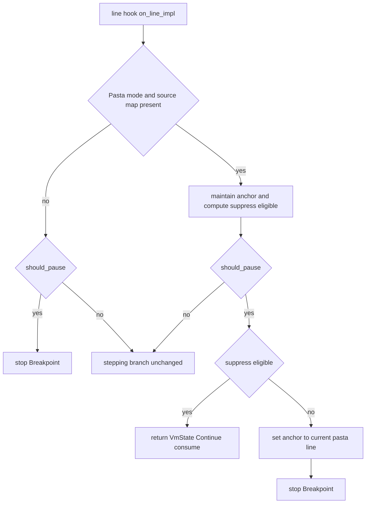
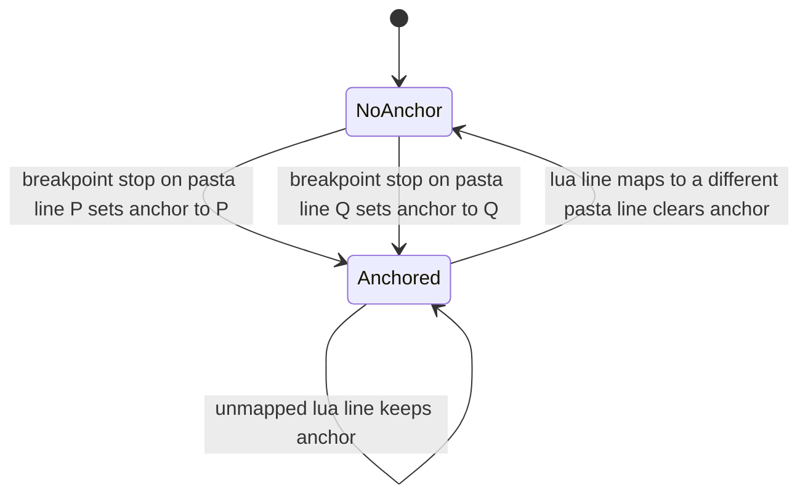

# Technical Design: pasta-debug-break-coalesce

## Overview

**Purpose**: `.pasta` ソースレベルデバッグで、ブレークポイント停止後の Continue（F5）が同一 `.pasta` 行で再ブレークし続ける不具合を解消する。`.pasta` 行ブレークを「`.pasta` 行の訪問ごとに高々1回」発火させ、Continue/Step は同一 `.pasta` 行に属する残りの `.lua` 行を消化して次の停止点へ進む。

**Users**: VSCode 等の DAP クライアントで `.pasta` をデバッグするゴースト作者。

**Impact**: `DebugSession`（停止状態機械）の行フック判定 `on_line_impl` に、Pasta 提示モードでのみ作用する「`.pasta` 行アンカー」を追加する。1つの `.pasta` 行が複数の `.lua` 行へ展開され、その全 `.lua` 行へブレークが登録される（正常仕様、8.2）ために生じる再ヒットを、停止判定側で消化する。生成・登録・提示の各経路は変更しない。

### Goals
- Continue 1回で現在の `.pasta` 行を確実に離脱する（1.1–1.3）。
- `.pasta` 行ブレークの「1訪問1停止」＋ループ再訪時の再停止（2.1, 2.2, 2.4）。
- `.lua` 提示モード・ソースマップ非在・デバッグ無効（OFF）の挙動をバイト不変に保つ（4.1–4.3）。
- 既存ステップ集約と矛盾しない一貫した再開挙動（5.1, 5.2）。

### Non-Goals
- 提示モードの実行時トグル・VSCode UI（隣接仕様 `pasta-debug-lua-view-toggle`）。
- 条件付きブレークポイント等の新規ブレークポイント種別。
- ソースマップ生成（`code_gen`）・登録（`breakpoints.rs` の `should_pause`／二段キー）・提示レゾルバ（`dap.rs`）の変更。
- 同一 `.pasta` 行への**直接再帰**・**別コルーチン実行**における訪問ごと再停止の*厳密保証*（2.3 ベストエフォート）。

## Boundary Commitments

### This Spec Owns
- `DebugSession` の停止判定における **`.pasta` 行ブレーク消化（アンカー）ロジック**。
- アンカーのライフサイクル（確立・抑制適格判定・解除）と、`on_line_impl` の BP-first 分岐への統合。
- 多対1構成・ループ再訪を実証する単体テストおよび実 DAP-over-TCP E2E シナリオ。

### Out of Boundary
- ブレークポイントの登録・実行座標一致判定（`BreakpointSet::should_pause`／二段キー／8.2 の全 `.lua` 行登録は正常仕様として維持）。
- ソースマップの生成・データ構造（`code_gen::source_map`／`debug::source_map`）。
- 提示モード切替・DAP source/stackTrace 提示（`dap.rs`／`wiring.rs` の提示レゾルバ）。
- 再帰・コルーチン跨ぎの同一 `.pasta` 行再停止の厳密保証。

### Allowed Dependencies
- `DebugSession` 内の既存ヘルパー：`resolve_current_pasta(source, line) -> Option<PastaPos>`、`effective_mode() -> SourceMode`、`source_map: Option<Arc<SourceMap>>`。
- 既存型 `PastaPos`（`debug::source_map`）、`SourceMode`（`debug::mod`）。
- `std::cell::RefCell` による VM スレッド単一・`&self` 内部可変（既存 `mode` と同型）。
- 既存 BP ストア `BreakpointSet::should_pause`（読み取りのみ・変更しない）。

### Revalidation Triggers
- `resolve_current_pasta`／`effective_mode`／`source_map` の型・意味変更。
- `BreakpointSet::should_pause` の実行座標一致セマンティクス変更（多対1登録の前提が崩れる場合）。
- `on_line_impl` の BP-first → Stepping の評価順序変更。
- `SourceMode` 既定・gating 条件（`Pasta && source_map.is_some()`）の変更。

## Architecture

### Existing Architecture Analysis
- `DebugSession`（`crates/pasta_lua/src/debug/session.rs`）は protocol 非依存の停止状態機械。行フックが `on_line_impl(lua, debug)` を毎行呼ぶ。
- `on_line_impl` の評価順序（変更しない）：
  1. **BP-first**（`session.rs:639`）：`breakpoints.should_pause(source, line)` が真なら即 `stop_loop(Breakpoint)`。**提示モード非依存・全行・集約なし** ← 本仕様が拡張する箇所。
  2. **Stepping**：`step_should_stop`（`.lua` 粒度）→ Pasta+map なら `pasta_step_should_stop`（`.pasta` 粒度集約・`RunMode::Stepping.origin_pasta` をフレーム修飾鍵に使用）。
- 多対1：1 `.pasta` 行 → 複数 `.lua` 行。`.pasta` ブレークは全対応 `.lua` 行へ登録（`breakpoints.rs`、テスト `one_present_line_registers_multiple_execution_coords`）。`should_pause` は実行座標 `(chunk, lua_line)` 一致のみ判定し `.pasta` 概念を持たない。
- スレッドモデル：`on_line_impl` は VM スレッド単一・`&self`。可変状態は `RefCell`（`mode`）で保持。

### Architecture Pattern & Boundary Map
- **採用パターン**: 既存ステップ集約（`origin_pasta` 鍵）と対をなす、Running/BP 経路向けの **`.pasta` 行アンカー**（session スコープの `Option<PastaPos>`、フレーム修飾なし）。
- **境界**: 停止判定（`session.rs`）のみ拡張。登録・生成・提示は不変。
- **Steering 準拠**: レイヤー（Runtime 内 `pasta_lua`）内で完結。`Result<T, PastaError>` 規約に触れず（`on_line_impl` は `mlua::Result<VmState>`、本変更は早期 `Ok(VmState::Continue)` の追加のみ）。OFF 経路はフック未設置のため不変（4.3）。

### Technology Stack

| Layer | Choice / Version | Role in Feature | Notes |
|-------|------------------|-----------------|-------|
| Backend / Runtime | Rust 2024 / `pasta_lua` | `DebugSession` 停止判定の拡張 | 新規依存なし |
| Runtime | LuaJIT 2.1 / mlua 0.11 | ラインフック（`set_global_hook`） | 既存。フック内で `Ok(VmState::Continue)` 早期復帰を追加 |
| Test | std `TcpStream`／既存 `DapClient` | 実 DAP-over-TCP E2E | 既存ハーネス流用 |

## File Structure Plan

### Modified Files
- `crates/pasta_lua/src/debug/session.rs` — 本仕様の主変更。
  - `DebugSession` に **フィールド追加** `pasta_break_anchor: std::cell::RefCell<Option<PastaPos>>`（`new` で `None` 初期化。`with_source_map`/`with_shared_mode` は不変）。
  - **ヘルパー追加** `fn update_break_anchor(&self, cur: Option<&PastaPos>) -> bool`（アンカー状態を1ステップ進め、抑制適格を返す。名称は debug の「step（`StepKind`/`pasta_step_should_stop`）」と無関係。下記 Components 参照）。
  - **`on_line_impl` 改修**：BP-first 分岐に Pasta+map gating・アンカー維持・抑制/確立を統合（`session.rs:634-689` 範囲）。
  - **単体テスト追加**（同ファイル `#[cfg(test)]`）：アンカー遷移の決定的検証。
- `crates/pasta_lua/tests/runtime/debug_integration_test.rs` — 実 DAP-over-TCP E2E シナリオ追加。
  - 既存 `DapClient`・`enabled_runtime_persists_breakpoint_across_requests` の様式を踏襲し、(a) 1 `.pasta` 行→複数 `.lua` 行で Continue 1回が次行へ抜ける、(b) 同一 `.pasta` 行のループ再訪で訪問ごと再停止、を追加（6.2）。
  - 必要に応じて `.pasta` fixture を追加（多対1展開・ループを含む最小辞書）。

> 新規ファイル・新規コンポーネントは作らない（設計合成「簡素化」）。ステップ集約との状態共有もしない（「Build vs Adopt」）。

## System Flows

### アンカーのライフサイクル（Pasta 提示モード ＋ source_map ありのときのみ）

**判定規則（毎行・BP-first 分岐内）**:
- アンカー維持 `update_break_anchor(cur)`：
  - `anchor==Some(a)` かつ `cur==Some(a)` → **抑制適格 true**（アンカー不変）。
  - `anchor==Some(a)` かつ `cur==Some(b), b!=a` → **アンカーを解除（None）**、false（別 `.pasta` 行へ移動）。
  - `cur==None`（未対応行）→ false、**アンカー不変**（同一展開内の未対応行で誤解除しない／2.1）。
  - `anchor==None` → false（アンカー不変）。
- `should_pause` 真のとき：抑制適格なら `Ok(VmState::Continue)`（消化）。非適格なら `anchor=cur` を設定して `stop_loop(Breakpoint)`。

**ループ再訪の保証根拠**：P で停止→Continue→P の残り `.lua` 行を消化→ループ本体/条件の別 `.pasta` 行（`Some(別行)`）でアンカー解除→P へ再到達時はアンカー None のため停止し `anchor=P` 再設定（2.2）。直接再帰/別コルーチンは別 `.pasta` 行経由でアンカーが解除される限り再停止するが、保証はしない（2.3）。

## Requirements Traceability

| Requirement | Summary | Components | Interfaces | Flows |
|-------------|---------|------------|------------|-------|
| 1.1 | Continue が同一 `.pasta` 行の `.lua` 行で再停止しない | `DebugSession.on_line_impl`, `update_break_anchor` | `update_break_anchor`, `resolve_current_pasta` | アンカーライフサイクル |
| 1.2 | 次の対応 `.pasta` 行の BP で停止 | `on_line_impl`（解除後の再 `should_pause`） | `BreakpointSet::should_pause` | フローチャート |
| 1.3 | 以降に停止点なしなら完走 | `on_line_impl` | `Ok(VmState::Continue)` | フローチャート |
| 2.1 | 同一行通過中は高々1停止（未対応行挟みでも） | `update_break_anchor`（`None` で不解除） | `update_break_anchor` | ライフサイクル |
| 2.2 | ループ再訪で再停止 | `update_break_anchor`（`Some(別行)` で解除） | `update_break_anchor` | ライフサイクル |
| 2.3 | 直接再帰/別コルーチンはベストエフォート | `update_break_anchor`（フレーム修飾なし） | — | ライフサイクル（保証外） |
| 2.4 | 初回到達で1停止・`.pasta` 行提示 | `on_line_impl`（`anchor=cur` 設定→`stop_loop`） | `stop_loop(Breakpoint)` | フローチャート |
| 3.1 | `.pasta` ソース・行＋Breakpoint 理由提示 | `stop_loop`（既存提示不変） | `StopReason::Breakpoint` | — |
| 3.2 | 抑制時は追加停止イベント不発生 | `on_line_impl`（早期 `Continue`） | `event_tx` 未送出 | フローチャート |
| 4.1 | `.lua` モードは `.lua` 粒度維持・非集約 | `on_line_impl` gating | `effective_mode()` | Gate 分岐 |
| 4.2 | map 無し/無効は既存挙動不変 | gating（`source_map.is_some()`） | `source_map` | Gate 分岐 |
| 4.3 | OFF 経路バイト不変 | フック未設置（変更は `on_line_impl` 内） | — | — |
| 5.1 | 既存 `.pasta` 粒度ステップ無回帰 | Stepping 分岐（不変） | `pasta_step_should_stop` | — |
| 5.2 | Step/Continue で同一 `.pasta` 行を離れるまで再停止しない一貫性 | `on_line_impl`（BP-first 抑制は両モード共通に先行） | `update_break_anchor` | フローチャート |
| 6.1 | 既存 Lua デバッグ・自動テスト無回帰 | 全変更を gating 内に閉じる | — | — |
| 6.2 | 多対1・ループ再訪を実 DAP-over-TCP E2E で検証 | `debug_integration_test.rs` | `DapClient` | — |

## Components and Interfaces

| Component | Domain/Layer | Intent | Req Coverage | Key Dependencies (P0/P1) | Contracts |
|-----------|--------------|--------|--------------|--------------------------|-----------|
| DebugSession（拡張） | Runtime / debug | `.pasta` 行アンカーで BP 再ヒットを消化 | 1.1–1.3, 2.1–2.4, 3.2, 4.1–4.3, 5.2 | BreakpointSet (P0), SourceMap (P0) | State |

### Runtime / debug

#### DebugSession（停止状態機械の拡張）

| Field | Detail |
|-------|--------|
| Intent | Pasta 提示モードで、直前停止の `.pasta` 行を離れるまで BP 再ヒットを消化する |
| Requirements | 1.1, 1.2, 1.3, 2.1, 2.2, 2.3, 2.4, 3.2, 4.1, 4.2, 4.3, 5.2 |

**Responsibilities & Constraints**
- 新規状態 `pasta_break_anchor: RefCell<Option<PastaPos>>`（VM スレッド単一・`&self`・既存 `mode` と同型のスレッドモデル）。
- アンカーは **Pasta 提示モード ＋ `source_map.is_some()`** のときのみ維持・参照する。それ以外では一切触れず、`on_line_impl` は現状と同一経路（4.1, 4.2）。
- 停止判定の評価順序（BP-first → Stepping）は不変。BP-first の早期 `Ok(VmState::Continue)`（消化）を追加するのみ。
- 提示・登録・生成には触れない（Out of Boundary）。

**Dependencies**
- Inbound: 行フック `LineHook::on_line` → `on_line_impl`（既存）。
- Outbound: `resolve_current_pasta`（`.pasta` 解決）、`effective_mode`（モード判定）、`BreakpointSet::should_pause`（読み取り）、`stop_loop`（停止）（すべて既存）。
- External: なし。

**Contracts**: State [x]

##### State Management
- **State model**: `pasta_break_anchor: Option<PastaPos>`。`None`＝アンカーなし。`Some(p)`＝`.pasta` 位置 `p` に停止中／そこから再開中で未離脱。
- **Transition（`update_break_anchor(&self, cur: Option<&PastaPos>) -> bool`）**:
  - 返り値＝**抑制適格**（現在行が anchored `.pasta` 行上にあり、BP 命中を消化すべきか）。
  - `(Some(a), Some(a))` → `true`（不変）。`(Some(a), Some(b!=a))` → `anchor=None`, `false`。`(_, None)` → `false`（不変）。`(None, Some)` → `false`（不変）。
  - 副作用は「別 `.pasta` 行へ移動時の解除」のみ。確立は呼び出し側（停止直前）で `*anchor = Some(cur)`。
- **未対応行での BP 停止（`cur==None`）**: `should_pause` 真かつ `cur==None`（Pasta モードで `.lua` 由来 BP が未対応 `.lua` 行に命中）の場合、抑制適格は false・`if let Some(p)=cur` によりアンカー未設定で停止する。すなわち**集約せず `.lua` 粒度で停止**する（正常挙動・多対1 `.pasta` 行シナリオ外・3.1 を侵さない）。
- **Persistence & consistency**: セッション存続（複数 SHIORI 実行跨ぎ）。アンカーは離脱で解除され自己修復（research「既知リスク」参照・2.3 許容）。
- **Concurrency strategy**: VM スレッド単一・`RefCell`・ロックなし（既存 `mode` と同一規律）。

**Implementation Notes**
- Integration: `on_line_impl` BP-first 分岐を
  `let pasta = effective_mode()==Pasta && source_map.is_some();`
  `let cur = if pasta { resolve_current_pasta(source,line) } else { None };`
  `let suppress = if pasta { update_break_anchor(cur.as_ref()) } else { false };`
  `if should_pause { if suppress { return Ok(Continue) } if let Some(p)=cur { *anchor.borrow_mut()=Some(p) } return stop_loop(Breakpoint) }`
  の順で構成。Stepping 分岐は無改修。`update_break_anchor` は毎行（Pasta+map時）呼ぶことで離脱解除を保証。
- Validation: 単体テストで4遷移パターン（同一/別行/未対応/None起点）と「初回停止→消化→別行解除→再訪停止」列を検証。E2E で多対1・ループを実ソケット検証。
- Risks: 評価順序（BP-first が Stepping より先）を保つこと。`should_pause` を二度評価しないこと（`cur`/`suppress` を先に算出）。gating を BP-first・Stepping 双方で一貫させ `.lua`/OFF を不変に保つこと。

## Error Handling

### Error Strategy
- 本変更は新規エラー経路を持たない。`on_line_impl` は常に `Ok(VmState::Continue)`（LuaJIT はフックから Yield 不可）の既存不変条件を維持。
- `resolve_current_pasta` が `None`（未対応行・map 無し・非 Pasta）の場合はアンカー不変・非抑制で素通し（フェイルセーフ）。
- `BreakpointSet::should_pause` の poisoned-lock 時 `false`（既存）には介入しない。

### Monitoring
- 既存のデバッグログ（`tracing`）に従う。新規ログは追加しない（OFF 経路ゼロコスト・4.3 を侵さない）。

## Testing Strategy

### Unit Tests（`session.rs` `#[cfg(test)]`）
- `update_break_anchor` の4遷移：同一 `.pasta` 行→true・不変／別行→false・解除／未対応 `None`→false・不変／アンカー None→false（2.1, 2.2, 2.4）。
- **等価不変条件の固定**：同一 `.pasta` 行へマップする異なる2つの `.lua` 行に対し `resolve_current_pasta` が**等価な `PastaPos`**（同一 file・同一 line）を返すことを明示検証する（アンカー抑制 `anchor == cur` の前提。既存 `pasta_step_should_stop` の `origin_pasta == Some(cur)` と同一不変条件）（1.1, 2.1）。
- 列シナリオ：初回到達で停止＋`anchor` 設定 → 同一行 `.lua` 連続ヒットを消化（1.1, 3.2）→ 別 `.pasta` 行で解除 → 同一行再訪で再停止（2.2）。
- モード直交：`SourceMode::Lua`／`source_map==None` で `on_line_impl` がアンカーを触らず従来経路（4.1, 4.2）。
- 未対応行挟み：`Some(P), None, Some(P)` で同一訪問内に再停止しない（2.1）。

### Integration / E2E Tests（`tests/runtime/debug_integration_test.rs`・実 DAP-over-TCP）
- 多対1 Continue：1 `.pasta` 行が複数 `.lua` 行へ展開される fixture で、BP 停止→`continue` 1回→**次の `.pasta` 行**で停止（同一行で再 `stopped` イベントが来ないこと）（1.1, 1.2, 6.2）。
- ループ再訪：同一 `.pasta` 行をループで複数回通る fixture で、訪問回数ぶん `stopped` が発生（2.2, 6.2）。
- 無回帰：既存 `enabled_runtime_persists_breakpoint_across_requests`・`source_map_handoff_test` が緑のまま（5.1, 6.1）。

### Regression
- `cargo test -p pasta_lua`（全 debug/transpiler/runtime テスト）緑。OFF 経路バイト不変は既存 `disabled_runtime_is_zero_cost`／`r5_*` で担保（4.3, 6.1）。

## Open Questions / Risks
- **再帰/コルーチン跨ぎ（2.3）**: フレーム修飾なしのため、別 `.pasta` 行を経由せず同一 `.pasta` 行へ直接再入する稀ケースは消化され得る（再停止しない）。要件上ベストエフォートで許容。将来必要なら `(thread, base_depth)` 修飾アンカーへ拡張可能（インターフェースは `update_break_anchor` 内に閉じる）。
- **実行跨ぎのアンカー残留**: research「既知リスク（自己修復）」参照。1回限り・次行で解除。**【設計ディスカッション 2026-06-09 決定】リセットは導入せず、ベストエフォートで受容する。** 理由：発生確率が極小（BP が実行中最後に通った対応行であり、かつ次実行が同一 `.pasta` 位置から開始する場合のみ）で次行にて自己修復し、`DebugSession` の「per-execution の寿命前提を持たない」設計哲学（`session.rs:39`）を保つため。2.3 のベストエフォート方針と一貫。
- **評価順序依存**: BP-first を Stepping より先に保つ既存不変条件に依存。レビューで順序固定を確認。
