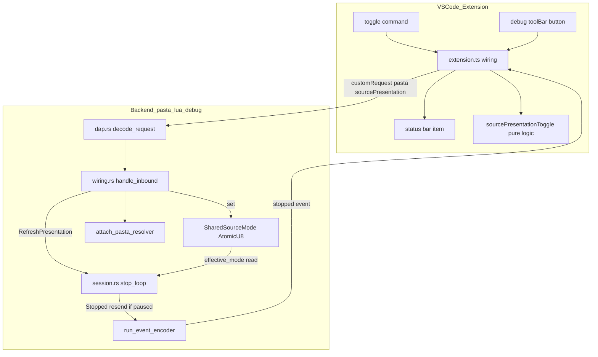
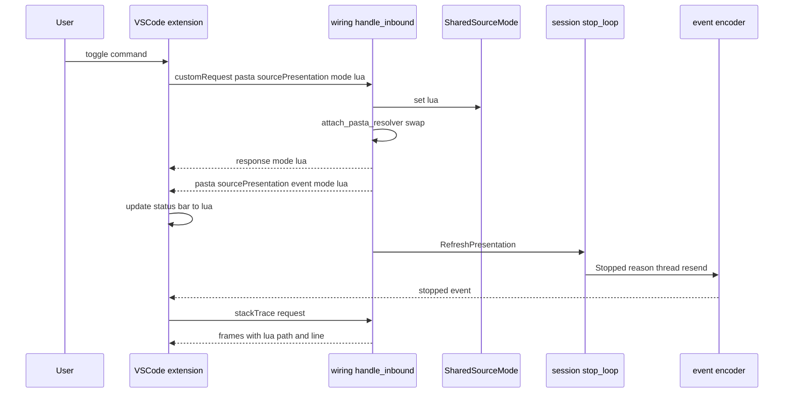

# Technical Design

## Overview

本機能は、Pasta デバッグセッション中に提示モード（`.pasta` / `.lua`）を **実行時にトグル**できるようにする。現状、提示モードは attach 引数 `sourcePresentation` ／ 環境変数 ／ `pasta.toml` で初期解決された後は固定であり、利用者がセッション中に切り替える手段が露出していない。本機能はそこへ (1) 提示モードを更新する DAP カスタムリクエストの制御経路、(2) VSCode 拡張のトグル UI（コマンドパレット＋デバッグツールバーボタン＋ステータスバー常時表示）を追加する。

**Users**: pasta ゴースト作者が、`.pasta` 行にブレークポイントを張ったままセッションを張り直さずに `.pasta` と生成 `.lua` の見え方を行き来し、トランスパイル結果の挙動確認・不具合切り分けを行う。

**Impact**: 既存の提示モード切替基盤（`SourceMode` / `SharedSourceMode` / レゾルバ差し替え）を、attach 時固定から **実行時トグル**へ前進させる。レゾルバ・ソースマップ・停止制御フローそのものは再設計しない（既存資産を再利用）。

### Goals
- デバッグセッション中に DAP カスタムリクエストで提示モードを更新し、`stackTrace`/`source` 提示へ即時反映する。
- 停止中のトグルで現在の停止位置を新モードで**即時再描画**する（ハード必須）。
- VSCode のコマンド／ツールバーボタンからトグルし、現在モードをステータスバーへ常時表示する。
- attach 初期モード指定を実行時トグルで上書きする整合を保つ。
- OFF 経路・既存挙動に無回帰。

### Non-Goals
- 提示レゾルバ／ソースマップ生成そのものの再設計（既存の双方向マップ `resolve_lua_to_pasta` を流用）。
- 同一 `.pasta` 行の再ブレーク抑制・停止制御フローの判定（pasta-debug-break-coalesce が所有）。
- `.lua` 提示時の独自シンタックス装飾等の表示拡張。
- `.lua` ソースの新規配信機構（実ファイルパス提示は上流仕様が既に解決済み）。

## Boundary Commitments

### This Spec Owns
- **DAP カスタムリクエスト `pasta/sourcePresentation`**（設定）と**同名カスタムイベント**（現在モードの push 通知）の契約、およびその受信→提示モード更新→レゾルバ差し替え→停止中再描画→イベント送出の制御経路（バックエンド）。
- **`SessionCommand::RefreshPresentation`** とその stop_loop での停止中再描画ハンドリング（再描画判断の所有）。
- **VSCode 拡張のトグル UI**: コマンド（パレット）、デバッグツールバーボタン、現在モードのステータスバー常時表示、`customRequest` 発行。
- 「`.pasta` BP のまま `.lua` 表示」を含む実 DAP-over-TCP E2E 検証。
- マニュアル デバッグ章「提示モードの切替」の実行時トグル手順への更新。

### Out of Boundary
- 提示レゾルバ（`resolve_lua_to_pasta`）・ソースマップ生成（`code_gen`）の中身（pasta-source-map 所有）。
- 停止制御フロー（`session.rs`/`breakpoints.rs`）の Continue/ステップ判定そのもの（pasta-debug-break-coalesce 所有）。本機能は `RefreshPresentation` の追加と停止中の `Stopped` 再送のみを足し、既存判定ロジックは変更しない。
- `.lua` / `.pasta` ソースの実ファイル可達性（attach 時 lua モードと同一前提・上流所有）。

### Allowed Dependencies
- **pasta-source-map（完了）**: `SourceMode` / `SharedSourceMode`（`Arc<AtomicU8>`・`get()`/`set()`）/ `attach_pasta_resolver()` / `pasta_source_resolver()` / `default_source_resolver()` / `resolve_lua_to_pasta()` / `effective_mode()` / `pasta_step_should_stop()`。
- **pasta-vscode-lua-debug（完了）**: DAP-over-TCP transport、`DapAdapter`、`SessionEvent::Stopped` 全配線、VSCode `pasta` デバッグ型・attach 接続・`registerDebugAdapterDescriptorFactory`/`registerDebugConfigurationProvider`。
- DAP 最小サブセット手書き実装（`serde_json`）の枠内。静的リンク LuaJIT・既存トランスポート方針を踏襲（外部 C モジュール非依存）。

### Revalidation Triggers
- `pasta/sourcePresentation` のリクエスト引数／レスポンス schema、および同名カスタム**イベント** body schema の変更（VSCode 拡張⇔バックエンド契約）。
- `SharedSourceMode` の意味論・優先順位（`attach > env > file > 既定`）変更。
- `SessionEvent::Stopped` の body 形状変更（再描画は再送に依存）。
- 再描画手段の変更（`stopped` 再送 → `invalidated` 等）。

## Architecture

### Existing Architecture Analysis
- **提示モードの単一真実源**: `SharedSourceMode`（`Arc<AtomicU8>`）。VM スレッドの stepper が毎行 `effective_mode()` で読み、ブリッジが attach 時に `set()` で書く。本機能はこの書き手にカスタムリクエストを追加する。
- **レゾルバ差し替えシーム**: `DapAdapter::set_source_resolver()` を `attach_pasta_resolver()` が呼ぶ（`pasta_active()` の判定で `.pasta`/`.lua` レゾルバを選択）。`encode_frames()` が毎フレーム resolver を参照するため、差し替え後の `stackTrace` は即新モードで提示される。
- **イベント経路**: `SessionEvent::Stopped`（VM スレッド）→ `run_event_encoder`（エンコーダスレッド）→ `drain_outbound`（ブリッジ）→ wire。再描画はこの既存経路に `Stopped` を再投入して実現する。
- **停止状態の所有**: VM スレッド `DebugSession` のみが停止/実行状態を知る。ブリッジは不可視。よって停止中限定の再描画判断はセッションが担う。

### Architecture Pattern & Boundary Map



**Architecture Integration**:
- **Selected pattern**: 既存シームの拡張（Extend）。新規コンポーネントは VSCode 純ロジック 1 本のみ。バックエンドは既存ファイルへのシーム追加。
- **境界分離**: 提示モード状態＝`SharedSourceMode`（単一真実源）、再描画判断＝セッション（停止状態所有者）、UI＝VSCode 拡張。共有所有なし。
- **既存パターン保持**: attach の「モード適用→レゾルバ差し替え」後段処理を実行時トグルが共有再利用。VSCode 側は純ロジック分離（`debugAttachTarget.ts` 踏襲）。
- **Steering 準拠**: DAP 最小サブセット手書き、OFF ゼロコスト、`Result<T, PastaError>` 系エラー方針。

### Technology Stack

| Layer | Choice / Version | Role in Feature | Notes |
|-------|------------------|-----------------|-------|
| Frontend / CLI | VSCode Extension API (TypeScript, esbuild) | トグルコマンド・ツールバー・ステータスバー・`customRequest` 発行 | 新規依存なし。`vscode.debug.activeDebugSession` 利用 |
| Backend / Services | Rust 2024 / `serde_json` 1 | DAP カスタムリクエスト処理・モード更新・再描画 | 既存 `crates/pasta_lua/src/debug/` へのシーム追加 |
| Messaging / Events | DAP-over-TCP（既存 transport）/ DAP `stopped` イベント | 再描画契機（停止中の `Stopped` 再送） | `invalidated` は不採用（research.md 参照） |

> 新規ライブラリ・新規プロトコルなし。再描画は DAP 標準 `stopped` を adopt。

## File Structure Plan

### Modified Files（バックエンド: `crates/pasta_lua/src/debug/`）
- `dap.rs` — `decode_request` に `pasta/sourcePresentation` 分岐を追加（引数 `mode` 解釈、`Decoded` へ適用モードを載せる）。`pasta/sourcePresentation` カスタムイベント Value を構築するヘルパ追加（既存 `event()` を再利用）。`Decoded` 構造体に実行時トグル用フィールドを追加（attach の `attach_source_mode` と同経路へ合流）。
- `types.rs` — `SessionCommand::RefreshPresentation` バリアント追加。
- `wiring.rs` — `handle_inbound` に custom request 処理を追加: `SharedSourceMode.set()` → `attach_pasta_resolver()` 再実行 → 受理レスポンス送出 → `RefreshPresentation` をセッションへ転送。加えて、attach 処理完了時（解決済み初期モード）とトグルでのモード変更後に `pasta/sourcePresentation` カスタムイベントを送出。
- `session.rs` — `SessionCommand::RefreshPresentation` を stop_loop の inspect 系アーム（`StackTrace`/`Variables` と同列）として処理: 停止中は在スコープの `reason`/`thread_id` で `SessionEvent::Stopped` を再送し `continue`（resume しない）、非停止時は stop_loop 外のため消費されず無視。専用スナップショット状態（`current_stop` 等）は新設しない（stop_loop が既に `reason`/`thread_id` を保持しているため再利用）。

### New / Modified Files（フロントエンド: `editors/vscode/`）
- `src/sourcePresentationToggle.ts`（**新規**） — vscode 非依存の純ロジック: 現在モードからの反転算出、custom request コマンド名／ペイロード定数、レスポンス body の解釈、ステータスバー表示文字列の生成。
- `src/extension.ts`（**変更**） — `registerCommand('pasta.debug.toggleSourcePresentation')` 登録、`activeDebugSession.customRequest` 発行、ステータスバー item の生成（`command` をトグルへ束ねクリック可能化）、`onDidReceiveDebugSessionCustomEvent`（`pasta/sourcePresentation`）購読での表示更新、`onDidChangeActiveDebugSession`/`onDidTerminateDebugSession` での表示制御。
- `package.json`（**変更**） — `contributes.commands`（トグルコマンド）、`contributes.menus`（`debug/toolBar` ボタン＋`commandPalette` ゲート）追加。

### New Files（テスト・ドキュメント）
- `crates/pasta_lua/tests/runtime/runtime_toggle_e2e_test.rs`（**新規**） — 実 DAP-over-TCP の往復 E2E（R7）。デバッグ統合テストの既存配置に合わせ `tests/runtime/` 配下へ置き、`tests/runtime/main.rs` の `mod` 宣言へ追加する（既存 `tests/runtime/debug_integration_test.rs`・`debug_break_coalesce_fixture_test.rs` と同階層）。共通ユーティリティは `tests/common/` を再利用。
- `editors/vscode/src/test/sourcePresentationToggle.test.ts`（**新規**） — 純ロジックのユニットテスト（反転・ペイロード・表示文字列）。
- `book/src/debug/source-level.md`（**変更**） — 「提示モードの切替」節を実行時トグル手順へ更新（R8）。

> 各ファイルは単一責務。提示モード状態は `SharedSourceMode` のみが所有し、再描画判断は `session.rs` のみが所有する（共有所有なし）。

## System Flows

### 停止中トグル（R3.3 即時再描画）



**Key Decisions**:
- ブリッジは受理レスポンスを **再描画前に** 返す（R1.3）。再描画は `RefreshPresentation` 経由でセッションが停止中のみ実施（非停止時は次の自然停止が新モードで提示＝R1.5）。
- レゾルバ差し替えは受理前に同期実施するため、再送 `stopped` 後の `stackTrace` 再フェッチは確実に新モードを提示する（R3.1/R3.2/R3.4/R3.5）。
- ステータスバー表示はバックエンドの `pasta/sourcePresentation` カスタムイベントで駆動（R2.5/R2.6）。同イベントは attach 処理完了時にも解決済み初期モードを送るため、拡張は query を発行せず初期表示を正確化できる（timing 非依存）。

## Requirements Traceability

| Requirement | Summary | Components | Interfaces | Flows |
|-------------|---------|------------|------------|-------|
| 1.1 | `.lua` 切替要求でモード更新 | wiring.handle_inbound, SharedSourceMode | `pasta/sourcePresentation` | 停止中トグル |
| 1.2 | `.pasta` 切替要求でモード更新 | 同上 | 同上 | 同上 |
| 1.3 | 受理応答を返す | dap.decode_request, wiring.handle_inbound | response `{mode}` | 同上 |
| 1.4 | 不正値で無変更・継続 | dap (SourceMode::parse), wiring | response `{mode}` 現在値 | — |
| 1.5 | 実行中受理・次停止反映 | SharedSourceMode, session.effective_mode | — | — |
| 2.1 | コマンドパレットからトグル | package.json commands, extension.ts | command | — |
| 2.2 | ツールバーボタン | package.json menus debug/toolBar | menu when | — |
| 2.3 | 実行中セッションへ要求送出 | extension.ts, sourcePresentationToggle | `activeDebugSession.customRequest` | 停止中トグル |
| 2.4 | 非アクティブ時は無効・周知 | extension.ts, package.json when | when `debugType==pasta` | — |
| 2.5 | 現在モード常時表示 | wiring（イベント送出）, extension.ts status bar | `pasta/sourcePresentation` event | — |
| 2.6 | 切替時に表示更新 | wiring（イベント送出）, extension.ts | `pasta/sourcePresentation` event | 停止中トグル |
| 3.1 | 切替後 stackTrace を新座標 | attach_pasta_resolver, encode_frames | resolver | 停止中トグル |
| 3.2 | 切替後 source を新座標 | resolver（実ファイルパス） | frame.source path | 停止中トグル |
| 3.3 | 停止中の即時再描画 | session RefreshPresentation, Stopped 再送 | `SessionCommand::RefreshPresentation` | 停止中トグル |
| 3.4 | pasta→lua で lua 座標提示 | default_source_resolver | resolver | 停止中トグル |
| 3.5 | lua→pasta で pasta 座標提示 | pasta_source_resolver | resolver | 停止中トグル |
| 4.1 | attach 初期モード適用 | （既存）resolve / attach | `sourcePresentation` | — |
| 4.2 | 実行時トグルで上書き | SharedSourceMode.set | `pasta/sourcePresentation` | 停止中トグル |
| 4.3 | 上書き後は新モード採用 | SharedSourceMode, effective_mode | — | — |
| 4.4 | 未指定時 env>file>既定 を初期値 | （既存）resolve | — | — |
| 5.1 | pasta 粒度ステップ | （既存）pasta_step_should_stop | effective_mode | — |
| 5.2 | lua 粒度ステップ | （既存）step_should_stop | effective_mode | — |
| 5.3 | 停止中切替後は新粒度 | session.effective_mode（毎行読取） | — | — |
| 5.4 | コルーチン跨ぎでも新粒度継続 | （既存）current_thread_and_depth | — | — |
| 6.1 | トグル未使用時は従来動作 | SharedSourceMode 初期値 | — | — |
| 6.2 | OFF 経路バイト不変・ゼロコスト | enable() ゲート | — | — |
| 6.3 | `.pasta` BP は切替後も有効 | breakpoints（mode 非依存格納） | — | — |
| 6.4 | 既存拡張機能を損なわない | extension.ts 追加のみ | — | — |
| 7.1 | E2E: pasta BP→lua 表示 | runtime_toggle_e2e_test | DAP-over-TCP | — |
| 7.2 | E2E: lua→pasta 復帰 | 同上 | 同上 | — |
| 7.3 | E2E: BP は切替前後で有効 | 同上 | 同上 | — |
| 8.1 | マニュアル実行時トグル手順 | source-level.md | — | — |
| 8.2 | 初期値と上書き関係を説明 | source-level.md | — | — |

## Components and Interfaces

| Component | Domain/Layer | Intent | Req Coverage | Key Dependencies (P0/P1) | Contracts |
|-----------|--------------|--------|--------------|--------------------------|-----------|
| DAP custom request handler | Backend / dap+wiring | `pasta/sourcePresentation` 受理→モード更新→再描画起動 | 1.1–1.5, 2.3, 3.1–3.5, 4.2–4.3 | SharedSourceMode (P0), attach_pasta_resolver (P0), session cmd (P0) | API, State |
| RefreshPresentation handler | Backend / session | 停止中のみ現停止を再送（再描画判断の所有） | 3.3, 5.3 | SessionEvent::Stopped (P0), stop_loop reason/thread_id (P0) | Event, State |
| sourcePresentationToggle | Frontend / pure logic | 反転算出・ペイロード・表示文字列 | 2.1, 2.3, 2.5, 2.6 | （なし・vscode 非依存） | Service |
| extension wiring | Frontend / glue | コマンド登録・customRequest・ステータスバー・セッション監視 | 2.1–2.6, 6.4 | vscode.debug API (P0), sourcePresentationToggle (P0) | Service, State |

### Backend / Debug

#### DAP custom request handler (`pasta/sourcePresentation`)

| Field | Detail |
|-------|--------|
| Intent | 提示モード設定カスタムリクエストを受理し、モード更新・レゾルバ差し替え・受理応答・再描画起動・現在モードのカスタムイベント送出を行う |
| Requirements | 1.1, 1.2, 1.3, 1.4, 1.5, 2.3, 2.5, 2.6, 3.1, 3.2, 4.2, 4.3 |

**Responsibilities & Constraints**
- `decode_request`（`dap.rs`）が `pasta/sourcePresentation` を認識し、引数 `mode`（`"pasta"`/`"lua"`）を `SourceMode::parse` で解釈し `Decoded` へ載せる。
- `handle_inbound`（`wiring.rs`）が適用の権威: 有効 `mode` 指定時のみ `SharedSourceMode.set()` → `attach_pasta_resolver()` 再実行。受理レスポンス body `{ mode: <現在の提示モード> }` を返す（不正値は現在値、変更時は適用値）。
- 適用後 `SessionCommand::RefreshPresentation` をセッションへ転送（停止中再描画の起動）。
- **現在モードの push 通知**: `handle_inbound` は (a) attach 処理完了時に解決済み初期モードを、(b) 実行時トグルでモードを更新した時に新モードを、それぞれ `pasta/sourcePresentation` カスタム**イベント**（body `{ mode }`）として送出する。拡張はこのイベントのみを表示の単一真実源とする（query 不要）。
- OFF（debug 無効）時はブリッジ自体が起動しないため本経路は走らない（R6.2）。

**Dependencies**
- Outbound: `SharedSourceMode` — 提示モード単一真実源の更新 (P0)
- Outbound: `attach_pasta_resolver` — レゾルバ差し替え（attach と共有） (P0)
- Outbound: session `cmd_tx`（`RefreshPresentation`） — 再描画起動 (P0)
- Outbound: transport（`pasta/sourcePresentation` イベント） — 現在モードの push 通知 (P0)

**Contracts**: API [x] / Event [x] / State [x]

##### API Contract — DAP custom request `pasta/sourcePresentation`

| 項目 | 内容 |
|------|------|
| Trigger | VSCode `activeDebugSession.customRequest('pasta/sourcePresentation', { mode })` |
| Request args | `{ mode: "pasta" \| "lua" }` |
| Response body | `{ mode: "pasta" \| "lua" }`（適用後の現在モード・受理確認 R1.3） |
| 不正 `mode` 値 | 無変更・現在モードをエコー・セッション継続（R1.4） |
| Idempotency | 同一 `mode` の再送は冪等（現在モードを返すのみ） |

##### Event Contract — DAP custom event `pasta/sourcePresentation`

| 項目 | 内容 |
|------|------|
| Published | `{ "type": "event", "event": "pasta/sourcePresentation", "body": { "mode": "pasta" \| "lua" } }` |
| 送出契機 | (a) attach 処理完了時（解決済み初期モード・初期表示用） / (b) 実行時トグルでのモード変更後 |
| 受信側 | 拡張 `vscode.debug.onDidReceiveDebugSessionCustomEvent`。ステータスバー常時表示の単一真実源（R2.5/R2.6） |
| Ordering | トグル時はリクエスト受理レスポンス → モード適用 → イベント送出（→ 停止中なら `stopped` 再送） |

##### State Management
- State model: 提示モードは `SharedSourceMode`（`AtomicU8`）が単一所有。リクエストはこのセルを更新し、VM スレッドが `effective_mode()` で読む。
- Concurrency: `AtomicU8`（`SeqCst`）。ブリッジが書き、VM スレッドが読む既存方式を踏襲。

**Implementation Notes**
- Integration: attach 経路（`attach_source_mode`）の後段「モード適用→レゾルバ差し替え」を実行時トグルが共有。`Decoded` に実行時トグル用の適用モードを載せ、`handle_inbound` で合流させる。イベント送出も attach・トグルの両経路で共通化する。
- Validation: `SourceMode::parse` の既存フォールバック（不正→無変更でエコー）を利用（R1.4）。
- Risks: 受理応答は再描画前に返す（R1.3 の観測可能性を再描画の成否から独立させる）。push 通知は表示の正確性（R2.5）を query timing から独立させる。

#### RefreshPresentation handler（session stop_loop）

| Field | Detail |
|-------|--------|
| Intent | 停止中のみ現在の停止を再送し VSCode に新モードでの再フェッチ・再描画を促す |
| Requirements | 3.3, 5.3 |

**Responsibilities & Constraints**
- `SessionCommand::RefreshPresentation` を `stop_loop` の inspect 系アーム（`StackTrace`/`Variables` と同列）として処理する。停止中＝stop_loop でブロック中なら、在スコープの `reason`/`thread_id` で `SessionEvent::Stopped { reason, thread_id }` を再送し `continue`（**resume せず待機継続**）。非停止時は stop_loop 外のため消費されず、次の自然停止が新モードを提示（＝R1.5）。
- 専用スナップショット状態（`current_stop` 等）は新設しない。stop_loop が既に `reason`/`thread_id` を引数保持しているため、`RefreshPresentation` アームはそれを再利用する。
- 再送後の `stackTrace` は既に差し替え済みレゾルバを使うため新モードで提示される。ステップ粒度は `effective_mode()` 毎行読取で切替後の粒度に追従（R5.3）。
- 既存の停止制御判定（Continue/ステップ）は変更しない（pasta-debug-break-coalesce 境界を侵さない）。

**Dependencies**
- Inbound: session `cmd_rx`（`RefreshPresentation`） (P0)
- Outbound: `SessionEvent::Stopped` → encoder → wire（既存経路） (P0)

**Contracts**: Event [x] / State [x]

##### Event Contract
- Published: `SessionEvent::Stopped { reason, thread_id }`（再送）。body 形状は既存と同一（`reason`, `threadId`, `allThreadsStopped: true`）。
- Ordering: 受理レスポンス → `RefreshPresentation` 処理 → `stopped` 再送、の順。

**Implementation Notes**
- Integration: `SessionEvent::Stopped` の既存エンコード/配線を再利用。新イベント型を導入しない。
- Risks: R-1（stopped 再送の再描画確実性）は **着手前 spike** で実証（research.md, ディスカッション #2 のハード基準前提）。再描画 emit をこの単一箇所に局所化し、万一 `invalidated` へ切替が必要でも影響を限定。

### Frontend / VSCode

#### sourcePresentationToggle（純ロジック・vscode 非依存）

| Field | Detail |
|-------|--------|
| Intent | 現在モードからの反転算出、custom request コマンド名／ペイロード、レスポンス解釈、表示文字列生成 |
| Requirements | 2.1, 2.3, 2.5, 2.6 |

**Responsibilities & Constraints**
- 純関数のみ（VSCode API 非依存）。`debugAttachTarget.ts` の分離パターンを踏襲しユニットテスト可能にする。
- 表示の真実源はバックエンドの `pasta/sourcePresentation` push イベント。拡張はイベント body の `mode` で追跡値を更新する（query なし）。

**Contracts**: Service [x]

##### Service Interface
```typescript
type SourcePresentation = "pasta" | "lua";

interface SourcePresentationToggle {
  /** 反転モードを返す（pasta⇔lua） */
  nextMode(current: SourcePresentation): SourcePresentation;
  /** customRequest のコマンド名（リクエスト／カスタムイベント共通） */
  readonly requestCommand: "pasta/sourcePresentation";
  /** 設定リクエストのペイロード */
  setPayload(mode: SourcePresentation): { mode: SourcePresentation };
  /** レスポンス／イベント body から現在モードを取り出す（不正時は undefined） */
  parseMode(body: unknown): SourcePresentation | undefined;
  /** ステータスバー表示文字列（例: "$(eye) 提示: .pasta" / "$(eye) 提示: .lua"） */
  statusLabel(mode: SourcePresentation): string;
}
```
- Preconditions: `current` は妥当な `SourcePresentation`。
- Postconditions: `nextMode` は常に他方のモードを返す。
- Invariants: VSCode API を import しない。

#### extension wiring（glue）

| Field | Detail |
|-------|--------|
| Intent | コマンド登録・customRequest 発行・ステータスバー常時表示・セッション監視 |
| Requirements | 2.1, 2.2, 2.3, 2.4, 2.5, 2.6, 6.4 |

**Responsibilities & Constraints**
- `registerCommand('pasta.debug.toggleSourcePresentation')`: `activeDebugSession` が `type === 'pasta'` のとき追跡中の現在モードを反転して `customRequest('pasta/sourcePresentation', { mode })` を送出（R2.3）。非該当時は警告＋無操作（R2.4）。
- **表示は push イベント駆動**: `onDidReceiveDebugSessionCustomEvent` で `pasta/sourcePresentation` イベントを購読し、body の `mode` で追跡値とステータスバーを更新（初期表示 R2.5・変更時 R2.6）。トグルのリクエスト応答は受理確認のみに用い、表示はイベントを単一真実源とする。
- ステータスバー item（`StatusBarAlignment.Right`）: pasta デバッグセッション中のみ可視（R2.5）。表示文字列は `statusLabel(mode)`（例: `$(eye) 提示: .pasta` / `$(eye) 提示: .lua`）、ツールチップで現在モードと切替操作を案内。`onDidChangeActiveDebugSession` で表示切替、`onDidTerminateDebugSession` で非表示。初期モードは attach 後にバックエンドが送る push イベントで設定（query 不要）。
- ステータスバー item の `command` をトグルコマンド `pasta.debug.toggleSourcePresentation` に束ね、**クリックでもトグル可能**にする（第3のトグル導線・R2.3）。item はセッション中のみ表示されるため、クリック活性は実行中の pasta セッションに限られる（R2.4 と整合）。責務整理: 常時表示の主責務はステータスバー、操作の主導線はツールバーボタン（クリックは補助導線で操作実体は同一コマンド）。
- 既存の attach 接続・診断・構文ハイライト登録には追加のみで干渉しない（R6.4）。

**Dependencies**
- External: `vscode.debug`（`activeDebugSession`, `onDidReceiveDebugSessionCustomEvent`, セッションライフサイクルイベント） (P0)
- Outbound: `sourcePresentationToggle`（純ロジック） (P0)

**Contracts**: Service [x] / State [x]

##### State Management
- State model: 拡張が「アクティブ pasta セッションの現在提示モード」を保持。push イベントで同期（権威はバックエンドの `SharedSourceMode`）。
- Persistence: セッション存続中のみ（永続化なし）。
- Concurrency: 単一拡張ホストスレッド。

**Implementation Notes**
- Integration: `package.json` に `commands` と `menus.debug/toolBar`（`when: debugType == 'pasta'`）＋`commandPalette`（同 when でゲート）を追加。
- Validation: `activeDebugSession` 不在／非 pasta は早期 return＋ユーザ周知（R2.4）。
- Risks: ツールバーボタンは状態テキスト表示に不向きなため、常時表示はステータスバーへ分離（research.md 決定）。

## Error Handling

### Error Strategy
- **不正モード値（R1.4）**: バックエンドは `SourceMode::parse` のフォールバックで無変更とし、現在モードをレスポンスでエコーしてセッションを継続（停止・切断しない）。
- **非アクティブ／非 pasta セッションでのトグル（R2.4）**: 拡張側で早期 return し、`vscode.window.showWarningMessage` 等で「アクティブな Pasta デバッグセッションがない」旨を周知。バックエンドへは送らない。
- **customRequest 失敗**: 拡張は例外を捕捉しエラー通知。追跡モード・ステータスバーは変更しない（楽観更新せず応答で更新）。
- **再描画の非適用（非停止時）**: `RefreshPresentation` を無視するのは正常系（R1.5）。エラーではない。

### Monitoring
- バックエンドは既存 `@pasta_log`/`tracing` 方針に従い、提示モード更新・不正値フォールバックを debug/warn でログ。新規監視基盤は導入しない（steering 準拠）。

## Testing Strategy

### Unit Tests
- `sourcePresentationToggle.nextMode`: `pasta→lua` / `lua→pasta` の反転（2.3）。
- `sourcePresentationToggle.parseMode`: 妥当 body（レスポンス／イベント）→モード、不正 body→`undefined`（2.5, 2.6, 1.4 相当のクライアント側）。
- `sourcePresentationToggle.statusLabel`: 各モードの表示文字列（2.5）。
- バックエンド `decode_request`: `pasta/sourcePresentation`（set／不正値）の `Decoded` 生成と受理レスポンス（1.1–1.4）。
- session `RefreshPresentation`: 停止中＝`Stopped` 再送、非停止＝無視（3.3, 1.5）。

### Integration Tests
- ブリッジ統合: custom request 受信 → `SharedSourceMode.set` → `attach_pasta_resolver` 差し替え → 受理レスポンス → `RefreshPresentation` 転送の一連（1.1–1.3, 3.1, 4.2）。
- レゾルバ差し替え後の `stackTrace`/`source` が新モード座標を返す（3.1, 3.2, 3.4, 3.5）。
- attach 初期モード → 実行時トグル上書き → `effective_mode` が新モードを返す（4.1–4.3）。
- attach 完了時・トグル時に `pasta/sourcePresentation` カスタムイベントが現在モードを送出する（2.5, 2.6）。

### E2E Tests（実 DAP-over-TCP, `runtime_toggle_e2e_test.rs`）
- `.pasta` 行 BP で停止 → `pasta/sourcePresentation{mode:lua}` → 停止位置・stackTrace が `.lua` 座標、`stopped` 再送で再描画される（7.1, 3.3）。
- `.lua` → `.pasta` へ復帰し提示が `.pasta` 座標へ戻る（7.2, 3.5）。
- 切替前後で `.pasta` 行 BP が有効であり続ける（7.3, 6.3）。

### No-Regression
- OFF（debug 無効）でカスタムリクエスト経路が一切走らないこと（6.2, 既存 OFF テストに退行がないこと）。
- トグル未使用セッションが初期解決どおり動作（6.1）。

## Performance & Scalability
- OFF 経路はバイト不変・ゼロコスト維持（custom request 処理は有効時のブリッジ/アダプタ内に限定）。提示モード読取は既存 `AtomicU8` ロードのまま（ホットパス不変）。新規の常時コストは発生させない。
