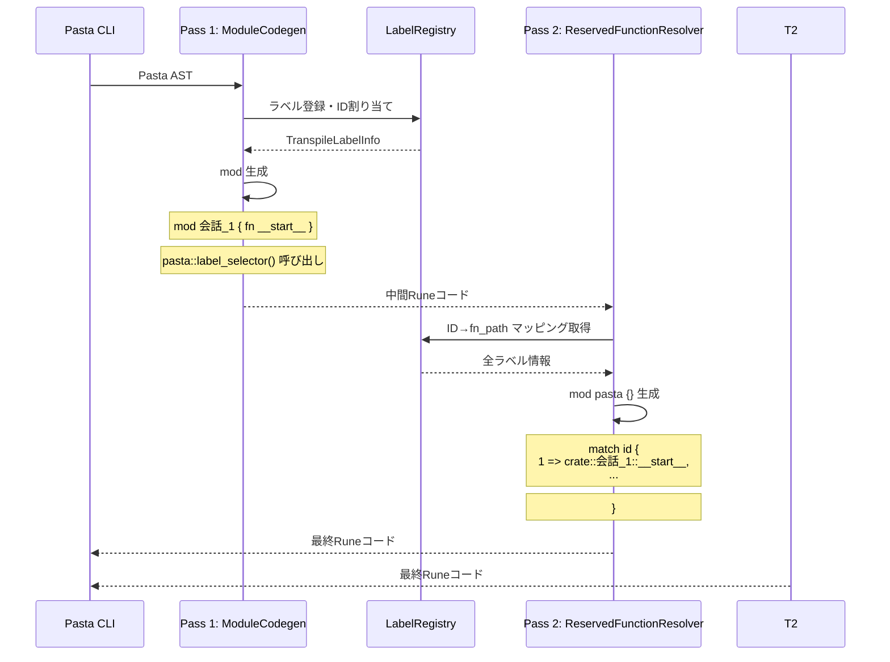
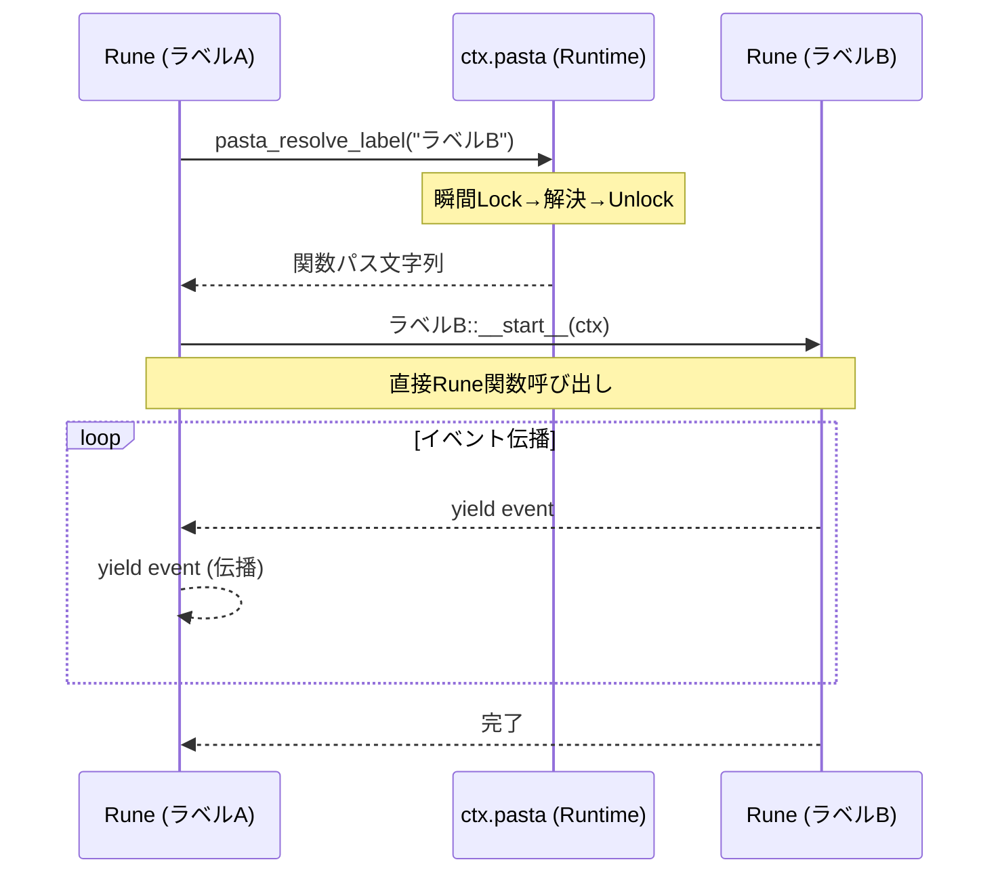
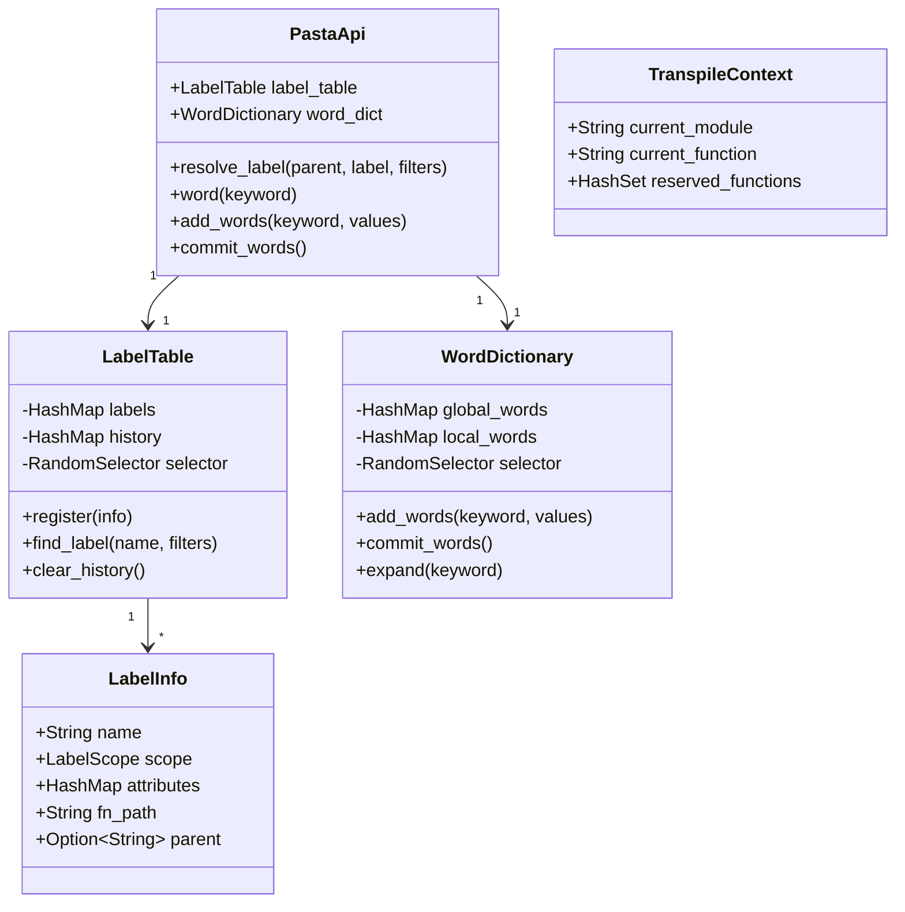

# Design Document

| 項目 | 内容 |
|------|------|
| **Document Title** | Pasta DSL 宣言的コントロールフロー 技術設計書 |
| **Version** | 1.0 |
| **Date** | 2025-12-12 |
| **Parent Spec** | areka-P0-script-engine (completed) |
| **Priority** | P0 (既存実装の修正) |

---

## Overview

本設計書は、Pasta DSLトランスパイラーを元仕様（areka-P0-script-engine）に基づいた正しい宣言的コントロールフロー構文に適合させるための技術設計を定義する。

**Purpose**: トランスパイラーとランタイムを再設計し、call/jump/ラベル定義を使用した宣言的なコントロールフローをサポートする。

**Users**: Pastaスクリプト作成者、Pasta DSL開発者

**Impact**: 
- 現在のトランスパイラー出力形式を全面的に変更（フラット関数 → モジュール構造）
- 新規Pastaランタイムオブジェクト（`ctx.pasta`）の追加
- `04_control_flow.pasta`の全面的な書き直し

### Goals
- 要件5で定義されたトランスパイラー出力仕様に完全準拠
- call/jump文のwhile-let-yieldパターン生成
- Pastaランタイムメソッド（call/jump/word）の実装
- 検索装置（LabelTable/WordDictionary）のSend trait実装とVM初期化
- 包括的なテストスイートの作成
- **🎯 必達**: `comprehensive_control_flow.pasta` → `comprehensive_control_flow.rn` トランスパイル成功

### Non-Goals
- 命令型制御構文（`if/elif/else/while`）のサポート
- Runeブロック内の条件分岐・ループの拡張（別途Rune機能として実装可能）
- 新しいDSL構文の追加
- パフォーマンス最適化（機能完成後のフェーズで検討）

---

## Architecture

> 詳細な調査結果は`research.md`を参照。

### Existing Architecture Analysis

**現在のアーキテクチャ**:
- `Transpiler::transpile()`: PastaFile AST → Runeコード文字列の変換
- グローバルラベル → フラット関数生成（`pub fn ラベル名_番号(ctx)`）
- ローカルラベル → フラット化された関数（`pub fn 親名__子名_番号(ctx)`）
- Call文 → 直接関数呼び出し（`ラベル名()`）
- Jump文 → `return ラベル名()`

**要件との乖離点**:
1. **モジュール化なし**: グローバルラベルがモジュールとして生成されていない
2. **`__start__`関数なし**: グローバルラベルの最初のスコープが専用関数として生成されていない
3. **ローカルラベルのフラット化**: 親モジュール内に配置されず、`親名__子名`形式でフラット化
4. **直接関数呼び出し**: `ctx.pasta.call()`/`ctx.pasta.jump()`ではなく、直接関数を呼び出し

**再利用可能な資産**:
- AST定義（`Statement`, `JumpTarget`, `LabelDef`等）
- 識別子サニタイズ（`sanitize_identifier()`）
- 文字列エスケープ（`escape_string()`）
- `LabelTable`: ラベル解決、前方一致選択、キャッシュベース消化
- `RandomSelector`: ランダム選択ロジック

**2パストランスパイラー統合戦略**:

トランスパイラーは**Writeトレイト**を出力先として受け取り、柔軟な出力先対応を実現します。

```rust
impl Transpiler {
    /// Pass 1: Label collection and module generation
    /// 
    /// この関数は複数回呼び出し可能。各PastaFileのラベルがregistryに蓄積される。
    /// 
    /// # 使用方法
    /// 
    /// 複数のPastaFileを処理する場合：
    /// ```rust
    /// let mut registry = LabelRegistry::new();
    /// let mut output = String::new();
    /// 
    /// for pasta_file in &files {
    ///     let ast = parse_file(pasta_file)?;
    ///     Transpiler::transpile_pass1(&ast, &mut registry, &mut output)?;
    /// }
    /// 
    /// Transpiler::transpile_pass2(&registry, &mut output)?;
    /// ```
    pub fn transpile_pass1<W: std::io::Write>(
        file: &PastaFile, 
        registry: &mut LabelRegistry,
        writer: &mut W
    ) -> Result<(), PastaError>;
    
    /// Pass 2: Reserved function generation (mod pasta {})
    /// 
    /// Pass 1を全ファイルに対して実行した後、最後に1回だけ呼び出す。
    pub fn transpile_pass2<W: std::io::Write>(
        registry: &LabelRegistry, 
        writer: &mut W
    ) -> Result<(), PastaError>;
    
    /// Convenience method: Single-file transpile (for testing only)
    /// 
    /// **注意**: 本番コードでは使用しないこと。
    /// 複数ファイルを処理する場合は、transpile_pass1()を複数回呼び出し、
    /// 最後にtranspile_pass2()を1回呼び出すこと。
    /// 
    /// このメソッドは単体テスト用の便利関数として提供される。
    #[doc(hidden)]
    pub fn transpile_to_string(file: &PastaFile) -> Result<String, PastaError> {
        let mut output = String::new();
        let mut registry = LabelRegistry::new();
        Self::transpile_pass1(file, &mut registry, &mut output)?;
        Self::transpile_pass2(&registry, &mut output)?;
        Ok(output)
    }
}
```

**使用例**:

```rust
// 本番コード: 複数のPastaFileを処理
pub fn new(script_root: impl AsRef<Path>) -> Result<Self> {
    let loaded = DirectoryLoader::load(script_root)?;
    let mut registry = LabelRegistry::new();
    let mut output = String::new();
    
    // Pass 1: 各pastaファイルを処理
    for pasta_file in &loaded.pasta_files {
        let ast = parse_file(pasta_file)?;
        Transpiler::transpile_pass1(&ast, &mut registry, &mut output)?;
    }
    
    // Pass 2: mod pasta {} を生成（1回のみ）
    Transpiler::transpile_pass2(&registry, &mut output)?;
    
    // Runeコンパイル（1回のみ）
    let unit = rune::prepare(&output).build()?;
    Ok(Self { unit, ... })
}

// オプション: Pass 1の出力を個別ファイルにキャッシュ
let cache_dir = persistence_root.join("cache/pass1");
std::fs::create_dir_all(&cache_dir)?;

for pasta_file in &loaded.pasta_files {
    let ast = parse_file(pasta_file)?;
    let file_name = pasta_file.file_stem().unwrap();
    let cache_path = cache_dir.join(format!("{}.rn", file_name));
    let mut cache_file = File::create(&cache_path)?;
    
    Transpiler::transpile_pass1(&ast, &mut registry, &mut cache_file)?;
}

// テストコード: 単一ファイルの便利メソッド
#[test]
fn test_simple_transpile() {
    let ast = parse_str("＊会話\n　さくら：こんにちは", "test.pasta")?;
    let output = Transpiler::transpile_to_string(&ast)?;
    assert!(output.contains("pub mod 会話_1"));
}
```

**キャッシュディレクトリ構造**:

```
persistence_root/
  ├── save/           # セーブデータ
  ├── cache/          # トランスパイルキャッシュ（オプショナル）
  │   ├── pass1/      # Pass 1出力（デバッグ用）
  │   │   └── transpiled.rn
  │   └── final/      # 最終Runeコード
  │       └── transpiled.rn
  └── logs/           # エラーログ
```

**メリット**:
- 既存の呼び出し元（`PastaEngine::new()`等）を変更不要
- テストケースは出力Runeコードの期待値を更新するだけで対応可能
- 段階的な移行が可能（Pass 1実装 → Pass 2実装）
- 内部メソッドを`pub(crate)`とすることでユニットテストが可能

### Architecture Pattern & Boundary Map

**選択パターン**: 責任分離アーキテクチャ + 2パストランスパイラー（Write出力）

```mermaid
graph TB
    subgraph "Transpile Pass 1: ラベル収集 + モジュール生成"
        AST[Pasta AST] --> P1[Pass 1 Transpiler]
        P1 --> LR[LabelRegistry構築]
        P1 --> W1[Writer<br/>中間Runeコード出力]
    end
    
    subgraph "Transpile Pass 2: mod pasta {} 生成"
        LR --> P2[Pass 2 Transpiler]
        P2 --> W2[Writer<br/>mod pasta 追加]
    end
    
    subgraph "出力先（柔軟）"
        W1 --> OUT[String | File | Stderr]
        W2 --> OUT
    end
    
    subgraph "Rune Compile（1回のみ）"
        OUT --> RC[Runeコンパイラー]
        RC --> UNIT[Rune Unit]
    end
    
    subgraph "Runtime"
        UNIT --> VM[Rune VM]
        CTX[ctx.pasta] --> VM
        LT[LabelTable] --> CTX
        WD[WordDictionary] --> CTX
    end
```

**重要な設計原則**:
1. **Pass 1とPass 2は文字列生成のみ**（Runeコンパイルなし）
2. **Runeコンパイルは最後に1回だけ**（全ての名前が解決済み）
3. **Writeトレイトで柔軟な出力先対応**（メモリ/ファイル/標準出力）

**Runeモジュール解決の仕組み**:
- Runeの正式な拡張子は `.rn`（`.rune`ではない）
- `mod foo;` は `foo.rn` または `foo/mod.rn` を自動ロード
- パス解決の基準：`Source::from_path()`で読み込んだファイルのディレクトリ
- `Source::new("entry", code)` は仮想ソース（ファイルパスなし、mod解決不可）
- 現在の設計：トランスパイル済みコードは完全に自己完結（mod解決不要）

**責任分離**:
- **PastaEngine（Rust側）**: ラベル名→Rune関数パス解決のみ
- **Runeジェネレーター**: 実際の実行とyield伝播

**ドメイン境界**:
| ドメイン | 責務 | モジュール |
|----------|------|------------|
| トランスパイラー | AST→Runeコード変換 | `transpiler/` |
| ランタイム | 検索装置、実行コンテキスト | `runtime/` |
| 標準ライブラリ | Rune関数登録 | `stdlib/` |
| エンジン | 統合、VM管理 | `engine.rs` |

### Technology Stack

| Layer | Choice / Version | Role in Feature | Notes |
|-------|------------------|-----------------|-------|
| Language | Rust 2021 Edition | トランスパイラー、ランタイム実装 | 既存 |
| Script VM | Rune 0.14 | Runeコード実行、ジェネレーター | 既存 |
| Parser | pest | Pasta DSLパース | 既存、変更なし |
| Test | cargo test | ユニットテスト、統合テスト | 既存 |

---

## System Flows

### トランスパイルフロー（2パス）

**Pass 1**: DSL → Rune モジュール構造変換
- LabelRegistry でラベル収集とID割り当て
- `mod グローバル { fn ローカル }` 構造生成
- `pasta::label_selector()` 呼び出しを生成（実装なし）

**Pass 2**: `mod pasta {}` 生成
- LabelRegistry から ID→関数パス マッピング取得
- `pasta::label_selector()` の match 文生成
- Pass 1 の出力に `mod pasta {}` を追加



### 実行時Call/Jumpフロー



---

## Requirements Traceability

| Requirement | Summary | Components | Interfaces | Flows |
|-------------|---------|------------|------------|-------|
| 1.1-1.7 | ラベルベースのコントロールフロー | ModuleCodegen, ContextCodegen | call/jump生成 | トランスパイル |
| 2.1-2.5 | ランダム選択と前方一致 | LabelTable | find_label() | 実行時 |
| 3.1-3.3 | 動的call/jump | ContextCodegen, PastaApi | resolve_label() | 実行時 |
| 4.1-4.3 | 宣言的な会話フロー表現 | - | - | RuneBlock内 |
| 5.1-5.13 | トランスパイラー出力仕様 | ModuleCodegen, ContextCodegen | 全生成メソッド | トランスパイル |
| 6.1-6.5 | サンプルファイルの修正 | - | - | - |
| 7.1-7.7 | リファレンス実装とテスト | TestFixtures | - | テスト |
| 8.1-8.8 | 検索装置のVM初期化 | LabelTable, WordDictionary | VM::send_execute | 初期化 |

---

## Components and Interfaces

| Component | Domain/Layer | Intent | Req Coverage | Key Dependencies | Contracts |
|-----------|--------------|--------|--------------|------------------|-----------|
| LabelRegistry | Transpiler | ラベル収集とID割り当て | 5.2-5.4 | AST (P0) | State |
| ModuleCodegen | Transpiler | グローバルラベル→モジュール生成 | 5.2-5.4 | LabelRegistry (P0) | Service |
| ContextCodegen | Transpiler | call/jump/word予約関数生成 | 5.7-5.13 | LabelRegistry (P0) | Service |
| ReservedFunctionResolver | Transpiler | label_selector本体生成 | 5.7-5.9 | LabelRegistry (P0) | Service |
| LabelTable | Runtime | ラベル解決、ランダム選択 | 2.1-2.5, 8.1-8.2 | RandomSelector (P1) | State |
| WordDictionary | Runtime | 単語定義、展開 | 5.1, 5.5 | - | State |
| PastaApi | Runtime | resolve_label_id実装 | 3.1-3.3 | LabelTable (P0) | Service |
| PastaEngine | Engine | 統合、VM管理 | 8.3-8.8 | 全コンポーネント (P0) | Service |

### Transpiler Domain

#### LabelRegistry

| Field | Detail |
|-------|--------|
| Intent | トランスパイル時のラベル収集とID割り当て |
| Requirements | 5.2, 5.3, 5.4 |

**Responsibilities & Constraints**
- グローバル/ローカルラベルに一意なID（1から開始）を割り当て
- 同名ラベルに連番を付与（`会話_0`, `会話_1`, ...）
- 各ラベルのRune関数パスを生成（`crate::会話_1::__start__`）
- label_selector生成用のID→関数パスマッピングを提供
- LabelTable構築用のデータを提供

**Dependencies**
- Inbound: Transpiler::collect_labels() — ラベル収集 (P0)
- Outbound: ModuleCodegen — 関数名参照 (P0)
- Outbound: ReservedFunctionResolver — ID→パスマッピング (P0)

**Contracts**: State [x]

##### State Interface
```rust
/// トランスパイル時のラベル情報
#[derive(Debug, Clone)]
pub struct TranspileLabelInfo {
    pub id: usize,                    // 一意なID（match文用）
    pub name: String,                 // 完全修飾ラベル名（"会話" or "会話::選択肢"）
    pub attributes: HashMap<String, String>,  // フィルタ属性
    pub fn_path: String,              // 相対関数パス（"会話_1::__start__", "会話_1::選択肢_1"）
}

pub struct LabelRegistry {
    labels: Vec<TranspileLabelInfo>,
    next_id: usize,
    // 統一カウンター: (親名, 子名 or "__start__") → 連番
    counters: HashMap<(String, String), usize>,
}

impl LabelRegistry {
    pub fn new() -> Self;
    
    /// グローバルラベルを登録してID割り当て
    /// キー: (name, "__start__")
    /// fn_path: "{name}_{counter}::__start__"
    pub fn register_global(
        &mut self,
        name: &str,
        attributes: HashMap<String, String>,
    ) -> TranspileLabelInfo;
    
    /// ローカルラベルを登録してID割り当て
    /// キー: (parent_name, local_name)
    /// fn_path: "{parent_name}_{parent_counter}::{local_name}_{counter}"
    /// 注: 同じlocal_nameの連番はグローバルで管理（親をまたいで増加）
    pub fn register_local(
        &mut self,
        parent_name: &str,
        local_name: &str,
        attributes: HashMap<String, String>,
    ) -> TranspileLabelInfo;
    
    /// 親の現在の連番を取得
    fn get_parent_counter(&self, parent_name: &str) -> usize;
    
    /// 全ラベル情報を取得（label_selector生成用）
    pub fn all_labels(&self) -> &[TranspileLabelInfo];
    
    /// LabelTable構築（ランタイム用、P1）
    pub fn into_label_table(self, random_selector: Box<dyn RandomSelector>) -> LabelTable;
}
```

**連番管理の具体例:**
```rust
// 1つ目の「＊会話」
register_global("会話", attrs);
// → fn_path: "会話_1::__start__"

// 会話_1 内の1つ目「ー選択肢」
register_local("会話", "選択肢", attrs);
// → fn_path: "会話_1::選択肢_1"

// 会話_1 内の2つ目「ー選択肢」
register_local("会話", "選択肢", attrs);
// → fn_path: "会話_1::選択肢_2"

// 2つ目の「＊会話」
register_global("会話", attrs);
// → fn_path: "会話_2::__start__"

// 会話_2 内の1つ目「ー選択肢」（グローバル連番で3）
register_local("会話", "選択肢", attrs);
// → fn_path: "会話_2::選択肢_3"
```

#### ModuleCodegen

| Field | Detail |
|-------|--------|
| Intent | グローバルラベルをRuneモジュールに変換する |
| Requirements | 5.2, 5.3, 5.4 |

**Responsibilities & Constraints**
- グローバルラベル1つにつきRuneモジュール1つを生成（`pub mod ラベル名_番号 { ... }`）
- グローバルラベルの最初のスコープを`pub fn __start__(ctx)`関数として生成
- 各ローカルラベルを親モジュール内の個別関数（`pub fn ラベル名_番号(ctx)`）として生成
- LabelRegistryから取得した連番とパスを使用

**Dependencies**
- Inbound: Transpiler::generate_modules() — モジュール生成 (P0)
- Outbound: ContextCodegen — ステートメント変換 (P0)
- Inbound: LabelRegistry — ラベル情報参照 (P0)

**Contracts**: Service [x]

##### Service Interface
```rust
pub struct ModuleCodegen;

impl ModuleCodegen {
    /// グローバルラベルをRuneモジュールに変換
    fn generate_module(
        output: &mut String,
        label: &LabelDef,
        label_info: &LabelInfo,  // TranspileLabelInfo → LabelInfo
        registry: &LabelRegistry,
    ) -> Result<(), PastaError>;
    
    /// __start__関数を生成
    fn generate_start_function(
        output: &mut String,
        statements: &[Statement],
        registry: &LabelRegistry,
    ) -> Result<(), PastaError>;
    
    /// ローカルラベル関数を生成
    fn generate_local_function(
        output: &mut String,
        label: &LabelDef,
        label_info: &LabelInfo,  // TranspileLabelInfo → LabelInfo
        registry: &LabelRegistry,
    ) -> Result<(), PastaError>;
}
```
- Preconditions: LabelRegistryにラベルが登録済み
- Postconditions: 有効なRuneモジュールコードが出力に追加される
- Invariants: 生成されるモジュール名・関数名はLabelRegistryと一致

#### ContextCodegen

| Field | Detail |
|-------|--------|
| Intent | call/jump文をpasta::label_selector呼び出しに変換 |
| Requirements | 5.7, 5.8, 5.9, 5.10, 5.11, 5.12, 5.13 |

**Responsibilities & Constraints**
- Call文を`pasta::label_selector("ラベル", #{})`呼び出しに変換
- Jump文を`pasta::label_selector("ラベル", #{})`呼び出しに変換
- グローバルジャンプ: `"会話"` → `会話::__start__`を探索
- ローカルジャンプ: `"会話_1::選択肢"` → 前方一致探索
- ワード展開を`__word_単語__(ctx, args)`呼び出しに変換
- 発言者切り替えコード生成

**Dependencies**
- Inbound: ModuleCodegen — ステートメント変換呼び出し (P0)
- Inbound: LabelRegistry — ラベル名参照 (P0)

**Contracts**: Service [x]

##### Service Interface
```rust
pub struct ContextCodegen;

impl ContextCodegen {
    /// Call文をlabel_selector呼び出しに変換
    fn generate_call(
        output: &mut String,
        target: &JumpTarget,
        args: &[Argument],
        parent_label: &str,
        registry: &LabelRegistry,
    ) -> Result<(), PastaError>;
    
    /// Jump文をlabel_selector呼び出しに変換
    fn generate_jump(
        output: &mut String,
        target: &JumpTarget,
        parent_label: &str,
        registry: &LabelRegistry,
    ) -> Result<(), PastaError>;
    
    /// ラベル検索キーを生成
    /// - グローバル: "会話" → グローバル検索
    /// - ローカル: "会話_1::選択肢" → ローカル検索
    fn build_label_search_key(
        target: &JumpTarget,
        parent_label: &str,
        registry: &LabelRegistry,
    ) -> String;
    
    /// ワード展開を予約関数呼び出しに変換
    fn generate_word(
        output: &mut String,
        word_name: &str,
        args: &[Argument],
    ) -> Result<(), PastaError>;
    
    /// 発言者切り替えを生成
    fn generate_speaker_change(
        output: &mut String,
        speaker: &str,
    ) -> Result<(), PastaError>;
}
```

#### ReservedFunctionResolver

| Field | Detail |
|-------|--------|
| Intent | mod pasta{} 生成（Pass 2） |
| Requirements | 5.7, 5.8, 5.9 |

**Responsibilities & Constraints**
- Pass 1 の中間Runeコードに `mod pasta {}` を追加
- LabelRegistryからID→関数パスマッピングを取得
- `jump()`, `call()`, `label_selector()`, `select_label_to_id()` の4関数を生成
- `label_selector()` 内のmatch文を生成（全ラベルのID分岐）
- `select_label_to_id()` は `pasta_stdlib::select_label_to_id()` を呼び出す転送関数

**生成される構造**:
```rune
pub mod pasta {
    pub fn jump(ctx, label, filters, args) {
        let label_fn = label_selector(label, filters);
        for event in label_fn(ctx, args) { yield event; }
    }
    
    pub fn call(ctx, label, filters, args) {
        let label_fn = label_selector(label, filters);
        for event in label_fn(ctx, args) { yield event; }
    }
    
    pub fn label_selector(label, filters) {
        let id = pasta_stdlib::select_label_to_id(label, filters);
        match id {
            1 => crate::会話_1::__start__,
            2 => crate::会話_1::選択肢_1,
            ...
            _ => |ctx, args| {
                yield Error(`ラベルID ${id} が見つかりませんでした。`);
            },
        }
    }
}
```

**Dependencies**
- Inbound: Transpiler::transpile_pass2() — Pass 2呼び出し (P0)
- Inbound: LabelRegistry — ID→パスマッピング (P0)

**Contracts**: Service [x]

##### Service Interface
```rust
pub struct ReservedFunctionResolver;

impl ReservedFunctionResolver {
    /// mod pasta {} を生成してPass 1コードに追加
    fn generate_pasta_module(
        registry: &LabelRegistry,
    ) -> String;
    
    /// label_selector のmatch文を生成
    fn generate_label_selector_match(
        registry: &LabelRegistry,
    ) -> String;
    
    /// Pass 2: 最終Runeコード生成
    fn resolve(
        pass1_code: &str,
        registry: &LabelRegistry,
    ) -> Result<String, PastaError>;
}
```

##### 生成コード例（Pass 2出力）
```rune
// Pass 1 の mod 会話_1 {} はそのまま保持
pub mod 会話_1 {
    pub fn __start__(ctx) {
        // pasta::label_selector() 呼び出しあり
    }
}

// Pass 2 で追加
pub mod pasta {
    pub fn label_selector(label, filters) {
        let id = 1; // 仮実装（P1で resolve_label_id 実装）
        match id {
            1 => crate::会話_1::__start__,
            2 => crate::会話_1::選択肢_1,
            3 => crate::会話_1::選択肢_2,
            _ => panic!("Unknown label id: {}", id),
        }
    }
}
```

**実装優先度**:
- Phase 1 (P0): mod pasta{} 生成とmatch文
- Phase 2 (P1): resolve_label_id 実装（別仕様: pasta-label-resolution-runtime）

### Runtime Domain
}
```

##### 生成コード例
```rune
pub mod pasta {
    pub fn label_selector(label, filters) {
        let id = pasta_stdlib::select_label_to_id(label, filters);
        match id {
            1 => crate::会話_1::__start__,
            2 => crate::会話_1::選択肢_1,
            3 => crate::会話_1::選択肢_2,
            _ => |ctx, args| {
                yield Error(`ラベルID ${id} が見つかりませんでした。`);
            },
        }
    }
}
```

### Runtime Domain

#### LabelTable

| Field | Detail |
|-------|--------|
| Intent | ラベル解決、前方一致選択、キャッシュベース消化 |
| Requirements | 2.1, 2.2, 2.3, 2.4, 2.5, 8.1, 8.6 |

**Responsibilities & Constraints**
- ラベル名からRune関数パスへのマッピング
- 同名ラベルからのランダム選択
- 前方一致選択
- キャッシュベース消化（選択肢を順に消化）
- **`Send` trait必須**: VM::send_execute()のAPI制約

**Dependencies**
- Inbound: PastaApi — ラベル解決 (P0)
- Outbound: RandomSelector — ランダム選択 (P1)

**Contracts**: State [x]

##### State Management
- State model: `HashMap<String, Vec<LabelInfo>>` + `HashMap<String, Vec<usize>>`（履歴）
- Persistence: なし（セッション内のみ）
- Concurrency: Send実装必須、内部は単一スレッドアクセス想定

```rust
/// ラベルテーブル（Send実装必須）
pub struct LabelTable {
    labels: HashMap<String, Vec<LabelInfo>>,  // nameでインデックス化
    history: HashMap<String, Vec<usize>>,
    random_selector: Box<dyn RandomSelector>,
}

impl LabelTable {
    /// LabelRegistryから構築（所有権移譲）
    pub fn new(
        labels: Vec<LabelInfo>,
        random_selector: Box<dyn RandomSelector>,
    ) -> Self {
        // Vec<LabelInfo>をHashMapに変換
        let mut label_map = HashMap::new();
        for info in labels {
            label_map.entry(info.name.clone())
                .or_insert_with(Vec::new)
                .push(info);
        }
        Self {
            labels: label_map,
            history: HashMap::new(),
            random_selector,
        }
    }
    
    /// ラベル解決（実装は後回し: P1）
    pub fn resolve_label_id(
        &mut self,
        label: &str,
        filters: &HashMap<String, String>,
    ) -> Result<usize, PastaError>;
    
    // 既存メソッド
    pub fn register(&mut self, info: LabelInfo);
    pub fn find_label(&mut self, name: &str, filters: &HashMap<String, String>) -> Result<String, PastaError>;
}
```

#### WordDictionary

| Field | Detail |
|-------|--------|
| Intent | 単語定義、展開、ランダム選択 |
| Requirements | 5.1, 5.5, 8.2, 8.6 |

**Responsibilities & Constraints**
- 単語名から値リストへのマッピング
- ランダム選択による単語展開
- ローカル単語のスコープ管理（commit/rollback）
- **`Send` trait必須**: VM::send_execute()のAPI制約

**Dependencies**
- Inbound: PastaApi — 単語展開 (P0)
- Outbound: RandomSelector — ランダム選択 (P1)

**Contracts**: State [x]

##### State Management
- State model: `HashMap<String, Vec<String>>` + スコープスタック
- Persistence: なし（セッション内のみ）
- Concurrency: Send実装必須

```rust
/// 単語辞書（Send実装必須）
pub struct WordDictionary {
    global_words: HashMap<String, Vec<String>>,
    local_words: HashMap<String, Vec<String>>,
    random_selector: Box<dyn RandomSelector + Send>,
}

// Send実装
unsafe impl Send for WordDictionary {}
```

#### PastaApi

| Field | Detail |
|-------|--------|
| Intent | Rust関数をRuneに登録 |
| Requirements | 5.10 |

**Responsibilities & Constraints**
- `pasta_stdlib::select_label_to_id()` をRuneに登録
- P0実装: 常に `1` を返す
- P1実装: LabelTableを使って実際のラベル解決 (別spec)

**実装例**:
```rust
// stdlib/mod.rs
pub fn create_module() -> Result<Module, ContextError> {
    let mut module = Module::with_crate("pasta_stdlib")?;
    
    // 既存関数...
    module.function("emit_text", emit_text).build()?;
    
    // P0: ラベルID解決関数を登録（完全一致のみ）
    module.function("select_label_to_id", select_label_to_id_p0).build()?;
    
    Ok(module)
}

// P0実装: 完全一致検索（静的HashMap使用）
pub fn select_label_to_id_p0(label: String, _filters: Value) -> Result<i64, String> {
    // トランスパイル時に生成されたLABEL_TABLEを参照
    // 例: static LABEL_TABLE: phf::Map<&str, usize> = ...
    match LABEL_TABLE.get(label.as_str()) {
        Some(&id) => Ok(id as i64),
        None => Err(format!("ラベル '{}' が見つかりません", label)),
    }
}
```

**P1実装 (関連仕様: [pasta-label-resolution-runtime](../pasta-label-resolution-runtime/requirements.md))**:
```rust
// P1: 前方一致、フィルタ、ランダム選択
// Arc<Mutex<LabelTable>>をキャプチャしたクロージャを登録
pub fn create_module_p1(
    label_table: Arc<Mutex<LabelTable>>,
) -> Result<Module, ContextError> {
    let mut module = Module::with_crate("pasta_stdlib")?;
    
    let lt = Arc::clone(&label_table);
    module.function("select_label_to_id", move |label: String, filters: Value| -> Result<i64, String> {
        // 前方一致検索 + フィルタ + ランダム選択
        lt.lock().unwrap()
            .resolve_label_id(&label, &parse_filters(filters))
            .map(|id| id as i64)
            .map_err(|e| e.to_string())
    }).build()?;
    
    Ok(module)
}
```

**Dependencies**
- Inbound: PastaEngine::build() — Contextにモジュール登録 (P0)
- Outbound (P1): LabelTable — ラベル検索 (P1)

**Contracts**: Service [x]

##### Service Interface
```rust
// P0実装
pub fn select_label_to_id_p0(label: String, filters: Value) -> i64;

// P1実装 (将来)
pub fn select_label_to_id_p1(
    label: String,
    filters: Value,
    label_table: &LabelTable,
) -> Result<i64, PastaError>;
```

#### PastaApi

| Field | Detail |
|-------|--------|
| Intent | resolve_label_id実装（Runeモジュールとして登録） |
| Requirements | 3.1, 3.2, 3.3 |

**Responsibilities & Constraints**
- `resolve_label_id()`: ラベル名→ID解決をRune関数として提供
- Arc<Mutex<LabelTable>>でクロージャキャプチャ
- 前方一致検索の実装（グローバル/ローカル）
- filters引数のサポート（現時点では未使用）

**Dependencies**
- Inbound: Rune VM — pasta::resolve_label_id()呼び出し (P0)
- Outbound: LabelTable::resolve_label_id() — ラベル解決 (P1)

**Contracts**: Service [x]

##### Service Interface
```rust
pub struct PastaApi;

impl PastaApi {
    /// Runeモジュールとして登録
    pub fn create_module(
        label_table: Arc<Mutex<LabelTable>>,
    ) -> Result<Module, ContextError> {
        let mut module = Module::with_item(["pasta"])?;
        
        // Rust関数として登録（クロージャでキャプチャ）
        let lt = Arc::clone(&label_table);
        module.function("resolve_label_id", move |label: &str, filters: HashMap<String, String>| -> Result<usize, String> {
            lt.lock().unwrap()
                .resolve_label_id(label, &filters)
                .map_err(|e| e.to_string())
        })?;
        
        Ok(module)
    }
}
```

**実装優先度**:
- Phase 1 (P0): module登録とクロージャ設定
- Phase 2 (P1): LabelTable::resolve_label_id実装

### Engine Domain

#### PastaEngine（更新）

| Field | Detail |
|-------|--------|
| Intent | 統合、VM管理、LabelRegistry活用 |
| Requirements | 8.3, 8.4, 8.5, 8.7, 8.8 |

**Responsibilities & Constraints**
- 2パストランスパイル実行（LabelRegistry活用）
- LabelTable生成（LabelRegistry::into_label_table()）
- PastaApiモジュール登録（resolve_label_id提供）
- `ctx`オブジェクト構築（Arc<Mutex<LabelTable>>をキャプチャ）
- ラベル実行の開始点管理

**Dependencies**
- Inbound: CLI/API — スクリプト実行 (P0)
- Outbound: Transpiler — 2パスコード生成 (P0)
- Outbound: LabelRegistry — ID割り当て済みラベル情報 (P0)
- Outbound: PastaApi — Runeモジュール登録 (P0)
- External: Rune VM — コード実行 (P0)

**Contracts**: Service [x]

##### Service Interface
```rust
impl PastaEngine {
    /// エンジン作成（2パストランスパイル含む）
    pub fn new(
        script_root: impl AsRef<Path>,
        persistence_root: impl AsRef<Path>,
    ) -> Result<Self> {
        // Pass 1: ラベル収集とID割り当て
        let registry = LabelRegistry::new();
        let pass1_code = transpiler.transpile_pass1(&registry)?;
        
        // Pass 2: label_selector解決
        let final_code = transpiler.transpile_pass2(&registry, pass1_code)?;
        
        // LabelTable生成
        let label_table = Arc::new(Mutex::new(registry.into_label_table()));
        
        // PastaApiモジュール登録
        let pasta_module = PastaApi::create_module(Arc::clone(&label_table))?;
        context.install(pasta_module)?;
        
        Ok(Self { vm, label_table, ... })
    }
    
    /// ラベル実行
    pub fn execute_label(&mut self, label_name: &str) -> Result<Vec<ScriptEvent>>;
}
```

---

## Data Models

### Domain Model



### Logical Data Model

**Entity: LabelInfo (トランスパイル時もランタイム時も同一)**
- name: String (完全修飾ラベル名: グローバル="会話", ローカル="会話::選択肢")
- id: usize (ユニークID、自動採番)
- attributes: HashMap<String, String> (フィルタ属性)
- fn_path: String (相対Rune関数パス: "会話_1::__start__", "会話_1::選択肢_1")

**具体例:**
```rust
// グローバルラベル「＊会話」
LabelInfo {
    name: "会話".to_string(),
    id: 0,
    attributes: HashMap::new(),
    fn_path: "会話_1::__start__".to_string(),  // crate:: なし
}

// ローカルラベル「ー選択肢」（1つ目、属性 ＆time：morning）
LabelInfo {
    name: "会話::選択肢".to_string(),          // 親を含む完全修飾名
    id: 1,
    attributes: { "time" => "morning" },      // ＆time：morning から収集
    fn_path: "会話_1::選択肢_1".to_string(),   // crate:: なし
}

// ローカルラベル「ー選択肢」（2つ目、属性 ＆time：evening）
LabelInfo {
    name: "会話::選択肢".to_string(),          // 同じ名前
    id: 2,
    attributes: { "time" => "evening" },      // ＆time：evening から収集
    fn_path: "会話_1::選択肢_2".to_string(),   // 連番で区別
}
```

**Consistency & Integrity**
- fn_pathの一意性は連番で保証（`会話_1`, `選択肢_1`, `選択肢_2`）
- IDはトランスパイル時に自動採番（0から連番）
- nameは完全修飾名（親を含む）で保持
- fn_pathは相対パス（`crate::`なし）で保持
  - match文生成時: `format!("crate::{}", fn_path)` でフルパス化
  - Trie登録時: fn_pathをそのままキーとして使用（メモリ効率）
- 属性（attributes）:
  - 構文: `＆属性名：値` (例: `＆time：morning`)
  - 収集タイミング: Pass 1でAST解析時に収集
  - スコープ: 直下のラベル（グローバル/ローカル）に付与
  - 用途: フィルタリング条件（ランダム選択時の絞り込み、P1実装）
- 検索キー生成規則:
  - グローバル: `"会話"` → `"会話_1::__start__"` で前方一致
  - ローカル: `"会話_1::選択肢"` → `"会話_1::選択肢"` で前方一致
- ラベル解決（Trie検索）はP1実装（transpiler P0はmatch文生成まで）

---

## Implementation Notes

### 生成Runeコード例

**入力 Pasta DSL:**
```pasta
＠グローバル単語：はろー　わーるど

＊会話
　＆time：morning
　＠場所：東京　大阪
　＄変数＝１０
　＞コール１
　？ジャンプ

　ーコール１
　＆mood：happy
　さくら：はろー。

　ージャンプ
　さくら：＠場所　では雨が降ってる。
```

**生成される最終Runeコード (Pass 2完了後):**
```rune
use pasta_stdlib::*;

add_words("グローバル単語", ["はろー", "わーるど"]);

pub mod 会話_1 {
    pub fn __start__(ctx) {
        ctx.pasta.add_words("場所", ["東京", "大阪"]); 
        ctx.pasta.commit_words();
        ctx.save.変数 = 10;
        
        // Call: 実行後に次の行に進む
        for event in pasta::call(ctx, "会話_1::コール１", #{}, []) {
            yield event;
        }
        
        // Jump: 実行後に次の行に進む（Callと同じコード）
        // ※ DSL構文でJump後にステートメントを書けないだけ
        for event in pasta::jump(ctx, "会話_1::ジャンプ", #{}, []) {
            yield event;
        }
    }

    pub fn コール１_1(ctx) {
        ctx.actor = さくら;
        yield Actor("さくら");
        yield Talk("はろー。");
    }

    pub fn ジャンプ_1(ctx) {
        ctx.actor = さくら;
        yield Actor("さくら");
        for event in pasta::call(ctx, "場所", #{}, []) {
            yield event;
        }
        yield Talk("では雨が降ってる。");
    }
}

// Pass 2で生成
pub mod pasta {
    // Jump関数。Callとやることは同じ。
    pub fn jump(ctx, label, filters, args) {
        let label_fn = label_selector(label, filters);
        for event in label_fn(ctx, args) { yield event; }
    }
    
    // Call関数。Jumpと同じ実装。
    pub fn call(ctx, label, filters, args) {
        let label_fn = label_selector(label, filters);
        for event in label_fn(ctx, args) { yield event; }
    }
    
    // ラベルから関数ポインタを返す
    pub fn label_selector(label, filters) {
        let id = pasta_stdlib::select_label_to_id(label, filters);
        match id {
            1 => crate::会話_1::__start__,
            2 => crate::会話_1::コール１_1,
            3 => crate::会話_1::ジャンプ_1,
            _ => |ctx, args| {
                yield Error(`ラベルID ${id} が見つかりませんでした。`);
            },
        }
    }
}
```

### 予約パターン命名規則

| パターン | 用途 | 例 |
|----------|------|----- |
| `＊` | グローバルラベル | `＊会話` |
| `ー` | ローカルラベル | `ー選択肢` |
| `＄` | 永続化変数 | `＄score＝100` |
| `＠` | 単語辞書 | `＠場所：東京　大阪` |
| `＆` | 属性 | `＆time：morning` |
| `＞` | Call | `＞ラベル` |
| `？` | Jump | `？ラベル` |

### Call と Jump の違い

**生成されるRuneコード**: 同じ
```rune
// Call
for event in pasta::call(ctx, "ラベル", #{}, []) {
    yield event;
}

// Jump
for event in pasta::jump(ctx, "ラベル", #{}, []) {
    yield event;
}
```

**注**: `pasta::call()` と `pasta::jump()` は実装が同一。DSL構文での使い分けのみ。

**DSL構文制約**: 異なる

| 構文 | Call後 | Jump後 |
|------|--------|--------|
| 許可される次の行 | 任意のステートメント | ローカルラベル行、Runeブロック、グローバルラベル行、コメント行のみ |

**例**:
```pasta
＊会話
　＞サブルーチン    ← Call
　さくら：戻ってきた！  ← OK: Call後は任意のステートメント可
　
　？別の会話        ← Jump
　さくら：これは実行されない  ← NG: Jump後にステートメントを書けない
　
　// コメントはOK
　ー次のラベル  ← OK: ローカルラベル行
```

**パーサー責任**: Jump後の不正なステートメントを検出してエラーまたは警告を出力

### 予約パターン命名規則

| パターン | 用途 | 例 |
|----------|------|-----|
| `__start__` | ラベルエントリポイント | `pub fn __start__(ctx)` |
| `__call_*__` | Call予約関数 | `__call_コール１__` |
| `__jump_*__` | Jump予約関数 | `__jump_ジャンプ__` |
| `__word_*__` | Word予約関数 | `__word_場所__` |

**禁止**: `__`で始まり`__`で終わるラベル名はシステム予約

### エラーハンドリング

| エラー種別 | 発生箇所 | 対応 |
|-----------|---------|------|
| LabelNotFound | PastaApi::resolve_label | PastaError::LabelNotFound返却 |
| WordNotFound | PastaApi::word | 空文字列を返却（エラーにしない） |
| ReservedPatternUsed | Parser | PastaError::ReservedPatternUsed返却 |
| TranspileError | Transpiler | PastaError::TranspileError返却 |

### 2パストランスパイラーのオーバーヘッド

- **初期化時のみ**: 実行時には影響なし
- **許容範囲**: 通常のDSLファイル（数百行）で数ミリ秒
- **キャッシュ対応**: ParseCacheを活用可能

---

## Validation Criteria

以下の基準をすべて満たす場合、本設計の実装は成功とみなされる：

### P0 (最小動作セット) Validation

**🎯 必達条件**:
1. ✅ **`comprehensive_control_flow.pasta` → `comprehensive_control_flow.rn` トランスパイル成功**
2. ✅ **トランスパイル結果が期待される `.rn` ファイルと厳密一致**

**P0実装の検証項目**:
3. ✅ トランスパイラーがグローバルラベルを`pub mod`形式で生成
4. ✅ `__start__`関数が正しく生成される
5. ✅ ローカルラベルが親モジュール内に配置される
6. ✅ call/jumpがfor-loop + yieldパターンで生成される
7. ✅ `pasta_stdlib::select_label_to_id()`が完全一致検索で動作する
8. ✅ `comprehensive_control_flow_simple.pasta`（基礎テスト）がパス
9. ✅ LabelTable/WordDictionaryがSend traitを実装
10. ✅ VM::send_execute()で検索装置がVM内に送り込まれる
11. ✅ 既存テストの修正後に全テストがパス

### P1 (拡張機能) Validation

**注**: P1機能は別仕様 [pasta-label-resolution-runtime](../pasta-label-resolution-runtime/requirements.md) で定義される。

**P0とP1の違い**:
- **P0**: 完全一致ラベル解決、同名ラベルなし → `comprehensive_control_flow.pasta` を完全サポート
- **P1**: 前方一致検索、**同名ラベル**のランダム選択、キャッシュベース消化

**P1検証項目**:
1. ✅ 前方一致検索が正しく動作する
2. ✅ **同名ラベル**のランダム選択が正しく動作する
3. ✅ 属性フィルタリングが正しく動作する
4. ✅ キャッシュベース消化が正しく動作する
5. ✅ 同名ラベルを使用する高度なテストケースがパス
