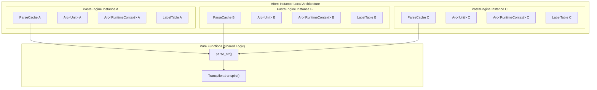
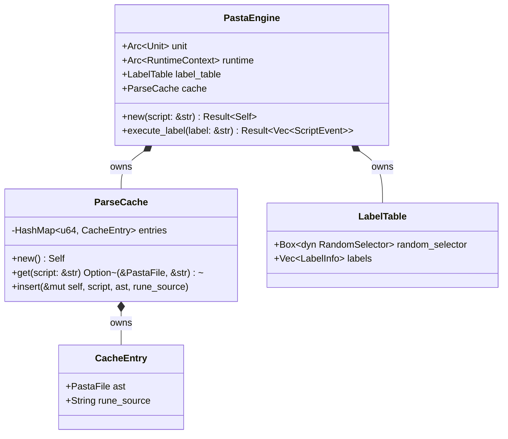

# Design Document: pasta-engine-independence

## Overview

**Purpose**: 本設計は、`PastaEngine`の複数インスタンスが同一プロセス内で完全に独立して動作することを保証するための構造変更を定義します。

**Users**: pasta DSLを使用するアプリケーション開発者が、マルチスレッド環境やマルチインスタンス環境で安全にエンジンを使用できるようになります。

**Impact**: 現在のグローバルキャッシュ(`static PARSE_CACHE`)をインスタンスフィールドに移行し、エンジン間の状態共有を完全に排除します。

### Goals

- 各`PastaEngine`インスタンスが全データを完全に所有する構造への変更
- グローバル`static`変数の完全排除（定数を除く）
- マルチスレッド環境での安全な並行実行
- 包括的なテストスイートによる独立性の検証

### Non-Goals

- Rune API制約による`Arc`使用の排除（API必須のため不可）
- インスタンス間でのキャッシュ共有最適化
- 新機能の追加（純粋なリファクタリング）
- 公開APIの変更

---

## Architecture

### Existing Architecture Analysis

**現在のアーキテクチャ**:
```
┌─────────────────────────────────────────────────────────┐
│                    Global State                          │
│  ┌──────────────────────────────────────────────────┐   │
│  │  static PARSE_CACHE: OnceLock<ParseCache>        │   │
│  │  ├── entries: Arc<RwLock<HashMap<u64, Entry>>>   │   │
│  │  │   ├── ast: Arc<PastaFile>                     │   │
│  │  │   └── rune_source: Arc<String>                │   │
│  └──────────────────────────────────────────────────┘   │
└────────────────────────┬────────────────────────────────┘
                         │ 参照
    ┌────────────────────┼────────────────────┐
    ▼                    ▼                    ▼
┌──────────┐       ┌──────────┐       ┌──────────┐
│ Engine A │       │ Engine B │       │ Engine C │
│ Arc<Unit>│       │ Arc<Unit>│       │ Arc<Unit>│
│ Arc<Ctx> │       │ Arc<Ctx> │       │ Arc<Ctx> │
└──────────┘       └──────────┘       └──────────┘
```

**問題点**:
- 全エンジンが同一`PARSE_CACHE`を共有
- キャッシュ状態の相互干渉リスク
- 要件1.5「static変数ゼロ」違反

### Architecture Pattern & Boundary Map

**選択パターン**: インスタンス所有モデル（Instance Ownership Model）



**Architecture Integration**:
- **選択パターン**: インスタンス所有 — 各エンジンが全データを所有、共有ポインタなし
- **ドメイン境界**: PastaEngine内に全状態を封じ込め
- **既存パターン保持**: パーサー・トランスパイラーは純粋関数として維持
- **新コンポーネント**: なし（構造変更のみ）
- **ステアリング準拠**: Rust型安全性、所有権による自動リソース管理

### Technology Stack

| Layer | Choice / Version | Role in Feature | Notes |
|-------|------------------|-----------------|-------|
| Runtime | Rune 0.14 | スクリプトVM | Arc<Unit>/Arc<RuntimeContext>必須（API制約） |
| Threading | std::thread | 並行実行テスト | rayon等は不使用 |
| Testing | Rust標準テストフレームワーク | 独立性検証 | 外部依存なし |

---

## Requirements Traceability

| Requirement | Summary | Components | Interfaces | Notes |
|-------------|---------|------------|------------|-------|
| 1.1 | 全データ所有 | PastaEngine | - | Arc使用はRune API制約として許容 |
| 1.2 | 実行状態独立 | PastaEngine, LabelTable | execute_label() | 既存実装で適合 |
| 1.3 | グローバル変数独立 | VariableManager | - | 既存実装で適合 |
| 1.4 | RandomSelector独立 | LabelTable | - | 既存実装で適合 |
| 1.5 | static変数ゼロ | ParseCache | - | グローバル→インスタンス化 |
| 2.1 | インスタンス内キャッシュ | ParseCache, PastaEngine | get(), insert() | 主要変更 |
| 2.2 | キャッシュ所有 | ParseCache | insert() | Arc削除 |
| 2.3 | 独立パース実行 | PastaEngine | new() | キャッシュ非共有 |
| 2.4 | 純粋関数 | parser, transpiler | parse_str(), transpile() | 既存で適合 |
| 2.5 | 自動解放 | PastaEngine | Drop | 所有権による自動実装 |
| 3.1-3.5 | 並行実行 | PastaEngine | - | Send実装で対応 |
| 4.1-5.5 | テストスイート | tests/ | - | 新規作成 |
| 6.1-6.5 | グローバル状態不在検証 | tests/ | - | 新規作成 |
| 7.1-7.5 | CI統合 | tests/ | - | cargo test対応 |

---

## Components and Interfaces

### Component Summary

| Component | Domain/Layer | Intent | Req Coverage | Key Dependencies | Contracts |
|-----------|--------------|--------|--------------|------------------|-----------|
| PastaEngine | Runtime | スクリプト実行エンジン | 1.1-1.5, 2.1, 2.3, 3.1-3.5 | ParseCache (P0), Rune (P0) | State |
| ParseCache | Cache | パース結果キャッシュ | 2.1-2.5 | - | Service |
| engine_independence_test | Test | 独立性検証 | 4.1-4.5, 6.1-6.5 | PastaEngine (P0) | - |
| concurrent_execution_test | Test | 並行実行検証 | 5.1-5.5 | PastaEngine (P0), std::thread (P0) | - |

---

### Runtime Layer

#### PastaEngine

| Field | Detail |
|-------|--------|
| Intent | Pasta DSLスクリプトの解析・実行を行うメインエンジン |
| Requirements | 1.1, 1.2, 1.3, 1.4, 1.5, 2.1, 2.3, 3.1, 3.2, 3.3, 3.4, 3.5 |

**Responsibilities & Constraints**
- スクリプトのパース、トランスパイル、コンパイル、実行を統合
- 全データ（Unit, RuntimeContext, LabelTable, ParseCache）を完全所有
- グローバル状態への依存なし
- `Send`トレイト実装（スレッド間移動可能）

**Dependencies**
- Inbound: アプリケーションコード — エンジン使用 (P0)
- Outbound: ParseCache — キャッシュアクセス (P0)
- External: Rune — VM実行 (P0)

**Contracts**: State ☑

##### State Management

**Before (現状)**:
```rust
pub struct PastaEngine {
    unit: Arc<rune::Unit>,
    runtime: Arc<rune::runtime::RuntimeContext>,
    label_table: LabelTable,
}
// グローバルキャッシュ参照
static PARSE_CACHE: OnceLock<ParseCache> = OnceLock::new();
```

**After (目標)**:
```rust
pub struct PastaEngine {
    /// コンパイル済みRuneユニット（Rune API制約によりArc必須）
    unit: Arc<rune::Unit>,
    /// Runeランタイムコンテキスト（Rune API制約によりArc必須）
    runtime: Arc<rune::runtime::RuntimeContext>,
    /// ラベルテーブル（完全所有）
    label_table: LabelTable,
    /// パースキャッシュ（インスタンス所有 - NEW）
    cache: ParseCache,
}
// static PARSE_CACHE は削除
```

- **State model**: 全フィールドがインスタンス所有
- **Persistence**: なし（インメモリのみ）
- **Concurrency strategy**: シングルスレッドアクセス（エンジンインスタンス単位）

**Implementation Notes**
- Arc使用はRune Vm::new() API制約による必須要件
- 各エンジンが独自のArc<Unit>とArc<RuntimeContext>を所有（エンジン間共有なし）
- `Send`は自動導出（全フィールドがSend）

---

#### ParseCache

| Field | Detail |
|-------|--------|
| Intent | パース済みAST・トランスパイル結果のキャッシュ |
| Requirements | 2.1, 2.2, 2.3, 2.4, 2.5 |

**Responsibilities & Constraints**
- スクリプトハッシュをキーにAST/Runeソースを保存
- インスタンスローカル（グローバル共有なし）
- スレッドセーフ不要（PastaEngine内でのみアクセス）

**Dependencies**
- Inbound: PastaEngine — キャッシュ操作 (P0)
- Outbound: なし
- External: なし

**Contracts**: Service ☑

##### Service Interface

**Before (現状)**:
```rust
pub struct ParseCache {
    entries: Arc<RwLock<HashMap<u64, CacheEntry>>>,
}

#[derive(Clone)]
struct CacheEntry {
    ast: Arc<PastaFile>,
    rune_source: Arc<String>,
}
```

**After (目標)**:
```rust
pub struct ParseCache {
    /// ハッシュ→キャッシュエントリのマップ（直接所有）
    entries: HashMap<u64, CacheEntry>,
}

struct CacheEntry {
    /// パース済みAST（直接所有）
    ast: PastaFile,
    /// トランスパイル済みRuneソース（直接所有）
    rune_source: String,
}

impl ParseCache {
    /// 新しい空のキャッシュを作成
    pub fn new() -> Self;
    
    /// スクリプトに対応するキャッシュエントリを取得（clone返却）
    /// - Preconditions: なし
    /// - Postconditions: 存在する場合は所有権を持つコピーを返す
    /// - Note: ライフタイム問題を避けるため、参照ではなく所有値を返す
    pub fn get(&self, script: &str) -> Option<(PastaFile, String)>;
    
    /// パース結果をキャッシュに保存
    /// - Preconditions: astとrune_sourceは有効なパース結果
    /// - Postconditions: 次回get()で取得可能
    pub fn insert(&mut self, script: &str, ast: PastaFile, rune_source: String);
    
    /// キャッシュをクリア
    pub fn clear(&mut self);
    
    /// キャッシュエントリ数を取得
    pub fn len(&self) -> usize;
    
    /// キャッシュが空かどうか
    pub fn is_empty(&self) -> bool;
}
```

- **Preconditions**: なし（空キャッシュから開始可能）
- **Postconditions**: insert後はget可能、Drop時に自動解放
- **Invariants**: entriesはスクリプトハッシュで一意

**Implementation Notes**
- `&mut self`メソッドへの変更（RwLock不要）
- get()はcloneした所有値を返す（借用チェッカー問題を回避）
- PastaFile/Stringのcloneコストは許容範囲（キャッシュヒット時のみ）
- PastaEngine::new()内でcache変更が必要なため`&mut cache`を使用

---

### Test Layer

#### engine_independence_test

| Field | Detail |
|-------|--------|
| Intent | 複数エンジンインスタンスの独立性を検証 |
| Requirements | 4.1, 4.2, 4.3, 4.4, 6.1, 6.2, 6.3 |

**Test Cases**:
1. 同一プロセス内で2エンジンが異なるスクリプトを独立実行
2. 同名グローバル変数が相互干渉しない
3. 同一スクリプトから複数エンジンが独立パース
4. 異なるRandomSelectorで乱数選択が独立
5. 一方のエンジン破棄後も他方が正常動作
6. 同時パース処理が相互干渉しない

**File Location**: `crates/pasta/tests/engine_independence_test.rs`

---

#### concurrent_execution_test

| Field | Detail |
|-------|--------|
| Intent | マルチスレッド環境でのSend実装を実証（補助的検証） |
| Requirements | 5.1, 5.2, 5.3, 5.4, 5.5 |

**Test Cases**:
1. 複数スレッドで独立エンジンを作成し、各スレッドでexecute_label
2. 各スレッドが独立した結果を生成することを確認
3. グローバル状態不在により構造的にデータ競合が発生しないことを確認

**Note**: 
- 主要検証は`engine_independence_test`で実施（同一スレッド内の複数インスタンス）
- 本テストは`Send`トレイト実装の実証と、マルチスレッド環境での動作確認
- 「確実な同時実行」は不要、スレッド間移動と独立実行を確認すれば十分

**File Location**: `crates/pasta/tests/concurrent_execution_test.rs`

---

## Data Models

### Domain Model



**Aggregates and Boundaries**:
- `PastaEngine`はアグリゲートルート、全データを所有
- `ParseCache`と`LabelTable`はエンティティ（PastaEngine内部）
- `CacheEntry`は値オブジェクト

**Business Rules**:
- エンジンインスタンス間でのデータ共有禁止
- グローバル`static`変数の使用禁止（定数除く）

---

## Testing Strategy

### Unit Tests

1. **ParseCache.get/insert**: キャッシュの基本操作
2. **ParseCache.clear**: キャッシュクリア
3. **ParseCache.hash_script**: ハッシュ計算の一貫性
4. **PastaEngine.new**: インスタンス作成と初期化

### Integration Tests

1. **engine_independence_test::test_independent_execution**: 2エンジンの独立実行
2. **engine_independence_test::test_global_variable_isolation**: グローバル変数独立性
3. **engine_independence_test::test_independent_parsing**: 独立パース
4. **engine_independence_test::test_random_selector_independence**: RandomSelector独立性
5. **engine_independence_test::test_drop_independence**: エンジン破棄の独立性

### Concurrency Tests (補助的検証)

1. **concurrent_execution_test::test_thread_safety**: 複数スレッドでエンジン作成・実行
   - 各スレッドで独立エンジンを作成し`execute_label()`
   - 各スレッドが期待通りのイベントを返すことを検証
   - `thread::spawn() + join()`で実装（Barrier不要）
2. **concurrent_execution_test::test_send_trait**: `Send`トレイトの実証
   - エンジンをスレッド境界越えに移動できることを確認

**検証アプローチ**:
- 複雑な同期機構は不要（単純なspawn + join）
- 主眼は「グローバル状態不在により構造的に安全」の実証
- データ競合検出ツール（Thread Sanitizer, Miri）は任意

### Static Analysis

1. **grep検証**: `static`変数（`static mut`, `OnceLock`, `LazyLock`）の不在確認
   ```bash
   grep -rn "static\s\+\(mut\|PARSE_CACHE\)" crates/pasta/src/
   ```

---

## Migration Strategy

### Phase 1: ParseCache変更

1. `cache.rs`の`ParseCache`構造体を簡素化
   - `Arc<RwLock<HashMap>>` → `HashMap`
   - `Arc<PastaFile>` → `PastaFile`
   - `Arc<String>` → `String`
2. メソッドシグネチャを`&mut self`に変更
3. 既存テスト（`cache.rs`内）の修正

### Phase 2: engine.rs変更

1. `static PARSE_CACHE`と`global_cache()`関数削除
2. `PastaEngine`に`cache: ParseCache`フィールド追加
3. `new()`および`with_random_selector()`の構築フロー変更：
   ```rust
   pub fn with_random_selector(script: &str, random_selector: Box<dyn RandomSelector>) -> Result<Self> {
       // Step 1: 空のキャッシュを作成
       let mut cache = ParseCache::new();
       
       // Step 2: キャッシュからパース結果取得（なければパース・保存）
       let (ast, rune_source) = if let Some(cached) = cache.get(script) {
           cached  // キャッシュヒット: 所有値を受け取る
       } else {
           // キャッシュミス: パース→トランスパイル→保存
           let ast = parse_str(script, "<script>")?;
           let rune_source = Transpiler::transpile(&ast)?;
           cache.insert(script, ast.clone(), rune_source.clone());
           (ast, rune_source)
       };
       
       // Step 3: ラベルテーブル構築
       let mut label_table = LabelTable::new(random_selector);
       Self::register_labels(&mut label_table, &ast.labels, None)?;
       
       // Step 4: Runeコンパイル（unit, runtime作成）
       // ... 既存のコンパイル処理 ...
       
       // Step 5: 全フィールドを持つPastaEngine構築
       Ok(Self { unit, runtime, label_table, cache })
   }
   ```
4. デバッグ出力の調整（キャッシュヒット/ミスのログ）

### Phase 3: テスト追加

1. `engine_independence_test.rs`作成
2. `concurrent_execution_test.rs`作成
3. CI/CD確認

### Rollback Triggers

- 既存テスト失敗
- ベンチマークで許容不能な性能低下（>50%）
- Miriでのメモリ安全性エラー

---

## Error Handling

### Error Categories

- **ParseError**: DSL構文エラー → 詳細なエラー位置を報告
- **TranspileError**: トランスパイル失敗 → AST状態を報告
- **RuneCompileError**: Runeコンパイル失敗 → Runeエラーを透過
- **VmError**: 実行時エラー → スタックトレースを報告

既存のエラー処理を維持、変更なし。

---

## Performance Considerations

### Impact Analysis

| 項目 | Before | After | Impact |
|------|--------|-------|--------|
| キャッシュヒット | 全エンジン共有 | インスタンス内のみ | 同一エンジンでの再実行時のみ有効 |
| メモリ使用 | 共有キャッシュ1つ | エンジン×キャッシュ | インスタンス数に比例 |
| ロック競合 | RwLock競合あり | なし | 改善 |

### Acceptable Trade-offs

- インスタンス間キャッシュ非共有は許容（設計意図通り）
- メモリ増加は通常使用で許容範囲（スクリプトサイズ依存）
- ロック競合排除によるスループット改善
