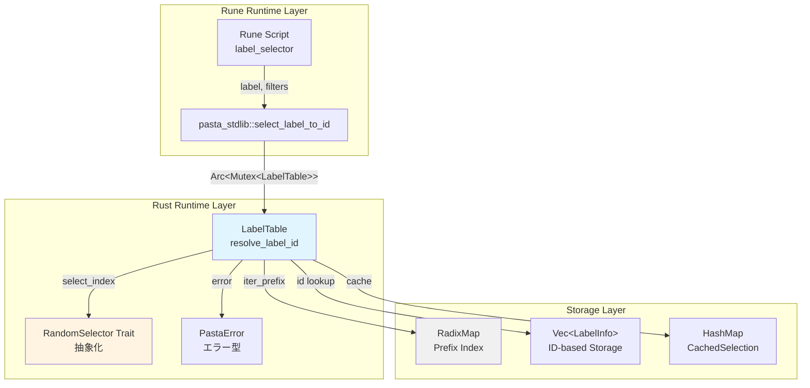
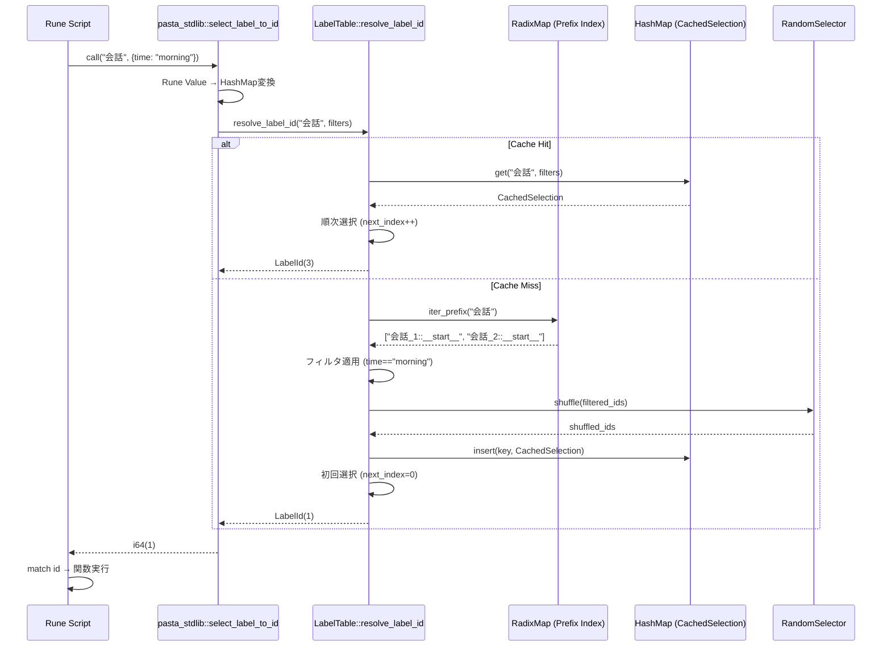
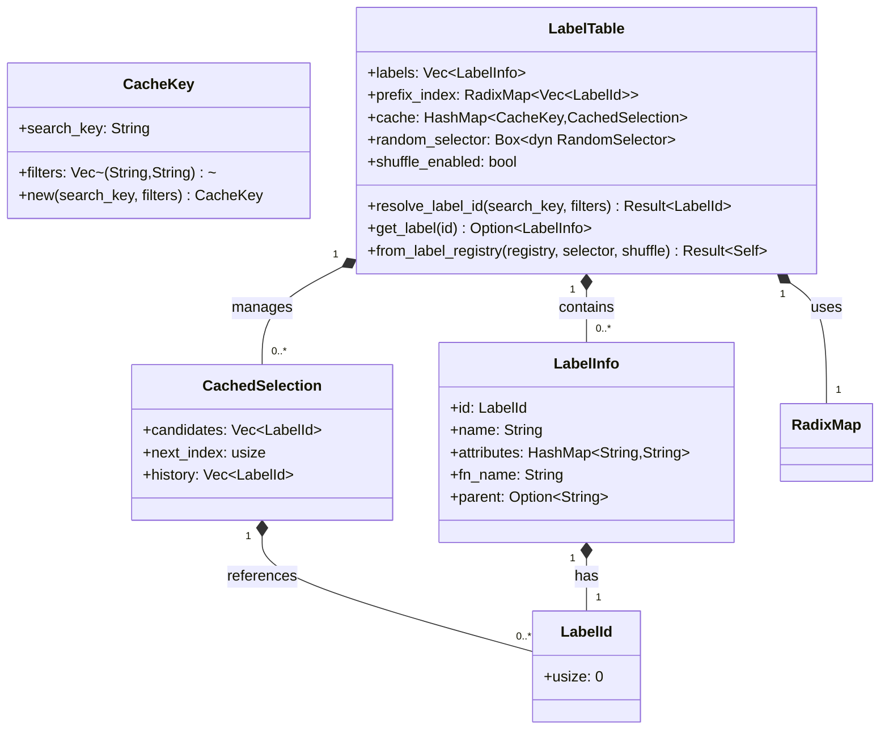

# 設計書: pasta-label-resolution-runtime

| 項目 | 内容 |
|------|------|
| **Document Title** | Pasta DSL ランタイムラベル解決システム 設計書 |
| **Version** | 1.0 |
| **Date** | 2025-12-14 |
| **Parent Spec** | pasta-declarative-control-flow (completed) |
| **Priority** | P1 |
| **Status** | Design Draft |

---

## Overview

本設計書は、Pasta DSLの**実行時ラベル解決機能**を実現するアーキテクチャを定義する。この機能は、トランスパイラーが生成する`pasta_stdlib::select_label_to_id()`関数のRust実装であり、宣言的コントロールフロー(call/jump文)の実行時動作を実現する中核システムである。

**Purpose**: Pasta DSLスクリプト実行時に、ラベル名から対応するRune関数を動的に解決し、前方一致検索・属性フィルタリング・ランダム選択・順次消化を提供する。

**Users**: Pastaスクリプト開発者が、ラベル名の前方一致とバリエーション定義により、柔軟な会話分岐と自然な表現を実現できる。

**Impact**: 既存の`LabelTable`を拡張し、新規メソッド`resolve_label_id()`と`set_shuffle_enabled()`を追加。`from_label_registry()`のシグネチャを簡素化（デフォルトshuffle有効）。Rune側の`select_label_to_id()`スタブを実装版に置き換え。

### Goals

- 前方一致検索による動的ラベル解決(検索キー"会話" → fn_name "会話_1::__start__", "会話_2::__start__")
- 属性フィルタリングによる条件分岐(＆time:morning → morning属性のみ選択)
- ランダム選択と順次消化(同名ラベルから1つずつ選択、全候補消化後にリセット)
- Rust ↔ Rune ブリッジの完成(Rune Value → Rust HashMap変換、LabelTableへのスレッドセーフアクセス)
- 後方互換性の維持(既存の`find_label()`は変更せず、新規`resolve_label_id()`を追加)

### Non-Goals

- トランスパイラーの変更(P0で完了、検索キー生成ロジックは既に実装済み)
- 拡張フィルタ構文(正規表現、範囲指定は将来機能)
- 単語辞書解決(WordDictionaryは別仕様で実装)

---

## Architecture

### Existing Architecture Analysis

Pasta DSLは2パストランスパイラーアーキテクチャを採用:
- **Pass 1 (label_registry.rs)**: Pasta DSLをパースし、`LabelRegistry`にラベル情報を収集
- **Pass 2 (mod_pasta_generator.rs)**: `LabelRegistry`から`mod pasta {}`コードを生成、`label_selector()`関数を実装
- **Runtime (labels.rs)**: `LabelTable`がラベル管理と検索を担当、`RandomSelector`トレイトで選択ロジックを抽象化

既存の統合ポイント:
- `PastaEngine::new()`: `LabelTable::from_label_registry()`でランタイムテーブルを構築
- `stdlib/mod.rs::create_module()`: Rune VMにPasta標準ライブラリを登録
- `runtime/random.rs`: `RandomSelector`トレイトと`DefaultRandomSelector`実装、テスト用`MockRandomSelector`

既存パターンを保持:
- トレイトベースの抽象化(`RandomSelector`)
- エラーハンドリング(`thiserror::Error`による構造化エラー)
- テスタビリティ(モックオブジェクトによる決定論的テスト)

### Architecture Pattern & Boundary Map

**選択パターン**: Layered Architecture with Dependency Injection



**ドメイン境界**:
- **Rune Runtime Layer**: Runeスクリプトからの呼び出しインターフェース、型変換を担当
- **Rust Runtime Layer**: ラベル解決のコアロジック、検索・フィルタリング・選択を実装
- **Storage Layer**: データ構造最適化、Trie前方一致検索とID-based参照を分離

**責務分離の設計決定**:
- `LabelTable`: 検索ロジックとキャッシュ管理を統合、単一責任原則に従う
- `RandomSelector`: テスタビリティのため抽象化、本番実装とモック実装を交換可能に
- `CachedSelection`: 順次消化ロジックをカプセル化、検索キーごとに独立した状態管理

**既存パターンとの整合性**:
- `RandomSelector`トレイト: 既存の`DefaultRandomSelector`と`MockRandomSelector`をそのまま使用
- エラー型拡張: `PastaError` enumに新規バリアントを追加、既存エラーハンドリングパターンを踏襲
- テストパターン: `tests/common/mod.rs`のユーティリティ関数を活用、一貫したテストスタイルを維持

### Technology Stack

| Layer | Choice / Version | Role in Feature | Notes |
|-------|------------------|-----------------|-------|
| Runtime Core | Rust 2021 Edition | ラベル解決エンジン実装 | 型安全性とゼロコスト抽象化 |
| Script Execution | rune 0.14 | Runeスクリプト実行とモジュール統合 | 既存依存、`rune::from_value<T>()`で型変換 |
| Data Structure | fast_radix_trie 1.1.0 | 前方一致検索の最適化 | **新規依存**、O(M)検索(Mは検索キー長) |
| Error Handling | thiserror 2 | 構造化エラー型定義 | 既存依存、`#[error]`マクロで宣言的定義 |
| Random Selection | rand 0.9 | `DefaultRandomSelector`の実装 | 既存依存、シャッフルアルゴリズム提供 |

**fast_radix_trie選定理由**:
- **パフォーマンス**: O(M)前方一致検索、Mは検索キー長(ラベル数に非依存)
- **API明確性**: `iter_prefix(query)`で前方一致結果を直接取得、シンプルな使用パターン
- **メモリ効率**: Radix構造により共通プレフィックスを共有、メモリ使用量削減
- **メンテナンス状態**: v1.1.0が最新、アクティブメンテナンス
- **既存代替案との比較**: HashMapフルスキャンO(N)より高速、trie-rsは複雑なAPI

詳細な技術選定根拠は`research.md`の"Technology Stack Evaluation"セクションを参照。

---

## System Flows

### ラベル解決フロー (Sequence Diagram)



**フロー設計決定**:
- **キャッシュキー**: `(search_key, filters)`のペアで一意識別、フィルタが異なれば別のキャッシュエントリ
- **初回シャッフル**: `shuffle_enabled=true`時、キャッシュ作成時に1回だけシャッフル、その後は順次選択
- **エラーハンドリング**: 各フェーズで失敗時は`PastaError`を返し、Rune側で`panic!`に変換

---

## Requirements Traceability

| Requirement | Summary | Components | Interfaces | Flows |
|-------------|---------|------------|------------|-------|
| 1.1, 1.2, 1.3, 1.4, 1.5 | 前方一致ラベル検索 | LabelTable, RadixMap | resolve_label_id | ラベル解決フロー |
| 2.1, 2.2, 2.3, 2.4, 2.5 | 属性フィルタリング | LabelTable | resolve_label_id | ラベル解決フロー |
| 3.1, 3.2, 3.3, 3.4 | ランダム選択 | LabelTable, RandomSelector | select_index | ラベル解決フロー |
| 4.1, 4.2, 4.3, 4.4, 4.5 | キャッシュベース消化 | LabelTable, CachedSelection | resolve_label_id | ラベル解決フロー |
| 5.1, 5.2, 5.3, 5.4, 5.5 | Rust ↔ Rune ブリッジ | pasta_stdlib, LabelTable | select_label_to_id, create_module | ラベル解決フロー |
| 6.1, 6.2, 6.3, 6.4, 6.5 | LabelRegistry → LabelTable 変換 | LabelTable | from_label_registry | - |

---

## Components and Interfaces

### Summary Table

| Component | Domain/Layer | Intent | Req Coverage | Key Dependencies (Priority) | Contracts |
|-----------|--------------|--------|--------------|----------------------------|-----------|
| LabelTable | Rust Runtime | ラベル解決とキャッシュ管理 | 1.1-1.5, 2.1-2.5, 3.1-3.4, 4.1-4.5, 6.1-6.5 | RandomSelector (P0), RadixMap (P0), PastaError (P0) | Service, State |
| RandomSelector | Rust Runtime | ランダム選択の抽象化 | 3.1-3.4 | - | Service |
| pasta_stdlib | Rune Bridge | Rune ↔ Rust 型変換とブリッジ | 5.1-5.5 | LabelTable (P0), rune (P0) | API, Service |
| PastaError | Rust Runtime | 構造化エラー型 | 1.3, 1.4, 2.3, 3.3, 6.3 | thiserror (P0) | State |
| CachedSelection | Rust Runtime | 順次消化状態管理 | 4.1-4.5 | - | State |
| LabelInfo | Rust Runtime | ラベルメタデータ | 6.1-6.5 | - | State |

---

### Rust Runtime Layer

#### LabelTable

| Field | Detail |
|-------|--------|
| Intent | ラベル解決エンジン: 前方一致検索、フィルタリング、ランダム選択、キャッシュベース消化を統合 |
| Requirements | 1.1-1.5, 2.1-2.5, 3.1-3.4, 4.1-4.5, 6.1-6.5 |

**Responsibilities & Constraints**
- 前方一致検索: RadixMapを使用してfn_nameのプレフィックスマッチングを実行(O(M)、Mは検索キー長)
- 属性フィルタリング: AND条件で複数フィルタを適用、全条件を満たすラベルのみを候補に残す
- キャッシュ管理: `(search_key, filters)`をキーとしたHashMapで`CachedSelection`を管理
- 順次消化: 同一キャッシュエントリから順次選択、全候補消化時に`PastaError::NoMoreLabels`を返す
- データ整合性: Vec<LabelInfo>のindexとLabelIdを一致させる(index = id.0)、不変性を保証

**Dependencies**
- Inbound: pasta_stdlib::select_label_to_id — Runeスクリプトからの呼び出し (P0)
- Outbound: RandomSelector::select_index — ランダム選択ロジック委譲 (P0)
- Outbound: RadixMap::iter_prefix — 前方一致検索 (P0)
- External: fast_radix_trie v1.1.0 — Trie実装 (P0)

**Contracts**: Service [x] / API [ ] / Event [ ] / Batch [ ] / State [x]

##### Service Interface

```rust
// crates/pasta/src/runtime/labels.rs
use fast_radix_trie::RadixMap;
use std::collections::HashMap;

#[derive(Debug, Clone, Copy, PartialEq, Eq, Hash)]
pub struct LabelId(pub usize);  // newtype wrapper for Vec index

pub struct LabelInfo {
    pub id: LabelId,
    pub name: String,
    pub attributes: HashMap<String, String>,
    pub fn_name: String,  // "会話_1::__start__" (crate:: prefix なし)
    pub parent: Option<String>,
}

#[derive(Debug, Clone, PartialEq, Eq, Hash)]
struct CacheKey {
    search_key: String,
    filters: Vec<(String, String)>,  // Sorted for consistent hashing
}

impl CacheKey {
    fn new(search_key: &str, filters: &HashMap<String, String>) -> Self {
        let mut filter_vec: Vec<_> = filters.iter()
            .map(|(k, v)| (k.clone(), v.clone()))
            .collect();
        filter_vec.sort();  // Ensure consistent ordering
        Self {
            search_key: search_key.to_string(),
            filters: filter_vec,
        }
    }
}

struct CachedSelection {
    candidates: Vec<LabelId>,  // Shuffled on first access
    next_index: usize,         // Sequential selection pointer
    history: Vec<LabelId>,     // Selection history for rollback/debugging
}

pub struct LabelTable {
    labels: Vec<LabelInfo>,  // ID-based storage (index = LabelId)
    prefix_index: RadixMap<Vec<LabelId>>,  // fn_name → [LabelId] for prefix search
    cache: HashMap<CacheKey, CachedSelection>,  // (search_key, filters) → shuffled IDs
    random_selector: Box<dyn RandomSelector>,
    shuffle_enabled: bool,  // Default: true (false for deterministic testing)
}

impl LabelTable {
    /// ラベルIDを解決 (前方一致検索 + フィルタリング + ランダム選択 + キャッシュベース消化)
    pub fn resolve_label_id(
        &mut self,
        search_key: &str,
        filters: &HashMap<String, String>,
    ) -> Result<LabelId, PastaError>;
    
    /// LabelIDからLabelInfo参照を取得
    pub fn get_label(&self, id: LabelId) -> Option<&LabelInfo>;
    
    /// LabelRegistry → LabelTable 変換 (デフォルト: shuffle_enabled=true)
    pub fn from_label_registry(
        registry: &LabelRegistry,
        random_selector: Box<dyn RandomSelector>,
    ) -> Result<Self, PastaError>;
    
    /// shuffle設定を変更 (主にテスト・デバッグ用)
    /// 
    /// DSL製作者がラベル候補の決定論的な順序を確認する場合や、
    /// 単体テストで再現性を確保する場合に使用。
    /// 
    /// # 注意
    /// 既存のキャッシュはクリアされない。次回のresolve_label_id()呼び出しから
    /// 新しい設定が適用される。
    pub fn set_shuffle_enabled(&mut self, enabled: bool);
    
    /// 既存メソッド (後方互換性維持、変更なし)
    pub fn find_label(
        &mut self,
        name: &str,
        filters: &HashMap<String, String>,
    ) -> Result<String, PastaError>;
}
```

- **Preconditions (resolve_label_id)**:
  - `search_key`が空文字列でない
  - `filters`のキー・値が有効なUTF-8文字列
  - `LabelTable`が`from_label_registry()`で正しく初期化されている

- **Postconditions (resolve_label_id)**:
  - 成功時: 前方一致+フィルタ条件を満たすラベルIDを返す
  - キャッシュエントリが存在する場合: `next_index`がインクリメントされる
  - キャッシュエントリが存在しない場合: 新規`CachedSelection`が作成される
  - 失敗時: `PastaError`を返す(候補なし、フィルタ不一致、全消化など)

- **Invariants**:
  - `labels[id.0]`は常に有効(ID = Vec index)
  - `cache`のキーは`(search_key, filters)`ペアで一意
  - `CachedSelection::next_index <= candidates.len()`
  - `shuffle_enabled=false`時、Trieのイテレーション順序が保持される(決定論的)

##### State Contract

```rust
// LabelTableの内部状態
pub struct LabelTable {
    labels: Vec<LabelInfo>,  // 不変: from_label_registry()で構築後、変更なし
    prefix_index: RadixMap<Vec<LabelId>>,  // 不変: 構築後、変更なし
    cache: HashMap<CacheKey, CachedSelection>,  // 可変: resolve_label_id()で更新
    random_selector: Box<dyn RandomSelector>,  // 不変: DI注入、参照のみ
    shuffle_enabled: bool,  // 可変: set_shuffle_enabled()で変更可能、デフォルトtrue
}

// CachedSelectionの状態遷移
// State 1: 初期化 (キャッシュミス時)
//   - candidates: シャッフル済みID列(shuffle_enabled=trueの場合)
//   - next_index: 0
//   - history: []
//
// State 2: 順次選択中 (next_index < candidates.len())
//   - next_index: 0 → 1 → 2 → ... (インクリメント)
//   - history: [selected_id_1, selected_id_2, ...]
//
// State 3: 全消化 (next_index == candidates.len())
//   - PastaError::NoMoreLabels を返す
//   - キャッシュエントリは削除されない(履歴保持)
```

---

#### RandomSelector

| Field | Detail |
|-------|--------|
| Intent | ランダム選択ロジックの抽象化、テスタビリティ確保 |
| Requirements | 3.1-3.4 |

**Responsibilities & Constraints**
- 配列のシャッフル: `shuffle(&mut [T])`メソッドで配列要素をランダムに並べ替え
- テスト可能性: トレイト実装により、本番実装とモック実装を交換可能に
- スレッドセーフ: `Send + Sync`境界を持ち、マルチスレッド環境で使用可能

**Dependencies**
- Inbound: LabelTable::resolve_label_id — シャッフル実行 (P0)
- External: rand v0.9 — `DefaultRandomSelector`の実装 (P1)

**Contracts**: Service [x]

##### Service Interface

```rust
// crates/pasta/src/runtime/random.rs (既存トレイト、変更なし)
pub trait RandomSelector: Send + Sync {
    fn select_index(&self, len: usize) -> Option<usize>;
    fn shuffle<T>(&self, slice: &mut [T]);
}

// DefaultRandomSelector (既存実装、変更なし)
pub struct DefaultRandomSelector;

// MockRandomSelector (既存実装、変更なし)
pub struct MockRandomSelector {
    indices: Vec<usize>,
    call_count: std::sync::atomic::AtomicUsize,
}
```

---

### Rune Bridge Layer

#### pasta_stdlib

| Field | Detail |
|-------|--------|
| Intent | Rune ↔ Rust 型変換とLabelTableブリッジ、Runeスクリプトからのラベル解決インターフェース |
| Requirements | 5.1-5.5 |

**Responsibilities & Constraints**
- Rune Value → Rust HashMap変換: `rune::from_value<T>()`パターンを使用
- LabelTableへのスレッドセーフアクセス: `Arc<Mutex<LabelTable>>`経由で呼び出し
- エラーメッセージ変換: `PastaError`をRune側のString型に変換、panic!発生
- Runeモジュール登録: `create_module()`で`pasta_stdlib`名前空間に関数を公開

**Dependencies**
- Inbound: Rune script (label_selector) — Runeスクリプトからの呼び出し (P0)
- Outbound: LabelTable::resolve_label_id — Rust側のラベル解決 (P0)
- External: rune v0.14 — `rune::from_value<T>()`、`Module`、`ContextError` (P0)

**Contracts**: API [x] / Service [x]

##### API Contract

| Method | Endpoint | Request | Response | Errors |
|--------|----------|---------|----------|--------|
| select_label_to_id | Rune function | (label: String, filters: Value) | i64 | String (panic message) |

##### Service Interface

```rust
// crates/pasta/src/stdlib/mod.rs
use std::sync::{Arc, Mutex};
use std::collections::HashMap;
use rune::{Module, ContextError};

pub fn create_module(label_table: Arc<Mutex<LabelTable>>) -> Result<Module, ContextError> {
    let mut module = Module::with_crate("pasta_stdlib")?;
    
    module.function("select_label_to_id", move |label: String, filters: rune::runtime::Value| -> Result<i64, String> {
        // Rune Value → Rust HashMap変換
        let filter_map = parse_rune_filters(filters)?;
        
        // LabelTable::resolve_label_id()呼び出し
        let mut table = label_table.lock().map_err(|e| format!("Lock failed: {}", e))?;
        let label_id = table.resolve_label_id(&label, &filter_map)
            .map_err(|e| format!("Label resolution failed: {}", e))?;
        
        Ok(label_id.0 as i64)
    })?;
    
    Ok(module)
}

fn parse_rune_filters(value: rune::runtime::Value) -> Result<HashMap<String, String>, String> {
    use rune::runtime::Value;
    
    match value {
        Value::Unit => {
            // フィルタなし → 空HashMap
            Ok(HashMap::new())
        }
        Value::Object(obj) => {
            // Rune Object → Rust HashMap変換
            let mut result = HashMap::new();
            
            for (key, value) in obj.iter() {
                // キーの型チェック
                let key_str = match key {
                    Value::String(s) => s.borrow_ref()?.to_string(),
                    _ => return Err(format!(
                        "Filter key must be string, got: {:?}",
                        key.type_info()
                    )),
                };
                
                // 値の型チェック
                let value_str = match value {
                    Value::String(s) => s.borrow_ref()?.to_string(),
                    _ => return Err(format!(
                        "Filter value must be string for key '{}', got: {:?}",
                        key_str,
                        value.type_info()
                    )),
                };
                
                result.insert(key_str, value_str);
            }
            
            Ok(result)
        }
        _ => {
            // Array, Tuple, その他の型 → エラー
            Err(format!(
                "Filters must be object or unit, got: {:?}",
                value.type_info()
            ))
        }
    }
}
```

- **Preconditions**:
  - `label_table`が有効な`Arc<Mutex<LabelTable>>`
  - `filters`がRune Object型またはUnit型

- **Postconditions**:
  - 成功時: ラベルIDをi64として返す
  - 失敗時: エラーメッセージをStringで返し、Rune側で`panic!`

---

### Error Handling Layer

#### PastaError

| Field | Detail |
|-------|--------|
| Intent | ラベル解決のエラー型定義、構造化エラーメッセージ |
| Requirements | 1.3, 1.4, 2.3, 3.3, 6.3 |

**Responsibilities & Constraints**
- 新規エラーバリアント追加: `NoMatchingLabel`, `InvalidLabel`, `RandomSelectionFailed`, `DuplicateLabelName`, `NoMoreLabels`
- 既存エラーバリアント保持: `LabelNotFound`など(後方互換性)
- エラーメッセージのフォーマット: `#[error]`マクロで宣言的に定義

**Dependencies**
- Inbound: LabelTable, pasta_stdlib — エラー生成と伝播 (P0)
- External: thiserror v2 — `#[derive(Error)]`マクロ (P0)

**Contracts**: State [x]

##### State Contract

```rust
// crates/pasta/src/error.rs
use thiserror::Error;
use std::collections::HashMap;

#[derive(Debug, Error)]
pub enum PastaError {
    // 既存エラー (変更なし)
    #[error("Label not found: {label}")]
    LabelNotFound { label: String },
    
    // 新規エラー (本仕様で追加)
    #[error("No matching label for '{label}' with filters {filters:?}")]
    NoMatchingLabel {
        label: String,
        filters: HashMap<String, String>,
    },
    
    #[error("Invalid label name: '{label}'")]
    InvalidLabel { label: String },
    
    #[error("Random selection failed")]
    RandomSelectionFailed,
    
    #[error("Duplicate label name: {name}")]
    DuplicateLabelName { name: String },
    
    #[error("No more labels for '{search_key}' with filters {filters:?}")]
    NoMoreLabels {
        search_key: String,
        filters: HashMap<String, String>,
    },
    
    // その他既存エラー...
}
```

---

## Data Models

### Core Data Structures



### Data Structure Design Decisions

**ID-based Access**:
- `LabelId(usize)`をnewtype wrapperとして定義、型安全性を確保
- `Vec<LabelInfo>`のindexとLabelIdを一致させる(id.0 = index)、O(1)アクセス
- 履歴管理は`Vec<LabelId>`、配列インデックスではなくIDで記録

**Trie Prefix Index**:
- `RadixMap<Vec<LabelId>>`で前方一致検索を最適化、O(M)検索(Mは検索キー長)
- Trieのキー: `fn_name.as_bytes()`、値: `Vec<LabelId>`(同一プレフィックスの全ID)
- 不変データ構造: `from_label_registry()`で構築後、変更なし

**Cache Key Design**:
- `(search_key, filters)`のペアで一意性を保証
- `filters`をVec<(String, String)>にソート、HashMap順序依存の問題を解決
- `CacheKey`に`Hash`トレイトを実装、HashMapのキーとして使用

**CachedSelection State**:
- `candidates`: シャッフル済みID列、初回作成時に1回だけシャッフル
- `next_index`: 順次選択ポインタ、0からcandidates.len()まで増加
- `history`: 選択履歴、デバッグとロールバックに使用

---

## Testing Strategy

### Unit Tests

| Test Case | Input | Expected Output | Requirement Coverage |
|-----------|-------|----------------|---------------------|
| 前方一致検索(グローバル) | search_key="会話" | ["会話_1::__start__", "会話_2::__start__"] | 1.1 |
| 前方一致検索(ローカル) | search_key="会話_1::選択肢" | ["会話_1::選択肢_1", "会話_1::選択肢_2"] | 1.2 |
| 候補なしエラー | search_key="存在しない" | PastaError::LabelNotFound | 1.3 |
| 空文字列エラー | search_key="" | PastaError::InvalidLabel | 1.4 |
| 属性フィルタ(単一) | filters={"time":"morning"} | morning属性のみ残る | 2.1 |
| 属性フィルタ(複数AND) | filters={"time":"morning","weather":"sunny"} | 両方の属性を持つラベルのみ残る | 2.2 |
| フィルタ不一致エラー | filters={"time":"nonexistent"} | PastaError::NoMatchingLabel | 2.3 |
| ランダム選択 | 複数候補 | MockRandomSelector::select_index()呼び出し確認 | 3.1 |
| 単一候補(ランダム選択スキップ) | 候補1つ | その候補を直接返す | 3.2 |
| キャッシュベース消化 | 同一キー2回呼び出し | 異なるIDが返る | 4.1 |
| 全消化リセット | 全候補消化後 | PastaError::NoMoreLabels | 4.2 |
| フィルタ別履歴管理 | 同一search_key、異なるfilters | 独立したキャッシュエントリ | 4.3 |
| Rune Value変換(Unit) | Value::Unit | Ok(空HashMap) | 5.2 |
| Rune Value変換(Object有効) | Object{"time": "morning"} | Ok(HashMap{"time": "morning"}) | 5.2 |
| Rune Value変換(非String key) | Object{123: "value"} | Err("Filter key must be string, got: Integer") | 5.2 |
| Rune Value変換(非String value) | Object{"key": 456} | Err("Filter value must be string for key 'key', got: Integer") | 5.2 |
| Rune Value変換(Array型) | Value::Array([...]) | Err("Filters must be object or unit, got: Array") | 5.2 |
| Rune Value変換(複数フィルタ) | Object{"time": "morning", "weather": "sunny"} | Ok(HashMap with 2 entries) | 5.2 |
| LabelRegistry変換 | 有効なLabelRegistry | LabelTable構築成功 | 6.1 |
| 重複fn_nameエラー | 同一fn_nameが2つ | PastaError::DuplicateLabelName | 6.3 |

### Integration Tests

1. **エンドツーエンド実行テスト**:
   - Pasta DSL → トランスパイル → Rune実行 → ラベル解決 → 正しい関数が呼ばれる
   - `examples/`に簡易スクリプトを作成、`cargo run --example`で実行確認

2. **決定論的テスト**:
   - `MockRandomSelector`でシード固定 → 期待される順序でラベルが選ばれる
   - `shuffle_enabled=false`モードでTrie順序そのまま → テストの再現性確保

3. **スレッドセーフ性テスト**:
   - `Arc<Mutex<LabelTable>>`を複数スレッドから呼び出し → デッドロックや不整合が発生しない
   - `std::thread::spawn()`で並行アクセス、結果の一貫性を検証

---

## Implementation Notes

### 実装の優先順位

**Phase 1: Core Implementation** (必須、1週目)
1. LabelInfo構造体にid: LabelIdフィールド追加
2. CacheKey, CachedSelection構造体の実装
3. LabelTable::from_label_registry()の拡張(デフォルトshuffle_enabled=true)
4. LabelTable::resolve_label_id()の実装(RadixMap+iter_prefix()で前方一致検索)
5. PastaErrorに新規バリアント追加
6. RadixMap<Vec<LabelId>>の構築ロジック実装

**Phase 2: Rune Integration** (必須、1週目)
1. pasta_stdlib::create_module()のシグネチャ変更(Arc<Mutex<LabelTable>>引数追加)
2. parse_rune_filters()関数の実装(Rune Value → HashMap変換)
3. select_label_to_id()スタブの置き換え(resolve_label_id()呼び出し)

**Phase 3: Performance Validation** (必須、1週目)
1. パフォーマンステスト(criterion.rs、N=100/300/500/1000)
2. メモリ使用量測定(LabelTable全体で数MB以下を確認)
3. ベンチマーク結果をREADME.mdに文書化

### パフォーマンス考慮事項

- **想定ラベル数**: 100～500ラベル(典型的なスクリプト)
- **前方一致検索**: RadixMap+iter_prefix()でO(M)検索(Mは検索キー長、ラベル数に非依存)
- **性能目標**: N=500で平均5ms以下、P95で10ms以下
- **メモリ使用量**: LabelTable全体で数MB程度(問題なし)

**ベンチマーク測定計画**:
- criterion.rs使用、N=100/300/500/1000でのresolve_label_id()実行時間測定
- 条件: 前方一致候補10%、フィルタ適用後5候補、キャッシュミス時の初回実行
- 実装ファイル: `crates/pasta/benches/label_resolution.rs`
- Phase 3完了直後に測定、結果をREADME.mdに文書化

### 後方互換性

**既存コードへの影響**:
- `find_label()`メソッドは変更せず、既存コードは動作継続
- `from_label_registry()`のシグネチャ変更により、`shuffle_enabled`引数が削除される
  - **本番コード（engine.rs）**: 変更不要。デフォルトでshuffle有効（`shuffle_enabled=true`）
  - **既存テスト（labels.rs 6箇所）**: コンパイルエラーで検出。`shuffle_enabled`引数を削除し、テーブル構築後に`.set_shuffle_enabled(false)`を呼び出す
- エラー型の拡張は既存エラーハンドリングに影響なし(enumバリアント追加のみ)

**移行戦略**:
```rust
// Before: from_label_registry(registry, selector, false)
// After:
let mut table = LabelTable::from_label_registry(registry, selector)?;
table.set_shuffle_enabled(false);  // テスト・デバッグ用
```

**DSL製作者向け機能**:
- `set_shuffle_enabled(false)`により、決定論的な順序でラベル候補を確認可能
- デバッグ時に「どのラベルがどの順序で選ばれるか」を検証できる

---

## Security Considerations

- **入力検証**: `search_key`の空文字列チェック、`filters`の有効性検証
- **パニック防止**: `unwrap()`を避け、`?`演算子でエラー伝播
- **スレッドセーフ**: `Arc<Mutex<LabelTable>>`によるロック、デッドロック防止策(短いクリティカルセクション)
- **DoS対策**: 無限ループやスタックオーバーフローを防ぐ、ラベル数上限チェック(将来機能)

---

## Risks and Mitigations

| Risk | Likelihood | Impact | Mitigation |
|------|-----------|--------|------------|
| fast_radix_trie APIの変更 | Low | Medium | Phase 1実装時に実際APIを検証、差異があれば調整 |
| shuffle_enabled導入による既存コード破壊 | Low | High | from_label_registry()のシグネチャ変更、コンパイルエラーで検出可能 |
| キャッシュメモリ使用量増加 | Medium | Low | 現実的なスクリプトサイズでは数MB程度、監視とプロファイリングで確認 |
| Rune Value変換の失敗 | Medium | Medium | parse_rune_filters()で型チェック、エラーメッセージを明確に |
| デッドロック(Mutex) | Low | High | クリティカルセクション最小化、ロック取得順序の統一 |

---

## Future Work

- **拡張フィルタ構文**: 正規表現(`＆name:/^さくら.*/`)、範囲指定(`＆score:>50`)
- **キャッシュ戦略**: LRUキャッシュ導入、メモリ使用量削減
- **デバッグ支援**: ラベル解決のトレースログ、呼び出しグラフ可視化
- **エラーメッセージ改善**: 候補ラベルのサジェスト(Levenshtein距離による類似ラベル提示)
- **パフォーマンスプロファイリング**: 大規模スクリプト(1000+ラベル)での性能測定

---

## References

- **親仕様**: `.kiro/specs/completed/pasta-declarative-control-flow/`
- **GRAMMAR.md**: `crates/pasta/GRAMMAR.md` (ラベル定義、属性構文)
- **現在の実装**: `crates/pasta/src/runtime/labels.rs`
- **Gap Analysis**: `.kiro/specs/pasta-label-resolution-runtime/gap-analysis.md`
- **Requirements**: `.kiro/specs/pasta-label-resolution-runtime/requirements.md`
- **fast_radix_trie documentation**: https://docs.rs/fast_radix_trie/1.1.0/
- **rune documentation**: https://docs.rs/rune/0.14/
