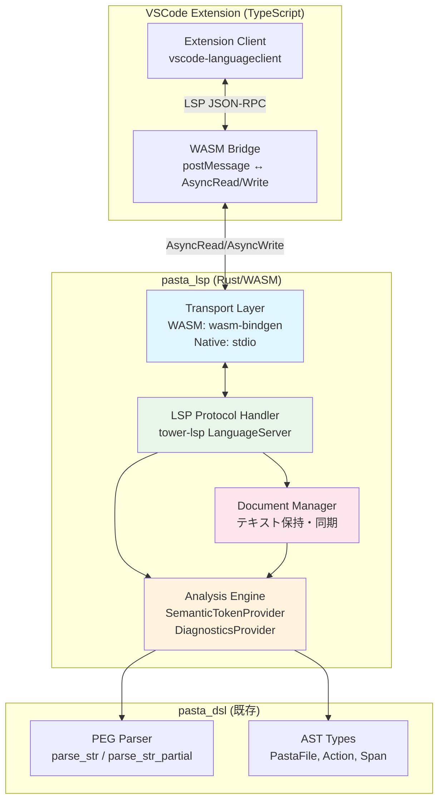
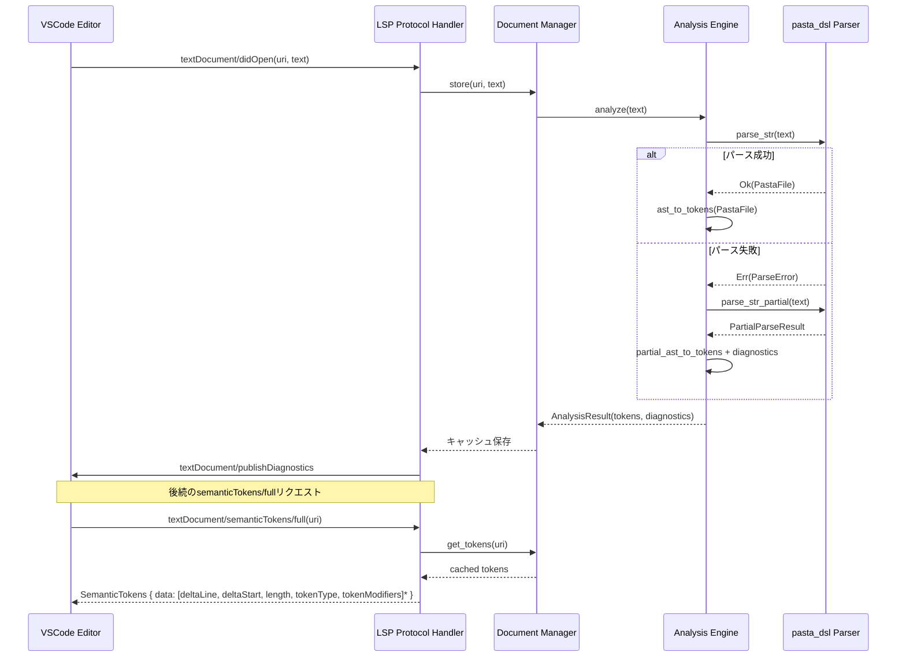
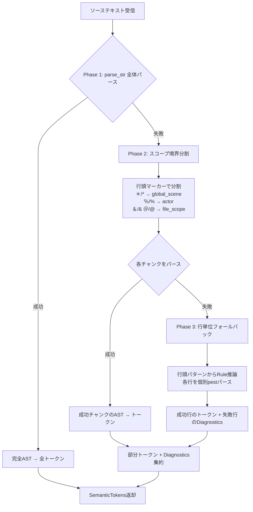

# Design Document — pasta-language-server

## Overview

**目的**: 本機能は、Pasta DSL（`*.pasta`ファイル）向けのLanguage Server Protocol（LSP）サーバーを提供する。VSCode拡張機能にWASMバイナリとして同梱し、追加インストール不要でシンタックスハイライトを実現する。

**ユーザー**: Pasta DSLを使ってゴースト対話スクリプトを記述する開発者が対象。エディタ上でDSL構文の色分け表示を受け、コードの可読性向上と構文エラーの早期発見を行う。

**インパクト**: 既存の`pasta_dsl`クレートのパーサー・AST資産を再利用し、新規の`crates/pasta_lsp/`クレートとして追加する。既存クレートへの影響は、`pasta_dsl`への部分パースAPI（`parse_str_partial()`）の追加のみ。

### ゴール
- LSP 3.17準拠のセマンティックトークンプロバイダーとして動作する
- pest PEGパーサーによる完全な構文解析結果に基づくインライン要素レベルの色分け
- `wasm32-unknown-unknown`ターゲットでビルド可能、VSCode拡張にバンドル可能
- パースエラー時も部分的トークンを提供し、編集中のUXを維持する

### 非ゴール
- デバッグ対応（DAP統合は将来フェーズ）
- 自動補完・コード補完（将来フェーズで`pasta_core`連携時に検討）
- リファクタリング支援（rename, code action等）
- ネイティブ（stdio/TCP）サーバーバイナリの提供（WASMファーストで設計し、ネイティブ対応は将来拡張）
- `pasta_lua`・`pasta_core`・`pasta_shiori`への依存

## Architecture

### Architecture Pattern & Boundary Map

**選択パターン**: **2層分離アーキテクチャ**（research.mdパターンBの簡略化版）

研究段階ではパターンB（`pasta_lsp_core` / `pasta_lsp_server` / `pasta_lsp_wasm`の3クレート分離）を検討したが、scope-evolution.mdの原則「**スコープ外にするのはよほどのことがあるとき**」および「**まずスコープ拡張を優先**」に従い、初期は単一クレート（`pasta_lsp`）内で論理的にレイヤー分離する。ネイティブサーバー需要が発生した時点で物理的なクレート分割を行う。



**アーキテクチャ統合**:
- **選択パターン**: 2層分離（Protocol Layer + Analysis Layer）、単一クレート内
- **ドメイン境界**: Transport ← Protocol Handler ← Analysis Engine ← pasta_dsl の一方向依存
- **既存パターン維持**: `Result<T, PastaError>`エラーパターン、`<feature>_test.rs`テスト命名規則
- **新規コンポーネント根拠**: pasta_dslは解析専門、LSP統合は別責務のため新クレートが必要
- **Steering準拠**: Pure Virtual Workspace構成、`crates/`配下配置、MIT/Apache-2.0ライセンス

### Technology Stack

| レイヤー          | 技術 / バージョン                   | 本機能での役割                             | 備考                                                                                                                                                                                                                                                                                                                                                                                |
| ----------------- | ----------------------------------- | ------------------------------------------ | ----------------------------------------------------------------------------------------------------------------------------------------------------------------------------------------------------------------------------------------------------------------------------------------------------------------------------------------------------------------------------------- |
| LSPフレームワーク | tower-lsp 0.20 (`runtime-agnostic`) | LanguageServer trait、JSON-RPCハンドリング | WASM互換。**リスク受容**: 最終更新から2年以上経過しているが、LSP 3.17機能は安定しており本仕様には十分。Analysis層の分離により、将来のフレームワーク移行時の影響を最小化。問題発生時はコミュニティフォーク（rust-analyzer等の主要プロジェクトで使用実績あり）またはlsp-server移行を検討。LSPプロトコル自体の安定性とセマンティックトークン機能の成熟により、セキュリティリスクは低い |
| LSP型定義         | lsp-types 0.97                      | SemanticTokens, Diagnostic等の型           | tower-lspが再エクスポート（0.94.1）。必要に応じ直接依存                                                                                                                                                                                                                                                                                                                             |
| パーサー          | pasta_dsl 0.1.x (pest 2.8)          | PEGパース、AST生成                         | `default-features = false`でWASM互換                                                                                                                                                                                                                                                                                                                                                |
| エラー型          | thiserror 2                         | LangServerError定義                        | `no_std`対応でWASM互換                                                                                                                                                                                                                                                                                                                                                              |
| WASMブリッジ      | wasm-bindgen 0.2                    | JS⇔Rustバインディング                      | `cfg(target_arch = "wasm32")`で条件コンパイル                                                                                                                                                                                                                                                                                                                                       |
| 非同期            | wasm-bindgen-futures 0.4            | JS Promise⇔Rust Future変換                 | WASM環境専用                                                                                                                                                                                                                                                                                                                                                                        |
| シリアライズ      | serde 1 / serde_json 1              | JSON-RPCメッセージ処理                     | WASM互換                                                                                                                                                                                                                                                                                                                                                                            |
| テキスト管理      | 標準ライブラリString                | ドキュメントテキスト保持                   | 初期はString直接管理。パフォーマンス問題時にropey検討                                                                                                                                                                                                                                                                                                                               |

## System Flows

### フロー1: ドキュメントオープン→セマンティックトークン提供



### フロー2: パースエラー時の部分トークン提供（Phase 1→2→3）



## Requirements Traceability

| 要件      | 概要                      | コンポーネント                    | インターフェース                      | フロー  |
| --------- | ------------------------- | --------------------------------- | ------------------------------------- | ------- |
| R1.1-R1.5 | LSPサーバー基盤           | LSP Protocol Handler              | LanguageServer trait                  | フロー1 |
| R2.1      | semanticTokens/full       | SemanticTokenProvider             | semantic_tokens_full()                | フロー1 |
| R2.2      | 14トークンタイプ識別      | SemanticTokenProvider             | TOKEN_LEGEND                          | —       |
| R2.3      | 変更時の再計算            | Document Manager, Analysis Engine | analyze()                             | フロー1 |
| R2.4      | インライン要素レベル粒度  | SemanticTokenProvider             | action_to_tokens()                    | —       |
| R2.5      | 全角/半角マーカー同等認識 | Analysis Engine (pasta_dsl委譲)   | —                                     | —       |
| R2.6      | エラー時の部分トークン    | Analysis Engine                   | partial_analyze()                     | フロー2 |
| R3.1      | parse_str()利用           | Analysis Engine                   | parse_str()                           | フロー1 |
| R3.2      | Diagnostics通知           | DiagnosticsProvider               | to_lsp_diagnostics()                  | フロー1 |
| R3.3      | ASTノードからトークン算出 | SemanticTokenProvider             | visit_*()                             | —       |
| R3.4      | クラッシュ耐性            | LSP Protocol Handler              | catch_unwind + log                    | —       |
| R3.5      | parse_str_partial()       | Analysis Engine → pasta_dsl       | parse_str_partial()                   | フロー2 |
| R3.5.1    | PartialParseResult型定義  | pasta_dsl Extensions              | PartialParseResult, PartialParseError | —       |
| R3.5.2    | parse_str_partial() API   | pasta_dsl Extensions              | parse_str_partial()                   | フロー2 |
| R3.5.3    | Pest Rule個別適用         | pasta_dsl Extensions              | parse_with_rule()                     | —       |
| R3.5.4    | 行指向文法特性活用        | pasta_dsl Extensions              | infer_rule_from_line()                | —       |
| R3.5.5    | pasta_dsl部分パーステスト | pasta_dsl Extensions              | tests/partial_parse_test.rs           | —       |
| R4.1-R4.5 | WASMビルド対応            | Transport Layer                   | cfg(wasm32)                           | —       |
| R5.1-R5.5 | クレート設計              | 全体                              | Cargo.toml                            | —       |
| R6.1-R6.4 | ドキュメント管理          | Document Manager                  | open/change/close                     | フロー1 |
| R7.1-R7.6 | テスト要件                | 全テストモジュール                | —                                     | —       |

## Components and Interfaces

| コンポーネント      | レイヤー      | 目的                         | 要件カバレッジ       | 主要依存(P0)                        | コントラクト |
| ------------------- | ------------- | ---------------------------- | -------------------- | ----------------------------------- | ------------ |
| PastaLangServer     | Protocol      | tower-lsp LanguageServer実装 | R1                   | tower-lsp (P0), AnalysisEngine (P0) | Service      |
| AnalysisEngine      | Analysis      | AST→トークン変換、部分パース | R2, R3               | pasta_dsl (P0), lsp-types (P0)      | Service      |
| DocumentManager     | Analysis      | テキスト保持・同期           | R6                   | —                                   | State        |
| TransportBridge     | Transport     | WASM/Native抽象化            | R4                   | wasm-bindgen (P0, WASM時)           | Service      |
| parse_str_partial() | pasta_dsl Ext | 部分パース実装               | R3.5, R3.5.1～R3.5.5 | pest (P0)                           | API          |

### Protocol Layer

#### PastaLangServer

| 項目 | 詳細                                                                                  |
| ---- | ------------------------------------------------------------------------------------- |
| 責務 | tower-lsp `LanguageServer` traitの実装。LSPライフサイクル管理、リクエストディスパッチ |
| 要件 | R1.1, R1.2, R1.3, R1.4, R1.5, R2.1, R2.3, R3.4                                        |

**責務と制約**
- LSPプロトコルメッセージのハンドリング（initialize, didOpen, didChange, didClose, semanticTokens/full）
- `AnalysisEngine`と`DocumentManager`への委譲（自身はビジネスロジックを持たない）
- `std::panic::catch_unwind`によるパーサークラッシュ保護（R3.4）

**依存**
- Inbound: VSCode Extension — LSP JSON-RPC メッセージ (P0)
- Outbound: AnalysisEngine — 解析委譲 (P0)
- Outbound: DocumentManager — テキスト管理委譲 (P0)
- External: tower-lsp 0.20 — LanguageServer trait (P0)

**コントラクト**: Service [x] / API [ ] / Event [ ] / Batch [ ] / State [ ]

##### Service Interface
```rust
#[tower_lsp::async_trait]
impl LanguageServer for PastaLangServer {
    async fn initialize(&self, params: InitializeParams) -> Result<InitializeResult>;
    async fn initialized(&self, params: InitializedParams);
    async fn shutdown(&self) -> Result<()>;
    async fn did_open(&self, params: DidOpenTextDocumentParams);
    async fn did_change(&self, params: DidChangeTextDocumentParams);
    async fn did_close(&self, params: DidCloseTextDocumentParams);
    async fn semantic_tokens_full(
        &self,
        params: SemanticTokensParams,
    ) -> Result<Option<SemanticTokensResult>>;
}
```
- 前提条件: initialize完了後にのみdidOpen/didChange/semanticTokens呼び出し可能
- 事後条件: semanticTokens/fullはキャッシュ済みトークンを返却（解析はdidOpen/didChange時に実行済み）
- 不変条件: パーサーエラーでサーバープロセスは停止しない

### Analysis Layer

#### AnalysisEngine

| 項目 | 詳細                                                                |
| ---- | ------------------------------------------------------------------- |
| 責務 | pasta_dsl ASTからLSPセマンティックトークンへの変換、Diagnostics生成 |
| 要件 | R2.1, R2.2, R2.4, R2.5, R2.6, R3.1, R3.2, R3.3, R3.5                |

**責務と制約**
- `pasta_dsl::parse_str()`によるAST取得とトークン変換
- パースエラー時の`parse_str_partial()`による部分パース→部分トークン生成
- ASTビジターパターンによるノード走査とトークンマッピング
- UTF-8バイトオフセット → LSP UTF-16行/列位置への変換

**依存**
- Inbound: PastaLangServer — 解析リクエスト (P0)
- Outbound: pasta_dsl — parse_str(), parse_str_partial() (P0)
- External: lsp-types — SemanticToken, Diagnostic型 (P0)

**コントラクト**: Service [x] / API [ ] / Event [ ] / Batch [ ] / State [ ]

##### Service Interface
```rust
/// 解析エンジン
pub struct AnalysisEngine;

/// 解析結果
pub struct AnalysisResult {
    /// エンコード済みセマンティックトークン（LSP deltaエンコーディング）
    pub tokens: Vec<SemanticToken>,
    /// パースエラーから生成されたDiagnostics
    pub diagnostics: Vec<Diagnostic>,
}

impl AnalysisEngine {
    /// ドキュメント全体を解析し、トークンとDiagnosticsを生成する
    pub fn analyze(&self, source: &str, uri: &Url) -> AnalysisResult;
}
```
- 前提条件: `source`は有効なUTF-8文字列
- 事後条件: パースエラー時も可能な限りトークンを返却（空でも可）
- 不変条件: 全角/半角マーカーは同一トークンタイプにマッピングされる

#### DocumentManager

| 項目 | 詳細                                                             |
| ---- | ---------------------------------------------------------------- |
| 責務 | 開かれたドキュメントのテキスト保持、増分更新、解析結果キャッシュ |
| 要件 | R6.1, R6.2, R6.3, R6.4                                           |

**責務と制約**
- `HashMap<Url, DocumentState>`によるドキュメント状態管理
- `TextDocumentContentChangeEvent`のfull/incremental両対応
- テキスト変更時の自動再解析トリガー
- UNICODEバイトオフセットの正確な計算（日本語識別子・全角マーカー対応）

**依存**
- Inbound: PastaLangServer — open/change/close通知 (P0)
- Outbound: AnalysisEngine — 再解析リクエスト (P0)

**コントラクト**: Service [ ] / API [ ] / Event [ ] / Batch [ ] / State [x]

##### State Management
```rust
/// ドキュメント状態
pub struct DocumentState {
    /// ドキュメント全文
    pub text: String,
    /// バージョン番号
    pub version: i32,
    /// 最新の解析結果（キャッシュ）
    pub analysis: Option<AnalysisResult>,
}

/// ドキュメントマネージャ
pub struct DocumentManager {
    documents: HashMap<Url, DocumentState>,
}

impl DocumentManager {
    pub fn open(&mut self, uri: Url, text: String, version: i32);
    pub fn change(&mut self, uri: &Url, changes: Vec<TextDocumentContentChangeEvent>, version: i32);
    pub fn close(&mut self, uri: &Url);
    pub fn get(&self, uri: &Url) -> Option<&DocumentState>;
    pub fn get_mut(&mut self, uri: &Url) -> Option<&mut DocumentState>;
}
```
- 永続化: なし（メモリのみ）
- 一貫性: エディタのバージョン番号による楽観的管理
- 並行性: tower-lspが`&self`でハンドラを呼ぶため、内部で`RwLock`使用（WASM時はシングルスレッドのため`RefCell`代替）

### pasta_dsl Extensions

#### parse_str_partial() Implementation

| 項目 | 詳細                                                                            |
| ---- | ------------------------------------------------------------------------------- |
| 責務 | パースエラー時も部分的なASTとエラー情報を返却し、編集中のハイライトUXを維持する |
| 要件 | R3.5, R3.5.1, R3.5.2, R3.5.3, R3.5.4, R3.5.5                                    |

**責務と制約**
- 3段階フォールバック戦略（Phase 1: Full Parse → Phase 2: Scope Split → Phase 3: Line-by-Line）
- 各Phaseで成功した部分のASTを収集し、失敗した部分は次のPhaseへ
- 最終的に成功したASTとエラー情報を`PartialParseResult`として返却
- Pasta DSLの行指向文法特性を活用し、行頭パターンからpest Ruleを推論

**依存**
- Inbound: AnalysisEngine — パース失敗時のフォールバック (P0)
- Internal: pest parser — Rule個別適用 (P0)

**コントラクト**: API [x] / Service [ ] / Event [ ] / Batch [ ] / State [ ]

##### API Interface
```rust
/// 部分パース結果
pub struct PartialParseResult {
    /// パース成功した部分のASTアイテム
    pub items: Vec<FileItem>,
    /// 各行/スコープのパースエラー
    pub errors: Vec<PartialParseError>,
}

/// 部分パースエラー
pub struct PartialParseError {
    /// エラーが発生した行番号（1-based）
    pub line: usize,
    /// エラーメッセージ
    pub message: String,
    /// エラー範囲のSpan（取得できた場合）
    pub span: Option<Span>,
}

/// 部分パースAPI
pub fn parse_str_partial(source: &str) -> PartialParseResult;
```

**実装アルゴリズム**:

```rust
pub fn parse_str_partial(source: &str) -> PartialParseResult {
    // Phase 1: Full Parse試行
    match parse_str(source) {
        Ok(pasta_file) => return PartialParseResult {
            items: pasta_file.items,
            errors: vec![],
        },
        Err(_) => { /* Phase 2へ */ }
    }

    let mut partial_items = Vec::new();
    let mut partial_errors = Vec::new();

    // Phase 2: Scope Boundary Split
    let chunks = split_by_scope_markers(source); // ＊, ％, ＆, ＠で分割
    for chunk in chunks {
        let rule = infer_rule_from_marker(&chunk); // 行頭マーカーからRule推論
        match parse_with_rule(&chunk.text, rule) {
            Ok(pairs) => {
                // ASTへ変換して収集
                partial_items.extend(pairs_to_items(pairs));
            }
            Err(_) => {
                // Phase 3: Line-by-Line Fallback
                for (line_no, line) in chunk.lines().enumerate() {
                    let line_rule = infer_rule_from_line(line);
                    match parse_with_rule(line, line_rule) {
                        Ok(pairs) => partial_items.extend(pairs_to_items(pairs)),
                        Err(e) => partial_errors.push(PartialParseError {
                            line: chunk.start_line + line_no,
                            message: format!("{}", e),
                            span: extract_span_from_error(&e),
                        }),
                    }
                }
            }
        }
    }

    PartialParseResult {
        items: partial_items,
        errors: partial_errors,
    }
}
```

**行頭パターン→Rule推論テーブル**:

| 行頭パターン | Rule                     | 用途                     |
| ------------ | ------------------------ | ------------------------ |
| `＊` / `*`   | `Rule::global_scene`     | グローバルシーン定義     |
| `・` / `-`   | `Rule::local_scene_line` | ローカルシーン定義       |
| `＆` / `&`   | `Rule::file_attr`        | ファイル属性             |
| `＠` / `@`   | `Rule::file_word`        | ファイルスコープ単語定義 |
| `％` / `%`   | `Rule::actor`            | アクタースコープ         |
| `＄` / `$`   | `Rule::var_set`          | 変数代入                 |
| `＞` / `>`   | `Rule::call`             | Call文                   |
| `＃` / `#`   | `Rule::or_comment_eol`   | コメント                 |
| `識別子：`   | `Rule::action_line`      | アクション行             |
| ` ``` `      | `Rule::code_block`       | Luaコードブロック        |

**pest内部API拡張**:

```rust
/// pest Ruleを個別に適用（内部API）
fn parse_with_rule(source: &str, rule: Rule) -> Result<Pairs<Rule>, pest::error::Error<Rule>> {
    PastaParser::parse(rule, source)
}
```

### Transport Layer

#### TransportBridge

| 項目 | 詳細                                                                    |
| ---- | ----------------------------------------------------------------------- |
| 責務 | プラットフォーム固有のトランスポートを抽象化し、tower-lspのServerに接続 |
| 要件 | R4.1, R4.2, R4.3, R4.4, R4.5                                            |

**責務と制約**
- WASM環境: `wasm-bindgen`経由のメッセージパッシング → `AsyncRead`/`AsyncWrite`アダプタ
- ネイティブ環境（将来）: stdio/TCP → tokio `AsyncRead`/`AsyncWrite`
- `#[cfg(target_arch = "wasm32")]`による条件コンパイルで分離

**依存**
- External (WASM): wasm-bindgen, wasm-bindgen-futures, js-sys (P0)
- External (Native, 将来): tokio (P1)

**コントラクト**: Service [x] / API [ ] / Event [ ] / Batch [ ] / State [ ]

##### Service Interface
```rust
// WASM エントリポイント
#[cfg(target_arch = "wasm32")]
#[wasm_bindgen]
pub struct WasmLspServer { /* ... */ }

#[cfg(target_arch = "wasm32")]
#[wasm_bindgen]
impl WasmLspServer {
    #[wasm_bindgen(constructor)]
    pub fn new() -> Self;

    /// JS側からLSPメッセージを送信
    #[wasm_bindgen]
    pub fn send(&self, message: &str);

    /// LSPレスポンスを受信するコールバック登録
    #[wasm_bindgen]
    pub fn on_message(&self, callback: js_sys::Function);
}
```

**実装ノート**:
- tower-lsp-web-demoのアーキテクチャを参考に、`ReadableStream`/`WritableStream`とRustの`AsyncRead`/`AsyncWrite`をブリッジ
- メッセージフレーミング: LSPヘッダー（`Content-Length`）の解析はtower-lsp内蔵のcodecが処理

## Data Models

### Domain Model

#### セマンティックトークンレジェンド

LSPプロトコルで登録するトークンタイプとモディファイア:

```rust
/// Pasta DSL固有のセマンティックトークンタイプ
/// LSP SemanticTokensLegendのtokenTypesに登録するインデックス順
pub const TOKEN_TYPES: &[SemanticTokenType] = &[
    SemanticTokenType::COMMENT,       // 0: コメント (#/＃)
    SemanticTokenType::NAMESPACE,     // 1: グローバルシーンマーカー (*/＊)
    SemanticTokenType::new("scene"),   // 2: ローカルシーンマーカー (-/・)
    SemanticTokenType::DECORATOR,     // 3: 属性マーカー (&/＆)
    SemanticTokenType::new("word"),    // 4: 単語マーカー (@/＠)
    SemanticTokenType::VARIABLE,      // 5: 変数マーカー ($/＄)
    SemanticTokenType::new("call"),    // 6: Callマーカー (>/＞)
    SemanticTokenType::new("actor"),   // 7: アクター辞書マーカー (%/％)
    SemanticTokenType::new("actorName"),// 8: アクター名 (：の前)
    SemanticTokenType::new("codeBlock"),// 9: Luaコードブロック
    SemanticTokenType::STRING,        // 10: 文字列リテラル（Talk）
    SemanticTokenType::new("sakuraScript"), // 11: さくらスクリプト
    SemanticTokenType::new("escape"), // 12: エスケープシーケンス
    SemanticTokenType::OPERATOR,      // 13: コロン区切り
];

/// トークンモディファイア
pub const TOKEN_MODIFIERS: &[SemanticTokenModifier] = &[
    SemanticTokenModifier::DECLARATION,   // 0: 宣言
    SemanticTokenModifier::DEFINITION,    // 1: 定義
    SemanticTokenModifier::new("global"), // 2: グローバルスコープ
];
```

#### AST→トークンマッピング

| AST型                                               | トークンタイプ    | マッピング対象                |
| --------------------------------------------------- | ----------------- | ----------------------------- |
| `FileItem::GlobalSceneScope` の `global_scene_line` | NAMESPACE (1)     | マーカー`＊`/`*` + シーン名   |
| `LocalSceneScope` の `local_scene_line`             | scene (2)         | マーカー`・`/`-` + シーン名   |
| `FileItem::FileAttr` / `Attr`                       | DECORATOR (3)     | マーカー`＆`/`&` + key:value  |
| `FileItem::GlobalWord` / `KeyWords`                 | word (4)          | マーカー`＠`/`@` + name:words |
| `VarSet` / `VarRef`                                 | VARIABLE (5)      | `＄`/`$`変数参照・設定        |
| `CallScene`                                         | call (6)          | マーカー`＞`/`>` + シーン名   |
| `FileItem::ActorScope` の `actor_line`              | actor (7)         | マーカー`％`/`%` + アクター名 |
| `ActionLine` の `actor` (id)                        | actorName (8)     | アクション行の`：`前の識別子  |
| `CodeBlock`                                         | codeBlock (9)     | ` ```...``` ` 全体            |
| `Action::Talk`                                      | STRING (10)       | テキスト部分                  |
| `Action::SakuraScript`                              | sakuraScript (11) | `\s[]`, `\n`等                |
| `Action::Escape`                                    | escape (12)       | `@@`, `$$`, `\\\\`            |
| `Action::WordRef`                                   | word (4)          | インライン`@name`             |
| `Action::VarRef`                                    | VARIABLE (5)      | インライン`$var`              |
| `Action::FnCall`                                    | word (4)          | インライン`@func()`           |
| コロン（`kv_marker`）                               | OPERATOR (13)     | `：`/`:`セパレータ            |
| コメント（`or_comment_eol`内）                      | COMMENT (0)       | `＃`/`#`以降                  |

#### LSPセマンティックトークンのdeltaエンコーディング

LSPのSemanticTokens.dataは`[deltaLine, deltaStartChar, length, tokenType, tokenModifiers]`の5要素タプルの配列。すべての位置はUTF-16コードユニット基準。

```rust
/// 中間表現: 絶対位置トークン（AST走査で生成）
pub struct RawToken {
    pub line: u32,        // 0-based行番号
    pub start_char: u32,  // 0-based UTF-16列オフセット
    pub length: u32,      // UTF-16コードユニット数
    pub token_type: u32,  // TOKEN_TYPESのインデックス
    pub modifiers: u32,   // TOKEN_MODIFIERSのビットマスク
}

/// RawToken列をLSP deltaエンコーディングに変換
pub fn encode_tokens(raw: &mut [RawToken]) -> Vec<SemanticToken> {
    raw.sort_by(|a, b| a.line.cmp(&b.line).then(a.start_char.cmp(&b.start_char)));
    // 前のトークンとの差分をdelta計算...
}
```

**注**: `PartialParseResult`型および`PartialParseError`型の定義は、[pasta_dsl Extensions](#pasta_dsl-extensions)セクションを参照。

### UTF-8 → UTF-16 位置変換

LSPプロトコルはデフォルトでUTF-16コードユニットを位置指定に使用する。pasta_dslの`Span`はUTF-8バイトオフセットと行/列（1-based）を保持する。変換ロジック:

```rust
/// UTF-8テキストの行内バイトオフセットをUTF-16コードユニットオフセットに変換
pub fn utf8_offset_to_utf16(line_text: &str, byte_offset: usize) -> u32 {
    line_text[..byte_offset]
        .encode_utf16()
        .count() as u32
}
```

**重要**: 日本語文字（CJK）はUTF-8で3バイト、UTF-16で1コードユニット。BMP外の文字はUTF-16で2コードユニット（サロゲートペア）。pasta_dsl `Span`の`start_col`/`end_col`はUTF-8バイトベースのため、直接LSPに渡せない。テキスト行を参照してUTF-16変換が必要。

#### BMP外文字の扱い

Pasta DSLはUNICODE識別子を許可しているため、ユーザーがBMP外文字（絵文字、CJK拡張文字、古代文字等）を変数名・コメント・文字列リテラルに使用する可能性がある。UTF-16変換における境界条件：

| 文字種                | UTF-8バイト数 | UTF-16コードユニット数 | 例                    |
| --------------------- | ------------- | ---------------------- | --------------------- |
| ASCII                 | 1             | 1                      | `a`, `*`, `@`         |
| 日本語（BMP内）       | 3             | 1                      | `あ`, `＊`, `＠`      |
| 絵文字（BMP外）       | 4             | 2（サロゲートペア）    | `😀` (U+1F600)         |
| CJK拡張B以降（BMP外） | 4             | 2（サロゲートペア）    | `𠮷` (U+20BB7)         |
| 結合文字シーケンス    | 可変          | 可変                   | `é` (e + combining ´) |

**`encode_utf16().count()`の正確性**:
- サロゲートペアを2コードユニットとして正しくカウント（`😀`は2、`あ`は1）
- 結合文字は個別にカウント（grapheme cluster単位ではなくcode point単位）
- LSPプロトコルはcode point単位を要求するため、結合文字の個別カウントは正しい挙動

**テスト要件**: `utf16_conversion_test.rs`でBMP外文字のテストケースを含める（R6.4, R7.4）

## Error Handling

### Error Strategy

```rust
/// pasta_lsp固有のエラー型
#[derive(Debug, thiserror::Error)]
pub enum LangServerError {
    /// pasta_dslパースエラー（Diagnosticsに変換して続行）
    #[error("Parse error: {0}")]
    Parse(String),

    /// ドキュメントが見つからない（didOpen前のリクエスト）
    #[error("Document not found: {0}")]
    DocumentNotFound(String),

    /// 内部エラー（パニックキャッチ含む）
    #[error("Internal error: {0}")]
    Internal(String),
}
```

### Error Categories and Responses

| エラー種別         | 発生源                 | 対応                                              | ユーザーへの影響                                         |
| ------------------ | ---------------------- | ------------------------------------------------- | -------------------------------------------------------- |
| パースエラー       | pasta_dsl::parse_str() | Diagnosticsとして通知。部分パースへフォールバック | エラー行にマーカー表示。他の行はハイライト維持           |
| パーサーパニック   | pest内部エラー等       | catch_unwind → Internal error ログ                | 該当ドキュメントのハイライト停止。他ドキュメント影響なし |
| ドキュメント未管理 | didOpen前のリクエスト  | 空のSemanticTokens返却                            | ハイライトなし（エディタ側は通常発生しない）             |
| WASM通信エラー     | postMessage失敗等      | JS側でエラーハンドリング                          | 拡張機能の再読み込み案内                                 |

### Monitoring

- WASM環境: `web_sys::console::log`によるブラウザコンソールログ
- ネイティブ環境（将来）: `tracing`クレートによる構造化ログ
- tower-lspの`Client::log_message()`によるLSPログ出力（エディタのOutput Channelに表示）

## Testing Strategy

### Unit Tests (`crates/pasta_lsp/tests/`)

| テストファイル                | 対象                                                                          | 要件             |
| ----------------------------- | ----------------------------------------------------------------------------- | ---------------- |
| `semantic_token_test.rs`      | 各14トークンタイプの識別、AST→トークン変換                                    | R2.2, R2.4, R7.1 |
| `fullwidth_halfwidth_test.rs` | 全角/半角マーカー両パターンの同等トークン化                                   | R2.5, R7.3       |
| `japanese_identifier_test.rs` | 日本語シーン名・変数名・単語名のトークン化                                    | R6.4, R7.4       |
| `utf16_conversion_test.rs`    | UTF-8→UTF-16位置変換の正確性（BMP内文字：日本語、ASCII）                      | R6.4             |
| `utf16_conversion_test.rs`    | UTF-8→UTF-16位置変換の境界条件（BMP外文字：絵文字、CJK拡張B、サロゲートペア） | R6.4, R7.4       |

### Unit Tests (`crates/pasta_dsl/tests/` - 部分パース機能)

| テストファイル          | 対象                                         | 要件                   |
| ----------------------- | -------------------------------------------- | ---------------------- |
| `partial_parse_test.rs` | Phase 1: Full Parse成功時の完全AST返却       | R3.5.2, R3.5.5         |
| `partial_parse_test.rs` | Phase 2: スコープ境界分割の正確性            | R3.5.2, R3.5.4, R3.5.5 |
| `partial_parse_test.rs` | Phase 3: 行単位フォールバックの正確性        | R3.5.2, R3.5.3, R3.5.5 |
| `partial_parse_test.rs` | 全角/半角マーカー両対応                      | R3.5.4, R3.5.5         |
| `partial_parse_test.rs` | PartialParseError生成（line, message, span） | R3.5.1, R3.5.5         |

### Integration Tests (`crates/pasta_lsp/tests/`)

| テストファイル           | 対象                                                  | 要件       |
| ------------------------ | ----------------------------------------------------- | ---------- |
| `lsp_lifecycle_test.rs`  | initialize→didOpen→semanticTokens→didClose            | R1, R7.2   |
| `document_sync_test.rs`  | didChange（増分更新）→再解析→トークン更新             | R6.2, R6.3 |
| `diagnostics_test.rs`    | パースエラー→Diagnostics通知                          | R3.2       |
| `crash_recovery_test.rs` | パーサーパニック時のサーバー継続動作                  | R3.4       |
| `partial_token_test.rs`  | エラー時の部分トークン提供（pasta_dsl部分パース統合） | R2.6, R3.5 |

### CI Tests

| テスト                                        | 対象                | 要件       |
| --------------------------------------------- | ------------------- | ---------- |
| `cargo build --target wasm32-unknown-unknown` | WASMビルド成功検証  | R4.1, R7.5 |
| `cargo test -p pasta_lsp`                     | ユニット+統合テスト | R7         |

## Performance & Scalability

| 項目                    | 目標                                                 | 手段                                          |
| ----------------------- | ---------------------------------------------------- | --------------------------------------------- |
| semanticTokens/full応答 | < 100ms（1000行ファイル）                            | パース結果キャッシュ（didChange時に事前計算） |
| WASMバイナリサイズ      | < 2MB（wasm-opt後）                                  | 不要feature削除、LTO有効化                    |
| メモリ使用量            | ドキュメント数 × テキストサイズ + トークンキャッシュ | 閉じたドキュメントの即座解放                  |

## Supporting References

- [research.md](research.md): WASM互換性調査、アーキテクチャパターン比較、部分パース戦略詳細
- [gap-analysis.md](gap-analysis.md): 既存コードベースとのギャップ分析
- [LSP 3.17 Specification — Semantic Tokens](https://microsoft.github.io/language-server-protocol/specifications/lsp/3.17/specification/#textDocument_semanticTokens)
- [tower-lsp-web-demo](https://github.com/silvanshade/tower-lsp-web-demo): WASM + tower-lsp参考実装
- [pasta_dsl grammar.pest](../../crates/pasta_dsl/src/parser/grammar.pest): Pasta DSL文法定義
