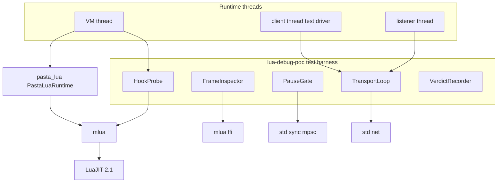
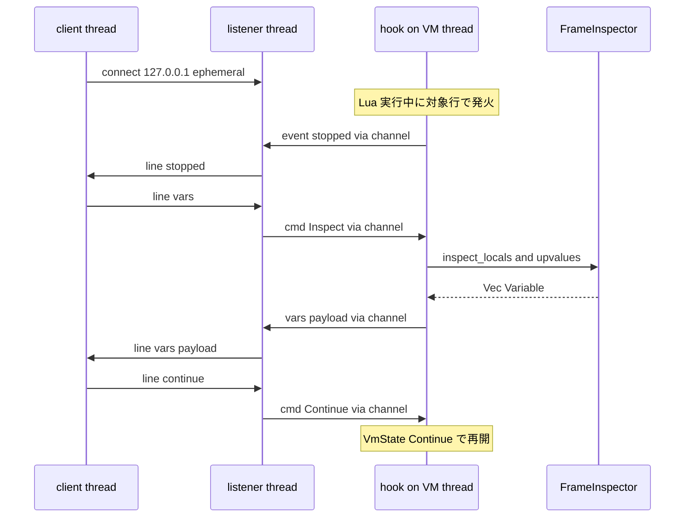

# Technical Design: pasta-lua-debug-feasibility

## Overview

**Purpose**: 本仕様は、VSCode から pasta（組込 LuaJIT 2.1 / mlua 0.11.6）をデバッグする「Rust ホスト型・依存最小・トランスポートを Rust が提供する」方式の **go/no-go を実装着手前に確定する検証ハーネス**を提供する。成果物は再現可能な feature-gated テストと、それが出力する**段階的 GO 判定**（NO-GO ／ 条件付き GO ／ GO ／ GO+）の文書である。

**Users**: pasta 開発者（本仕様の検証結果で、後続実装仕様 `pasta-vscode-lua-debug` の着手可否と到達水準を判断する）。

**Impact**: production コードは無改変。`crates/pasta_lua/Cargo.toml` に default 無効の feature を追加し、`tests/` 配下に gated 検証ハーネスを追加するのみ。既定（リリース）ビルド・既存テストには影響しない。

### Goals
- VM 全体の JIT エンジンを無効化（グローバル `jit.off()` 無引数）したうえで `mlua::Lua::set_global_hook` が pasta 風の動的生成コルーチン群でラインフックを撃つことを実機（cargo test）で実証する（最大論点）。
- フック内ブロッキングによる停止・再開、FFI 経由の変数 inspect、Rust 側トランスポートの end-to-end 往復を検証し、各到達段階を記録する。
- 検証結果を段階的 GO 判定として文書化し、後続実装仕様へ引き継ぐ。

### Non-Goals
- DAP プロトコル実装、`.pasta` ソースマップ、VSCode 拡張、production デバッグバックエンドの恒久統合（すべて `pasta-vscode-lua-debug`）。
- SSP 応答ブロッキング（ブレーク中の SHIORI タイムアウト）の根本解決（本仕様では観測・記録に留める）。
- 性能最適化（line hook は高コストだが PoC では許容）。

## Boundary Commitments

### This Spec Owns
- `crates/pasta_lua` の **feature `lua-debug-poc`**（default 無効）配下に閉じた検証ハーネス（フック設置・コルーチン駆動・停止/再開・変数 inspect・トランスポート往復・判定算出）。
- 段階的 GO 判定の成果物（`research.md` の「PoC 検証結果」節）。

### Out of Boundary
- production ランタイム（`runtime/`・`loader/` 等）への恒久的なデバッグ機構の組み込み。
- DAP / VSCode 拡張 / `.pasta` ソースマップ / luasocket 系資産（同梱 `vscode-debuggee.lua` 等）の撤去。これらは `pasta-vscode-lua-debug` が所有。

### Allowed Dependencies
- `pasta_lua` 公開 API（`PastaLuaRuntime`、`pub use mlua`、`tests/common` ヘルパ）。
- mlua 0.11.6（`set_global_hook` / `Thread::set_hook` / `Debug` / `exec_raw` / `ffi`）。フック API は `#[cfg(not(feature = "luau"))]` で提供される（docs.rs 表記「Available on non-crate feature `luau` only」＝ luau 無効時のみ利用可）。pasta は `luajit52` のため利用可。**制約: mlua の `luau` feature を有効化してはならない**（有効化するとフック API が消失する）。
- Rust 標準ライブラリのみ（`std::net` / `std::sync::mpsc` / `std::thread`）。**追加クレート禁止**。
- production ファイル改変は `Cargo.toml` の `[features]` 追加と `tests/runtime/main.rs` の gated `mod` 行のみに限定。

### Revalidation Triggers
- mlua のバージョン更新（`set_global_hook` / `ffi` の API 変化）。
- pasta のコルーチン実行モデル変更（`pasta_scripts/pasta/scene.lua` の `coroutine.create` パターン）。
- 検証結果の Tier が想定（GO 以上）から低下した場合（後続実装仕様の前提が崩れる）。
- `StdLib::ALL_SAFE` の構成変更（`jit` テーブルの可用性）。

## Architecture

### Existing Architecture Analysis
- VM は `PastaLuaRuntime` が `mlua::Lua` を所有し（`runtime/mod.rs:108` `unsafe_new_with`）、`OnceLock`→`PastaShiori`→`PastaLuaRuntime.lua` でプロセス唯一・`!Send`・単一スレッド呼び出し。
- 既定 stdlib は `StdLib::ALL_SAFE`（`jit` を含み `std_debug` を含まない）。Rust 側 `set_hook` は `std_debug` 露出なしで使用可。
- コルーチンは Lua 側 `coroutine.create`（`scene.lua:212` `SCENE.co_exec`）で動的生成、`EVENT.fire`/`resume_until_valid` が駆動。Rust 側 `create_thread` は不使用。
- テスト基盤: `tests/runtime/main.rs` + `#[path="../common/mod.rs"] mod common;`、生 VM ヘルパ `common::e2e_helpers::create_runtime_with_finalize() -> Lua`。

### Architecture Pattern & Boundary Map

検証ハーネスは「観測・制御コンポーネント群＋3スレッド・トランスポート」の単一モジュール。production への依存は下向きのみ。



**Architecture Integration**:
- Selected pattern: テスト内蔵の「probe + blocking gate + ffi inspector + loopback transport」。PoC に必要な最小構成。
- 境界分離: VM 操作はフック内（VM スレッド上）に限定し、socket I/O は listener スレッドへ。`!Send` 制約を構造で担保。
- 既存パターン保持: テストサブモジュール規約（`main.rs` + gated `mod`）、生 VM ヘルパ流用。
- Steering 準拠: 依存最小（std のみ）、サンドボックス維持（`std_debug` 非露出）。

### Technology Stack

| Layer | Choice / Version | Role in Feature | Notes |
|-------|------------------|-----------------|-------|
| CLI / Test | Rust test（`cargo test --features lua-debug-poc`） | 検証実行と判定出力 | 既定ビルド非汚染 |
| Backend / Services | pasta_lua（mlua 0.11.6, luajit52, vendored） | VM・フック・FFI | `pub use mlua`/`exec_raw`/`ffi` を利用 |
| Runtime | LuaJIT 2.1 | フック対象 VM | グローバル `jit.off()` 必須（下記 jit.off セマンティクス注参照） |
| Infrastructure | std::net / std::sync::mpsc / std::thread | ループバック・トランスポート・スレッド間連絡 | 追加クレートなし |

### スレッドモデル（停止コアの本番トポロジ写像）

本 PoC は、本番（`pasta-vscode-lua-debug`）および将来の非 SHIORI ホスト（例: ノベルゲームエンジン）へ無改変で運べる停止トポロジを写し取る。R2/R3/R4 は停止コア（`PauseGate` ＋ チャネル）を完全に共有し、トランスポートのみ差し替える。

- **① VM スレッドはホスト所有**: 本番は SSP のリクエストスレッド、PoC はテストが「ホスト役」で spawn する。フック／`PauseGate` は自スレッドを spawn・所有せず、外部所有として扱う（本番で pasta は VM スレッドを spawn できないため）。
- **② トランスポートは長命 1 スレッド**: socket（将来は pipe/stdio）を持つ I/O スレッドはデバッグセッション中ずっと生存し、ブレーク毎に作らない。pasta が spawn してよいのはこの 1 本のみ。
- **③ チャネルが唯一の seam**: フック↔I/O スレッドは `Sender<DebugEvent>` / `Receiver<DebugCommand>` のみで接続。VM は socket を一切触らない。トランスポートは差し替え可能（TCP→pipe/stdio・非 SHIORI ホスト）で停止コアは無改変。`!Send` はチャネル端点のみを closure に move して遵守（Lua は move しない）。
- **④ 無期限ブレークが正・timeout はテスト専用**: 本番のブレークは開発者が `Continue` するまで無期限ブロックが正しい挙動（SSP では応答遅延→SSP タイムアウトのリスクを受容。非 SHIORI ホストでは通常のブレークとして妥当）。デッドロック検出の timeout は PoC が CI を吊らせないための watchdog であり、停止コアには組み込まない。

R2/R3 はコントローラ（テストドライバ）がチャネルを直接読み書きし、R4 は同一チャネルへ socket listener スレッドを 1 本噛ませる（トランスポート差し替えの実証）。

## File Structure Plan

### Modified Files
- `crates/pasta_lua/Cargo.toml` — `[features]` セクションを新設し `lua-debug-poc = []`（default に含めない）を追加。
- `crates/pasta_lua/tests/runtime/main.rs` — `#[cfg(feature = "lua-debug-poc")] mod lua_debug_poc_test;` の 1 行を追加。

### New Files
```
crates/pasta_lua/tests/runtime/
├── lua_debug_poc_test.rs        # 検証ハーネス本体（feature-gate）。
│                                #   - #[cfg(feature="lua-debug-poc")] でファイル全体を gate
│                                #   - `mod harness_types; mod hook_probe; ...` でサブモジュール宣言のみ
│                                #   - #[test] は各サブモジュールへ co-locate（R1〜R6 を分散検証）
└── lua_debug_poc_test/          # 上記ファイルのサブモジュール置き場
    │                            #   （Rust 2018 規則: 非 mod.rs ファイルの子モジュールは同名ディレクトリ配下）
    ├── harness_types.rs         # 型定義（LineEvent/Variable/FrameInfo/DebugCommand/DebugEvent/Breakpoint/ItemOutcome/Tier）＋ jit.off 済み VM 構築ヘルパ
    ├── hook_probe.rs            # HookProbe: jit.off + set_global_hook 設置、コルーチン駆動シナリオ、発火記録（＋R1 テスト）
    ├── pause_gate.rs            # PauseGate: breakpoints/should_pause/block_until_command（＋論理ユニットテスト）
    ├── frame_inspector.rs       # FrameInspector: 安全 API のフレーム情報 + FFI のローカル/upvalue 取得（＋R3 テスト）
    ├── session.rs               # DebugSession 駆動: VM をスレッドで起動し pause フックを設置、cmd/event チャネルを公開（R2/R4 共有・トランスポート非依存・スレッドモデル①〜③の実体）
    ├── transport_loop.rs        # TransportLoop: 長命 socket スレッド + 最小行プロトコル（session 上に R4 往復・＋R4 テスト）
    └── verdict.rs               # VerdictRecorder: ItemOutcome 収集と compute_tier（＋判定ユニットテスト）
```

> モジュールパス注: `lua_debug_poc_test.rs`（非 mod.rs）が宣言する子モジュールは `lua_debug_poc_test/<name>.rs` に解決される。サブモジュールを `tests/runtime/` 直下へ置くと解決されずビルド不通になるため、必ず `lua_debug_poc_test/` 配下へ置く（または `#[path]` 指定）。
> 全ファイルは feature `lua-debug-poc` 有効時のみコンパイルされる。production クレート・既定テストへの影響はない（R5.1）。

## System Flows

### R4 トランスポート往復（停止→取得→再開）



**Key Decisions**: socket I/O は listener スレッドのみ。VM/フックは専用スレッドに固定し、ローカル取得（FFI）もフック内＝VM スレッド上で実行（`!Send` 遵守）。VM スレッドとの連絡は `mpsc` チャネル（コマンド送・イベント受）。

## Requirements Traceability

| Requirement | Summary | Components | Interfaces | Flows |
|-------------|---------|------------|------------|-------|
| 1.1 | jit.off+set_global_hook で各行発火 | HookProbe | `install_global_line_hook` | — |
| 1.2 | 複数コルーチンで横断発火 | HookProbe | `run_scene_like_scenario` | — |
| 1.3 | scene.lua の co_exec を忠実再現 | HookProbe | `run_scene_like_scenario` | — |
| 1.4 | jit.off 後の取りこぼし無し | HookProbe | `install_global_line_hook`（jit.off 先行） | — |
| 1.5 | 不発火条件の切り分け記録 | HookProbe, VerdictRecorder | フォールバック試行＋`ItemOutcome` | — |
| 2.1 | フック内ブロッキングで停止継続 | PauseGate | `block_until_command` | R4 図 |
| 2.2 | 再開シグナルで続行 | PauseGate | `resume` | R4 図 |
| 2.3 | yield 不使用・ブロッキングのみ | PauseGate | `VmState::Continue` 固定 | — |
| 2.4 | クラッシュ/デッドロック捕捉 | PauseGate, VerdictRecorder | `catch_unwind` + timeout | — |
| 3.1 | 安全 API でフレーム情報 | FrameInspector | `frame_info` | — |
| 3.2 | FFI でローカル/upvalue 名と値 | FrameInspector | `inspect_locals` / `inspect_upvalues` | R4 図 |
| 3.3 | std_debug 非露出で成立を第一目標 | FrameInspector | `inspect_*`（exec_raw 経由） | — |
| 3.4 | 失敗時の範囲・回避策記録 | FrameInspector, VerdictRecorder | `ItemOutcome` | — |
| 4.1 | TcpListener 経由で往復完了 | TransportLoop | `serve` / `run_round_trip` | R4 図 |
| 4.2 | socket=I/O、VM=フック内分離 | TransportLoop | 3スレッド構成 | R4 図 |
| 4.3 | std::net のみ | TransportLoop | `std::net::TcpListener` | — |
| 4.4 | 往復不成立の記録・Tier 据置 | TransportLoop, VerdictRecorder | `ItemOutcome` | — |
| 5.1 | feature-gate / テスト専用 | （File Structure） | `Cargo.toml` features + gated mod | — |
| 5.2 | cargo test で判定出力 | VerdictRecorder | `report` | — |
| 5.3 | std_debug 非露出 | FrameInspector, HookProbe | ALL_SAFE のまま set_hook | — |
| 5.4 | SSP 実機の補足記録（任意） | VerdictRecorder | `ItemOutcome`（注記） | — |
| 5.5 | 恒久統合を残さない | （File Structure） | production 無改変 | — |
| 6.1 | 段階表現 | VerdictRecorder | `Tier` / `compute_tier` | — |
| 6.2 | 全項目を試行・個別記録 | VerdictRecorder | `Vec<ItemOutcome>` | — |
| 6.3 | R5 隔離を妥当性前提に確認 | VerdictRecorder | `report`（前提注記） | — |
| 6.4 | 最低ライン未達で NO-GO 文書化 | VerdictRecorder | `compute_tier` | — |
| 6.5 | 到達段階と引き継ぎ結論を明記 | VerdictRecorder | `research.md` 追記 | — |

## Components and Interfaces

| Component | Domain/Layer | Intent | Req Coverage | Key Dependencies | Contracts |
|-----------|--------------|--------|--------------|------------------|-----------|
| HookProbe | Test/Probe | フック設置とコルーチン駆動・発火記録 | 1.1–1.5 | mlua (P0) | Service, State |
| PauseGate | Test/Control | フック内ブロッキング停止・再開 | 2.1–2.4 | std::sync (P0) | Service, State |
| FrameInspector | Test/Inspect | フレーム情報＋FFI 変数取得 | 3.1–3.4 | mlua::ffi (P0) | Service |
| TransportLoop | Test/Transport | ループバック往復・3スレッド連絡 | 4.1–4.4 | std::net (P0), PauseGate (P0) | Service, State |
| VerdictRecorder | Test/Report | 項目結果収集と段階判定 | 1.5, 2.4, 3.4, 4.4, 5.2–5.4, 6.1–6.5 | — | Service, State |

### Test / Probe

#### HookProbe

| Field | Detail |
|-------|--------|
| Intent | jit.off + set_global_hook を設置し、pasta 風コルーチンを駆動して行発火を記録 |
| Requirements | 1.1, 1.2, 1.3, 1.4, 1.5 |

**Responsibilities & Constraints**
- VM 構築直後・シナリオ実行前に **グローバル `jit.off()`（無引数）** を exec し JIT エンジン自体を停止する（1.4）。

  > **jit.off セマンティクス注（PoC 知見・2026-06-07）**: LuaJIT では `jit.off(true,true)` は「呼び出し元関数とその下位関数のコンパイルを無効化（＋既存トレースを flush）」する**関数単位**の制御であり、`jit.status()` が報告する**グローバルエンジン状態は変えない**（無引数 `jit.off()` のみがエンジン全体を停止し `jit.status()` を `false` にする）。VM 構築時に別チャンクで `jit.off(true,true)` を exec しても、後続ロードされるシーンチャンクや動的生成コルーチンには波及せず、ラインフック取りこぼし防止（1.4）の目的を満たさない。よって本 PoC は VM 全体への確実な適用として無引数 `jit.off()` を採用する。出典: LuaJIT 公式 ext_jit ドキュメント＋実機 cargo test での実測（`jit.off(true,true)` 後も `jit.status()` 第一返値が `true` のまま）。詳細は research.md「LuaJIT jit.off セマンティクス」を参照。
- `set_global_hook(EVERY_LINE, ...)` を設置（5.3: `std_debug` 非露出）。発火しないコルーチンがあれば D1 フォールバック（Rust 製の `coroutine.create` 差し替えで `lua.create_thread`＋`Thread::set_hook` により生成毎にフック付与）を試行し成立方式を記録（1.5）。
- シナリオは `scene.lua:212` の `coroutine.create(wrapped_fn)` を模し、複数コルーチンを駆動ループで `resume`（1.2, 1.3）。

**Dependencies**
- External: mlua `set_global_hook`/`Thread::set_hook`/`HookTriggers::EVERY_LINE` — フック (P0)
- Inbound: VM スレッド — フック実行 (P0)

**Contracts**: Service [x] / State [x]

##### Service Interface
```rust
struct LineEvent { source: String, line: u32, thread_ptr: usize }

enum HookStrategy { GlobalHook, PerCoroutineThreadHook }

// jit.off を効かせてから line hook を設置。採用したフック方式を返す。
fn install_global_line_hook(lua: &Lua, sink: Arc<Mutex<Vec<LineEvent>>>)
    -> mlua::Result<HookStrategy>;

// scene.lua の co_exec を模した N コルーチン生成＋resume 駆動シナリオ。
fn run_scene_like_scenario(lua: &Lua, coroutine_count: usize) -> mlua::Result<()>;
```
- Preconditions: `lua` は ALL_SAFE（`jit` 利用可・`debug` 非露出）で構築済み。
- Postconditions: `sink` に各コルーチン・各行の `LineEvent` が記録される。
- Invariants: `thread_ptr` でコルーチンを識別し横断発火を判定。

**Implementation Notes**
- Integration: `common::e2e_helpers::create_runtime_with_finalize()` で VM 取得。
- Validation: 期待行系列・全コルーチン発火を assert（1.1, 1.2）。
- Risks: LuaJIT のコルーチン継承挙動が不定（D1 で吸収）。

### Test / Control

#### PauseGate

| Field | Detail |
|-------|--------|
| Intent | フックコールバック内でブロッキング待機し、外部コマンドで停止/再開 |
| Requirements | 2.1, 2.2, 2.3, 2.4 |

**Responsibilities & Constraints**
- `breakpoints: HashSet<(String, u32)>`（標的＝source・line の集合）を保持。`EVERY_LINE` フック内でまず `should_pause(frame)` が現フレームの (source,line) の包含を判定し、**一致時のみ**停止する（2.1, 3.2, 4.1）。
- `should_pause` が真のとき `block_until_command` で `Receiver<DebugCommand>` を `recv()`（ブロッキング）。`Continue` 受信で復帰し `VmState::Continue` を返す（2.1, 2.2, 2.3）。一致しない行は即 `VmState::Continue`。
- `coroutine.yield`/`lua_yield` は使用しない（LuaJIT で C-call boundary エラー、かつ `VmState::Yield` は LuaJIT 非対応）。
- 異常（パニック/デッドロック）は `catch_unwind` ＋ client 側 timeout で検出し記録（2.4）。

**Dependencies**
- External: `std::sync::mpsc`（または `Condvar`）(P0)

**Contracts**: Service [x] / State [x]

##### Service Interface
```rust
type Breakpoint = (String, u32); // (source, line)

enum DebugCommand { Continue, Inspect }
enum DebugEvent { Stopped { source: String, line: u32 }, Vars(Vec<Variable>) }

struct PauseGate {
    breakpoints: HashSet<Breakpoint>,
    cmd_rx: Receiver<DebugCommand>,
    event_tx: Sender<DebugEvent>,
}

// EVERY_LINE フック内で最初に呼ぶ。現フレームがブレークポイント標的か判定。
fn should_pause(gate: &PauseGate, frame: &Debug) -> bool;

// should_pause が真のときのみ呼ぶ。Continue が来るまでブロック。
fn block_until_command(gate: &PauseGate, frame: &Debug) -> mlua::Result<VmState>;
```
- Preconditions: フック内（VM スレッド）から呼ばれる。`block_until_command` は `should_pause` が真の時のみ。
- Postconditions: 返り値は常に `VmState::Continue`。標的外の行ではブロックしない。
- Invariants: VM 操作はこのスレッドに閉じる。

### Test / Inspect

#### FrameInspector

| Field | Detail |
|-------|--------|
| Intent | 安全 API でフレーム情報、FFI でローカル/upvalue の名前と値を取得 |
| Requirements | 3.1, 3.2, 3.3, 3.4 |

**Responsibilities & Constraints**
- `frame_info`: `Debug::source`/`current_line`/`names` でソース・行・関数名を取得（3.1）。
- `inspect_locals`/`inspect_upvalues`: `lua.exec_raw` で生 `lua_State` を取り、`lua_getstack(L,0,&mut ar)` で現フレーム ar を再取得、`lua_getlocal`（upvalue は対象関数を stack に積み `lua_getupvalue`）を呼ぶ。取得後 `lua_pop` でスタックを必ず復元（3.2）。
- `std_debug` 非露出のまま成立を第一目標（3.3）。失敗・制限時は範囲と回避策（デバッグ時限定の `std_debug`）を記録（3.4）。

**Dependencies**
- External: `mlua::ffi`（`lua_getstack`/`lua_getlocal`/`lua_getupvalue`/`lua_Debug`）、`Lua::exec_raw` (P0)

**Contracts**: Service [x]

##### Service Interface
```rust
struct Variable { name: String, type_name: String, repr: String }
struct FrameInfo { source: String, line: u32, func_name: Option<String> }

fn frame_info(debug: &Debug) -> FrameInfo;
fn inspect_locals(lua: &Lua) -> mlua::Result<Vec<Variable>>;
fn inspect_upvalues(lua: &Lua, level: i32) -> mlua::Result<Vec<Variable>>;
```
- Preconditions: フック停止中（VM スレッド）に呼ぶ。
- Postconditions: number/string/boolean/table を `type_name` で判別（3.2）。スタックは呼出し前と同一深さに復元。
- Invariants: `unsafe` は `exec_raw` クロージャ内に限局。

**Implementation Notes**
- Risks: 前例が乏しい（mlua 固有）。型判別は `lua_type` で安全側に分類し、未対応種別は範囲外として記録。

### Test / Transport

#### TransportLoop

| Field | Detail |
|-------|--------|
| Intent | ループバック TCP で停止→取得→再開の往復を成立させる | 
| Requirements | 4.1, 4.2, 4.3, 4.4 |

**Responsibilities & Constraints**
- `TcpListener::bind("127.0.0.1:0")` で OS 割当ポートに待受。**長命 1 スレッド**（デバッグセッション中生存）が socket I/O のみ担当し、`PauseGate` の同一チャネルで VM スレッドのフックと連絡（スレッドモデル ②③、4.1, 4.2）。
- 最小行プロトコル（`stopped` / `vars` / `continue`）。DAP は使わない（4.3）。
- 往復不成立時はブロッカー（スレッド分離・`!Send`・ブロッキング起因）を記録し、到達段階を GO 以下に据置（4.4）。

**Dependencies**
- External: `std::net::TcpListener`/`TcpStream`、`std::thread` (P0)
- Inbound: PauseGate — 停止/再開連絡 (P0)

**Contracts**: Service [x] / State [x]

##### Service Interface
```rust
struct Bridge { cmd_tx: Sender<DebugCommand>, event_rx: Receiver<DebugEvent> }

// listener スレッド本体。socket とチャネルを橋渡し。
fn serve(listener: TcpListener, bridge: Bridge);

// テストドライバ（client スレッド）から往復を実行し成否を返す。
fn run_round_trip(addr: SocketAddr) -> std::io::Result<bool>;
```
- Preconditions: VM スレッドがフックで停止しうる状態。
- Postconditions: `stopped`→`vars`→`continue` の往復完了で `true`。
- Invariants: socket は listener スレッドのみが触る。

### Test / Report

#### VerdictRecorder

| Field | Detail |
|-------|--------|
| Intent | 項目別結果を収集し段階的 GO 判定を算出・出力 |
| Requirements | 1.5, 2.4, 3.4, 4.4, 5.2, 5.3, 5.4, 6.1–6.5 |

**Responsibilities & Constraints**
- 各チャレンジ項目（R1〜R4）の成否・採用方式・制約を `ItemOutcome` として収集（成否によらず全試行）（6.2）。
- `compute_tier`: NoGo（R1 不成立）／ConditionalGo（R1+R2）／Go（+R3）／GoPlus（+R4）（6.1, 6.4）。
- `report`: cargo test に判定可能な出力を行い、R5 隔離（feature-gate・cargo test・サンドボックス）の妥当性前提を注記（5.2, 6.3）。
- SSP 実機の補足は任意注記（5.4）。最終判定文は `research.md` の「PoC 検証結果」節へ実装完了時に追記（6.5）。

**Contracts**: Service [x] / State [x]

##### Service Interface
```rust
struct ItemOutcome { id: String, passed: bool, method: String, notes: String }
enum Tier { NoGo, ConditionalGo, Go, GoPlus }

fn compute_tier(outcomes: &[ItemOutcome]) -> Tier;
fn report(outcomes: &[ItemOutcome]) -> String; // cargo test 出力＋research.md 追記用
```
- Postconditions: `compute_tier` は最低ライン（R1+R2）未達で `NoGo`。
- Invariants: Tier は R1→R2→R3→R4 の単調な積み上げ。

## Error Handling

- **VM 破壊回避**: FFI のローカル取得はスタック復元を保証（`exec_raw` クロージャ内で push/pop 対称）。フック内ブロッキングは `catch_unwind` で囲み、パニックを `ItemOutcome` 失敗として記録（2.4, 3.4）。
- **デッドロック（テスト専用 watchdog）**: 本番のブレークは無期限ブロックが正（スレッドモデル ④）。PoC ではコントローラ／client 側の `recv_timeout` / `join` timeout で未達を検出し失敗記録＋Tier 据置（2.4, 4.4）。timeout は停止コアには組み込まない。
- **不発火（最重要失敗系）**: D1 フォールバックを試行し、全滅なら NO-GO 根拠（JIT 状態・コルーチン継承・LuaJIT 版）を記録（1.5, 6.4）。

## Testing Strategy

検証ハーネス自体が `#[test]` 群（`cargo test --features lua-debug-poc`）。各テストは要件の受入基準を直接検証する。

### Unit / Mechanism Tests
- `hook_fires_on_single_chunk`: jit.off 後に line hook が各行発火し期待行系列に一致（1.1, 1.4）。
- `hook_fires_across_dynamic_coroutines`: scene 風 N コルーチンで全コルーチン発火、採用 `HookStrategy` を記録（1.2, 1.3, 1.5）。
- `pause_blocks_and_resumes`: フック内ブロッキングで停止継続、Continue で再開（2.1, 2.2, 2.3）。
- `inspect_locals_and_upvalues_via_ffi`: 停止中に number/string/boolean/table を名前付き取得、`std_debug` 非露出で成立（3.1, 3.2, 3.3）。

### Integration Tests
- `transport_round_trip_loopback`: 3スレッドで `stopped`→`vars`→`continue` 往復完了、socket=I/O・VM=フック内分離を維持（4.1, 4.2, 4.3）。
- `verdict_tier_computation`: 項目結果から `Tier` を算出し、最低ライン未達で NoGo を返す（6.1, 6.4）。
- `isolation_default_build_unaffected`: feature 無効時にハーネスがコンパイルされない（ビルド構成で担保）／有効時に judement 出力（5.1, 5.2）。

### Failure-mode Tests
- `pause_panic_is_captured`: フック内異常を `catch_unwind` で捕捉し失敗記録（2.4）。
- `inspect_unsupported_type_recorded`: 取得不可種別を範囲外として記録し回避策を残す（3.4）。

## Open Questions / Risks
- **#1 コルーチン横断発火**: `set_global_hook` が Lua 側 `coroutine.create` に効くかは前例不明。D1 フォールバックで吸収・記録（research.md 参照）。
- **FFI 変数取得の前例不足**: mlua 固有実装。スタック整合に最大注意。
- **SSP 応答ブロッキング**: ブレーク中の SHIORI タイムアウトは本仕様では記録のみ、解決は `pasta-vscode-lua-debug`。
- **ビルド前提**: LuaJIT ビルド前に環境変数 `NoDefaultCurrentDirectoryInExePath` を解除（既知の exit 101 回避）。
