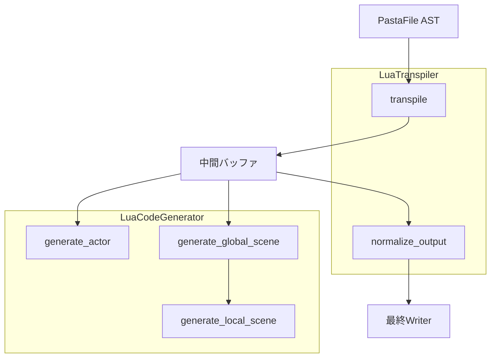
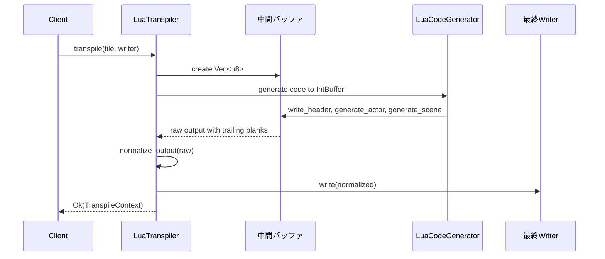

# 技術設計ドキュメント: pasta-lua-output-normalization

## 概要

**目的**: pasta_lua トランスパイラーの出力フォーマットを正規化し、生成される Lua コードから不要な末尾空行を除去する。

**ユーザー**: pasta DSL を使用してゴーストスクリプトを開発するユーザー。正規化により一貫したコード出力が得られる。

**影響**: 現在の `LuaTranspiler::transpile()` メソッドの出力処理を拡張し、末尾空行を除去する後処理パスを追加する。

### 目標
- 生成 Lua コードの末尾に不要な空行がないこと
- `test_transpile_sample_pasta_line_comparison` テストが合格すること
- 既存テストのリグレッションがないこと

### 非目標
- コンテンツ内の空行フォーマットの変更（意図的な空行は保持）
- 他のバックエンド（pasta_rune）への影響
- インデントや空白の正規化

## アーキテクチャ

### 既存アーキテクチャ分析

現在のトランスパイルパイプライン:
```
PastaFile (AST) → LuaTranspiler::transpile() → LuaCodeGenerator → Writer
```

**制約**:
- `LuaCodeGenerator` は `Write` trait を持つ任意のライターに直接書き込む
- 各シーン/アクターブロック終了後に `write_blank_line()` が呼ばれる
- 最後のブロックでも空行が追加されるため、出力末尾に不要な空行が残る

### アーキテクチャパターンと境界マップ



**アーキテクチャ統合**:
- 選択パターン: 後処理正規化（Post-processing Normalization）
- 境界: 正規化処理は `LuaTranspiler` 層に配置（`LuaCodeGenerator` は変更なし）
- 既存パターン保持: Write trait を使用したコード生成パターンを維持
- 新規コンポーネント: `normalize_output` ヘルパー関数を追加
- ステアリング準拠: ユニットテスト可能性を維持

### 技術スタック

| レイヤー | 選択 / バージョン | 機能における役割   | 備考                   |
| -------- | ----------------- | ------------------ | ---------------------- |
| Backend  | Rust 2024 edition | 正規化ロジック実装 | 標準ライブラリのみ使用 |
| Testing  | cargo test        | 統合テスト実行     | 既存テスト基盤を活用   |

## 要件トレーサビリティ

| 要件 | 概要                                             | コンポーネント | インターフェース   | フロー               |
| ---- | ------------------------------------------------ | -------------- | ------------------ | -------------------- |
| 1.1  | 末尾空行を全て除去                               | LuaTranspiler  | normalize_output() | 正規化フロー         |
| 1.2  | 末尾に正確に1つの改行を保持                      | LuaTranspiler  | normalize_output() | 正規化フロー         |
| 1.3  | 生成中に不要な改行を追加しない                   | -              | -                  | 既存動作維持         |
| 2.1  | end キーワード前に1つの改行                      | -              | -                  | 既存動作維持         |
| 2.2  | 関数定義後に余計な空行を挿入しない               | -              | -                  | 既存動作維持         |
| 2.3  | 全シーンで同一のフォーマット                     | LuaTranspiler  | normalize_output() | 正規化フロー         |
| 3.1  | transpile完了時に正規化パスを適用                | LuaTranspiler  | transpile()        | メインフロー         |
| 3.2  | 連続空行を除去、単一空行は保持                   | LuaTranspiler  | normalize_output() | 正規化フロー         |
| 3.3  | sample.expected.lua と一致する出力               | LuaTranspiler  | -                  | テスト検証           |
| 4.1  | sample.pasta の出力が sample.expected.lua と一致 | -              | -                  | テスト検証           |
| 4.2  | 行数が114行と一致                                | -              | -                  | テスト検証           |
| 4.3  | assert_eq が合格                                 | -              | -                  | テスト検証           |
| 5.1  | 全既存テストが合格                               | -              | -                  | リグレッションテスト |
| 5.2  | リグレッション時は修正                           | -              | -                  | テスト検証           |
| 5.3  | sample関連テストが同一動作                       | -              | -                  | テスト検証           |

## コンポーネントとインターフェース

### サマリーテーブル

| コンポーネント   | ドメイン/レイヤー | 目的                     | 要件カバレッジ          | 主要依存関係          | 契約    |
| ---------------- | ----------------- | ------------------------ | ----------------------- | --------------------- | ------- |
| LuaTranspiler    | Transpiler        | AST→Lua変換の統合        | 1.1, 1.2, 3.1, 3.2, 3.3 | LuaCodeGenerator (P0) | Service |
| normalize_output | Transpiler        | 出力バッファの末尾正規化 | 1.1, 1.2, 2.3, 3.2      | なし                  | -       |

### Transpiler レイヤー

#### LuaTranspiler（拡張）

| フィールド | 詳細                                          |
| ---------- | --------------------------------------------- |
| 目的       | Pasta AST を正規化された Lua コードに変換する |
| 要件       | 1.1, 1.2, 3.1, 3.2, 3.3                       |

**責務と制約**
- Pasta AST を Lua コードにトランスパイル
- 出力バッファの末尾正規化を実行
- 中間バッファを使用した2段階処理

**依存関係**
- Inbound: pasta_core::parser (P0) - AST型定義
- Outbound: LuaCodeGenerator (P0) - コード生成
- External: std::io::Write (P0) - 出力インターフェース

**契約**: Service [x] / API [ ] / Event [ ] / Batch [ ] / State [ ]

##### サービスインターフェース

```rust
impl LuaTranspiler {
    /// Transpile PastaFile to normalized Lua code.
    ///
    /// # 変更内容
    /// - 中間バッファへの書き込み後、正規化処理を適用
    /// - 正規化後の出力を最終writerに書き込み
    ///
    /// # 事前条件
    /// - file は有効な PastaFile AST
    /// - writer は書き込み可能な状態
    ///
    /// # 事後条件
    /// - 出力の末尾に連続した空行がない
    /// - 出力の末尾は正確に1つの改行で終わる
    /// - 既存のコンテンツフォーマットは維持
    pub fn transpile<W: Write>(
        &self,
        file: &PastaFile,
        writer: &mut W,
    ) -> Result<TranspileContext, TranspileError>;
}
```

**実装ノート**
- 統合: 既存の `transpile()` メソッドを拡張、シグネチャ変更なし
- 検証: 出力が期待フォーマットと一致することをテストで検証
- リスク: 中間バッファ使用によるメモリ増加（典型的なファイルでは無視可能）

#### normalize_output（新規ヘルパー関数）

| フィールド | 詳細                                                       |
| ---------- | ---------------------------------------------------------- |
| 目的       | 出力バッファから末尾の空行を除去し、単一の改行で終了させる |
| 要件       | 1.1, 1.2, 3.2                                              |

**責務と制約**
- 末尾の連続空行を除去
- 正確に1つの改行（EOF マーカー）を保持
- コンテンツ内の空行は保持

**依存関係**
- なし（純粋関数）

**契約**: Service [ ] / API [ ] / Event [ ] / Batch [ ] / State [ ]

##### 関数シグネチャ

```rust
/// Normalize output buffer by removing trailing blank lines.
///
/// # 動作
/// 1. 末尾の空白文字（スペース、タブ、改行）を除去
/// 2. 正確に1つの改行を追加
///
/// # 事前条件
/// - input は有効な UTF-8 文字列
///
/// # 事後条件
/// - 戻り値の末尾は正確に "\n" で終わる
/// - コンテンツ内の空行は変更されない
///
/// # 例
/// ```
/// assert_eq!(normalize_output("code\n\n\n"), "code\n");
/// assert_eq!(normalize_output("code"), "code\n");
/// assert_eq!(normalize_output("a\n\nb\n\n"), "a\n\nb\n");
/// ```
fn normalize_output(input: &str) -> String;
```

**実装ノート**
- 統合: `LuaTranspiler::transpile()` 内でのみ使用
- 検証: ユニットテストで各パターンを検証
- リスク: なし（単純な文字列操作）

## システムフロー

### 正規化フロー



**フロー決定事項**:
- 中間バッファは `Vec<u8>` を使用（既存パターンと互換）
- 正規化は UTF-8 文字列として処理
- 最終出力のみがクライアント指定の Writer に書き込まれる

## テスト戦略

### ユニットテスト
- `normalize_output("")` → `"\n"` (空入力)
- `normalize_output("code\n")` → `"code\n"` (変更なし)
- `normalize_output("code\n\n")` → `"code\n"` (1つの余計な空行)
- `normalize_output("code\n\n\n")` → `"code\n"` (複数の余計な空行)
- `normalize_output("a\n\nb\n\n")` → `"a\n\nb\n"` (中間空行は保持)

### 統合テスト
- `test_transpile_sample_pasta_line_comparison`: 厳密一致テスト（sample.expected.lua と比較）
- `test_transpile_sample_pasta_basic_output`: 既存の基本出力テスト
- `test_transpile_reference_code_patterns`: パターン一致テスト

### リグレッションテスト
- `cargo test --all`: 全テストスイートの実行
- 182件の既存テストが全て合格することを確認

## エラー処理

### エラー戦略
- 正規化処理自体はエラーを発生させない（純粋な文字列操作）
- UTF-8 変換エラーは既存の `TranspileError` を使用

### エラーカテゴリと対応
- **変換エラー**: 中間バッファが有効な UTF-8 でない場合 → `TranspileError::invalid_utf8()` (既存エラー型を活用)

## パフォーマンスと拡張性

### パフォーマンス目標
- 典型的なファイル（〜10KB）での正規化処理: < 1ms
- メモリ増加: 出力サイズの約2倍（中間バッファ + 正規化結果）

### 測定戦略
- ベンチマークは必要に応じて追加
- 現時点では典型的なファイルサイズで問題なしと想定
