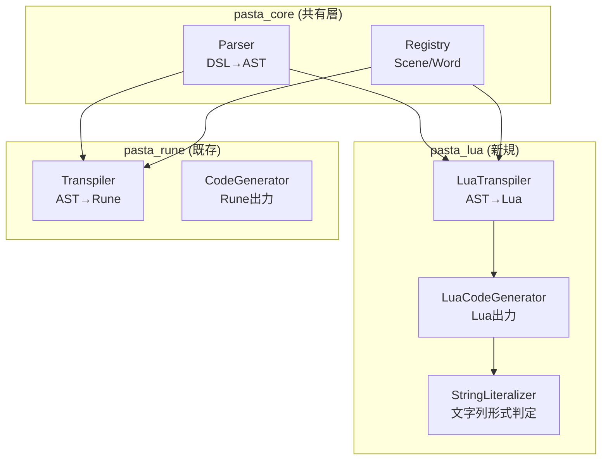
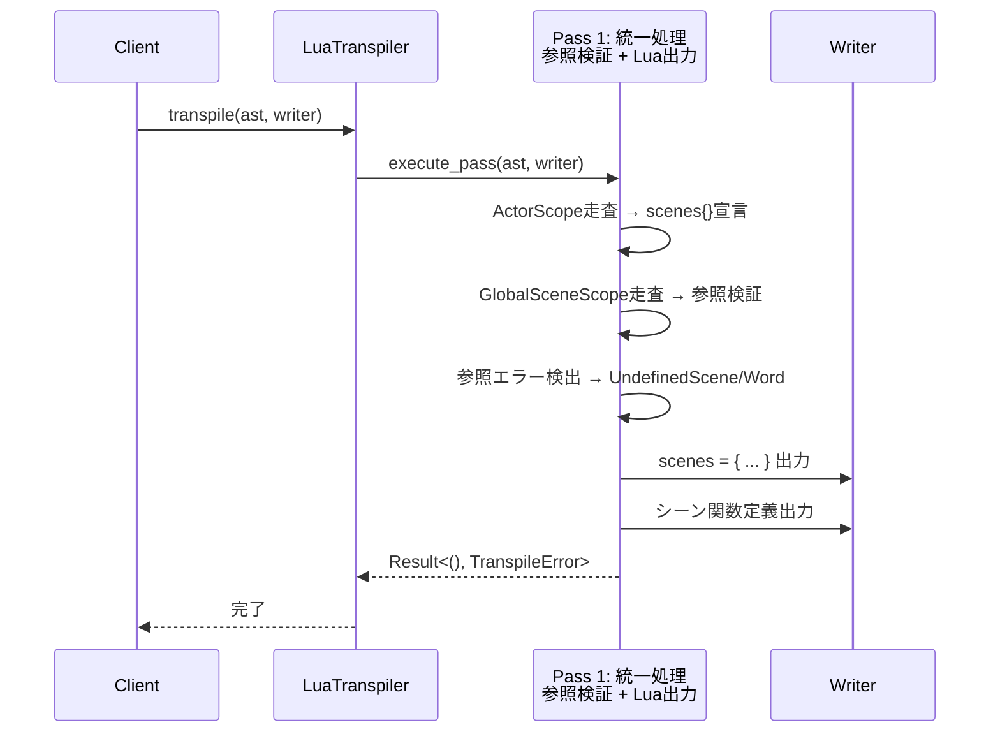
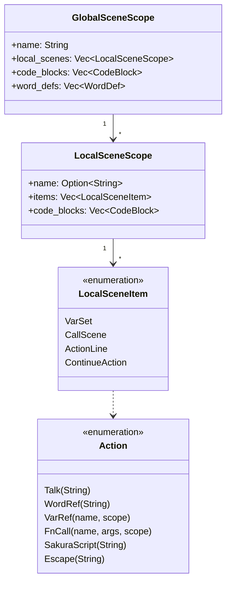

# 技術設計書: Pasta DSL → Lua トランスパイラー

## 概要

**目的**: Pasta DSL の AST から Lua コードを生成するトランスパイラー層を実装し、Rune VM への依存を排除した軽量な実行環境を提供する。

**ユーザー**: Pasta スクリプト開発者、デスクトップマスコット（伺か）のゴースト作成者、シナリオ型ゲームエンジン利用者。

**影響**: 既存 pasta_rune クレートと並列に pasta_lua クレートを追加。pasta_core のパーサー・レジストリ層を共有し、出力バックエンドのみを Lua に変更。

### ゴール
- Pasta AST から有効な Lua コードを生成する
- Lua 5.3+ の Unicode 識別子サポートを活用し、日本語シーン名・変数名を直接出力
- 既存 pasta_rune の CodeGenerator パターンを踏襲し、保守性を維持
- sample.pasta → sample.lua の自動変換によるインテグレーションテストを確立

### 非ゴール
- Lua ランタイム層の実装（coroutine 管理、word/talk 関数）
- SHIORI.DLL としてのコンパイル（後続仕様）
- 属性（`＆key：value`）の処理（後続仕様で対応）

## アーキテクチャ

### 既存アーキテクチャ分析

```
pasta (workspace)
├── pasta_core          # 言語非依存層（パーサー、レジストリ）
│   ├── Parser          # DSL→AST変換（Pest）
│   └── Registry        # シーン/単語テーブル
└── pasta_rune          # Runeバックエンド層
    ├── Transpiler      # AST→Runeコード (2pass)
    ├── Runtime         # Rune VM実行
    └── Engine          # 統合API
```

**維持するパターン**:
- `std::io::Write` トレイトによる出力抽象化
- Pass 1 統一設計（Lua テーブル参照特性により参照検証不要）
- `CodeGenerator<W: Write>` 構造体パターン

### アーキテクチャパターン・境界マップ



**アーキテクチャ統合**:
- **選択パターン**: Visitor パターン + Write トレイト出力
- **ドメイン境界**: pasta_lua は pasta_core のみに依存、pasta_rune との直接依存なし
- **維持する既存パターン**: CodeGenerator 構造体、2パス変換、レジストリ共有
- **新規コンポーネント理由**: Lua 固有の文字列リテラル形式判定が必要
- **ステアリング準拠**: yield 型出力、宣言的フロー、2パス変換を維持

### 技術スタック

| レイヤー | 選択/バージョン | 役割 | 備考 |
|----------|-----------------|------|------|
| 言語 | Rust 2024 edition | トランスパイラー実装 | 既存スタック維持 |
| パーサー | pasta_core (Pest 2.8) | DSL→AST変換 | 共有層 |
| 出力形式 | Lua 5.3+ | ターゲットコード | Unicode 識別子必須 |
| エラー型 | thiserror 2 | TranspileError 定義 | 既存パターン |
| トレイト | std::io::Write | 出力抽象化 | 既存パターン |

## システムフロー

### トランスパイル処理フロー



### 処理フロー（統一 Pass 設計）

Lua のテーブル参照特性を活用し、Pass 1 で参照検証とコード生成を同時実行：

```
Input: AST (GlobalSceneScope[], ActorScope[])
  ↓
[Pass 1: 統一処理]
  1. ActorScope 走査
     ├─ scenes テーブルの初期化コード出力
     │  └─ local scenes = { actor1 = {}, actor2 = {}, ... }
     └─ 単語定義レジストリに登録（参照検証用）
  
  2. GlobalSceneScope 走査（前方参照対応）
     ├─ CallScene → 参照先シーン存在確認
     ├─ WordRef → 参照先単語存在確認
     ├─ エラー → UndefinedScene, UndefinedWord で失敗（ここで出力停止）
     ├─ グローバルシーン関数定義出力
     │  └─ function scene_name() ... end または scenes[...] = function() ... end
     └─ ローカルシーン関数定義出力
        └─ scenes[actor][scene] = function() ... end
  
  3. 完了処理
     └─ Writer に最終行を出力（return scenes など）
  
Output: 完全な Lua コード（Writer に直接出力）、エラー時は部分出力で失敗
```

**設計上のポイント**:
- Lua はテーブルを**宣言時点では空**にしておき、**実行時に内容を設定**できる
- このため、シーン定義の順序は関数実行時に確認される
- Parse フェーズで参照エラーを検出できれば、Pass 2 は不要

### 文字列リテラル判定フロー

```mermaid
flowchart TD
    A[入力文字列] --> B{エスケープ対象<br/>\ or " を含む?}
    B -->|No| C["通常形式<br/>\"text\""]
    B -->|Yes| D[n = 0]
    D --> E{危険パターン<br/>] + n個の=<br/>を含む?}
    E -->|No| F["長文字列形式<br/>[=n[text]=n]"]
    E -->|Yes| G[n = n + 1]
    G --> H{n > 10?}
    H -->|No| E
    H -->|Yes| I[エラー: 変換不能]
```

## 要件トレーサビリティ

| 要件 | 概要 | コンポーネント | インターフェース | フロー |
|------|------|----------------|------------------|--------|
| 1 | ローカル変数数制限対応 | LuaCodeGenerator | generate_actor(), generate_global_scene() | Pass 1 |
| 2 | 文字列リテラル形式 | StringLiteralizer | literalize() | Pass 1 |
| 4a | アクター定義Lua化 | LuaCodeGenerator | generate_actor() | Pass 1 |
| 4b | シーン定義・モジュール構造 | LuaCodeGenerator | generate_global_scene() | Pass 1 |
| 4c | ローカルシーン関数変換 | LuaCodeGenerator | generate_local_scene() | Pass 1 |
| 4d | 変数スコープ管理 | LuaCodeGenerator | generate_var_set(), generate_action() | Pass 1 |
| 4e | 単語参照処理 | LuaCodeGenerator | generate_action(), WordDefRegistry | Pass 1 |
| 4f | コードブロック埋め込み | LuaCodeGenerator | generate_code_block() | Pass 1 |
| 4g | グローバルシーン間参照 | LuaCodeGenerator | generate_call_scene() | Pass 1 |
| 5 | 実装制約・前提 | LuaTranspiler | TranspileError, Result<T, E> | 全体 |
| 6 | レジストリ登録 | LuaCodeGenerator | SceneRegistry, WordDefRegistry | Pass 1 |
| 7 | インテグレーションテスト | Test Suite | pasta_lua_transpiler_integration_test.rs | テスト |

## コンポーネントとインターフェース

### コンポーネント概要

| コンポーネント | ドメイン/レイヤー | 意図 | 要件カバレッジ | 主要依存 | 契約 |
|----------------|-------------------|------|----------------|----------|------|
| LuaTranspiler | Transpiler | トランスパイル処理の統合 API | 2, 5 | pasta_core::Parser (P0) | Service |
| LuaCodeGenerator | Transpiler | Lua コード生成 | 1, 4a-4g | LuaTranspiler (P0), StringLiteralizer (P1) | Service |
| StringLiteralizer | Transpiler/Util | 文字列リテラル形式判定 | 3 | なし | Service |
| TranspilerConfig | Transpiler | 設定管理 | 2 | なし | State |
| TranspileContext | Transpiler | パス間コンテキスト共有 | 6 | SceneRegistry (P0), WordDefRegistry (P0) | State |

### Transpiler レイヤー

#### LuaTranspiler

| フィールド | 詳細 |
|----------|------|
| Intent | Pasta AST から Lua コードへのトランスパイル処理を統合する |
| Requirements | 2, 4 |

**責務と制約**
- Pass 1 統一処理の制御（機械的な Lua コード生成）
- TranspileError による一貫したエラーハンドリング

**依存関係**
- Inbound: Client code — トランスパイル実行 (P0)
- Outbound: LuaCodeGenerator — コード生成 (P0)
- Outbound: pasta_core::Parser — AST 取得 (P0)
- Outbound: SceneRegistry, WordDefRegistry — レジストリ登録 (P0)

**契約**: Service [x]

##### サービスインターフェース
```rust
pub struct LuaTranspiler {
    config: TranspilerConfig,
}

impl LuaTranspiler {
    /// 新規トランスパイラーを設定付きで作成
    pub fn new(config: TranspilerConfig) -> Self;
    
    /// デフォルト設定（comment_mode=true）で作成
    pub fn default() -> Self;
    
    /// AST から Lua コードを生成し Writer に出力
    pub fn transpile<W: Write>(
        &self,
        ast: &[GlobalSceneScope],
        actors: &[ActorScope],
        writer: &mut W,
    ) -> Result<TranspileContext, TranspileError>;
}
```
- 事前条件: AST が有効な Pasta 構文を表現していること
- 事後条件: Writer に有効な Lua コードが出力されること
- 不変条件: config は transpile 中に変更されない

#### LuaCodeGenerator

| フィールド | 詳細 |
|----------|------|
| Intent | AST ノードを Lua コード文字列に変換し Writer に出力する |
| Requirements | 1, 3a, 3b, 3c, 3d, 3e, 3f, 3g |

**責務と制約**
- do...end ブロックによるスコープ分離（Requirement 1）
- ACTOR/SCENE 変数の再利用
- インデント管理（indent_level）
- 現在モジュール名の追跡（current_module）

**依存関係**
- Inbound: LuaTranspiler — コード生成呼び出し (P0)
- Outbound: StringLiteralizer — 文字列リテラル変換 (P1)
- Outbound: Writer (std::io::Write) — 出力先 (P0)

**契約**: Service [x]

##### サービスインターフェース
```rust
pub struct LuaCodeGenerator<'a, W: Write> {
    writer: &'a mut W,
    indent_level: usize,
    current_module: String,
    config: &'a TranspilerConfig,
}

impl<'a, W: Write> LuaCodeGenerator<'a, W> {
    pub fn new(writer: &'a mut W, config: &'a TranspilerConfig) -> Self;
    
    /// アクター定義ブロックを生成（Requirement 3a）
    /// シーン定義テーブル `local scenes = { [actor_name] = { ... }, ... }` を出力
    pub fn generate_actor(&mut self, actor: &ActorScope) -> Result<(), TranspileError>;
    
    /// グローバルシーンブロックを生成（Requirement 3b）
    /// シーン関数定義 `function scene_name() ... end` または `scenes[...] = function() ... end` を出力
    pub fn generate_global_scene(
        &mut self,
        scene: &GlobalSceneScope,
        scene_counter: usize,
        context: &TranspileContext,
    ) -> Result<(), TranspileError>;
    
    /// ローカルシーン関数を生成（Requirement 3c）
    /// ローカルシーン関数 `scenes[actor][scene_name] = function() ... end` を出力
    pub fn generate_local_scene(
        &mut self,
        scene: &LocalSceneScope,
        index: usize,
    ) -> Result<(), TranspileError>;
    
    /// 変数代入を生成（Requirement 3d）
    pub fn generate_var_set(&mut self, var_set: &VarSet) -> Result<(), TranspileError>;
    
    /// シーン呼び出しを生成（Requirement 3d, 3g）
    /// テーブル参照形式: act:call("グローバルシーン", "ローカルシーン", {}, 引数1, 引数2, ...) を出力
    /// 引数は CallScene の args を各 Action に従って変換
    pub fn generate_call_scene(&mut self, call_scene: &CallScene) -> Result<(), TranspileError>;
    
    /// アクション（Talk, WordRef, VarRef 等）を生成（Requirement 3d, 3e）
    pub fn generate_action(&mut self, action: &Action) -> Result<(), TranspileError>;
    
    /// コードブロックを生成（Requirement 3f）
    pub fn generate_code_block(&mut self, block: &CodeBlock) -> Result<(), TranspileError>;
}
```

#### StringLiteralizer

| フィールド | 詳細 |
|----------|------|
| Intent | 文字列を最適な Lua リテラル形式に変換する |
| Requirements | 3 |

**責務と制約**
- ルール1: エスケープ不要 → 通常文字列 `"text"`
- ルール2: エスケープ必要 → 長文字列 `[=[text]=]`
- 危険パターン検出と n 値の最小化
- n > 10 でエラー（実用上発生しない）

**依存関係**
- Inbound: LuaCodeGenerator — 文字列変換呼び出し (P1)
- External: なし

**契約**: Service [x]

##### サービスインターフェース
```rust
pub struct StringLiteralizer;

impl StringLiteralizer {
    /// 文字列を Lua リテラル形式に変換
    pub fn literalize(text: &str) -> Result<String, TranspileError>;
    
    /// エスケープ対象文字が含まれるかチェック
    fn needs_long_string(text: &str) -> bool;
    
    /// 危険パターン（] + n個の=）が含まれるかチェック
    fn contains_danger_pattern(text: &str, n: usize) -> bool;
}
```
- 事前条件: text は有効な UTF-8 文字列
- 事後条件: 返り値は有効な Lua 文字列リテラル
- 不変条件: 入力文字列は変更されない

#### TranspileContext

| フィールド | 詳細 |
|----------|------|
| Intent | パス間でコンテキスト情報を共有する |
| Requirements | 5 |

**契約**: State [x]

##### 状態管理
```rust
pub struct TranspileContext {
    /// シーンレジストリ（グローバル/ローカルシーン登録）
    pub scene_registry: SceneRegistry,
    /// 単語定義レジストリ（グローバル/ローカル単語登録）
    pub word_registry: WordDefRegistry,
    /// 現在処理中のモジュール名
    pub current_module: Option<String>,
}
```
- 状態モデル: Pass 1 で構築・使用（単一パス内で完結）
- 永続性: トランスパイル実行中のみ
- 並行性: 単一スレッドで使用（排他的所有）

## シーン呼び出しメカニズム

### 責務分離: トランスパイラー vs ランタイム層

**pasta_rune での実装（参考）**:
- トランスパイラーがシーン ID → 関数へのジャンプテーブルをハードコード出力
- ランタイム層が ID 指定で関数を実行
- 問題: ID 番号を管理する複雑性

**pasta_lua での簡略化（本仕様）**:
- トランスパイラーはシーン定義テーブル（Lua テーブル）のみを出力
- ランタイム層がテーブルを参照して Lua 関数を作成・実行
- 利点: ID 管理が不要、テーブル参照のみで十分

### トランスパイラーの責務

**生成する Lua コード構造**:
```lua
-- シーン定義テーブル（マップのみ、実行可能な関数ではない）
local scenes = {
  さくら = {
    会話 = function(arg1, arg2) ... end,
    笑う = function() ... end,
  },
  メイン = {
    オープニング = function() ... end,
  },
}

-- グローバルシーン定義
local function メイン() ... end

-- または
メイン.オープニング = function() ... end
```

**出力責務**:
- シーン定義テーブルの Lua テーブル構造
- 各シーン内の関数定義（変数管理、アクション生成）
- CallScene の呼び出しコード（テーブル参照形式: `scenes["さくら"]["会話"]()`）

**出力しない責務** ❌:
- シーン ID のハードコード（ジャンプテーブル）
- シーン実行の際のランタイム状態管理（coroutine など）
- word/talk 関数の実装
- ランタイムコンテキスト管理

### ランタイム層の責務

**呼び出し側（ランタイムエンジン）**:
```lua
-- シーン実行（テーブルアクセス）
if scenes[actor_name][scene_name] then
  scenes[actor_name][scene_name](/* args */)
else
  error("Scene not found: " .. actor_name .. "::" .. scene_name)
end

-- または遅延生成（オプション）
local function get_scene(actor, scene)
  if not scenes[actor] then scenes[actor] = {} end
  return scenes[actor][scene]
end
```

**実装責務**:
- シーン定義テーブルの検証（存在確認）
- CallScene の実行制御（引数の解析、戻り値処理）
- ランタイムコンテキスト管理（現在のアクター、変数スコープなど）
- word/talk 関数の実装と登録

### CallScene コード生成パターン

**トランスパイラー出力**:
```lua
-- シーン定義テーブル参照（直接実行）
scenes["さくら"]["会話"]()

-- または変数経由
local scene_fn = scenes["さくら"]["会話"]
if scene_fn then
  scene_fn()
else
  error("Scene not found")
end
```

**呼び出し側での処理の例** (ランタイム層):
```rust
// Rust コード（ランタイム層）で Lua 関数を実行
let scene_value = lua.globals()
  .get::<_, Table>("scenes")?
  .get::<_, Table>("さくら")?
  .get::<_, Function>("会話")?;
scene_value.call::<_, ()>(())?;
```

### 設計上の利点

| 観点 | pasta_rune | pasta_lua |
|------|-----------|----------|
| **ID 管理** | ハードコード (0, 1, 2, ...) | テーブルキーのみ（文字列） |
| **シーン追加** | ID 再割り当て必要 | テーブル追加のみ |
| **メモリ効率** | ID テーブル + シーン関数 | シーン関数のみ |
| **可読性** | ID 番号 → 関数マッピング不明 | テーブル構造で一目瞭然 |
| **拡張性** | ID 範囲の制限あり | 動的シーン追加可能 |

### 次フェーズの実装

**タスク分割**:
1. **pasta_lua**: シーン定義テーブル構造 + CallScene 参照コード生成
2. **ランタイム層** (後続仕様): テーブル参照 + 実行制御 + word/talk 関数実装

## 位置情報と エラー出力

### Span 構造と Display フォーマット

**定義**:
```rust
pub struct Span {
    pub start_line: usize,      // 1-based
    pub start_col: usize,       // 1-based
    pub end_line: usize,        // 1-based
    pub end_col: usize,         // 1-based
}
```

**Display トレイト実装**:
```rust
impl Display for Span {
    fn fmt(&self, f: &mut Formatter<'_>) -> fmt::Result {
        write!(f, "[L{}:{}-L{}:{}]", self.start_line, self.start_col, self.end_line, self.end_col)
    }
}
```

**出力例**:
```
エラー: [L10:5-L10:23] Undefined scene: メイン::会話
エラー: [L25:1-L25:8] String literal cannot be converted: dangerous pattern detected in all formats
```

**用途**: TranspileError の #[error] マクロ内で {span} プレースホルダーにより自動展開。ユーザーに行番号・カラム番号を提示し、ソースコード位置を特定可能にする。

## データモデル

### ドメインモデル



### 出力 Lua コード構造

```lua
-- ヘッダー
local PASTA = require "pasta.runtime"

-- アクター定義（Requirement 4a）
do
    local ACTOR = PASTA:create_actor("アクター名")
    ACTOR.属性 = [=[値]=]  -- Requirement 3
end

-- シーン定義（Requirement 4b）
do
    local SCENE = PASTA:create_scene("モジュール名")
    
    -- エントリーポイント（Requirement 4c）
    function SCENE.__start__(ctx, ...)
        local args = { ... }
        local act, save, var = PASTA:create_session(SCENE, ctx)
        -- アクション生成（Requirement 4d, 4e）
    end
    
    -- ローカルシーン（Requirement 4c）
    function SCENE.__シーン名_1__(ctx, ...)
        -- ...
    end
end
```

## エラーハンドリング

### エラー戦略
- **早期失敗**: AST 検証は Pass 1 で実施
- **優雅な劣化**: 非対応 AST ノードはコメント出力で警告
- **ユーザーコンテキスト**: Pasta 源行番号をエラーメッセージに含める

### エラーカテゴリと対応

**エラー分類の原則**:
- **復帰不可（fatal）**: IO エラー、AST 構造エラー
- **部分失敗（partial）**: 文字列リテラル変換失敗
- **未実装（unimplemented）**: 未サポート機能

```rust
pub enum TranspileError {
    /// Pass 1 - IO エラー（レジストリ操作時の予期しないエラー）
    #[error("IO error during transpilation: {0}")]
    IoError(#[from] std::io::Error),
    
    /// Pass 1 - AST 構造エラー（無効なノード）
    #[error("Invalid AST structure at {span}: {message}")]
    InvalidAst {
        span: Span,
        message: String,
    },
    
    /// Pass 1 - シーン参照エラー（定義されていないシーン参照）
    #[error("Undefined scene '{name}' at {span}")]
    UndefinedScene {
        name: String,
        span: Span,
    },
    
    /// Pass 1 - 単語参照エラー（定義されていない単語参照）
    #[error("Undefined word '{name}' at {span}")]
    UndefinedWord {
        name: String,
        span: Span,
    },
    
    /// Pass 1 - 継続アクションエラー（アクター未設定）
    #[error("Continuation action without actor at {span}")]
    InvalidContinuation {
        span: Span,
    },
    
    /// Pass 1 - 文字列リテラル変換失敗（すべての n で危険パターン発生）
    #[error("String literal cannot be converted: dangerous pattern detected in all formats")]
    StringLiteralError {
        text: String,
        span: Span,
    },
    
    /// Pass 1 - ローカル変数数超過（Lua 制限 ~200 個）
    #[error("Too many local variables in scope: {count} (max ~200)")]
    TooManyLocalVariables {
        count: usize,
        span: Span,
    },
    
    /// 未サポート機能
    #[error("Unsupported feature: {feature} at {span}")]
    Unsupported {
        feature: String,
        span: Span,
    },
}
```

**エラー対応マトリックス**:

| エラー | 発生フェーズ | 原因 | 対応 | 例 |
|--------|------------|------|------|----|
| IoError | Pass 1 | Writer への書き込み失敗 | 処理停止 | ファイル書き込み権限なし |
| InvalidAst | Pass 1 | AST ノード構造の矛盾 | 早期失敗 | LocalSceneScope が items を持たない |
| UndefinedScene | ランタイム層 | シーン定義前の参照 | ランタイムエラー | CallScene が存在しないシーンを参照 |
| UndefinedWord | ランタイム層 | 単語定義前の参照 | ランタイムエラー | Action::WordRef が存在しない単語を参照 |
| InvalidContinuation | Pass 1 | ContinueAction 実行時にアクター未設定 | コード生成スキップ | ContinueAction が最初の文で発生 |
| StringLiteralError | Pass 1 | 危険パターン全形式で検出 | 文字列スキップまたはエラー出力 | Pasta テキストに `]` と任意数の `=` が組み合わせで出現 |
| TooManyLocalVariables | Pass 1 | do...end ブロック内の変数数 > 200 | 警告またはスコープ分割提案 | 200+ 個の VarSet が同一ブロック内 |
| Unsupported | Pass 1 | まだ実装していない機能 | 明示的な未実装メッセージ | 属性処理など後続仕様の機能 |

## Pass 1: 統一処理フェーズ

Lua のテーブル参照特性を活かし、参照検証と Lua コード生成を同一 Pass で実施：

### 入力と出力

**入力**: `&[GlobalSceneScope]`, `&[ActorScope]` (AST)

**出力**: Lua コード（Writer へ直接出力）

### 処理フロー

```
1. ActorScope 走査
   ├─ scenes テーブル初期化コード出力
   │  └─ local scenes = { さくら = {}, うにゅう = {}, ... }
   └─ 単語定義レジストリに登録（参照検証用）

2. GlobalSceneScope 走査
   ├─ グローバルシーン関数定義出力
   │  └─ do ... local SCENE = PASTA:create_scene("モジュール名_N") ...end
   │     ・N = グローバルシーン定義順（1,2,3... ファイル内出現順、0-indexed を 1-indexed に変換）
   │     ・重複有無に関わらず常に _N を付与（例: ＊メイン → "メイン_1", 2個目 → "メイン_2"）
   │     ・登録ロジックは PASTA:create_scene() ランタイム関数に委譲
   ├─ LocalSceneScope 走査（同一ブロック内）
   │  ├─ ローカルシーン関数定義出力
   │  │  └─ function SCENE.__シーン名_N__() ... end
   │  └─ LocalSceneItem 走査（VarSet, CallScene, Action, ...）
   │     ├─ VarSet → var.名前 = 値 出力
   │     ├─ CallScene → act:call("グローバル", "ローカル", {}, 引数...) 出力
   │     ├─ ActionLine → 各 Action 走査 (Talk, WordRef, VarRef, ...)
   │     │  ├─ Action::Talk → act.アクター:talk("文字列")
   │     │  ├─ Action::WordRef → act.アクター:word("単語名") または word参照に変換
   │     │  ├─ Action::VarRef → var.名前 または save.名前 参照
   │     │  ├─ Action::FnCall → SCENE.関数名(ctx, 引数...) 呼び出し
   │     │  └─ Action::Escape → SakuraScript エスケープシーケンス処理
   │     └─ CodeBlock → Lua コードを直接出力
   └─ 完了処理（必要に応じて）

3. エラーハンドリング
   ├─ CallScene/WordRef 参照エラー → ランタイム層で検証（トランスパイラーは出力継続）
   ├─ StringLiteralError (n > 10) → 該当 Action スキップ + 警告ログ
   └─ Writer エラー → 処理停止

Output: Lua コード
```

### 重要な設計ポイント

**Lua テーブル参照によるシンプルさ**:
- Pasta DSL は前方参照を許すが、Lua はテーブル参照で実行時に解決
- トランスパイラーは参照検証不要、機械的なコード生成のみ
- 参照エラー（UndefinedScene, UndefinedWord）はランタイム層で検証

**不変式**:
- 各 generate_* メソッドは Writer に部分的なコードを追記（ロールバック不可）
- エラー時でも部分的な出力が残る（テンポラリバッファの使用を推奨）

**CallScene の引数変換ルール**:
```lua
-- Pasta DSL: @メイン:会話（$カウンタ、"文字列"）
-- 変換後Lua:
act:call("メイン", "会話", {}, var.カウンタ, "文字列")
```

### 処理チェックリスト

| 処理 | 責務 | 実装位置 |
|------|------|--------|
| ActorScope → scenes 初期化 | スキップ（テーブル参照のため） | 省略 OR マップ出力のみ |
| GlobalSceneScope → 関数定義 | function SCENE.__start__() ... end | generate_global_scene() |
| LocalSceneScope → ローカル関数 | function SCENE.__名前_N__() ... end | generate_local_scene() |
| VarSet → 変数代入 | var.名前 = 値 | generate_var_set() |
| CallScene → call 出力 | act:call(...) | generate_call_scene() |
| Action → Lua コード | word(), talk(), 変数参照など | generate_action() |
| CodeBlock → 直接出力 | コードをそのまま出力 | generate_code_block() |
| エラー処理 | StringLiteralError のみ対応 | 各メソッド |

### ユニットテスト
- `StringLiteralizer::literalize()` - 各ルールの境界条件
  - エスケープ不要パターン（通常文字列）
  - エスケープ必要パターン（危険パターン検出）
  - n > 10 の上限エラー
- `LuaCodeGenerator::generate_*()` - 各 AST ノードの出力パターン
- `TranspilerConfig` - デフォルト値、設定変更

### 統合テスト
- `pasta_lua_transpiler_integration_test.rs` - sample.pasta → Lua 変換
- comment_mode=true/false 両モードの検証
- 参照実装 sample.lua との構文的同一性を確認

**Lua 構文的同一性検証方式**:
### ユニットテスト

トランスパイラー層は機械的な変換のため、ユニットテストは限定的：

- `StringLiteralizer::literalize()` - 各ルールの境界条件（n=0～11のテスト）
- `LuaCodeGenerator::generate_*()` - 各 AST ノードから正しい Lua コード生成
- `TranspilerConfig` - デフォルト値、設定変更の動作確認

### 統合テスト

`pasta_lua_transpiler_integration_test.rs` - sample.pasta → Lua 変換の全体検証

**Lua 構文的同一性検証方式**:

```
step 1: 生成 Lua コードをテキスト行に分割
step 2: 参照実装 sample.lua をテキスト行に分割
step 3: 両者から比較対象外の行を除外
  - コメント行（`--` で開始）を削除
  - 空行（`^\s*$`）を削除
step 4: コード行を正規化
  - 行頭・行末の空白を削除
  - インデント量の差異を吸収（構文木レベルで同等か確認）
step 5: 正規化済みコード行を比較
  - 期待値と実際値が 1:1 対応することを確認
  - 不一致がある場合、トランスパイラールール側の調整を検討
step 6: テスト結果をレポート
  - コード行数が一致することを確認
  - 不一致行の詳細（行番号、期待コード、実際コード）
  - インデント差異は別途ログに記載
  - comment_mode の影響を確認
```

**comment_mode オプションテスト**:
- `comment_mode=false` → sample.lua との行数・コンテンツ一致確認
- `comment_mode=true` → 行番号コメント挿入確認（`-- [Pasta src:L○]` 形式）

### E2E テスト

- 生成 Lua コードの構文妥当性（luacheck または Lua インタープリタ）
- 複数 Pasta ファイルのバッチトランスパイル

## セキュリティ考慮事項

- **コードインジェクション**: Pasta テキストは Lua 文字列リテラルとして安全にエスケープ
- **長文字列形式**: 危険パターン検出により意図しない終端を防止
- **外部入力**: トランスパイラーは信頼された Pasta ファイルのみを処理前提

## パフォーマンス・スケーラビリティ

- **ターゲットメトリクス**: 1000 行の Pasta ファイルを 100ms 以内でトランスパイル
- **メモリ効率**: Writer への直接出力で中間文字列バッファを最小化
- **キャッシュ戦略**: pasta_rune と同様、パース結果をキャッシュ可能な設計
