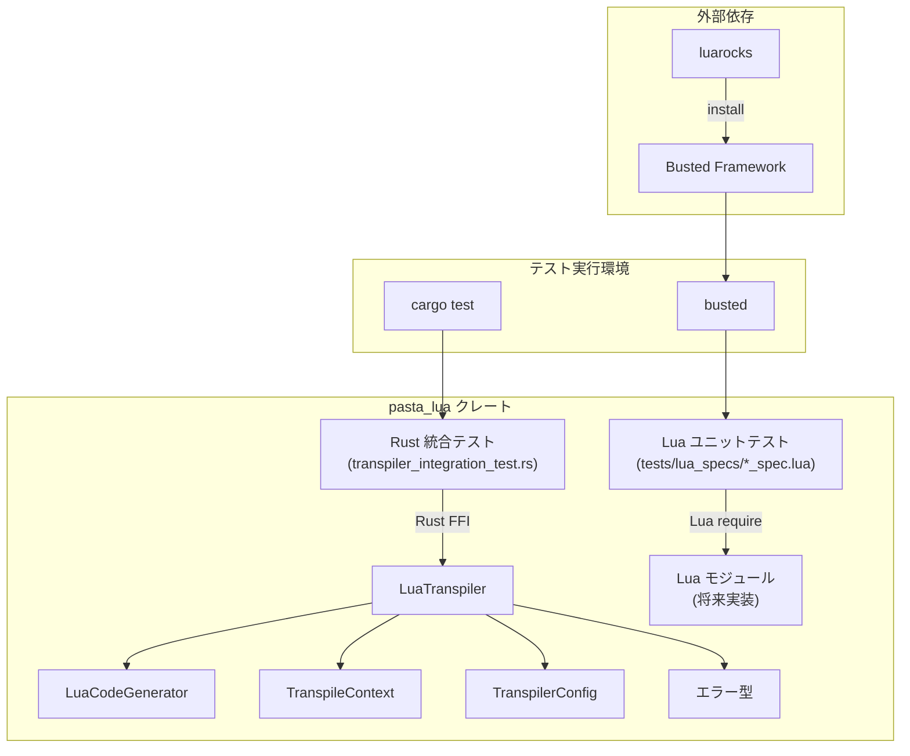
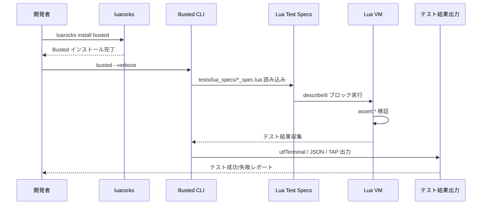
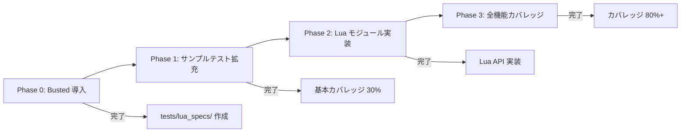

# 設計書：pasta_lua ユニットテストフレームワーク導入

## 概要

本仕様は pasta_lua クレートに Lua デファクトスタンダード テストフレームワーク **Busted** を導入し、Lua スクリプト層のユニットテストを可能にする。現在 pasta_lua には Rust 統合テストのみが存在し、Lua スクリプト層そのものの品質保証が欠落している。この設計により、Lua トランスパイラ、コードジェネレータ、コンテキスト管理の動作を Lua レイヤーで直接検証可能になる。

**目的**: Lua スクリプト層に BDD スタイルのテストフレームワークを導入し、開発者が迅速にフィードバックを得られるテスト環境を構築する。

**ユーザー**: pasta_lua クレート開発者、およびトランスパイラ拡張を行う貢献者。

**影響**: Rust 統合テストと Lua ユニットテストの役割を明確に分離し、Lua VM 実行層の品質保証を強化する。

### ゴール
- luarocks 経由で Busted をインストール可能にする
- `busted` コマンドで Lua スクリプト層のテストを実行可能にする
- transpiler, code_generator, context の 3 つのサンプルテストを実装
- ローカル開発環境でのテスト実行を確立
- CI/CD 統合の準備（GitHub Actions 対応、Optional）

### 非ゴール
- Lua 側の本業務ロジック実装（別仕様で対応）
- カバレッジ測定ツール luacov の導入（Phase 1 以降で検討）
- 独自テストフレームワーク開発
- 全機能の完全なテストカバレッジ（Phase 0 では基盤確立のみ）

## アーキテクチャ

### 既存アーキテクチャ分析

pasta_lua は以下のモジュール構成を持つ：

```
crates/pasta_lua/
├── Cargo.toml
├── src/
│   ├── lib.rs                  # クレートエントリーポイント
│   ├── transpiler.rs           # LuaTranspiler - メイン変換 API
│   ├── code_generator.rs       # LuaCodeGenerator - Lua コード生成
│   ├── context.rs              # TranspileContext - 状態管理
│   ├── config.rs               # TranspilerConfig - 設定
│   ├── error.rs                # エラー型定義
│   └── string_literalizer.rs   # 文字列リテラル最適化
├── scripts/                    # ✅ 自作Luaコード・スクリプト層
│   ├── hello.lua               # サンプルスクリプト
│   ├── transpiler.lua          # 自作実装
│   ├── code_generator.lua      # 自作実装
│   ├── context.lua             # 自作実装
│   ├── helpers/                # ヘルパー関数
│   │   ├── string_utils.lua
│   │   └── table_utils.lua
│   ├── examples/               # 使用例スクリプト
│   ├── init.lua                # エントリーポイント
│   └── README.md               # スクリプト層ドキュメント
├── scriptlibs/                 # ✅ 外部Luaライブラリ専用
│   ├── busted/                 # Busted テストフレームワーク
│   └── (外部ライブラリ)
└── tests/
    ├── transpiler_integration_test.rs  # Rust 統合テスト (824 行)
    ├── lua_specs/              # Lua ユニットテスト
    └── fixtures/
        ├── sample.pasta        # テスト用 Pasta スクリプト
        └── sample.lua          # 期待される Lua 出力
```

**現状の課題**:
- Rust 統合テストのみ存在、Lua スクリプト層の単体テストなし
- Lua VM 実行層の動作検証が不十分
- テスト実行に Rust ビルドが必要で、フィードバックループが遅い

### アーキテクチャパターン & 境界マップ



**アーキテクチャ統合**:
- **選択したパターン**: Test Layer Segregation（テストレイヤー分離）
  - Rust 統合テスト: Rust から Lua トランスパイラを呼び出し、出力検証
  - Lua ユニットテスト: Lua スクリプト層の動作を Lua 内で直接検証
- **ドメイン/機能境界**:
  - Rust 層: トランスパイラ API、AST → Lua 変換ロジック
  - Lua 層: 生成された Lua コードの実行時動作、Lua VM 統合
- **既存パターン保持**: pasta プロジェクトの `tests/` ディレクトリ規約（structure.md）に準拠
- **新規コンポーネントの根拠**:
  - `tests/lua_specs/`: Lua ユニットテストを Rust 統合テストから分離
  - `.busted`: Busted 設定ファイルで verbose, pattern, ROOT を指定
- **ステアリング準拠**: テストファイルは `tests/` 配下に集約（structure.md）

### 技術スタック

| レイヤー | 選択 / バージョン | 機能における役割 | 備考 |
|---------|-------------------|------------------|------|
| テストフレームワーク | Busted 2.2.0+ | Lua ユニットテスト実行 | luarocks 経由でインストール |
| パッケージマネージャ | luarocks 3.9+ | Busted インストール管理 | 開発者ローカル環境で必要 |
| Lua VM | Lua 5.4 | テスト実行環境 | mlua の `lua54` feature に対応 |
| CI/CD | GitHub Actions | 自動テスト実行 (Optional) | `lunarmodules/busted@v0` アクション使用 |
| Rust テスト | cargo test | Rust 統合テスト実行 | 既存のまま維持 |

**根拠**:
- **Busted**: Lua デファクトスタンダード（1.6k★）、RSpec/Mocha 風 BDD スタイル、Mock/Spy 機能搭載
- **luarocks**: Lua 公式パッケージマネージャ、Busted インストールに必須
- **Lua 5.4**: pasta_lua の mlua 依存関係が `lua54` feature を使用
- **GitHub Actions**: CI/CD 統合が容易、`lunarmodules/busted@v0` アクション提供済み

詳細な調査内容は `research.md` の「テストフレームワークの選定」セクションを参照。

## システムフロー

### テスト実行フロー



**フロー レベル判断**:
- Busted CLI が `.busted` 設定ファイルを読み込み、`ROOT = {"tests/lua_specs"}` でテスト対象ディレクトリを特定
- 各 `*_spec.lua` ファイルが Lua VM で実行され、`describe`/`it` ブロックがテストケースとして認識される
- `assert.*` 関数が失敗した場合、エラーがスローされ、Busted がキャッチして結果を集計
- `--verbose` フラグでエラースタックトレースが詳細出力される

### CI/CD 統合フロー (Optional)

```mermaid
flowchart LR
    Push[Git Push] --> GHA[GitHub Actions]
    GHA --> BustedAction[lunarmodules/busted@v0]
    BustedAction --> RunTests[busted --verbose]
    RunTests --> Pass{テスト成功?}
    Pass -->|Yes| Success[CI 成功]
    Pass -->|No| Fail[CI 失敗]
```

**フロー レベル判断**:
- GitHub Actions ワークフローで `lunarmodules/busted@v0` アクションを使用
- アクションが Docker コンテナ内で Busted を実行、環境差異を排除
- テスト失敗時に CI が失敗ステータスを返し、PR マージをブロック

## 要件トレーサビリティ

| 要件 | 概要 | コンポーネント | インターフェース | フロー |
|------|------|---------------|-----------------|--------|
| R1 | テストスイート導入 | Busted インストール, `.busted` 設定 | luarocks CLI, Busted CLI | テスト実行フロー |
| R2 | サンプルテスト作成 | transpiler_spec.lua, code_generator_spec.lua, context_spec.lua | Busted describe/it API | テスト実行フロー |
| R3 | ローカル実行環境 | luarocks setup, busted コマンド | Busted CLI | テスト実行フロー |
| R4 | CI/CD 統合 (Optional) | GitHub Actions ワークフロー | `lunarmodules/busted@v0` アクション | CI/CD 統合フロー |

## コンポーネント & インターフェース

### コンポーネント概要

| コンポーネント | ドメイン/レイヤー | 意図 | 要件カバレッジ | 主要依存関係 (P0/P1) | コントラクト |
|---------------|------------------|------|---------------|----------------------|-------------|
| Busted インストール | インフラ | luarocks 経由で Busted をインストール | R1, R3 | luarocks (P0) | - |
| `.busted` 設定 | インフラ | Busted 実行時の設定を定義 | R1, R3 | - | Config File |
| tests/lua_specs/ | テスト層 | Lua ユニットテストを格納 | R2 | Busted (P0) | - |
| transpiler_spec.lua | テスト層 | LuaTranspiler の基本動作検証 | R2 | Busted (P0) | Test Suite |
| code_generator_spec.lua | テスト層 | LuaCodeGenerator の出力検証 | R2 | Busted (P0) | Test Suite |
| context_spec.lua | テスト層 | TranspileContext の状態管理検証 | R2 | Busted (P0) | Test Suite |
| README.md (tests/) | ドキュメント | テスト実行手順を記載 | R3 | - | Documentation |
| GitHub Actions ワークフロー | CI/CD | 自動テスト実行 (Optional) | R4 | GitHub Actions (P1) | Workflow |

### インフラ層

#### Busted インストール

| フィールド | 詳細 |
|----------|------|
| 意図 | luarocks 経由で Busted をローカル環境にインストール |
| 要件 | R1, R3 |

**責務 & 制約**:
- luarocks パッケージマネージャを使用して Busted をインストール
- Lua 5.4 環境に対応したバージョンをインストール
- 開発者ローカル環境のセットアップをサポート

**依存関係**:
- 外部: luarocks - Lua パッケージマネージャ (P0)
- 外部: Busted - Lua テストフレームワーク (P0)

**コントラクト**: - (CLI コマンドのみ)

**実装ノート**:
- **統合**: 開発者が `luarocks install busted` を実行してインストール
- **検証**: `busted --version` でインストール確認
- **リスク**: luarocks が未インストールの環境では README.md で手順を提示

#### `.busted` 設定ファイル

| フィールド | 詳細 |
|----------|------|
| 意図 | Busted 実行時の設定を Lua テーブル形式で定義 |
| 要件 | R1, R3 |

**責務 & 制約**:
- テストディレクトリ (`ROOT`) を指定
- 出力フォーマット、verbose モード、pattern を設定
- タスクベース設定で複数プロファイルを管理可能

**依存関係**:
- なし

**コントラクト**: [x] Config File

##### Config File 構造
```lua
return {
  _all = {
    verbose = true,
    ROOT = {"tests/lua_specs"}
  },
  default = {
    pattern = "_spec%.lua$"
  }
}
```

- **`_all`**: 全タスクで共通の設定（verbose, ROOT）
- **`default`**: デフォルトタスクの設定（pattern でファイル名フィルタ）
- **`ROOT`**: テスト対象ディレクトリ（`tests/lua_specs/` を指定）
- **`pattern`**: テストファイル命名パターン（`*_spec.lua`）

**実装ノート**:
- **統合**: crates/pasta_lua/.busted に配置
- **検証**: `busted` コマンドで自動読み込み
- **リスク**: 設定ミスで全テストが実行されない可能性 → README.md でサンプル掲載

### テスト層

#### tests/lua_specs/ ディレクトリ

| フィールド | 詳細 |
|----------|------|
| 意図 | Lua ユニットテストファイルを格納するディレクトリ |
| 要件 | R2 |

**責務 & 制約**:
- `*_spec.lua` 命名規約でテストファイルを格納
- Rust 統合テスト (`tests/transpiler_integration_test.rs`) から分離
- 将来的にサブディレクトリでテストを分類可能（例: unit/, integration/）

**依存関係**:
- Outbound: Busted - テスト実行エンジン (P0)

**コントラクト**: - (ディレクトリ構造のみ)

**実装ノート**:
- **統合**: crates/pasta_lua/tests/lua_specs/ ディレクトリを新規作成
- **検証**: `busted --list` でテストファイル一覧を確認
- **リスク**: ディレクトリ名ミスで Busted が認識しない → `.busted` で ROOT 明示

#### transpiler_spec.lua

| フィールド | 詳細 |
|----------|------|
| 意図 | LuaTranspiler の基本変換動作を検証 |
| 要件 | R2 |

**責務 & 制約**:
- Pasta AST → Lua コード変換の正常系を検証
- シンプルなシーン定義の変換をテスト
- エラーハンドリングの基本動作を検証

**依存関係**:
- Outbound: Busted - describe/it/assert API (P0)
- Outbound: Lua モジュール (将来実装) - LuaTranspiler API (P1)

**コントラクト**: [x] Test Suite

##### Test Suite インターフェース
```lua
describe("LuaTranspiler", function()
  it("converts simple scene to Lua", function()
    -- テストロジック
    assert.truthy(result)
  end)
  
  it("handles errors gracefully", function()
    assert.has_error(function()
      -- エラーを発生させる操作
    end)
  end)
end)
```

- **describe**: テストスイートのコンテキストを定義（RSpec 風）
- **it**: 個別のテストケースを定義
- **assert.***: Busted の assert API（truthy, has_error, same, equal など）

**実装ノート**:
- **統合**: Phase 0 では Lua モジュール実装なし、サンプルコードのみ記載
- **検証**: `busted tests/lua_specs/transpiler_spec.lua` で個別実行
- **リスク**: Lua モジュール未実装の場合、テストは pending 状態で残す

#### code_generator_spec.lua

| フィールド | 詳細 |
|----------|------|
| 意図 | LuaCodeGenerator の Lua コード生成機能を検証 |
| 要件 | R2 |

**責務 & 制約**:
- シーン定義、アクター定義の Lua 出力を検証
- 生成されたコードの構文正当性を確認
- 文字列リテラル最適化の動作を検証

**依存関係**:
- Outbound: Busted - describe/it/assert API (P0)
- Outbound: Lua モジュール (将来実装) - LuaCodeGenerator API (P1)

**コントラクト**: [x] Test Suite

##### Test Suite インターフェース
```lua
describe("LuaCodeGenerator", function()
  it("generates scene definition", function()
    -- シーン定義の Lua コード生成を検証
    assert.same(expected_lua, generated_lua)
  end)
  
  it("optimizes string literals", function()
    -- 文字列リテラル最適化を検証
    assert.is_string(literal)
  end)
end)
```

**実装ノート**:
- **統合**: Phase 0 では pending テストとして骨組みのみ実装
- **検証**: `busted --tags=codegen` でタグフィルタ実行可能
- **リスク**: 生成コードの検証が複雑化 → fixtures/ でリファレンス Lua を用意

#### context_spec.lua

| フィールド | 詳細 |
|----------|------|
| 意図 | TranspileContext の状態管理を検証 |
| 要件 | R2 |

**責務 & 制約**:
- トランスパイル中の変数スコープ管理を検証
- コンテキストのリセット・復元動作を確認
- 並行実行時の状態分離を検証（将来）

**依存関係**:
- Outbound: Busted - describe/it/assert API (P0)
- Outbound: Lua モジュール (将来実装) - TranspileContext API (P1)

**コントラクト**: [x] Test Suite

##### Test Suite インターフェース
```lua
describe("TranspileContext", function()
  before_each(function()
    -- 各テスト前にコンテキスト初期化
  end)
  
  it("manages variable scope", function()
    -- 変数スコープ管理を検証
    assert.is_not_nil(context.scope)
  end)
  
  after_each(function()
    -- 各テスト後にクリーンアップ
  end)
end)
```

**実装ノート**:
- **統合**: before_each/after_each でコンテキスト初期化・クリーンアップ
- **検証**: `busted --verbose` でスタックトレース出力
- **リスク**: コンテキスト状態のリークでテストが不安定化 → before_each で確実にリセット

### ドキュメント層

#### README.md (tests/)

| フィールド | 詳細 |
|----------|------|
| 意図 | Lua テスト実行手順を開発者に提供 |
| 要件 | R3 |

**責務 & 制約**:
- luarocks セットアップ手順を記載
- `busted` コマンドの使用例を提示
- テスト追加方法を説明
- トラブルシューティング情報を提供

**依存関係**:
- なし

**コントラクト**: [x] Documentation

##### Documentation 内容
- **セットアップ**:
  ```bash
  # luarocks インストール (macOS)
  brew install luarocks
  
  # Busted インストール
  luarocks install busted
  ```
- **テスト実行**:
  ```bash
  # 全テスト実行
  busted
  
  # 詳細出力
  busted --verbose
  
  # 特定ファイル実行
  busted tests/lua_specs/transpiler_spec.lua
  ```
- **テスト追加**:
  - `tests/lua_specs/` に `*_spec.lua` ファイルを作成
  - `describe`/`it` ブロックでテストケースを記述

**実装ノート**:
- **統合**: crates/pasta_lua/tests/README.md に配置
- **検証**: 開発者が手順通りにセットアップできるか確認
- **リスク**: OS ごとの luarocks インストール方法が異なる → 主要 OS（macOS, Linux, Windows）の手順を記載

### CI/CD 層 (Optional)

#### GitHub Actions ワークフロー

| フィールド | 詳細 |
|----------|------|
| 意図 | CI で Lua テストを自動実行 (Optional) |
| 要件 | R4 |
| Owner / Reviewers | (Optional) |

**責務 & 制約**:
- PR/Push 時に Busted テストを自動実行
- `lunarmodules/busted@v0` アクションを使用
- テスト失敗時に CI を失敗させる

**依存関係**:
- 外部: GitHub Actions - CI/CD プラットフォーム (P1)
- 外部: lunarmodules/busted@v0 - Busted 実行アクション (P1)

**コントラクト**: [x] Workflow

##### Workflow 定義
```yaml
name: Lua Tests
on: [push, pull_request]

jobs:
  lua-tests:
    runs-on: ubuntu-latest
    steps:
      - name: Checkout
        uses: actions/checkout@v3
      
      - name: Run Busted
        uses: lunarmodules/busted@v0
        with:
          args: --verbose
```

- **Trigger**: push, pull_request イベント
- **Job**: `lua-tests` ジョブで Busted 実行
- **Steps**: Checkout → Busted アクション実行
- **Args**: `--verbose` で詳細出力

**実装ノート**:
- **統合**: `.github/workflows/lua-tests.yml` に配置
- **検証**: PR 作成時に CI が実行されることを確認
- **リスク**: Docker コンテナ起動でビルド時間が増加 → Optional として Phase 0 では実装しない選択肢も

## データモデル

Lua テストフレームワーク導入は既存のデータモデルに影響を与えない。テストコード内で使用されるデータ構造は、既存の pasta_lua API に準拠する。

## エラーハンドリング

### エラー戦略

Busted テストフレームワークのエラーハンドリングは、Lua の `error()` 関数を基盤とする。アサーション失敗時にエラーがスローされ、Busted がキャッチしてテスト結果に反映する。

### エラーカテゴリ & 対応

**テスト実行エラー（Busted CLI）**:
- **luarocks 未インストール**: セットアップ手順を README.md で提示 → 開発者が luarocks をインストール
- **Busted 未インストール**: `luarocks install busted` 実行を促す
- **`.busted` 設定ミス**: Lua 構文エラーを修正 → サンプル設定を README.md に掲載

**アサーション失敗（テストコード内）**:
- **assert.truthy 失敗**: 期待値と実際値の不一致 → テストロジックまたは実装を修正
- **assert.has_error 失敗**: エラーが発生しない → エラーハンドリングロジックを確認
- **assert.same 失敤**: テーブル構造の不一致 → deep compare で差分を確認

**Lua VM エラー（ランタイム）**:
- **構文エラー**: Lua コード生成ミス → LuaCodeGenerator を修正
- **require エラー**: モジュールパス不正 → Lua モジュール実装時に対応

### モニタリング

- **ローカル開発**: `busted --verbose` でスタックトレース出力、エラー箇所を特定
- **CI/CD**: GitHub Actions ログでテスト失敗を追跡、PR コメントでレポート

## テスト戦略

### ユニットテスト
- **transpiler_spec.lua**: LuaTranspiler の AST → Lua 変換ロジックを検証
- **code_generator_spec.lua**: LuaCodeGenerator のコード生成パターンを検証
- **context_spec.lua**: TranspileContext の状態管理を検証

### 統合テスト
- **transpiler_integration_test.rs**: Rust から Lua トランスパイラを呼び出し、End-to-End 検証（既存）
- **Lua スクリプト実行テスト**: 生成された Lua コードを Lua VM で実行し、動作を検証（Phase 1 以降）

### E2E/UI テスト
- N/A（CLI ツールのため UI なし）

### パフォーマンス/負荷テスト
- N/A（Phase 0 ではパフォーマンス測定は対象外）

## オプショナルセクション

### セキュリティ考慮事項

Lua テストフレームワーク導入はセキュリティに直接影響を与えないが、以下の点に注意：

- **Lua VM サンドボックス**: Busted テストは Lua VM 内で実行されるため、ファイルシステムアクセスなどの制約に留意
- **外部依存**: luarocks/Busted は公式パッケージマネージャ/ライブラリであり、トラストチェーンは確立済み

### パフォーマンス & スケーラビリティ

- **テスト実行速度**: Lua スクリプト層のテストは Rust ビルドが不要で、フィードバックループが高速化
- **並列実行**: Busted はデフォルトでファイル単位の並列実行に対応しないが、`--shuffle` でランダム実行可能

### マイグレーション戦略

既存の Rust 統合テストは維持し、Lua ユニットテストを追加する形で段階的に移行：



- **Phase 0**: Busted インストール、`.busted` 設定、3 つのサンプルテスト骨組み作成
- **Phase 1**: サンプルテストを実装レベルに拡充、基本カバレッジ 30% 到達
- **Phase 2**: Lua モジュール（require 可能な API）を実装、テストから呼び出し可能に
- **Phase 3**: 全モジュール（error, config, string_literalizer 含む）のテストを追加、カバレッジ 80% 以上

**ロールバックトリガー**:
- Phase 0 でセットアップに失敗した場合、Busted 導入を中止し、Rust 統合テストのみ継続
- Phase 1 でテスト実装が困難な場合、サンプルテストを pending 状態で残し、Phase 2 以降で対応

---

**設計書作成日**: 2025-12-31  
**対象フェーズ**: Phase 0（基盤構築）  
**優先度**: P1  
**承認ステータス**: 未承認
