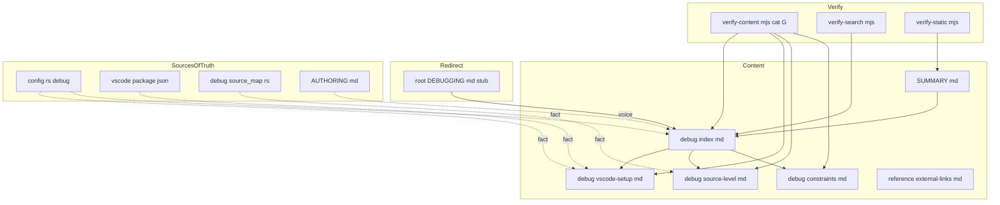
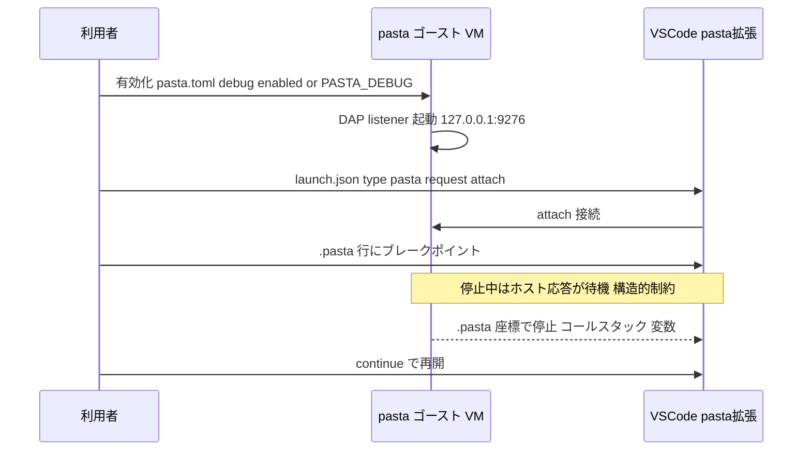

# 技術設計書: pasta-manual-debugging

## Overview

本機能は、完成・出荷済みの VSCode Lua デバッグ機能（`.pasta` ソースレベルまで本番化）の使い方を、pasta 利用者マニュアル（mdBook・GitHub Pages 公開）に **デバッグ章** として追加する。あわせて陳腐化したルート `DEBUGGING.md` をマニュアルへ統合・最新化し、デバッグ情報源を mdBook に一本化する。

**価値**: pasta ゴースト作者が、デバッグ機能の有効化 → VSCode 接続 → `.pasta` ソースレベル操作 → 構造的制約の理解までを、公開マニュアルだけで完遂できる。

**性質**: 本仕様は **ドキュメント追加（Extension）** であり、デバッグ機能の実装（Rust/DAP バックエンド・VSCode 拡張）は一切変更しない。既存の mdBook ビルド・検証パイプライン（`mdbook build` / bigram 検索 / `verify-*` / drift-check / AUTHORING ボイス規約）を全面採用する。

### Goals
- `book/src/debug/` にデバッグ章（複数ページ）を新設し、SUMMARY 経由で公開・検索・オフライン閲覧可能にする（R1）。
- 有効化・接続・`.pasta` 操作・構造的制約と緩和策を、出荷済み実装の確定値に整合させて記述する（R2〜R5, R8.1）。
- `DEBUGGING.md` を最新化してマニュアルへ統合し、ルートはリダイレクトスタブ化して情報源を一本化する（R6）。
- 既存執筆ボイス規約に準拠し（R7）、既存検証を壊さず、デバッグ章を機械検証可能にする（R8）。

### Non-Goals
- デバッグ機能（Rust/DAP バックエンド・VSCode 拡張）の実装変更（R8.3）。
- 文法・Lua を含むマニュアル全体の SSOT/権威化再編（別仕様 `manual-ssot-authority`）。
- ランタイム内部設計の解説（別将来仕様 `pasta-runtime-internals-doc`）。
- 構造的制約の根本解決（ホスト非同期化）。
- VSCode 本体のインストール手順詳細（外部リンクのみ・R3.7）。

## Boundary Commitments

### This Spec Owns
- `book/src/debug/` 配下のデバッグ章コンテンツ（概要/有効化/接続・拡張導入/`.pasta` 操作/構造的制約）。
- `book/src/SUMMARY.md` へのデバッグセクション登録。
- ルート `DEBUGGING.md` の最新化済み内容のマニュアルへの移設と、ルートファイルのリダイレクトスタブ化。
- `book/tools/verify-content.mjs` への **デバッグ章検証カテゴリ G** の追加（R8.4）。
- 必要に応じ `book/src/reference/external-links.md` への拡張マーケットプレイス/VSIX リンク追補。

### Out of Boundary
- デバッグ機能・VSCode 拡張・DAP バックエンドのコード（読み取り専用の参照のみ）。
- `manual-sources.toml`（デバッグ章は `doc/spec` 由来なしのため登録しない・R6.5）。
- `tutorial-check.mjs` のロジック（ウォークスルーは逐語一致ガード対象外・B5）。
- 文法章・Lua 章・getting-started 章の既存コンテンツ。

### Allowed Dependencies
- 既存 mdBook 基盤: `book.toml`、`theme/head.hbs`（bigram tokenizer）、`mdbook build`。
- 既存検証スクリプト: `verify-static.mjs` / `verify-search.mjs` / `drift-check.mjs`（拡張ではなく利用）。
- 既存執筆規約: `book/AUTHORING.md`（Claudia 令嬢ボイス・Do/Don't）。
- 出荷済み実装の事実: `editors/vscode/package.json`、`crates/pasta_lua/src/{loader/config.rs,debug/*}`（記述の典拠・コードは変更しない）。

### Revalidation Triggers
以下が変化したらデバッグ章の追従更新が必要（再検証トリガ）:
- `[debug]` 設定キー・既定値・環境変数名・優先順位の変更（config.rs / debug/mod.rs）。
- 既定接続先（`127.0.0.1:9276`）や `request`/`type` 識別子、`sourcePresentation` enum の変更（package.json）。
- サイドカー出力先・形式の変更（debug/source_map.rs）。
- `verify-content.mjs` のカテゴリ判定方式・ボイスマーカー集合の変更。
- 構造的制約（`Arc<Mutex>` 直列化）の解消・緩和に関わる実装変更。

## Architecture

### Existing Architecture Analysis

マニュアルは「コンテンツ章（`book/src/**`）＋ build-time 検証（`book/tools/*.mjs`）＋ mdBook 静的出力」の三層。各コンテンツ章は **書き下ろし＋一方向リンク参照**（トランスクルージョンしない）で、`doc/spec` 由来章のみ `manual-sources.toml` でドリフト追跡される。ボイスは `AUTHORING.md` で規約化され、`verify-content.mjs` が機械検証する。デバッグ章はこの既存構造へ**新カテゴリの増設なし・1 セクション追加**として収まる（`doc/spec` 由来を持たないため drift 追跡対象外）。

### Architecture Pattern & Boundary Map



**Architecture Integration**:
- 選択パターン: 既存「多ページ・コンテンツ章」イディオム（grammar/lua と同型）。
- 境界分離: 4 ページが各責務（概要+有効化+ウォークスルー / 接続+拡張導入 / `.pasta`操作 / 制約）を単独所有。共有所有なし。
- 既存パターン保持: 書き下ろし＋一方向リンク、Claudia ボイス規約、build-time 機械検証。
- 新規要素の根拠: デバッグは文法/Lua とは読者文脈が異なる独立セクション（R1.1）。verify-content の G は A〜F の一般化適用。
- ステアリング遵守: tech.md「利用者向け知識はマニュアルが正」、AUTHORING ボイス規約、追加エコシステム依存ゼロ。

### Technology Stack

| Layer | Choice / Version | Role in Feature | Notes |
|-------|------------------|-----------------|-------|
| Frontend / CLI | mdBook v0.5.3 | Markdown→静的 HTML 生成 | 既存・追加依存なし |
| Content | Markdown（`book/src/debug/*.md`） | デバッグ章本文 | 新規 4 ファイル |
| Verify | Node.js（`verify-content.mjs`） | デバッグ章の機械検証（カテゴリ G） | 既存スクリプトへ追記 |
| Search | elasticlunr + bigram tokenizer | 日本語全文検索 | 既存・自動索引化 |
| Sources of Truth | Rust / package.json（参照のみ） | 記載値の典拠 | **変更しない** |

依存方向: `SUMMARY → debug/*.md`（章本文）、`debug/*.md →（リンク参照のみ）→ doc/spec・external`、`verify-content.mjs → debug/*.md`（検証）。コンテンツが実装ソースに**逆依存しない**（事実は転記、自動同期しない）。

## File Structure Plan

### Directory Structure
```
book/
├── src/
│   ├── SUMMARY.md                  # 変更: 「デバッグ」セクションを追加
│   ├── debug/                      # 新規ディレクトリ（デバッグ章）
│   │   ├── index.md                # 概要・全体像・有効化・短いウォークスルー（orientation）
│   │   ├── vscode-setup.md         # 拡張導入・launch.json・attach 接続
│   │   ├── source-level.md         # .pasta 行 BP/停止/コールスタック/ステップ/変数/提示モード/サイドカー
│   │   ├── constraints.md          # 構造的制約（ブレーク中ホスト応答停止）と緩和策
│   │   └── troubleshooting.md       # 接続確認手段・アプリ/VSCode 二分診断・失敗症状→原因（R9）
│   └── reference/
│       └── external-links.md       # 変更(任意): 拡張マーケットプレイス/VSIX リンク追補
├── tools/
│   └── verify-content.mjs          # 変更: カテゴリ G（デバッグ章）検証を追加
└── CONTENT-REVIEW.md               # 変更(任意): デバッグ章の人手確認記録を追補

DEBUGGING.md                        # 変更: 本文撤去→マニュアルへのリダイレクトスタブ化
README.md                           # 変更: ドキュメント表の DEBUGGING.md 説明をマニュアルのデバッグ章へ向け直す
```

### Modified Files
- `book/src/SUMMARY.md` — デバッグセクション（`# デバッグ` 見出し＋4 ページのリンク）を追加。
- `book/tools/verify-content.mjs` — カテゴリ G を追加（デバッグ章の存在・本文・ボイス・主要事実の登場をアサート）。
- `DEBUGGING.md` — 陳腐化本文を撤去し、公開サイト URL・相対パス・GitHub ソースパスへの数行スタブへ置換。
- `README.md` — ドキュメント表（`README.md:45` 付近）の `DEBUGGING.md` エントリの説明を、デバッグの権威がマニュアルのデバッグ章（公開 URL / 相対パス）へ移った旨へ更新（読者をスタブへ誘導しないため・R6.4 の一本化を完結）。
- `book/src/reference/external-links.md`（任意） — 拡張マーケットプレイス/VSIX の絶対 URL を追補。
- `book/CONTENT-REVIEW.md`（任意） — デバッグ章の人手確認項目を追記。

各ファイルは単一責務。コンテンツ 4 ページは責務で分離され、並行執筆も安全。

## System Flows

デバッグ章が読者に伝える接続フロー（記述内容の正確性担保のための参照図。実装は変更しない）:



提示モードは `sourcePresentation`（attach 引数）> `PASTA_DEBUG_SOURCE_MODE`（env）> `present_as`（toml）> 既定 `.pasta` の優先順位。章はこの順位を簡潔に説明する。

## Requirements Traceability

| Requirement | Summary | Components |
|-------------|---------|------------|
| 1.1 | SUMMARY 独立セクション登録・到達可能 | SUMMARY.md, debug/index.md |
| 1.2 | 章が空でない本文を持つ | debug/index.md, vscode-setup.md, source-level.md, constraints.md |
| 1.3 | mdbook build がエラーなく生成 | 全 debug/*.md（既存 build パイプライン） |
| 1.4 | 日本語検索でヒット | debug/*.md（bigram 索引）, verify-search.mjs |
| 1.5 | 静的・オフライン閲覧可能 | debug/*.md, verify-static.mjs |
| 2.1 | pasta.toml [debug] enabled/port 説明 | debug/index.md |
| 2.2 | 環境変数 PASTA_DEBUG / _PORT 説明 | debug/index.md |
| 2.3 | env が file より優先を明示 | debug/index.md |
| 2.4 | 既定で無効を明示 | debug/index.md |
| 2.5 | 無効時ゼロコスト・サンドボックス維持 | debug/index.md |
| 3.1 | attach 方式の説明 | debug/vscode-setup.md |
| 3.2 | launch.json 具体例 | debug/vscode-setup.md |
| 3.3 | 既定 127.0.0.1:9276 明示 | debug/vscode-setup.md |
| 3.4 | ポート変更時の整合説明 | debug/vscode-setup.md, debug/index.md |
| 3.5 | VSCode 主軸＋他 DAP 一言補足 | debug/vscode-setup.md |
| 3.6 | 拡張必須＋未導入前提の導入手順 | debug/vscode-setup.md |
| 3.7 | VSCode 本体は外部リンクのみ | debug/vscode-setup.md, reference/external-links.md |
| 4.1 | .pasta 行 BP 設定方法 | debug/source-level.md |
| 4.2 | .pasta 座標停止・コールスタック | debug/source-level.md |
| 4.3 | .pasta 粒度ステップ（コルーチン跨ぎ） | debug/source-level.md |
| 4.4 | 停止中の変数 inspect | debug/source-level.md |
| 4.5 | 提示モード切替（.pasta/.lua） | debug/source-level.md |
| 4.6 | サイドカー出力（任意） | debug/source-level.md |
| 4.7 | 短いウォークスルー | debug/index.md |
| 5.1 | ブレーク中ホスト応答停止（既知挙動） | debug/constraints.md |
| 5.2 | 後続 SHIORI も再開まで待機 | debug/constraints.md |
| 5.3 | SSP タイムアウト緩和策 | debug/constraints.md |
| 5.4 | 根本解決はスコープ外を明示 | debug/constraints.md |
| 6.1 | DEBUGGING.md 内容を最新化して取り込み | debug/*.md |
| 6.2 | .pasta ソースレベルを本番機能として記述 | debug/source-level.md, debug/index.md |
| 6.3 | ルート DEBUGGING.md をリダイレクト化 | DEBUGGING.md |
| 6.4 | 同一事実を二重管理しない・読者を最新へ導く | DEBUGGING.md, debug/*.md, README.md |
| 6.5 | manual-sources.toml に登録しない | （非変更の決定・Boundary） |
| 7.1 | 導入/締めが Claudia ボイス | debug/*.md, verify-content.mjs(G) |
| 7.2 | 説明本体は普通文体 | debug/*.md |
| 7.3 | コード/表/コマンドに口調なし | debug/*.md, verify-content.mjs(G) |
| 7.4 | ボイスが正確性を損なう場合は普通文優先 | debug/*.md |
| 8.1 | 出荷済み実装と整合 | debug/*.md（事実典拠） |
| 8.2 | 既存検証が非回帰で完了 | verify-*.mjs, drift-check.mjs |
| 8.3 | デバッグ実装を変更しない | （Boundary・非変更） |
| 8.4 | デバッグ章を機械確認可能 | verify-content.mjs(G) |
| 9.1 | アタッチ成立の VSCode 側確認サイン | debug/troubleshooting.md |
| 9.2 | 待ち受け/接続の OS 側確認 | debug/troubleshooting.md |
| 9.3 | アタッチ中も固まらないのが正常 | debug/troubleshooting.md, debug/constraints.md |
| 9.4 | 失敗症状→原因の切り分け | debug/troubleshooting.md |
| 9.5 | アプリ/VSCode 二分診断手順 | debug/troubleshooting.md |

## Components and Interfaces

| Component | Domain/Layer | Intent | Req Coverage | Contracts |
|-----------|--------------|--------|--------------|-----------|
| debug/index.md | Content | 概要・有効化・ウォークスルー | 1.1-1.5, 2.1-2.5, 3.4, 4.7, 6.2 | Content |
| debug/vscode-setup.md | Content | 拡張導入・launch.json・attach | 3.1-3.7, 6.1 | Content |
| debug/source-level.md | Content | `.pasta` 操作・提示モード・サイドカー | 4.1-4.6, 6.1, 6.2 | Content |
| debug/constraints.md | Content | 構造的制約・緩和策 | 5.1-5.4, 6.1 | Content |
| debug/troubleshooting.md | Content | 接続確認・二分診断・失敗症状→原因 | 9.1-9.5 | Content |
| SUMMARY.md（更新） | Navigation | デバッグセクション登録 | 1.1 | Content |
| DEBUGGING.md（更新） | Redirect | リダイレクトスタブ | 6.3, 6.4 | Content |
| README.md（更新） | Redirect | ドキュメント表の誘導先をマニュアルへ更新 | 6.4 | Content |
| verify-content.mjs カテゴリG | Verify | デバッグ章の機械検証 | 7.1, 7.3, 8.4 | Batch |

### Content Layer

#### デバッグ章 4 ページ（共通規約）

| Field | Detail |
|-------|--------|
| Intent | デバッグの使い方を出荷済み実装の確定値で記述 |
| Requirements | 1.x, 2.x, 3.x, 4.x, 5.x, 6.1, 6.2, 7.x, 8.1 |

**Responsibilities & Constraints**
- 各ページは AUTHORING.md 準拠（導入/締めは Claudia ボイス、本体は普通文体、コードフェンス/表/コマンドに口調を入れない）。本文 800 字以上。
- 記載する設定値・既定値・識別子は §確定事実（research.md §7）に厳密一致させる。事実は転記し、`doc/spec`/実装の自動同期はしない（一方向）。
- ページ間は相対リンクで連携（index がハブ）。

**確定記載値（research.md §7 由来・要約再掲で design 自己完結）**
- 有効化: `pasta.toml [debug] enabled=false / port=9276 / present_as=（省略時 .pasta）/ source_map_sidecar=false`。env: `PASTA_DEBUG`(truthy=`1/true/yes/on`)、`PASTA_DEBUG_PORT`、`PASTA_DEBUG_SOURCE_MODE`、`PASTA_DEBUG_SOURCE_MAP_SIDECAR`。優先: env>file>既定（提示モードのみ DAP 引数>env>file>既定）。
- 接続: `127.0.0.1:9276`・TCP・loopback 限定・attach のみ。
- 拡張の導入: pasta VSCode 拡張（`displayName "Pasta DSL"` / `publisher "ekicyou"` / `name "pasta-vscode"`）が必須。導入経路は (1) VS Code Marketplace で「Pasta DSL」を検索（`release-workflow` の `vsce publish` で公開・主経路）、(2) GitHub Releases の VSIX 資産 `pasta-vscode-<version>.vsix` を手動インストール（代替経路）。VSCode 本体は外部リンクのみ（R3.7）。
- launch.json: `type:"pasta"` / `request:"attach"` / `host` / `port` / `sourcePresentation`(enum `pasta|lua`・任意)。拡張は `breakpoints` 言語 `pasta`/`lua` を登録。
- `.pasta` 操作: 行 BP・座標停止/コールスタック・粒度ステップ(over/into/out・コルーチン跨ぎ)・変数 inspect・提示モード切替・任意サイドカー `<lua_path>.map`(JSON)。
- 制約: `Arc<Mutex>` 直列・blocking によりブレーク中は VM 不復帰→現+後続 SHIORI 応答が continue まで待機。根本解決はスコープ外、緩和策のみ。

**Implementation Notes**
- Integration: SUMMARY 追加で build/search/static 検証が自動適用。
- Validation: verify-content カテゴリ G が存在・本文・ボイス・主要事実を確認。
- Risks: 記載値の誤記 → research.md §7 と突合して防止。Revalidation Triggers の実装変更時に追従。

### Redirect Layer

#### DEBUGGING.md（リダイレクトスタブ）

**Responsibilities & Constraints**
- 陳腐化本文（「`.pasta` ソースレベル=実験的/将来」）を全撤去。デバッグ説明の権威はマニュアルへ移譲（R6.3/6.4）。
- 残す内容: 公開サイト URL（`https://ekicyou.github.io/pasta/`）＋ リポジトリ内相対パス（`book/src/debug/`）＋ デバッグ章が正である旨の数行。
- 同一のデバッグ事実をスタブ側に再掲しない（二重管理回避）。

### Verify Layer

#### verify-content.mjs カテゴリ G（デバッグ章検証）

| Field | Detail |
|-------|--------|
| Intent | デバッグ章の存在・本文・ボイス・主要事実を機械検証 | 
| Requirements | 7.1, 7.3, 8.4 |

**Contracts**: Batch

##### Batch / Job Contract
- Trigger: `node book/tools/verify-content.mjs` 実行時（DoD/ローカルゲート）。
- Input/validation: `book/src/debug/{index,vscode-setup,source-level,constraints,troubleshooting}.md` を走査。
  - `G-exist:*` 各ページ存在。
  - `G-body:*` `isSubstantive(md,800)` で本文実体。
  - `G-voice:*` 散文部に `hasVoice()`（導入/締めのボイス・R7.1）。
  - `G-codevoice:*` コードフェンス内に `NARRATION_MARKERS` 非混入（R7.3）。
  - `G-fact:*` 主要事実の登場（例: `9276`、`PASTA_DEBUG`、`attach`、`.pasta`、`sourcePresentation`）を `includes` で確認（R8.1 の最低限の取りこぼし防止）。
- Output: 既存 `checks[]` に積み、exit 0/1 で集計（既存挙動踏襲）。
- Idempotency: 純走査・副作用なし。

**Implementation Notes**
- Integration: 既存 `ok/fail/assert` と `GRAMMAR_CHAPTERS` ループのイディオムを流用。`DEBUG_CHAPTERS` 配列を新設して同型ループ。
- Validation: G 追加後も A〜F が緑であること（非回帰・R8.2）。
- Risks: `G-fact` を厳格にしすぎると将来の言い回し変更で誤検出 → キーワード最小限に絞る。

## Error Handling

ドキュメント仕様のため実行時エラー設計は最小。検証時の失敗対応のみ:
- **検証失敗（verify-content G / static / search）**: `exit 1`。執筆者が該当章を修正して再実行（Fail Fast）。
- **drift-check**: デバッグ章は `doc/spec` 由来なしで未マップ警告対象外。章内リンク先 URL が実在しなければリンク切れ検出（③）→ 該当リンク修正。
- **リダイレクトスタブのリンク**: 公開 URL・相対パスが解決可能であること（verify-static の SUMMARY/リンク健全性で担保される範囲＋目視）。

## Testing Strategy

### 機械検証（既存スクリプト・DoD ゲート）
- `node book/tools/verify-content.mjs` — カテゴリ G 全項目 PASS かつ A〜F 非回帰（1.2, 7.1, 7.3, 8.1, 8.2, 8.4）。
- `node book/tools/verify-static.mjs` — デバッグ全ページの HTML 生成・file:// 解決・SUMMARY リンク健全（1.3, 1.5）。
- `node book/tools/verify-search.mjs` — デバッグ章本文が日本語検索でヒット（1.4）。
- `node book/tools/drift-check.mjs` — 未マップ警告ゼロ（R6.5 整合）・章内リンク切れゼロ（8.2）。
- `mdbook build book` — エラーなく静的サイト生成（1.3）。

### 人手確認（CONTENT-REVIEW.md 追補）
- 記載値が research.md §7 の確定事実と一致（8.1）。
- 本体が普通文体・誤読の余地なし（7.2, 7.4）。
- DEBUGGING.md スタブに陳腐化本文が残っていない・二重管理なし（6.3, 6.4）。
- `.pasta` ソースレベルが本番機能として記述（実験的/将来表現の不在）（6.2）。

### 非対象（重複回避）
- ウォークスルーは `tutorial-check.mjs` 逐語一致ガード対象外（B5）。デバッグ実装の動作テストは既存 `pasta-vscode-lua-debug` / `pasta-source-map` のテストが担い、本仕様では再検証しない（8.3）。

## Supporting References
- 確定事実の典拠と合成記録: `.kiro/specs/completed/pasta-manual-debugging/research.md`（§3 実装事実、§6 ディスカッション結果、§7 discovery 確定事項）。
- 執筆ボイス規約: `book/AUTHORING.md`。
