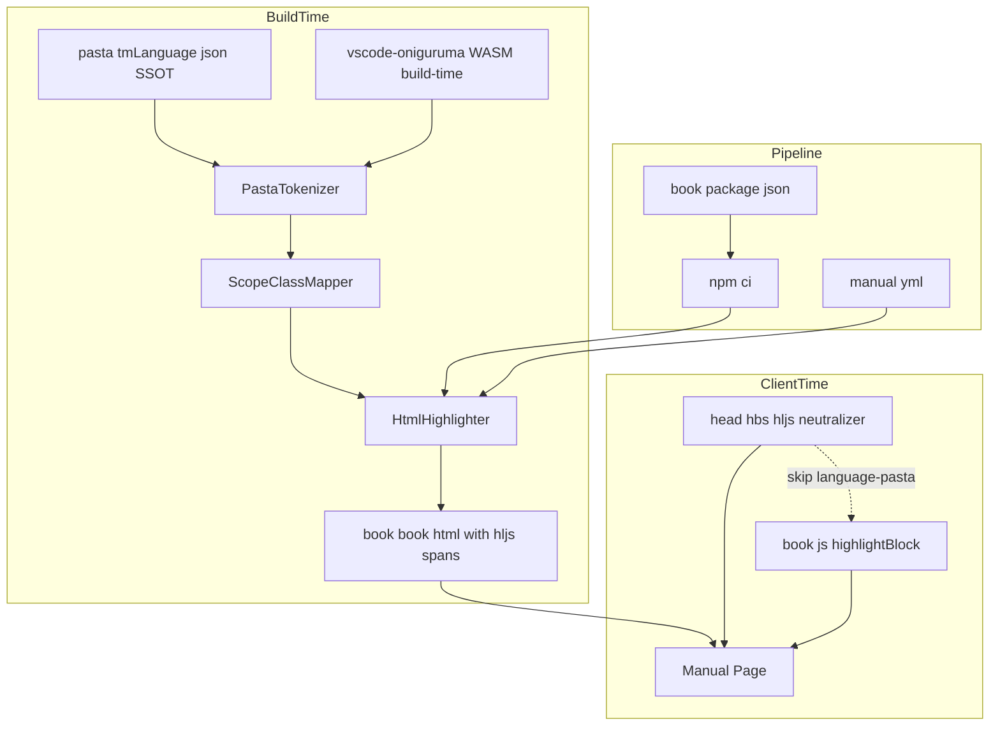
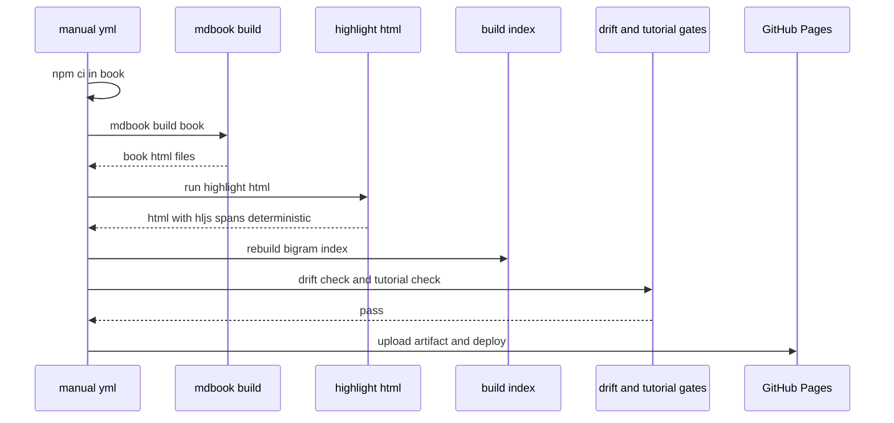
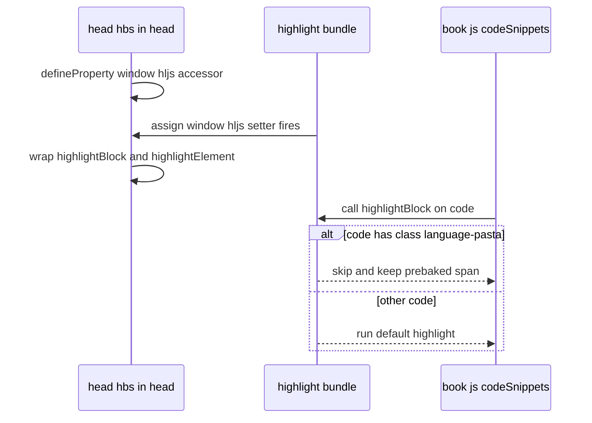

# 技術設計: pasta-manual-syntax-highlight

## Overview

**この機能が届ける価値**: 利用者マニュアル（mdBook v0.5.3・GitHub Pages 公開）の `*.pasta` コードブロックを、build-time に TextMate 文法（pasta ハイライトの SSOT）でトークナイズし、highlight.js 互換クラスの `<span>` を焼き込むことで、VSCode 拡張と**識別性において同等**の色分けを純静的 HTML として提供する。

**対象利用者**: マニュアル読者（ゴースト作者・初学者）が入門・文法章で pasta コードを読む際に、構文要素の判別が容易になる。

**システムへの影響**: 既存の `book/tools/` build-time Node 基盤（bigram 索引再生成の後処理パターン）と `theme/head.hbs` override パターンを踏襲して拡張する。公開成果物は純静的のまま（ランタイム依存を増やさない）で、`manual.yml` 公開パイプラインに後処理 1 工程と `npm ci` を追加する。

### Goals
- `language-pasta` コードブロックに、両テーマ（light/navy）で判別可能な hljs 互換クラス span を build-time で焼き込む。
- mdBook の `book.js` による無条件クライアント再ハイライトを中和し、事前 span を保持する。
- pasta 文法の正本を TextMate 文法ただ一つに保つ（highlight.js 用第2文法を作らない）。
- 決定論的・冪等な後処理で、再現可能ビルドと安全な再実行を保証する。

### Non-Goals
- VSCode 拡張の TextMate 文法（`pasta.tmLanguage.json`）の改変（読み取り再利用のみ）。
- VSCode と同一の配色再現（識別性の同等まで。色は mdBook テーマ CSS に従う）。
- light/navy 以外のテーマ（rust/coal/ayu）の配色保証・検証（標準クラス採用で副次的に着色される見込みだが対象外）。
- 毎ビルドで走る恒常的なハイライト検証ゲートの新設（検証は初回受け入れ時一度限り）。

## Boundary Commitments

### This Spec Owns
- build-time の pasta トークナイズ機構（`book/tools/highlight/`）と、スコープ→hljs クラスの単一写像。
- pasta ブロック内の入れ子 ```lua（`meta.embedded.block.lua.content`）を、別途 vendor した lua TextMate 文法で**二段トークナイズ**して着色する処理。
- `book/book/**/*.html` 内 `language-pasta` ブロックの span 焼き込み後処理（決定論・冪等）。
- `theme/head.hbs` における book.js 再ハイライト中和ブロック。
- `book/package.json` / lockfile（build-time devDependency の固定）と `manual.yml` への工程結線。

### Out of Boundary
- `editors/vscode/syntaxes/pasta.tmLanguage.json` の内容（読み取り専用・改変禁止）。
- pasta 以外の言語のハイライト、エディタ/LSP のハイライト（`pasta_lsp` の領分）。
- マニュアル本文コンテンツ（`pasta-user-manual`・完了済み）。
- 公開サイトのランタイム依存（WASM・フレームワーク等）。

### Allowed Dependencies
- **Upstream（読み取り再利用）**: `pasta.tmLanguage.json`（scopeName `source.pasta`、pasta ハイライトの唯一の SSOT・改変禁止）。
- **Vendored 文法（build-time のみ・第三者 MIT/permissive）**: `lua.tmLanguage.json`（scopeName `source.lua`）。入れ子 lua の着色専用。pasta の第2文法ではなく**別言語の独立文法**ゆえ pasta SSOT 単一（要件 5）を侵さない。出典は MIT 系（例: VSCode 同梱 lua 文法）。読み取り専用 vendor。
- **External（build-time のみ）**: `vscode-textmate@9.3.2`、`vscode-oniguruma@2.0.1`（共に MIT・ランタイム依存ゼロ・WASM は build-time のみ）。
- **既存基盤**: `book/tools/` 後処理パターン、`theme/head.hbs` override、`manual.yml`。
- **制約**: 公開成果物に上記 External 依存・WASM・vendor 文法を一切含めない。**pasta 用 highlight.js 第2文法を新設しない**（lua は別言語の独立文法であり pasta の二重文法には当たらない）。

### Revalidation Triggers
- mdBook バージョン更新（`book.js`/highlight.js 同梱物・ハッシュ付きファイル名・`highlightBlock` 実装の変化）→ 中和とテーマ配色の再検証。
- `pasta.tmLanguage.json` のスコープ追加・改名（特に `meta.embedded.block.lua.content` の命名変更）→ `scope-map` 写像・二段トークナイズ検出条件の見直し（追従は一元）。
- vendor lua 文法（`lua.tmLanguage.json`）の更新・差し替え → 入れ子 lua 着色の再確認。
- mdBook テーマ CSS の hljs クラス色グループ変化 → 6色マッピングの再確認。

## Architecture

### Existing Architecture Analysis
- **後処理パターン（bigram）**: `mdbook build` 後段に Node スクリプトが `book/book/` 生成物をグロブ解決し in-place 書き換え。冪等・決定論的、失敗時 `exit 1`。本機能の HTML 後処理はこの鏡像。
- **head.hbs override**: mdBook v0.5.3 で確実に効く唯一の theme override 足場。`window.elasticlunr` を `defineProperty` で捕捉し挙動差し替え。本機能は `window.hljs` を同型に捕捉して中和。
- **book.js 再ハイライト**: `codeSnippets()` 即時 IIFE が全 `<code>` に `hljs.highlightBlock` を無条件適用（言語スキップ分岐なし）。中和必須。
- **npm 非依存の現状**: `book/tools/` は依存ゼロ。本機能が book/ 初の npm devDependency を導入する（唯一の新規性）。

### Architecture Pattern & Boundary Map

4 seam を疎結合に分離（research §4 Option A＋C）。build-time の焼き込みパス（左）と client-time の保持パス（右）が `language-pasta` クラスを唯一の結合点として連携する。



**Architecture Integration**:
- **選択パターン**: build-time 後処理（焼き込み）＋ client-time 中和（保持）の二経路、結合点は `language-pasta` クラス一点。
- **責務分離**: トークナイズ／写像／HTML 焼き込み／中和を独立 seam に。写像は単一純関数で SSOT 一点化。
- **既存パターン保全**: bigram 後処理・head.hbs override・`exit 1` 失敗規約・決定論/冪等契約。
- **新規理由**: TextMate→hljs クラス変換の確立ツールは無く（Shiki は色焼き込みで不適）、自前変換が必須。
- **Steering 整合**: 純静的・`file://` 両立（product/tech steering）、決定論/冪等（tech 品質基準）、MIT 互換ライセンス。

### Technology Stack

| Layer | Choice / Version | Role in Feature | Notes |
|-------|------------------|-----------------|-------|
| CLI / Build tool | Node 20 ESM（既存） | 後処理スクリプト実行環境 | manual.yml で導入済み |
| Tokenizer | vscode-textmate ^9.0.0 (MIT) | JSON tmLanguage ロード＋行トークナイズ | editors/vscode と同版・lockfile で固定 |
| Regex engine | vscode-oniguruma ^2.0.0 (MIT) | onigLib 供給（WASM） | build-time のみ・成果物非混入 |
| Embedded 文法 | lua.tmLanguage.json (MIT/permissive・vendor) | 入れ子 lua の二段トークナイズ用 source.lua | 読み取り専用 vendor・成果物非混入 |

> 依存規約は既存 `editors/vscode` に整合（同じ `vscode-textmate ^9` / `vscode-oniguruma ^2`、`package-lock.json` コミット、`node_modules` 非コミット、CI は `npm ci`）。決定論（6.4）は lockfile＋`npm ci` で担保（キャレット範囲でも CI は lockfile から厳密インストール）。
| Theme override | mdBook `theme/head.hbs`（既存） | book.js 中和スクリプト同梱（neutralizer.mjs の逐語ミラー） | client 実行・追加ランタイム無し |
| Test | jsdom (devDependency) | 中和の build-time ユニットテスト | 公開成果物非混入・恒常ゲートでない |
| CI | GitHub Actions `manual.yml`（既存） | `npm ci`＋後処理工程の結線 | 既存ゲートは不変 |

> 新規依存は build-time devDependency の 2 つのみ。公開成果物への新規ランタイム依存はゼロ。

## File Structure Plan

### Directory Structure
```
book/
├── package.json                 # 新規: devDependencies（vscode-textmate, vscode-oniguruma）と最小 scripts
├── package-lock.json            # 新規: lockfile（コミット対象。node_modules は非コミット）
├── tools/
│   └── highlight/               # 新規: 本機能の build-time ツール群
│       ├── grammars/
│       │   └── lua.tmLanguage.json  # 新規(vendor): 入れ子 lua 用 source.lua（MIT/permissive・読み取り専用・LICENSE 明記）
│       ├── tokenizer.mjs        # PastaTokenizer: pasta+lua 文法ロード（oniguruma WASM init）＋二段 tokenizeText
│       ├── scope-map.mjs        # ScopeClassMapper: 純関数 scopesToClass()（文法非依存・写像 SSOT）
│       ├── highlight-html.mjs   # HtmlHighlighter: CLI・glob・ブロック抽出・span 焼き込み・in-place write
│       ├── neutralizer.mjs      # 中和ロジック正準ソース: installHljsNeutralizer(window)（head.hbs が逐語ミラー）
│       ├── tokenizer-test.mjs   # 行 state 継続・lua ブロック跨ぎ・入れ子 lua 再トークナイズ・失敗時 exit
│       ├── scope-map-test.mjs   # スコープ→クラス写像（pasta/lua 両スコープ・末尾優先・前方一致・null）
│       ├── neutralizer-test.mjs # jsdom: book.js highlightBlock 模倣→pasta span 生存・他言語は委譲
│       └── highlight-html-test.mjs # 焼き込み・非pasta不変・冪等・決定論・エンティティ往復
└── theme/
    └── head.hbs                 # 変更: hljs 中和ブロックを追記（neutralizer.mjs の逐語ミラー＋同期注記。既存 elasticlunr ブロックと独立共存）
```

### Modified Files
- `book/theme/head.hbs` — `window.hljs` アクセサで `highlightBlock`/`highlightElement` をラップし `language-pasta` をスキップする中和スクリプトを追記。
- `.github/workflows/manual.yml` — `Setup Node` 後に `npm ci`（working-directory: `book`）、`mdbook build` 直後に pasta ハイライト後処理工程を追加。
- `editors/vscode/syntaxes/pasta.tmLanguage.json` — **読み取りのみ（変更しない）**。

## System Flows

### 公開パイプライン（build-time → deploy）

ハイライト（`*.html`）と bigram（`searchindex-*.js`）は対象ファイル非競合のため順序独立。可読性のため mdbook build 直後・bigram 前に配置（要件 7.1/7.2）。後段の既存ゲートは不変（7.3）。

### client-time 中和


## Requirements Traceability

| Requirement | Summary | Components | Interfaces | Flows |
|-------------|---------|------------|------------|-------|
| 1.1 | language-pasta を span 焼き込み（入れ子 lua 含む） | PastaTokenizer（二段）, ScopeClassMapper, HtmlHighlighter | tokenizeText, scopesToClass, CLI | 公開パイプライン |
| 1.2 | 構文要素を判別可能クラスへ分類 | ScopeClassMapper | scopesToClass | — |
| 1.3 | 判別可能配色で表示 | HtmlHighlighter（出力）, テーマ CSS 流用 | — | client-time |
| 1.4 | 非pasta ブロックは不変 | HtmlHighlighter | CLI（フィルタ） | 公開パイプライン |
| 2.1/2.2 | light/navy で判読可能配色 | ScopeClassMapper（交差集合写像） | scopesToClass | client-time |
| 2.3 | 色焼き込み回避・CSS 流用 | ScopeClassMapper | scopesToClass | — |
| 3.1/3.2 | book.js 再ハイライト中和・他言語不変 | ClientNeutralizer (head.hbs) | window.hljs wrap | client-time |
| 4.1/4.3 | 純静的・依存を build-time に閉じる | HtmlHighlighter, BookNpmManifest | CLI | — |
| 4.2 | file:// で色保持 | HtmlHighlighter（静的 span）, ClientNeutralizer | — | client-time |
| 5.1/5.2/5.3 | SSOT 単一・読み取り再利用・追従一元 | PastaTokenizer, ScopeClassMapper | tokenizeText, scopesToClass | build-time |
| 6.1 | 未着色テキストは正常継続 | ScopeClassMapper(null), HtmlHighlighter | scopesToClass | — |
| 6.2 | 文法/ツール失敗で exit 1 | PastaTokenizer, HtmlHighlighter | load, CLI | 公開パイプライン |
| 6.3 | 恒常ゲート新設しない | PipelineWiring | manual.yml | 公開パイプライン |
| 6.4 | 決定論的出力 | HtmlHighlighter | CLI | — |
| 6.5 | 冪等（二重 span 防止） | HtmlHighlighter | CLI | — |
| 7.1/7.2/7.3 | パイプライン結線・順序・既存ゲート維持 | PipelineWiring, BookNpmManifest | manual.yml | 公開パイプライン |
| 8.1–8.4 | 公開 HTML の初回受け入れ検証 | （検証作業・恒常コンポーネント無し） | — | — |

## Components and Interfaces

| Component | Domain/Layer | Intent | Req Coverage | Key Dependencies (P0/P1) | Contracts |
|-----------|--------------|--------|--------------|--------------------------|-----------|
| PastaTokenizer | build-tool | 文法ロード＋行トークナイズ＋入れ子 lua 二段化 | 1.1, 1.3, 5.1, 5.2, 6.2 | vscode-textmate (P0), vscode-oniguruma (P0), pasta tmLanguage (P0), vendor lua 文法 (P1) | Service |
| ScopeClassMapper | build-tool | scope→hljs クラス純写像（文法非依存） | 1.2, 1.3, 2.1, 2.2, 2.3, 6.1 | なし | Service |
| HtmlHighlighter | build-tool | HTML 後処理・span 焼き込み | 1.1, 1.4, 4.1, 4.3, 6.x, 7.1 | PastaTokenizer (P0), ScopeClassMapper (P0) | Batch |
| ClientNeutralizer | theme (client) | book.js 再ハイライト中和 | 3.1, 3.2, 4.2 | book.js/hljs (External P0) | State |
| BookNpmManifest | build-infra | devDeps 固定・lockfile | 4.3, 7.x | npm (P0) | — |
| PipelineWiring | ci | 工程結線・順序保証 | 6.3, 7.1, 7.2, 7.3 | 上記すべて (P0) | Batch |

**Dependency direction（左→右のみ依存可）**:
`tmLanguage (SSOT) → PastaTokenizer → ScopeClassMapper → HtmlHighlighter → (book/book HTML)`。`ClientNeutralizer` は client runtime で独立。`PipelineWiring` がオーケストレーション。`ScopeClassMapper` は他へ依存しない純関数（写像 SSOT）。

### build-tool 層

#### PastaTokenizer

| Field | Detail |
|-------|--------|
| Intent | pasta 文法＋vendor lua 文法をロードし、テキストを行単位でトークナイズ。入れ子 lua は二段トークナイズして scope 付きトークン列を返す |
| Requirements | 1.1, 1.3, 5.1, 5.2, 6.2 |

**Responsibilities & Constraints**
- oniguruma WASM 初期化（`loadWASM`）を await 後、`Registry` に両文法を `loadGrammar('source.pasta')`／`loadGrammar('source.lua')`。
- `tokenizeText` はテキストを `\n` で行分割し各行を pasta 文法で `tokenizeLine`、`ruleStack` を行間で引き回す（lua ブロック begin/end 等の複数行 state を維持）。
- **二段トークナイズ（入れ子 lua）**: pasta パスで scope に `meta.embedded.block.lua.content` を含むトークン区間を検出し、その内部テキストを **vendor lua 文法で再トークナイズ**して lua スコープ付きトークンへ差し替える（lua も行間 `ruleStack` を引き回す）。これにより `include` を持たない pasta 文法（改変不可・5.2）を変えずに入れ子 lua を着色（1.3）。
- pasta ハイライトの語彙的根拠は pasta 文法ただ一つ（5.1）。lua 文法は別言語の独立 vendor（pasta 二重文法ではない）。両文法とも読み取り専用（5.2）。
- 失敗（WASM init／文法ロード／パース）は例外を送出し、呼び出し側で `exit 1`（6.2）。

**Dependencies**
- External: vscode-textmate 9.3.2 — トークナイズ API（P0）
- External: vscode-oniguruma 2.0.1 — onigLib/WASM（P0）
- External: `editors/vscode/syntaxes/pasta.tmLanguage.json` — pasta 文法 SSOT（P0・読み取り専用）
- External: `book/tools/highlight/grammars/lua.tmLanguage.json` — vendor lua 文法（P1・読み取り専用）

**Contracts**: Service [x]

##### Service Interface
```typescript
interface TokenSpan {
  startIndex: number;   // 行内の開始（UTF-16 オフセット）
  endIndex: number;     // 行内の終了
  scopes: string[];     // 外→内のスコープスタック（末尾が最特定。入れ子 lua 区間は lua スコープ）
}

interface GrammarPaths {
  pasta: string;        // source.pasta（*.json）
  lua: string;          // vendor source.lua（*.json）
}

interface PastaTokenizer {
  // 両文法ロード＋oniguruma WASM 初期化。各 path は *.json を渡す（plist 誤判定回避）。
  load(paths: GrammarPaths): Promise<void>;
  // text を行分割し各行のトークン列を返す。ruleStack は内部で引き回す。
  // meta.embedded.block.lua.content 区間は lua 文法で再トークナイズ済みのトークンを返す。
  tokenizeText(text: string): TokenSpan[][];
}
```
- Preconditions: `load()` が resolve 済み。`text` は改行 `\n`（`\r` を含めない）。
- Postconditions: 行数と返り配列長が一致。各 `TokenSpan` は行を被覆。入れ子 lua 区間のトークンは lua スコープを持つ。
- Invariants: 同一 `text` → 同一トークン列（決定論。6.4 を支える）。文法ファイルを変更しない（5.2）。

**Implementation Notes**
- Integration: `parseRawGrammar(content, path)` に必ず `*.json` パスを渡す。oniguruma WASM は `book/node_modules/vscode-oniguruma/release/onig.wasm` を `fs.readFileSync(...).buffer` で `loadWASM`。二段トークナイズの lua 区間は元行内オフセットへ正規化して差し戻す。
- Validation: lua ブロックを跨ぐ fixture で pasta 行 state 継続、入れ子 lua が lua スコープ（`keyword.*`/`string.*`/`comment.*` 等）でトークナイズされ ScopeClassMapper が着色することを検証。
- Risks: vendor lua 文法のライセンス（MIT/permissive）を取得時に確認し `LICENSE`/出典を併置。pasta 文法側で `meta.embedded.block.lua.content` の命名が変わると二段検出条件の更新要（Revalidation Trigger）。

#### ScopeClassMapper

| Field | Detail |
|-------|--------|
| Intent | scope スタックを highlight.js 互換クラス（両テーマ確実着色6色）へ写像する文法非依存の純関数 |
| Requirements | 1.2, 1.3, 2.1, 2.2, 2.3, 6.1 |

**Responsibilities & Constraints**
- `scopes` 末尾（最特定）から `.` 区切りで段階短縮し、前方一致テーブルで 1 クラスへ畳む。
- **文法非依存**: 前方一致のため pasta スコープ（`*.pasta`）も lua スコープ（`comment.*`/`keyword.*`/`string.*`/`constant.numeric.*`/`entity.name.function.*` 等）も同一テーブルで6色へ写る（入れ子 lua の着色を追加コードなしで担保）。
- 採用クラスは light/navy **両テーマで確実に着色され、かつ色が衝突しない6スロット**のみ（research §8.2・実 CSS 色グループ検証済み）。該当なしは `null`（プレーン＝6.1）。
- `hljs-symbol`（navy 無色）・`hljs-section`/`hljs-name`（同色衝突）は使用しない。
- 写像は本関数に一点集約（drift 回避・SSOT）。色は CSS 流用、配色定義を持たない（2.3）。

**Contracts**: Service [x]

##### Service Interface
```typescript
// 該当クラスを返す。未マッチは null（着色しない）。
function scopesToClass(scopes: string[]): string | null;
```
- Preconditions: `scopes` は `tokenizeLine` 由来の配列（空配列可）。
- Postconditions: 返り値は確定マッピング表（research §8.2）のいずれか、または `null`。
- Invariants: 純粋・副作用なし・決定論的（同一入力→同一出力）。

**Implementation Notes**
- Integration: 確定マッピング表（是正後・research §8.2）。6色グループへ集約: `comment.line→hljs-comment`(gray)／`keyword.*`・`keyword.control→hljs-keyword`(purple)／`keyword.control.scene`・`entity.name.class`・`entity.name.type.actor→hljs-title`(aqua-blue)／`entity.name.function.*→hljs-built_in`・`constant.character.escape→hljs-literal`・`constant.numeric→hljs-number`(orange)／`markup.inline.raw.string`・`string.other.sakura-script`・`string.quoted.other→hljs-string`(green)／`variable.*→hljs-variable`・`entity.other.attribute-name→hljs-attr`・`entity.name.tag→hljs-tag`(red)。
- Validation: コメント/マーカー/名前系/呼出・定数/文字列系/参照系の6区分が light/navy 双方で**異なる色**になること（1.3）。`hljs-symbol`/`hljs-section`/`hljs-name` を使わないこと。
- Risks: 文法スコープ追加時・テーマ CSS 色グループ変化時は表更新（Revalidation Trigger）。

#### HtmlHighlighter

| Field | Detail |
|-------|--------|
| Intent | `book/book/**/*.html` の `language-pasta` ブロックを span 焼き込みで in-place 書き換えする batch |
| Requirements | 1.1, 1.4, 4.1, 4.3, 6.1, 6.2, 6.4, 6.5, 7.1 |

**Responsibilities & Constraints**
- グロブで HTML を列挙し、`<code class="language-pasta">…</code>` ブロックのみ処理（他言語・無指定は不変＝1.4）。
- ブロック内容を**タグ除去＋実体参照デコードでソース復元** → `tokenizeText` → `scopesToClass` で span 化 → `& < >` を再エスケープして emit。
- **冪等（6.5）**: 常にソース（プレーンテキスト）から再生成するため再実行で二重 span を生まない。
- **決定論（6.4）**: 同一入力 HTML → 同一バイト列出力。
- **失敗（6.2）**: 文法/トークナイズ/依存欠落の例外で `process.exit(1)`＋診断を stderr。
- 純静的出力のみ・WASM 等を成果物に出さない（4.1/4.3）。

**Dependencies**
- Inbound: PipelineWiring — CLI 起動（P0）
- Outbound: PastaTokenizer（P0）, ScopeClassMapper（P0）

**Contracts**: Batch [x]

##### Batch / Job Contract
- Trigger: `node book/tools/highlight/highlight-html.mjs <book-out-dir>`（既定 `book/book`）。
- Input / validation: `<book-out-dir>/**/*.html`。`language-pasta` ブロック以外は変更しない。ブロック抽出は `</code>` がブロック内に実体参照化されて出現しない前提で安全に区切る。
- Output / destination: 同一ファイルへ in-place 書き換え（hljs 互換 span 付与）。
- Idempotency & recovery: ソース再生成方式で冪等。失敗時 `exit 1`（部分書き込みを避けるためファイル単位で全変換後に書き込み）。

**Implementation Notes**
- Integration: bigram と同じ「グロブ→加工→in-place write」。`print.html` 等の集約ページも対象（全 HTML を走査）。
- Validation: fixture HTML（pasta/非pasta 混在）で span 付与・非pasta 不変・冪等・決定論・エンティティ往復を検証。
- Risks: ブロック抽出は正規表現方式（HTML パーサ依存を増やさない）。mdBook 出力が `class="language-pasta"` 固定である前提に依存（mdBook 更新時の Revalidation Trigger）。

### theme (client) 層

#### ClientNeutralizer (theme/head.hbs)

| Field | Detail |
|-------|--------|
| Intent | book.js の無条件再ハイライトから `language-pasta` ブロックを保護し事前 span を保持 |
| Requirements | 3.1, 3.2, 4.2 |

**Responsibilities & Constraints**
- `<head>` 段階で `Object.defineProperty(window,'hljs',…)` アクセサを仕込み、highlight-*.js の代入時に `highlightBlock`／`highlightElement` をラップ。
- ラップ関数は引数要素が `language-pasta` クラスを持つ場合に**原処理を呼ばずスキップ**（3.1）。他ブロックは原処理へ委譲し既存挙動不変（3.2）。
- `file://` でも同様に動作（4.2）。defineProperty 不可環境はポーリングでフォールバック（既存 elasticlunr 同様）。

**Contracts**: State [x]（client ランタイム状態）

##### State Management
- State model: `window.hljs` の代入監視＋メソッドラップ（一度きり適用）。
- Persistence & consistency: ページ毎に head.hbs から再注入（永続化なし）。
- Concurrency strategy: book.js IIFE より先に head.hbs が走る発火順序に依存（research §8.3 で実証パターン）。

**Implementation Notes**
- Integration: 中和ロジックは正準モジュール `neutralizer.mjs`（`installHljsNeutralizer(window)` 等）に置き、head.hbs はその**逐語ミラー＋同期注記**を `<head>` にインライン同梱（ブラウザは ESM import 不可ゆえ。既存 `tokenize.mjs`↔head.hbs と同方式）。既存 elasticlunr ブロックと独立共存。識別子は既存 `language-pasta` クラス（追加マーカー不要）。
- Validation: **jsdom build-time ユニットテスト**（`neutralizer-test.mjs`）で、book.js の `highlightBlock` 呼出を模擬し pasta ブロックの事前 span が生存・他言語ブロックは原処理へ委譲されることを検証（3.1/3.2）。公開サイトを叩く恒常ゲートではない（8.4 非抵触）。
- Risks: mdBook 更新で book.js/hljs の API 名・読み込み順が変わると要再検証（Revalidation Trigger）。`highlightBlock`（旧）と `highlightElement`（新）両方をラップして将来差異を吸収。head.hbs ミラーと `neutralizer.mjs` の同期ずれに注意（同期注記で明示）。

### build-infra / ci 層

#### BookNpmManifest (book/package.json) ＋ PipelineWiring (manual.yml)

| Field | Detail |
|-------|--------|
| Intent | build-time devDependency の固定と公開パイプラインへの工程結線 |
| Requirements | 4.3, 6.3, 7.1, 7.2, 7.3 |

**Responsibilities & Constraints**
- `book/package.json` の devDependencies は既存 `editors/vscode` 規約に整合: `vscode-textmate@^9.0.0`／`vscode-oniguruma@^2.0.0`（キャレット範囲）＋ テスト用 `jsdom`（中和ユニットテスト用・キャレット範囲）。`package-lock.json` をコミット、`node_modules` は gitignore。
- 決定論（6.4）は **lockfile＋`npm ci`** で担保（CI はキャレットでも lockfile から厳密インストール）。npm audit ゲートは新設しない（editors/vscode にも無く・6.3）。
- vendor lua 文法は版・出典・LICENSE を `grammars/` に併置（固定扱い）。
- `manual.yml`: `Setup Node` 後に `npm ci`（working-directory `book`）→ `mdbook build` 直後に highlight 後処理工程を追加。bigram より前段（順序独立だが可読性優先・7.2）。
- 既存ゲート（drift-check/tutorial-check/cargo test）は不変（7.3）、恒常検証ゲートは追加しない（6.3）。

**Contracts**: Batch [x]

**Implementation Notes**
- Integration: highlight 工程失敗（`exit 1`）はビルド中断＝公開前に止まる（6.2 と整合）。
- Validation: CI で `npm ci`→highlight→bigram→gates の順に成功すること。
- Risks: book/ 初の npm 依存。ローカル開発手順に `npm ci`（book）が必要になる旨を周知。

## Error Handling

### Error Strategy
- **Fail Fast（6.2）**: 文法ロード失敗・oniguruma 初期化失敗・トークナイズ例外・依存欠落 → `process.exit(1)`＋原因を stderr（既存 bigram の失敗規約と一致）。CI はこの時点で中断し公開しない。
- **Graceful（6.1）**: いずれのスコープにも属さない区間は `scopesToClass` が `null` を返し、素のテキストとして出力（ビルドは継続）。

### Error Categories and Responses
- **依存/環境エラー**: `node_modules` 欠落・WASM 読込失敗 → exit 1（CI で `npm ci` 前提を満たすことで回避）。
- **入力エラー**: 想定外 HTML 構造（`language-pasta` ブロックが抽出不能）→ 当該ブロックをスキップ（不変）し警告。全体は継続（公開を不必要に止めない）。
- **文法エラー**: tmLanguage 読込/パース失敗 → exit 1（SSOT 破損は致命）。

### Monitoring
- 後処理ツールは処理ファイル数・着色ブロック数・警告を標準出力へ要約（既存 bigram の出力様式に倣う）。恒常ゲートは設けない（6.3）。

## Testing Strategy

### Unit Tests（`*-test.mjs`・既存 `book/tools` 規約）
- `scope-map`: 代表スコープ（comment/keyword/scene/actor×2/function/sakura-script/variable/number/escape/tag）が確定クラスへ写ること、未マッチが `null`（1.2, 2.x, 6.1）。
- `scope-map`: 複数スコープ時に末尾最特定を採用すること。
- `tokenizer`: lua コードブロックを跨ぐ複数行入力で `ruleStack` 継続が保たれること、入れ子 lua が lua スコープでトークナイズされること（1.1, 1.3, 5.x）。
- `tokenizer`: 文法ファイル不在で例外送出（→呼び出し側 exit 1）（6.2）。
- `neutralizer`（jsdom）: book.js の `highlightBlock` 呼出を模擬し、pasta ブロックの事前 span が生存・他言語ブロックは原処理へ委譲されること（3.1, 3.2）。恒常ゲートではない build-time ユニットテスト（8.4 非抵触）。

### Integration Tests（`highlight-html-test.mjs`）
- fixture HTML の `language-pasta` ブロックに期待クラスの span が付与される（1.1, 1.3）。
- 非pasta／無指定ブロックがバイト単位で不変（1.4）。
- 同一入力で2回実行 → 出力バイト列が一致（決定論 6.4）＋二重 span が生じない（冪等 6.5）。
- `<`/`>`/`&` を含む lua ブロックでエンティティ往復が等価（4.x, 6.4）。
- 依存欠落・文法不正で `exit 1`（6.2）。

### E2E / 受け入れ検証（一度限り・要件 8）
- 公開 GitHub Pages HTML の pasta ブロックに hljs span が存在（8.1）。
- book.js 実行後も span が残存（中和成立・8.2）。
- light/navy 両テーマ＋`file://` で各構文要素が相互判別可能（識別性の同等・8.3）。
- 上記は初回受け入れ時のみ。恒常ゲート化しない（8.4）。

## Open Questions / Risks
- **O-1（解決・設計ディスカッション #2）**: pasta 内の入れ子 ```lua は **vendor lua 文法による二段トークナイズで着色**する（pasta 文法は改変せず `meta.embedded.block.lua.content` 区間を検出して lua 再トークナイズ）。残課題は vendor lua 文法の入手元とライセンス（MIT/permissive）確定のみ＝実装タスクで対応。
- **O-2**: mdBook v0.5.3 同梱物（book.js/highlight.js のハッシュ・API 名）への依存。`highlightBlock`/`highlightElement` 両ラップで吸収しつつ Revalidation Trigger に明記。
- **O-3**: ブロック抽出の正規表現方式が将来の mdBook 出力フォーマット変更に脆い可能性。受け入れ検証（要件 8）で実出力に対し担保。
