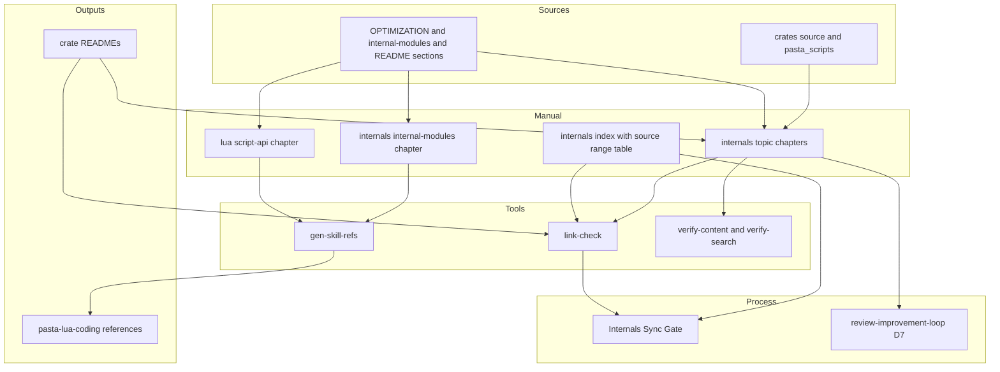
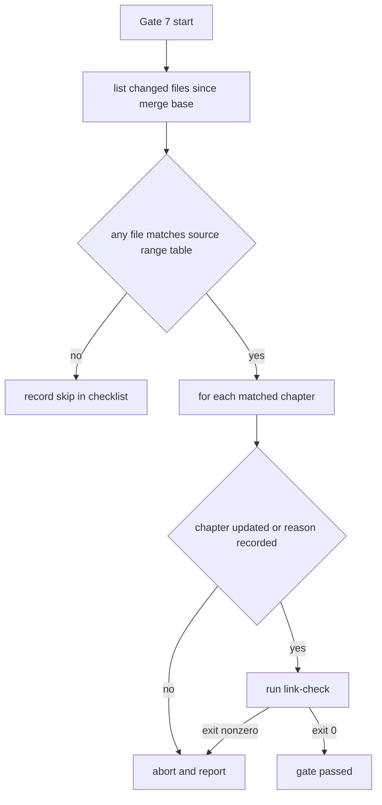
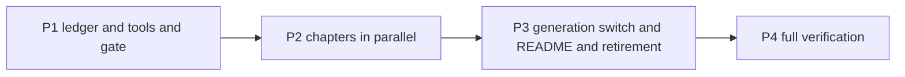

# 設計書: pasta-runtime-internals-doc

## Overview

**Purpose**: 本仕様は、pasta ランタイムの内部設計を一貫して解説する「内部設計（コントリビュータ向け）」パートを既存の mdBook マニュアル末尾に新設し、散在する内部向け記述（`OPTIMIZATION.md`・スキル `internal-modules.md`・クレート README の内部解説）をそこへ集約して権威を一本化する。あわせて、内部設計章が実装と乖離しないよう、spec 完了ゲートと `review-improvement-loop` 次元⑦に照合を組み込む。

**Users**: コントリビュータ（人間と AI エージェント）は変更対象領域の仕組みを把握するために内部設計パートを読む。ゴースト作者は従来どおり利用者向けパートだけを読む（内部設計パートは読まなくてよい）。スキル利用者は、マニュアルから生成された `internal-modules.md`・`script-api.md` を通じて同じ知識を得る。メンテナは完了ゲートと定期総点検で鮮度を保つ。

**Impact**: 実行されるコード・設定・ランタイム挙動は変えない（陳腐化したコメントの修正のみ例外・3.8）。変わるのは、マニュアル（`book/src/` に内部設計パート 10 章と Lua パートの 1 章を追加）、マニュアル検証ツール（`link-check.mjs`・`verify-content.mjs`・`verify-search.mjs`・生成器の対応表）、スキル `pasta-lua-coding`（`internal-modules.md` の生成化と `script-api.md` の追加）、クレート README 4 本、完了ゲート（`workflow.md`・`kiro-complete`）、`review-improvement-loop` の D7 文言、ステアリングの最小追記、旧文書の撤去である。

### Goals

- マニュアル末尾の内部設計パートが、6 題材と pasta.dll ランタイム上のすべての内部機構（2.10）を、現行実装に整合した内容で解説している。
- `OPTIMIZATION.md` が無く、スキル `internal-modules.md` はマニュアルからの生成物であり、クレート README の詳細な内部解説はマニュアルへの絶対 URL リンクに置き換わっている。
- 内部設計章に書いたリポジトリ内パスの実在が機械検査され、完了ゲートと定期総点検に内部設計章の照合が組み込まれている。
- 既存の CI（鮮度チェック・リンク検証・マニュアル検証・`cargo test --all`）がすべて成功したまま、一括で統合される（10.1）。

### Non-Goals

- 既存の利用者向け章の本文改訂（追加する `lua/script-api.md` と、`introduction.md` への 1〜2 文の追記を除く）。
- ランタイムのコード・挙動の変更、実装の不備の修正（記録のみ・3.4）。
- 生成機構・鮮度チェック・リンク検証の新設（既存ツールへの対応表追加と検査の拡張にとどめる）。
- ステアリングの再編、`.kiro/specs/completed/` 配下の歴史的記述の書き換え。
- ランタイム外のツール（`pasta_lsp`・`pasta_check`・`pasta_sample_ghost`）の内部設計（2.11）。

## Boundary Commitments

### This Spec Owns

- **内部設計パート** `book/src/internals/` の全 10 章（概要章・題材章 8 章・生成元章 `internal-modules.md`）と、`SUMMARY.md` のパート見出し・目次行。
- **Lua パートの新章** `book/src/lua/script-api.md`（ゴースト作者が `scripts/` で使うランタイム API の利用者向けリファレンス）と、その目次行。
- **章と対象ソース範囲の対応表**（概要章 `internals/index.md` 内の表）。完了ゲートが照合に使うデータの正。
- **生成対象の追加**: `GENERATION_MAP` への 2 エントリ（`lua/script-api.md`・`internals/internal-modules.md` → `pasta-lua-coding`）と、それに伴う生成物 2 ファイル・`SKILL.md` 区分表。
- **検査の拡張**: `link-check.mjs` の内部設計章パス実在検査（`internals-path`）とクレート README のマニュアル URL 検査（`readme-manual-url`・7.8）、`verify-content.mjs` の内部設計パート検査（I 系・口調検査の対象拡大）、`verify-search.mjs` の索引対象パート追加。
- **Internals Sync Gate**（`workflow.md` DoD の条件付き Gate 7）とその発火（`kiro-complete`）。
- **`review-improvement-loop` の D7 文言**への内部設計章照合の追加（4 ファイルの固定文言のみ）。
- **吸収台帳** `.kiro/specs/completed/pasta-runtime-internals-doc/absorption-ledger.md`（spec 成果物）。
- **旧文書の撤去と参照修正**: `OPTIMIZATION.md` の削除、`SOUL.md`・`TEST_COVERAGE.md` の参照修正、クレート README 4 本の書き換え、ロードマップへの申し送り、ステアリングの最小追記。
- **陳腐化したソースコメントの修正**（3.8。実行されるコードは変えない）。

### Out of Boundary

- 既存の利用者向け章（入門・文法・Lua・デバッグ・リファレンス）の本文。重複や誤りを見つけても本仕様では直さず、吸収台帳とロードマップに記録する。
- 生成器のアルゴリズム（本文抽出・リンク書き換え・ヘッダの構成。ヘッダ内の書名の語だけは 1.9 に合わせて改める）と、スキル自己完結規則（`FORBIDDEN_SKILL_TOKENS`）そのもの。本仕様は対応表に行を足すだけで、規則は変えない。
- 既存 Gate 1〜6（Spec / Test / Doc / Steering / Soul / Manual Sync）の意味・順序（8.5）。
- `review-improvement-loop` の他の次元・反復プロセス・タスクの進捗状態・生成済みセル（`tasks.md` の GENERATED-CELLS 区間）・`matrix.md`（9.3, 9.4）。
- ランタイム外ツールのクレート（`pasta_lsp`・`pasta_check`・`pasta_sample_ghost`）の README とコード。
- `scriptlibs/`（同梱の第三者 Lua ライブラリ）のコメント。
- マニュアル公開基盤（mdBook 版・テーマ・bigram 索引・構文ハイライト・Pages デプロイ）の変更。

### Allowed Dependencies

- 上流 `manual-ssot-authority` の生成機構（`gen-skill-refs.mjs`）・リンク検証（`link-check.mjs` の `LINK_RE`・`maskFences`・`headingSlugs` 等）・Manual Sync Gate。
- 上流 `pasta-user-manual` の mdBook 基盤（mdBook 0.5.3・bigram 索引・構文ハイライト・`manual.yml`）。
- Node.js 20 の標準モジュールのみ（新しい npm 依存を追加しない・1.6）。
- 記述対象として読み取るだけのソース: `crates/pasta_dsl`・`crates/pasta_core`・`crates/pasta_lua`・`crates/pasta_shiori`、ルート `Cargo.toml`・`.cargo/config.toml`、完了済み spec。
- 依存方向: 文書（章）→ 検査ツール → CI／完了ゲート。ツールは章を読むだけで書き換えない（生成器は `references/` のみ書く）。

### Revalidation Triggers

- 内部設計章のファイル名・見出しの変更 → クレート README の URL・`SKILL.md` のリンク・章内アンカーの張り替えが要る（`link-check` が検出）。
- `GENERATION_MAP` の出力名の変更 → `SKILL.md` 区分表・スキル持ち出し先の更新。
- `internals/index.md` の対応表の列構成の変更 → Gate 7 の判定手順（`workflow.md`）の見直し。
- `workflow.md` DoD のゲート番号・構成の変更 → `kiro-complete` の発火手順・完了チェックリストの見直し。
- クレートのディレクトリ再編（`crates/*/src/` 配下の移動・リネーム）→ 内部設計章の該当節と対応表（Gate 7 と `internals-path` 検査が検出）。
- `review-improvement-loop` の D7 構成の変更 → 内部設計章照合の記述位置の見直し。

## Architecture

### Existing Architecture Analysis

- マニュアル `book/src/` は 5 パート＋「はじめに」。`SUMMARY.md` 由来で全章が HTML 化され、`verify-static.mjs` が目次・前後ナビゲーションを、`highlight-html.mjs` が出力 HTML 全体の `pasta` ブロック着色を、`build-index.mjs` が mdBook の検索索引全体の bigram 再生成を行う。いずれも章の追加で自動的に新パートへ適用される（1.4。設計時に各ツールの走査対象を確認済み）。
- `gen-skill-refs.mjs` の出力名は章のベース名（`index.md` のみ親ディレクトリ名付き）。章を `internals/internal-modules.md` とすれば出力名は現行と同じ `internal-modules.md` になり、生成器のコード変更は要らない。
- `link-check.mjs` は (a) book 内相対 `.md`、(b) このリポジトリを指す GitHub blob/tree URL のローカル実在、(c) 2 スキルの自己完結を検査する。インラインコードとして書かれたリポジトリ内パスは検査しない。
- `verify-content.mjs` の口調検査（D-voice）は列挙ディレクトリの章について「散文部に口調がある」ことだけを見る。本文に口調が無いことと区切り構造は、生成対象章についてのみ生成器（`extractBody`）が検査する。
- 完了ゲートは `workflow.md` が権威、`kiro-complete` が発火のみ。Manual Sync Gate（条件付き Gate 6）が前例。
- `review-improvement-loop` は反復 spec で、D7 の定義が brief・requirements・design・tasks に固定文言として散在する。

### Architecture Pattern & Boundary Map



**Architecture Integration**:
- 採用パターン: 既存基盤の拡張（ギャップ分析の Option C）。基盤側は対応表・検査関数・ゲート条項の追加のみ、内容は題材ごとの独立章として新規執筆する。
- 責務分離: 「事実の権威」（章）／「検査」（ツール）／「判定ルール」（`workflow.md`）／「発火」（`kiro-complete`）／「対応表データ」（概要章）を分ける。1 つの事実は 1 つの章だけに書く（後述「章の責務分担」）。
- 維持する既存パターン: マニュアル権威＋スキル生成、生成物の手編集禁止、スキル自己完結、条件付きゲートの追加方式、Claudia ボイスの章構造。
- 新規要素の必要性: 内部設計章のソースパスはインラインコードで書くのが自然だが既存検査の対象外なので、`internals-path` 検査が要る（3.7）。README は CI のリンク検証対象外なので、`readme-manual-url` 検査が要る（7.8）。
- ステアリング準拠: 追加エコシステム依存なし（Node 標準のみ）、`workflow.md` を判定ルールの権威とする関係の維持、`structure.md` の `book/` 位置づけの踏襲。

### Dependency Direction

`ソースコード（読み取りのみ）` → `章（book/src）` → `検査ツール（book/tools。章を読むだけ）` → `CI（manual.yml）／完了ゲート（workflow.md → kiro-complete）`。生成物（`references/`）は生成器だけが書き、章は生成物を参照しない。`link-check.mjs` は `gen-skill-refs.mjs` を import しない（既存の逆方向 import を維持）。新しい検査関数は `link-check.mjs` 内に置き、`MANUAL_BASE_URL` は文字列定数として `link-check.mjs` 側に持つ（後述）。

### Technology Stack

| Layer | Choice / Version | Role in Feature | Notes |
|-------|------------------|-----------------|-------|
| 文書 | mdBook 0.5.3（既存） | 内部設計パートの静的サイト化 | 変更なし |
| 検査ツール | Node.js 20 標準モジュール（既存） | パス実在・README URL・章構造・口調の検査 | 新規 npm 依存なし（1.6） |
| CI | GitHub Actions `manual.yml`（既存） | 検査の実行と Pages 公開 | `paths` に `crates/*/README.md` を追加（7.8） |
| プロセス | `workflow.md` DoD・`kiro-complete` スキル（既存） | 完了時の追従確認 | 条件付き Gate 7 を追加 |

## File Structure Plan

### Directory Structure

```
book/src/
├── SUMMARY.md                       # 末尾に「内部設計（コントリビュータ向け）」パートを追加、Lua パートに script-api 行を追加
├── lua/
│   └── script-api.md                # 新規・生成対象: ACT/WORD/GLOBAL/SAVE の利用者向けリファレンス（6.2）
└── internals/                       # 新規パート（全章 Claudia ボイス・普通文体の本体）
    ├── index.md                     # 概要: 読者・全体像・章構成・対象外・利用者章との関係・章と対象ソース範囲の対応表
    ├── transpiler.md                # トランスパイルパイプライン（パース→登録と生成→最適化・キャッシュ・段階構成の定義）
    ├── registry-search.md           # シーン/単語レジストリとシーン検索（Rust 側の辞書確定を含む）
    ├── execution-model.md           # ランタイム実行モデル（コルーチン・co_scene・VM 構築・永続化）
    ├── internal-modules.md          # 新規・生成対象: Lua ランタイム内部モジュール（リポジトリ内パスを書かない）
    ├── loader.md                    # ローダ自己展開・モジュール解決・設定読込
    ├── shiori.md                    # SHIORI 層（FFI・アクター・非同期トーク・presentation・イベント配送・DLL ビルド構成）
    ├── talk-output.md               # トーク出力（さくらスクリプト組立・後処理・アピアランス）
    ├── debug.md                     # デバッグ基盤とシーンキック
    └── logging-encoding.md          # ロギングとエンコーディング

.claude/skills/pasta-lua-coding/references/
├── internal-modules.md              # 手書き → 生成物に置換（internals/internal-modules.md から）
└── script-api.md                    # 新規生成物（lua/script-api.md から）

.kiro/specs/completed/pasta-runtime-internals-doc/
└── absorption-ledger.md             # 新規 spec 成果物: 吸収元の各節 → 収録先／存置／除外（理由）＋実装照合位置
```

> 題材章 8 章は共通の H2 構成（後述「題材章の章構造」）を持つ。章ごとの差分は「VerifyContent」の対象一覧と「章ごとの内容契約」表に集約する。

### Modified Files

- `book/book.toml` — `title` を「pasta マニュアル」、`description` を利用者とコントリビュータの双方を含む表現へ変更（1.9）。
- `book/src/introduction.md` — 「このマニュアルの歩き方」の後に、内部設計パートの存在とゴースト作者は読む必要がない旨を 1〜2 文（リンクなし）で追記（1.9）。
- `book/AUTHORING.md` — 冒頭コメントの対象章に `internals` を追加、第 6 節「内部設計パートの執筆規約」を新設、執筆チェックリストに項目を追加。
- `book/tools/gen-skill-refs.mjs` — `GENERATION_MAP` 末尾に 2 エントリ追加（21 → 23）、冒頭コメントの件数更新。生成ヘッダの書名を「pasta 利用者マニュアル」から「pasta マニュアル」へ改め、全 23 ファイルを再生成する（1.9）。
- `book/tools/gen-skill-refs-test.mjs` — `EXPECTED_MAP` に 2 行追加、件数検査を 23 に、ヘッダの期待文言を「pasta マニュアル」に、`HANDWRITTEN` から `internal-modules.md` を削除。
- `book/tools/link-check.mjs` — `checkInternalsPaths`・`checkReadmeManualLinks` を追加し `runLinkCheck`・`reportLinkCheck` に結線。
- `book/tools/link-check-test.mjs` — 2 検査のサンドボックス・ケースを追加。
- `book/tools/verify-content.mjs` — D-voice の走査ディレクトリに `internals` を追加、I 系検査（存在・本文・構造・必須見出し・機構網羅）を追加。
- `book/tools/verify-search.mjs` — 索引に含まれるべきセクションに `internals` を追加。
- `.github/workflows/manual.yml` — `push`・`pull_request` の `paths` に `crates/*/README.md` を追加（7.8）。
- `.claude/skills/pasta-lua-coding/SKILL.md` — 区分表の `internal-modules.md` を「生成（マニュアルから）」に改め、`script-api.md` 行を追加、§5 の暫定注記を書き換え、`metadata.version` をバンプ（6.7）。
- `.kiro/steering/workflow.md` — DoD に「7. Internals Sync Gate（条件付き）」を追加（8.1–8.8）。
- `.claude/skills/kiro-complete/SKILL.md` — ステップ 1 に Gate 7 の発火項目を追加、完了チェックリストに 1 行追加（8.6）。
- `.kiro/specs/review-improvement-loop/{brief,requirements,design,tasks}.md` — D7 の固定文言に内部設計章照合を追加（9.1–9.4）。
- `.kiro/steering/roadmap.md` — 最適化の将来候補（5.3）と、執筆中に判明したバグ候補（3.4）の申し送り小節を追加。
- `.kiro/steering/tech.md` — 設計哲学表「2パス変換」行に段階構成の権威（トランスパイル章の URL）を追記、マニュアル節に内部設計パートの 1 行を追記。
- `.kiro/steering/structure.md` — `book/` の説明とディレクトリ表に内部設計パートを追記。
- `SOUL.md`（L33・L478）・`TEST_COVERAGE.md`（L203・L295） — `OPTIMIZATION.md` 参照をトランスパイル章の URL へ置換（5.5）。
- `OPTIMIZATION.md` — 削除（スタブなし・5.4）。
- `crates/pasta_lua/README.md`・`crates/pasta_shiori/README.md`・`crates/pasta_core/README.md`・`crates/pasta_dsl/README.md` — 内部解説と利用者向け重複を概要数行＋絶対 URL リンクへ置換（7.2–7.6）。
- 陳腐化したソースコメントを含むファイル（既知の候補: `crates/pasta_lua/src/lib.rs` 冒頭、`crates/pasta_core/src/lib.rs`・`registry/{mod,scene_registry,word_registry}.rs` の「Pass 1」表記、`crates/pasta_shiori/src/actor/{mod,mailbox}.rs` と `crates/pasta_shiori/Cargo.toml` の `actor_poc` 言及、`crates/pasta_lua/src/code_gen/scope_gen.rs` の旧生成形）— コメントのみ修正（3.8）。確定リストは執筆時に吸収台帳へ記録する。

## System Flows

### 完了時の追従確認（Internals Sync Gate）



- 変更ファイルの一覧は、`kiro-complete` が解決済みの `{default-branch}` を使い `git diff --name-only --no-renames $(git merge-base HEAD {default-branch})`（作業ツリーとの差分）と `git ls-files --others --exclude-standard`（未追跡）の和とする（ステップ 1 はステップ 2 のコミットより前に走るため）。
- 照合規則: 対応表の各セルの値が `/` で終わるならパス接頭辞一致、それ以外は完全一致。1 ファイルが複数の章に一致したら、一致したすべての章を確認対象にする（過剰発火は「更新不要の理由」の記録で解消できるため安全側に倒す）。
- 章を更新した場合は `book/` に触れるので、既存の Manual Sync Gate（Gate 6）が鮮度チェックとリンク検証を要求する（8.7）。Gate 7 自身も、章の更新の有無にかかわらず `link-check.mjs`（`internals-path` を含む）を実行する（8.8）。

### 生成とリンク書き換え（既存フローへの追加分のみ）

`internals/internal-modules.md` と `lua/script-api.md` は既存の生成フロー（本文抽出 → リンク書き換え → ヘッダ付与 → 書き出し／照合）にそのまま乗る。`internal-modules.md` から題材章へのリンク（例: `execution-model.md#ソースの所在`）は生成時に `https://ekicyou.github.io/pasta/internals/execution-model.html#ソースの所在` へ書き換わり、`../lua/script-api.md` へのリンクは同じスキルの生成対象なので兄弟ファイル名 `script-api.md` へ書き換わる（3.6）。

## Requirements Traceability

| Requirement | Summary | Components | Interfaces | Flows |
|-------------|---------|------------|------------|-------|
| 1.1 | 最終パートとして内部設計パート | ManualStructure | `SUMMARY.md` | — |
| 1.2 | 読者の明示 | InternalsChapters（index） | 概要章「この章の読者」節・I-fact | — |
| 1.3 | 既存パートの章順不変 | ManualStructure | `SUMMARY.md`（末尾追加・Lua パートは追加のみ） | — |
| 1.4 | 同じ静的サイト・検索・ハイライト・ナビ | ManualStructure, VerifyContent | verify-static・verify-search（`internals` 追加）・highlight | CI |
| 1.5 | 相対リンク切れの検出 | LinkCheck | 既存 `detectBrokenLinks`（book/src 全体） | CI |
| 1.6 | 新エコシステム依存なし | 全ツール | Node 標準のみ | — |
| 1.7 | 利用者章と同じ文体 | InternalsChapters, AuthoringRules | AUTHORING.md 第 6 節 | — |
| 1.8 | 口調検査の対象化 | VerifyContent | D-voice（`internals`）・I-structure（`extractBody`） | CI |
| 1.9 | 書名・説明・はじめに章 | ManualStructure | `book.toml`・`introduction.md` | — |
| 2.1 | トランスパイル章と段階構成の定義 | InternalsChapters（transpiler） | 章ごとの内容契約 | — |
| 2.2 | レジストリと検索の章 | InternalsChapters（registry-search） | 同上 | — |
| 2.3 | 実行モデルの章 | InternalsChapters（execution-model, internal-modules） | 同上 | — |
| 2.4 | ローダの章 | InternalsChapters（loader） | 同上 | — |
| 2.5 | SHIORI 層の章 | InternalsChapters（shiori） | 同上 | — |
| 2.6 | デバッグの章 | InternalsChapters（debug） | 同上 | — |
| 2.7 | 各題材の必須記述項目 | InternalsChapters, VerifyContent | 題材章の章構造・I-sections | CI |
| 2.8 | 境界の受け渡し | InternalsChapters | 「境界の受け渡し」節 | — |
| 2.9 | 経緯としての完了 spec | InternalsChapters | 「経緯」節（GitHub tree URL・既存 (b) 検査） | CI |
| 2.10 | ランタイム内部機構の網羅 | InternalsChapters, VerifyContent | 機構の割り振り表・I-fact | CI |
| 2.11 | ツール類の対象外明示 | InternalsChapters（index） | 概要章「対象外」節・I-fact | CI |
| 3.1 | 現行実装を正とする | ContentAuthoring, AbsorptionLedger | 照合手順・台帳の照合列 | — |
| 3.2 | 実在しないものを書かない | ContentAuthoring, LinkCheck | `internals-path`・レビュー | CI |
| 3.3 | 将来構想を書かない | ContentAuthoring, FutureRouting | 執筆規約・ロードマップ | — |
| 3.4 | 不備は記録のみ | FutureRouting | ロードマップ「バグ候補」小節 | — |
| 3.5 | ソースの所在を実在パスで | InternalsChapters | 「ソースの所在」節（インラインコード） | — |
| 3.6 | 生成元章はパスを書かずリンク | InternalsChapters（internal-modules） | 題材章アンカーへのリンク | 生成 |
| 3.7 | パス実在検査 | LinkCheck | `checkInternalsPaths` | CI・Gate 7 |
| 3.8 | 陳腐化コメントの修正 | CommentFix | コメントのみの差分・`cargo test --all` | — |
| 4.1 | 利用者章の事実を再記述しない | ContentAuthoring | 章の責務分担・リンク規則 | — |
| 4.2 | 起動シーケンスは startup を権威に | InternalsChapters（loader） | リンク規則 | — |
| 4.3 | 既存利用者章を改訂しない | ManualStructure | Modified Files の限定 | — |
| 4.4 | 観測可能な挙動は利用者章が正 | InternalsChapters（index） | 概要章「利用者向け章との関係」節 | — |
| 5.1 | 最適化の収録 | InternalsChapters（transpiler, shiori） | 吸収台帳 | — |
| 5.2 | 旧記述の誤りを引き継がない | AbsorptionLedger | 既知の食い違い表 | — |
| 5.3 | 将来候補をロードマップへ | FutureRouting | `roadmap.md` 小節 | — |
| 5.4 | `OPTIMIZATION.md` の削除 | Retirement | ファイル削除 | — |
| 5.5 | 参照元の修正 | Retirement | `SOUL.md`・`TEST_COVERAGE.md` ほか grep | — |
| 6.1 | 純内部事項の収録 | InternalsChapters（internal-modules） | 分割表 | — |
| 6.2 | 利用者 API 章の新設 | ScriptApiChapter | 分割表 | — |
| 6.3 | 利用者章規約・重複回避 | ScriptApiChapter | リンク規則 | — |
| 6.4 | 両ファイルの生成 | GenMapEntries | `GENERATION_MAP` +2 | 生成 |
| 6.5 | 生成の明示 | GenMapEntries | 既存ヘッダ（書名の語のみ変更） | 生成 |
| 6.6 | 自己完結 | GenMapEntries, LinkCheck | 既存 `checkSkillSelfContained` | CI |
| 6.7 | 区分表の更新 | SkillLayout | `SKILL.md` | — |
| 6.8 | 鮮度チェック対象 | GenMapEntries | 既存 `--check` | CI |
| 6.9 | 手編集の検出 | GenMapEntries | 既存 `--check` | CI |
| 6.10 | 手書きの規範記述を残さない | SkillLayout | 区分表・§5 | — |
| 7.1 | README 内部解説の収録 | ReadmeMigration, AbsorptionLedger | README 節の処置表 | — |
| 7.2 | README から本文を除き URL で案内 | ReadmeMigration | 同上 | — |
| 7.3 | crates.io の顔を保つ | ReadmeMigration | 存置する節の規則 | — |
| 7.4 | 概要数行に限る | ReadmeMigration | 同上 | — |
| 7.5 | 相対パスで案内しない | ReadmeMigration, LinkCheck | 絶対 URL・`readme-manual-url` | CI |
| 7.8 | README のマニュアル URL 実在検査 | LinkCheck | `checkReadmeManualLinks`・`manual.yml` の `paths` | CI |
| 7.6 | 利用者向け重複のリンク化 | ReadmeMigration | README 節の処置表 | — |
| 7.7 | 対応章の無い利用者向け記述 | ReadmeMigration, AbsorptionLedger | 存置規則 | — |
| 8.1 | DoD の確認項目 | CompletionGate | Gate 7 条項 | Gate 7 |
| 8.2 | 機械的に照合できる対象領域 | InternalsChapters（index）, CompletionGate | 対応表＋照合規則 | Gate 7 |
| 8.3 | 非該当時のスキップ記録 | CompletionGate | Gate 7 条項・チェックリスト | Gate 7 |
| 8.4 | 未更新・無理由で中断 | CompletionGate | Gate 7 条項 | Gate 7 |
| 8.5 | 既存ゲート不変 | CompletionGate | 追加のみ | — |
| 8.6 | 権威は workflow.md | CompletionGate | `kiro-complete` は発火のみ | — |
| 8.7 | Manual Sync Gate 通過 | CompletionGate | Gate 6 の既存条件で発火 | Gate 7 |
| 8.8 | パス実在検査の実行 | CompletionGate, LinkCheck | Gate 7 で `link-check.mjs` | Gate 7 |
| 9.1 | D7 に照合を追加 | LoopD7 | 4 ファイルの文言 | — |
| 9.2 | 章ごとの照合結果の記録 | LoopD7 | 横断 D7 セル → `matrix.md` | — |
| 9.3 | 他の次元を変えない | LoopD7 | 文言の追加のみ | — |
| 9.4 | 実行状態をリセットしない | LoopD7 | チェックボックス・生成セル不変 | — |
| 10.1 | 一括統合 | （Migration Strategy 節） | 1 ブランチ・1 PR の squash マージ | — |
| 10.2 | 手書きの写しを残さない | Retirement, SkillLayout, ReadmeMigration | 台帳の全行完了 | — |
| 10.3 | 挙動不変 | CommentFix | コメントのみ・`cargo test --all` | — |
| 10.4 | 既存検査の成功 | 全ツール | CI 全段 | CI |
| 10.5 | 公開できる | ManualStructure | `manual.yml` | CI |
| 10.6 | 収録できない内容の扱い | AbsorptionLedger | 除外理由列 | — |

## Components and Interfaces

| Component | Domain/Layer | Intent | Req Coverage | Key Dependencies | Contracts |
|-----------|--------------|--------|--------------|------------------|-----------|
| ManualStructure | 文書 | パート・目次・書名・はじめに章 | 1.1, 1.3, 1.4, 1.9, 4.3, 10.5 | mdBook (P0) | State |
| InternalsChapters | 文書 | 内部設計 10 章の内容契約 | 1.2, 1.7, 2.1–2.11, 3.5, 3.6, 4.2, 4.4, 5.1, 6.1, 8.2 | ソースコード (P0) | State |
| ScriptApiChapter | 文書 | 利用者向けランタイム API 章 | 6.2, 6.3 | 既存 Lua 章 (P1) | State |
| AuthoringRules | 文書 | 内部設計パートの執筆規約 | 1.7, 3.3, 3.5, 3.6, 4.1 | AUTHORING.md (P1) | — |
| GenMapEntries | ツール | 生成対象 2 章の追加 | 6.4–6.6, 6.8, 6.9 | gen-skill-refs (P0) | Batch |
| LinkCheck | ツール | パス実在と README URL の検査 | 1.5, 3.2, 3.7, 7.5, 7.8, 8.8 | link-check (P0) | Service, Batch |
| VerifyContent | ツール | 内部設計パートの構造・口調・網羅検査 | 1.4, 1.8, 2.7, 2.10, 2.11 | verify-content, gen-skill-refs (P0) | Batch |
| SkillLayout | スキル | `SKILL.md` 区分表 | 6.7, 6.10, 10.2 | link-check (P1) | — |
| CompletionGate | プロセス | Gate 7 の規則と発火 | 8.1–8.8 | workflow.md, kiro-complete (P0) | Batch |
| LoopD7 | プロセス | 定期総点検への照合追加 | 9.1–9.4 | review-improvement-loop (P1) | — |
| AbsorptionLedger | spec 成果物 | 吸収元の全節の行き先と照合 | 3.1, 5.1, 5.2, 7.1, 7.7, 10.2, 10.6 | 吸収元 (P0) | State |
| ReadmeMigration | 文書 | README の書き換え | 7.1–7.7 | 内部設計章 (P0) | — |
| Retirement / FutureRouting | 文書 | 旧文書の撤去・申し送り | 3.3, 3.4, 5.3–5.5, 10.2 | roadmap.md (P1) | — |
| CommentFix | コード（コメントのみ） | 陳腐化コメントの修正 | 3.8, 10.3 | cargo test (P0) | — |

### 文書層

#### ManualStructure

| Field | Detail |
|-------|--------|
| Intent | 内部設計パートを目次末尾に置き、書名・はじめに章を両読者向けにする |
| Requirements | 1.1, 1.3, 1.4, 1.9, 4.3, 10.5 |

**Responsibilities & Constraints**
- `SUMMARY.md` の末尾（「リファレンス」パートの後）に次を追加する。既存パートの行は動かさない（1.3）。
  ```markdown
  # 内部設計（コントリビュータ向け）

  - [内部設計の概要](internals/index.md)
    - [トランスパイルパイプライン](internals/transpiler.md)
    - [シーン・単語レジストリとシーン検索](internals/registry-search.md)
    - [ランタイム実行モデル](internals/execution-model.md)
    - [Lua ランタイム内部モジュール](internals/internal-modules.md)
    - [ローダ自己展開とモジュール解決](internals/loader.md)
    - [SHIORI 層](internals/shiori.md)
    - [トーク出力とアピアランス](internals/talk-output.md)
    - [デバッグ基盤とシーンキック](internals/debug.md)
    - [ロギングとエンコーディング](internals/logging-encoding.md)
  ```
- Lua パートには `[スクリプト用ランタイム API](lua/script-api.md)` を `lua/shiori-events.md` の直後（`lua/patterns.md` の前）に追加する。既存章の相対順序は変えない（1.3・4.3 の例外）。
- `book.toml`: `title = "pasta マニュアル"`、`description = "ゴースト作者向けの Pasta DSL 文法・Lua API・入門チュートリアルと、コントリビュータ向けのランタイム内部設計をまとめた pasta のマニュアル"`。
- `introduction.md`: 「このマニュアルの歩き方」の箇条書きの後に普通文体で 1〜2 文を追記する（例:「目次末尾の『内部設計（コントリビュータ向け）』パートは pasta 本体のコードを読み・直す開発者向けの解説である。ゴーストを作るだけなら読む必要はない。」）。リンクは張らない（利用者向け章から内部設計章への逆リンクを追加しない・1.9）。
- 生成ファイルのヘッダ文言は、書名の変更に合わせて「pasta マニュアル「…」から自動生成」に改める（書名の語のみ。ヘッダの構成は変えない）。内部設計章から生成される `internal-modules.md` が「利用者マニュアル」を名乗る不整合を避けるためである。既存 21 ファイルを含む全 23 ファイルを再生成し、鮮度チェックを通す。書名を引用する他の文書（ルート `README.md`・ステアリング等の「利用者マニュアル」という呼称）は 1.9 の範囲外であり変えない。

**Implementation Notes**
- Validation: `verify-static.mjs`（SUMMARY 由来の全章・目次・前後ナビ）、`verify-search.mjs`（`internals` セクションの索引入り）、`highlight-html.mjs`（出力 HTML 全体を走査）が自動で新パートを対象にする（1.4）。
- Risks: `book.toml` の書名は他ツールから参照されていない（設計時に `book/tools/*.mjs` を確認済み）。

#### InternalsChapters

| Field | Detail |
|-------|--------|
| Intent | 内部設計 10 章の責務・必須記述・ソース範囲を定め、事実の重複を防ぐ |
| Requirements | 1.2, 1.7, 2.1–2.11, 3.5, 3.6, 4.2, 4.4, 5.1, 6.1, 8.2 |

**Responsibilities & Constraints**

*共通の章構造（全 10 章）*
- 先頭行は H1。Claudia 口調の導入 → `---` → 普通文体の本体 → `---` → Claudia 口調の締め（1.7）。本体の散文には口調マーカーを置かない（生成対象でない章にも同じ規則を課し、I-structure で検査する・1.8）。

*題材章の章構造（`index.md`・`internal-modules.md` を除く 8 章）*
- 本体に次の H2 をこの順で持つ（2.7, 2.8, 2.9。I-sections で検査）。
  1. `## 目的と責務`
  2. `## 構成要素`（図は Mermaid ではなく `text` フェンスの図か表で書く。mdBook に Mermaid プラグインを入れない・1.6）
  3. `## 処理とデータの流れ`
  4. `## 境界の受け渡し`（クレート間・Rust/Lua 間で「誰が何を所有し何を渡すか」。境界をまたがない章では「この題材は単一クレート内で完結する」と 1 文書く・2.8）
  5. `## 不変条件と制約`
  6. `## ソースの所在`（インラインコードのリポジトリルート相対パスの箇条書き・3.5）
  7. `## 経緯`（設計を確立した完了 spec を `https://github.com/ekicyou/pasta/tree/main/.kiro/specs/completed/<name>` で列挙。本文は spec を読まなくても理解できる形で書く・2.9）

*ソースパスの表記規則（3.5, 3.7）*
- リポジトリ内パスはリポジトリルートからの相対パスをインラインコードで書く（例: `crates/pasta_lua/src/loader/extract.rs`）。ディレクトリは末尾 `/`。行番号・`#L` アンカー・ワイルドカード・クレート相対の短縮形（`src/...`・`pasta_scripts/...` 単独）は書かない。
- 接頭辞 `crates/`・`book/`・`.github/`・`.cargo/`・`.kiro/`・`.claude/` で始まるインラインコードは `internals-path` 検査の対象になり、実在しなければ失敗する。ゴーストディレクトリ内のパス（`scripts/`・`profile/pasta/cache/` 等）はこれらの接頭辞を持たないので検査対象外であり、そのまま書いてよい。
- ルート直下のファイル（`Cargo.toml` 等）は GitHub blob URL のリンクで書く（既存の (b) 検査が実在を確認する）。

*章の責務分担（1 事実 1 章・Category B「題材章どうしの重複の線引き」の解決）*
- **題材章**: 仕組み・処理の流れ・Rust 側の実装・境界の受け渡し・不変条件。Lua モジュールを扱うときは、モジュール間の関係と処理の流れまでを書き、個々のフィールド・関数・データ構造は `internal-modules.md` の該当見出しへリンクする。
- **`internal-modules.md`**: Lua ランタイム内部モジュールのモジュール単位のリファレンス（フィールド・関数・データ構造・内部パターン）。仕組み全体の説明は題材章へリンクする。
- **`lua/script-api.md`**: ゴースト作者が `scripts/` から呼ぶ API の利用者向けリファレンス。内部の仕組みには触れない（内部設計章への逆リンクも張らない）。
- **既存の利用者向け章**: 文法・公開 Lua API・`pasta.toml`・起動シーケンスとモジュール解決の利用者向け挙動・デバッグ操作の権威（4.1）。内部設計章は再記述せずリンクする。`reference/startup.md` が書く挙動は、内部章では「その挙動を実現する仕組み」だけを書く（4.2）。

*`internal-modules.md`（生成対象・3.6, 6.1）*
- リポジトリ内パス・`crates/` を含む URL（GitHub の URL を含む）を本文・フェンス・HTML コメントのどこにも書かない。Lua モジュールはモジュール名（`pasta.store` 等）で示す。
- ソースの所在は「この章が扱うモジュールのソースの所在は [ランタイム実行モデル](execution-model.md#ソースの所在) を参照」の形で題材章のアンカーへリンクする（生成時に公開 URL へ書き換わる）。
- 収録内容は下表「`internal-modules.md` の分割」の「内部設計パート」列。

*`index.md`（概要章）の必須節*
- `## この章の読者`: 対象読者はコントリビュータ（実装理解者）であり、ゴースト作成には読む必要がないこと（1.2）。
- `## 全体像`: クレート構成とデータの流れ（パース → トランスパイル → ローダ → VM 実行 → SHIORI 応答）を 1 枚の図と短い説明で示し、各章へ案内する。
- `## 利用者向け章との関係`: 利用者から観測できる挙動は利用者向け章が正であること（4.4）と、リンク規則の要約。
- `## 対象外`: `pasta_lsp`・`pasta_check`・`pasta_sample_ghost` はランタイム外のツールであり本パートの対象外であること（2.11）。
- `## 章と対象ソース範囲`: 下表の対応表（8.2）。セルはインラインコードのパスなので `internals-path` 検査の対象になり、ソースの移動・リネームで黙って腐らない。

*章と対象ソース範囲（`index.md` に置く対応表の初期内容。完了ゲートの照合データ）*

| 章 | 対象ソース範囲 |
|----|----------------|
| `transpiler.md` | `crates/pasta_dsl/src/`、`crates/pasta_lua/src/transpiler.rs`、`crates/pasta_lua/src/code_gen/`、`crates/pasta_lua/src/context.rs`、`crates/pasta_lua/src/normalize.rs`、`crates/pasta_lua/src/string_literalizer.rs`、`crates/pasta_lua/src/config.rs`、`crates/pasta_lua/src/loader/cache.rs` |
| `registry-search.md` | `crates/pasta_core/src/`、`crates/pasta_lua/src/search/`、`crates/pasta_lua/src/runtime/finalize.rs`、`crates/pasta_lua/pasta_scripts/pasta/scene.lua`、`crates/pasta_lua/pasta_scripts/pasta/word.lua` |
| `execution-model.md` | `crates/pasta_lua/src/runtime/`、`crates/pasta_lua/pasta_scripts/pasta/`、`crates/pasta_lua/pasta_scripts/ct.lua` |
| `internal-modules.md` | `crates/pasta_lua/pasta_scripts/pasta/store.lua`、`crates/pasta_lua/pasta_scripts/pasta/act.lua`、`crates/pasta_lua/pasta_scripts/pasta/scene.lua`、`crates/pasta_lua/pasta_scripts/pasta/word.lua`、`crates/pasta_lua/pasta_scripts/pasta/global.lua`、`crates/pasta_lua/pasta_scripts/pasta/save.lua`、`crates/pasta_lua/pasta_scripts/pasta/buf.lua`、`crates/pasta_lua/pasta_scripts/pasta/lua_version.lua` |
| `loader.md` | `crates/pasta_lua/src/loader/`、`crates/pasta_lua/build.rs`、`crates/pasta_lua/build_zip.rs`、`crates/pasta_lua/src/runtime/searcher.rs`、`crates/pasta_lua/src/runtime/runtime_config.rs`、`crates/pasta_lua/pasta_scripts/main.lua`、`crates/pasta_lua/pasta_scripts/pasta/config.lua` |
| `shiori.md` | `crates/pasta_shiori/src/`、`crates/pasta_shiori/build.rs`、`crates/pasta_lua/src/presentation/`、`crates/pasta_lua/src/runtime/renderer_injection.rs`、`crates/pasta_lua/pasta_scripts/pasta/shiori/`、`.cargo/config.toml` |
| `talk-output.md` | `crates/pasta_lua/src/sakura_script/`、`crates/pasta_lua/pasta_scripts/pasta/shiori/sakura_builder.lua`、`crates/pasta_lua/pasta_scripts/pasta/shiori/appearance.lua`、`crates/pasta_lua/pasta_scripts/pasta/shiori/act.lua` |
| `debug.md` | `crates/pasta_lua/src/debug/`、`crates/pasta_lua/src/loader/source_map_build.rs`、`crates/pasta_lua/src/code_gen/source_map.rs`、`crates/pasta_lua/pasta_scripts/pasta/shiori/event/kick.lua` |
| `logging-encoding.md` | `crates/pasta_lua/src/logging/`、`crates/pasta_lua/src/encoding/`、`crates/pasta_lua/src/runtime/log.rs`、`crates/pasta_lua/src/runtime/enc.rs` |

- 接頭辞の重なり（例: `crates/pasta_lua/src/runtime/` と `runtime/finalize.rs`）は意図的であり、照合規則により一致した全章が確認対象になる。ルート `Cargo.toml` の `[profile.release]` は `shiori.md` が扱うが、依存更新のたびに発火させないため対応表には載せない（`shiori.md` の「ソースの所在」には blob URL で書く）。
- 執筆時に対応表と各章の「ソースの所在」が食い違わないよう、両者は同じ執筆タスクで更新する。整合は定期総点検（LoopD7）でも確認する。

*章ごとの内容契約（必須の扱い事項と吸収元。内容は実装時にコードと照合して確定する）*

| 章 | 必須の扱い事項 | 主な吸収元 |
|----|----------------|------------|
| `transpiler.md` | pest 文法と AST、正規化、`TranspileContext` とレジストリへの登録、コード生成（`element_gen`・`scope_gen`）、出力の正規化、**段階構成の定義**（後述）、生成時最適化（末尾呼び出し・継続行の話者引継ぎ・文字列リテラル）、トランスパイル結果キャッシュ、ソースマップ生成側の出入口（詳細は `debug.md` へ） | `OPTIMIZATION.md` §1–4・§7、`pasta_dsl` README Architecture、`pasta_lua` README のトランスパイラ関連 |
| `registry-search.md` | シーン・単語レジストリ、RadixMap による前方一致、重複時の選択と乱数、ローカル優先の検索順、実行時の辞書確定（Rust 側 `finalize`）と Lua 側収集の受け渡し、`@pasta_search` の内部 | `pasta_core` README アーキテクチャ・ディレクトリ構成 |
| `execution-model.md` | Lua VM の構築とモジュール登録、イベント→シーンのコルーチン実行（`co_scene`・resume ループ・継続トークン）、ACT・STORE・SCENE・WORD・GLOBAL・SAVE の関係図（詳細は `internal-modules.md`）、永続化（`@pasta_persistence` の実装と保存タイミング）、CT（クリーンアップ） | `internal-modules.md` の関係記述、`pasta_lua` README アーキテクチャ |
| `internal-modules.md` | 下表「分割」の内部設計パート列 | `internal-modules.md`（スキル） |
| `loader.md` | 起動シーケンスの実装（Phase 構成）、埋め込み zip とフレームワークスクリプトの自己展開・版比較（md5 マーカー・準アトミック展開）、ファイル検出とモジュール名生成の実装、モジュール検索（`searcher`）と `require` 解決、設定読込（`pasta.toml` の読込・既定値の補完の仕組み） | `pasta_lua` README のソースモジュール構成・ファイル検出・モジュール名の生成（内部部分） |
| `shiori.md` | FFI 境界（エクスポート・`catch_unwind`・HGLOBAL）、リクエスト解析と Lua への受け渡し、アクターランタイム（mailbox・スレッド・CH marshaling・lifecycle・teardown）、非同期トーク、presentation event stream と renderer 注入、SHIORI エントリとイベント配送（`EVENT.fire`・登録・コールバック）、**仮想イベントディスパッチャ（OnTalk/OnHour・トーク頻度）**、DLL ビルド構成（リリースプロファイル・静的 CRT） | `OPTIMIZATION.md` §6、`pasta_shiori` README アーキテクチャ・ディレクトリ構成・プロトコルフロー・FFI 境界の安全性、`pasta_lua` README の SHIORI 統合（内部部分） |
| `talk-output.md` | ACT のトークからさくらスクリプトへの組立（`sakura_builder`・グループ化トークン）、**さくらスクリプト後処理（トークナイザ・ウェイト挿入・budoux 改行）**、**アピアランス（サーフェス・着せ替え復旧・スポット）** | `pasta_lua` README の `sakura_builder`（内部部分） |
| `debug.md` | DAP バックエンド（codec・resolver・pending）、デバッグ通信（transport・loopback 固定・opt-in）、セッション（ステップ・停止ループ・アンカー）、wiring、ソースマップ（生成・サイドカー・解決）、ブレークポイント・inspect・hook、シーンキック（`ActorMsg::Kick`・`kick.lua`・playscene） | — |
| `logging-encoding.md` | **ロギング**（tracing 初期化・ロガー登録・`@pasta_log` の実装・ファイル出力）、**エンコーディング**（`encoding/` の OS 別実装・`@enc` の実装・SHIORI 境界での文字コード） | — |

*段階構成の定義（2.1）*: 現行の `LuaTranspiler::transpile_with_source_map` はファイル項目を文書順に 1 回走査し、各項目について `TranspileContext` のレジストリへの登録と Lua コードの生成を続けて行う（設計時に確認）。従来「Pass 1: シーン登録／Pass 2: コード生成」と呼ばれた区分は現行実装ではこの形になっておらず、トランスパイル章は「トランスパイル時の単一走査（登録と生成）」と「実行時の辞書確定（生成コードの実行による登録 → `finalize_scene`）」の 2 段として定義し、旧称との対応を 1 段落で明記する。`pasta_core` に残る「Pass 1」コメントは 3.8 の修正対象候補とする。

*ランタイム内部機構の割り振り（2.10）*

| 機構 | 収録章 |
|------|--------|
| さくらスクリプトの後処理（ウェイト挿入・budoux 改行） | `talk-output.md` |
| 仮想イベントディスパッチャ（OnTalk/OnHour） | `shiori.md` |
| アピアランス（サーフェス・着せ替え復旧） | `talk-output.md` |
| 永続化 | `execution-model.md` |
| ロギング | `logging-encoding.md` |
| エンコーディング | `logging-encoding.md` |
| 設定読込 | `loader.md` |
| トランスパイル結果キャッシュ | `transpiler.md` |

*`internal-modules.md` の分割（6.1, 6.2。Requirement 6 の決定に従う）*

| 現行の節 | 内部設計パート（`internals/internal-modules.md`） | 利用者向け（`lua/script-api.md`） |
|----------|-----------------------------------------------|-----------------------------------|
| STORE パターン（フィールド・`reset()`・循環参照回避） | 全部 | — |
| ACT: `init_scene` | 収録 | `init_scene` の呼び方（`save, var` を受け取る形）だけを示し内部へは触れない |
| ACT: トーク系（`talk`・`raw_script`）・SHIORI 固有（`set_property`・`get_property`）・表示制御・スポット操作・検索と呼び出し（`word`・`find_handler`・`find_act_handler`・`expr_fn`・`find_scene`・`call`）・`yield`・`choice`・`choice_timeout` | — | 全部 |
| PROXY パターン | 内部（仕組み） | — |
| SCENE（`create_scene`・`search`・`co_exec`・DSL→Lua ブリッジ） | 全部 | — |
| WORD（ファクトリ・ビルダ・大量投入例） | — | 全部 |
| GLOBAL | — | 全部 |
| SAVE（キー命名規約・ACT 経由・直接 require） | `pasta.save` の内部実装（`@pasta_persistence` の load 結果を返すこと） | キー命名規約と 2 つのアクセス方法。キー規約の権威は `lua/modules/pasta-persistence.md` の「セーブキーの命名規約」にあり、`script-api.md` はそこへリンクする（6.3） |
| `finalize_scene` | 全部（Lua 側の収集データ構造。Rust 側の確定は `registry-search.md` へリンク） | — |
| ユーティリティ（`pasta.buf`・`pasta.lua_version`） | 全部 | — |
| 関連リファレンス | 除外（スキル内ナビゲーション。`SKILL.md` が担う） | 除外（同） |

- 「情報量を減らさない」（6.1, 6.2）は吸収台帳で節単位に証明する。現行実装と食い違う記述は実装に合わせて訂正し、照合位置を台帳に記録する。

**Implementation Notes**
- Integration: 題材章は互いに独立して執筆できる（並行可）。ただし `index.md` の対応表、`internal-modules.md` ↔ 題材章のアンカー、`script-api.md` ↔ `internal-modules.md` の線引きは、題材章の見出しが固まってから最終確認する。
- Validation: `internals-path`（パス実在）、I 系検査（構造・口調・必須見出し・機構網羅）、生成器（`internal-modules.md` の構造と口調）、`checkSkillSelfContained`（生成物の禁止トークン・アンカー）。内容の正確性は機械検査できないため、章ごとの独立レビューで記述をコードと照合する（Testing Strategy）。
- Risks: 題材章の規模が大きい（debug 約 7.6k 行など）。章を節単位で分けたくなっても、まず 1 題材 1 章で書き、`SUMMARY.md` での細分化は行わない（Gate 7 の対応表を章単位に保つため）。

#### ScriptApiChapter（`book/src/lua/script-api.md`）

| Field | Detail |
|-------|--------|
| Intent | ゴースト作者が `scripts/` で使うランタイム API の利用者向けリファレンス |
| Requirements | 6.2, 6.3 |

**Responsibilities & Constraints**
- 章名: 「スクリプト用ランタイム API」。出力名 `script-api.md` は旧スキルの `runtime-api.md`（manual-ssot-authority で廃止した別内容のファイル）との混同を避けるため別名とする。
- 利用者向け章の既存規約（ボイス・生成対象章の規約・リポジトリ内パス禁止）に従う。
- 既存の利用者向け章が権威として持つ事実はリンクで参照する: `act.req` のフィールド（`shiori-events.md#actreq`）、セーブキーの命名規約（`modules/pasta-persistence.md`）、REG/RES（`shiori-events.md`）。`lua/patterns.md` は作例・手順の章で、`script-api.md` は網羅的なリファレンスであるため、`patterns.md` が作例の説明として示す早見表・呼び出し形と重なることは許容する（`patterns.md` は改訂しない・4.3。6.3 の但し書き）。API の事実の権威は `script-api.md` とし、重なりは吸収台帳に記録して、`patterns.md` 側をリンクへ寄せる整理はロードマップへ申し送る。

#### AuthoringRules（`book/AUTHORING.md` 第 6 節）

- 内容: 内部設計パートの読者と位置づけ、共通の章構造と題材章の H2 構成、ソースパスの表記規則、章の責務分担（1 事実 1 章）、`internal-modules.md` の追加規則（パス禁止・題材章へのリンク）、将来構想を書かない（3.3）、実装の不備は書かずロードマップへ（3.4）、コメントの食い違いは修正可（3.8 の手順）、対応表の同時更新。
- 冒頭 HTML コメントの対象章列挙に `internals` を追加し、第 5 節チェックリストに「内部設計章は第 6 節を満たす」「`node book/tools/link-check.mjs` が exit 0（`internals-path` を含む）」を追加する。

### ツール層

#### GenMapEntries（`book/tools/gen-skill-refs.mjs`）

| Field | Detail |
|-------|--------|
| Intent | 生成対象に 2 章を追加する（生成アルゴリズムは不変） |
| Requirements | 6.4, 6.5, 6.6, 6.8, 6.9 |

**Contracts**: Batch [x]

##### Batch / Job Contract
- 変更: `GENERATION_MAP` の末尾に `['lua/script-api.md', LC]`・`['internals/internal-modules.md', LC]` を追加する（23 エントリ・順序固定）。出力は `.claude/skills/pasta-lua-coding/references/script-api.md`・`internal-modules.md`。
- 既存の手書き `internal-modules.md` は書き出しモードで生成物に置き換わる（同名のため孤立ファイルにならない）。
- 鮮度（6.8）・手編集の検出（6.9）・生成ヘッダ（6.5）は既存の `--check`・`renderEntry` が担う。`renderEntry` のヘッダ文字列は書名の語だけを「pasta マニュアル」に改める。
- `gen-skill-refs-test.mjs`: `EXPECTED_MAP` に同じ 2 行、件数検査を 23、`HANDWRITTEN = ['authoring-patterns.md', 'coding-conventions.md', 'testing-lint.md']`。

#### LinkCheck（`book/tools/link-check.mjs`）

| Field | Detail |
|-------|--------|
| Intent | 内部設計章のリポジトリ内パスと、クレート README のマニュアル URL の実在を検査する |
| Requirements | 1.5, 3.2, 3.7, 7.5, 7.8, 8.8 |

**Responsibilities & Constraints**
- 既存の (a)(b)(c) と自己完結検査は変更しない。新しい 2 関数を追加して `runLinkCheck` で結合し、`BOOK_KINDS` に新種別を加えて [1] の区分で表示する。
- 新しい外部依存なし（Node 標準・既存の `maskFences`・`headingSlugs`・`listMarkdownFiles` を再利用）。

**Contracts**: Service [x] / Batch [x]

##### Service Interface

```typescript
type BrokenLinkKind =
  | 'internal-md' | 'github-repo-path'                  // 既存
  | 'internals-path'                                    // 新規（3.7）
  | 'readme-manual-url'                                 // 新規（7.8）
  | 'skill-escape' | 'skill-missing' | 'skill-anchor'
  | 'skill-forbidden-ref' | 'skill-unlisted';           // 既存

interface BrokenLink { file: string; target: string; kind: BrokenLinkKind; detail: string; }

declare const INTERNALS_DIR: 'book/src/internals';
declare const REPO_PATH_PREFIXES: readonly ['crates/', 'book/', '.github/', '.cargo/', '.kiro/', '.claude/'];
declare const MANUAL_URL: 'https://ekicyou.github.io/pasta/';   // gen-skill-refs の MANUAL_BASE_URL と同値（import しない）

function checkInternalsPaths(repoRoot: string): BrokenLink[];
function checkReadmeManualLinks(repoRoot: string): BrokenLink[];
```

- `checkInternalsPaths`:
  - 対象: `book/src/internals/**/*.md`。
  - 抽出: `maskFences` 後（フェンス外）の各行のインラインコード（同数のバッククォートで閉じる区間）の中身を前後空白除去したもの。
  - 判定対象: 中身が空白を含まず、`REPO_PATH_PREFIXES` のいずれかで始まるもの。
  - 違反（`internals-path`）: リポジトリルート外へ解決される（トラバーサル）、または実在しない（末尾 `/` はディレクトリとして実在すること）。`detail` に行番号を含める。
  - 行番号付き（`foo.rs:12`）・ワイルドカード入りは実在しないため自然に違反になる（表記規則の強制）。
- `checkReadmeManualLinks`:
  - 対象: `crates/*/README.md`。
  - 抽出: フェンス外のインラインリンク（`LINK_RE`）と、フェンス外・インラインコード外の裸の URL のうち `MANUAL_URL` で始まるもの。
  - 写像: `MANUAL_URL` 以降が空・`index.html` → 合格。`<path>.html[#anchor]` → `book/src/<path>.md` が実在すること。アンカーがあれば、その章の `headingSlugs` と明示アンカーの集合に含まれること（デコードして照合）。
  - 違反（`readme-manual-url`）: 写像先の章が無い、または見出しが無い。
- Batch: `node book/tools/link-check.mjs`。違反があれば exit 1、無ければ exit 0、予期しない例外は exit 2（既存どおり）。

**Implementation Notes**
- Integration: `manual.yml` の `paths` に `crates/*/README.md` を追加し、README の変更でも CI が link-check を走らせる。
- Validation: `link-check-test.mjs` に、(1) 実在パス・ディレクトリ（末尾 `/`）は合格、(2) 実在しないパス・`:行番号`付き・トラバーサルは `internals-path`、(3) フェンス内・接頭辞外（`scripts/main.lua`）は対象外、(4) README の実在章 URL・実在アンカーは合格、存在しない章・アンカーは `readme-manual-url`、(5) 実リポジトリでの新種別 0 件、のサンドボックス・ケースを追加する。
- Risks: インラインコードに「例示用の架空パス」を書くと違反になる。執筆規約で、架空パスは `text` フェンスに置くと定める。

#### VerifyContent（`book/tools/verify-content.mjs`）

| Field | Detail |
|-------|--------|
| Intent | 内部設計パートの章構造・口調・必須見出し・機構網羅を機械検査する |
| Requirements | 1.4, 1.8, 2.7, 2.10, 2.11 |

**Contracts**: Batch [x]

##### Batch / Job Contract
- D 系: 走査ディレクトリの列挙に `internals` を追加する（散文部に導入・締めの口調があること、コードフェンス内に解説ナレーションが無いこと。既存規則そのまま）。
- 新設 I 系（`DEBUG_CHAPTERS`／G 系と同じイディオム。対象一覧は定数 `INTERNALS_CHAPTERS` に 10 章を列挙）:
  - `I-exist:<ch>`・`I-body:<ch>`: 章が実在し、本文が実体を持つ（`isSubstantive`）。
  - `I-structure:<ch>`: `gen-skill-refs.mjs` の `extractBody` が例外を投げない（H1・区切り 2 本・本文散文に口調なし。1.8）。
  - `I-sections:<ch>`: 題材章 8 章が「題材章の章構造」の H2 7 種をすべて持つ（2.7–2.9）。
  - `I-fact`: 機構の割り振り表の各機構を示す語（例: `budoux`・`OnHour`・`着せ替え`・`永続化`・`ロギング`・`エンコーディング`・`pasta.toml`）が内部設計パート全体のどこかに現れる（2.10）。`index.md` に `pasta_lsp`・`pasta_check`・`pasta_sample_ghost` とコントリビュータ向けである旨の語が現れる（1.2, 2.11）。
- `verify-search.mjs`: 索引に含まれるべきセクションの配列に `internals` を追加する（1.4）。
- 失敗時は既存どおり exit 1。

### スキル層

#### SkillLayout（`.claude/skills/pasta-lua-coding/SKILL.md`）

- 区分表: `internal-modules.md` を「生成（マニュアルから）」・生成元「[Lua ランタイム内部モジュール](https://ekicyou.github.io/pasta/internals/internal-modules.html)」・用途「`pasta.*` の内部モジュール（STORE・SCENE・PROXY・`finalize_scene` 等）」に改める。`script-api.md` 行（生成元「[スクリプト用ランタイム API](https://ekicyou.github.io/pasta/lua/script-api.html)」・用途「ACT・WORD・GLOBAL・SAVE のスクリプト向け API」）を追加する（6.7）。
- §5 の「手書き（暫定）…移行予定」の文を削除し、§5 の参照先を `internal-modules.md`（内部）と `script-api.md`（スクリプト向け API）の 2 本に改める。`description` の USE FOR は変更しない。
- `metadata.version` をバンプする（workflow.md の規則）。
- `checkSkillSelfContained` の (d)（`references/*.md` は `SKILL.md` からリンクされる）により、区分表への追加漏れは CI で検出される。手書きの規範記述が残らないこと（6.10）は区分表上の手書きファイルが `coding-conventions.md`・`testing-lint.md`（作例・規約・手順）だけになることで確認する。

### プロセス層

#### CompletionGate（`workflow.md` DoD・`kiro-complete/SKILL.md`）

| Field | Detail |
|-------|--------|
| Intent | 内部設計章の対象領域に触れる spec の完了時に、追従を確認する |
| Requirements | 8.1–8.8 |

**Contracts**: Batch [x]

##### Batch / Job Contract（`workflow.md` に追加する条項の契約）
- 位置: DoD の列挙に「7. **Internals Sync Gate（条件付き）**: 内部設計章（`book/src/internals/`）と実装の追従確認」を追加し、`#### 6. Manual Sync Gate` 節の後に `#### 7. Internals Sync Gate（条件付き）` 節を置く。既存 Gate 1〜6 の文言と順序は変えない（8.5）。節末に「既存 Gate 1〜6 の意味・順序は変更しない。本ゲートは条件付きの追加である」と書く。
- 権威: ルール本体はこの節（8.6）。対象領域の**データ**は `book/src/internals/index.md` の「章と対象ソース範囲」表を正とし、この節は表の場所と照合規則を示す（8.2）。
- 発火条件: 変更ファイル一覧（System Flows の定義）のいずれかが対応表のパスに一致する場合のみ（照合規則は System Flows のとおり）。
- 判定: 一致した章ごとに、(a) 当該 spec がその章を更新した（変更ファイル一覧に `book/src/internals/<章>` が含まれる）、または (b) 更新不要の理由（例: テストのみの変更、章の記述粒度に影響しない内部リファクタ）を完了チェックリストに記録した、のいずれかを満たす（8.1）。加えて `node book/tools/link-check.mjs` が exit 0（8.8）。
- 中断: (a)(b) のどちらも無い章がある、または link-check が非ゼロのとき、完了を中断し開発者に報告する（8.4）。
- スキップ: 一致が無ければスキップし、完了チェックリストに「(対象領域外によりスキップ)」と記録する（8.3）。
- 章を更新した場合は Manual Sync Gate が既存の発火条件で発火する（8.7）。
- `kiro-complete/SKILL.md`: ステップ 1 の列挙（「現状: … Manual Sync Gate」）に Internals Sync Gate を加え、項目 5 として発火手順（変更ファイル一覧の取得コマンド・対応表の場所・link-check の実行・中断・スキップ時の注記）を置き、現項目 5 を 6 に繰り下げる。判定ルールは複製せず workflow.md を参照する（8.6）。完了チェックリストに 1 行追加する。

#### LoopD7（`review-improvement-loop` の固定文言）

| Field | Detail |
|-------|--------|
| Intent | 定期総点検の D7 に内部設計章と実装の照合を加える |
| Requirements | 9.1–9.4 |

- 編集箇所（文言の追記のみ。チェックボックス・生成済みセル・`matrix.md`・他の次元は変えない・9.3, 9.4）:
  - `brief.md` L54（次元 7 の説明）: 「内部設計章（`book/src/internals/`）と実装の照合」を追加。
  - `requirements.md` R2.9（L63）: 点検内容に「内部設計章と現行実装の照合（存在しないソースの参照・実装と食い違う記述・実装にあって章に無い主要機構の有無）」を追加。
  - `design.md` L293（横断 D7 集約の列挙）: 「内部設計章照合（章ごとに照合結果を `matrix.md` へ記録し、乖離は改善対象とする）」を追加。
  - `tasks.md` L41（Task 2 のセル生成の固定文）: 横断 D7 の列挙に同じ語を追加。L797（Task 5.1 のチェックリスト）: 「マニュアル内部設計パート（`book/src/internals/`。対象領域に触れた場合）」を追加。
- 照合の記録（9.2）: 次回以降の実行で横断 D7 セルが内部設計章ごとに「一致／乖離（内容）」を `matrix.md` に記録する。乖離は通常のセル改善と同じく改善対象（章の修正）として扱う。照合の観点は `index.md` の対応表と各章の「ソースの所在」で、`internals-path` が通ることを前提に、記述と実装の食い違いと未記載の主要機構を点検する。

### 集約層

#### AbsorptionLedger（`.kiro/specs/completed/pasta-runtime-internals-doc/absorption-ledger.md`）

| Field | Detail |
|-------|--------|
| Intent | 吸収元の全節について、行き先と実装照合を記録し、欠落ゼロを証明する |
| Requirements | 3.1, 5.1, 5.2, 7.1, 7.7, 10.2, 10.6 |

**Contracts**: State [x]

##### State Management
- 行: `OPTIMIZATION.md` の各節、スキル `internal-modules.md` の各見出し（H2〜H4）、4 README の各節。
- 列: 「吸収元（ファイル#節）」「処置（収録先 章#節／既存収録済み 章#節／README 存置／除外）」「理由（存置・除外の場合）」「実装照合（照合したソース位置、または『照合不要』と理由）」「訂正（旧記述と実装が食い違った場合の要旨）」。
- 付録 A「コメント修正」: 3.8 で直したソースコメントの位置と要旨。
- 付録 B「申し送り」: ロードマップへ送ったバグ候補（3.4）と最適化の将来候補（5.3）。
- 完了条件: 全行の「処置」が埋まり、「除外」「README 存置」には理由がある（10.6, 7.7）。台帳は spec 成果物であり、完了後は `completed/` へ移る（リポジトリ現行文書としての写しにはならない）。

*`OPTIMIZATION.md` の既知の食い違い（実装が正・5.2）*

| 節 | 旧記述 | 実装（設計時の確認・実装時に再照合） |
|----|--------|--------------------------------------|
| §2 TCO・§7 | `crates/pasta_lua/src/code_generator.rs#L320-L460` | ファイルは存在しない。現行は `crates/pasta_lua/src/code_gen/`。末尾呼び出しは `element_gen.rs` の `generate_call_scene`（`is_tail_call`） |
| §3 アクター最適化 | 話者切替の最小化 | `last_actor` は継続行の話者引継ぎ（先行アクターが無ければ `invalid_continuation`）。最適化ではなく構文上の要請として記述する |
| §4.2 文字列リテラル | Unicode を含む場合にロングブラケット | `string_literalizer.rs` は `\`・`"` を含む場合にロングブラケットを用いる |
| §6 ビルドプロファイル | — | ルート `Cargo.toml` の `[profile.release]` と一致（`shiori.md` の DLL ビルド構成へ）。静的 CRT（`.cargo/config.toml`）を併記 |
| §5 今後の候補 | 定数畳み込み等 4 件 | 現行の内部設計として収録しない。ロードマップへキー情報のみ（5.3） |

#### ReadmeMigration（クレート README 4 本）

| Field | Detail |
|-------|--------|
| Intent | README を crates.io の顔に保ちつつ、内部解説と利用者向け重複をマニュアルへの絶対 URL に置き換える |
| Requirements | 7.1–7.7 |

**Responsibilities & Constraints**
- 存置する節: 概要、公開 API・使用例（Rust からの使い方）、依存関係、ビルド、関連クレート、ライセンス、外部仕様参照（7.3）。
- アーキテクチャ節: 3〜6 行の全体像（クレート内の主要部品の名前と流れ）に縮め、末尾に「詳細は [内部設計: <章名>](https://ekicyou.github.io/pasta/internals/<章>.html)」を置く（7.4）。
- 内部節（ソースモジュール構成・ディレクトリ構成・FFI 境界の安全性・内部データフロー等）: 本文を削除し、該当章の絶対 URL で案内する（7.2）。内容は吸収台帳を通じて内部設計章へ収録済みであること（7.1）。
- 利用者向け重複（`pasta.toml`・モジュール検索パスと UTF-8 契約・起動失敗・組み込みモジュール API・SHIORI 応答の組み立て）: 概要数行と利用者向け章の絶対 URL へ置き換える（7.6）。
- 利用者向けだがマニュアルに対応章が無い記述（設計時の候補: `pasta_lua` README の「Lua パススルー機能」、ゴーストディレクトリ構成表の一部、モジュール名の生成例）: 既存の利用者向け章は改訂しないため README に**存置**し、台帳に「README 存置（対応する利用者向け章なし・既存章の改訂は本仕様外）」と記録する。マニュアルへの収録はロードマップへ申し送る（7.7）。
- 全リンクは `https://ekicyou.github.io/pasta/…` の絶対 URL（7.5）。`readme-manual-url` が章・アンカーの実在を検査する。
- 初期の処置表（設計時の分類。台帳で確定する）:

| README | 節 | 処置 |
|--------|----|------|
| `pasta_lua` | アーキテクチャ（L14） | 縮約＋`internals/index.md` |
| `pasta_lua` | ソースモジュール構成（L26） | 削除＋`internals/index.md`（章と対象ソース範囲） |
| `pasta_lua` | ディレクトリ構成（L53）・Lua パススルー（L95） | ゴーストディレクトリの利用者向け部分は `reference/startup.md` 等に対応があれば置換、無ければ存置 |
| `pasta_lua` | 設定ファイル（L119–186） | 概要＋`reference/pasta-toml.md` |
| `pasta_lua` | モジュール検索パス・UTF-8 契約・起動失敗（L190–243） | 概要＋`reference/startup.md` |
| `pasta_lua` | 組み込みモジュール（L244–295） | 概要＋`lua/modules/index.html` |
| `pasta_lua` | 使用方法（L296） | 存置（Rust API） |
| `pasta_lua` | SHIORI 統合・`pasta.shiori.res`・`sakura_builder`（L353–482） | 利用者向け部分（RES の使い方）は `lua/shiori-events.md`、内部部分は `internals/shiori.md`・`internals/talk-output.md` |
| `pasta_lua` | ファイル検出パターン・モジュール名の生成（L483–511） | `pasta_patterns` は `reference/pasta-toml.md`、検出とモジュール名生成の仕組みは `internals/loader.md`、対応の無い利用者向け例は存置 |
| `pasta_shiori` | アーキテクチャ・ディレクトリ構成（L12–44）・FFI 境界の安全性（L88–103） | 縮約／削除＋`internals/shiori.md` |
| `pasta_shiori` | SHIORI プロトコル（L45–87） | プロトコルフローは `internals/shiori.md`、イベント一覧は `lua/shiori-events.md` |
| `pasta_core` | アーキテクチャ・ディレクトリ構成（L11–47） | 縮約／削除＋`internals/registry-search.md` |
| `pasta_dsl` | Architecture（L75–112） | 縮約＋`internals/transpiler.md`（英語 README のため案内文は英語） |

#### Retirement / FutureRouting

- `OPTIMIZATION.md` を削除する（スタブなし・5.4）。参照元 `SOUL.md` L33・L478、`TEST_COVERAGE.md` L203・L295 をトランスパイル章の URL（`https://ekicyou.github.io/pasta/internals/transpiler.html`）へ置換する。完了前にリポジトリ全体を `OPTIMIZATION.md` で grep し、現存文書として参照する箇所が 0 件であることを確認する（5.5）。除外してよいのは `.kiro/specs/completed/` 配下、本 spec 自身のディレクトリ（`.kiro/specs/completed/pasta-runtime-internals-doc/`。完了時に `completed/` へ移る）、`roadmap.md` の本 spec の項目（廃止を説明する記述であり現存文書としての参照ではない）に限る。
- `roadmap.md` の「将来仕様（Phase 4 派生・未着手）」に次の 2 小節を追加する（前例: 「未記載構文のバグ候補」）。
  - `#### トランスパイラ最適化の将来候補（旧最適化メモ廃止時の申し送り）`: 定数畳み込み・デッドコード削除・インライン展開・単語プリフェッチを 1 項目 1 行のキー情報で（5.3）。
  - `#### 内部設計執筆で判明したバグ候補（pasta-runtime-internals-doc からの申し送り）`: 1 項目 1 行（名称 — 要旨 — 吸収台帳付録 B を参照）（3.4）。該当なしなら小節を作らず台帳にその旨を書く。
- ステアリング: `tech.md` 設計哲学表「2パス変換」行の内容欄末尾に「（現行の段階構成は[内部設計: トランスパイルパイプライン](https://ekicyou.github.io/pasta/internals/transpiler.html)を参照）」を追記、マニュアル節に「内部設計パート（`book/src/internals/`）: コントリビュータ向け・権威は実装＋本パート」の 1 行を追記。`structure.md` のディレクトリツリーと表に `book/src/internals/` の 1 行を追記。表現の再編はしない。

#### CommentFix（3.8）

- 対象: 執筆中に現行実装と食い違うと判明したコメント・doc コメント。範囲は `crates/{pasta_dsl,pasta_core,pasta_lua,pasta_shiori}/` の `src/`・`pasta_scripts/`・`build.rs`・`build_zip.rs`・`Cargo.toml` のコメント。`scriptlibs/`（第三者）は対象外。
- 制約: 差分はコメント行のみ（実行される行・属性・文字列リテラルを変えない）。`cargo fmt --check` で整形差分が出ないこと。`cargo build` と `cargo test --all`（`NoDefaultCurrentDirectoryInExePath` を外して実行）が従来どおり成功すること（10.3）。
- 記録: 吸収台帳付録 A。

## Data Models

### Domain Model

- **章（Chapter）**: `book/src` 相対パス・H1 タイトル・種別（概要／題材／生成元内部／生成元利用者）・H2 構成・ソースの所在（パス集合）。
- **対応表行（SourceRangeRow）**: 章 1 つ ↔ パス（ファイルまたは末尾 `/` のディレクトリ）の集合。不変条件: すべてのパスが実在する（`internals-path` で保証）。
- **台帳行（LedgerRow）**: 吸収元節 1 つ ↔ 処置 1 つ。不変条件: 処置が空でない、除外・存置には理由がある。
- **生成対応（GenerationEntry）**: 章 ↔ スキル ↔ 出力名（既存モデル。2 行追加）。

```typescript
type ChapterKind = 'overview' | 'topic' | 'generated-internal' | 'generated-user';
interface SourceRangeRow { chapter: string; paths: readonly string[]; }  // paths はリポジトリルート相対・ディレクトリは末尾 '/'
type LedgerDisposition =
  | { kind: 'included'; target: string }                 // 'internals/loader.md#節'
  | { kind: 'already'; target: string }
  | { kind: 'kept-in-readme'; reason: string }
  | { kind: 'excluded'; reason: string };
```

## Error Handling

### Error Strategy

- 検査ツールは既存の終了コード規約（違反 exit 1・予期しない例外 exit 2）に従い、違反は種別・ファイル・行番号・対象を表示する。すべて CI で公開前に止まり、完了ゲートでは完了を中断する。
- 文書の誤り（実装と食い違う記述）は機械検出できない部分があるため、独立レビューと定期総点検で補う。

### Error Categories and Responses

| 失敗 | 検出 | 対応 |
|------|------|------|
| 内部設計章のパスが実在しない（移動・リネーム・誤記） | `internals-path`（CI・Gate 7） | 章のパスと対応表を現行に合わせる |
| README の URL が指す章・見出しが無い | `readme-manual-url`（CI・Gate 6／7） | README の URL を直す、または章の見出しを戻す |
| 内部設計章の本体に口調・区切り不備 | I-structure | 口調を導入・締めへ移す、`---` を整える |
| 題材章の必須見出し欠落 | I-sections | 見出しを追加する |
| 生成物の古さ・手編集 | 既存 `--check` | 章を直して再生成する |
| 生成物に `crates/` 等 | 既存 `skill-forbidden-ref` | `internal-modules.md`・`script-api.md` からパスを除き、題材章へのリンクにする |
| 対象領域に触れたのに章の更新も理由も無い | Gate 7 | 章を更新するか理由を記録して再実行 |
| コメント修正が実行コードに波及 | `cargo test --all`・レビュー | 差分をコメント行に限定し直す |

## Testing Strategy

### Unit Tests（ツール自己テスト）
- `link-check-test.mjs` — `checkInternalsPaths`: 実在ファイル・末尾 `/` の実在ディレクトリは合格／実在しないパス・`:12` 付き・`..` を含むトラバーサルは `internals-path`／フェンス内・接頭辞外（`scripts/main.lua`・`pasta.store`）は対象外。
- `link-check-test.mjs` — `checkReadmeManualLinks`: ルート URL・実在章の URL・実在アンカー（日本語見出し・パーセントエンコード）は合格／存在しない章・存在しないアンカーは `readme-manual-url`／`crates/*/README.md` 以外は走査しない。
- `gen-skill-refs-test.mjs` — `GENERATION_MAP` が 23 エントリで確定表と一致、出力名が手書きファイル名（`internal-modules.md` を除いた 3 件）と重ならない。

### Integration Tests（実リポジトリ）
- `node book/tools/gen-skill-refs.mjs --check` が exit 0（`internal-modules.md`・`script-api.md` を含む 23 件が最新・6.8）。生成物を 1 行手で変えると exit 1（6.9。テスト時に一時的に確認）。
- `node book/tools/link-check.mjs` が exit 0（book・スキル・内部設計パス・README URL のすべて。1.5, 3.7, 6.6, 7.5, 7.8）。
- `node book/tools/verify-content.mjs` が exit 0（D 系に `internals`・I 系全項目。1.8, 2.7, 2.10, 2.11）。
- `cargo test --all`（`NoDefaultCurrentDirectoryInExePath` を外して実行）と `cargo build` が成功し、`git diff` の Rust/Lua 差分がコメント行のみ（3.8, 10.3）。

### E2E（CI パイプライン）
- `manual.yml` の全段（鮮度 → build → 着色 → bigram → link-check → tutorial-check → cargo test → verify-static／search／content → ツール自己テスト）が成功し、内部設計パートの全章が HTML 化・目次到達・前後ナビ・検索索引入り（`verify-search.mjs` の `internals`）となる（1.1, 1.4, 10.4, 10.5）。

### 内容の正確性と網羅（人手＋台帳）
- 題材章ごとに独立レビュー（kiro-review）で、記述中の型・関数・モジュール・ファイル名をコードと突き合わせ（grep）、存在しないもの（3.2）・将来構想（3.3）・design.md 由来で現行と食い違う記述（3.1）が無いことを確認する。
- 吸収台帳の全行の処置が埋まっていること（5.1, 6.1, 6.2, 7.1, 10.2, 10.6）。
- `OPTIMIZATION.md`・`internal-modules.md` の手書き版・README 内部解説が現行文書に残っていないことを grep で確認（10.2, 5.5）。
- Gate 7 の机上確認: 本 spec 自身の差分（コメント修正で `crates/` に触れる）で Gate 7 が発火し、一致した章が更新済みと判定されること（8.1–8.4 の手順の通し確認）。

## Migration Strategy



- **P1（基盤）**: 吸収台帳の行の列挙（処置は空でよい）、`link-check.mjs`・`verify-content.mjs`・`verify-search.mjs` の拡張とテスト、`SUMMARY.md` と全 10 章＋`script-api.md` の骨格（H1・導入・区切り・必須 H2・締め）、`book.toml`・`introduction.md`、`AUTHORING.md` 第 6 節、Gate 7（`workflow.md`・`kiro-complete`）、LoopD7 文言。骨格の段階で全検査が通る状態にしておく（`internals-path` は骨格の「ソースの所在」に実在パスだけを書けば通る）。
- **P2（執筆）**: 題材章 8 章・`internal-modules.md`・`script-api.md` を題材ごとに並行して執筆し、対応表・台帳の処置列・コメント修正（3.8）を同じタスクで埋める。
- **P3（切替と集約）**: `GENERATION_MAP` 追加と再生成（`internal-modules.md` を生成物に置換・`script-api.md` 追加）と `SKILL.md` 区分表・§5 を同一コミットにする（`--check` と `skill-unlisted` を同時に満たすため）。README 4 本の書き換えと `manual.yml` の `paths` 追加、`OPTIMIZATION.md` 削除と参照修正、ロードマップ・ステアリングの追記。
- **P4（検証）**: Testing Strategy の全項目。統合は 1 ブランチ・1 PR の squash マージで一括とし、途中を先行出荷しない（10.1）。

## Open Questions / Risks

### 設計判断の前提（Category B の解決）

- **完了ゲートの形式**: 新規の条件付き Gate 7「Internals Sync Gate」とする（Doc Gate の拡張は既存ゲートの意味を変えるため 8.5 に反する）。対象領域データは概要章の対応表、判定ルールは `workflow.md`。
- **生成対象章のパス表記**: 研究段階の案 (a) を採用する。`internal-modules.md` はパスを書かず題材章のアンカーへリンクする。生成器の変更（案 b）は不要、`crates/` を外した表記（案 c）は採らない。
- **題材章どうしの重複**: 「章の責務分担（1 事実 1 章）」のとおり。
- **README リンクの鮮度**: `link-check.mjs` に `readme-manual-url` を追加し、`manual.yml` の起動条件に `crates/*/README.md` を加える（7.8。設計ディスカッション #1 で要件化）。
- **steering `tech.md` の「2パス変換」**: 行の内容は書き換えず、トランスパイル章へのリンクを追記する。

### リスク

- 執筆量が大きく、正確性を機械検査できない（Medium）。→ 題材ごとの独立レビュー、吸収台帳の照合列、定期総点検で補う。
- フェンス内の図（ディレクトリツリー等）のパスは `internals-path` の対象外で、腐っても検出されない。→ 「ソースの所在」節はインラインコードで書く規則とし、図は概念図に留める。
- 対応表の粒度が粗いと Gate 7 が過剰に発火する。→ 理由の記録で通過できる設計にし、運用で粗すぎる行を分割する。

### 未決事項（設計ディスカッションで確認する OPEN QUESTION）

設計ディスカッション（2026-10-02）で全件処理済み。各項の「前提」「代替」は当時の記録として残す。

1. ~~**README のマニュアル URL 検査**~~（→ 解決: 設計ディスカッション #1 で案 (b)。要件 R7.8 と Boundary Context に正式化し、本文の案を確定）— 当初の前提: `link-check.mjs` に `readme-manual-url` を追加し、`manual.yml` の起動条件に `crates/*/README.md` を加える。要件の Boundary Context は検査の拡張を「R3.7 のパス実在検査」に限っているため、この追加は境界の文言を越える。代替: (a) 自動検査を入れず Gate 7／D7 の目視確認とする（章・見出しのリネームで README が黙って切れる穴が残る）、(b) 要件の境界文言に README URL 検査を追記して本案を正式化する。
2. ~~**対応表の置き場所**~~（→ 解決: 設計ディスカッションの再判定で自明と判断。設計書の案のまま。データは `internals/index.md`、ルールは `workflow.md`。要件 R8.2 の文言を「示す、または参照する」に合わせた）（CompletionGate・InternalsChapters）— 前提: データは `internals/index.md`（パスが `internals-path` で実在検査される）、判定ルールは `workflow.md` が表の場所と照合規則を示す。代替: `workflow.md` に表を複製して置く（8.2 の「完了基準が示す」を字義どおり満たすが、パスが検査されず二重管理になる）。
3. ~~**生成ファイルのヘッダ文言**~~（→ 解決: 設計ディスカッションの再判定で自明と判断。代替案を採用。生成ヘッダの書名を「pasta マニュアル」に改め全 23 ファイルを再生成する）（ManualStructure）— 前提: 「pasta 利用者マニュアル「…」から自動生成」を変えない（書名変更は `book.toml` と「はじめに」に限る）。代替: 生成器の文言を「pasta マニュアル」に変え、23 ファイルを再生成する（`internal-modules.md` のヘッダが「利用者マニュアル」になる不整合を解消できる）。
4. ~~**スクリプト用 API 章の名前・位置・重複の扱い**~~（→ 解決: 設計ディスカッションの再判定で自明と判断。設計書の案のまま（`lua/script-api.md`・`shiori-events.md` の直後）。`patterns.md` との重なりは許容し、要件 R6.3 に但し書きを追加、整理はロードマップへ申し送る）（ScriptApiChapter）— 前提: `lua/script-api.md`（旧 `runtime-api.md` との混同回避）を `lua/shiori-events.md` の直後に置き、`lua/patterns.md` の早見表との呼び出し形の重なりは許容する（`patterns.md` は 4.3 により改訂しない）。代替: 名前を `runtime-api.md` にする／Lua パート末尾に置く／`patterns.md` の重なる表を `script-api.md` へのリンクに置き換える（4.3 の例外を広げる必要がある）。
5. ~~**章の分け方**~~（→ 解決: 設計ディスカッションの再判定で自明と判断。設計書の案のまま（10 章）。章への割り振りは R2.10 が設計に委ねている）（InternalsChapters）— 前提: 6 題材に加え、2.10 の機構のために `talk-output.md` と `logging-encoding.md` を追加章とし、`internal-modules.md` を独立章とする（計 10 章）。代替: 追加機構を 6 題材の章へ吸収して 7 章（概要＋6 題材＋`internal-modules.md`）にする（`shiori.md` が肥大する）。
6. ~~**ステアリングの追記範囲**~~（→ 解決: 設計ディスカッションの再判定で自明と判断。設計書の案のまま（`tech.md`・`structure.md` への最小追記）。Steering Gate の整合に必要な範囲で、再編ではない）（Retirement / FutureRouting）— 前提: `tech.md`（2パス行へのリンク追記・マニュアル節 1 行）と `structure.md`（ツリーと表に 1 行）を最小追記する。要件は「必要ならリンクの追記のみ」。代替: `tech.md` の 2パス行へのリンク追記だけにとどめ、`structure.md` は触らない（Steering Gate で `book/` の説明が古いと指摘される可能性が残る）。
7. ~~**README の利用者向け記述でマニュアルに対応章が無いもの**~~（→ 解決: 設計ディスカッションの再判定で自明と判断。設計書の案のまま（README 存置＋台帳に理由＋ロードマップ申し送り）。R7.7 が認める扱い）（ReadmeMigration）— 前提: README に存置し台帳に理由を記録、マニュアル収録はロードマップへ申し送る。代替: 内部設計章（`loader.md`）へ移す（利用者向けの事実が内部設計パートに置かれ、4.1 の役割分担とずれる）。
8. ~~**題材章の必須 H2 を機械検査するか**~~（→ 解決: 設計ディスカッションの再判定で自明と判断。設計書の案のまま（I-sections で機械検査する））（VerifyContent）— 前提: I-sections で 7 種の見出しを強制する（2.7 の機械的担保）。代替: 執筆規約とレビューだけにする（章ごとに見出しを柔軟にできるが、欠落を検出できない）。
9. ~~**Gate 7 の「更新不要の理由」の記録先**~~（→ 解決: 設計ディスカッションの再判定で自明と判断。設計書の案のまま（完了チェックリストに記録）。Manual Sync Gate のスキップ記録と同じ前例に従う）（CompletionGate）— 前提: 完了チェックリスト（`kiro-complete` の出力）に記録する（8.3 の文言どおり）。代替: PR 本文にも転記して永続化する（後から理由を辿れる）。
