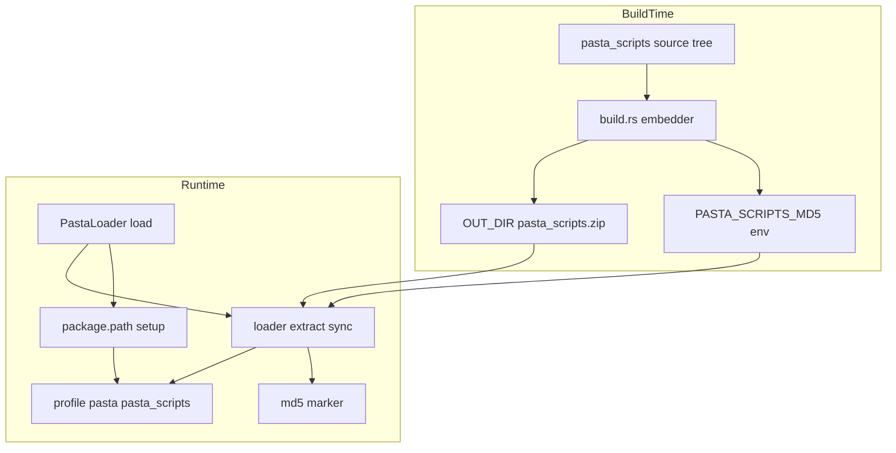
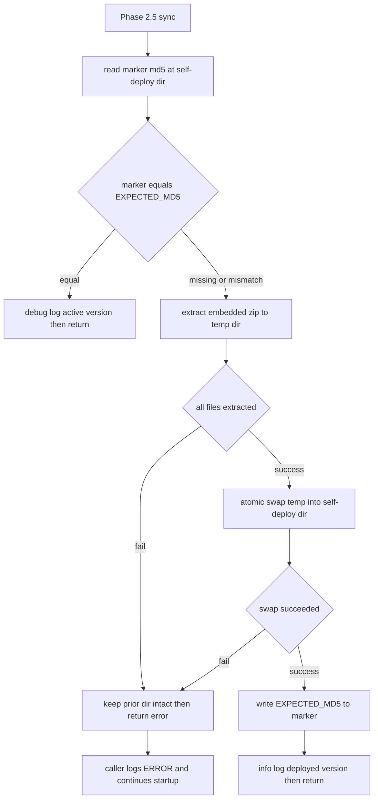

# Design Document: pasta-scripts-self-deploy

## Overview

**Purpose**: pasta.dll がフレームワークスクリプト（標準ランタイム Lua 一式）の唯一の正本源となり、起動時にディスク上の実体を内蔵 zip からアトミックに自己展開することで、LuaJIT 移行時に発生したようなバージョンドリフト（`coroutine.close` 等の 500 エラー）を構造的に根絶する。

**Users**: ゴースト配布者・メンテナ（pasta.dll を更新する際、スクリプトの手動コピーが不要になる）。エンドユーザー（古い dll とスクリプトの不整合による起動エラーから解放される）。

**Impact**: 現状の「`ghost/master/pasta_scripts/` をディスク同梱で配布し、`package.path` から読む」方式を、「dll 内蔵 zip を起動時に `profile/pasta/pasta_scripts/` へ自己展開し、そこを `package.path` で読む」方式へ変更する。Lua ローダの解決機構は不変、`PastaLoader::load` に展開ステップ（Phase 2.5）を1つ挿入する。

### Goals
- 起動時にディスクの自己展開先を内蔵正本へ自動整合（MD5 マーカー比較・不一致時アトミック展開）
- ネットワーク更新（`updates.txt` / `.nar`）と自己展開の非干渉（`profile/` 配下の除外領域を利用）
- ビルド時に決定論的 zip とその MD5 を生成・埋め込み、ソースとの常時一致を保証
- 既存挙動（`package.path` 解決機構、`scripts/` 優先、SHIORI イベント処理）の非回帰

### Non-Goals
- 抽出後ファイルのファイル単位改竄検知（ツリー再ハッシュ）。dll⇄ディスクのバージョンドリフト検知に限定
- リリース済み外部ゴースト・既存インストールのランタイム移行（対象ユーザー不在。dll による旧ファイル能動削除・検索パス強制注入は行わない）
- `coroutine.close` バグ自体の修正（luajit-migration で完了済み）
- Lua ローダの `package.path` / `package.searchers` 解決ロジックの変更

## Boundary Commitments

### This Spec Owns
- **ビルド時の埋め込みアセット生成**: `crates/pasta_lua/pasta_scripts/` ツリーから決定論的 zip を生成し、その MD5 を基準ダイジェスト（`EXPECTED_MD5`）として dll へ埋め込む（`build.rs`）。
- **起動時の自己展開**: 自己展開先 `{base_dir}/profile/pasta/pasta_scripts/` の `.md5` マーカーと `EXPECTED_MD5` を比較し、不一致時に内蔵 zip をアトミックに展開する（`loader/extract.rs`）。
- **自己展開先の `.md5` マーカー**: 生成・書き込み・所有。
- **検索パスの既定値**: `default_lua_search_paths()` とサンプルゴースト `pasta.toml` のフレームワークパスを自己展開先へ更新。
- **hello-pasta 配布構成の整合**: `release.ps1` の `pasta_scripts` コピー手順撤去、コミット済み同梱の撤去、関連テストの更新。

### Out of Boundary
- `package.path` / `package.searchers` の解決ロジック（既定値の変更のみで、機構は不変）。
- `scripts/`（ユーザーカスタム層）の挙動・優先順位。
- ユーザー辞書（`dic/*.pasta`）・キャッシュ（`profile/pasta/cache/`）・セーブ（`profile/pasta/save/`）の管理。
- ネットワーク更新ファイル生成ロジック（`pasta_check`）の変更（除外動作は既存のまま利用するだけ）。

### Allowed Dependencies
- 既存の `PastaLoader::load` フェーズ構造（Phase 2.5 として挿入）。
- `LoaderContext` の `base_dir`・`generate_package_path()`（検索パス解決）。
- workspace 依存 `zip 8.6`（deflate）、`md5 0.8`、`flate2`（既存）。
- `LoaderError` / `tracing` ロギング規約。

### Revalidation Triggers
- 自己展開先パス（`profile/pasta/pasta_scripts/`）の変更 → 検索パス・ネット更新除外の前提が崩れる。
- `EXPECTED_MD5` の埋め込み方式（`cargo:rustc-env`）の変更 → ビルド/ランタイム双方に影響。
- `pasta_check` の `EXCLUDED_DIRS`（`profile`/`var`）変更 → ネット更新非干渉の前提が崩れる。
- `PastaLoader::load` のフェーズ構造変更 → 展開挿入点に影響。

## Architecture

### Existing Architecture Analysis
- **`PastaLoader::load(base_dir)` → `load_with_config`**（`loader/mod.rs:79-182`）は6フェーズ構成：(1) Config 読込 →(1.5) Logger →(2) ディレクトリ/キャッシュ準備 →(3) ファイル発見 →(4) インクリメンタル処理 →(5) scene_dic 生成 →(6) Runtime 初期化。各フェーズは `Result<_, LoaderError>` を返し `?` で早期 return。
- **検索パス解決**（`loader/context.rs:98-113`）：`generate_package_path()` が `base_dir.join(relative)` で各 `lua_search_paths` を絶対化し `package.path` を構築。`base_dir` は `canonicalize` 済み（位置は不変、正規化のみ）。
- **既定検索パス**（`loader/config.rs:155-163`）は `scripts` > `pasta_scripts` の順で、`scripts/` がフレームワークより優先。
- **非致命の前例**：キャッシュ保存失敗は `warn!` して続行（`mod.rs:435-437`）。本機能の展開失敗も同様に非致命化する（ただしログは ERROR=Req3.1）。

### Architecture Pattern & Boundary Map



**Architecture Integration**:
- **Selected pattern**: 起動前段同期ステップ（pre-load sync）＋ビルド時アセット埋め込み。展開はローダの前段（Phase 2.5）として一回実行し、以降は既存の `package.path` 機構が通常どおりディスクから読む。
- **Boundaries**: ビルド時（`build.rs`）と起動時（`loader/extract.rs`）を分離。展開対象は自己展開先ディレクトリのみ。
- **Existing patterns preserved**: フェーズ分割ローダ、`LoaderError`、`tracing`、非致命フォールバック（warn 前例を ERROR で踏襲）。
- **New components rationale**: `build.rs`（埋め込み生成は前例なし）、`loader/extract.rs`（zip 読み込み・展開は本体初）。
- **Steering compliance**: ワークスペース層構成（pasta_lua Loader 層）を維持、MIT/Apache 依存のみ、`package.path` 機構不変。

### Technology Stack

| Layer | Choice / Version | Role in Feature | Notes |
|-------|------------------|-----------------|-------|
| Build / Runtime | `zip` 8.6 (deflate) | zip 生成（build）・展開（runtime） | workspace 定義済み。pasta_lua の deps と build-deps に追加 |
| Build | `md5` 0.8 | zip blob の MD5 算出（ビルド時のみ） | workspace 定義済み。pasta_lua の build-deps へ追加。runtime はマーカー文字列比較のみで md5 不使用 |
| Build | `cargo:rustc-env` / `OUT_DIR` / `include_bytes!` | MD5 と zip の埋め込み | pasta_lua に build.rs を新規作成 |
| Runtime | `std::fs` | アトミック展開（temp→rename） | 既存 `remove_dir_all`/`rename` 流用 |

> 依存追加（zip/md5）の詳細・決定論 zip の調査は `research.md` を参照。

## File Structure Plan

### New Files
```
crates/pasta_lua/
├── build.rs                    # NEW: pasta_scripts を決定論的 zip 化→OUT_DIR、MD5 を cargo:rustc-env で公開
└── src/loader/
    └── extract.rs              # NEW: 内蔵 zip 埋め込み定数 + 起動時自己展開（MD5 比較・アトミック展開・.md5 書込）
```

### Modified Files
- `crates/pasta_lua/Cargo.toml` — `[dependencies]` に `zip`（runtime の zip 解凍）、`[build-dependencies]` に `zip`・`md5` を追加（runtime は md5 不使用＝マーカー比較のみ）。
- `crates/pasta_lua/src/loader/mod.rs` — Phase 2 と Phase 3 の間（`mod.rs:118-120`）に Phase 2.5 として `extract::sync_pasta_scripts(base_dir)` を非致命呼び出し。
- `crates/pasta_lua/src/loader/error.rs` — `LoaderError` に自己展開失敗 variant（`SelfDeploy { path, source }`）を追加。
- `crates/pasta_lua/src/loader/config.rs` — `default_lua_search_paths()` の `"pasta_scripts"` を `"profile/pasta/pasta_scripts"` に置換。
- `crates/pasta_sample_ghost/ghosts/hello-pasta/ghost/master/pasta.toml` — `lua_search_paths` の `"pasta_scripts"` を `"profile/pasta/pasta_scripts"` に置換。
- `crates/pasta_sample_ghost/release.ps1` — `pasta_scripts` コピー手順（124-147 行）を撤去。
- `crates/pasta_sample_ghost/tests/common/mod.rs` / `tests/integration_test.rs` — pasta_scripts を master へコピー／検索パス検証するテストを新方式へ更新。

### Removed
- `crates/pasta_sample_ghost/ghosts/hello-pasta/ghost/master/pasta_scripts/` — コミット済み同梱を撤去（自己展開へ一本化）。

> 依存方向: build.rs（独立）／runtime は Config → Loader(extract) → package.path → Runtime。extract.rs は loader 層に属し、Phase 2.5 でのみ呼ばれる。

## System Flows

### 起動時自己展開の判定・展開フロー



**Key decisions**:
- **高速パス（一致）**: マーカー文字列の比較のみ。ディスク再ハッシュなし（Req1.5）。使用中の版を DEBUG ログ（Req1.6）。
- **アトミック展開**: 一時ディレクトリへ全展開→成功確認後にスワップ。失敗時は自己展開先の直前状態を保全（Req2.3）。`.md5` はスワップ成功後に最後に書く（Req2.4）。スワップ途中のクラッシュは次回起動で `.md5` 不整合となり再展開（自己修復）。
- **非致命**: 展開失敗（書込不可・ロック等）は ERROR ログ＋起動継続（Req3）。初回展開失敗時は自己展開先が欠落するが起動は継続。

## Requirements Traceability

| Requirement | Summary | Components | Interfaces | Flows |
|-------------|---------|------------|------------|-------|
| 1.1–1.5 | 起動時 MD5 比較・展開判定・高速パス | extract::sync_pasta_scripts | `sync_pasta_scripts` | 判定フロー |
| 1.6 | 高速パス時に版を DEBUG ログ | extract | — | Skip 分岐 |
| 2.1–2.3 | アトミック展開・orphan なし・失敗時保全 | extract（temp→swap） | `sync_pasta_scripts` | 展開フロー |
| 2.4 | `.md5` を成功後に最後に書く | extract | — | WriteMarker |
| 2.5 | 自己展開先のみ操作・`scripts/` 不可侵 | extract | — | — |
| 2.6 | 解凍済み生ファイル配置・可視化 | extract | — | — |
| 2.7 | 同期ログ | extract | — | Info |
| 3.1–3.3 | 失敗時 ERROR ログ＋継続 | mod.rs 呼出し側 + extract | 非致命呼出し | Preserve→Caller |
| 4.1–4.6 | 決定論 zip 生成・MD5 埋め込み | build.rs | `cargo:rustc-env` | BuildTime |
| 5.1 | フレームワークを master へ同梱しない | release.ps1 / 撤去 | — | — |
| 5.2–5.3 | 自己展開先のネット更新除外・非干渉 | パス選択（profile 配下） | — | — |
| 5.4 | `.md5` は dll 所有 | extract | — | — |
| 5.5 | フレッシュ初回起動で生成 | extract | `sync_pasta_scripts` | 展開フロー |
| 6.1 | 解決機構不変・前段ステップ | mod.rs Phase 2.5 | — | — |
| 6.2 | `scripts/` 優先順位維持 | config.rs（順序保持） | — | — |
| 6.3 | 既定/サンプル pasta.toml の検索パス更新 | config.rs / pasta.toml | — | — |
| 6.4 | hello-pasta 配布構成整合 | release.ps1 / 撤去 / tests | — | — |
| 6.5 | SHIORI 挙動不変 | （非回帰） | — | — |

## Components and Interfaces

| Component | Layer | Intent | Req Coverage | Key Dependencies | Contracts |
|-----------|-------|--------|--------------|------------------|-----------|
| build.rs embedder | Build | pasta_scripts を決定論 zip 化＋MD5 埋め込み | 4.1–4.6 | zip, md5 (build-deps) (P0) | Batch |
| loader/extract.rs | Loader | 起動時 MD5 比較・アトミック展開 | 1.x, 2.x, 3.x, 5.4–5.5 | zip, md5, std::fs (P0) | Service |
| loader/mod.rs Phase 2.5 | Loader | 非致命呼出し統合 | 3.x, 6.1 | extract (P0) | — |
| config.rs / pasta.toml | Config | 検索パス既定値更新 | 6.2, 6.3 | — (P0) | State |
| release.ps1 / sample ghost | Distribution | 同梱撤去・整合 | 5.1, 6.4 | — (P1) | Batch |

### Build Layer

#### build.rs embedder

| Field | Detail |
|-------|--------|
| Intent | ソース `pasta_scripts/` を決定論的 zip 化し、zip と MD5 を dll へ埋め込む |
| Requirements | 4.1, 4.2, 4.3, 4.4, 4.5, 4.6 |

**Responsibilities & Constraints**
- `crates/pasta_lua/pasta_scripts/` ツリー全体（socket/mime 等の同梱 Lua を含む。`scriptlibs/` は対象外）を `OUT_DIR/pasta_scripts.zip` へ zip 化。
- **決定論**: エントリ名でソート、各エントリの `last_modified` を固定値、Unix 権限を固定、Deflated・固定圧縮レベル。ビルド時刻等の非決定要素を排除（同一ソース→バイト同一 zip）。
- 生成 zip の MD5 を算出し `cargo:rustc-env=PASTA_SCRIPTS_MD5=<hex>` で公開。
- `cargo:rerun-if-changed` を `pasta_scripts/` ツリーを再帰walk して**各ファイル・各サブディレクトリごとに**発行し、ネストしたファイル変更でも確実に再生成する（ディレクトリ1個への発行では nested 変更を検知できないため）（4.4/4.5）。

**Contracts**: Batch [x]

##### Batch / Job Contract
- **Trigger**: `cargo build`（`pasta_scripts/` 変更時）。
- **Input**: `crates/pasta_lua/pasta_scripts/` ツリー。
- **Output**: `OUT_DIR/pasta_scripts.zip`（バイト決定的）、環境変数 `PASTA_SCRIPTS_MD5`。
- **Idempotency**: 同一ソースで常に同一出力（4.3/4.4）。

**Implementation Notes**
- Integration: runtime 側は `include_bytes!(concat!(env!("OUT_DIR"), "/pasta_scripts.zip"))` と `env!("PASTA_SCRIPTS_MD5")` で参照。
- Risks: zip crate のデフォルトが mtime を埋め込むと非決定化 → `FileOptions::last_modified_time` を固定すること（research.md 参照）。

### Loader Layer

#### loader/extract.rs

| Field | Detail |
|-------|--------|
| Intent | 起動時に自己展開先を内蔵正本へアトミック整合 |
| Requirements | 1.1–1.6, 2.1–2.7, 3.1–3.3, 5.4, 5.5 |

**Responsibilities & Constraints**
- 自己展開先 = `base_dir.join("profile/pasta/pasta_scripts")`。マーカー = 同ディレクトリ直下 `.md5`。
- マーカーと `EXPECTED_MD5` を文字列比較。一致→無書き込みで即 return（DEBUG ログ）。不一致/欠落→アトミック展開。
- アトミック展開: 同一ボリュームの一時ディレクトリへ全展開→成功確認→スワップ（旧を退避→新を差し込み→旧削除）→`.md5` を最後に書込。
- 操作対象は自己展開先＋一時領域のみ。`scripts/`・他ファイルに触れない。
- 展開失敗は `LoaderError::SelfDeploy` を返し、呼出し側が ERROR ログ＋継続（非致命）。

**Dependencies**
- Outbound: `std::fs`（temp 展開・rename・remove_dir_all）(P0)
- External: `zip::ZipArchive`（解凍）, `md5`（未使用：runtime はマーカー比較のみ。MD5 算出はビルド時のみ）(P0)

**Contracts**: Service [x]

##### Service Interface
```rust
/// 起動時自己展開。Phase 2.5 で base_dir を受けて呼ばれる。
/// 失敗時は LoaderError を返すが、呼出し側で握り潰し起動を継続する（非致命）。
pub(crate) fn sync_pasta_scripts(base_dir: &Path) -> Result<SyncOutcome, LoaderError>;

pub(crate) enum SyncOutcome {
    Skipped { digest: String },   // マーカー一致（高速パス）
    Deployed { digest: String },  // 再展開実施
}
```
- **Preconditions**: `base_dir` 確定（Phase 2 完了）。`EMBEDDED_ZIP`/`EXPECTED_MD5` はビルド時に埋め込み済み。
- **Postconditions**: `Deployed` 時、自己展開先の内容＝内蔵正本（orphan なし）かつ `.md5`＝`EXPECTED_MD5`。`Err` 時、自己展開先は直前状態を保全（初回は欠落）。
- **Invariants**: `scripts/` を含む自己展開先以外を変更しない。高速パスでディスク再ハッシュしない。

**Implementation Notes**
- Integration: `mod.rs` Phase 2.5 で `if let Err(e) = extract::sync_pasta_scripts(base_dir) { error!(path = %.., error = %e, "self-deploy failed; continuing with existing scripts"); }`。
- Validation: 展開後のファイル集合が zip エントリ集合と一致すること（orphan なし）はスワップにより保証。
- Risks: Windows のディレクトリ rename 制約 → 退避→差し込み→旧削除の順。**真のアトミックではなく準アトミック**：保全保証は「展開失敗（スワップ前）では旧を完全保全」に限定し、スワップ中断はクラッシュ後の `.md5` 自己修復で吸収する。一時領域は自己展開先と同一ボリュームに置く。

### Config / Distribution

#### config.rs / pasta.toml（検索パス更新）

| Field | Detail |
|-------|--------|
| Intent | フレームワーク検索パスを自己展開先へ更新、`scripts/` 優先を維持 |
| Requirements | 6.2, 6.3 |

**Contracts**: State [x]

##### State Management
- `default_lua_search_paths()` と hello-pasta `pasta.toml` の `lua_search_paths` を `["profile/pasta/save/lua", "scripts", "profile/pasta/pasta_scripts", "profile/pasta/cache/lua", "scriptlibs"]` へ更新（`"pasta_scripts"`→`"profile/pasta/pasta_scripts"`、`scripts` は依然上位）。
- `package.path` 生成機構（`generate_package_path`）は不変。

#### release.ps1 / sample ghost 整合

| Field | Detail |
|-------|--------|
| Intent | master 同梱の撤去で自己展開へ一本化 | 
| Requirements | 5.1, 6.4 |

**Contracts**: Batch [x]
- `release.ps1` の `pasta_scripts` コピー手順を撤去。コミット済み `master/pasta_scripts/` を削除。統合テストを新方式へ更新。

## Error Handling

### Error Strategy
- **展開失敗（Req3）**: `loader/extract.rs` が `LoaderError::SelfDeploy` を返し、`mod.rs` Phase 2.5 が `error!` ログ＋起動継続（非致命）。フォールバックは原子性保証により直前の動作版（初回は欠落）。
- **マーカー読込失敗**: 欠落と同等に扱い再展開（Req1.3）。
- **ビルド失敗（zip 生成不可）**: ビルドエラーとして即時失敗（fail fast、ランタイム前に検出）。

### Error Categories and Responses
- **System Errors（I/O）**: 書込不可・ロック → ERROR ログ＋graceful degradation（起動継続）。
- **Build Errors**: zip 生成・MD5 算出失敗 → ビルド中断（`panic!`/`expect`）。

### Monitoring
- `tracing`: 高速パス=DEBUG（使用中ダイジェスト）、展開=INFO（更新後ダイジェスト）、失敗=ERROR（事実・対象パス・ドリフト未解消）。

## Testing Strategy

### Unit Tests（loader/extract.rs）
- **マーカー一致→skip**: `.md5`＝`EXPECTED_MD5` で書き込みが発生しないこと（再ハッシュなし）。[1.2, 1.5]
- **マーカー欠落／不一致→deploy**: 自己展開先未生成・古い `.md5` で再展開され、内容が内蔵正本と一致すること。[1.3, 1.4, 2.1, 2.2]
- **アトミック性**: 一時展開を意図的に失敗させた際、自己展開先の直前状態が保全されること。[2.3]
- **`.md5` 最後書き**: 展開成功後にのみマーカーが更新されること。[2.4]
- **`scripts/` 不可侵**: 同期後に `scripts/` と他ファイルが不変であること。[2.5]

### Build Tests（build.rs / 生成物）
- **決定論**: 同一ソースから2回ビルドした zip がバイト同一・MD5 同一。[4.3, 4.4]
- **変化反映**: `pasta_scripts/` の1ファイル変更で MD5 が変化。[4.5]

### Integration Tests（pasta_sample_ghost）
- **フレッシュ初回起動**: `profile/` 不在のゴーストで初回ロード時に自己展開先が生成され、`require("pasta...")` が解決すること。[1.3, 5.5]
- **検索パス整合**: `package.path` が `profile/pasta/pasta_scripts` を含み、`scripts/main.lua` の上書きが依然優先されること。[6.2, 6.3]
- **書込失敗時の継続**: 自己展開先を読み取り専用にした状態で ERROR ログが出つつ起動が継続すること。[3.1, 3.2]

### Distribution Tests
- **ネット更新除外**: `pasta_check` の `updates.txt`/`.nar` 生成で `profile/` 配下（自己展開先）が対象外であること（既存除外動作の回帰確認）。[5.1, 5.2]
```
