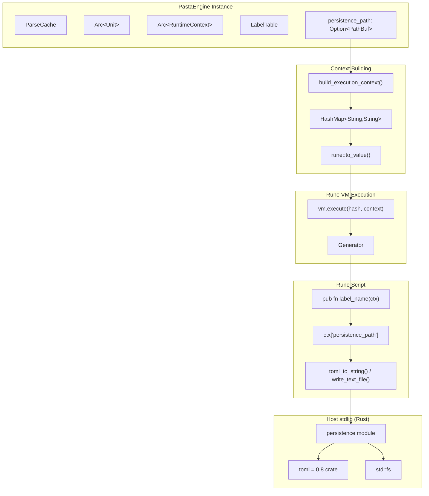
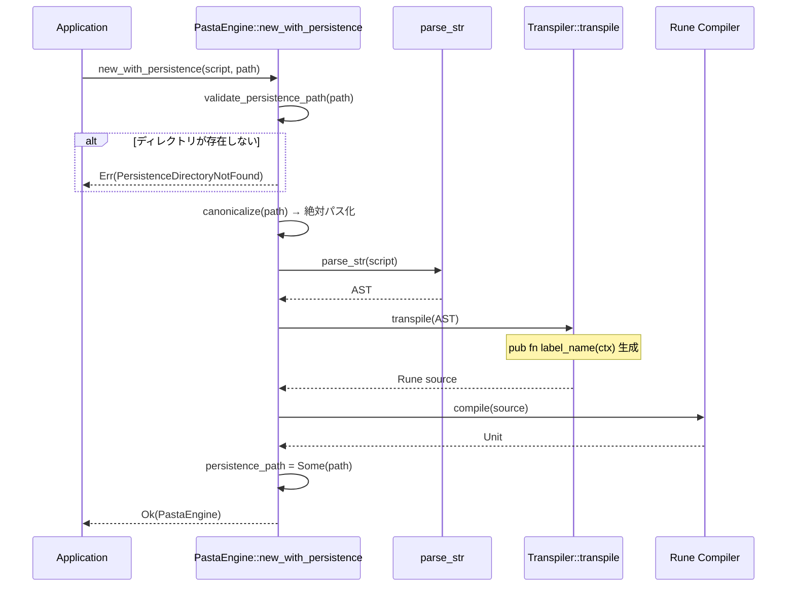
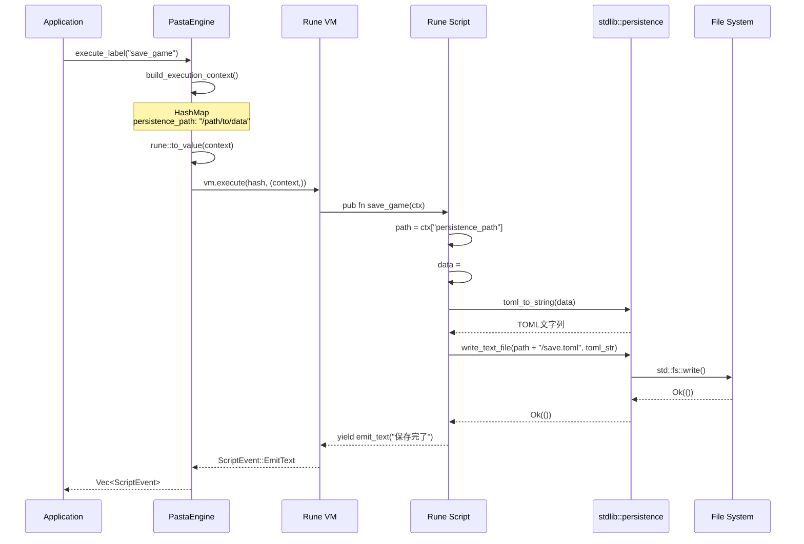

# Design Document: pasta-serialization

## Overview

**前提条件**: 本設計は`pasta-engine-independence`スペック完了後の実装を想定しています。PastaEngineが`cache: ParseCache`フィールドを持つ構造を前提とします。

**Purpose**: 本設計は、PastaEngineに永続化ディレクトリパス管理機能を実装し、Runeスクリプトからファイル永続化を可能にします。永続化の実装（何をいつどう保存するか）はRuneスクリプト側に委ね、エンジンはパス情報の提供とファイルI/O用標準ライブラリ関数を提供します。

**Users**: Runeスクリプト開発者が永続化ディレクトリパスを使用して、ゲーム進行状況やユーザー設定などのデータをTOMLファイルとして保存・読み込みできるようになります。

**Impact**: PastaEngineに新規フィールド`persistence_path`を追加し、Runeランタイムコンテキストを通じてスクリプトにパスを提供します。トランスパイラが生成するラベル関数シグネチャが`pub fn label_name(ctx)`形式に変更されます。

### Goals

- エンジン初期化時に永続化ディレクトリパスを指定可能
- Runeスクリプトからコンテキスト引数を通じてパスにアクセス可能
- Rust側でTOML/ファイルI/O関数を提供（`toml_to_string`, `toml_from_string`, `read_text_file`, `write_text_file`）
- テスト時に一時ディレクトリを使用し、元データを保護
- パストラバーサル攻撃防止のためのベストプラクティスをドキュメント化

### Non-Goals

- エンジンインスタンス自体の状態永続化（各インスタンスは独立、`pasta-engine-independence`準拠）
- 永続化ロジックのRust側実装（Runeスクリプトに委ねる）
- Rune標準ライブラリへのTOML機能追加（pastaプロジェクト固有のstdlib拡張として提供）

---

## Architecture

### Existing Architecture Analysis

**現在のPastaEngineアーキテクチャ** (`pasta-engine-independence`準拠):
```
┌─────────────────────────────────────────────┐
│         PastaEngine Instance                │
│  ┌────────────────────────────────────────┐ │
│  │ cache: ParseCache                      │ │
│  │ unit: Arc<rune::Unit>                  │ │
│  │ runtime: Arc<rune::RuntimeContext>     │ │
│  │ label_table: LabelTable                │ │
│  └────────────────────────────────────────┘ │
└─────────────────────────────────────────────┘
           │
           ▼
    [Rune VM Execution]
    vm.execute(hash, ())  ← 現在は空タプル
```

**変更後のアーキテクチャ**:
```
┌─────────────────────────────────────────────┐
│         PastaEngine Instance                │
│  ┌────────────────────────────────────────┐ │
│  │ cache: ParseCache                      │ │
│  │ unit: Arc<rune::Unit>                  │ │
│  │ runtime: Arc<rune::RuntimeContext>     │ │
│  │ label_table: LabelTable                │ │
│  │ persistence_path: Option<PathBuf> ⭐NEW│ │
│  └────────────────────────────────────────┘ │
└─────────────────────────────────────────────┘
           │
           ▼
    [Context Building]
    HashMap<String, String>
      ├─ "persistence_path": "/path/to/data"
      └─ (future expansion)
           │
           ▼ rune::to_value()
    [Rune VM Execution]
    vm.execute(hash, (context,))  ← HashMap引数
           │
           ▼
    [Rune Script]
    pub fn label_name(ctx) {
        let path = ctx["persistence_path"];
        // TOML保存・読み込み
    }
```

**統合ポイント**:
- `PastaEngine`構造体: `persistence_path`フィールド追加
- コンストラクタ: `new_with_persistence(script, path)`追加
- トランスパイラ: ラベル関数シグネチャ変更（`pub fn label_name()` → `pub fn label_name(ctx)`）
- VM実行: `vm.execute(hash, (context,))`にHashMapコンテキスト渡し
- stdlib: 永続化関数モジュール追加

### Architecture Pattern & Boundary Map

**選択パターン**: エンジン拡張 + ホスト提供stdlib（Extension + Host-provided stdlib）



**Architecture Integration**:
- **選択パターン**: エンジン拡張 — 既存PastaEngineに最小限のフィールド・メソッド追加
- **ドメイン境界**: 永続化パス管理はPastaEngine内、実際の永続化ロジックはRuneスクリプト側
- **既存パターン保持**: `pasta-engine-independence`の所有権モデルを踏襲
- **新コンポーネント**: stdlib persistence module（TOML/ファイルI/O関数）
- **ステアリング準拠**: 型安全性（`Option<PathBuf>`）、所有権ベースのメモリ管理

### Technology Stack

| Layer | Choice / Version | Role in Feature | Notes |
|-------|------------------|-----------------|-------|
| Serialization | toml = 0.8 | TOMLシリアライズ・デシリアライズ | Rust側でRuneスクリプト向けに提供 |
| File I/O | std::fs | ファイル読み書き | stdlib wrapper経由でRuneに提供 |
| Path Handling | std::path::PathBuf | パス正規化・検証 | 初期化時に絶対パス化 |
| Runtime | Rune 0.14 | コンテキスト引数渡し | HashMap → rune::to_value → タプル |
| Testing | tempfile = 0.3 | 一時ディレクトリ管理 | テストデータ保護 |
| Logging | tracing = 0.1 | 構造化ロギング | 既存依存、今回本格活用 |

**技術選択の根拠**:
- **toml 0.8**: Rune標準にTOML機能なし、ホスト側提供が必須（R2調査結果）
- **HashMap for context**: カスタム構造体よりシンプル、将来的な拡張容易（R1調査結果）
- **tempfile**: テスト時の一時ディレクトリ管理標準パターン

---

## System Flows

### エンジン初期化フロー



### ラベル実行フロー（永続化パスあり）



---

## Requirements Traceability

| Requirement | Summary | Components | Interfaces | Flows |
|-------------|---------|------------|------------|-------|
| 1.1 | 永続化パス指定（絶対パス） | PastaEngine | new_with_persistence | 初期化フロー |
| 1.2 | 永続化パス指定（相対パス） | PastaEngine | new_with_persistence | 初期化フロー |
| 1.3 | 永続化パスなしで初期化 | PastaEngine | new | - |
| 1.4 | 無効パスでエラー | PastaEngine | new_with_persistence | 初期化フロー |
| 1.5 | パス保持（ライフタイム） | PastaEngine | - | - |
| 2.1 | コンテキスト引数渡し | PastaEngine | build_execution_context | ラベル実行フロー |
| 2.2 | パス設定時の引数値 | PastaEngine | build_execution_context | ラベル実行フロー |
| 2.3 | パス未設定時の引数値 | PastaEngine | build_execution_context | ラベル実行フロー |
| 2.4 | Rune側でパスアクセス | Rune Script | ctx["persistence_path"] | ラベル実行フロー |
| 2.5 | トランスパイラシグネチャ変更 | Transpiler | transpile_label | 初期化フロー |
| 2.6 | ドキュメント提供 | doc/ | - | - |
| 3.1 | tempfile使用 | tests/ | - | - |
| 3.2 | 固定データコピー | tests/ | - | - |
| 3.3 | 一時ディレクトリのみ変更 | PastaEngine | - | ラベル実行フロー |
| 3.4 | 自動削除 | tests/ | - | - |
| 3.5 | テストフィクスチャ | tests/fixtures/ | - | - |
| 4.1 | Option<PathBuf>フィールド | PastaEngine | - | - |
| 4.2 | 絶対パス正規化 | PastaEngine | new_with_persistence | 初期化フロー |
| 4.3 | スレッドセーフ所有 | PastaEngine | - | - |
| 4.4 | 自動解放 | PastaEngine | Drop | - |
| 4.5 | イミュータブル | PastaEngine | - | - |
| 5.1 | 実装例提供 | doc/ | - | - |
| 5.2 | ファイルI/O説明 | doc/ | - | - |
| 5.3 | パストラバーサル対策 | doc/ | - | - |
| 5.4 | TOMLシリアライズ例 | doc/ | - | - |
| 5.5 | パスなし時の処理例 | doc/ | - | - |
| 6.1-6.7 | テストカバレッジ | tests/ | - | - |
| 7.1 | ディレクトリ不在エラーログ | PastaEngine | new_with_persistence | 初期化フロー |
| 7.2 | 設定成功ログ | PastaEngine | new_with_persistence | 初期化フロー |
| 7.3 | パスなしログ | PastaEngine | new | - |
| 7.4 | パス取得ログ | PastaEngine | build_execution_context | ラベル実行フロー |
| 7.5 | 構造化フィールド | PastaEngine | - | - |
| 7.6 | Runeエラーハンドリング例 | doc/ | - | - |

---

## Components and Interfaces

### Component Summary

| Component | Domain/Layer | Intent | Req Coverage | Key Dependencies (P0/P1) | Contracts |
|-----------|--------------|--------|--------------|--------------------------|-----------|
| PastaEngine | Runtime | 永続化パス管理・コンテキスト提供 | 1.1-1.5, 2.1-2.3, 4.1-4.5, 7.1-7.5 | ParseCache (P0), Rune (P0) | State, Service |
| Transpiler | Transpile | ラベル関数シグネチャ生成 | 2.5 | parser (P0) | Service |
| persistence module | stdlib | TOML/ファイルI/O関数提供 | 2.6, 5.1-5.5 | toml crate (P0), std::fs (P0) | Service |
| PersistenceError | Error | 永続化関連エラー型 | 1.4, 7.1 | PastaError (P0) | - |
| persistence_test | Test | 永続化機能検証 | 3.1-3.5, 6.1-6.7 | PastaEngine (P0), tempfile (P0) | - |
| rune-persistence-guide | Doc | Rune開発者向けガイド | 2.6, 5.1-5.6, 7.6 | - | - |

---

### Runtime Layer

#### PastaEngine

| Field | Detail |
|-------|--------|
| Intent | 永続化ディレクトリパスを管理し、Runeスクリプトにコンテキスト経由で提供 |
| Requirements | 1.1, 1.2, 1.3, 1.4, 1.5, 2.1, 2.2, 2.3, 4.1, 4.2, 4.3, 4.4, 4.5, 7.1, 7.2, 7.3, 7.4, 7.5 |

**Responsibilities & Constraints**
- 初期化時に永続化ディレクトリパスを受け取り、検証・正規化して保持
- ラベル実行時にHashMapコンテキストを構築し、Rune VMに渡す
- 永続化パスはイミュータブル（初期化後変更不可）
- 各インスタンスが異なるパスを保持可能（`pasta-engine-independence`準拠）

**Dependencies**
- Inbound: アプリケーションコード — エンジン使用 (P0)
- Outbound: Transpiler — Rune source生成 (P0)
- Outbound: Rune VM — スクリプト実行 (P0)
- Outbound: persistence module — stdlib登録 (P0)

**Contracts**: State ☑ / Service ☑

##### State Management

**構造体定義**:
```rust
pub struct PastaEngine {
    /// コンパイル済みRuneユニット（Rune API制約によりArc必須）
    unit: Arc<rune::Unit>,
    /// Runeランタイムコンテキスト（Rune API制約によりArc必須）
    runtime: Arc<rune::runtime::RuntimeContext>,
    /// ラベルテーブル（完全所有）
    label_table: LabelTable,
    /// パースキャッシュ（インスタンス所有）
    cache: ParseCache,
    /// 永続化ディレクトリパス（新規フィールド）
    persistence_path: Option<PathBuf>,
}
```

- **State model**: `Option<PathBuf>`でパスを所有、`None`は永続化なし
- **Persistence**: このフィールド自体は永続化しない（Runeスクリプトが使用するパス情報のみ）
- **Concurrency strategy**: インスタンス所有、スレッド間移動可能（`Send`）

##### Service Interface

**コンストラクタ**:
```rust
impl PastaEngine {
    /// 永続化パスなしでエンジン作成（Req 1.3）
    pub fn new(script: &str) -> Result<Self>;
    
    /// 永続化パス付きでエンジン作成（Req 1.1, 1.2, 1.4）
    ///
    /// # Arguments
    /// * `script` - Pasta DSLスクリプト
    /// * `persistence_path` - 永続化ディレクトリパス（絶対/相対）
    ///
    /// # Errors
    /// * `PersistenceDirectoryNotFound` - ディレクトリが存在しない
    /// * `InvalidPersistencePath` - パス解決失敗
    pub fn new_with_persistence(
        script: &str, 
        persistence_path: impl AsRef<Path>
    ) -> Result<Self>;
    
    /// カスタムランダムセレクタ付き（既存機能との互換）
    pub fn with_random_selector(
        script: &str,
        random_selector: Box<dyn RandomSelector>
    ) -> Result<Self>;
    
    /// 永続化パス + カスタムランダムセレクタ（新規）
    pub fn with_persistence_and_random_selector(
        script: &str,
        persistence_path: impl AsRef<Path>,
        random_selector: Box<dyn RandomSelector>
    ) -> Result<Self>;
}
```

**内部メソッド**:
```rust
impl PastaEngine {
    /// 永続化パスを検証（存在確認、is_dir()）
    fn validate_persistence_path(path: &Path) -> Result<()>;
    
    /// 実行用コンテキストを構築（Req 2.1, 2.2, 2.3）
    fn build_execution_context(&self) -> Result<rune::Value, PastaError> {
        let mut ctx = std::collections::HashMap::new();
        
        // persistence_path フィールド設定
        let path_str = if let Some(ref path) = self.persistence_path {
            path.to_string_lossy().to_string()
        } else {
            String::new()  // 空文字列 = パスなし
        };
        
        ctx.insert("persistence_path".to_string(), path_str);
        
        rune::to_value(ctx).map_err(|e| {
            PastaError::RuneRuntimeError(format!("Failed to build context: {}", e))
        })
    }
}
```

**Preconditions**:
- `new_with_persistence`: `persistence_path`が存在するディレクトリであること

**Postconditions**:
- `new_with_persistence`: `persistence_path`は絶対パス形式で保持される
- `build_execution_context`: `HashMap<String, String>`がRune `Value`型に変換される

**Invariants**:
- `persistence_path`は初期化後変更されない（イミュータブル）
- 空文字列 = 永続化なし、非空文字列 = 絶対パス

**Implementation Notes**:
- **Integration**: 既存の`execute_label_with_filters`メソッド内で`build_execution_context()`を呼び出し
- **Validation**: `std::fs::canonicalize`で相対パス→絶対パス変換、`is_dir()`で存在確認
- **Logging**: `tracing`マクロで構造化ログ（`info!`, `error!`, `debug!`）、`steering/logging.md`準拠

**変更箇所**:
```rust
// crates/pasta/src/engine.rs (Line 270-280付近)
fn execute_label_with_filters(&mut self, ...) -> Result<Vec<ScriptEvent>> {
    let fn_name = self.label_table.find_label(label_name, filters)?;
    let mut vm = Vm::new(self.runtime.clone(), self.unit.clone());
    let hash = rune::Hash::type_hash(&[fn_name.as_str()]);
    
    // ▼ 変更前: vm.execute(hash, ())
    // ▼ 変更後:
    let context = self.build_execution_context()?;
    let execution = vm.execute(hash, (context,))
        .map_err(|e| PastaError::VmError(e))?;
    
    // ... (既存のジェネレータ処理)
}
```

---

### Transpile Layer

#### Transpiler

| Field | Detail |
|-------|--------|
| Intent | ASTからRune sourceを生成、ラベル関数シグネチャに`ctx`引数を追加 |
| Requirements | 2.5 |

**Responsibilities & Constraints**
- ラベル（グローバル・ローカル）を`pub fn label_name(ctx) { ... }`形式に変換
- 既存の処理ロジックは維持（`emit_text`, `change_speaker`呼び出し等）

**Dependencies**
- Inbound: PastaEngine — トランスパイル実行 (P0)
- Outbound: parser — AST入力 (P0)

**Contracts**: Service ☑

##### Service Interface

**変更箇所**:
```rust
// crates/pasta/src/transpiler/mod.rs (Line 155付近)

// ▼ 変更前:
// output.push_str(&format!("pub fn {}() {{\n", fn_name));

// ▼ 変更後:
output.push_str(&format!("pub fn {}(ctx) {{\n", fn_name));
```

**影響範囲**:
- すべてのグローバルラベル・ローカルラベルが`ctx`引数を持つ
- Runeは未使用引数を許容するため、既存のラベル（`ctx`を使用しない）も正常動作
- 既存サンプル確認済み：`examples/scripts/`の6つの.pastaファイルはすべてPasta DSL形式のみ（Runeコードブロックなし）
- 既存テスト確認済み：`tests/`配下のテストスクリプトも影響なし

**Implementation Notes**:
- **単一変更箇所**: ラベル関数生成ロジックのフォーマット文字列のみ
- **後方互換性**: 既存サンプル・テストへの影響なし（Rune側で引数無視）
- **Phase 3対応**: 新規作成するRune開発者向けガイドで`ctx`引数の使用方法を説明

---

### Stdlib Layer

#### persistence module

| Field | Detail |
|-------|--------|
| Intent | Runeスクリプト向けにTOMLシリアライズ・ファイルI/O関数を提供 |
| Requirements | 2.6, 5.1, 5.2, 5.4 |

**Responsibilities & Constraints**
- Rune `Value`型とRust `toml::Value`型の相互変換
- ファイル読み書きのラッパー関数
- エラーハンドリング（Rune側で`Result<T, String>`として返す）

**Dependencies**
- Inbound: Rune VM — stdlib関数呼び出し (P0)
- External: toml = 0.8 — シリアライズ (P0)
- External: std::fs — ファイルI/O (P0)

**Contracts**: Service ☑

##### Service Interface

**新規ファイル作成**: `crates/pasta/src/stdlib/persistence.rs`

```rust
//! Persistence-related functions for Rune scripts

use rune::{ContextError, Module};
use std::fs;

/// Create persistence module with TOML and file I/O functions
pub fn create_persistence_module() -> Result<Module, ContextError> {
    let mut module = Module::with_crate("pasta_stdlib::persistence")?;
    
    module.function_meta(toml_to_string)?;
    module.function_meta(toml_from_string)?;
    module.function_meta(read_text_file)?;
    module.function_meta(write_text_file)?;
    
    Ok(module)
}

/// Serialize a Rune value to TOML string
#[rune::function]
fn toml_to_string(data: rune::Value) -> Result<String, String> {
    let toml_value: toml::Value = rune::from_value(data)
        .map_err(|e| format!("Value conversion failed: {}", e))?;
    
    toml::to_string(&toml_value)
        .map_err(|e| format!("TOML serialization failed: {}", e))
}

/// Deserialize TOML string to Rune value
#[rune::function]
fn toml_from_string(toml_str: &str) -> Result<rune::Value, String> {
    let toml_value: toml::Value = toml::from_str(toml_str)
        .map_err(|e| format!("TOML parsing failed: {}", e))?;
    
    rune::to_value(toml_value)
        .map_err(|e| format!("Failed to convert to Rune value: {}", e))
}

/// Read text file as string
#[rune::function]
fn read_text_file(path: &str) -> Result<String, String> {
    fs::read_to_string(path)
        .map_err(|e| format!("Failed to read file '{}': {}", path, e))
}

/// Write text to file
#[rune::function]
fn write_text_file(path: &str, content: &str) -> Result<(), String> {
    fs::write(path, content)
        .map_err(|e| format!("Failed to write file '{}': {}", path, e))
}
```

**エンジン統合**:
```rust
// crates/pasta/src/engine.rs (Context初期化時)
let mut context = Context::with_default_modules()?;

// 既存stdlib
context.install(crate::stdlib::create_module()?)?;

// 永続化stdlib（新規）
context.install(crate::stdlib::persistence::create_persistence_module()?)?;
```

**Preconditions**:
- `toml_to_string`: `data`がTOML互換型（object, array, primitive）
- `toml_from_string`: `toml_str`が有効なTOML文法
- `read_text_file`: `path`が存在するファイル
- `write_text_file`: `path`の親ディレクトリが存在

**Postconditions**:
- `toml_to_string`: 成功時にTOML形式の文字列を返す
- `toml_from_string`: 成功時にRune `Value`型を返す
- `read_text_file`: ファイル内容をUTF-8文字列として返す
- `write_text_file`: ファイルが作成/上書きされる

**Implementation Notes**:
- **Error as String**: Rune側で`Result<T, String>`でエラーハンドリング
- **Path Security**: 現時点ではRune側でパストラバーサル対策を実施（R3調査結果）
- **Future Enhancement**: `write_text_file_safe`で親ディレクトリ検証を追加する案あり

---

### Error Handling Layer

#### PersistenceError

| Field | Detail |
|-------|--------|
| Intent | 永続化関連のエラー型を定義 |
| Requirements | 1.4, 7.1 |

**Error Categories and Responses**

**User Errors** (4xx相当):
- `PersistenceDirectoryNotFound` - 指定された永続化ディレクトリが存在しない
- `InvalidPersistencePath` - パス解決失敗（canonicalize失敗）

**Implementation**:

**既存の`PastaError` enumに以下のバリアントを追加**:

```rust
// crates/pasta/src/error.rs
// 既存のPastaError enumに追加

#[derive(Debug, thiserror::Error)]
pub enum PastaError {
    // ... (既存のエラー型: ParseError, LabelNotFound, RuneRuntimeError, VmError等)
    
    /// 永続化ディレクトリが存在しない（新規追加）
    #[error("Persistence directory not found: {path}")]
    PersistenceDirectoryNotFound { path: String },
    
    /// 永続化パスの解決に失敗（新規追加）
    #[error("Invalid persistence path: {path}")]
    InvalidPersistencePath { path: String },
}
```

**Monitoring**:
- `error!`レベル: ディレクトリ不在、パス解決失敗
- `info!`レベル: 永続化パス設定成功
- `debug!`レベル: 永続化パスなしで初期化

---

## Data Models

### Domain Model

永続化機能は状態を持たないため、ドメインモデルは不要。PastaEngineが`Option<PathBuf>`でパス情報を保持するのみ。

### File System Model

```
永続化ディレクトリ（ユーザー指定）
├── save_data.toml       ← Runeスクリプトが作成
├── config.toml          ← Runeスクリプトが作成
└── progress.toml        ← Runeスクリプトが作成

テストフィクスチャ（リポジトリ）
tests/fixtures/persistence/
├── sample_save.toml     ← テスト用固定データ
└── sample_config.toml   ← テスト用固定データ

一時ディレクトリ（テスト実行時）
/tmp/pasta-test-XXXXXX/  ← tempfile::TempDir
├── sample_save.toml     ← フィクスチャからコピー
└── (test output)        ← テスト実行で生成
```

---

## Error Handling

### Error Strategy

**永続化パス検証エラー**:
- **発生タイミング**: `new_with_persistence`実行時
- **対応**: エンジン初期化失敗、`Result::Err`を返す
- **リカバリ**: アプリケーション側でパスを修正して再試行

**Runeスクリプト側のファイルI/Oエラー**:
- **発生タイミング**: `write_text_file`, `read_text_file`実行時
- **対応**: Rune側で`Result<T, String>`を返す
- **リカバリ**: Runeスクリプトで`match`またはtry演算子（`?`）でハンドリング

### Error Categories and Responses

| Category | Error Type | Response | Example |
|----------|-----------|----------|---------|
| User Error | PersistenceDirectoryNotFound | 初期化失敗 | 存在しないパス指定 |
| User Error | InvalidPersistencePath | 初期化失敗 | パス解決不可（権限等） |
| System Error | FileWriteError (Rune側) | Rune Result::Err | ディスク容量不足 |
| System Error | FileReadError (Rune側) | Rune Result::Err | ファイル読み取り権限なし |

### Monitoring

**ログ出力戦略** (`steering/logging.md`準拠):

```rust
// 永続化パス設定成功
info!(
    path = %persistence_path.display(),
    "[PastaEngine::new_with_persistence] Persistence path configured"
);

// ディレクトリ不在エラー
error!(
    path = %path.display(),
    error = "Directory not found",
    "[PastaEngine::new_with_persistence] Persistence directory does not exist"
);

// 永続化パスなしで初期化
debug!(
    "[PastaEngine::new] Initialized without persistence path"
);

// コンテキスト構築
debug!(
    persistence_path = %path_str,
    "[PastaEngine::build_execution_context] Building execution context"
);
```

---

## Testing Strategy

### Unit Tests

**Target**: `PastaEngine`コンストラクタとコンテキスト構築

1. `test_new_with_persistence_absolute_path` - 絶対パス指定（Req 1.1）
2. `test_new_with_persistence_relative_path` - 相対パス指定（Req 1.2）
3. `test_new_without_persistence` - パスなし初期化（Req 1.3）
4. `test_invalid_persistence_path` - 存在しないディレクトリでエラー（Req 1.4）
5. `test_build_execution_context_with_path` - コンテキスト生成（パスあり）（Req 2.2）
6. `test_build_execution_context_without_path` - コンテキスト生成（パスなし）（Req 2.3）

### Integration Tests

**Target**: Runeスクリプトからの永続化パスアクセス

**新規ファイル**: `crates/pasta/tests/persistence_test.rs`

1. `test_rune_script_access_persistence_path` - Runeから`ctx["persistence_path"]`アクセス（Req 2.4, 6.3）
2. `test_rune_toml_serialization` - TOML保存・読み込み（Req 6.4）
3. `test_tempdir_auto_cleanup` - tempfile自動削除（Req 3.4, 6.5）
4. `test_multiple_engines_different_paths` - 複数インスタンス独立性（Req 6.6）
5. `test_transpiler_signature_change` - トランスパイラ生成コード確認（Req 2.5）

**依存追加**:
```toml
# crates/pasta/Cargo.toml
[dev-dependencies]
tempfile = "0.3"
```

### Performance/Load

**Not applicable** - 永続化パス管理は初期化時のみ実行、パフォーマンステスト不要

---

## Security Considerations

### Threat Modeling

**脅威**: パストラバーサル攻撃（`../`を含むファイル名で永続化ディレクトリ外にアクセス）

**影響範囲**: Runeスクリプトがユーザー入力を含むファイル名でファイル操作を行う場合

**緩和策** (R3調査結果):
1. **固定ファイル名の推奨** - ハードコードされたファイル名のみ使用（最も安全）
2. **ホワイトリスト検証** - 許可されたファイル名のみ受け入れ
3. **サニタイズ** - パス区切り文字（`/`, `\`, `..`）を除去

**実装**:
- **現時点**: Runeスクリプト側で対策実施（ドキュメント化）
- **将来的な強化**: Rust側stdlib関数に親ディレクトリ検証を組み込む（`write_text_file_safe`等）

### Data Protection

- **永続化パス情報**: センシティブデータではない（ディレクトリパスのみ）
- **ファイル内容**: Runeスクリプトの責任範囲、pastaエンジンは関与しない

---

## Migration Strategy

**Not applicable** - 新機能追加のため、既存データのマイグレーションは不要

**API互換性**:
- `PastaEngine::new(script)` - 既存APIは変更なし（永続化パスなしで動作）
- `PastaEngine::with_random_selector` - 既存APIは変更なし
- トランスパイラ変更 - Rune側で引数無視のため、既存スクリプトは影響なし

---

## Supporting References

### Rune VM Context Passing Pattern (R1調査結果)

**HashMap使用例**:
```rust
let mut ctx = HashMap::new();
ctx.insert("persistence_path".to_string(), "/path/to/data".to_string());
let ctx_value = rune::to_value(ctx)?;
vm.execute(hash, (ctx_value,))?;
```

**Rune側アクセス**:
```rune
pub fn label_name(ctx) {
    let path = ctx["persistence_path"];
    // ...
}
```

### TOML stdlib Implementation (R2調査結果)

**4関数提供**:
- `toml_to_string(data: rune::Value) -> Result<String, String>`
- `toml_from_string(toml_str: &str) -> Result<rune::Value, String>`
- `read_text_file(path: &str) -> Result<String, String>`
- `write_text_file(path: &str, content: &str) -> Result<(), String>`

**依存追加**: `toml = "0.8"`

### Path Traversal Mitigation (R3調査結果)

**3段階防御**:
1. 固定ファイル名（`let filename = "save_data.toml";`）
2. ホワイトリスト（`const ALLOWED_FILES = ["save.toml", "config.toml"];`）
3. サニタイズ（`filename.replace("/", "_").replace("\\", "_").replace("..", "_")`）

### Integration with pasta-engine-independence (R4調査結果)

**実装順序**: `pasta-engine-independence` → `pasta-serialization`

**理由**: 基盤確立後に永続化機能追加、一貫性・テスト簡素化

**統合テスト**: 複数インスタンス × 異なる永続化パスの独立性検証

---

## Implementation Phases

### Phase 1: Core Extension (1.5 days)

**Target**: PastaEngine, Transpiler, Error型

**Tasks**:
1. `PastaEngine::persistence_path: Option<PathBuf>`フィールド追加
2. `PastaEngine::new_with_persistence`コンストラクタ実装
3. `PastaEngine::validate_persistence_path`メソッド実装
4. `PastaEngine::build_execution_context`メソッド実装
5. `execute_label_with_filters`でコンテキスト渡しに変更
6. `Transpiler`のラベル関数シグネチャ変更（`pub fn {}(ctx)`）
7. `PastaError`に`PersistenceDirectoryNotFound`, `InvalidPersistencePath`追加

### Phase 2: Testing Infrastructure (1.5 days)

**Target**: stdlib persistence module, テストスイート

**Tasks**:
1. `toml = "0.8"`依存追加（`Cargo.toml`）
2. `crates/pasta/src/stdlib/persistence.rs`作成（4関数実装）
3. `PastaEngine`初期化時にpersistence module登録
4. `tempfile = "0.3"`依存追加（`dev-dependencies`）
5. `tests/fixtures/persistence/`ディレクトリ作成
6. `tests/persistence_test.rs`作成（7テストシナリオ実装）

### Phase 3: Logging & Documentation (1 day)

**Target**: tracing統合, Runeガイド作成

**Tasks**:
1. `eprintln!`を`tracing`マクロに置き換え
2. 構造化フィールド追加（`path`, `error`, `operation`）
3. `doc/rune-persistence-guide.md`作成
4. サンプルRuneスクリプト作成（保存・読み込み例）
5. セキュリティベストプラクティスドキュメント化（パストラバーサル対策）
6. API docコメント追加（`new_with_persistence`等）

---

## Design Document Status

✅ **Overview**: 永続化パス管理機能の目的・ユーザー・影響を明確化  
✅ **Architecture**: 既存構造分析、変更後のアーキテクチャ図、統合ポイント明示  
✅ **Technology Stack**: toml, tempfile, tracing等の技術選択と根拠  
✅ **System Flows**: 初期化フロー、ラベル実行フローをシーケンス図で可視化  
✅ **Requirements Traceability**: 全7カテゴリ40要件をコンポーネント・インターフェースにマッピング  
✅ **Components & Interfaces**: PastaEngine, Transpiler, persistence module, エラー型の詳細設計  
✅ **Data Models**: ファイルシステムモデルを提示  
✅ **Error Handling**: エラー戦略、カテゴリ別対応、ロギング方針を定義  
✅ **Testing Strategy**: Unit/Integration/Security テスト計画  
✅ **Security Considerations**: パストラバーサル攻撃への緩和策  
✅ **Supporting References**: R1-R4調査結果を集約  
✅ **Implementation Phases**: 3段階の実装計画（1.5 + 1.5 + 1 = 4 days）  

**Language**: Japanese (ja) - as specified in spec.json

**Design Discovery Type**: Extension-focused (既存システム拡張)
- R1-R4調査結果を統合
- 既存パターン（`pasta-engine-independence`）踏襲
- 外部依存（toml, tempfile）確認済み
