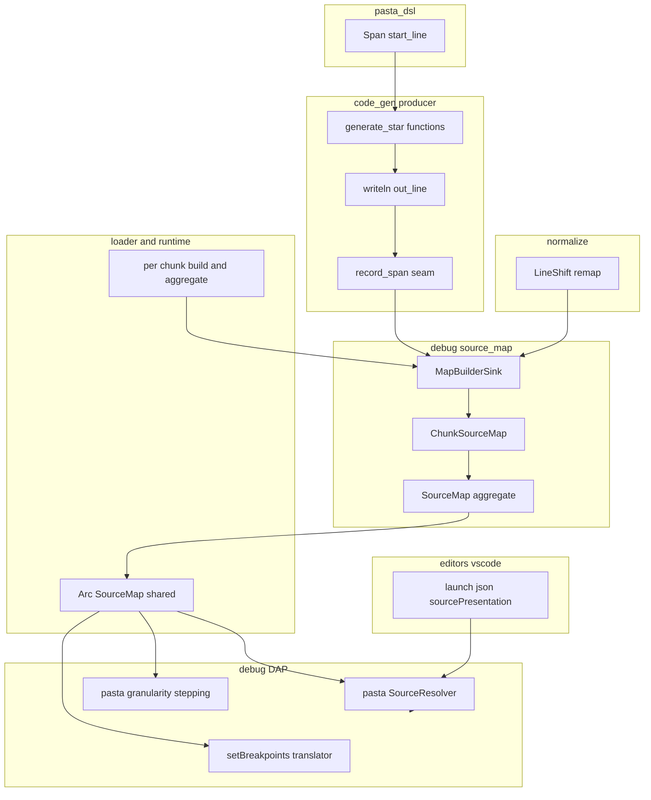
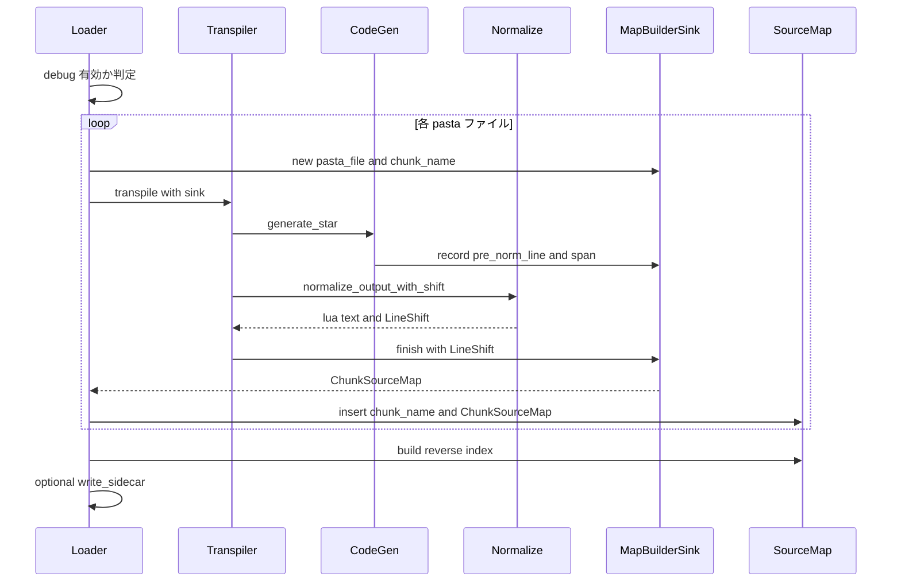
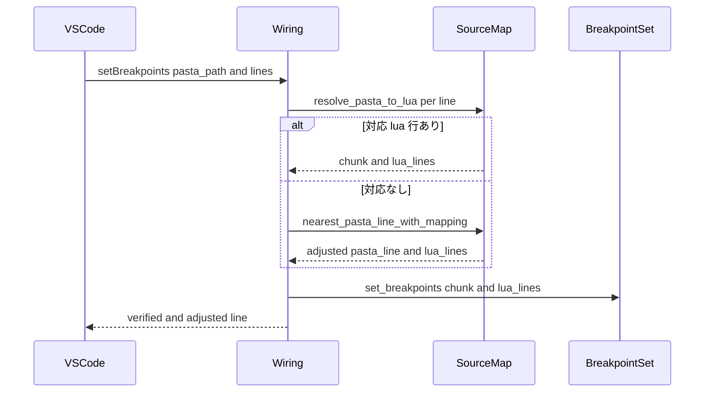
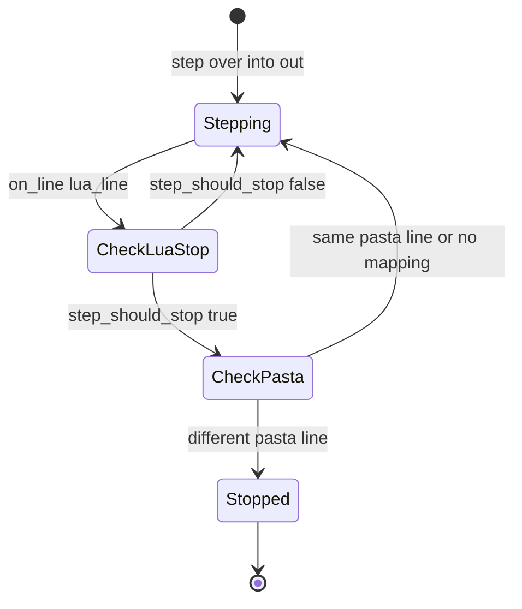
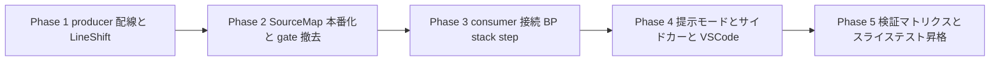

# Technical Design Document: pasta-source-map

## Overview

本仕様は、`.pasta` ソースと生成 `.lua` の間の**本番品質ソースマップ**を実装し、VSCode 上で `.pasta` ソースレベルのデバッグ体験を完成させる（Phase 5 最終目標）。先行仕様 `pasta-vscode-lua-debug`（完了）が遺した 3 つの設計シーム（producer の `SourceMapSink`、consumer の `SourceResolver` 差し替え口、薄い実証スライス `LineMap`）を**入力としてそのまま消費**し、代表経路 1 本だったマッピングを全コード生成経路へ拡張する。

**Purpose**: ゴースト作者・コントリビュータが、自分の書いた `.pasta` 行に直接ブレークポイントを張り、`.pasta` 座標で停止・コールスタック・ステップ実行できるようにする。

**Users**: VSCode で pasta ゴーストをデバッグする作者は、生成 `.lua` の存在を意識せず `.pasta` ソース上でデバッグする（必要時は `.lua` レベルへ切替）。

**Impact**: 現状すべて生成 `.lua` 行で提示されるブレークポイント・停止位置・コールスタック・ステップを、`.pasta` 座標へ写像する。Lua デバッグ基盤本体（先行仕様所有）は改修せず、シーム装着とソースマップ構築・消費のみを追加する。

### Goals
- 全コード生成経路（アクション・スコープ定義・分岐・単語定義・変数代入・呼び出し・コードブロック）に `.pasta` 位置を記録する本番ソースマップを構築する（1）
- 出力正規化による行ズレを補正し、最終 `.lua` 行から `.pasta` 位置を一意に解決する（2）
- ソースマップをメモリ内に保持（既定）し、任意でディスクサイドカー出力する（3）
- `.pasta` 行ブレークポイント・`.pasta` 座標での停止/コールスタック常時提示・`.pasta` 行単位ステップを実現する（4, 5, 9）
- `.pasta`/`.lua` 提示モードを切替可能にし、ソースマップ無効時はバイト不変・既存 Lua デバッグを劣化させない（6, 7）
- 多対多・対応なし・集約端のエッジケースで確定的挙動を保証する（8）

### Non-Goals
- Lua デバッグ基盤本体（transport / hook / inspect / session / DAP プロトコル本体）の再設計（先行仕様所有・改修は seam 装着の最小限）
- `.pasta` の編集時ラウンドトリップ（フォーマッタ・`.lua` からの逆生成）
- `.lua` 以外の生成ターゲット
- 式（`Expr`）以下の細粒度（列単位）マッピング — 行レベルで要件を満たす
- scope定義3型へのパーサ span 追加 — **既存 span で達成可能なため baseline では不要**（設計ディスカッション #1 確定・根拠は research.md D-1）

## Boundary Commitments

### This Spec Owns
- **producer 配線**: `code_gen` 全 `generate_*` での `.pasta` span 記録（`record_span`/`record_block_line` 呼び出しの全経路網羅。コードブロックは行ごとオフセット写像）と `SourceMapSink` への `record_line` 追加（`record` は糖衣化）
- **transpile API のソースマップ受け渡し口**: `LuaTranspiler` がオプショナルな `SourceMapSink` を受け取れる拡張
- **行ズレ補正**: `normalize_output` の削除写像（`LineShift`）と per-chunk マップへの適用
- **本番ソースマップ表現**: マルチチャンク `SourceMap`（`ChunkName → ChunkSourceMap` ＋ 逆引き索引）と双方向解決メソッド
- **ソースマップ構築オーケストレーション**: ローダがトランスパイル時に per-chunk マップを構築・集約し `Arc<SourceMap>` をランタイム/デバッグ基盤へ受け渡す
- **任意ディスクサイドカー出力**: 設定有効時の `.lua.map` 出力（serde_json）
- **consumer 接続**: `.pasta` SourceResolver、`setBreakpoints` の `.pasta`→`.lua` 翻訳、`stackTrace`/停止位置の `.lua`→`.pasta` 提示、`.pasta` 行単位ステップ、提示モード切替
- **暫定ハーネス整理**: feature `pasta-source-map-slice` の本番化（gate 撤去・常時コンパイル化）とデッド予約 `source_map_slice` の置換（7.3）
- **VSCode 薄い追加**: launch.json の提示モード設定（`sourcePresentation`）の素通し

### Out of Boundary
- DAP プロトコル本体・transport・hook・inspect・session 状態機械本体（先行仕様所有。session はステップ拡張のみ最小改修）
- pasta_dsl の AST/span 生成そのもの（span は既に可用。本仕様は消費側）
- 生成 `.lua` のセマンティクス変更（バイト不変を保証）
- `.pasta` 編集時ラウンドトリップ・`.lua` 以外のターゲット
- VSCode 側での `.pasta`↔`.lua` 変換ロジック（変換は完全にサーバ側 `SourceResolver` の責務）

### Allowed Dependencies
- **上流（消費）**: `pasta_dsl::Span`（位置情報）、`code_gen::source_map::{SourceMapSink, PastaPos}`（producer 語彙・常時コンパイル）、`debug::dap::SourceResolver`（差し替え口）、`debug::{BreakpointSet, DebugSession}`（既存共有構造）
- **共有基盤**: `Arc`（不変共有）、`serde_json`（既存依存・サイドカー）、`std::collections::{HashMap, BTreeMap}`
- **依存方向（厳守）**: `pasta_dsl` → `code_gen` → `normalize` → `debug::source_map` → `debug`(dap/wiring/session)。`loader`/`runtime` がオーケストレーション。`code_gen` は `debug` に依存してはならない（`MapBuilderSink` は `debug::source_map` 側に置き `code_gen::SourceMapSink` を実装することで方向を保つ）
- **依存追加禁止**: 外部 crate の新規追加（Source Map v3 ライブラリ等）は不可（最小依存方針・組込 LuaJIT 範囲内）

### Revalidation Triggers
- `SourceMapSink::{record, record_line}` / `PastaPos` のシグネチャ変更（producer 語彙の契約変更）
- `SourceResolver` 型（`Box<dyn Fn(&str,u32)->ResolvedSource + Send>`）の形変更
- チャンク命名規則（`@<絶対 .lua パス>`）の変更 — フック source 突合に直結
- `DebugConfig`/`enable()` シグネチャ変更（LineMap 注入口・`SourceMode`）
- トランスパイル単位（1 `.pasta` = 1 チャンク）の変更
- VSCode attach 引数スキーマ（`sourcePresentation`）の変更

## Architecture

### Existing Architecture Analysis

| 既存資産 | 状態 | 本仕様の扱い |
|---------|------|------------|
| `code_gen::source_map::{SourceMapSink, PastaPos}` | 常時コンパイル・本番 `None` でゼロコスト | そのまま消費（契約不変） |
| `LuaCodeGenerator` の `out_line`/`record_span`/`writeln` 4 経路 | 実装済・`record_span` 配線は `generate_action` のみ | 全 `generate_*` へ配線拡張 |
| `LuaTranspiler::transpile()` / `TranspileContext` | sink を通さない（本番ローダから到達不能） | sink 受け渡し口を追加 |
| `normalize_output` | 単一パス・行削除のみ・削除写像を破棄 | 削除写像を返す版を追加 |
| `debug::source_map`（`LineMap`/`SliceSink`/`resolve_lua_to_pasta`） | feature `pasta-source-map-slice` 配下・代表経路のみ | gate 撤去・マルチチャンク本番化 |
| `debug::dap::SourceResolver` 差し替え口 | 既定 `.lua` resolver・`set_source_resolver` | `.pasta` resolver を実装し `enable()` で装着 |
| `BreakpointSet`（`Arc<Mutex<HashSet>>`・`(source,line)` 完全一致） | 実行中書込可・リクエスト跨ぎ生存 | `.lua` chunk 名で突合（BP 永続性を継承） |
| `DebugSession`/`StepController`（`.lua` 行粒度） | coroutine identity + stack depth 判定 | `SourceMap`/`SourceMode` 注入で `.pasta` 粒度追加 |
| `DebugConfig.source_map_slice: bool` | 常時 `false` のデッド予約 | `SourceMode` enum へ置換 |
| VSCode 拡張（attach・host/port・`pasta`/`lua` BP 登録済） | 提示モード設定なし | `sourcePresentation` 素通し追加 |

### Architecture Pattern & Boundary Map

**Selected pattern**: 既存シーム接続（Extend）＋ 単一双方向写像抽象。producer がトランスパイル時に span を記録し、行ズレ補正後にマルチチャンク `SourceMap` を構築、`Arc` で consumer（BP 翻訳・stack 提示・ステップ）3 点へ不変配布する。



**Architecture Integration**:
- **選択パターン**: 既存シーム接続。新規層を作らず、検証済みシームを本番品質へ拡張（research.md D-4 Build vs Adopt）
- **境界分離**: producer（記録）／map 表現（双方向写像）／orchestration（構築・配布）／consumer（提示・BP・ステップ）／editor（設定素通し）の 5 ドメイン。各ドメインは依存方向の左側のみに依存
- **保持パターン**: `Arc<SourceMap>` 不変共有（`BreakpointSet` と同じパターン）。トランスパイル完了後にマップは不変
- **新規コンポーネント理由**: `SourceMap`/`MapBuilderSink`/`LineShift` はスライスの単一ファイル前提をマルチチャンク・行ズレ補正へ一般化するために必要
- **steering 準拠**: 外部依存追加なし（最小依存）、`Result<T, PastaError>` 系エラー、ゼロコスト（debug 無効時 sink=None）

### Technology Stack

| Layer | Choice / Version | Role in Feature | Notes |
|-------|------------------|-----------------|-------|
| Backend / Transpiler | Rust 2024 / `pasta_lua` | span 記録・行ズレ補正・マップ構築 | 既存 `code_gen`/`normalize`/`loader` を拡張 |
| Data / Map | `std::collections::{HashMap, BTreeMap}` ＋ `Arc` | マルチチャンク双方向写像・不変共有 | 新規依存なし |
| Serialization | `serde_json 1`（既存依存） | 任意ディスクサイドカー出力 | Source Map v3 は不採択（research.md D-4） |
| Runtime / Debug | LuaJIT 2.1（mlua 0.11）＋ 既存 DAP バックエンド | フック source 突合・DAP 提示 | チャンク名 = `@<絶対 .lua パス>`（実測確認要） |
| Editor | VSCode 拡張（TypeScript） | launch.json `sourcePresentation` 素通し | 変換ロジックは持たない |

## File Structure Plan

### Modified Files — producer（code_gen / transpiler / normalize）
- `crates/pasta_lua/src/code_gen/scope_gen.rs` — `record_span` を全 scope `generate_*`（`generate_actor` / `generate_global_scene` / `generate_local_scene` / `generate_choice` / `generate_choice_timeout`）へ配線。scope ヘッダの `.lua` 出力行で `scope.span`（`start_line`＝定義ヘッダ行）を記録（1.4, 1.5）
- `crates/pasta_lua/src/code_gen/element_gen.rs` — `record_span` を残り要素（`generate_var_set` / `generate_call_scene` / `generate_word_definition` / `generate_global_word` / `generate_local_word` / `generate_code_block`）へ配線（1.1〜1.4）
- `crates/pasta_lua/src/code_gen/mod.rs` — `record_span` ヘルパは現状維持。必要なら複数行要素（`write_raw` 経由）対応の最小調整のみ
- `crates/pasta_lua/src/transpiler.rs` — `transpile` にオプショナル `&mut dyn SourceMapSink` 受け渡し口を追加。既存シグネチャは sink なしの薄いラッパで互換維持。normalize は削除写像を返す版へ差し替え、確定後に sink の per-chunk マップを rebase
- `crates/pasta_lua/src/context.rs` — `TranspileContext` に sink 参照を通す（必要時）
- `crates/pasta_lua/src/normalize.rs` — `LineShift` 型と `normalize_output_with_shift(input) -> (String, LineShift)` を追加。既存 `normalize_output` は新関数の薄いラッパで互換維持（2.1）

### Modified Files — map 表現 ＋ consumer（debug）
- `crates/pasta_lua/src/debug/source_map.rs` — **feature gate 撤去・本番化**。`ChunkName`/`ChunkSourceMap`/`SourceMap`/`PastaIndex`/`MapBuilderSink` を追加、`SliceSink`→`MapBuilderSink`、`LineMap`→`ChunkSourceMap` へ一般化、`resolve_*` メソッド群、`write_sidecar`（3.2）
- `crates/pasta_lua/src/debug/mod.rs` — `#[cfg(feature)]` 撤去（59-60）。`SourceMode` enum 追加、`DebugConfig.source_mode`（`source_map_slice` 削除）、`enable()` に `Option<Arc<SourceMap>>` 引数追加、`DebugConfig::resolve` に提示モード合成（6.1, 7.3）
- `crates/pasta_lua/src/debug/dap.rs` — `pasta_source_resolver(Arc<SourceMap>) -> SourceResolver` 追加、`attach` 引数で `sourcePresentation` 受領、`encode_frames` は既存 `resolver(...)` 呼び出しを維持（5.1, 5.2, 5.3, 6.2）
- `crates/pasta_lua/src/debug/wiring.rs` — `setBreakpoints` の `.pasta`→`.lua` 翻訳結線、`Arc<SourceMap>`/`SourceMode` を resolver/session/BP 翻訳へ配布（4.1, 4.3）
- `crates/pasta_lua/src/debug/session.rs` — `RunMode::Stepping` に起点 `.pasta` 位置を追加、`Arc<SourceMap>`＋`SourceMode` 注入、`.pasta` 粒度ステップ判定（9.1〜9.5）
- `crates/pasta_lua/src/debug/breakpoints.rs` — `Breakpoint` を二段キー化（提示 source path ＋ 実行座標 `(chunk, lua_line)`）。retain は提示 source 単位、`should_pause` は実行座標突合（議題5）。BP 永続性は Arc 継承

### Modified Files — orchestration（loader / runtime / config）
- `crates/pasta_lua/src/loader/mod.rs` — debug 有効時、各 `.pasta` のトランスパイルに `MapBuilderSink` を装着し per-chunk `ChunkSourceMap` を構築、チャンク名キーで `SourceMap` へ集約（3.1, 1.1）
- `crates/pasta_lua/src/loader/cache.rs` — チャンク名（絶対 `.lua` パス）算出を公開／再利用（`source_to_cache_path` ベース）。フック source と一致するキー生成
- `crates/pasta_lua/src/runtime/mod.rs` — 集約 `Arc<SourceMap>` を保持し `with_config`→`enable()` へ受け渡し
- `crates/pasta_lua/src/runtime/runtime_config.rs` — debug config 伝播に `source_mode` を追加
- `crates/pasta_lua/src/loader/config.rs` — pasta.toml `[debug]` に提示モード（例 `present_as`）とサイドカー有効化（`source_map_sidecar`）を追加（6.3 / 3.2 フォールバック供給）

### Modified Files — Cargo / VSCode
- `crates/pasta_lua/Cargo.toml` — `[features]` の `pasta-source-map-slice` 削除（7.3）
- `editors/vscode/package.json` — attach `configurationAttributes.attach.properties` に `sourcePresentation`（`pasta`/`lua`・既定 `pasta`）追加（6.3）
- `editors/vscode/src/debugAttachTarget.ts` — `sourcePresentation` を attach config から読み取り素通し（変換ロジックなし）
- `editors/vscode/src/debugAdapterFactory.ts` — 必要なら設定素通しの最小調整

### New / Promoted Tests
- `crates/pasta_lua/tests/transpiler/` — 構文種別ごとの `record_span` 網羅、normalize 行ズレ補正、ゼロコスト回帰（debug 無効でバイト不変）
- `crates/pasta_lua/tests/` — `.pasta` BP ヒット / stackTrace 提示 / `.pasta` 粒度ステップ / 提示モード切替 / サイドカー の E2E。既存スライス E2E を本番テストへ昇格

> 各ファイルは単一責務。producer（記録）と debug（写像消費）の境界は `code_gen::SourceMapSink` trait で分離され、並行実装可能。

## System Flows

### Flow 1: トランスパイル時のソースマップ構築（R1, R2, R3.1）



normalize 適用後、`MapBuilderSink::finish(shift)` が記録済み pre-normalize 行を `LineShift` で最終 `.lua` 行へ rebase する。削除された行（空行＝`.pasta` 由来なし）はマップに含まれないためマッピングは失われない（2.1, 2.2, 2.3）。

### Flow 2: `.pasta` ブレークポイント解決（R4, R8）



`.pasta` 1 行が複数 `.lua` 行に展開される場合は全 `.lua` 行を登録（4.1, 8.2）。対応行がない場合は後続最近接の `.pasta` 対応行へ調整し、調整後の有効位置を `verified`＋`line` で返す（4.3）。1 `.pasta`＝1 チャンクのため per-source 置換セマンティクスは対応チャンクへ 1:1 で維持される。

### Flow 3: 停止位置・コールスタックの `.pasta` 提示（R5）と提示モード（R6）

停止時、session が `.lua` 座標で `FrameInfo` を生成 → DAP `encode_frames` が各フレームで `resolver(&f.source, f.line)` を呼ぶ。提示モード `Pasta`（既定）では `pasta_source_resolver` が `SourceMap::resolve_lua_to_pasta(chunk, lua_line)` で `.pasta` `{path, line}` を返す。対応なしフレームは既定 `.lua` resolver へフォールバックし、対応無きことが判別できる形で提示する（5.3）。提示モード `Lua` では既定 resolver のまま `.lua` 座標を提示する（6.2）。変数・コルーチン inspect は提示モードに依らず継続利用可能（5.4・既存機能不変）。

### Flow 4: `.pasta` 行単位ステップ（R9）



提示モード `Pasta` では、`step_should_stop`（既存・`.lua` 粒度）が true を返した後、現 `.lua` 行の `.pasta` 位置を解決し、ステップ起点 `.pasta` 位置と同一 or 未対応なら停止せず継続する（9.1, 9.4）。step into は呼び出し先の最初の `.pasta` 対応行で停止（9.2）、step out は呼び出し元の次の `.pasta` 対応行で停止（9.3）。提示モード `Lua` では従来どおり `.lua` 行単位（9.5）。

## Requirements Traceability

| Requirement | Summary | Components | Interfaces | Flows |
|-------------|---------|------------|------------|-------|
| 1.1 | 全構文要素の `.lua`→`.pasta` 記録 | RecordWiring, MapBuilderSink | `record_span`, `SourceMapSink::record` | Flow 1 |
| 1.2 | 対応あり/なし（補助行）の区別 | ChunkSourceMap | `pasta_for_lua -> Option` | Flow 1 |
| 1.3 | 1 要素→複数 `.lua` 行を全対応 | RecordWiring | `record_span`（要素の全出力行） | Flow 1 |
| 1.4 | 主要全構文種別の網羅 | RecordWiring（scope_gen/element_gen） | `record_span` | Flow 1 |
| 1.5 | scope定義ヘッダ行を BP 対象に | RecordWiring（scope `generate_*`） | `record(header_line, scope.span)` | Flow 1 |
| 2.1 | normalize 行ズレ補正 | LineShift, MapBuilderSink | `normalize_output_with_shift`, `finish` | Flow 1 |
| 2.2 | 最終 `.lua` 行から一意解決 | ChunkSourceMap | `pasta_for_lua` | Flow 1, 3 |
| 2.3 | 確定不能行は「対応なし」明示 | ChunkSourceMap | `pasta_for_lua -> None` | Flow 1, 3 |
| 3.1 | メモリ保持・中間ファイル不要 | SourceMap, Loader | `Arc<SourceMap>` | Flow 1 |
| 3.2 | 任意ディスクサイドカー出力 | SidecarWriter | `write_sidecar` | Flow 1 |
| 3.3 | 双方向変換にマップ使用 | SourceMap | `resolve_lua_to_pasta`, `resolve_pasta_to_lua` | Flow 2, 3 |
| 4.1 | `.pasta` 行 BP を `.lua` 行群へ登録 | BpTranslator | `resolve_pasta_to_lua`, `set_breakpoints` | Flow 2 |
| 4.2 | `.lua` 行到達で `.pasta` BP 停止 | BreakpointSet（既存） | `should_pause` | Flow 2 |
| 4.3 | 対応行なしは最近接へ調整・提示 | BpTranslator, SourceMap | `nearest_pasta_line_with_mapping` | Flow 2 |
| 4.4 | BP のセッション跨ぎ維持 | BreakpointSet（既存 Arc） | — | Flow 2 |
| 5.1 | 停止位置を `.pasta` 提示 | PastaSourceResolver | `resolve_lua_to_pasta` | Flow 3 |
| 5.2 | コールスタック各フレーム `.pasta` 提示 | PastaSourceResolver, encode_frames | `resolver(source,line)` | Flow 3 |
| 5.3 | 対応なしは `.lua` フォールバック | PastaSourceResolver | `default_source_resolver` | Flow 3 |
| 5.4 | inspect 機能を継続利用可 | 既存 inspect（不変） | — | Flow 3 |
| 6.1 | 既定提示モード `.pasta` | SourceMode, DebugConfig | `SourceMode::Pasta` | Flow 3 |
| 6.2 | `.lua` モードで `.lua` 座標提示 | SourceMode, default resolver | — | Flow 3 |
| 6.3 | デバッグ構成で提示モード指定 | VscodeAttach, DebugConfig::resolve | `sourcePresentation` attach 引数 | Flow 3 |
| 7.1 | 無効時バイト不変 | RecordWiring（sink=None） | `record_span` no-op | Flow 1 |
| 7.2 | 既存 Lua デバッグ継続動作 | 既存基盤（不変） | — | — |
| 7.3 | 暫定 feature gate 統合/除去 | SourceMapModule（gate 撤去） | — | — |
| 8.1 | 集約行に確定的単一 `.pasta` 位置 | ChunkSourceMap | `pasta_for_lua`（last-write-wins） | Flow 2, 3 |
| 8.2 | 展開行は同一 `.pasta` 行提示 | ChunkSourceMap | `lua_lines_for_pasta` | Flow 2 |
| 8.3 | 提示順序の安定（決定的） | ChunkSourceMap（BTreeMap） | — | Flow 2, 3 |
| 9.1 | step over を `.pasta` 行単位 | PastaStepper | `RunMode::Stepping` 拡張 | Flow 4 |
| 9.2 | step into で最初の `.pasta` 行停止 | PastaStepper | `step_should_stop`＋pasta 判定 | Flow 4 |
| 9.3 | step out で次の `.pasta` 行停止 | PastaStepper | 同上 | Flow 4 |
| 9.4 | 対応なし行は通過 | PastaStepper | `resolve_lua_to_pasta -> None` | Flow 4 |
| 9.5 | `.lua` モードは従来通り | SourceMode | — | Flow 4 |

## Components and Interfaces

| Component | Domain/Layer | Intent | Req Coverage | Key Dependencies (P0/P1) | Contracts |
|-----------|--------------|--------|--------------|--------------------------|-----------|
| RecordWiring | producer (code_gen) | 全 `generate_*` で span 記録 | 1.1–1.5, 7.1 | SourceMapSink (P0), Span (P0) | Service |
| TranspileSinkPort | producer (transpiler) | sink を transpile へ受け渡し | 1.1, 3.1, 7.1 | code_gen (P0) | Service |
| LineShift | producer (normalize) | 行ズレ削除写像 | 2.1 | normalize_output (P0) | Service |
| MapBuilderSink | map (debug::source_map) | record→ChunkSourceMap 構築 | 1.1–1.3, 2.1 | SourceMapSink (P0), LineShift (P0) | Service, State |
| ChunkSourceMap | map (debug::source_map) | 1 チャンク双方向行写像 | 1.2, 2.2, 8.1–8.3 | — | State |
| SourceMap | map (debug::source_map) | マルチチャンク集約・双方向解決 | 3.1, 3.3, 4.1, 4.3, 5.1 | ChunkSourceMap (P0), Arc (P0) | State |
| SidecarWriter | map (debug::source_map) | 任意 JSON サイドカー出力 | 3.2 | serde_json (P1), SourceMap (P0) | Batch |
| SourceMapBuilder | orchestration (loader/runtime) | per-chunk 構築・集約・配布 | 1.1, 3.1, 3.3 | Transpiler (P0), SourceMap (P0), cache (P0) | Service |
| PastaSourceResolver | consumer (debug::dap) | `.lua`→`.pasta` 提示 | 5.1–5.3, 6.2 | SourceResolver (P0), SourceMap (P0) | Service |
| BpTranslator | consumer (debug::wiring) | `.pasta`→`.lua` BP 翻訳・二段キー | 4.1, 4.3, 4.4, 8.2 | SourceMap (P0), BreakpointSet (P0) | Service, State |
| PastaStepper | consumer (debug::session) | `.pasta` 粒度ステップ | 9.1–9.5 | SourceMap (P0), StepController (P0) | State |
| SourceMode / DebugConfig | consumer (debug::mod) | 提示モード設定・LineMap 注入 | 6.1–6.3, 7.3 | DebugConfig::resolve (P0) | State |
| VscodeAttach | editor (editors/vscode) | `sourcePresentation` 素通し | 6.3 | DAP attach (P1) | API |

### producer ドメイン

#### RecordWiring

| Field | Detail |
|-------|--------|
| Intent | 全 `generate_*` の `.lua` 出力行に由来 `.pasta` span を記録する |
| Requirements | 1.1, 1.2, 1.3, 1.4, 1.5, 7.1 |

**Responsibilities & Constraints**
- 各 `generate_*` 関数で、対象構文要素が `.lua` 行を出力した時、その出力行群に AST ノードの `span` を対応づける（`generate_action` の `out_line` デルタ検出パターンを踏襲）
- scope `generate_*`（actor/global/local scene）は scope ヘッダの `.lua` 出力行で `scope.span` を記録する（`span.start_line` ＝ `.pasta` 定義ヘッダ行）（1.5）
- **コードブロック（議題3）**: `generate_code_block` は各出力行を `record_block_line(block.span.start_line + 行オフセット)` で対応 `.pasta` 行へ**個別**記録する（1:1 行対応・ブロック内 BP 精度確保）。前提（ブロックが 1:1 行数保存で出力）を実装時に確認し、非 1:1 なら定数オフセット補正
- sink が `None`（debug 無効・本番既定）の時、`record_span`/`record_block_line` は no-op で出力バイト不変（7.1）
- `code_gen` は `debug` に依存しない（`SourceMapSink` trait のみ参照）

**Dependencies**
- Outbound: `SourceMapSink::record` — span 記録（P0）
- Inbound: AST ノード `span` — `pasta_dsl::Span`（P0）

**Contracts**: Service [x]

##### Service Interface
```rust
// code_gen::source_map（議題3: record_line を追加し record を糖衣化）
pub trait SourceMapSink {
    /// 出力 .lua 行を .pasta 行へ直接対応づける（コードブロック等の行ごとオフセット写像用）。
    fn record_line(&mut self, lua_line: u32, pasta_line: u32);
    /// span.start_line を用いる糖衣（既存 record 呼び出しと互換）。
    fn record(&mut self, lua_line: u32, span: pasta_dsl::parser::Span) {
        self.record_line(lua_line, span.start_line as u32);
    }
}

// LuaCodeGenerator 内（既存・全 generate_* で利用拡張）
fn record_span(&mut self, span: Span);              // sink=Some かつ span.is_valid() の時のみ record(out_line, span)
fn record_block_line(&mut self, pasta_line: u32);  // コードブロック各行で record_line(out_line, pasta_line)
```
- Preconditions: span は対象要素の有効 span（`is_valid()` ＝ `end_byte > 0`）
- Postconditions: 出力された各 `.lua` 行（pre-normalize `out_line`）に span が対応づく。複数行要素は全行に同一 span
- Invariants: sink=None で出力バイト不変（7.1）。記録は決定論的（codegen 単一スレッド）

**Implementation Notes**
- Integration: `generate_action` の `out_line_before` デルタ検出パターンを各 `generate_*` へ展開。複数行出力要素（code_block 等）は出力行範囲全体に記録
- Validation: 構文種別ごとに「記録された `.lua` 行 → 期待 `.pasta` 行」を検証する網羅テスト
- Risks: 配線漏れ。`record_span` を `writeln` 直前に集約し網羅テストで担保

#### LineShift

| Field | Detail |
|-------|--------|
| Intent | normalize による行削除を old→new 行写像として表現する |
| Requirements | 2.1 |

**Contracts**: Service [x]

##### Service Interface
```rust
// normalize.rs
pub struct LineShift { deleted: Vec<u32> } // 削除された pre-normalize 行番号（昇順）

impl LineShift {
    /// pre-normalize 行 → 最終 .lua 行。削除行は None。
    pub fn map(&self, pre_line: u32) -> Option<u32>;
}

/// 既存 normalize_output と等価な出力 ＋ 削除写像を返す。
pub fn normalize_output_with_shift(input: &str) -> (String, LineShift);
```
- Preconditions: input は code_gen の中間バッファ全体
- Postconditions: 出力文字列は既存 `normalize_output(input)` とバイト一致。`LineShift` は削除行（`end` 直前空行・末尾空白）を網羅
- Invariants: 削除のみ（増加/マージ/挿入なし）。`map` は単調増加。削除行は空行＝`.pasta` 由来なし
- 既存 `normalize_output` は `normalize_output_with_shift().0` を返す薄いラッパで互換維持

### map 表現ドメイン

#### MapBuilderSink

| Field | Detail |
|-------|--------|
| Intent | producer の record コールバックから 1 チャンクのマップを構築する |
| Requirements | 1.1, 1.2, 1.3, 2.1 |

**Contracts**: Service [x] / State [x]

##### Service Interface
```rust
// debug::source_map
pub struct MapBuilderSink {
    pasta_file: String,
    chunk_name: ChunkName,
    pre_norm: BTreeMap<u32, PastaPos>, // pre-normalize lua_line -> PastaPos
}

impl MapBuilderSink {
    pub fn new(pasta_file: String, chunk_name: ChunkName) -> Self;
    /// normalize の LineShift を適用し最終 ChunkSourceMap を確定。
    pub fn finish(self, shift: &LineShift) -> ChunkSourceMap;
}

impl code_gen::source_map::SourceMapSink for MapBuilderSink {
    fn record_line(&mut self, lua_line: u32, pasta_line: u32) {
        // span.start_line（または code_block の行オフセット）を直接採用（byte 走査廃止・research.md D-3）
        self.pre_norm.insert(lua_line, PastaPos { file: self.pasta_file.clone(), line: pasta_line });
    }
    // record(lua_line, span) は trait 既定（record_line(lua_line, span.start_line)）を使用
}
```
- Preconditions: `record` は pre-normalize `out_line` で呼ばれる
- Postconditions: `finish` は `pre_norm` の各行を `shift.map` で最終 `.lua` 行へ rebase。削除行（`None`）は除外
- Invariants: 同一 pre-normalize 行は last-write-wins（決定論的・8.1）

#### ChunkSourceMap / SourceMap

| Field | Detail |
|-------|--------|
| Intent | 1 チャンク／全チャンクの双方向行写像と解決 |
| Requirements | 1.2, 2.2, 2.3, 3.1, 3.3, 4.1, 4.3, 5.1, 8.1, 8.2, 8.3 |

**Responsibilities & Constraints**
- `ChunkName` はフックが報告する source 文字列（`@<絶対 .lua パス>`）に**正規化キーで**一致させる（research.md D-2）
- トランスパイル完了後は不変。`Arc<SourceMap>` で consumer 3 点（resolver/BP 翻訳/stepper）へ共有
- 逆引き索引は `.pasta` ファイル（正規化済み絶対パス）＋行 → `[(ChunkName, lua_line)]`（昇順）

**Source Identity（議題2 確定・構築時一致＋正規化＋実測）**
- **構築時一致**: `chunks` のキーは **ローダの package.path/キャッシュ解決と同一のパス構築コードを共有**して生成し、`loadfile` が付ける `@<絶対 .lua パス>` と構築時点で一致させる（推測しない）
- **正規化フォールバック**: chunk名・`.pasta` パスの両方を照合前に canonicalize（`@` 除去・パス区切り統一・Windows は大小文字無視・絶対化）。全 `resolve_*`/格納はこの正規化キーで行う（残差吸収の保険）
- **エスカレーション**: 実測で canonicalize でも一致不能な致命ケースに限り、chunk 名の明示命名（`set_name`）へ切替（境界波及・Revalidation Trigger 該当のため最終手段）

**Contracts**: State [x]

##### State Management
```rust
// debug::source_map
pub type ChunkName = String;
pub use crate::code_gen::source_map::PastaPos; // { file: String, line: u32 }

pub struct ChunkSourceMap {
    forward: BTreeMap<u32, PastaPos>, // 最終 .lua line -> PastaPos
}
impl ChunkSourceMap {
    pub fn pasta_for_lua(&self, lua_line: u32) -> Option<&PastaPos>;     // 2.2, 1.2
    pub fn lua_lines_for_pasta(&self, pasta_line: u32) -> Vec<u32>;      // 8.2（昇順）
}

pub struct SourceMap {
    chunks: HashMap<ChunkName, ChunkSourceMap>,
    // 逆引き: pasta file -> (pasta line -> [(chunk, lua line)])
    reverse: HashMap<String, BTreeMap<u32, Vec<(ChunkName, u32)>>>,
}
impl SourceMap {
    pub fn resolve_lua_to_pasta(&self, chunk: &str, lua_line: u32) -> Option<&PastaPos>;        // 5.1, 3.3
    pub fn resolve_pasta_to_lua(&self, pasta_file: &str, pasta_line: u32) -> Vec<(ChunkName, u32)>; // 4.1, 3.3
    /// 要求行以上で対応を持つ最初の .pasta 行（R4.3 最近接調整）。
    pub fn nearest_pasta_line_with_mapping(&self, pasta_file: &str, from_line: u32) -> Option<u32>;
}
```
- Persistence & consistency: メモリ既定（3.1）。`Arc` 不変共有でスレッド安全
- Concurrency strategy: 構築（producer・単一スレッド）→ `Arc` 凍結 → 読み取り専用共有（consumer 複数スレッド）

**Implementation Notes**
- Integration: `chunks` キーは `loader::cache` のパス構築コードを共有して `@<絶対 .lua パス>` を構築時一致。`resolve_*` は正規化キーで照合
- Validation Hook（最優先タスク）: 実装の最初に `debug.getinfo` でフック source の実機文字列形を実測し producer キーと一致を確認（research.md D-2）。`.pasta` 側は VSCode `source.path` と `PastaPos.file` の正規化一致を E2E で確認
- Risks: チャンク名の実機文字列差異。構築時一致＋正規化＋実測の三段で防御。残存致命時のみ `set_name` 明示命名へ

#### SidecarWriter

**Contracts**: Batch [x]
- Trigger: `source_map_sidecar`（pasta.toml `[debug]` ＋ env `PASTA_DEBUG_SOURCE_MAP_SIDECAR`・既定 `false`）が有効な時（3.2）。`DebugConfig::resolve` で合成（env>file>既定、A1 と同規約）
- Input: per-chunk `ChunkSourceMap`（集約 `SourceMap` から）
- Output: 各生成 `.lua` の隣に `<chunk>.lua.map`（serde_json・`version`＋`pasta_file`＋行ペア列 `[lua_line, pasta_line]`）。Source Map v3 非採用（research.md D-4）
- Idempotency: 決定論的出力。再トランスパイルで同一内容
- 失敗時は非致命（警告ログ・メモリ既定経路は不変）

### consumer ドメイン

#### PastaSourceResolver

**Contracts**: Service [x]

##### Service Interface
```rust
// debug::dap（既存 SourceResolver 型を消費）
pub type SourceResolver = Box<dyn Fn(&str, u32) -> ResolvedSource + Send>; // 既存・契約不変

pub fn pasta_source_resolver(map: Arc<SourceMap>) -> SourceResolver {
    Box::new(move |lua_source, lua_line| {
        match map.resolve_lua_to_pasta(lua_source, lua_line) {
            Some(pos) => ResolvedSource { source: json!({ "path": pos.file }), line: pos.line }, // 5.1, 5.2
            None => default_source_resolver()(lua_source, lua_line),                            // 5.3 フォールバック
        }
    })
}
```
- Preconditions: `lua_source` はフック報告の chunk 名、`lua_line` は実行行
- Postconditions: 対応ありは `.pasta` `{path, line}`、なしは `.lua` 維持（判別可能）
- Integration: `enable()` 内で `SourceMode::Pasta`（既定）時に `DapAdapter::set_source_resolver` で装着。`Lua` 時は既定 resolver のまま（6.2）

#### BpTranslator

**Contracts**: Service [x] / State [x]
- `setBreakpoints` の source が `.pasta` の時、`resolve_pasta_to_lua` で `(chunk, lua_lines)` へ翻訳し `BreakpointSet` に登録（4.1）。`.lua` の時は従来どおり直接登録
- 対応行なしは `nearest_pasta_line_with_mapping` で後続最近接へ調整、DAP レスポンスで `verified`＋調整後 `line` を返す（4.3）
- **二段キー（議題5 確定・提示モード混在対応）**:

```rust
// debug::breakpoints（二段キー拡張）
struct Breakpoint {
    present_source: String,   // DAP source path（.pasta or .lua）= retain/置換キー
    chunk: ChunkName,         // 解決済み実行座標 = should_pause 突合キー
    lua_line: u32,
}
```
  `set_breakpoints` の retain/置換は**提示 source path 単位**（VSCode の source 単位置換モデルと一致）、`should_pause` は**実行座標 `(chunk, lua_line)`** で突合。`.pasta`/`.lua` 由来 BP が同一 chunk に混在しても提示空間が異なれば衝突せず、将来の結合トランスパイルにも頑健
- BP 永続性は既存 `BreakpointSet`（Arc）を継承（4.4）
- Risks: 1 `.pasta` 行が複数 `.lua` 行へ展開時は全行を実行座標として登録（8.2）

#### PastaStepper

**Contracts**: State [x]

##### State Management
```rust
// debug::session（既存 RunMode を拡張）
enum RunMode {
    Running,
    Stepping {
        kind: StepKind,            // 既存 Over/In/Out
        thread: ThreadId,          // 既存（frame identity）
        base_depth: usize,         // 既存（frame identity）
        start_line: u32,           // 既存（.lua）
        origin_pasta: Option<(ChunkName, u32)>, // 追加: 起点 .pasta 位置（Pasta モードのみ。thread/base_depth と併せ frame identity を構成）
    },
}
```
- 注入: `enable`→`wiring`→`DebugSession` に `Arc<SourceMap>`＋`SourceMode`
- **停止判定（議題4 確定・In-place 拡張）**: 既存 `step_should_stop`（`.lua` 粒度）が true を返した後、`Pasta` モードなら順に評価:
  1. 現フレームが起点フレームでない（`thread != origin.thread` または `depth != base_depth`）→ 既存 `.lua` 判定に従う（サブ呼び出し/再帰は depth で自然に別扱い・E2/E5）
  2. 現 `.lua` 行が `.pasta` 未対応（`resolve_lua_to_pasta == None`）→ 継続（通過・E6/9.4）
  3. 現 `.pasta` 位置が `origin_pasta` と同一（同 chunk・同行）→ 継続（同一 `.pasta` 行を消化・E1/9.1）
  4. それ以外（同フレームで異なる `.pasta` 対応行）→ 停止
- **step into（9.2/E3）**: 呼び出し先進入（最初の `depth > base_depth` 停止）で `origin_pasta` を破棄し、最初の `.pasta` 対応行で停止
- **step out（9.3/E4）**: 呼び出し元復帰後、呼出行の `.pasta` 行と異なる最初の対応行で停止
- frame identity は `(thread, base_depth, chunk, pasta_line)` の複合で判定し、再帰・サブ呼び出しの誤停止を構造的に防止
- `Lua` モードは従来通り `.lua` 粒度（9.5）。BP は stepping 中も優先停止（既存不変）
- 状態表（StepKind × depth変化 × pasta対応 × chunk一致）と E2E（E1–E8）は tasks で網羅

#### SourceMode / DebugConfig

##### State Management
```rust
// debug::mod
pub enum SourceMode { Pasta, Lua } // 既定 Pasta（6.1）

pub struct DebugConfig {
    pub enabled: bool,
    pub listen: /* 既存 */,
    pub source_mode: SourceMode,    // source_map_slice: bool を置換（7.3・既定 Pasta）
    pub source_map_sidecar: bool,   // 任意ディスクサイドカー出力（3.2・既定 false）
}

// enable に LineMap 注入口を追加
pub fn enable(
    lua: &Lua,
    config: &DebugConfig,
    source_map: Option<Arc<SourceMap>>, // 追加
) -> Result<Option<DebugHandle>, DebugError>;
```
- `DebugConfig::resolve` で提示モードを合成（precedence: DAP attach 引数 > env > pasta.toml `[debug]` > 既定 `Pasta`）。既存 `enabled`/`port` の env>file 規約に整合させる。VSCode の `sourcePresentation` は**明示指定時のみ** attach 引数へ載せ、未指定時はサーバ側設定（env>file>既定）が決定する（クライアント既定値で env/file 上書きを起こさない）
- `source_map` が `Some` かつ `SourceMode::Pasta` の時のみ `.pasta` resolver/BP 翻訳/stepper を装着。`None`/`Lua` は既定 `.lua` 挙動

### editor ドメイン

#### VscodeAttach

**Contracts**: API [x]
- `editors/vscode/package.json` の attach `configurationAttributes` に `sourcePresentation`（enum `pasta`/`lua`・既定 `pasta`）を追加（6.3）
- `debugAttachTarget.ts` が attach config から読み取り DAP `attach` 引数へ素通し。`.pasta`↔`.lua` 変換は持たない（サーバ責務）
- `contributes.breakpoints` は `pasta`/`lua` 両対応済みのため追加不要

## Data Models

### Domain Model
- **PastaPos**（値オブジェクト）: `{ file: String, line: u32 }`。`.pasta` 上の位置。`code_gen::source_map` 所有（依存方向のため）
- **ChunkSourceMap**（エンティティ）: 1 Lua チャンクの `lua_line → PastaPos` 写像。不変条件: 1 `.lua` 行 → 高々 1 `PastaPos`（8.1）
- **SourceMap**（集約ルート）: `ChunkName → ChunkSourceMap` ＋ 逆引き索引。不変条件: トランスパイル完了後は不変・`Arc` 共有
- **LineShift**（値オブジェクト）: normalize 削除行集合。`map(pre)->Option<final>` は単調

### Data Contracts & Integration
- **サイドカー（任意）**: `.lua.map` JSON。スキーマ（行ペア列・チャンク名・`.pasta` ファイル）。後方/前方互換のため `version` フィールドを持つ。Source Map v3 非互換（独自・最小）
- **DAP attach 引数**: `sourcePresentation: "pasta" | "lua"`（既定 `pasta`）。VSCode → サーバ
- **チャンク名キー**: `@<絶対 .lua パス>`。`loader::cache::source_to_cache_path` から producer 側で算出、フック source と一致（実測確認要）

## Error Handling

### Error Strategy
- **マッピング欠落（対応なし）**: エラーではなく `Option::None` として正常系で扱う。BP は最近接調整（4.3）、提示は `.lua` フォールバック（5.3）、ステップは通過（9.4）
- **チャンク名不一致**: フック source が `SourceMap` キーに無い場合、`.lua` フォールバック（誤った `.pasta` 対応づけを禁止・2.3）
- **サイドカー出力失敗**: 非致命。警告ログのみでデバッグ継続（メモリ既定経路は不変・3.1）
- **debug 無効**: sink=None・`SourceMap=None` で全経路を従来挙動へ（7.1, 7.2）

### Error Categories and Responses
- **設定エラー**: 不正な `sourcePresentation` 値 → 既定 `pasta` へフォールバック＋警告
- **システムエラー**: サイドカー I/O 失敗 → graceful degradation（メモリマップ継続）
- **整合性エラー**: チャンク名不一致 → `.lua` フォールバック（誤マッピング禁止）

### Monitoring
- `tracing`（既存）で span 記録数・マップ構築サマリ（チャンク数・エントリ数）・サイドカー出力可否・チャンク名突合結果を診断ログ出力

## Testing Strategy

### Unit Tests
- `LineShift`: `end` 直前空行削除・末尾空白削除で `map(pre)->final` が正しいこと（2.1）
- `MapBuilderSink::record`/`finish`: `span.start_line` 採用・LineShift rebase・last-write-wins（1.1, 2.1, 8.1）
- `ChunkSourceMap`: `pasta_for_lua`（対応なし `None`・1.2, 2.3）／`lua_lines_for_pasta`（昇順・複数 `.lua`・8.2）
- `SourceMap`: `resolve_pasta_to_lua`／`nearest_pasta_line_with_mapping`（最近接調整・4.3）
- `DebugConfig::resolve`: 提示モード precedence（attach > toml > env > 既定 Pasta・6.1, 6.3）

### Integration Tests
- **構文種別 record 網羅**: トーク／アクション／scope定義3型ヘッダ／choice／単語定義／変数代入／call／code_block で `.lua` 行 → 期待 `.pasta` 行（1.1–1.5）
- **ゼロコスト回帰**: debug 無効（sink=None）で生成 `.lua` がバイト不変（既存スナップショットと一致・7.1）
- **マルチチャンク集約**: 複数 `.pasta` → 複数チャンク、チャンク名キーで正しく解決（3.1, 3.3）
- **サイドカー**: 出力 JSON が再読込でメモリマップと一致（3.2）

### E2E Tests（critical user flows）
- **`.pasta` BP ヒット**: `.pasta` 行 BP → `.lua` 行群登録 → 実 DebugSession 停止 → stackTrace が `.pasta` 行提示（4.1, 4.2, 5.1, 5.2。既存スライス E2E を本番化）
- **BP 最近接調整**: 対応行なし `.pasta` 行 BP → 後続行へ調整・`verified`＋`line` 返却（4.3）
- **`.pasta` 粒度ステップ（E1–E8）**: E1 複数 `.lua` 行消化→次 `.pasta` 行（9.1）／ E2 サブ呼び出し内包行 step over は呼び出し先に入らない（9.1）／ E3 step into で呼び出し先最初の `.pasta` 対応行（9.2）／ E4 step out で呼出元の次 `.pasta` 行（9.3）／ E5 再帰で別フレーム同一 `.pasta` 行に誤停止しない／ E6 対応なし行連続を通過（9.4）／ E7 コルーチン跨ぎ（yield/resume）／ E8 `.lua` モード回帰（9.5）
- **提示モード切替**: `sourcePresentation: lua` で `.lua` 座標提示・`.lua` 粒度ステップ（6.2, 9.5）

### Performance / Backward Compatibility
- **二相のゼロコスト（debug 無効＝本番既定）**: 切替は実行時フラグ `debug.enabled`（env `PASTA_DEBUG` / pasta.toml `[debug]`）。
  - **OFF（通常モード）**: (1) ローダが sink を装着せず `record_*` は no-op で**出力バイト不変**（7.1）、(2) `debug::enable()` が `None` を返し**ラインフック未装着＝JIT 全開・実行ホットパスへの追加コスト皆無**、(3) `SourceMap` 非構築（割当ゼロ）。本仕様が OFF 経路へ足すのは**トランスパイル時の `record_*` 分岐のみ**（ロード時1回・分岐予測済み・無視可能）で、ランタイム実行（SHIORI リクエスト処理）の性能は完全に現行維持
  - **ON（デバッグモード）**: マップ構築＋ラインフック＋`jit.off`（フック/`jit.off` は先行仕様由来のデバッグコスト）。本仕様はマップ構築・解決のみ追加
- debug 無効時のトランスパイル時間・出力バイトが現行と不変（7.1・バイト一致スナップショット回帰で強制）
- 既存 Lua デバッグ（`.lua` BP・ステップ・変数/コルーチン inspect・VSCode attach）の全テストが継続パス（7.2）
- 保持方式（メモリ/サイドカー）× 提示モード（pasta/lua）の検証マトリクスを tasks で明示（brief 制約）

## Migration Strategy

スライス（feature `pasta-source-map-slice`）から本番への移行（7.3）。



- **Phase 1**: 全 `generate_*` へ `record_span` 配線、`normalize_output_with_shift`/`LineShift`、transpile sink 受け渡し口。ゼロコスト回帰を先行整備（7.1）
- **Phase 2**: `debug::source_map` の gate 撤去・`SourceMap`/`MapBuilderSink` 本番化、`source_map_slice`→`SourceMode`、`Cargo.toml` feature 削除。チャンク名実測 Validation Hook（research.md D-2）
- **Phase 3**: `pasta_source_resolver`／`BpTranslator`／`PastaStepper` を `enable()` 経路へ装着
- **Phase 4**: 提示モード切替・サイドカー・VSCode `sourcePresentation`
- **Phase 5**: 検証マトリクス・スライス専用テストの本番昇格/削除
- **Rollback triggers**: ゼロコスト回帰失敗（7.1）／既存 Lua デバッグ回帰（7.2）／チャンク名突合不一致

## Supporting References
- Discovery 詳細・設計判断・チャンク命名実測リスク: `research.md`（特に D-1 scope span 訂正、D-2 チャンク命名、D-5 Design Decisions）
- 先行仕様シーム: `.kiro/specs/completed/pasta-vscode-lua-debug/design.md`（397-445, 491 行）
- producer シーム: `crates/pasta_lua/src/code_gen/{source_map.rs, mod.rs}`、`element_gen.rs:260-346`
- consumer スライス: `crates/pasta_lua/src/debug/source_map.rs`、`dap.rs:113-251`
