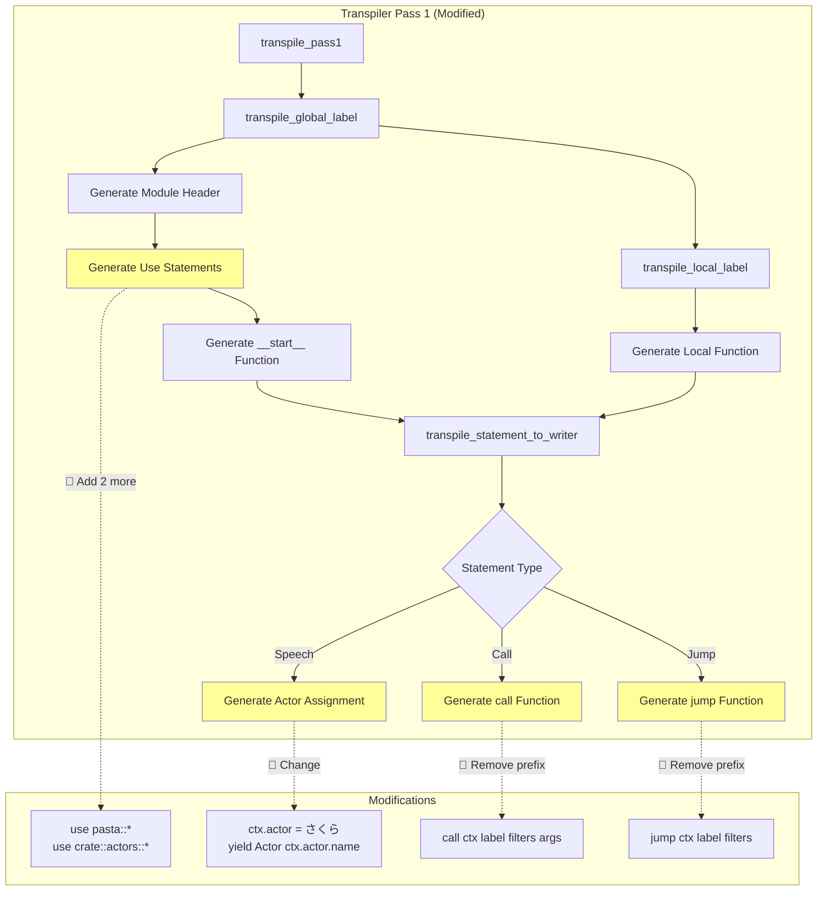
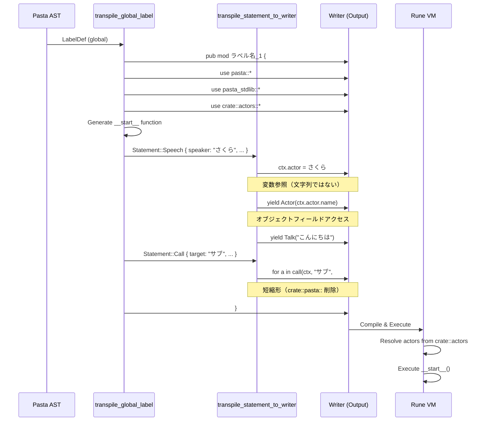

# Design Document: pasta-transpiler-actor-variables

| 項目 | 内容 |
|------|------|
| **Document Title** | Pasta トランスパイラー アクター変数参照修正 設計書 |
| **Version** | 1.0 |
| **Date** | 2025-12-14 |
| **Priority** | P1 (Correctness) |
| **Status** | Design Generated |

---

## Overview

本機能は Pasta DSL トランスパイラーを修正し、アクター代入時に文字列リテラルではなく変数参照を生成する。これにより型安全性と拡張性を確保し、アクターオブジェクトの構造化データ（name, id等）を活用可能にする。

**Purpose**: 
トランスパイラー Pass 1 の Statement::Speech 処理を修正し、`ctx.actor = "さくら"` から `ctx.actor = さくら` へ変更。同時にモジュールレベルの use 文生成と pasta 関数の短縮形呼び出しを実現する。

**Users**: 
Pasta DSL を使用してビジュアルノベル/アドベンチャーゲームのスクリプトを記述する開発者。トランスパイラー出力を Rune VM で実行する実行環境。

**Impact**: 
現在の文字列ベースのアクター管理から、構造化されたアクターオブジェクト参照へ移行。既存の設計意図（参照実装）に合致し、将来的なアクター属性の拡張を可能にする。

### Goals
- アクター代入時に変数参照を生成（`ctx.actor = さくら;`）
- Actor イベント生成時にオブジェクトフィールドを参照（`yield Actor(ctx.actor.name);`）
- モジュールレベルの use 文生成（`use pasta::*;`, `use pasta_stdlib::*;`, `use crate::actors::*;`）
- pasta 関数の短縮形呼び出し（`call(...)`, `jump(...)`）
- Rune VM コンパイル成功の保証

### Non-Goals
- `main.rn` のアクター定義自動生成（手動またはプロジェクト初期化で対応）
- Pass 2（label_selector）の修正（本機能の対象外）
- アクター情報の動的登録機能
- 後方互換性の維持（新形式のみサポート）

---

## Architecture

### Existing Architecture Analysis

**Pasta Transpiler Architecture**:
- **Two-Pass Strategy**: 
  - Pass 1: ラベルを LabelRegistry に登録し、モジュール/関数コードを生成
  - Pass 2: label_selector 関数と pasta モジュール（jump/call ラッパー）を生成
- **Pass 1 Functions**:
  - `transpile_global_label()`: グローバルラベルをモジュールとして生成
  - `transpile_local_label()`: ローカルラベルを関数として生成
  - `transpile_statement_to_writer()`: Statement（AST）を Rune コードに変換
- **String-based Code Generation**: `std::io::Write` を使用したテキスト出力
- **Registry Pattern**: `LabelRegistry` でラベル ID と関数パスのマッピングを管理

**Current Generation Flow**:
```
PastaFile AST
    ↓
transpile_pass1()
    ↓
for each label:
    transpile_global_label() ← 🎯 修正対象
        ↓
        - Generate module header
        - Generate use statements ← 🎯 修正対象（1→3行へ）
        - Generate __start__() function
            ↓
            for each statement:
                transpile_statement_to_writer() ← 🎯 修正対象
                    ↓
                    - Statement::Speech ← 🎯 修正対象（文字列→変数参照）
                    - Statement::Call ← 🎯 修正対象（短縮形）
                    - Statement::Jump ← 🎯 修正対象（短縮形）
        ↓
        for each local_label:
            transpile_local_label() ← 修正不要
```

### Architecture Pattern & Boundary Map

**Selected Pattern**: Direct Modification（既存コンポーネント拡張）

**Architecture Integration**:
- **既存パターン維持**: Two-Pass アーキテクチャは変更なし
- **Pass 1 のみ修正**: Pass 2（label_selector）は影響を受けない
- **境界の尊重**: LabelRegistry, PastaError, AST 構造は不変

**Domain/Feature Boundaries**:
- **Transpiler Core** (`mod.rs`): コード生成ロジック（修正箇所）
- **Registry** (`label_registry.rs`): ラベル管理（変更なし）
- **AST** (`lib.rs`): 構文木定義（変更なし）
- **Runtime** (`pasta_stdlib`): Rune 関数定義（変更なし）

**Existing Patterns Preserved**:
- String-based output generation (`writeln!` マクロ使用)
- Error propagation via `PastaError::io_error()`
- Japanese identifier support (`sanitize_identifier` は最小限のサニタイズ)
- Comment-driven code documentation

**New Components Rationale**:
新規コンポーネントなし。既存の3関数を修正するのみ。

**Steering Compliance**:
- **Type Safety**: Rust の型システムを活用（文字列生成のみ、unsafe 不使用）
- **Code Quality**: モジュール責務の明確な分離を維持
- **Rust 2021 Edition**: 既存のエディション標準に従う



### Technology Stack

| Layer | Choice / Version | Role in Feature | Notes |
|-------|------------------|-----------------|-------|
| Language | Rust 2021 Edition | トランスパイラー実装 | 既存の言語標準を維持 |
| Target Language | Rune (script VM) | トランスパイル出力のターゲット | バージョン変更なし |
| Code Generation | `std::io::Write` | 文字列ベースのコード出力 | 既存のアプローチを踏襲 |
| AST | Pasta AST (内部定義) | 入力データ構造 | 変更なし |
| Testing | `cargo test` | 単体・統合テスト | 既存テストスイートを拡張 |

**Rationale**:
- **Rune VM Compatibility**: use 文のワイルドカードインポート、オブジェクトフィールドアクセス（`.name`）は Rune でサポート済み
- **No External Dependencies**: 新規依存ライブラリ不要
- **Backward Compatibility**: 新形式のみサポート（旧形式の後方互換は非目標）

---

## System Flows

### Transpilation Flow with Actor Variables



**Flow-Level Decisions**:
- **Use Statement Ordering**: pasta, pasta_stdlib, actors の順（依存関係の論理的な順序）
- **Field Access**: `ctx.actor.name` は Rune の標準的なオブジェクトフィールドアクセス
- **Error Handling**: Rune VM コンパイル時にアクター未定義エラーを検出（トランスパイラーは検証しない）

---

## Requirements Traceability

| Requirement | Summary | Components | Interfaces | Flows |
|-------------|---------|------------|------------|-------|
| 1.1, 1.2, 1.3, 1.4, 1.5 | アクター変数参照の生成 | `transpile_statement_to_writer()` L353 | `Statement::Speech` → Rune code | Actor Assignment |
| 2.1, 2.2, 2.3, 2.4, 2.5 | Actor イベント生成の修正 | `transpile_statement_to_writer()` L355 | `Statement::Speech` → Rune code | Actor Event |
| 3.1, 3.2, 3.3, 3.4 | モジュールレベル use 文の生成 | `transpile_global_label()` L276-278 | Module Header → Rune code | Use Statements |
| 4.1, 4.2, 4.3 | Pasta 関数短縮形呼び出し | `transpile_statement_to_writer()` L375, L390 | `Statement::Call/Jump` → Rune code | Call/Jump Shorthand |
| 5.1, 5.2 | テスト出力検証 | Test Fixtures | - | Test Validation |

---

## Components and Interfaces

### Summary

| Component | Domain/Layer | Intent | Req Coverage | Key Dependencies | Contracts |
|-----------|--------------|--------|--------------|------------------|-----------|
| `transpile_global_label()` | Transpiler Core | グローバルラベルのモジュール生成 | 3.1-3.4 | LabelRegistry (P0), Writer (P0) | Code Generation |
| `transpile_statement_to_writer()` | Transpiler Core | Statement の Rune コード変換 | 1.1-1.5, 2.1-2.5, 4.1-4.3 | TranspileContext (P0), Writer (P0) | Code Generation |
| `transpile_local_label()` | Transpiler Core | ローカルラベルの関数生成 | - | LabelRegistry (P0), Writer (P0) | Code Generation |

**Note**: 3つすべて既存コンポーネントの修正であり、新規コンポーネントは作成しない。

### Transpiler Core

#### transpile_global_label()

| Field | Detail |
|-------|--------|
| Intent | グローバルラベルを Rune モジュールとして生成し、use 文とエントリーポイント関数を出力 |
| Requirements | 3.1, 3.2, 3.3, 3.4 |
| Owner / Reviewers | Transpiler Maintainer |

**Responsibilities & Constraints**
- グローバルラベルの LabelRegistry への登録
- モジュールヘッダー（`pub mod ラベル名_N {`）の生成
- 3つの use 文の順次出力（pasta, pasta_stdlib, actors）
- `__start__()` 関数の生成
- ローカルラベル関数の生成呼び出し

**Dependencies**
- Inbound: `transpile_pass1()` — メインエントリーポイント (P0)
- Outbound: `LabelRegistry` — ラベル ID 割り当て (P0)
- Outbound: `Writer` — コード出力 (P0)
- Outbound: `transpile_statement_to_writer()` — Statement 変換 (P0)
- Outbound: `transpile_local_label()` — ローカルラベル生成 (P1)

**Contracts**: Code Generation [✓]

##### Code Generation Contract

**Input**:
```rust
pub fn transpile_global_label<W: std::io::Write>(
    label: &LabelDef,
    registry: &mut LabelRegistry,
    writer: &mut W,
) -> Result<(), PastaError>
```

**Output** (Generated Rune Code):
```rune
pub mod ラベル名_1 {
    use pasta::*;
    use pasta_stdlib::*;
    use crate::actors::*;

    pub fn __start__(ctx, args) {
        // statements
    }
    
    // local labels (if any)
}
```

**Preconditions**:
- `label.scope == LabelScope::Global`
- `writer` is writable

**Postconditions**:
- Module header written
- 3 use statements written (in order: pasta, pasta_stdlib, actors)
- `__start__()` function generated with label statements
- Local label functions generated
- Module closing brace written
- Label registered in `registry`

**Invariants**:
- Use statements appear before any function definition
- Module name follows format `{sanitized_name}_{counter}`

**Implementation Notes**
- **Modification Point**: L276-278 (after module header, before `__start__`)
- **Current**: 1 use statement (`use pasta_stdlib::*;`)
- **Modified**: 3 use statements (pasta, pasta_stdlib, actors)
- **Order**: Must maintain pasta → pasta_stdlib → actors for logical dependency flow

---

#### transpile_statement_to_writer()

| Field | Detail |
|-------|--------|
| Intent | Statement（AST）を対応する Rune コードに変換し、Writer に出力 |
| Requirements | 1.1-1.5 (Actor), 2.1-2.5 (Event), 4.1-4.3 (Shorthand) |
| Owner / Reviewers | Transpiler Maintainer |

**Responsibilities & Constraints**
- Statement の型に応じた分岐処理
- Speech: アクター変数参照と Actor イベント生成
- Call/Jump: pasta 関数の短縮形呼び出し
- VarAssign, RuneBlock: 変更なし（既存ロジック維持）

**Dependencies**
- Inbound: `transpile_global_label()`, `transpile_local_label()` — Statement 処理依頼 (P0)
- Outbound: `Writer` — コード出力 (P0)
- Outbound: `TranspileContext` — スコープ情報 (P0)
- Outbound: `transpile_speech_part_to_writer()` — Speech content 処理 (P1)

**Contracts**: Code Generation [✓]

##### Code Generation Contract

**Input**:
```rust
fn transpile_statement_to_writer<W: std::io::Write>(
    writer: &mut W,
    stmt: &Statement,
) -> Result<(), PastaError>
```

**Output Examples**:

**Speech Statement** (Requirements 1.1-1.5, 2.1-2.5):
```rune
// Input: Statement::Speech { speaker: "さくら", content: [...] }
// Output:
ctx.actor = さくら;
yield Actor(ctx.actor.name);
yield Talk("こんにちは");
```

**Call Statement** (Requirements 4.1-4.3):
```rune
// Input: Statement::Call { target: "サブ", filters: [], args: [] }
// Output:
for a in call(ctx, "サブ", #{}, []) { yield a; }
```

**Jump Statement** (Requirements 4.1-4.3):
```rune
// Input: Statement::Jump { target: "エンド", filters: [] }
// Output:
for a in jump(ctx, "エンド", #{}, []) { yield a; }
```

**Preconditions**:
- `stmt` is a valid Statement AST node
- `writer` is writable
- For Speech: speaker name is a valid Rune identifier (sanitized if needed)
- For Call/Jump: `use pasta::*;` is present in module scope

**Postconditions**:
- Rune code written to `writer`
- For Speech: `ctx.actor` assigned with variable reference (no quotes)
- For Speech: `yield Actor(ctx.actor.name);` emitted
- For Call/Jump: `call()` / `jump()` used without `crate::pasta::` prefix
- All lines properly indented (8 spaces for function body)

**Invariants**:
- Actor assignment always precedes Actor event emission
- Talk statements follow Actor event
- Call/Jump generate `for a in ... { yield a; }` loop pattern

**Implementation Notes**
- **Modification Points**:
  - L353: `ctx.actor = {};` (remove quotes around `{}`)
  - L355: `yield Actor(ctx.actor.name);` (change from `Actor("{}")`)
  - L375: `call(ctx, ...)` (remove `crate::pasta::` prefix)
  - L390: `jump(ctx, ...)` (remove `crate::pasta::` prefix)
- **Integration**: Actor object structure `#{ name, id }` is defined in `main.rn`
- **Validation**: Rune VM will validate actor existence at compile time

---

#### transpile_local_label()

| Field | Detail |
|-------|--------|
| Intent | ローカルラベルを関数として生成（モジュール内に配置） |
| Requirements | - (間接的に 3.x を利用) |
| Owner / Reviewers | Transpiler Maintainer |

**Responsibilities & Constraints**
- ローカルラベルの LabelRegistry への登録
- 関数定義（`pub fn ローカル名_N(ctx, args) {`）の生成
- Statement の変換呼び出し
- use 文は生成しない（モジュールレベルを継承）

**Dependencies**
- Inbound: `transpile_global_label()` — ローカルラベル処理依頼 (P0)
- Outbound: `LabelRegistry` — ラベル ID 割り当て (P0)
- Outbound: `Writer` — コード出力 (P0)
- Outbound: `transpile_statement_to_writer()` — Statement 変換 (P0)

**Contracts**: Code Generation [✓]

##### Code Generation Contract

**Input**:
```rust
fn transpile_local_label<W: std::io::Write>(
    label: &LabelDef,
    parent_name: &str,
    parent_counter: usize,
    registry: &mut LabelRegistry,
    writer: &mut W,
) -> Result<(), PastaError>
```

**Output** (Generated Rune Code):
```rune
    pub fn ローカル名_1(ctx, args) {
        // statements
    }
```

**Preconditions**:
- `label.scope == LabelScope::Local`
- `writer` is writable
- Parent label already registered in `registry`

**Postconditions**:
- Function definition written
- Statements transpiled
- Function closing brace written
- Label registered in `registry` as child of parent

**Invariants**:
- Function name follows format `{sanitized_name}_{counter}`
- Function is indented at module level (4 spaces)
- No use statements generated (inherits from module scope)

**Implementation Notes**
- **No Modification Required**: この関数は変更不要
- **Rationale**: Rune のスコープルールにより、モジュール内関数はモジュールレベルの use 文を自動的に継承
- **Validation**: Gap Analysis で確認済み（research.md 参照）

---

## Data Models

### Domain Model

**Actor Object Structure** (defined in `main.rn`):
```rune
pub mod actors {
    pub const さくら = #{
        name: "さくら",
        id: "sakura",
    };
    
    pub const うにゅう = #{
        name: "うにゅう",
        id: "unyuu",
    };
}
```

**Fields**:
- `name: String` - アクター表示名（UI で表示、ScriptEvent に含まれる）
- `id: String` - 内部識別子（将来的な拡張用）

**Invariants**:
- すべてのアクターオブジェクトは `name` フィールドを持つ
- `name` フィールドは空文字列ではない
- アクター定義は `pub mod actors { ... }` に集約される

**Business Rules**:
- トランスパイラーはアクターの存在を検証しない（Rune VM に委譲）
- アクター名は Pasta スクリプト内で直接使用される（識別子として）

### Logical Data Model

**Ctx Object** (Rune Runtime Context):
```rune
pub struct Ctx {
    pub actor: Object,  // #{ name, id } 構造
    pub var: Object,    // グローバル変数
    // ... other fields
}
```

**Relationships**:
- Ctx.actor → actors モジュールで定義されたアクターオブジェクトを参照
- ScriptEvent::ChangeSpeaker → Ctx.actor.name を使用

**Consistency & Integrity**:
- `ctx.actor` への代入は Statement::Speech ごとに発生
- Actor イベント生成は `ctx.actor` が設定された直後に発生
- Rune VM は未定義のアクター参照をコンパイルエラーとして検出

---

## Error Handling

### Error Strategy

本機能はコンパイル時のコード生成に関わるため、エラーは主にトランスパイル時に発生する。Rune VM コンパイル時のエラーは実行環境側で処理される。

### Error Categories and Responses

**User Errors** (Transpile Time):
- **Invalid Actor Name**: Rune 識別子として無効な文字が含まれる
  - 検出: トランスパイラーは基本的なサニタイズのみ実施（`sanitize_identifier`）
  - 対応: そのまま出力し、Rune VM コンパイル時にエラー報告
  - Rationale: 日本語識別子を保持するため、過度なサニタイズは避ける

**System Errors** (Transpile Time):
- **I/O Error**: Writer への書き込み失敗
  - 検出: `writeln!` の Result チェック
  - 対応: `PastaError::io_error(e.to_string())` に変換して返却
  - Recovery: なし（トランスパイル中断）

**Business Logic Errors** (Rune VM Compile Time):
- **Undefined Actor**: `use crate::actors::*;` で解決できないアクター名
  - 検出: Rune VM コンパイラー
  - 対応: Rune コンパイルエラーメッセージを表示
  - Guidance: `main.rn` にアクター定義を追加するよう指示

**Note**: トランスパイラーはアクターの存在検証を行わない（設計判断: research.md 参照）

### Monitoring

- **Transpile Success Rate**: `cargo test` でトランスパイル成功を確認
- **Rune Compile Success**: `rune_compile_test.rs` で Rune VM コンパイルを検証
- **Output Validation**: 生成コードの構造を正規表現でテスト

---

## Testing Strategy

### Unit Tests

1. **`test_transpile_actor_variable_reference`**: Statement::Speech のアクター変数参照生成
   - Input: `Statement::Speech { speaker: "さくら", ... }`
   - Expected Output: `ctx.actor = さくら;` (quotes なし)
   - Verify: 文字列リテラルが出力されないこと

2. **`test_transpile_actor_event_with_field_access`**: Actor イベント生成
   - Input: `Statement::Speech { speaker: "さくら", ... }`
   - Expected Output: `yield Actor(ctx.actor.name);`
   - Verify: `ctx.actor.name` フィールドアクセスが含まれること

3. **`test_transpile_use_statements`**: モジュールレベル use 文生成
   - Input: `LabelDef` (global)
   - Expected Output: 3行の use 文（pasta, pasta_stdlib, actors）
   - Verify: 順序と形式が正しいこと

4. **`test_transpile_call_shorthand`**: Call 文の短縮形生成
   - Input: `Statement::Call { target: "サブ", ... }`
   - Expected Output: `for a in call(ctx, "サブ", #{}, []) { yield a; }`
   - Verify: `crate::pasta::` プレフィックスが含まれないこと

5. **`test_transpile_jump_shorthand`**: Jump 文の短縮形生成
   - Input: `Statement::Jump { target: "エンド", ... }`
   - Expected Output: `for a in jump(ctx, "エンド", #{}, []) { yield a; }`
   - Verify: `crate::pasta::` プレフィックスが含まれないこと

### Integration Tests

1. **`test_comprehensive_control_flow_transpile`**: 包括的なトランスパイルテスト
   - Input: `comprehensive_control_flow.pasta` (複数のアクター、Call/Jump 含む)
   - Expected: トランスパイル成功、use 文が各モジュールに存在
   - Verify: 生成コードが参照実装と構造的に一致

2. **`test_rune_vm_compile_actor_variables`**: Rune VM コンパイル検証
   - Input: トランスパイル済み Rune コード + `main.rn` (アクター定義)
   - Expected: Rune VM コンパイル成功
   - Verify: アクター変数が正しく解決されること

3. **`test_actor_module_import`**: actors モジュールインポート検証
   - Input: `use crate::actors::*;` を含むトランスパイル出力
   - Expected: Rune VM がアクター定義を正しく解決
   - Verify: 複数のアクター（さくら、うにゅう、ななこ）がすべて参照可能

4. **`test_local_label_inherits_use_statements`**: ローカルラベルの use 文継承
   - Input: グローバルラベル + ローカルラベル
   - Expected: ローカルラベル関数内で pasta 関数と actors が使用可能
   - Verify: ローカルラベル関数に use 文が重複生成されないこと

### End-to-End Tests

1. **`test_e2e_simple_script`**: 単純なスクリプトの完全なフロー
   - Steps:
     1. Pasta スクリプトをパース
     2. トランスパイル実行
     3. Rune VM でコンパイル
     4. 実行して ScriptEvent を収集
   - Expected Events:
     - `ScriptEvent::ChangeSpeaker { name: "さくら" }`
     - `ScriptEvent::Talk { text: "こんにちは" }`
   - Verify: アクター名が正しく抽出されること

2. **`test_e2e_multi_actor_conversation`**: 複数アクター会話
   - Steps:
     1. さくら、うにゅう、ななこが登場するスクリプト
     2. トランスパイル + Rune コンパイル
     3. 実行
   - Expected: 各アクター変更イベントが正しい順序で発生
   - Verify: `ctx.actor` が各 Speech statement で更新されること

3. **`test_e2e_call_and_jump`**: Call/Jump の短縮形実行
   - Steps:
     1. Call/Jump を含むスクリプト
     2. トランスパイル + Rune コンパイル
     3. 実行
   - Expected: ラベル遷移が正常に動作
   - Verify: `call()` / `jump()` が `use pasta::*;` により解決されること

### Test Fixtures

**Updated Fixtures**:
1. `comprehensive_control_flow.transpiled.rn` - トランスパイル後に再生成
2. `test-project/main.rn` - アクター定義を `pub mod actors { ... }` に移動

**New Test Cases** (追加予定):
- `actor_assignment_test.rs` - アクター変数参照の詳細テスト
- `use_statement_test.rs` - use 文生成の単体テスト

---

## Supporting References

### Code Modification Summary

| File | Lines | Modification | Type |
|------|-------|--------------|------|
| `crates/pasta/src/transpiler/mod.rs` | 276-278 | 3つの use 文追加 | Add (3 lines) |
| `crates/pasta/src/transpiler/mod.rs` | 353 | `ctx.actor = {};` | Modify (quotes removal) |
| `crates/pasta/src/transpiler/mod.rs` | 355 | `yield Actor(ctx.actor.name);` | Modify (field access) |
| `crates/pasta/src/transpiler/mod.rs` | 375 | `call(...)` | Modify (prefix removal) |
| `crates/pasta/src/transpiler/mod.rs` | 390 | `jump(...)` | Modify (prefix removal) |
| `crates/pasta/tests/fixtures/test-project/main.rn` | 全体 | Actor definitions を actors モジュールに移動 | Restructure |

**Total Impact**: 5箇所の修正、3行の追加、1ファイルの構造変更

### Implementation Complexity

- **Complexity**: S (1-3 days)
- **Risk**: Low
- **Confidence**: High（明確な修正箇所、既存パターン踏襲、包括的なテスト）

### References

- [Rune Language Documentation](https://rune-rs.github.io/) - use 文、オブジェクトフィールドアクセス
- Gap Analysis: `.kiro/specs/pasta-transpiler-actor-variables/gap-analysis.md`
- Research Log: `.kiro/specs/pasta-transpiler-actor-variables/research.md`
- Requirements: `.kiro/specs/pasta-transpiler-actor-variables/requirements.md`
