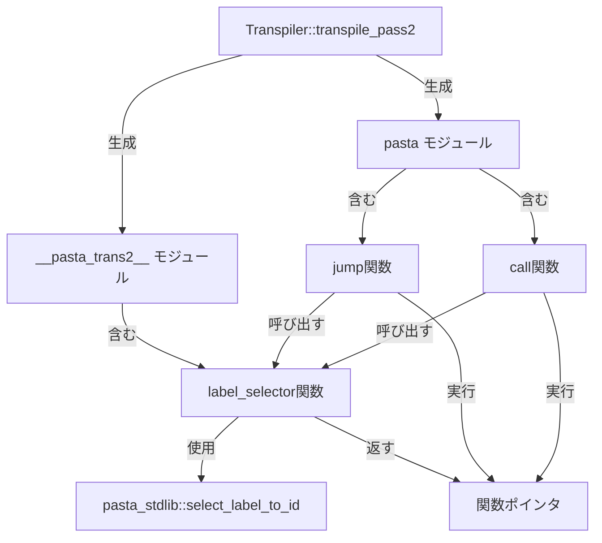

# 設計書: pasta-transpiler-pass2-output

| 項目 | 内容 |
|------|------|
| **Document Title** | Pasta トランスパイラー Pass 2 出力修正 設計書 |
| **Version** | 1.0 |
| **Date** | 2025-12-14 |
| **Status** | Design Generated |

---

## Overview

本機能は、Pasta DSLトランスパイラーのPass 2における出力構造を修正し、設計仕様に準拠した2モジュール構成（`__pasta_trans2__` + `pasta`）を実現する。現在のトランスパイラーは `pasta` モジュール内にラベル解決ロジックを直接埋め込んでいるが、正しい設計では `__pasta_trans2__::label_selector()` 関数が関数ポインタを返し、`pasta::jump()`/`call()` がそれを呼び出す簡潔なラッパーとなる。

**Purpose**: コード重複を排除し、ラベル解決ロジックを一元化することで、保守性と拡張性を向上させる。

**Users**: Pasta DSLスクリプト作成者（間接的）、トランスパイラー開発者（直接的）。

**Impact**: `transpile_pass2()` 関数（170-217行目）の出力内容を変更。Pass 1、`LabelRegistry`、テストフレームワークは不変。

### Goals
- `pub mod __pasta_trans2__` と `pub fn label_selector(label, filters)` の生成
- `pasta::jump()`/`call()` を2行のラッパー関数に簡素化
- コード重複（約50行）の削除
- 既存パターン（`writeln!` による行単位出力）の維持

### Non-Goals
- Pass 1（構文解析、ラベル登録）の変更
- `LabelRegistry` データ構造の変更
- `pasta_stdlib::select_label_to_id()` の実装（別仕様: `pasta-label-resolution-runtime`）
- Rune構文の変更
- テストフレームワークの変更（検証パターンのみ更新）

## Architecture

### Existing Architecture Analysis

**現在の構造**:
```
crates/pasta/src/transpiler/
  ├── mod.rs                   ← transpile_pass2() 関数（170-217行目）修正対象
  └── label_registry.rs        ← 不変（データ構造完全）
```

**現在の出力**:
```rune
pub mod pasta {
    pub fn jump(ctx, label, filters, args) {
        let id = pasta_stdlib::select_label_to_id(label, filters);
        match id {
            1 => { for a in crate::会話_1::__start__(ctx, args) { yield a; } },
            2 => { for a in crate::会話_1::自己紹介_1(ctx, args) { yield a; } },
            // ... 全ラベル分のmatch arm
            _ => { yield pasta_stdlib::Error(...); },
        }
    }

    pub fn call(...) { /* 同じmatchロジックを重複 */ }
}
```

**問題点**:
- `jump()` と `call()` が同じmatchロジックを持つ（約50行のコード重複）
- 将来的なラベル解決ロジックの変更が困難（2箇所修正が必要）
- 設計仕様との不一致（`__pasta_trans2__` モジュールが存在しない）

**既存パターン**:
- `writeln!(writer, ...)` による行単位のテキスト出力
- `.map_err(|e| PastaError::io_error(e.to_string()))?` でエラーハンドリング
- `registry.all_labels()` イテレーターで全ラベルを処理

### Architecture Pattern & Boundary Map

**選択パターン**: モジュール分離による責務明確化



**設計決定**:
- **責務分離**: `__pasta_trans2__` = ラベル解決、`pasta` = ユーザーAPI
- **単一関数実装**: `transpile_pass2()` 内で完結（約70行、許容範囲）
- **既存パターン維持**: `writeln!` + `.map_err()` パターンを継続
- **データ構造不変**: `LabelRegistry` 変更なし（必要な情報が全て含まれる）

**Steering準拠**:
- Rust型システム活用（既存の `LabelInfo` 構造体を使用）
- モジュール単位の責務分離（tech.md: Code Quality原則）
- エラーハンドリング統一（`PastaError::io_error` パターン）

### Technology Stack

| Layer | Choice / Version | Role in Feature | Notes |
|-------|------------------|-----------------|-------|
| Language | Rust 2021 Edition | トランスパイラー実装言語 | 既存スタック、変更なし |
| Code Generation | std::io::Write | テキスト出力インターフェース | `writeln!` マクロ使用 |
| Data Structure | LabelRegistry | ラベル情報管理 | 既存実装、変更なし |
| Error Handling | PastaError | エラー伝播 | `io_error()` コンストラクタ使用 |
| Target Language | Rune 0.14 | 生成コードの実行環境 | 関数ポインタ構文使用 |

**依存関係変更**: なし（既存依存のみ）

## Requirements Traceability

| Requirement | Summary | Components | Interfaces | Flows |
|-------------|---------|------------|------------|-------|
| 1 | `__pasta_trans2__` モジュール生成 | `transpile_pass2()` | `Write` trait | Pass2CodeGen |
| 2 | `label_selector()` 関数実装 | `transpile_pass2()` | `LabelRegistry::all_labels()` | Pass2CodeGen |
| 3 | `pasta` モジュール簡素化 | `transpile_pass2()` | `Write` trait | Pass2CodeGen |
| 4 | テストフィクスチャ整理 | (実装後の手動作業) | - | - |
| 5 | Pass 2実装特定と修正 | `transpile_pass2()` | - | Pass2CodeGen |

## System Flows

### Pass 2 Code Generation Flow

```mermaid
sequenceDiagram
    participant Client as Transpiler Client
    participant Pass2 as transpile_pass2()
    participant Registry as LabelRegistry
    participant Writer as Write trait

    Client->>Pass2: transpile_pass2(registry, writer)
    
    Note over Pass2: Step 1: Generate __pasta_trans2__ module
    Pass2->>Writer: writeln!("pub mod __pasta_trans2__ {")
    Pass2->>Writer: writeln!("    pub fn label_selector(label, filters) {")
    Pass2->>Writer: writeln!("        let id = pasta_stdlib::select_label_to_id(label, filters);")
    Pass2->>Writer: writeln!("        match id {")
    
    Pass2->>Registry: all_labels()
    Registry-->>Pass2: Iterator<LabelInfo>
    
    loop For each label
        Pass2->>Writer: writeln!("            {} => {},", id, fn_path)
    end
    
    Pass2->>Writer: writeln!("            _ => |_ctx, _args| { yield pasta_stdlib::Error(...); },")
    Pass2->>Writer: writeln!("        }")
    Pass2->>Writer: writeln!("    }")
    Pass2->>Writer: writeln!("}")
    
    Note over Pass2: Step 2: Generate pasta module (wrapper)
    Pass2->>Writer: writeln!("pub mod pasta {")
    Pass2->>Writer: writeln!("    pub fn jump(ctx, label, filters, args) {")
    Pass2->>Writer: writeln!("        let func = crate::__pasta_trans2__::label_selector(label, filters);")
    Pass2->>Writer: writeln!("        for a in func(ctx, args) { yield a; }")
    Pass2->>Writer: writeln!("    }")
    Pass2->>Writer: writeln!("    pub fn call(...) { /* 同じロジック */ }")
    Pass2->>Writer: writeln!("}")
    
    Pass2-->>Client: Ok(())
```

**フロー決定事項**:
- `__pasta_trans2__` モジュールを先に生成（`pasta` モジュールから参照されるため）
- エラーハンドリングは各 `writeln!` で実施（`.map_err()` パターン）
- ラベルイテレーションは1回のみ（`__pasta_trans2__` 生成時）

## Components and Interfaces

### Component Summary

| Component | Domain/Layer | Intent | Req Coverage | Key Dependencies (P0/P1) | Contracts |
|-----------|--------------|--------|--------------|--------------------------|-----------|
| `transpile_pass2()` | Code Generation | Runeコード生成（Pass 2） | 1, 2, 3, 5 | LabelRegistry (P0), Write (P0) | Function |

### Component: `transpile_pass2()`

**Location**: `crates/pasta/src/transpiler/mod.rs` (170-217行目 → 約70行に変更)

**Purpose**: Pass 2コード生成 - `__pasta_trans2__` と `pasta` モジュールの出力

**Requirements Coverage**: 1, 2, 3, 5

**Interface**:
```rust
pub fn transpile_pass2<W: std::io::Write>(
    registry: &LabelRegistry,
    writer: &mut W,
) -> Result<(), PastaError>
```

**Dependencies**:

| Dependency | Type | Criticality | Interface | Notes |
|------------|------|-------------|-----------|-------|
| `LabelRegistry` | Inbound | P0 | `all_labels() -> Iterator<&LabelInfo>` | ラベル情報取得 |
| `Write` trait | Inbound | P0 | `write_fmt()` via `writeln!` | テキスト出力 |
| `PastaError` | Outbound | P0 | `io_error(String) -> PastaError` | エラー生成 |

**Behavior**:
1. `__pasta_trans2__` モジュール生成:
   - `pub fn label_selector(label, filters)` 関数定義
   - `pasta_stdlib::select_label_to_id()` 呼び出し
   - `match id` 式で全ラベルのマッピング（`id => fn_path` 形式）
   - デフォルト arm でエラークロージャ生成

2. `pasta` モジュール生成:
   - `pub fn jump(ctx, label, filters, args)` 関数定義
   - `crate::__pasta_trans2__::label_selector()` 呼び出し
   - `for a in func(ctx, args) { yield a; }` で関数実行
   - `pub fn call(...)` も同じロジック

**Error Handling**:
- 全ての `writeln!` で `.map_err(|e| PastaError::io_error(e.to_string()))?` を使用
- I/O エラーのみ（論理エラーは発生しない）

**Implementation Notes**:
- 既存の `writeln!` パターンを踏襲（可読性重視）
- 関数ポインタ構文: `1 => crate::会話_1::__start__,` （呼び出しなし）
- エラークロージャ: `_ => |_ctx, _args| { yield pasta_stdlib::Error(...); },`
- 生成コード長: 約70行（現在約50行から増加）

## Data Models

### LabelInfo (既存、変更なし)

**Source**: `crates/pasta/src/transpiler/label_registry.rs`

```rust
pub struct LabelInfo {
    pub id: i64,                                // ラベルID（1から開始）
    pub name: String,                           // 元のラベル名
    pub attributes: HashMap<String, String>,    // 属性（P1機能、現在未使用）
    pub fn_path: String,                        // "crate::会話_1::__start__"
    pub fn_name: String,                        // "会話_1::__start__"
    pub parent: Option<String>,                 // 親ラベル名（ローカルラベル用）
}
```

**Usage in Design**:
- `id`: match式のarm生成（`1 => ...`）
- `fn_path`: 関数ポインタの完全修飾パス
- 他のフィールドは使用しない

### Generated Code Structure

**`__pasta_trans2__` モジュール**:
```rune
pub mod __pasta_trans2__ {
    pub fn label_selector(label, filters) {
        let id = pasta_stdlib::select_label_to_id(label, filters);
        match id {
            1 => crate::会話_1::__start__,
            2 => crate::会話_1::自己紹介_1,
            // ... 全ラベル
            _ => |_ctx, _args| { yield pasta_stdlib::Error(`ラベルID ${id} が見つかりませんでした。`); },
        }
    }
}
```

**`pasta` モジュール**:
```rune
pub mod pasta {
    pub fn jump(ctx, label, filters, args) {
        let func = crate::__pasta_trans2__::label_selector(label, filters);
        for a in func(ctx, args) { yield a; }
    }

    pub fn call(ctx, label, filters, args) {
        let func = crate::__pasta_trans2__::label_selector(label, filters);
        for a in func(ctx, args) { yield a; }
    }
}
```

## Testing Strategy

### Unit Test Updates

**対象テスト**: `crates/pasta/tests/two_pass_transpiler_test.rs`

**変更内容**: 検証パターンの更新（4テストケース）

**修正前**:
```rust
assert!(output.contains("for a in crate::会話_1::__start__(ctx, args)"));
```

**修正後**:
```rust
// __pasta_trans2__ モジュールの存在確認
assert!(output.contains("pub mod __pasta_trans2__"));
assert!(output.contains("pub fn label_selector(label, filters)"));

// pasta モジュールが label_selector を呼ぶ確認
assert!(output.contains("let func = crate::__pasta_trans2__::label_selector(label, filters);"));
assert!(output.contains("for a in func(ctx, args) { yield a; }"));

// match 式が __pasta_trans2__ 内にある確認
assert!(output.contains("1 => crate::会話_1::__start__,"));
```

### Integration Test Strategy

**Runeコンパイル検証テスト**（要件 Phase 3）:
- 生成されたコードをRune VMでコンパイル
- 構文エラーがないことを確認
- 全関数が定義されていることを確認（関数呼び出しの解決が成功）
- **制約**: `pasta_stdlib::select_label_to_id()` はダミー実装（常に1を返す）のため、完全な実行検証は行わない

### Test Fixture Cleanup

**対象**: `crates/pasta/tests/fixtures/comprehensive_control_flow.transpiled.rn`

**作業**: 実装タスクに含める（要件 4）
- 77-103行目の誤った `pasta` モジュール実装を削除
- 説明用コメント（`// ❌`, `// ✅`）を削除
- 正しい実装のみを残す

**参照資料**: `.kiro/specs/pasta-transpiler-pass2-output/reference_comparison.rn` に保存済み

**実施タイミング**: トランスパイラー本体の修正完了後、テスト実行前に自動実施

## Implementation Guidelines

### Code Generation Pattern

**基本パターン**:
```rust
writeln!(writer, "行内容").map_err(|e| PastaError::io_error(e.to_string()))?;
```

**インデント**:
- モジュール内: 4スペース
- 関数内: 8スペース
- match arm: 12スペース

**文字列エスケープ**:
- Runeテンプレート文字列内の変数: `` `ラベルID ${id} が見つかりませんでした。` ``
- バッククォートをエスケープ: `` \` ``

### Modification Checklist

1. **`__pasta_trans2__` モジュール生成追加** (新規コード約30行)
   - モジュール開始: `pub mod __pasta_trans2__ {`
   - 関数定義: `pub fn label_selector(label, filters) {`
   - ID取得: `let id = pasta_stdlib::select_label_to_id(label, filters);`
   - match式開始: `match id {`
   - ラベルループ: `for label in registry.all_labels()` で `writeln!("            {} => {},", label.id, label.fn_path)`
   - デフォルトarm: `_ => |_ctx, _args| { yield pasta_stdlib::Error(...); },`
   - match式終了: `}`
   - 関数終了: `}`
   - モジュール終了: `}`
   - 空行: `writeln!(writer)`

2. **`pasta` モジュール簡素化** (既存コード削除、新規コード約10行)
   - 既存の `jump()` 内 match ロジック削除（約20行）
   - 既存の `call()` 内 match ロジック削除（約20行）
   - 新規 `jump()`: 3行（`label_selector` 呼び出し + for ループ + 空行）
   - 新規 `call()`: 3行（`jump()` と同じ）
   
   **結果**: 現在約50行 → 新規約70行（純増約20行、モジュール分割のオーバーヘッド含む）

3. **テスト更新** (検証パターン変更のみ)
   - `test_two_pass_transpiler_to_vec()`: 検証パターン3-4箇所
   - `test_two_pass_transpiler_to_string()`: 検証パターン3-4箇所
   - `test_transpile_to_string_helper()`: 検証パターン2-3箇所
   - `test_multiple_files_simulation()`: 検証パターン2-3箇所

4. **テストフィクスチャのクリーンアップ** (要件4、実装タスクに含む)
   - `comprehensive_control_flow.transpiled.rn` の77-103行目削除（誤った `pasta` モジュール実装）
   - 説明用コメント（`// ❌`, `// ✅`）をすべて削除
   - 正しい実装のみを残す

### Performance Considerations

- **コード生成時間**: 変化なし（出力行数が約20行増加するのみ）
- **生成コードサイズ**: 約20行増加（`__pasta_trans2__` モジュール分）、許容範囲
- **実行時パフォーマンス**: 変化なし（関数呼び出し経路は同じ）

### Risk Mitigation

| Risk | Impact | Probability | Mitigation |
|------|--------|-------------|------------|
| Rune構文エラー | High | Low | 既存パターン踏襲、Runeコンパイル検証テストで検出 |
| テスト失敗 | Medium | Medium | 修正箇所は1関数だが、4テストケースが連鎖的に失敗する可能性。段階的にテスト更新、出力を目視確認 |
| 後方互換性 | High | Very Low | Pass 1不変、LabelRegistry不変 |
| コード重複の再導入 | Medium | Low | コードレビューで確認 |

**注記**: 
- Rune構文エラーのProbability=Lowは妥当。トランスパイラー本体は既存の `writeln!` パターンを踏襲し、コンパイル成功を要件とするため構文エラーは検出される
- テスト失敗のリスクは中程度。修正箇所は `transpile_pass2()` 1関数に限定されるが、出力形式の変更により複数のテストケースが連鎖的に失敗に変わる可能性があり、検証パターンの修正作業が発生する

## Future Enhancements

- **P1機能**: 属性フィルタリング（`LabelInfo::attributes` の使用）
- **最適化**: ラベル数が多い場合のmatch式最適化（ハッシュマップ利用など）
- **デバッグ情報**: 生成コードに元のPasta DSL行番号をコメント埋め込み
- **関数分離**: コード生成が複雑化した際の `generate_pasta_trans2_module()` 分離

## References

- [要件定義書](./requirements.md) - 5要件（EARS形式AC）
- [ギャップ分析](./gap-analysis.md) - Option A推奨、S規模、Low risk
- [調査ログ](./research.md) - 発見事項、設計決定、リスク評価
- [参照フィクスチャ](./reference_comparison.rn) - 正誤比較用実装例
- [関連仕様: pasta-label-resolution-runtime](../pasta-label-resolution-runtime/) - `select_label_to_id()` 実装
- [設計メモ: MEMO.md](../MEMO.md) - セレクターAPI設計
