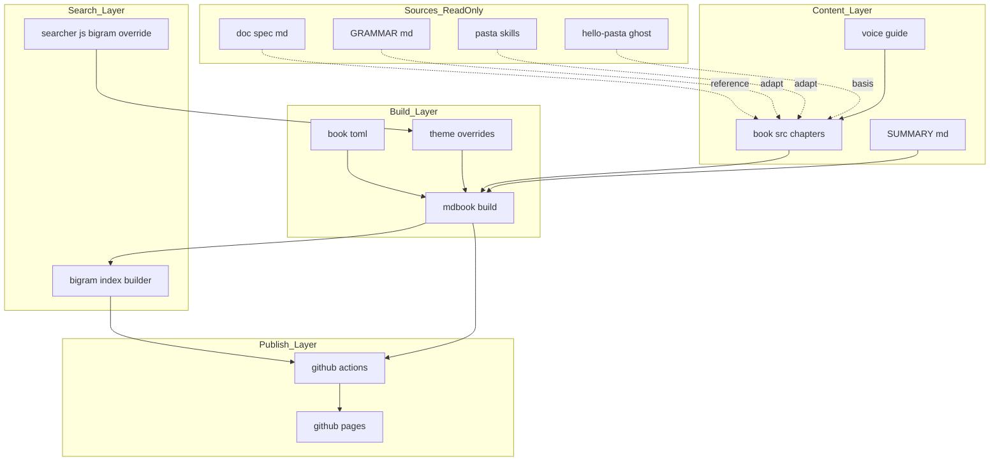

# Design Document — pasta-user-manual

## Overview

**Purpose**: pasta ゴーストの作者に対し、Pasta DSL 文法・LuaJIT 2.1 ランタイム API/コーディング・入門チュートリアルを統合した、検索可能な利用者マニュアルを提供する。

**Users**: ゴースト作者（プログラミング初心者を含む）が、辞書（`.pasta`）制作とカスタム Lua スクリプト実装の学習・参照に利用する。

**Impact**: 現在 `doc/spec/`・`GRAMMAR.md`・AI 向けスキルに分散している知識を、**サーバー不要の静的サイト**（mdBook 製、GitHub Pages 公開）として単一化する。`doc/spec/` は権威的ソースのまま維持し、本マニュアルはその利用者向け派生物として位置づく。

### Goals
- mdBook による静的サイト基盤を確立し、GitHub Pages で公開する（サーバー不要・`file://` オフライン閲覧も維持）。
- 日本語の語中部分一致検索（連続2文字以上）を、クライアントサイド完結で実現する。
- 文法・Lua API・入門チュートリアルを「Claudia 令嬢」ボイスで執筆し、正確さと親しみやすさを両立する。

### Non-Goals
- `doc/spec/` の権威的ソースの置き換え・自動同期（トランスクルージョン）。
- 素の Lua 言語仕様本体の取り込み（外部リファレンスへのリンクのみ）。
- 多言語化（i18n、初版は日本語のみ）／自動 API ドキュメント生成。
- **pasta Lua ランタイムの内部設計・アーキテクチャ解説**（2パストランスパイル・yield/resume コルーチン・シーン検索・ローダ自己展開・SHIORI 非同期基盤の仕組み）。読者層がコントリビュータ寄りで境界が異なるため、別途将来仕様（roadmap 記録）。R5 は API の「使い方」に集中する。
- マニュアル内コード例の**フルランタイム（SSP 実行）動作検証**。※構文レベルの検証（パーサ／`pasta_check`）は実施し、底本 hello-pasta の実ファイルとの整合で担保する（下記 Testing 参照）。

## Boundary Commitments

### This Spec Owns
- `book/` 配下の mdBook プロジェクト一式（`book.toml`、`src/SUMMARY.md`、章コンテンツ、`theme/` オーバーライド）。
- 日本語 bigram 検索層（検索インデックス再生成ツール＋クエリトークナイザ override）。
- GitHub Pages 公開ワークフロー（`.github/workflows/` のマニュアル用ジョブ）。
- マニュアル本文の執筆方針（Claudia ボイスガイド）とコンテンツ。
- **マニュアル↔`doc/spec/` ドリフト検出機構**（章マッピング `book/manual-sources.toml` ＋ チェックスクリプト）と、その**完了承認ゲートへの統合**（`.kiro/steering/workflow.md` の DoD 追加・`kiro-spec-complete` のオーケストレーション）。※横断プロセスへの意図的拡張（設計ディスカッション#3 のスコープ拡大決定）。ゲートは条件付き発火（R10.5）。

### Out of Boundary
- `doc/spec/`・`GRAMMAR.md` の内容変更（参照・流用するが、権威ソースは改変しない）。
- pasta ランタイム／DSL／Lua API の実装そのもの（マニュアルは記述対象であり実装しない）。
- 素の Lua 言語・LuaJIT 本体のドキュメント（外部リポ・公式サイトが所有）。
- `crates/pasta_sample_ghost`（hello-pasta）の配布物生成（底本として参照のみ）。
- pasta Lua ランタイムの内部設計・アーキテクチャ解説（将来仕様 `pasta-runtime-internals-doc` に切り出し。本仕様の R5 は API 使用法に限定）。
- 完了承認フローの **DoD ゲート構造そのものの再設計**（追加するのはマニュアル整合の条件付きゲート1件のみ。既存5ゲートの意味は変えない）。
- マニュアル／`doc/spec/` に無関係な spec の完了承認挙動（R10.5 によりスキップ）。

### Allowed Dependencies
- 既存ツール: `mdbook v0.5.3`（cargo bin 導入済み）、GitHub Actions 公式 Pages アクション群。
- 参照元コンテンツ（読み取りのみ）: `doc/spec/*.md`、`GRAMMAR.md`、`.claude/skills/pasta-lua-coding` / `pasta-ghost-authoring`、`crates/pasta_sample_ghost/ghosts/hello-pasta`（hello-pasta の SSOT。`dist-src/` は廃止済み）。
- 外部リンク先（取り込まない）: 日本語 Lua 5.1/5.2 リファレンス（milkpot 版）、LuaJIT 公式（luajit.org）。
- 変更対象（プロセス）: `.kiro/steering/workflow.md`（DoD に条件付きゲート追加）、`.claude/skills/kiro-spec-complete/SKILL.md`（ゲート発火のオーケストレーション）。
- 制約: 公開成果物は純粋な静的アセットのみ（サイトに実行時依存を持ち込まない）。bigram 索引ビルダは **build-time の Node スクリプト**とし、mdBook 同梱 elasticlunr を再利用して最小依存で実装する（重量級フレームワーク不可）。索引ビルダとクエリ側 `searcher.js` は**単一の tokenize モジュールを共有**する。

### Revalidation Triggers
- **Pasta DSL 文法の変更**（`doc/spec/` 更新）→ 文法章（R4）の追従が必要。
- **Lua 公開 API の変更**（`pasta_lua` のモジュール増減）→ Lua 章（R5）の追従が必要。
- **ランタイム Lua 方言の変更**（LuaJIT バージョン更新等）→ 5.5/9.4 の記述更新。
- **hello-pasta 配布物の構成変更** → チュートリアル（R6）の手順整合確認。
- **mdBook の検索インデックス形式（elasticlunr スキーマ）変更** → bigram 層の互換性再検証。
- **完了承認フロー（`workflow.md` DoD / `kiro-spec-complete`）の変更** → 全 spec の完了挙動に影響。条件分岐（R10.5）が無関係な spec を巻き込まないことを再確認。

## Architecture

### Architecture Pattern & Boundary Map

静的サイトジェネレータ（mdBook）を中核に、**「コンテンツ層 → ビルド層 → 検索拡張層 → 公開層」**の一方向パイプラインで構成する。各層は左方向（上流）のみに依存する。



**Key Decisions**:
- **Selected pattern**: 静的サイト生成パイプライン（adopt mdBook）。新規実装は **bigram 検索層のみ**に最小化（synthesis: Build-vs-Adopt）。
- **Dependency direction**: `Sources(read-only) → Content → Build → Search → Publish`。上流（Sources, Content）は下流（Publish）の事情を持ち込まない。
- **二重管理回避**: `doc/spec/` はトランスクルージョンせず、書き下ろし＋リンク参照（一方向）。
- **searcher.js の位置づけ**: クエリ bigram 化は Search 関心だが、成果物としては mdBook の `theme/` 資産として同梱される。図の `QueryTokenizer --> Theme` は「Search 関心のコードを theme 資産としてパッケージする」関係であり、実行時の上位層依存ではない（層の逆流ではない）。

### Technology Stack

| Layer | Choice / Version | Role in Feature | Notes |
|-------|------------------|-----------------|-------|
| Frontend / CLI | mdBook v0.5.3 | Markdown→静的HTML/CSS/JS 生成、標準検索UI | cargo bin 導入済み |
| 検索拡張 | elasticlunr（mdBook 同梱）＋ 自前 bigram 層（build-time Node） | 日本語2文字部分一致検索 | 索引ビルダと searcher.js が単一 tokenize を共有 |
| Infrastructure / Runtime | GitHub Actions（`configure-pages`/`upload-pages-artifact`/`deploy-pages`）＋ GitHub Pages | ビルド・公開 | Jekyll 無効・`.nojekyll` 不要 |
| Content source | `doc/spec/`, `GRAMMAR.md`, pasta skills, hello-pasta | 流用・参照元（読み取り専用） | 権威は doc/spec |

## File Structure Plan

### Directory Structure
```
book/                              # 新規: マニュアルプロジェクト（リポジトリルート直下）
├── book.toml                      # mdBook 設定（language=ja, 検索有効, site-url）
├── AUTHORING.md                   # ボイスガイド＋流用/リンク方針（内部、非公開）  R7.5, R8.1
├── manual-sources.toml            # 章→doc/spec 章節マッピング（ドリフト検出の正準）  R10.1
├── theme/
│   └── head.hbs                   # クエリbigram override注入(共有tokenizeでelasticlunr.tokenizerを差替) R2.4
│                                  #   ※mdBook v0.5.3はtheme/searcher.js上書き非対応のためhead.hbsで実現
├── tools/
│   ├── bigram-index/              # build-time Node: searchindex.js を 2-gram 再生成   R2.1-2.5
│   │   ├── build-index.mjs        # mdBook出力→bigram索引再生成（elasticlunr再利用）
│   │   └── tokenize.mjs           # 索引・クエリ共有の bigram tokenize（正準・単一ソース）
│   └── drift-check.mjs            # build-time Node: ドリフト/リンク切れ検出          R10.2,10.4
└── src/
    ├── SUMMARY.md                 # 目次（章構成・ビルド対象を規定）             R3.2
    ├── introduction.md            # 導入・対象バージョン・LuaJIT2.1・環境バナー  R9.1,9.4,5.5
    ├── getting-started/           # 入門/チュートリアル                          R6
    │   ├── index.md               # 全体像・対象読者
    │   ├── prerequisites.md       # Windows/SSP/UTF-8・準備                       R6.3,6.5,6.6
    │   └── first-ghost.md         # ゼロから最初のゴースト（hello-pasta 底本）    R6.1,6.2,6.4
    ├── grammar/                   # Pasta DSL 文法（参照型・チュートリアル独立）  R4
    │   ├── index.md               # 文法全体像・doc/spec 権威への導線            R4.4,4.5,8.4
    │   └── <要素別章>.md          # 全実装済み文法を網羅（doc/spec ch02-07,09-11）
    │                              #   各章を manual-sources.toml でマッピング     R4.1,4.2,4.3,4.6
    ├── lua/                       # Lua API / コーディング                       R5
    │   ├── index.md               # LuaJIT 2.1 方言の明示・全体像                R5.5
    │   ├── basics.md              # 初心者向け Lua 基礎の入口＋外部参照          R5.6,8.2
    │   ├── modules.md             # @pasta_* 等公開モジュール API                R5.1
    │   ├── patterns.md            # scripts/ 記述パターン                        R5.2
    │   └── dsl-vs-lua.md          # 使い分け基準                                 R5.3
    └── reference/
        └── external-links.md      # LuaJIT/日本語Luaref・doc/spec 権威リンク     R8.2,8.3,8.4
```

### Modified Files
- `.github/workflows/manual.yml` — **新規**: mdBook ビルド → bigram 索引再生成 → drift-check/lint → Pages デプロイ（R1.3, 1.4, 6.2, 10.2, 10.4）。既存 `build.yml` とは独立ジョブとし干渉しない。
- `.kiro/steering/workflow.md` — **変更**: DoD に「Manual Sync Gate（条件付き）」を1件追加（R10.3, 10.5）。既存5ゲートの意味は変えない。
- `.claude/skills/kiro-spec-complete/SKILL.md` — **変更**: DoD 検証（ステップ1）で drift-check を発火するオーケストレーションを追加（R10.3）。ルールは workflow.md に置き複製しない。
- 既存コンテンツ（`doc/spec/`, `GRAMMAR.md` 等）は **変更しない**（読み取り専用）。

> 文法の要素別章は doc/spec の章立て（02〜11、未実装の08属性・12future を除く）に対応。`grammar/` は同一テンプレートの反復構造のため、個別ファイルは責務が自明な範囲で省略表記。

## System Flows

ビルド〜公開フロー（検索 bigram 化の対の処理に注意）:


**フロー上の決定**:
- 索引再生成（D/E）は `mdbook build` の**後段**で動作し、標準出力の `searchindex.js` を 2-gram 索引に差し替える。
- クライアント側 `theme/head.hbs`（全ページ `<head>` に注入され、elasticlunr ロード前に `elasticlunr.tokenizer` を 2-gram に差し替える）がクエリを 2-gram 分割し、再生成索引と整合する。**索引とクエリの bigram 化は必ず対で更新する**（不一致は検索破綻）。※mdBook v0.5.3 は `theme/searcher.js` の上書きを無視するため head.hbs フック方式を採用。

## Requirements Traceability

| Requirement | Summary | Components |
|-------------|---------|------------|
| 1.1, 1.2 | 静的成果物・サーバー不要表示 | Site Foundation |
| 1.3, 1.4 | GitHub Pages 公開・表示 | Publish Pipeline |
| 1.5 | file:// オフライン閲覧（相対パス） | Site Foundation / Publish Pipeline |
| 2.1–2.3, 2.5 | クライアント検索・結果遷移・配信前提 | Bigram Search |
| 2.4 | 連続2文字以上の日本語部分一致 | Bigram Search |
| 3.1 | 日本語 UTF-8 表示 | Site Foundation |
| 3.2 | 目次ナビゲーション | Site Foundation (SUMMARY) |
| 3.3 | コードブロック書式 | Site Foundation (theme) |
| 3.4 | ページ間リンク | Site Foundation / Content |
| 4.1–4.6 | Pasta DSL 文法 全実装網羅・例・権威準拠・チュートリアル独立 | Content: Grammar |
| 5.1–5.4 | Lua API/パターン/使い分け/例 | Content: Lua |
| 5.5 | LuaJIT 2.1 方言明示 | Content: Lua / Version & Currency |
| 5.6 | 初心者向け Lua 基礎入口 | Content: Lua |
| 6.1–6.6 | 入門手順・動作例・環境・UTF-8 | Content: Getting Started |
| 7.1–7.5 | Claudia ボイス・文体使い分け・ガイド | Voice & Tone Guide |
| 8.1 | 既存資産流用 | Content (sourcing policy) |
| 8.2, 8.3 | 外部 Lua リファレンス・lua55 不採用 | Content: References |
| 8.4 | doc/spec 権威維持 | Content: References / Grammar |
| 9.1–9.4 | バージョン明記・流動部注記・方言 | Version & Currency |
| 10.1 | 章→doc/spec マッピング保持 | Drift Detection & Gate |
| 10.2, 10.4 | ドリフト・リンク切れ検出 | Drift Detection & Gate |
| 10.3 | 完了 DoD ゲート統合・中断 | Drift Detection & Gate |
| 10.5 | 無関係 spec はスキップ（条件付き発火） | Drift Detection & Gate |

## Components and Interfaces

| Component | Layer | Intent | Req Coverage | Key Dependencies | Contracts |
|-----------|-------|--------|--------------|------------------|-----------|
| Site Foundation | Build | mdBook 基盤・テーマ・目次 | 1.1,1.2,1.5,3.1–3.4,9.1 | mdbook (P0) | Batch, State |
| Bigram Search | Search | 日本語2文字部分一致検索 | 2.1–2.5 | Site Foundation (P0), elasticlunr (P0) | Batch, Service |
| Publish Pipeline | Publish | GitHub Pages 自動公開 | 1.3,1.4 | Site Foundation (P0), GH Actions (P0) | Batch |
| Content: Getting Started | Content | 入門/チュートリアル | 6.1–6.6 | Voice Guide (P1), hello-pasta (P1) | — |
| Content: Grammar | Content | Pasta DSL 文法（全実装網羅・参照型） | 4.1–4.6,8.4 | doc/spec (P1), GRAMMAR.md (P1) | — |
| Content: Lua | Content | Lua API/コーディング | 5.1–5.6 | pasta-lua skill (P1) | — |
| Content: References | Content | 外部参照・権威リンク | 8.1–8.4 | 外部URL (P1) | — |
| Voice & Tone Guide | Authoring | Claudia ボイス基準 | 7.1–7.5 | — | State |
| Version & Currency | Authoring | バージョン明記・流動部注記 | 9.1–9.4,5.5 | — | State |
| Drift Detection & Gate | Process | doc/spec↔マニュアル整合検出・完了ゲート統合 | 10.1–10.5 | manual-sources.toml (P0), workflow.md (P0) | Batch |

### Build / Search Layer

#### Bigram Search

| Field | Detail |
|-------|--------|
| Intent | 日本語の連続2文字以上を引ける検索を、標準検索UI維持＋静的(file://両立)で実現 |
| Requirements | 2.1, 2.2, 2.3, 2.4, 2.5 |

**Responsibilities & Constraints**
- `mdbook build` 後段で、**build-time の Node スクリプト**（`build-index.mjs`）が `searchindex.js` を **2-gram トークン索引**に再生成する（位置非依存で全2文字連接を索引化）。mdBook 同梱 elasticlunr を再利用してスキーマ一致を保証。
- `theme/head.hbs`（mdBook v0.5.3 で `theme/searcher.js` 上書きが非対応のため採用）が、索引ビルダと**同一の `tokenize.mjs`（正準・単一ソース）をインライン同梱**してユーザー入力クエリを 2-gram 分割する（`elasticlunr.tokenizer` をフックで差し替え）。別言語二重実装を排除し、索引・クエリの規則一致を保証する（不一致は検索破綻 → Revalidation Trigger）。
- 出力は静的 JS（`fetch` 非依存）であり `file://` でも動作する。検索は HTTP 配信時を主とするが（2.5）、bigram 方式は file:// でも機能する。
- 索引サイズを監視し、mdBook の 10MB 警告閾値を超えないことを確認する。

**Dependencies**
- Inbound: Publish Pipeline — 生成索引を成果物に含める (P0)
- Outbound: Site Foundation — mdBook 標準出力（`searchindex.js`/`searcher.js`/`elasticlunr.min.js`）に依存 (P0)
- External: elasticlunr（mdBook 同梱、索引スキーマ） — 互換維持 (P0)

**Contracts**: Batch [x] / Service [x]

##### Batch / Job Contract
- Trigger: `mdbook build` 完了後（CI ジョブ内・ローカルビルド時の後処理）。
- Input: mdBook 標準出力 `book/searchindex.js`（elasticlunr シリアライズ索引）＋ 各章レンダリング本文。
- Output: 同パスへ 2-gram 索引で上書き出力（後方互換のファイル名・形式を維持）。
- Idempotency & recovery: 同一入力に対し決定論的に同一索引を生成。失敗時はビルド失敗として扱い、公開しない。

##### Service Interface（クライアント側クエリ整形）
```typescript
// theme/searcher.js 内のクエリ前処理（概念契約）
interface BigramTokenizer {
  // 入力クエリ文字列を 2-gram トークン列へ。ASCII 語は従来トークナイズを維持。
  tokenize(query: string): string[];
}
```
- Preconditions: 索引生成時と同一の bigram 規則・正規化（小文字化/全角半角）を用いる。
- Postconditions: 連続2文字以上の日本語語句が、その語を含むページにヒットする。
- Invariants: 索引側トークナイザとクエリ側トークナイザは常に同一仕様。

**Implementation Notes**
- Integration: 既製の bigram プリプロセッサは不在（`mdbook-pagefind` は crates.io 不在、`mdbook-search-cjk` は単語分割で要件未達）。**自前実装が必須**で本 spec 最大のリスク。索引ビルダは build-time の Node スクリプト（`book/tools/bigram-index/`、workspace を汚さない）とし、`theme/searcher.js` は最小改変に限定。
- **tokenize は単一ソース**: `tokenize.mjs` を索引ビルダとクエリ側（`theme/head.hbs`）が共有（正規化＝全半角・大小・文字境界・ASCII 混在規則を一元化）。ブラウザ側へは同ロジックを `head.hbs` にバイト等価でインライン同梱し配布する（mdBook v0.5.3 は `theme/searcher.js` 上書き非対応）。
- **実装順序（PoC 先行）**: PoC を最優先タスクとする。最小フィクスチャで「bigram 再生成索引＋共有 tokenize で mdBook searcher が動作し、語中2文字がヒットする」ことを本実装着手前に立証する。
- **フォールバック**: PoC が成立しない場合の劣化動作を明記——**見出し・用語集の確実ヒットに後退**し、本文語中一致は best-effort とする（2.4 達成不可が判明した時点でステークホルダー判断）。
- Validation: フィクスチャ章（例「構造体」を含む）に対し「造体」「構造体」で検索ヒットを自動検証（Testing Strategy 参照）。
- Risks: elasticlunr 索引スキーマへの結合。mdBook 更新時に再検証（Revalidation Trigger）。索引肥大のサイズ監視。

#### Site Foundation

| Field | Detail |
|-------|--------|
| Intent | mdBook 基盤（設定・目次・テーマ・日本語表示・相対パス） |
| Requirements | 1.1, 1.2, 1.5, 3.1, 3.2, 3.3, 3.4, 9.1 |

**Responsibilities & Constraints**
- `book.toml`: `language = "ja"`、`[output.html.search] enable = true`、サブパス公開用 `site-url`。
- アセットは **document-relative** リンクで出力し、`file://` での閲覧・ナビを成立させる（1.5）。
- `SUMMARY.md` が全章の目次・ビルド対象を規定（3.2）。コードブロックはテーマ標準のハイライトで判読可能（3.3）。

**Contracts**: Batch [x] / State [x]
- State: `book.toml` と `SUMMARY.md` がサイト構造の正準状態。

#### Publish Pipeline

| Field | Detail |
|-------|--------|
| Intent | GitHub Pages への自動ビルド・デプロイ |
| Requirements | 1.3, 1.4 |

**Responsibilities & Constraints**
- 公式アクション構成: `actions/configure-pages` → `mdbook build` → bigram 索引再生成 → drift-check → `actions/upload-pages-artifact`(`./book/book`＝mdBook 既定出力) → `actions/deploy-pages`。
- permissions: `pages: write` / `id-token: write` / `contents: read`。Jekyll 無効のため `.nojekyll` 不要。
- 既存 `build.yml`（Cargo）と独立。マニュアル配下の変更時のみ起動するトリガ設計。

**Contracts**: Batch [x]
- Trigger: `book/**` への push（および手動）。Output: GitHub Pages サイト。Idempotency: 再実行で同一サイトを再生成。

### Process Layer

#### Drift Detection & Gate

| Field | Detail |
|-------|--------|
| Intent | マニュアル↔`doc/spec/` の整合を検出し、完了承認 DoD に条件付きで統合する |
| Requirements | 10.1, 10.2, 10.3, 10.4, 10.5 |

**Responsibilities & Constraints**
- `book/manual-sources.toml` を正準とし、各マニュアル章 → 由来 `doc/spec/` 章・節のマッピングと、**参照時点のコンテンツハッシュ（版マーカー）**を保持する（10.1）。
- **マーカー方式の検出**: `drift-check.mjs` は、マッピング各エントリの記録ハッシュと `doc/spec/` 現値のハッシュを比較し、不一致（＝参照元が変わったのに章が追従していない）をドリフトとして検出する。**git の分岐点・diff base に依存せず**、CI でも完了ゲートでも同一に動作する（10.2）。
- **未マップ検出**: `doc/spec/` に存在するがマッピングに無い章・節を検出して警告する（マッピング漏れによる検出すり抜けを防ぐ）（10.2）。
- **リンク切れ検出**: マニュアル→`doc/spec/` および外部参照リンクの切れを検出する（10.4）。
- **カバレッジ範囲**: 自動検出は **`doc/spec/` ドリフトに限定**。Lua 公開 API（`pasta_lua`／スキル）のドリフトは自動対象外とし、Revalidation Trigger（人手）に委ねる（スコープを意図的に広げない）。
- **完了ゲート統合**: `workflow.md` の DoD に「Manual Sync Gate」を追加し、`kiro-spec-complete` のステップ1（DoD 検証）から発火する。未解決ドリフトは完了を中断する（10.3）。
- **条件付き発火**: 変更が `doc/spec/` にも `book/` にも触れない場合はスキップし、無関係な spec の完了承認を重くしない（10.5）。ルール本体は `workflow.md`（権威）に置き、`kiro-spec-complete` は複製せずオーケストレーションのみ。

**Dependencies**
- Inbound: kiro-spec-complete（DoD ステップ1） — ゲート発火 (P0)
- Outbound: `book/manual-sources.toml` — マッピング正準 (P0)、`doc/spec/`（読み取り） — 参照元差分判定 (P1)
- External: なし

**Contracts**: Batch [x]

##### Batch / Job Contract
- Trigger: ①CI（PR で `doc/spec/**` か `book/**` を変更時）、②`kiro-spec-complete` の DoD 検証時。
- Input: `manual-sources.toml`（記録ハッシュ＋マッピング）、`doc/spec/` 現状、`book/src/` 現状。**git 差分には依存しない**（マーカー比較で判定）。
- Output: 検出結果（OK / ドリフト・未マップ・リンク切れ一覧）。ゲート文脈では非ゼロ終了で完了中断。
- Idempotency & recovery: 同一入力で決定論的。**ドリフト解消フロー**: 章を追従更新した後、開発者が `manual-sources.toml` の版マーカーを現値に更新（＝レビュー済みの明示）してゲート通過。

**Implementation Notes**
- Integration: 検出ロジックは build-time Node（`book/tools/drift-check.mjs`）に集約。`workflow.md` DoD と `kiro-spec-complete` は発火条件・中断挙動のみ定義。
- Validation: ドリフト注入テスト（マッピング上の doc/spec 章を変更し対応章を未更新 → 失敗）。
- Risks: 横断プロセス変更ゆえ、条件付き発火（10.5）の取りこぼしは全 spec の承認に影響。Revalidation Trigger に登録済み。

### Content & Authoring Layer

> コンテンツ章（Getting Started / Grammar / Lua / References）と Voice/Version は新規境界を持たない執筆コンポーネント。各章は **Voice & Tone Guide に準拠**し、共通テンプレート「Claudia 導入 → 普通文体の本体 → 締め」で構成する。

- **Content: Getting Started (6.1–6.6)** — hello-pasta（`pasta_sample_ghost/ghosts/hello-pasta`、SSOT。`dist-src/` は廃止）を底本に、ゼロから動く最小ゴーストへ至る手順。**チュートリアル末の成果物は、起動可能な完全な最小ゴースト一式（hello-pasta の起動に必要な `boot`/`talk`/`actors` 等のファイル群、`ghosts/hello-pasta/ghost/master/` 由来）に一致**させる。段階的に組み立てつつ最終形は確実に起動する完全セットとし、**起動しない部分集合では固定しない**（R6.2「動作する」を担保）。前提環境（Windows/SSP）・`.pasta` の UTF-8 作成・Shift_JIS 辞書移行注意を明示。初心者向けに専門用語へ説明を添える。
- **Content: Grammar (4.1–4.6, 8.4)** — **入門チュートリアル(R6)とは独立した参照型の文法リファレンス**。`GRAMMAR.md`（読みやすさ）＋ `doc/spec/`（完全性）の**両方を母体**に、**全実装済み文法を網羅**（doc/spec ch02–07・09–11 相当。未実装 ch08 属性・将来 ch12 は除外または「将来変更あり」注記）。マーカー/ブロック/アクション行/リテラル/変数/単語/アクター辞書/さくらスクリプト/Call-Jump を解説、各要素に試せる例。各章末に `doc/spec/` 権威リンク。各文法章は `manual-sources.toml` で対応 doc/spec 章にマッピングし R10 ドリフト追跡対象とする。
- **Content: Lua (5.1–5.6)** — `@pasta_*` 等公開 API、`scripts/` パターン、DSL/Lua 使い分け、例。**対象方言 LuaJIT 2.1 を明示**。初心者向け Lua 基礎の入口＋外部参照。
- **Content: References (8.1–8.4)** — 外部 Lua リファレンス（日本語 5.1/5.2 milkpot 版、LuaJIT 公式）へのリンク。lua55 系は不採用と明記。`doc/spec/` を権威ソースとして案内。
- **Voice & Tone Guide (7.1–7.5)** — `book/AUTHORING.md`（非公開）に基準サンプルを確立。導入/締めはキャラ口調、説明本体は普通文体、コード/表/構文定義内にキャラ口調を持ち込まない。
- **Version & Currency (9.1–9.4, 5.5)** — `introduction.md` に対象 pasta バージョン（系列）と LuaJIT 2.1 方言を明示。安定機能を主軸とし、未確定・実装予定・将来変更部は「将来変更あり」注記で区別。

## Error Handling

### Error Strategy
- **ビルド失敗**（Markdown 不備・SUMMARY 不整合・bigram 索引再生成失敗）→ CI ジョブを失敗させ、**壊れたサイトを公開しない**（Fail Fast）。
- **リンク切れ**（内部相互参照・doc/spec 参照）→ ビルド時/CI でリンクチェックし警告以上で検知。
- **索引肥大**（bigram によるサイズ超過）→ サイズ閾値チェックで警告。

### Monitoring
- CI ログでビルド・デプロイ結果を確認。リンクチェック・索引サイズチェックをジョブステップ化。

## Testing Strategy

### Build & Static Output
- `mdbook build` が成功し、出力が静的アセット（HTML/CSS/JS＋フォント・画像）のみで、サーバープロセスなしに `book/index.html` を表示できる（1.1, 1.2）。
- 生成物を `file://` で開き、目次ナビゲーションと章間リンクが機能する（1.5, 3.2, 3.4）。

### 日本語検索（最重要・bigram）
- フィクスチャ章に「構造体」を含め、クエリ「造体」（語中2文字）で当該ページが結果に出る（2.4）。
- クエリ「構造体」（3文字）でも当該ページがヒットする（2.4、bigram の AND 整合）。
- 検索がサーバー通信なしで動作する（2.2）。索引サイズが警告閾値内（実装ノート）。

### コンテンツ整合
- 文法章が doc/spec の主要文法要素を網羅し、用語が doc/spec と矛盾しない（4.1, 4.3）。
- Lua 章が公開モジュール（`@pasta_search`/`@pasta_persistence`/`@pasta_config`/`@pasta_sakura_script`/`@enc`/`@pasta_log` 等）を網羅し、方言が LuaJIT 2.1 と明記される（5.1, 5.5, 9.4）。
- チュートリアル手順どおりに進めると hello-pasta 相当の最小ゴーストに到達する（6.1, 6.2）。前提環境・UTF-8 注意が明示される（6.3, 6.5, 6.6）。
- **チュートリアル末の成果物が pasta パーサ／`pasta_check` の構文検証を通る**（6.2、フル SSP 実行なしの機械的ガード）。起動可能な最小セット一式（hello-pasta 由来）との一致を確認。CI ステップ化。

### ドリフト検出・完了ゲート
- `doc/spec/` 章の内容を変更し記録ハッシュと不一致にすると（対応マニュアル章を未更新）、drift-check がマーカー比較で失敗する（10.2）。
- `manual-sources.toml` に未マッピングの `doc/spec/` 章・節を追加すると、未マップ警告が出る（10.2）。
- マニュアル→`doc/spec/` のリンク切れ・外部リンク切れを検出する（10.4）。
- 完了承認（DoD）実行時、未解決ドリフトがあれば完了を中断する（10.3）。`doc/spec/`・`book/` いずれにも触れない変更ではゲートがスキップされる（10.5）。

### 公開（CI）
- ワークフローが mdBook ビルド→bigram 再生成→drift-check/lint→Pages デプロイを完了し、公開 URL でトップと検索が機能する（1.3, 1.4, 2.1, 10.2）。

### 編集レビュー（自動化困難・チェックリスト）
- 導入/締めが Claudia ボイス、説明本体が普通文体、コード/表/構文定義内にキャラ口調が無い（7.1–7.4）。
- 外部参照に日本語 Lua 5.1/5.2＋LuaJIT 公式が含まれ、lua55 系が言語リファレンスとして案内されていない（8.2, 8.3）。

## Security Considerations
- 静的サイトのみでサーバー・認証・ユーザーデータを持たないため、攻撃面は最小。外部リンクは信頼できる一次情報（公式/既知の日本語訳）に限定する。
