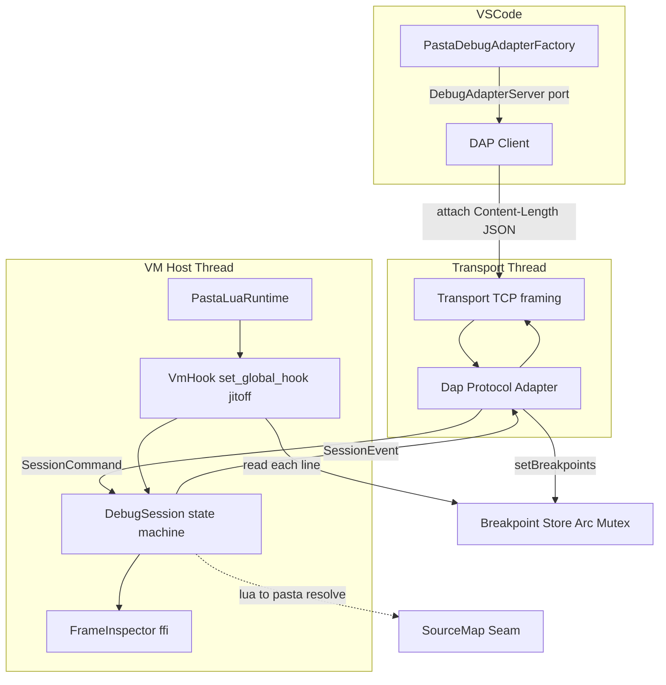
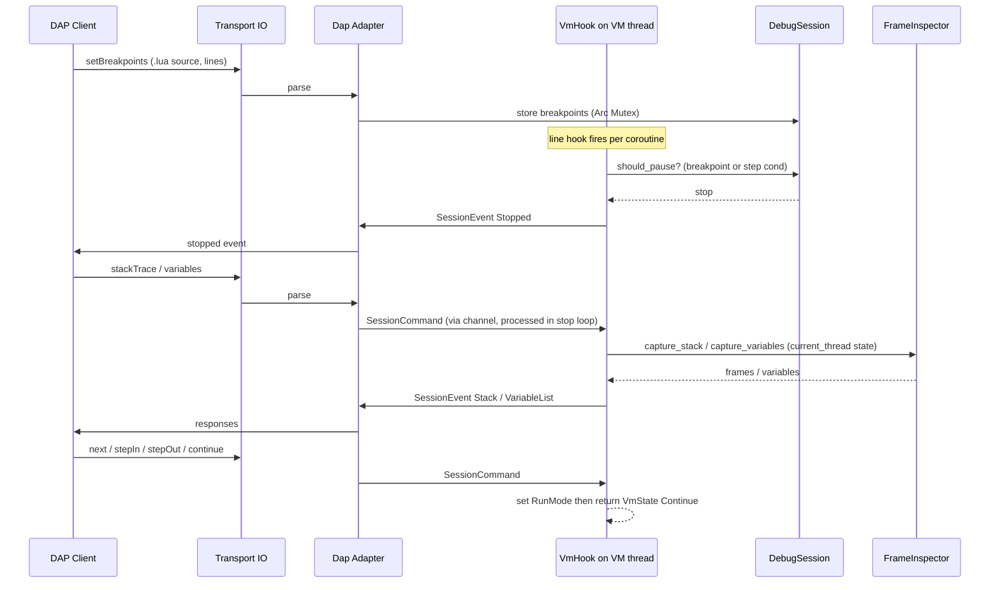
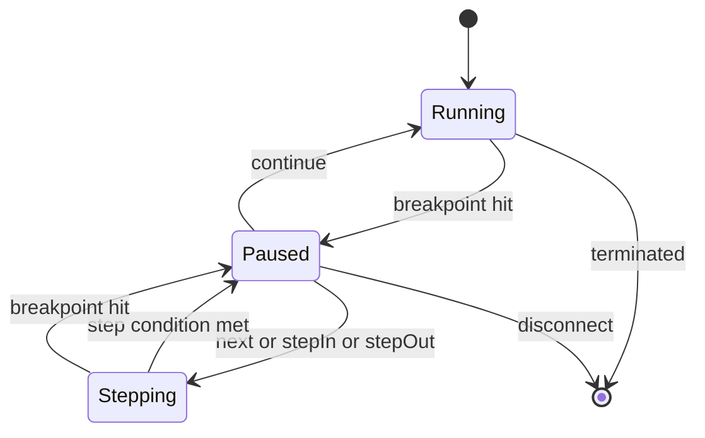

# Technical Design: pasta-vscode-lua-debug

## Overview

**Purpose**: 本仕様は、VSCode（DAP クライアント）から pasta の組込 LuaJIT を **生成 `.lua` レベルでデバッグ**（ブレークポイント／ステップ over・into・out／コールスタック／変数 inspect・コルーチン本体フレーム含む）できる、Rust ホスト型デバッグバックエンドを pasta_lua に内蔵する。上流 `pasta-lua-debug-feasibility`（GO+）が実証した方式（無引数 `jit.off()` ＋ `set_global_hook` ＋ `mlua::ffi` 変数 inspect ＋ `std::net` トランスポート）を本番化する。

**Users**: pasta 開発者・ゴースト作者が、print デバッグに代えて VSCode の標準デバッグ UI でシーン実行（yield/resume コルーチン）を追跡する。

**Impact**: デバッグ機能ゼロの現状に対し、pasta_lua に独立した `debug` モジュールを追加し、VM 初期化にデバッグ有効時のみフックを差し込む。デバッグ無効時は本番動作にゼロコスト・サンドボックス維持。あわせて旧 luasocket 資産を撤去し、本番移行完了後に PoC ハーネスを除去する。`.pasta` ソースマップは本仕様では**実現可能性確定（調査＋薄い実証スライス＋設計シーム）**までを担い、本番化は別仕様（`pasta-source-map`）へ委ねる。

### Goals
- 生成 `.lua` レベルの DAP デバッグ（BP／step／callstack／variables／continue／coroutine 横断）を本番提供する。
- デバッグ基盤を SHIORI 非依存・pasta_lua 内蔵とし、無効時ゼロコスト・`std_debug` 非露出を保つ。
- `.pasta` ソースマップの実現可能性を確定し、将来別仕様が差し込める設計シーム＋薄い実証スライスを残す。
- 追加外部依存ゼロ（`std::net` ＋ 既存 `serde_json` ＋ 既存 `mlua`）で実装する。

### Non-Goals
- `.pasta`↔`.lua` ソースマップの本番実装（全 `generate_*` 網羅・`.pasta` 座標の常時提示）→ 別仕様 `pasta-source-map`。
- 条件付きブレークポイント・ウォッチ式・ホットリロード。
- 非 SHIORI ホストへの実配線（基盤は再利用可能にするが実統合は将来）。
- ブレーク中ホスト応答停止（SSP タイムアウト）の根本解決。LSP 機能。

## Boundary Commitments

### This Spec Owns
- **デバッグバックエンド**（`crates/pasta_lua/src/debug/`）: transport（TCP）＋ DAP 最小サブセット（手書き）＋ VM フック制御＋停止状態機械＋フレーム/変数 inspect（コルーチン state 走査を含む）。
- **デバッグ有効化と無効時ゼロコスト**: `RuntimeConfig`/`LuaConfig` 拡張と環境変数による有効化フラグ、無効時のフック非設置・接続口非開放・`std_debug` 非露出。
- **ホスト非依存 API**: SHIORI を import しないデバッグ公開 API（R6）。
- **`.pasta` ソースマップ実現可能性確定**: code_gen の出力行↔span 記録シーム、マップ受け渡し IF、DAP の source 取り扱い口、代表 1 経路の薄い実証スライス（feature gate）。
- **VSCode デバッグ構成**: `contributes.debuggers` ＋ `DebugAdapterServer(port)` を返す薄い Factory（attach）。
- **旧 luasocket 資産の撤去** と **PoC ハーネス除去**（完了条件）。

### Out of Boundary
- `.pasta` ソースマップ本番実装（全 `generate_*` 網羅・本番マップ出力・`.pasta` 座標常時提示）→ `pasta-source-map`。
- 条件付き BP／ウォッチ式／ホットリロード、非 SHIORI 実配線、SSP タイムアウト根本解決、LSP。
- DAP の高度機能（goto/setVariable/evaluate/conditional breakpoints 等）。本仕様は最小サブセットのみ。

### Allowed Dependencies
- `mlua 0.11`（`set_global_hook` / `Thread::state()` / `Lua::exec_raw` / `mlua::ffi`）、LuaJIT `jit.off()`（無引数）。
- `std::net::TcpListener` / `std::thread` / `std::sync::mpsc` / `std::sync::{Arc, Mutex}`。
- 既存 `serde_json`（DAP メッセージ手書き）。
- pasta_lua runtime（`PastaLuaRuntime`/VM 初期化）、code_gen（span 素材）、editors/vscode。
- **禁止**: `dap` クレート等の新規重依存（alpha・依存最小方針）、デバッグコアからの `pasta_shiori` import（R6 違反）。

### Revalidation Triggers
- **DAP コントラクト形状の変更**（メッセージ／ケイパビリティ）→ VSCode 拡張・クライアント再検証。
- **ソースマップ・シーム IF の変更**（`SourceMapSink` / `LineMap` / DAP source 表現）→ 下流 `pasta-source-map` 再検証。
- **デバッグ有効化キー／環境変数名の変更** → 運用設定・ドキュメント再検証。
- **VM スレッド/チャネルモデル（seam）の変更** → ホスト統合（SHIORI/将来ホスト）再検証。
- **PoC ハーネス除去（R9）** → feasibility エビデンスの担保元が本番テスト＋research へ移行。

## Architecture

### Existing Architecture Analysis
- **VM 初期化**: `runtime/mod.rs` が `Lua::unsafe_new_with(std_lib, ...)`。`set_hook` 未使用、`debug` 既定 OFF（`StdLib::ALL_SAFE`）。`RuntimeConfig.libs` に `std_debug` を足す経路は既存（runtime_config.rs）。モジュール登録は `register` 系 public fn（`log.rs` が参照実装）。
- **request 同期性**: `pasta_shiori` は Arc<Mutex> 直列・`request_fn.call::<String>()` blocking。**ブレーク中は VM が復帰せず SHIORI 応答が停止**（構造的制約・R7）。
- **code_gen**: `LuaCodeGenerator { writer, indent_level, line_ending }`。出力は `writeln`/`write_blank_line`/`write_raw` の 3 メソッドに集約（**`writeln` が単一絞り込み点**）。Action の `span` は可用だが破棄。
- **VSCode 拡張**: `activate()` が register パターンで provider 登録。`contributes.debuggers` 不在。`@types/vscode ^1.85`（DAP API 互換）。esbuild→vsce。

### Architecture Pattern & Boundary Map

採択パターン: **Rust ホスト型 DAP バックエンド（LRDB 型）**。停止コア（protocol 非依存）／プロトコルアダプタ（DAP）／トランスポート（I/O）を分離し、`mlua::Lua`（`!Send`）は VM スレッドに固定、チャネルを唯一の seam とする。



**Architecture Integration**:
- **Selected pattern**: 停止コア＋プロトコルアダプタ＋I/O 分離。stopped 時のみ `DebugSession` が hook 内ループでコマンド処理（continue/step/inspect/stack）を実行。
- **Domain boundaries**: `debug/` がデバッグ責務を単独保有。runtime は「有効時にフック設置」する薄い配線のみ。DAP 知識は `dap.rs` に閉じ、`session.rs` は protocol 非依存（R6 とプロトコル将来拡張を interface レベルで担保）。
- **Existing patterns preserved**: `register` 系 public fn（`debug::enable`）、`RuntimeConfig`/`LuaConfig` 設定経路、VSCode `activate()` register パターン、code_gen `writeln` 単一点。
- **Dependency direction**: `transport → dap → session → {hook, inspect, breakpoints, source_map}`。各層は左側のみへ依存。`session` は `dap` を知らない（イベント/コマンド型のみ共有）。
- **Steering compliance**: MIT/Apache-2.0 互換のみ、依存最小、`!Send` 単一スレッド呼び出し、サンドボックス（無効時 `std_debug` 非露出）。

**セッションライフサイクル**: `DebugSession`・`BreakpointSet`・`DebugHandle` は **runtime スコープで永続**し、多数の短命 SHIORI リクエストを跨いで状態を保持する（フックは VM 初期化時に一度だけ設置）。Lua が走るのは各リクエスト処理中のみであり、**停止はリクエスト処理中にのみ発生**する。リクエスト間（Lua 非実行時）はフックが発火せず、停止・ステップは起こらない。実装は BP ストア／セッション状態を request スコープに置いてはならない（トーク跨ぎの step が破綻する）。

### Technology Stack

| Layer | Choice / Version | Role in Feature | Notes |
|-------|------------------|-----------------|-------|
| CLI / Editor | VSCode 拡張（TypeScript, `@types/vscode ^1.85`, esbuild） | `contributes.debuggers` ＋ DebugAdapterServer factory（attach） | ビルド/パッケージング（vsce）不変 |
| Backend / Debug | Rust 2024, `mlua 0.11`（luajit52, vendored） | hook（`set_global_hook`）・`jit.off()`・FFI inspect・停止状態機械 | 追加クレートなし。PoC で実証済み |
| Transport / Protocol | `std::net::TcpListener` ＋ 既存 `serde_json` | DAP 最小サブセット手書き・Content-Length フレーミング | `dap` クレート不採用 |
| Transpiler | 既存 `code_gen`（`LuaCodeGenerator`） | 出力行↔`.pasta` span 記録シーム（R4） | 本番は no-op sink（ゼロコスト） |

## File Structure Plan

### Directory Structure
```
crates/pasta_lua/src/debug/        # 新規: デバッグバックエンド（SHIORI 非依存）
├── mod.rs           # 公開 API: DebugConfig, enable(), DebugHandle, DebugError。有効化ゲート
├── transport.rs     # TcpListener + Content-Length フレーミング（I/O スレッド専用、Lua 非アクセス）
├── dap.rs           # DAP 最小サブセット（serde_json 手書き）。DAP <-> SessionCommand/Event 変換
├── session.rs       # DebugSession 状態機械（RunMode/StepController/PauseGate）。protocol 非依存
├── hook.rs          # set_global_hook 設置・jit.off()・line フック callback・停止ループ駆動
├── inspect.rs       # FrameInspector: コールスタック＋変数（mlua::ffi、コルーチン state 走査）
├── breakpoints.rs   # BreakpointSet（Arc<Mutex> 共有）・解決（source/line 包含述語）
└── source_map.rs    # R4: SourceMapSink/LineMap/PastaPos シーム ＋ 薄い実証スライス（feature gate）
```

### Modified Files
- `crates/pasta_lua/src/runtime/mod.rs` — VM 初期化後、デバッグ有効時のみ `debug::enable(&lua, &debug_cfg)` を呼び、`DebugHandle` を runtime に保持（無効時は何もしない）。
- `crates/pasta_lua/src/runtime/runtime_config.rs` — `RuntimeConfig` から `DebugConfig`（enabled/listen/source_map_slice）を導出。`std_debug` は Lua へ露出せず Rust 側 hook のみ。
- `crates/pasta_lua/src/loader/config.rs`（関連 `config.rs`） — pasta.toml に `[debug]` 設定（`enabled`/`port`、既定 `port = 9276`）を追加（既存設定構造 `PastaConfig`/`LoaderConfig` に準拠）。環境変数（`PASTA_DEBUG`/`PASTA_DEBUG_PORT`）読み取り（Rust `std::env`）。
- `crates/pasta_lua/src/code_gen/mod.rs` — `LuaCodeGenerator` に出力行カウンタ `out_line` と `source_map: Option<&mut dyn SourceMapSink>` を追加。`writeln` で行加算、span 既知時に `record()`。本番は `None`（ゼロコスト）。
- `crates/pasta_lua/src/code_gen/element_gen.rs` / `scope_gen.rs` — `generate_action` 等へ `span` を引き回し、`writeln` 記録点へ渡す（シーム。スライスは代表 1 経路を充填）。
- `crates/pasta_lua/Cargo.toml` — feature `pasta-source-map-slice`（R4 スライス・default 無効）追加。R9 で `lua-debug-poc` を削除。
- `editors/vscode/package.json` — `contributes.debuggers`（type `pasta`、attach）＋ `activationEvents` に `onDebug:pasta` ＋ `breakpoints`（language `pasta`/`lua`）。
- `editors/vscode/src/extension.ts` — `activate()` に `vscode.debug.registerDebugAdapterDescriptorFactory("pasta", factory)` を追加し subscriptions へ。
- `editors/vscode/src/debugAdapterFactory.ts` — 新規: `DebugAdapterServer(port, host)` を返す薄い Factory。

### Removed Files (R8 / R9)
- R8: `crates/pasta_lua/pasta_scripts/vscode-debuggee.lua`, `pasta_scripts/socket/core.dll`, `pasta_scripts/mime/core.dll`, `pasta_scripts/dkjson.lua`（DLL 内蔵 zip 肥大解消）。
- R9: `crates/pasta_lua/tests/runtime/lua_debug_poc_test.rs` ＋ `lua_debug_poc_test/`（7 サブモジュール）、`tests/runtime/main.rs` の gated mod 宣言行、`Cargo.toml` の `lua-debug-poc` feature（除去前提充足後）。

## System Flows

### 停止 → inspect → step/continue（VM スレッドのフック内で処理）


主要判断: ブレーク中の `stackTrace`/`variables` は **VM スレッド上（フック内ループ）** で FFI 実行（`mlua::Lua` を move しない）。`setBreakpoints` のみ実行中でも可（`Arc<Mutex>` 共有）。それ以外のコマンドは停止中のみ処理。

### DebugSession 状態機械（StepController）


`Stepping { kind, thread, base_depth }`: ステップは**コルーチン identity（`thread` = `current_thread().state()` ポインタ）込み**で管理。各 line フックで `現在 thread == Stepping.thread` のときのみスタック深さ（`lua_getstack` 走査でカウント）を `base_depth` と比較し、Over=「深さ ≤ base かつ行変化」、In=「次の停止可能行」、Out=「深さ < base」で `Paused` へ。**thread 不一致（ホストループ・別コルーチン）の行はスキップして継続**。コルーチン自身のスタックは yield で保存されるため、**yield/resume を跨いで step が成立**する。`get_property` 等のリクエスト跨ぎ非同期 yield では、step は**次 resume 時に同 thread+depth で停止**する（それまで保留＝pasta の非同期モデル上の自然な挙動）。

## Requirements Traceability

| Requirement | Summary | Components | Interfaces | Flows |
|-------------|---------|------------|------------|-------|
| 1.1, 1.2 | `.lua` 行 BP 設定・到達で停止 | Breakpoints, VmHook, DebugSession | BreakpointSet, should_pause | 停止フロー |
| 1.3–1.5 | step over/into/out | DebugSession(StepController), VmHook, Inspect | RunMode/StepKind, capture depth | 状態機械 |
| 1.6 | continue | DebugSession, VmHook | SessionCommand::Continue | 状態機械 |
| 1.7 | コルーチン横断発火 | VmHook | set_global_hook(EVERY_LINE) | 停止フロー |
| 2.1 | コールスタック | FrameInspector, DebugSession | capture_stack | 停止フロー |
| 2.2, 2.3 | 変数 inspect・型表現 | FrameInspector | capture_variables, type 判別 | 停止フロー |
| 2.4 | コルーチン本体フレーム inspect | FrameInspector | Thread::state() → ffi 走査 | 停止フロー |
| 2.5 | 取得不能の graceful 継続 | FrameInspector | unsupported repr / 空フレーム | 停止フロー |
| 3.1 | attach 接続口 | Transport, DebugConfig | TcpListener bind | — |
| 3.2 | initialize ケイパビリティ | Dap | InitializeResponse caps | — |
| 3.3 | DAP 最小サブセット要求処理 | Dap, DebugSession | SessionCommand 群 | 停止フロー |
| 3.4, 3.5 | stopped/terminated イベント | Dap, DebugSession | SessionEvent | 停止フロー |
| 3.6 | VSCode デバッグ構成 attach | VscodeDebugFactory | DebugAdapterServer | — |
| 4.1 | `.pasta` 行対応の実現可能性確認・記録 | SourceMapSeam, research | research 記録 | — |
| 4.2 | code_gen 記録シーム | CodeGenSourceMapHook | SourceMapSink, out_line | — |
| 4.3 | DAP source 取り扱い口 | Dap, SourceMapSeam | Source 表現（既定 .lua） | — |
| 4.4, 4.5 | 薄い実証スライス（.pasta 変換/BP ヒット） | SourceMapSeam(slice) | resolve_lua_to_pasta（gate） | — |
| 4.6 | スライス無効時ゼロコスト | DebugConfig, CodeGenSourceMapHook | None sink / feature gate | — |
| 5.1 | 有効/無効切替 | DebugConfig | from_runtime(env, cfg) | — |
| 5.2 | 無効時フック非設置・無コスト | runtime wiring, DebugConfig | enable() returns None | — |
| 5.3 | 無効時 std_debug 非露出 | runtime_config | Rust 側 hook のみ | — |
| 5.4 | 有効時フック/診断有効化 | VmHook, runtime wiring | enable() | — |
| 5.5 | 無効時 接続口非開放 | Transport, DebugConfig | listen=None | — |
| 6.1–6.3 | ホスト非依存基盤 | debug module API | enable()/DebugHandle（SHIORI 非 import） | — |
| 7.1–7.3 | ブレーク中応答停止と緩和 | BreakStallGuidance | ドキュメント・運用注意 | — |
| 8.1–8.3 | 旧 luasocket 撤去 | LegacyAssetRemoval | ファイル削除＋回帰確認 | — |
| 9.1–9.4 | PoC ハーネス除去（完了条件） | PocHarnessRemoval | feature/テスト削除ゲート | — |

## Components and Interfaces

| Component | Domain/Layer | Intent | Req Coverage | Key Dependencies (P0/P1) | Contracts |
|-----------|--------------|--------|--------------|--------------------------|-----------|
| DebugConfig & Gate | debug/mod | 有効化判定とゼロコストゲート | 5, 4.6, 6 | RuntimeConfig (P0) | Service, State |
| Transport | debug/transport | TCP・Content-Length I/O | 3.1, 5.5 | std::net (P0) | Service |
| DapAdapter | debug/dap | DAP 最小サブセット変換 | 3.2–3.5, 4.3 | serde_json (P0), Session (P0) | API, Event |
| DebugSession | debug/session | 停止状態機械・step・コマンド処理 | 1, 3.3 | VmHook (P0), Breakpoints (P0) | Service, State |
| VmHook | debug/hook | フック設置・jit.off・発火 | 1.2, 1.7, 5.2, 5.4 | mlua (P0) | Service |
| FrameInspector | debug/inspect | スタック/変数（コルーチン含む） | 2 | mlua::ffi (P0) | Service |
| Breakpoints | debug/breakpoints | BP 集合・解決 | 1.1 | — | State |
| SourceMapSeam | debug/source_map | R4 シーム＋薄いスライス | 4 | code_gen (P1) | Service, State |
| CodeGenSourceMapHook | code_gen | 出力行↔span 記録シーム | 4.2, 4.6 | LuaCodeGenerator (P0) | Service |
| VscodeDebugFactory | editors/vscode | attach 用 server descriptor | 3.6 | vscode API (P0) | Service |
| BreakStallGuidance | docs | 応答停止の運用注意・緩和 | 7 | — | — |
| LegacyAssetRemoval | pasta_scripts | 旧 luasocket 撤去 | 8 | build.rs zip (P1) | — |
| PocHarnessRemoval | tests | PoC 除去（完了条件） | 9 | — | — |

### Debug Backend (Rust)

#### DebugConfig & Gate

| Field | Detail |
|-------|--------|
| Intent | デバッグ有効化判定と無効時ゼロコストの単一窓口 |
| Requirements | 5.1, 5.2, 5.3, 5.5, 4.6, 6.1 |

**Responsibilities & Constraints**
- 設定（`[debug]`）と環境変数（`PASTA_DEBUG`/`PASTA_DEBUG_PORT`）から有効化を導出。無効時は `enable()` が `None` を返し、フック非設置・接続口非開放（R5.2/5.5）。
- `std_debug` を Lua へ露出しない（Rust 側 hook のみ・R5.3）。SHIORI を import しない（R6）。

**Contracts**: Service [x] / State [x]

##### Service Interface
```rust
pub struct DebugConfig {
    pub enabled: bool,
    pub listen: Option<std::net::SocketAddr>, // None=接続口を開かない
    pub source_map_slice: bool,               // R4 実証スライス（feature gate と AND）
}

impl DebugConfig {
    pub fn from_runtime(cfg: &RuntimeConfig) -> Self; // 設定＋env を統合
}

/// 有効時のみフックを設置しトランスポートを起動。無効時 Ok(None)（ゼロコスト）。
pub fn enable(lua: &mlua::Lua, cfg: &DebugConfig) -> Result<Option<DebugHandle>, DebugError>;

/// トランスポートスレッドと共有状態の所有者。Drop で停止。
pub struct DebugHandle { /* join handle, breakpoint store, shutdown flag */ }
```
- Preconditions: `lua` は VM スレッド上で構築済み。
- Postconditions: `enabled=false` のとき `lua` に hook 痕跡を残さない。
- Invariants: デバッグコアは `pasta_shiori` を参照しない。

#### DebugSession（停止状態機械・protocol 非依存）

| Field | Detail |
|-------|--------|
| Intent | breakpoint/step/continue/inspect 要求を停止状態機械として処理 |
| Requirements | 1.1–1.7, 3.3, 3.4, 3.5 |

**Responsibilities & Constraints**
- `RunMode`（Running/Stepping）を保持し、line フックから呼ばれて停止可否を判定。停止中は hook 内ループでコマンドを処理。
- DAP を知らない（`SessionCommand`/`SessionEvent` のみ）。R6 と将来プロトコル拡張を interface で担保。

**Contracts**: Service [x] / State [x]

##### Service Interface
```rust
pub enum SessionCommand {
    SetBreakpoints { source: SourceRef, lines: Vec<u32> },
    Continue, Next, StepIn, StepOut,
    StackTrace, Scopes { frame_id: u32 }, Variables { var_ref: u32 }, Threads,
    Disconnect,
}
pub enum SessionEvent {
    Stopped { reason: StopReason, thread_id: u32 },
    Terminated,
    Breakpoints(Vec<ResolvedBreakpoint>),
    Stack(Vec<FrameInfo>),
    Scopes(Vec<Scope>),
    Variables(Vec<Variable>),
    Threads(Vec<ThreadInfo>),
    Error(String), // mlua::Error は !Send のため String 化して越境
}
pub enum StopReason { Breakpoint, Step, Entry, Pause }
enum RunMode { Running, Stepping { kind: StepKind, thread: ThreadId, base_depth: u32 } }
enum StepKind { Over, In, Out }
// ThreadId = 走行中コルーチンの lua_State ポインタ（current_thread().state()）。
// 補助型 SourceRef / ResolvedBreakpoint / Scope / ThreadInfo / FrameInfo / Variable は
// session.rs・breakpoints.rs・inspect.rs に定義（DAP 非依存の素の型）。
```
- Preconditions: `StackTrace`/`Variables` は停止中のみ有効。
- Postconditions: `Continue`/`Next`/`StepIn`/`StepOut` は `RunMode` を更新し `VmState::Continue` で復帰。
- Invariants: `mlua::Lua` を channel 越しに渡さない（コマンド/イベントのみ）。

#### VmHook

| Field | Detail |
|-------|--------|
| Intent | フック設置・jit.off・行発火・停止ループ駆動 |
| Requirements | 1.2, 1.7, 5.2, 5.4 |

**Responsibilities & Constraints**
- 有効時に **無引数 `jit.off()`**（エンジン全体）を適用し（PoC 知見: `jit.off(true,true)` は不十分）、`set_global_hook(HookTriggers::EVERY_LINE, cb)` を設置（全コルーチン横断・R1.7）。
- callback は常に `Ok(VmState::Continue)`（LuaJIT は Yield 不可）。`DebugSession::on_line` を呼び、停止時は `block_until_command` で無期限ブロック（watchdog なし）。
- hook 内 panic はサイドチャネル（`Mutex<Option<String>>`）へ記録（MSVC/LuaJIT C-unwind でペイロード消失の PoC 知見）。

**Contracts**: Service [x]

```rust
pub(crate) fn install(lua: &mlua::Lua, session: SessionShared) -> mlua::Result<()>;
// cb: move |lua, debug| { session.on_line(lua, &debug) }
```

#### FrameInspector（コルーチン state 走査で R2.4 を解決）

| Field | Detail |
|-------|--------|
| Intent | コールスタックと変数を安全 API＋FFI で取得（走行中コルーチン含む） |
| Requirements | 2.1, 2.2, 2.3, 2.4, 2.5 |

**Responsibilities & Constraints**
- コールスタック: `Debug`/FFI から `FrameInfo { source, line, func_name }` を収集（R2.1）。
- 変数: 対象スレッドの生 `lua_State*` に対し `lua_getstack`/`lua_getlocal`/`lua_getupvalue` を実行。number/string/boolean/table を `lua_type` で判別、未対応型は `<unsupported T>` 表現で記録（R2.3/2.5）。スタック規律（`lua_gettop`→`lua_settop` 対称）厳守。
- **R2.4 解決**: フックの `&Lua`（メインステート）ではなく `lua.current_thread().state()`（走行中コルーチンの `lua_State*`）に対して走査する。これによりコルーチン本体フレームの局所変数へ到達（PoC は exec_raw のメインステート固定で未到達だった）。

**Contracts**: Service [x]
```rust
pub(crate) fn capture_stack(lua: &mlua::Lua, thread: &mlua::Thread) -> Vec<FrameInfo>;
pub(crate) fn capture_variables(lua: &mlua::Lua, thread: &mlua::Thread, frame_level: u32) -> Vec<Variable>;
// FrameInfo { source: String, line: u32, func_name: Option<String> }
// Variable  { name: String, type_name: String, repr: String }
```
- Invariants: いかなる入力でも VM スタックを破壊しない／panic しない（R2.5 graceful）。

#### Transport & DapAdapter

| Field | Detail |
|-------|--------|
| Intent | TCP I/O（Content-Length フレーミング）と DAP 変換 |
| Requirements | 3.1, 3.2, 3.3, 3.4, 3.5, 4.3, 5.5 |

**Responsibilities & Constraints**
- Transport: `TcpListener` を `listen` で bind（None なら起動しない・R5.5）、1 接続を accept、`Content-Length: N\r\n\r\n{json}` フレーミングで読み書き（I/O のみ・Lua 非アクセス）。**PoC の素朴な行プロトコルは DAP 準拠フレーミングへ作り直す**。
- DapAdapter: DAP リクエストを `SessionCommand` へ、`SessionEvent` を DAP レスポンス/イベントへ変換（serde_json 手書き）。

**Contracts**: API [x] / Event [x]

##### API Contract（DAP 最小サブセット）
| Request | → SessionCommand | Response/Event |
|--------|------------------|----------------|
| initialize | — | capabilities（supportsConfigurationDoneRequest 等の最小） |
| setBreakpoints | SetBreakpoints | breakpoints[]（verified） |
| configurationDone | — | ack |
| threads | Threads | threads[] |
| stackTrace | StackTrace | stackFrames[]（source=生 .lua・R4.3 で .pasta 拡張余地） |
| scopes | Scopes | scopes[]（locals/upvalues） |
| variables | Variables | variables[] |
| continue / next / stepIn / stepOut | Continue/Next/StepIn/StepOut | ack ＋ 後続 stopped |
| disconnect | Disconnect | terminated |

##### Event Contract
- Published: `stopped`（reason: breakpoint/step/entry・R3.4）, `terminated`（R3.5）, `output`（任意）。
- Delivery: 単一クライアント・順序保証は TCP ストリーム順。

**Implementation Notes**
- Integration: DAP 解析は I/O スレッド、停止中の FFI 実行は VM スレッド（hook 内）。`var_ref`/`frame_id` の採番は DapAdapter が管理し table 展開は最小（深掘りは将来）。
- Risks: DAP フレーミングの実装漏れ、初回 `initialize`/`configurationDone` ハンドシェイク順序。

#### SourceMapSeam & CodeGenSourceMapHook（R4: 実現可能性確定）

| Field | Detail |
|-------|--------|
| Intent | `.pasta`↔`.lua` 行対応の記録シーム＋将来仕様向け IF＋薄い実証スライス |
| Requirements | 4.1, 4.2, 4.3, 4.4, 4.5, 4.6 |

**Responsibilities & Constraints**
- **シーム（本仕様で確定）**: `LuaCodeGenerator` に出力行カウンタと `Option<&mut dyn SourceMapSink>` を追加。`writeln` で行加算、span 既知時に `record(out_line, span)`。本番 transpile は `None`（ゼロコスト・R4.6/R5.2）。
- **薄い実証スライス（feature `pasta-source-map-slice` ＋ debug 有効の AND）**: 代表 1 経路（例: 単純 talk 1 行）について `LineMap` を構築し、停止位置の `.lua` 行→`.pasta` 行へ変換（R4.4）、その `.pasta` 行 BP をヒット（R4.5）を実コードで実証。
- **本番化は別仕様**: 全 `generate_*` 網羅・本番マップ出力・`.pasta` 座標常時提示は `pasta-source-map` へ申し送り（R4.1 の残課題記録）。

**Contracts**: Service [x] / State [x]
```rust
pub struct PastaPos { pub file: String, pub line: u32 }
pub struct LineMap { /* lua_line -> PastaPos（スライスは部分、本番は全網羅＝別仕様） */ }
pub trait SourceMapSink { fn record(&mut self, lua_line: u32, span: pasta_dsl::Span); }

#[cfg(feature = "pasta-source-map-slice")]
pub fn resolve_lua_to_pasta(map: &LineMap, lua_line: u32) -> Option<PastaPos>;
```
- Invariants: `SourceMapSink=None` 時、code_gen 出力は従来とバイト一致（回帰なし）。

### Editor (TypeScript)

#### VscodeDebugFactory（summary-only ＋ Implementation Note）

| Field | Detail |
|-------|--------|
| Intent | `.pasta` デバッグ構成と attach 用 server descriptor の提供 |
| Requirements | 3.6 |

**Contracts**: Service [x]
```typescript
export class PastaDebugAdapterFactory implements vscode.DebugAdapterDescriptorFactory {
  createDebugAdapterDescriptor(
    session: vscode.DebugSession,
    _executable: vscode.DebugAdapterExecutable | undefined,
  ): vscode.ProviderResult<vscode.DebugAdapterDescriptor> {
    const host = String(session.configuration.host ?? "127.0.0.1");
    const port = Number(session.configuration.port ?? DEFAULT_DEBUG_PORT);
    return new vscode.DebugAdapterServer(port, host);
  }
}
```
**Implementation Notes**
- Integration: `package.json` の `contributes.debuggers`（type `pasta`・attach・host/port）＋ `activate()` で `registerDebugAdapterDescriptorFactory("pasta", factory)`。既定 host/port は Rust 側と一致（`127.0.0.1:9276`、`DEFAULT_DEBUG_PORT = 9276`）。ビルド（esbuild→vsce）不変。バンドル JS アダプタ（`program`）は不採用（DAP 本体は Rust 側）。
- Validation: `.pasta`/`.lua` で BP 設定可（`contributes.breakpoints`）。
- Risks: launch.json は attach のみ（VM 側がデバッグ有効で待ち受け前提）。

### Operational（R7/R8/R9）

- **BreakStallGuidance (R7)**: ブレーク中は SHIORI 応答が保留される構造的制約を、デバッグ利用ガイダンス（マニュアル/README）に明示し、SSP タイムアウト回避の運用注意（デバッグ専用起動・短時間ブレーク推奨）を提供。**停止中は VM スレッドが SHIORI リクエストの Mutex を保持するため、当該リクエストだけでなく後続の全 SHIORI リクエストが待機する**点も明示。根本解決はスコープ外と明記。
- **LegacyAssetRemoval (R8)**: `pasta_scripts/` の luasocket 資産を削除し build.rs の zip を再生成。撤去後に起動・スクリプト実行の回帰がないことを確認。
- **PocHarnessRemoval (R9)**: 本番実装の検証完了・知見移行完了・本番テスト存在の前提充足後に `lua-debug-poc` feature とテスト一式を削除。GO+ 担保は本番テスト＋feasibility research へ移行。前提未充足時は残置。

## Error Handling

### Error Strategy
- **DebugError**（discriminated）: `Bind(io::Error)` / `Protocol(String)` / `Vm(String)` / `Disconnected`。`mlua::Error`（`!Send`）は境界で `String` 化（`SessionEvent::Error`）。
- **Fail-safe over fail-stop（デバッグ）**: inspect の未対応型・到達不能フレームは `<unsupported>`/空で継続し VM を壊さない（R2.5）。トランスポート切断時は `Continue` で VM を復帰させデバッグセッションのみ終了（本番実行を巻き込まない）。
- **Hook panic**: サイドチャネル記録＋セッション終了。VM プロセスは継続。

### Monitoring
- 既存 `@pasta_log`/tracing にデバッグセッション開始/停止/接続/切断を記録（無効時は無出力）。

## Testing Strategy

### Unit Tests
- StepController 深さ判定: over/into/out が `base_depth`/行変化条件で正しく停止（1.3–1.5）。
- PauseGate 包含述語: `(source,line)` 一致で停止・不一致で継続（1.1, 1.2）。
- FrameInspector 型判別: number/string/boolean/table 表現、未対応型 graceful（2.3, 2.5）。
- DAP encode/decode ラウンドトリップ: initialize/setBreakpoints/stackTrace/variables/stopped/terminated（3.2–3.5）。
- DebugConfig ゲート: 無効時 listen=None・hook 非設置・slice 経路非露出（5.2, 5.5, 4.6）。

### Integration Tests
- グローバルフック発火: 動的生成シーンコルーチン群を横断して line 発火（1.7）。
- 停止→stackTrace→variables→continue をチャネル越しに実施（2.1, 2.2, 3.3）。
- **コルーチン本体フレーム inspect**: 走行中コルーチンの局所変数取得（`current_thread().state()` 経路・2.4）。
- 無効時ゼロコスト/サンドボックス: hook 痕跡なし・`std_debug` 非露出・接続口非開放（5.2, 5.3, 5.5）。
- luasocket 撤去後の起動・スクリプト実行回帰なし（8.2）。

### E2E Tests
- VSCode attach → 生成 `.lua` 行に BP → ヒット → step over/into/out → 変数 inspect → continue → terminated（1.x, 2.x, 3.x, 3.6）。
- **薄い実証スライス（gate 有効）**: 代表 1 経路で `.pasta` 行 BP 設定 → 停止位置を `.pasta` 行へ変換提示 → ヒット（4.4, 4.5）。

### Performance/Regression
- 無効ビルドでのトランスパイル出力バイト一致（SourceMapSink=None・回帰なし）。
- 無効時の VM 実行性能に hook 由来の追加コストがない（5.2）。

## Open Questions / Risks
- **R-1 コルーチン step（yield/resume 跨ぎ）**: **解決（設計ディスカッション #1・採択=B）**。`StepController` を `(thread, base_depth)` で鍵付けし、現在 thread 一致時のみ深さ判定。コルーチンのスタックは yield で保存されるため step は yield/resume を跨いで成立。リクエスト跨ぎ非同期 yield は次 resume で停止完了（それまで保留）。残る実装注意は ThreadId（`current_thread().state()` ポインタ）の同一性が resume を跨いで安定であることの確認で、薄い実証スライス／早期統合テストで担保する。
- **R-2 コルーチン state 走査の安全性**: `current_thread().state()` 生ポインタへの FFI 走査の有効性は薄い実証で先行確認（R2.4 の唯一の本番新規）。失敗時はメインスレッドフレームに限定し制約を明示。
- **R-3 DAP フレーミング/ハンドシェイク**: Content-Length 実装と initialize→configurationDone 順序の取り違えに注意（DapAdapter のテストで担保）。
- **R-4 ソースマップ本番境界**: 本仕様のシーム/スライスと別仕様の本番実装の分界点を `pasta-source-map` 着手時に再確認（Revalidation Trigger）。
