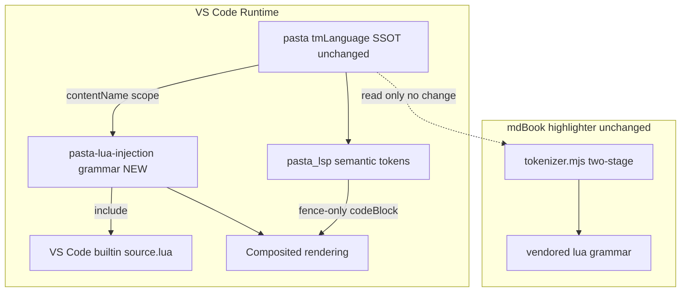
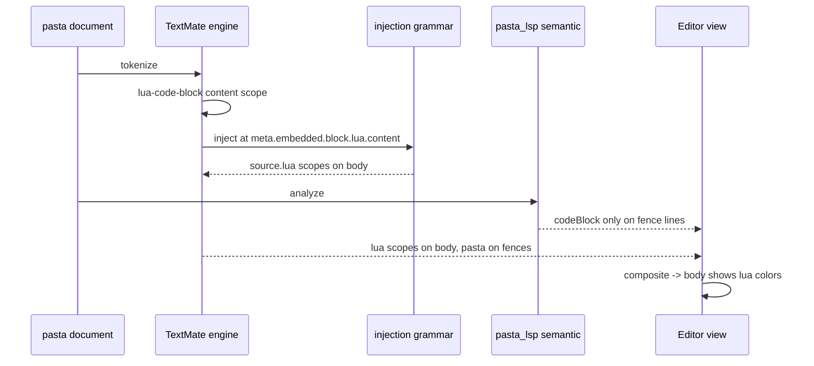

# Technical Design

## Overview

**Purpose**: 本機能は、`.pasta` ファイルを VS Code で編集するゴースト作者に対し、複数行 Lua コードブロック（```` ```lua ... ``` ````）の内部を VS Code 組み込み Lua 文法（`source.lua`）で自動シンタックスハイライトする。

**Users**: pasta ゴースト作者が、複雑な Lua ロジックをブロック内に記述する際、キーワード・文字列・コメント・数値・関数名が色分けされた状態で編集できるようになる。

**Impact**: 現在、Lua ブロック本文は (1) TextMate 側で `source.lua` 未注入のため無着色、(2) pasta_lsp のセマンティックトークン `codeBlock` がブロック本文全域を単色で上書き、という二重の理由で単色化している。本設計はこれを **「VS Code 注入文法による Lua 着色」＋「LSP セマンティックトークンのフェンス行限定化」** の2点で解消する。共有 SSOT 文法 `pasta.tmLanguage.json` および book ハイライタは**改変しない**。

### Goals

- Lua ブロック本文を VS Code 組み込み Lua 文法で自動着色する（操作不要）。
- 本文を覆っていた `codeBlock` セマンティックトークンをフェンス行のみへ縮小し、Lua 着色を可視化する。
- Lua ブロック外の pasta 固有ハイライト・既存セマンティックトークン・凡例、および同一 SSOT 文法を共有する book ハイライト出力を無回帰に保つ。

### Non-Goals

- ハイライト有効/無効の手動トグルコマンド/ボタン（R5.1。既存 `pasta.debug.toggleSourcePresentation` はデバッグ提示モード切替であり本機能とは無関係・対象外）。
- インライン Lua（`＠func()`）への Lua 文法注入（R5.2）。
- Lua ブロック内の診断・補完・定義ジャンプ等の言語サービス（R5.3）。
- book/ マニュアルのハイライト**機能仕様そのもの**の変更（pasta-manual-syntax-highlight の所有）。本設計は book を改変せず無回帰を担保するのみ。

## Boundary Commitments

### This Spec Owns

- **VS Code 注入文法**: 新規ファイル `editors/vscode/syntaxes/pasta-lua-injection.tmLanguage.json`（`meta.embedded.block.lua.content` へ `source.lua` を注入）と、その `package.json` 登録（`grammars[].injectTo: ["source.pasta"]`）。
- **LSP セマンティックトークン縮小**: `crates/pasta_lsp/src/analysis/visitors.rs` の `visit_code_block` を、Lua ブロックの**フェンス行のみ** `codeBlock` トークンを出力する形へ変更。
- **回帰テスト**: 上記2点の検証テスト、および Lua ブロック外・凡例・book 出力の無回帰検証。

### Out of Boundary

- 共有 SSOT 文法 `editors/vscode/syntaxes/pasta.tmLanguage.json` の改変（**不要・触らない**）。
- book/ ハイライタ（`book/tools/highlight/*`）の改変（**不要・触らない**）。book は自前 vendored lua 文法で独立に着色しており本機能の影響を受けない。
- セマンティックトークンの種別・修飾子の凡例（並び順・定義）の変更（R4.4・固定）。
- pasta DSL 文法そのものの変更。

### Allowed Dependencies

- **VS Code 組み込み `source.lua` 文法**（ランタイム時に常時利用可能・追加同梱不要）。
- 既存 `lua-code-block` TextMate ルールが付与する `contentName: meta.embedded.block.lua.content`（注入セレクタの標的。**読み取り依存のみ**・改変しない）。
- 既存 pasta_lsp 解析基盤（`CodeBlock` AST の `span`、`add_token_from_span` 等のトークン出力ユーティリティ）。
- VS Code エンジン `^1.85.0` の injection grammar 仕様（`injectTo` / `injectionSelector`）。

### Revalidation Triggers

以下の変更は下流コンシューマの再検証を要する：

- `lua-code-block` の `contentName`（`meta.embedded.block.lua.content`）の名称変更 → 注入セレクタと book 検出ロジックの双方が破綻。
- セマンティックトークン凡例（`token_types.rs` / `PASTA_TOKEN_TYPES`）の並び順・定義変更 → 全コンシューマ再検証。
- `CodeBlock` AST の `span` 意味（フェンス込み全域）の変更 → フェンス行算出ロジックが破綻。

## Architecture

### Existing Architecture Analysis

- **TextMate 層**（`editors/vscode/syntaxes/pasta.tmLanguage.json`・SSOT）: `lua-code-block`（begin/end）が `name: meta.embedded.block.lua` と `contentName: meta.embedded.block.lua.content` を付与するが、content へ `source.lua` を注入していない。**本設計はこのファイルを読み取り標的とするのみで改変しない。**
- **セマンティックトークン層**（`crates/pasta_lsp/src/analysis/visitors.rs`）: `visit_code_block` が `cb.span`（フェンス込み全域）を `add_token_from_span` で全行 `codeBlock` 化。セマンティックトークンは TextMate より優先合成されるため、本文の Lua 着色を隠す。
- **合成順序**（VS Code 前提）: セマンティックトークン > TextMate。ゆえに本文の Lua 着色を可視化するには、本文に重なる `codeBlock` を除去する必要がある（R3）。
- **book ハイライタ**（`book/tools/highlight/*`・隣接完了仕様）: 同一 SSOT 文法を読みつつ、自前 vendored lua 文法で `meta.embedded.block.lua.content` 区間を二段トークナイズ。**SSOT 文法を改変しない本設計では完全に無影響。**

### Architecture Pattern & Boundary Map



**Architecture Integration**:
- **Selected pattern**: VS Code Injection Grammar（埋め込み言語の標準注入機構）＋ セマンティックトークン範囲限定。
- **Domain/feature boundaries**: 「TextMate 着色」は注入文法（editors/vscode）が、「セマンティックトークン範囲」は pasta_lsp 解析層が単独所有。両者は相互依存なし。
- **Existing patterns preserved**: SSOT 文法 1ファイル原則（改変回避により book との共有を温存）、セマンティックトークン凡例の固定。
- **New components rationale**: 注入文法ファイルは「SSOT を汚さず Lua 着色を加える」ための最小の新規資産。
- **Steering compliance**: structure.md のエディタ拡張構成（`editors/vscode/syntaxes/`）に準拠。tech.md のレイヤー責務（pasta_lsp = 構文ハイライト/解析）に準拠。

### Technology Stack

| Layer | Choice / Version | Role in Feature | Notes |
|-------|------------------|-----------------|-------|
| Editor / Grammar | VS Code TextMate injection grammar (`^1.85.0`) | Lua ブロック本文へ `source.lua` を注入着色 | 新規ファイル＋`injectTo` 登録。SSOT 文法は不変 |
| Embedded language | VS Code 組み込み `source.lua` | 実際の Lua トークン化 | ランタイム同梱。テストは vendored lua で代替 |
| Backend / Analysis | Rust 2024 / pasta_lsp (tower-lsp, WASM/Native) | `codeBlock` セマンティックトークンをフェンス行限定化 | 凡例不変 |
| Test | esbuild + node (TS grammar test) / `cargo test` (Rust) | 着色注入・トークン縮小・無回帰の検証 | book テストは既存をそのまま実行 |

## File Structure Plan

### Directory Structure
```
editors/vscode/
├── syntaxes/
│   ├── pasta.tmLanguage.json              # UNCHANGED（SSOT・読み取り標的のみ）
│   └── pasta-lua-injection.tmLanguage.json # NEW: source.lua 注入文法
├── package.json                            # MODIFIED: grammars[] に injectTo エントリ追加
└── src/test/
    ├── tmGrammar.test.ts                   # MODIFIED: 注入着色＋フェンス保持の検証追加
    └── fixtures/
        ├── lua.tmLanguage.json             # NEW: テスト専用 vendored lua（source.lua 代替・ランタイム非同梱）
        └── LICENSE.lua-grammar.md          # NEW: vendored lua のライセンス表記

crates/pasta_lsp/
├── src/analysis/visitors.rs                # MODIFIED: visit_code_block フェンス行限定化
└── tests/
    └── code_block_token_test.rs            # NEW: フェンスのみ出力・本文非出力・無回帰の検証
```

### Modified Files
- `editors/vscode/package.json` — `contributes.grammars` に注入文法エントリ（`scopeName` / `path` / `injectTo: ["source.pasta"]`）を追加。既存 `grammars`（pasta 本体）・`semanticToken*` は不変。
- `editors/vscode/src/test/tmGrammar.test.ts` — テスト registry に注入文法と **editors/vscode 配下の vendored lua**（`src/test/fixtures/lua.tmLanguage.json`・`source.lua` として登録）を結線し、(a) content 区間に `source.lua` スコープが付くこと、(b) フェンス行の pasta スコープ保持を検証。注入の発見には vscode-textmate の `RegistryOptions.getInjections` を用いる（後述）。
- `crates/pasta_lsp/src/analysis/visitors.rs` — `visit_code_block` を、`cb.span.start_line`／`end_line`（フェンス行）のみ `codeBlock` を出力し本文行を非出力にする実装へ変更。

### Unchanged (no-regression targets)
- `editors/vscode/syntaxes/pasta.tmLanguage.json`（SSOT）
- `book/tools/highlight/*`（book ハイライタ一式）
- `editors/vscode/src/semanticTokensProvider.ts`（凡例 `PASTA_TOKEN_TYPES` 不変）
- `crates/pasta_lsp/src/analysis/token_types.rs`（種別・修飾子定義不変）

## System Flows

### 着色合成フロー（ランタイム）



本文行には `codeBlock` セマンティックトークンが無いため、TextMate 由来の `source.lua` 着色がそのまま表示される。フェンス行は pasta スコープ＋`codeBlock`（フェンス行のみ）で従来通り。

## Requirements Traceability

| Requirement | Summary | Components | Interfaces | Flows |
|-------------|---------|------------|------------|-------|
| 1.1 | Lua ブロック本文を Lua 文法で着色 | Injection Grammar | injectionSelector + include source.lua | 着色合成フロー |
| 1.2 | キーワード/文字列/コメント/数値/関数を区別着色 | Injection Grammar | source.lua スコープ | 着色合成フロー |
| 1.3 | 追加操作不要で適用 | Injection Grammar | always-on injection | — |
| 1.4 | 編集後も着色維持 | Injection Grammar | TextMate 逐次再トークナイズ | — |
| 2.1 | フェンスマーカーを pasta スコープで識別 | Injection Grammar（content 限定）+ 既存文法 | injectionSelector 範囲 = content のみ | — |
| 2.2 | フェンスと本文を境界で一貫区別 | Injection Grammar | content スコープ境界 | — |
| 3.1 | codeBlock を可視範囲へ限定 | LSP visit_code_block | フェンス行限定出力 | 着色合成フロー |
| 3.2 | 本文全域を単一トークンで覆わない | LSP visit_code_block | 本文行非出力 | 着色合成フロー |
| 3.3 | 合成結果として本文が Lua 色 | Injection + LSP | 合成順序前提 | 着色合成フロー |
| 4.1 | ブロック外 pasta ハイライト無回帰 | LSP（他 visitor 不変）+ 文法不変 | — | — |
| 4.2 | ブロック外セマンティックトークン無回帰 | LSP visit_code_block 限定変更 | — | — |
| 4.3 | Lua ブロック無し時も同一結果 | LSP（コードパス分岐なし） | — | — |
| 4.4 | 凡例（種別並び順）不変 | token_types.rs / PASTA_TOKEN_TYPES 不変 | — | — |
| 4.5 | book 出力の無回帰 | SSOT 文法・book 不変（方式A） | — | — |
| 5.1 | 手動トグル不提供 | （新規コマンド追加なし） | — | — |
| 5.2 | インライン Lua 注入なし | Injection Grammar（content 限定セレクタ） | — | — |
| 5.3 | 言語サービス不提供 | （LSP 機能追加なし） | — | — |

## Components and Interfaces

| Component | Domain/Layer | Intent | Req Coverage | Key Dependencies (P0/P1) | Contracts |
|-----------|--------------|--------|--------------|--------------------------|-----------|
| Lua Injection Grammar | Editor / TextMate | 本文へ source.lua を注入着色 | 1.1, 1.2, 1.3, 1.4, 2.1, 2.2, 5.2 | VS Code source.lua (P0), 既存 contentName (P0) | State（文法定義） |
| CodeBlock Token Narrowing | pasta_lsp / Analysis | codeBlock をフェンス行限定化 | 3.1, 3.2, 3.3, 4.2, 4.4 | CodeBlock AST span (P0), add_token_from_span (P1) | Service |

### Editor / TextMate

#### Lua Injection Grammar

| Field | Detail |
|-------|--------|
| Intent | Lua ブロック本文（`meta.embedded.block.lua.content`）へ `source.lua` を注入する VS Code 注入文法 |
| Requirements | 1.1, 1.2, 1.3, 1.4, 2.1, 2.2, 5.2 |

**Responsibilities & Constraints**
- `meta.embedded.block.lua.content` スコープ配下にのみ `source.lua` を注入する（フェンス行・インライン Lua・通常テキストには注入しない＝R2/R5.2）。
- 共有 SSOT 文法 `pasta.tmLanguage.json` を改変しない（読み取り標的のみ）。
- 言語名なしフェンス（```` ``` ````）も `lua-code-block` にマッチし `content` スコープを得るため、同様に注入対象となる（要件 Boundary L13 準拠）。

**Dependencies**
- External: VS Code 組み込み `source.lua` — 実 Lua トークン化（P0）
- Inbound: 既存 `lua-code-block.contentName`（`meta.embedded.block.lua.content`）— 注入セレクタの標的（P0・読み取り依存）

**Contracts**: State [x]

##### State Management
- **State model**（TextMate 注入文法定義）:
  ```jsonc
  // editors/vscode/syntaxes/pasta-lua-injection.tmLanguage.json
  {
    "scopeName": "pasta-lua.injection",
    "injectionSelector": "L:meta.embedded.block.lua.content",
    "patterns": [{ "include": "source.lua" }]
  }
  ```
  ```jsonc
  // package.json contributes.grammars に追加
  {
    "scopeName": "pasta-lua.injection",
    "path": "./syntaxes/pasta-lua-injection.tmLanguage.json",
    "injectTo": ["source.pasta"]
  }
  ```
- **Persistence & consistency**: 宣言的文法定義。VS Code 拡張ロード時に登録され、`source.pasta` ドキュメントへ常時注入。
- **Concurrency strategy**: 該当なし（宣言的）。

**Implementation Notes**
- Integration: `injectTo: ["source.pasta"]` により pasta 文法へ注入。`injectionSelector` の `L:`（Left 優先）で content スコープへ着色を重畳。
- Validation: tmGrammar.test.ts で content 区間に `source.lua` スコープ、フェンス行に pasta スコープを確認。
- Risks: テスト環境に VS Code 組み込み `source.lua` が無いため、テストでは **editors/vscode 配下の vendored lua**（`src/test/fixtures/lua.tmLanguage.json`）を `source.lua` として登録し代替検証する（ランタイムは組み込みを使用・同梱しない）。注入は `injectionSelector` 単独では vscode-textmate に発見されないため、`RegistryOptions.getInjections('source.pasta') → ['pasta-lua.injection']` を明示結線する（テスト偽合格の防止）。

### pasta_lsp / Analysis

#### CodeBlock Token Narrowing

| Field | Detail |
|-------|--------|
| Intent | `visit_code_block` を Lua ブロックのフェンス行のみ `codeBlock` 出力へ変更し、本文行を非出力にする |
| Requirements | 3.1, 3.2, 3.3, 4.2, 4.4 |

**Responsibilities & Constraints**
- `cb.span.start_line`（開始フェンス行）と `cb.span.end_line`（終了フェンス行）にのみ `codeBlock` トークンを出力する。
- 本文行（`start_line` と `end_line` の間）には `codeBlock` を一切出力しない（R3.2）。
- 他の visitor・トークン種別・凡例の並び順は変更しない（R4.2/R4.4）。
- Lua ブロックが存在しない入力では新たなコードパスを通らず従来出力を維持（R4.3）。

**Dependencies**
- Inbound: `CodeBlock` AST（`span`: フェンス込み全域）— フェンス行算出元（P0）
- Outbound: 既存トークン出力ユーティリティ（`add_token_from_span` 等、単一行トークン生成）— フェンス行トークン生成（P1）

**Contracts**: Service [x]

##### Service Interface
```rust
// crates/pasta_lsp/src/analysis/visitors.rs
fn visit_code_block(cb: &CodeBlock, source: &str, tokens: &mut Vec<RawToken>);
```
- **Preconditions**: `cb.span` が有効（`is_valid()`）。`span.start_line` = 開始フェンス行、`span.end_line` = 終了フェンス行。
- **Postconditions**:
  - `start_line` および `end_line` に対応する行へ `CODE_BLOCK` トークンを出力する。
  - `start_line < line < end_line` を満たす本文行には `CODE_BLOCK` トークンを出力しない。
  - 他種別のトークン出力に影響を与えない。
- **Invariants**: トークン種別 `CODE_BLOCK` の値・凡例位置（index 9）は不変。

**Implementation Notes**
- Integration: 現行の `add_token_from_span(&cb.span, ...)`（全行カバー）を、フェンス行ごとの単一行トークン出力へ置換。単一行トークンは既存の単一行スパン処理（`add_token_from_span` の `start_line == end_line` 経路）を再利用可能。
- Validation: `code_block_token_test.rs` で (1) 開始/終了フェンス行に codeBlock、(2) 本文行に codeBlock 無し、(3) 同一文書中の他要素トークンが従来同一、を検証。
- Risks: フェンス行の文字範囲（行頭インデント・言語名・末尾コメント `or_comment_eol`）の扱いは行全体カバーで単純化。空本文・4本以上のバッククォート等の境界はテストで固定。

## Error Handling

本機能は宣言的文法注入と純粋なトークン生成変更であり、新たな実行時エラー経路を導入しない。

- **不正/未閉じ Lua ブロック**: 既存の TextMate begin/end と pasta_lsp パーサの挙動に委ねる（本設計は範囲変更のみで頑健性を低下させない）。`analyze_robustness_test.rs` の既存フィクスチャで非クラッシュを担保。
- **`source.lua` 不在環境（テスト）**: テストでは vendored lua を `source.lua` として登録。未登録時は vscode-textmate が未解決 include を無害化（着色が付かないのみでクラッシュしない）。

## Testing Strategy

### Unit Tests（pasta_lsp / `code_block_token_test.rs`）
- **フェンス行出力**: `＊ｓ\n```lua\nreturn 1\n```\n` で開始フェンス行・終了フェンス行に `codeBlock` トークンが出力される（3.1）。
- **本文行非出力**: 同入力で本文行（`return 1`）に `codeBlock` トークンが存在しない（3.2）。
- **複数行本文**: 本文が複数行のブロックで、すべての本文行に `codeBlock` が無く、フェンス2行のみに出力される（3.2）。
- **ブロック外無回帰**: Lua ブロックと pasta 要素（シーン・アクター・単語）が混在する文書で、codeBlock 以外のトークン列が変更前と同一（4.1, 4.2）。
- **凡例不変ガード**: `token_types.rs` の種別並び順・`CODE_BLOCK` index が不変（4.4）。

### Integration / Grammar Tests（`tmGrammar.test.ts`）
- **テスト結線（前提）**: `Registry` を `getInjections('source.pasta') → ['pasta-lua.injection']` 付きで構築し、`loadGrammar` が `source.pasta`／`pasta-lua.injection`／`source.lua`（vendored fixture）を返すよう拡張する。これにより注入が実際に行使され、構造のみの偽合格を防ぐ。
- **本文 Lua 着色**: 注入文法＋vendored lua を registry に登録し、```` ```lua ```` ブロック本文の `print("hello")` に `source.lua` 系スコープが付与される（1.1, 1.2）。
- **フェンス pasta スコープ保持**: 開始/終了フェンス行に `punctuation.definition.code.begin/end.pasta`、言語名に `entity.name.type.language.pasta` が保持される（2.1, 2.2）。
- **言語名なしブロック**: ```` ``` ```` のみで開始するブロック本文にも Lua 着色が注入される（Boundary L13）。
- **インライン非注入**: アクション行内の `＠func()` に `source.lua` が注入されない（5.2）。

### Regression Verification（book・既存資産）
- **book 無回帰**: `book/tools/highlight` のテスト（tokenizer / scope-map / highlight-html）を実行し出力不変を確認（4.5）。本設計は book を改変しないため期待値変更なし。
- **既存 LSP/Grammar スイート**: `cargo test -p pasta_lsp` および `npm test`（grammar/unit/e2e）が全パス（4.1, 4.3）。

### E2E / Manual（VS Code）— 完了条件（必須）
- **合成可視性の最終確認**: ユニット2代理条件（LSP が本文に codeBlock 非出力＋文法が source.lua 注入）は間接検証のため、実 VS Code で `.pasta` を開き、Lua ブロック本文が Lua 色で表示され、フェンス外の pasta ハイライトが不変であることを**目視確認する**（3.3, 1.3）。この目視確認を本機能の完了条件（DoD）に含める。

## Performance & Scalability

_本機能は宣言的文法注入とトークン生成の範囲限定であり、性能目標への新規影響はない。むしろ `codeBlock` トークン数はブロック本文行数からフェンス2行へ減少し、セマンティックトークン量は微減する。_
