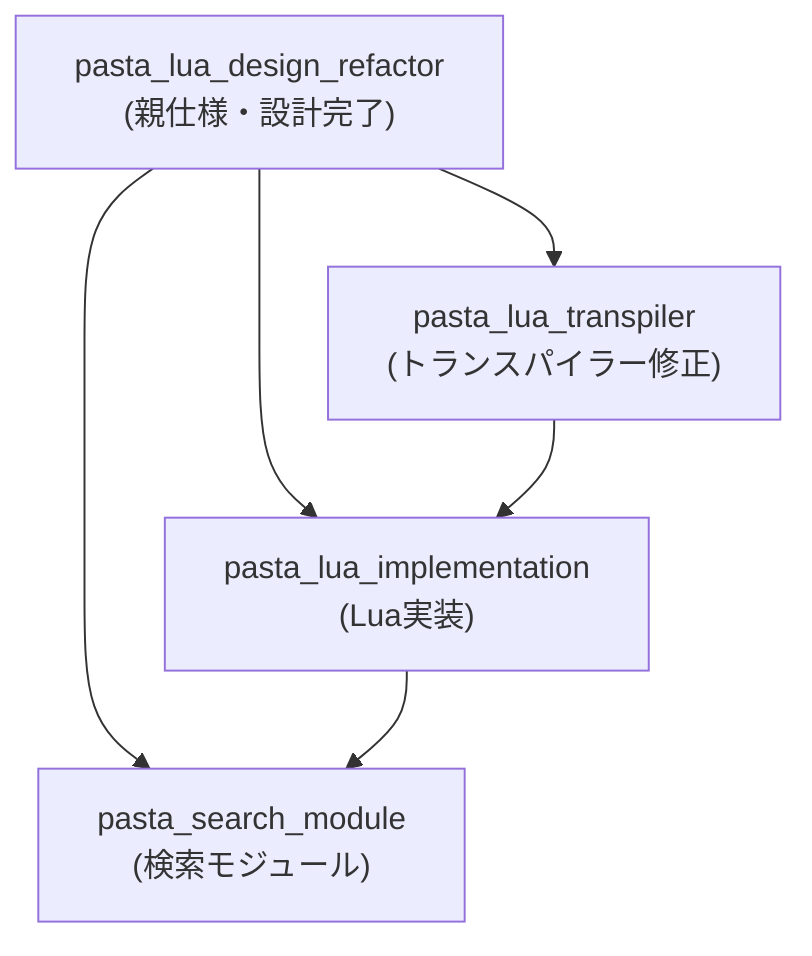

# 子仕様構造設計

## 概要

本ドキュメントは `pasta_lua_design_refactor` 親仕様から派生する3つの子仕様の構造と依存関係を定義する。

## 子仕様一覧

| 仕様名 | ディレクトリ | 目的 | 優先度 |
|--------|-------------|------|--------|
| pasta_lua_transpiler | `.kiro/specs/pasta_lua_transpiler/` | code_generator.rs修正 | P0 |
| pasta_lua_implementation | `.kiro/specs/pasta_lua_implementation/` | Luaモジュール実装 | P1 |
| pasta_search_module | `.kiro/specs/pasta_search_module/` | Rust側検索API | P2 |

## 依存関係



### 依存関係の詳細

1. **Transpiler → LuaImpl**
   - トランスパイラーが生成するLuaコードのAPI呼び出しパターンが確定してから、Lua側実装を行う
   - 理由: Lua側はトランスパイラー出力を受け入れる側であり、出力形式が先に確定する必要がある

2. **LuaImpl → Search**
   - Lua側の`word()`、`act:call()`が呼び出すRust関数インターフェースが確定してから、Rust側検索モジュールを実装
   - 理由: 検索モジュールはLua側の要求仕様に基づいてAPIを設計する

## 実装順序

1. **Phase 1: トランスパイラー修正** (`pasta_lua_transpiler`)
   - code_generator.rs の出力形式を Act-first アーキテクチャに変更
   - シーン関数シグネチャ: `function SCENE.__start__(ctx, ...)` → `function SCENE.__start__(act, ...)`
   - 冒頭テンプレート: `local save, var = act:init_scene(SCENE)`
   - アクタープロキシ呼び出し: `act.アクター:talk()`, `act.アクター:word()`

2. **Phase 2: Lua実装** (`pasta_lua_implementation`)
   - 5つのコアモジュールの実装
   - メタテーブルパターンによるオブジェクト指向設計
   - トークン蓄積・出力メカニズム

3. **Phase 3: 検索モジュール** (`pasta_search_module`)
   - mlua バインディングによるRust関数公開
   - シーン検索API (`search_scene`)
   - 単語検索API (`search_word`)

## 各子仕様が参照すべき設計ドキュメントの範囲

### pasta_lua_transpiler

| 親設計セクション | 参照目的 |
|-----------------|---------|
| Supporting References (シーン関数の標準パターン) | 出力テンプレート |
| pasta.init Service Interface | create_actor, create_scene 呼び出し生成 |
| pasta.act Service Interface | act:init_scene(), act:call() 呼び出し生成 |
| pasta.actor ActorProxy | act.アクター:talk(), act.アクター:word() 呼び出し生成 |
| Requirement 8 | Rust生成コードとの互換性 |

### pasta_lua_implementation

| 親設計セクション | 参照目的 |
|-----------------|---------|
| pasta.init | 公開API実装 |
| pasta.ctx | 環境管理実装 |
| pasta.act | アクション実装 |
| pasta.actor | アクター・プロキシ実装 |
| pasta.scene | シーンレジストリ実装 |
| Token構造 | トークン出力実装 |
| System Flows | コルーチン制御フロー実装 |

### pasta_search_module

| 親設計セクション | 参照目的 |
|-----------------|---------|
| pasta.actor (PROXY:word) | 単語検索4レベル優先順位 |
| pasta.act (ACT:word) | 単語検索3レベル優先順位 |
| pasta.scene | シーン検索API要件 |
| Requirement 4.6, 4.8 | 単語検索仕様 |
| Requirement 5.5 | シーン検索仕様 |

## 実装順序の根拠

1. **トランスパイラー先行**: 
   - トランスパイラーはLuaコードを「生成する側」
   - 生成されるコードの形式が確定しないとLua側の受け入れテストが書けない
   - 既存のcode_generator.rsを修正するため、影響範囲の特定が必要

2. **Lua実装次点**:
   - トランスパイラー出力を受け入れるスケルトンは親仕様で作成済み
   - スケルトンを実装に発展させる作業
   - 検索モジュールのスタブを使用して先行実装可能

3. **検索モジュール最後**:
   - Lua側の要求仕様が確定してからRust側を実装
   - mlua バインディングは両言語の境界であり、最後に詰める

## 成果物

各子仕様は以下のファイルを含む：

```
.kiro/specs/<spec-name>/
├── spec.json           # メタデータ
├── requirements.md     # 親仕様からの継承 + 具体化
└── design.md           # 詳細設計
```

## 親仕様との関係

- 親仕様 (`pasta_lua_design_refactor`) は「設計ドキュメント」として完結
- 子仕様は親設計を参照し、具体的な実装仕様を定義
- 子仕様の requirements.md は親仕様の該当 Requirement を参照
