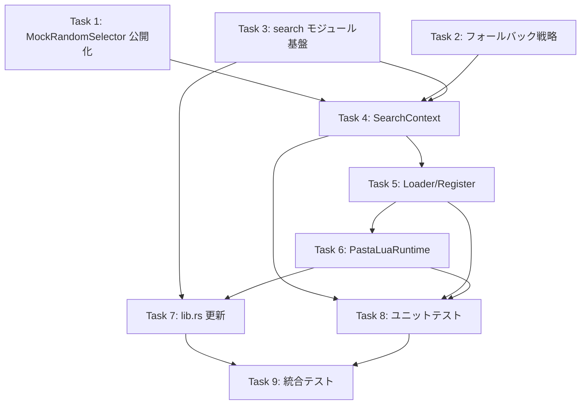

# Implementation Tasks

## タスク構成

本タスクリストは design.md の File Structure と Requirements Traceability に従い、以下の順序で実装を進める：

1. **pasta_core 修正** — MockRandomSelector 公開化、フォールバック戦略
2. **runtime レイヤー** — PastaLuaRuntime 構造体
3. **search レイヤー** — SearchContext, SearchModule, Loader
4. **統合テスト** — E2E 検証

---

## Task 1: pasta_core MockRandomSelector 公開化 [Req 8]

MockRandomSelector を `#[cfg(test)]` から常時公開に変更し、Lua側からのSelector制御を可能にする。

- [x] 1.1 `random.rs` の MockRandomSelector から `#[cfg(test)]` を削除 (P)
- [x] 1.2 `registry/mod.rs` で MockRandomSelector を公開エクスポート (P)
- [x] 1.3 既存テストがパスすることを確認

---

## Task 2: pasta_core フォールバック戦略実装 [Req 2, 3]

SceneTable/WordTable の検索戦略をマージからフォールバックに変更する。

- [x] 2.1 `scene_table.rs` の `collect_scene_candidates()` をフォールバック戦略に変更
  - ローカル検索で結果あり → ローカルから選択（終了）
  - ローカル検索で結果なし → グローバル検索実行
- [x] 2.2 `word_table.rs` の検索ロジックを同様にフォールバック戦略に変更
- [x] 2.3 既存のマージ戦略テストを削除し、フォールバック戦略テストを追加
- [x] 2.4 `cargo test -p pasta_core` で全テストパスを確認

---

## Task 3: pasta_lua search モジュール基盤 [Req 4, 6]

search モジュールのディレクトリ構造とエラー型を作成する。

- [x] 3.1 `pasta_lua/src/search/` ディレクトリを作成 (P)
- [x] 3.2 `search/mod.rs` を作成し、モジュール構造を定義 (P)
- [x] 3.3 `SearchError` 型を定義（mlua::Error へのマッピング含む）

---

## Task 4: SearchContext 実装 [Req 1, 2, 3, 7, 8]

検索状態を管理する UserData 構造体を実装する。

- [x] 4.1 `SearchContext` 構造体を定義（SceneTable, WordTable 所有）
- [x] 4.2 `SearchContext::new()` を実装（SceneRegistry/WordDefRegistry から変換）
- [x] 4.3 `search_scene()` を実装（段階的フォールバック：ローカル → グローバル）
- [x] 4.4 `search_word()` を実装（段階的フォールバック：ローカル → グローバル）
- [x] 4.5 `set_scene_selector()` を実装（MockRandomSelector 切り替え）
- [x] 4.6 `set_word_selector()` を実装（MockRandomSelector 切り替え）
- [x] 4.7 `impl UserData for SearchContext` を実装（全メソッド公開）

---

## Task 5: Loader/Register 実装 [Req 1, 4]

mlua-stdlib パターンに従ってモジュール登録関数を実装する。

- [x] 5.1 `loader()` 関数を実装（SearchContext を含む Table 生成） (P)
- [x] 5.2 `register()` 関数を実装（`@pasta_search` として登録） (P)
- [x] 5.3 `package.loaded` による再 require 同一インスタンス保証を実装

---

## Task 6: PastaLuaRuntime 実装 [Req 9]

Lua VM ホスト構造体を実装する。

- [x] 6.1 `pasta_lua/src/runtime/` ディレクトリを作成 (P)
- [x] 6.2 `runtime/mod.rs` を作成 (P)
- [x] 6.3 `PastaLuaRuntime` 構造体を定義（Lua インスタンス所有）
- [x] 6.4 `PastaLuaRuntime::new(context: TranspileContext)` を実装
  - Lua::new() で VM 初期化
  - search::register() で @pasta_search 登録
- [x] 6.5 `PastaLuaRuntime::exec()` を実装（Lua スクリプト実行）
- [x] 6.6 `PastaLuaRuntime::exec_file()` を実装（ファイルから実行）
- [x] 6.7 `PastaLuaRuntime::lua()` を実装（内部 Lua 参照取得）
- [x] 6.8 `PastaLuaRuntime::register_module()` を実装（将来拡張用）

---

## Task 7: pasta_lua lib.rs 更新 [Req 1, 9]

新規モジュールを公開エクスポートする。

- [x] 7.1 `lib.rs` に `pub mod runtime` を追加 (P)
- [x] 7.2 `lib.rs` に `pub mod search` を追加 (P)
- [x] 7.3 `PastaLuaRuntime` を crate ルートで再エクスポート

---

## Task 8: ユニットテスト [Req 5, 6, 8]

各コンポーネントの単体テストを作成する。

- [x] 8.1 SearchContext::new() のテスト（正常初期化）
- [x] 8.2 search_scene() のテスト（ローカル成功、フォールバック、nil）
- [x] 8.3 search_word() のテスト（ローカル成功、フォールバック、nil）
- [x] 8.4 set_scene_selector() のテスト（MockSelector 切り替え）
- [x] 8.5 set_word_selector() のテスト（MockSelector 切り替え）
- [x] 8.6 引数型エラーのテスト（string/integer 検証）

---

## Task 9: 統合テスト [Req 1, 5, 9]

E2E 動作検証テストを作成する。

- [x] 9.1 PastaLuaRuntime::new() + exec() の統合テスト
- [x] 9.2 `require "@pasta_search"` 動作確認テスト
- [x] 9.3 複数 PastaLuaRuntime インスタンス独立性テスト
- [x] 9.4 MockSelector 設定後の決定的選択テスト（循環動作検証）
- [x] 9.5 `cargo test -p pasta_lua` で全テストパスを確認

---

## 依存関係

## 並列実行可能タスク

- **Task 1 と Task 2**: 並列実行可能（pasta_core 内で独立）
- **Task 3.1 と 3.2**: 並列実行可能
- **Task 5.1 と 5.2**: 並列実行可能
- **Task 6.1 と 6.2**: 並列実行可能
- **Task 7.1 と 7.2**: 並列実行可能

---

## 完了基準

- [x] `cargo build -p pasta_core` 成功
- [x] `cargo build -p pasta_lua` 成功
- [x] `cargo test -p pasta_core` 全テストパス
- [x] `cargo test -p pasta_lua` 全テストパス
- [x] `require "@pasta_search"` が動作し、全 API が呼び出し可能
