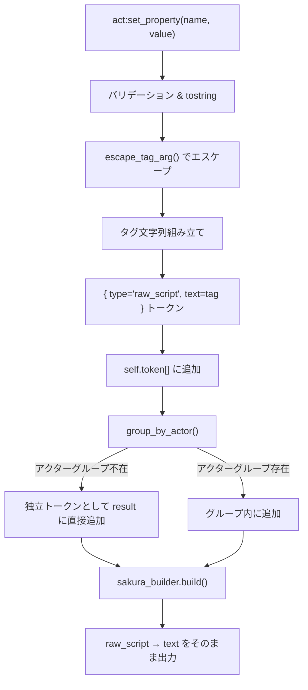
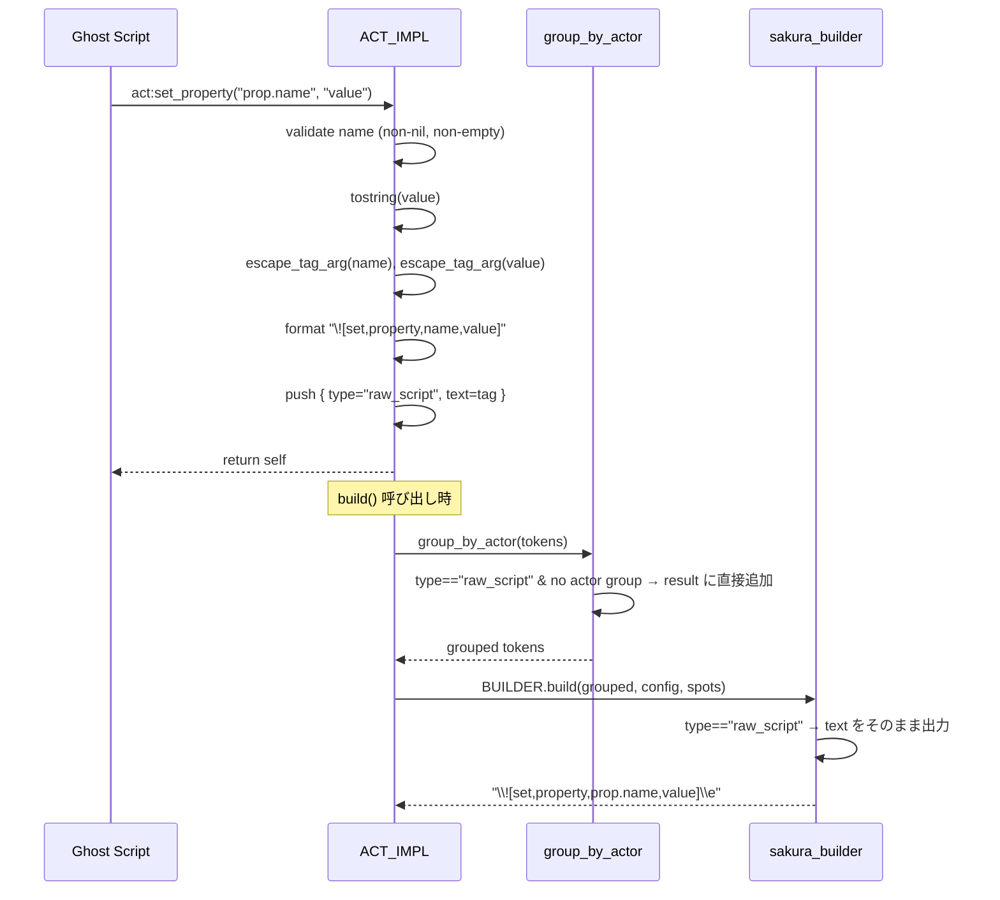
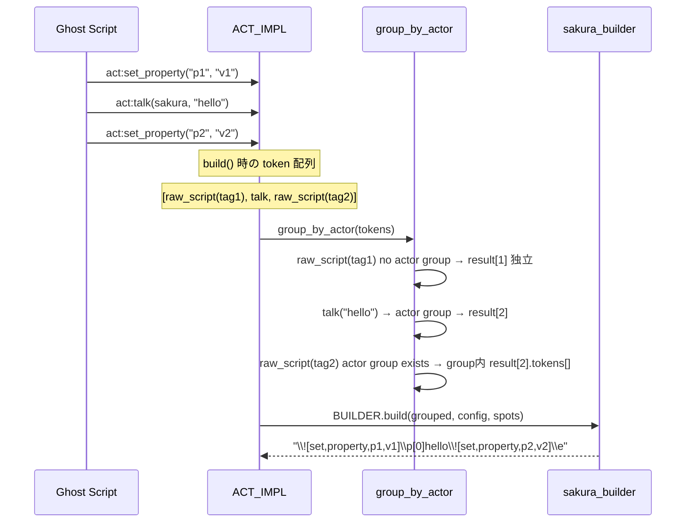

# Design Document

## Overview
SSPプロパティシステムへの書き込み操作（`\![set,property,name,value]`）を、pasta act オブジェクトの `set_property` メソッドとして提供する。ゴースト作者はさくらスクリプトタグの手動組み立てを意識せず、型安全な引数でプロパティを設定できる。

### Goals
- `act:set_property(name, value)` メソッドによるプロパティ書き込みタグの生成
- 既存の act メソッドチェーンとの統合（`self` 返却）
- SSP特殊文字のエスケープによる安全なタグ出力
- `raw_script` トークンのアクターグループ不在時ドロップバグの修正

### Non-Goals
- プロパティ読み取り（`get_property` — `shiori-async-talk` specの範囲）
- プロパティ名の妥当性検証（SSP側の責任）
- `%property[name]` 環境変数展開
- Pasta DSL構文拡張

## Boundary Commitments

### This Spec Owns
- `SHIORI_ACT_IMPL.set_property(self, name, value)` メソッドの定義（※実装時にユーザー承認のもと `ACT_IMPL` から `SHIORI_ACT_IMPL` へ移動）
- SSPタグ引数のエスケープ関数（`pasta/shiori/act.lua` 内ローカル関数）
- `raw_script` トークンの `group_by_actor` アクターグループ不在時ドロップバグの修正
- `sakura_builder` での最上位 `raw_script` トークンのハンドリング追加（バグ修正の対）
- 上記に対応するテスト

### Out of Boundary
- `raw_script` のアクターグループ内での既存挙動変更（従来通りアクターグループ内に残る）
- プロパティ名の存在確認・型チェック
- DSLからの `set_property` 呼び出し構文

### Allowed Dependencies
- `pasta_scripts/pasta/act.lua` — ACT_IMPL の拡張ポイント、`group_by_actor` の修正
- `pasta_scripts/pasta/shiori/sakura_builder.lua` — 最上位 `raw_script` ハンドリングの追加
- `tests/lua_specs/` — lua_test BDD フレームワーク

### Revalidation Triggers
- `group_by_actor` のトークン分類ロジック変更
- `sakura_builder.build` のトークン処理フロー変更
- ACT_IMPL のトークンバッファ構造変更

## Architecture

### Existing Architecture Analysis
既存のトークンパイプラインは以下の構造を持つ:

```
act メソッド → self.token[] にプッシュ
    ↓
ACT_IMPL.build() → group_by_actor() → merge_consecutive_talks()
    ↓
SHIORI_ACT_IMPL.build() → BUILDER.build(grouped_tokens, config, actor_spots)
    ↓
さくらスクリプト文字列
```

トークンは `group_by_actor` で3カテゴリに分類される:
1. **独立トークン**: `spot`, `clear_spot` → resultテーブルに直接追加
2. **アクタートークン**: `talk`, `sakura_script` → アクターグループを開始/追加
3. **従属トークン**: `surface`, `wait`, `newline`, `clear` → 現アクターグループに追加（不在時ドロップ）
4. **⚠️ バグ**: `raw_script` もカテゴリ3に分類されているが、設計意図は「生のさくらスクリプトをそのまま出力」であり、アクターグループに依存すべきではない

**バグ修正**: `raw_script` をハイブリッド方式に変更 — アクターグループ存在時はグループ内に追加（既存互換）、不在時は独立トークンとして出力（バグ修正）。

**set_property の方式**: `set_property` メソッドはエスケープ・タグ組み立てまで完了し、`raw_script` トークンとして蓄積する。ビルダーは `set_property` を知らない。

### Architecture Pattern



### Technology Stack

| Layer   | Choice / Version       | Role in Feature            | Notes |
| ------- | ---------------------- | -------------------------- | ----- |
| Runtime | LuaJIT 2.1 (mlua 0.11) | メソッド実装・トークン処理 | 既存  |
| Test    | lua_test BDD           | テスト実行                 | 既存  |

## File Structure Plan

### Modified Files
- `crates/pasta_lua/pasta_scripts/pasta/act.lua` — `ACT_IMPL.set_property` メソッド追加、`escape_tag_arg` ローカル関数追加、`group_by_actor` の `raw_script` ハイブリッド分岐修正
- `crates/pasta_lua/pasta_scripts/pasta/shiori/sakura_builder.lua` — `BUILDER.build()` 最上位ループに `raw_script` ハンドリング追加
- `crates/pasta_lua/tests/lua_specs/act_grouping_test.lua` — `raw_script` ハイブリッド分類テストを追記（`group_by_actor` 修正の単体テスト）

### New Files
- `crates/pasta_lua/tests/lua_specs/set_property_test.lua` — set_property メソッド＋エスケープ＋統合ビルドテスト

## System Flows

### set_property 単独呼び出しフロー



### set_property + talk 混在フロー



## Requirements Traceability

| Requirement | Summary                                   | Components                      | Interfaces       | Flows           |
| ----------- | ----------------------------------------- | ------------------------------- | ---------------- | --------------- |
| 1.1         | set_property → さくらスクリプトタグ出力   | ACT_IMPL.set_property           | raw_script token | 単独/混在フロー |
| 1.2         | self 返却（メソッドチェーン）             | ACT_IMPL.set_property           | —                | —               |
| 1.3         | 複数呼び出し → 順序保持                   | group_by_actor (raw_script修正) | raw_script token | 混在フロー      |
| 1.4         | talk なしでの単独出力                     | group_by_actor (raw_script修正) | raw_script token | 単独フロー      |
| 2.1         | name nil/empty → error                    | ACT_IMPL.set_property           | —                | —               |
| 2.2         | value nil → 空値タグ                      | ACT_IMPL.set_property           | —                | —               |
| 2.3         | value 空文字列 → 空値タグ                 | ACT_IMPL.set_property           | —                | —               |
| 2.4         | value → 無条件 tostring                   | ACT_IMPL.set_property           | —                | —               |
| 2.5         | 特殊文字エスケープ                        | ACT_IMPL.escape_tag_arg         | —                | 単独/混在フロー |
| BugFix      | raw_script アクターグループ不在時ドロップ | group_by_actor, sakura_builder  | raw_script token | 単独フロー      |

## Components and Interfaces

| Component             | Domain/Layer         | Intent                                                           | Req Coverage                          | Key Dependencies    | Contracts |
| --------------------- | -------------------- | ---------------------------------------------------------------- | ------------------------------------- | ------------------- | --------- |
| ACT_IMPL.set_property | act (Lua runtime)    | バリデーション・エスケープ・タグ組み立て・raw_scriptトークン蓄積 | 1.1-1.4, 2.1-2.5                      | ACT_IMPL (P0)       | Service   |
| escape_tag_arg        | act (Lua runtime)    | SSPタグ引数の特殊文字エスケープ                                  | 2.5（name・value 両方のタグ構文保護） | —                   | Internal  |
| group_by_actor 修正   | act (Lua runtime)    | raw_script のハイブリッド分類                                    | 1.3, 1.4, BugFix                      | ACT_IMPL.build (P0) | —         |
| sakura_builder 修正   | shiori (Lua runtime) | 最上位 raw_script ハンドリング追加                               | BugFix                                | BUILDER.build (P0)  | —         |

### act (Lua runtime)

#### ACT_IMPL.set_property

| Field        | Detail                                                                                                                                   |
| ------------ | ---------------------------------------------------------------------------------------------------------------------------------------- |
| Intent       | name/value ペアを受け取り、バリデーション・tostring・エスケープ・タグ文字列組み立てを行い、`raw_script` トークンとしてバッファに追加する |
| Requirements | 1.1, 1.2, 1.3, 1.4, 2.1, 2.2, 2.3, 2.4, 2.5                                                                                              |

**Responsibilities & Constraints**
- name 引数の nil/空文字列チェック → error() 発生
- value が nil の場合は空文字列に変換
- value が nil でない場合は tostring() を無条件適用
- name と value を `escape_tag_arg()` でエスケープ
- `\![set,property,<escaped_name>,<escaped_value>]` タグ文字列を組み立て
- `{ type = "raw_script", text = tag }` トークンを `self.token` に追加
- `self` を返却してメソッドチェーンを可能にする

**Dependencies**
- Inbound: ゴーストスクリプト — メソッド呼び出し
- Outbound: self.token テーブル — トークン蓄積
- Internal: escape_tag_arg — エスケープ処理

##### Service Interface
```lua
--- プロパティ書き込みタグを組み立て、raw_scriptトークンとしてバッファに追加する。
--- @param self ACT_IMPL
--- @param name string プロパティ名（nil/空文字列不可）
--- @param value any プロパティ値（nilで定義削除、それ以外はtostring変換）
--- @return ACT_IMPL self（メソッドチェーン用）
function ACT_IMPL:set_property(name, value)
```

- Preconditions: name ~= nil かつ name ~= ""
- Postconditions: self.token に raw_script トークンが1件追加される（text にエスケープ済みタグ文字列）
- Invariants: 既存トークンの順序は保持される

#### escape_tag_arg

| Field        | Detail                                                              |
| ------------ | ------------------------------------------------------------------- |
| Intent       | SSPさくらスクリプトのスクウェアブラケット内タグ引数をエスケープする |
| Requirements | 2.5                                                                 |

`act.lua` 内のローカル関数。`set_property` から呼び出される。

**設計判断**: name・value の両方に完全エスケープを適用する。SSP プロパティ名にカンマは仕様上存在しないが、さくらスクリプトのパース崩壊は絶対に避けるべきであり、過剰エスケープよりも構造安全性を優先する。

**将来オプション**: エスケープ処理を Rust 側（`pasta_lua` クレート）に実装して Lua に公開することで、再利用性と型安全性を高められる。本 spec では Lua ローカル関数として実装し、将来的な移行は別途検討する。

##### エスケープ規則

SSPさくらスクリプト仕様に基づくエスケープ処理:

| 対象文字 | エスケープ後 | 適用条件              |
| -------- | ------------ | --------------------- |
| `\`      | `\\`         | 常時                  |
| `%`      | `\%`         | 常時                  |
| `]`      | `\]`         | 常時（`[]` 内の引数） |

カンマ・引用符を含む引数の処理:
- 引数に `,` または `"` を含む場合、引数全体を `""` で囲み、内部の `"` を `""` に二重化する

処理順序: 1) `\`→`\\`, `%`→`\%`, `]`→`\]` のエスケープ → 2) `,`/`"` を含む場合のクォーティング

##### Interface
```lua
--- SSPタグ引数の特殊文字をエスケープする（act.lua 内ローカル関数）
--- @param str string エスケープ対象文字列
--- @return string エスケープ済み文字列
local function escape_tag_arg(str)
```

#### group_by_actor 修正（raw_script バグ修正）

| Field        | Detail                                                        |
| ------------ | ------------------------------------------------------------- |
| Intent       | raw_script トークンのアクターグループ不在時ドロップを修正する |
| Requirements | 1.3, 1.4, BugFix                                              |

**修正内容: ハイブリッド分類**
- `type == "raw_script"` を `else` ブランチ（従属トークン）から分離
- アクターグループ存在時: グループ内に追加（既存互換）
- アクターグループ不在時: result テーブルに直接追加（バグ修正）

### shiori (Lua runtime)

#### sakura_builder 修正（raw_script バグ修正の対）

| Field        | Detail                                         |
| ------------ | ---------------------------------------------- |
| Intent       | 最上位に出現する raw_script トークンを処理する |
| Requirements | BugFix                                         |

**修正内容**
- `BUILDER.build()` の最上位トークンループ（現在 `actor`/`spot`/`clear_spot` を処理）に `raw_script` ハンドリングを追加
- 処理: `table.insert(buffer, token.text)` — text をそのまま出力（既存のアクターグループ内 raw_script と同一処理）
```

## Testing Strategy

### Unit Tests（`set_property_test.lua`）
- **raw_script トークン生成**: `act:set_property("name", "val")` → token テーブルに `{ type="raw_script", text=... }` が追加され、text に `\![set,property,name,val]` を含むこと（Req 1.1）
- **self 返却**: `act:set_property(...)` の戻り値が act 自身であること（Req 1.2）
- **複数呼び出しの順序保持**: 2回呼び出し → token テーブルに順序通り2件の raw_script トークン（Req 1.3）
- **name nil/empty エラー**: `act:set_property(nil, "v")` と `act:set_property("", "v")` で error 発生（Req 2.1）
- **value nil → 空値タグ**: `act:set_property("n", nil)` → `\![set,property,n,]` を含むタグ文字列（Req 2.2）
- **value 空文字列 → 空値タグ**: `act:set_property("n", "")` → `\![set,property,n,]` を含むタグ文字列（Req 2.3）
- **value 数値 tostring**: `act:set_property("n", 42)` → `42` を含むタグ文字列（Req 2.4）
- **value boolean tostring**: `act:set_property("n", true)` → `true` を含むタグ文字列（Req 2.4）

### Escaping Tests（`set_property_test.lua` 内）
- **バックスラッシュ**: value に `\` → タグ内で `\\` にエスケープ（Req 2.5）
- **パーセント**: value に `%` → タグ内で `\%` にエスケープ（Req 2.5）
- **閉じブラケット**: value に `]` → タグ内で `\]` にエスケープ（Req 2.5）
- **カンマ**: value に `,` → タグ内で `""` に囲まれる（Req 2.5）
- **引用符**: value に `"` → タグ内で `""` に囲まれ内部 `"` が `""` に（Req 2.5）
- **複合**: value に `\,]%"` 混在 → 正しくエスケープ（Req 2.5）
- **name エスケープ**: name に特殊文字 → 同様にエスケープ（Req 2.5）
- **エスケープ不要値**: 通常文字列 → そのまま出力（Req 2.5）

### 統合ビルドテスト（`set_property_test.lua` 内）
- **set_property 単独 build**: set_property のみ → `\![set,property,name,value]\e` が出力される（Req 1.4、暗黙的に BugFix も検証）
- **set_property + talk 混在 build**: talk + set_property → 正しい順序でさくらスクリプト出力（Req 1.3）

### raw_script ハイブリッド分類テスト（`act_grouping_test.lua` 追記）
- **raw_script 単独出力**: raw_script トークンのみ（talk なし）→ group_by_actor の結果に raw_script が独立トークンとして含まれること（BugFix）
- **raw_script + talk 後続**: raw_script の後に talk → raw_script は独立、talk はアクターグループ（BugFix）
- **talk 後の raw_script**: talk の後に raw_script → raw_script はアクターグループ内に入ること（既存互換）
