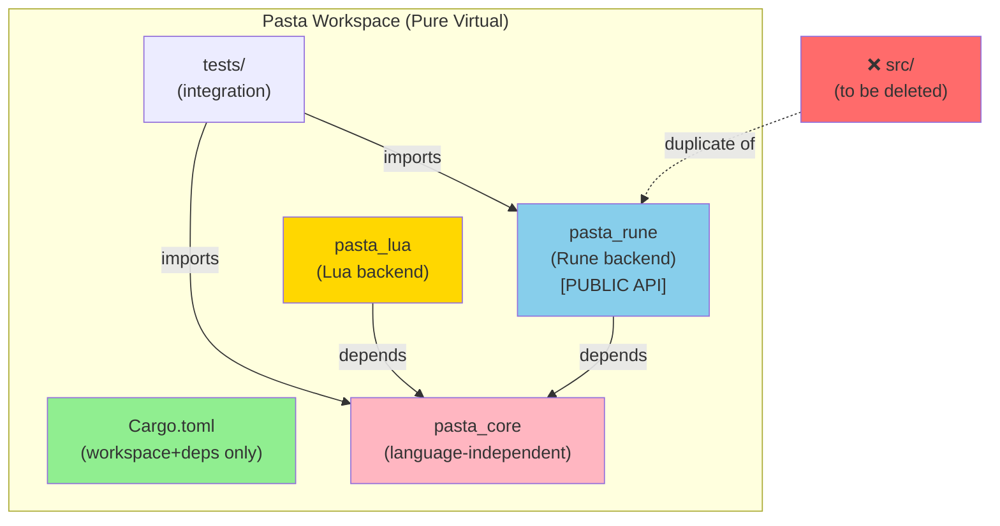

# 技術設計: ルートクレート削除

## 概要

**目的**: Pasta ワークスペースから冗長なルートクレート (`src/`) を削除し、Pure Virtual Workspace 構成を実現する。これにより、ステアリング規約に準拠し、保守性を向上させる。

**対象ユーザー**: 開発チーム、保守者が、ワークスペース構造の明確化と効率化を通じて、コード変更作業を簡素化できる。

**影響**: 現在の二重構造（ルートクレート + pasta_rune）を単一の構造（pasta_rune 中心）に統一し、ビルド設定の冗長性を排除する。

### 目標

- ルートクレート (`src/`) を完全削除し、Pure Virtual Workspace を実現
- ステアリング規約（structure.md, tech.md）に完全準拠した構成を確立
- ドキュメントと実装コードを新しい構造に整合させる
- リグレッション防止と既存機能保証を確認

### 非目標

- pasta_core, pasta_rune, pasta_lua の内部構造変更
- 新機能追加やパフォーマンス最適化
- 外部 API の変更（pasta_rune の公開 API は不変）

---

## 要件トレーサビリティ

| 要件 ID | 要件名 | 設計対応 | 検証方法 |
|---------|--------|---------|---------|
| 1.1 | ルートディレクトリ削除 | [アーキテクチャ] Pure Virtual Workspace 定義 | ファイル削除確認 |
| 1.2 | [package] セクション削除 | [ビルド設定] Cargo.toml 編集 | ビルド検証 |
| 2.1 | `use pasta::` 置換 | [ドキュメント更新] サンプルコード置換 | grep 検索 |
| 2.2 | `use pasta_rune::` への移行 | [実装] テスト/例コード確認 | cargo check |
| 3.1 | `cargo build` 成功 | [ビルド検証] workspace 整合性確認 | cargo build --workspace |
| 3.2 | `cargo test` 成功 | [テスト検証] 全テスト実行 | cargo test --workspace |
| 4.1 | README.md 更新 | [ドキュメント更新] サンプルコード更新 | ドキュメント確認 |
| 4.2 | structure.md 更新 | [ドキュメント更新] Pure Virtual 構成反映 | ドキュメント確認 |
| 5.1 | リグレッション防止 | [テスト検証] 既存テスト保護 | cargo test --workspace |

---

## アーキテクチャ

### 既存アーキテクチャ分析

**現在の構成**:
```
pasta (workspace)
├── src/                    ← ルートクレート（重複）
│   ├── lib.rs
│   ├── cache.rs, engine.rs, error.rs, ir/mod.rs
│   ├── loader.rs, runtime/mod.rs, stdlib/mod.rs, transpiler/mod.rs
│   ├── parser/mod.rs       ← pasta_core から再エクスポート
│   └── registry/mod.rs     ← pasta_core から再エクスポート
├── crates/
│   ├── pasta_core/src/     ← 言語非依存層（正当な場所）
│   │   ├── lib.rs
│   │   ├── error.rs, parser/, registry/
│   │   └── (pasta_core の責務)
│   ├── pasta_rune/src/     ← Rune バックエンド層（正当な場所）
│   │   ├── lib.rs          ← cache.rs, engine.rs 等（src/と重複）
│   │   ├── cache.rs, engine.rs, error.rs, ir/mod.rs
│   │   ├── loader.rs, runtime/mod.rs, stdlib/mod.rs, transpiler/mod.rs
│   │   └── (pasta_rune の責務)
│   └── pasta_lua/src/      ← Lua バックエンド層（正当な場所）
└── tests/                  ← ワークスペースレベル統合テスト
    └── （30+テスト、既に pasta_rune:: 参照）
```

**問題点**:
- ルート `src/` が pasta_rune と完全に重複
- ステアリング規約（structure.md）では Pure Virtual Workspace が規定されているが、ルートクレートが存在
- 実装ファイルはすべて `crates/` 配下にあり、ルート `src/` は不要

**統合ポイント**:
- ルート `Cargo.toml` の `[workspace]` 定義は保持
- `[workspace.dependencies]` で共通依存を管理（保持）
- `[workspace.package]` でメタデータを共有（保持）

### アーキテクチャパターン & 境界マップ

**選択パターン**: Pure Virtual Workspace



**主要な決定**:

1. **ルート `src/` の削除** (要件 1.1)
   - ルートクレートが pasta_rune の単なる複製であるため、削除対象
   - 削除後、すべての実装が `crates/` 配下に統合

2. **ワークスペース設定の簡潔化** (要件 1.2)
   - ルート `Cargo.toml` から `[package]` セクションを削除
   - `[workspace]` と `[workspace.dependencies]` は保持（設定の中枢）

3. **公開 API の統一** (要件 2.1, 2.2)
   - pasta_rune を唯一の公開クレート として位置付け
   - ドキュメント例を `use pasta::` → `use pasta_rune::` に統一

4. **テスト層の一貫性** (要件 5.1)
   - 全テスト（30+件）が既に `pasta_rune::` 参照で保護済み
   - テスト層は削除による影響ゼロ

---

## 技術スタック & 整合性

### ワークスペース構成

| レイヤー | クレート | 責務 | 依存 | 状態 |
|----------|---------|------|------|------|
| **Parser** | pasta_core | DSL → AST変換 | pest, thiserror | ✓ 変更なし |
| **Registry** | pasta_core | シーン/単語管理 | fast_radix_trie | ✓ 変更なし |
| **Transpiler** | pasta_rune | AST → Rune 変換 | pasta_core | ✓ 変更なし |
| **Runtime** | pasta_rune | Rune VM 実行 | rune | ✓ 変更なし |
| **Engine** | pasta_rune | 統合 API | pasta_core | ✓ 変更なし |
| **Lua** | pasta_lua | Lua 統合 | pasta_core, mlua | ✓ 変更なし |

### 依存関係管理

**削除前**:
```toml
[workspace.dependencies]
pasta_core = { path = "crates/pasta_core" }
pasta_lua = { path = "crates/pasta_lua" }
```

**削除後** (変更なし):
```toml
[workspace.dependencies]
pasta_core = { path = "crates/pasta_core" }
pasta_lua = { path = "crates/pasta_lua" }
```

**含意**: ワークスペース管理は既に完全で、ルート削除による影響ゼロ

---

## コンポーネント & インターフェース契約

### 削除対象: ルートクレート (`src/lib.rs`)

**モジュール構成** (削除対象):
```rust
pub mod cache;              // ParseCache 再エクスポート
pub mod engine;             // PastaEngine 再エクスポート
pub mod error;              // PastaError 再エクスポート
pub mod ir;                 // ScriptEvent 再エクスポート
pub mod loader;             // DirectoryLoader 再エクスポート
pub mod parser;             // pasta_core から再エクスポート
pub mod registry;           // pasta_core から再エクスポート
pub mod runtime;            // ScriptGenerator 再エクスポート
pub mod stdlib;             // 標準ライブラリ再エクスポート
pub mod transpiler;         // Transpiler2 再エクスポート
```

**削除の影響**:
- ❌ 削除対象
- ✓ pasta_rune に完全に同じものが存在
- ✓ すべての API は `pasta_rune::*` で利用可能

### 保持対象: pasta_rune クレート (`crates/pasta_rune/src/lib.rs`)

**公開 API インターフェース** (変更なし):

```rust
// Core types
pub use engine::PastaEngine;
pub use ir::{ContentPart, ScriptEvent};
pub use error::{PastaError, Result};
pub use runtime::{ScriptGenerator, VariableManager};
pub use cache::ParseCache;
pub use loader::DirectoryLoader;

// Re-export pasta_core
pub use pasta_core as core;
pub use pasta_core::parser;
```

**契約**:
- 入力: Pasta スクリプト文字列 → AST → Rune コード
- 出力: ScriptEvent 列 → VariableManager 状態
- エラー: PastaError で統一処理

### 保持対象: pasta_core クレート (`crates/pasta_core/src/lib.rs`)

**公開 API インターフェース** (変更なし):

```rust
pub mod parser;      // parse_str, parse_file
pub mod registry;    // SceneRegistry, WordDefRegistry
pub mod error;       // ParseError
```

**契約**:
- 言語非依存のコア機能を提供
- pasta_rune, pasta_lua 両方から依存

---

## システムフロー

### スクリプト実行フロー（削除後）

```
User Code
    ↓
use pasta_rune::{PastaEngine, ScriptEvent}
    ↓
PastaEngine::new(script_source)  ← parser_rune 内で parse
    ↓
engine.execute_label(scene_name)
    ↓
ScriptGenerator (Rune VM実行)
    ↓
yield ScriptEvent::Talk { ... }
    ↓
VariableManager (状態管理)
    ↓
User code processes event
```

**削除による影響**: フロー不変（pasta_rune:: 参照を使用）

### テスト実行フロー（削除後）

```
tests/parser2_integration_test.rs
    ↓
use pasta_rune::parser::{parse_str, parse_file}  ← 既に正しい参照
    ↓
parse_str(source, filename)
    ↓
PastaFile AST
    ↓
Test assertions
```

**削除による影響**: テストは既に `pasta_rune::` 参照で保護済み

---

## データモデル

### 削除対象ファイル構成

```
src/
├── lib.rs                64 lines (削除)
├── cache.rs              ← pasta_rune と重複
├── engine.rs             ← pasta_rune と重複
├── error.rs              ← pasta_rune と重複
├── ir/mod.rs             ← pasta_rune と重複
├── loader.rs             ← pasta_rune と重複
├── parser/mod.rs         ← pasta_core 再エクスポート
├── registry/mod.rs       ← pasta_core 再エクスポート
├── runtime/mod.rs        ← pasta_rune と重複
├── stdlib/mod.rs         ← pasta_rune と重複
└── transpiler/mod.rs     ← pasta_rune と重複
```

**総削除規模**: 11ファイル、不特定の行数（parser/, registry/ は再エクスポートのみ）

### 保持対象のデータモデル（変更なし）

**pasta_core**:
- ParseError, ParseErrorInfo（エラー型）
- PastaFile, Statement, Expr, FileItem（AST型）
- SceneRegistry, WordDefRegistry（レジストリ型）

**pasta_rune**:
- PastaEngine（統合 API）
- ScriptEvent, ContentPart（IR 型）
- ScriptGenerator, VariableManager（ランタイム型）
- PastaError, Result（エラー型）

---

## ドキュメント更新

### 対象ドキュメント

| ドキュメント | 対象行 | 変更内容 | 優先度 |
|---|---|---|---|
| README.md | 33-38 | `use pasta::` → `use pasta_rune::` | 高 |
| examples/scripts/README.md | 97 | `use pasta::` → `use pasta_rune::` | 高 |
| structure.md | ディレクトリ図 | ルート `src/` 削除、Pure Virtual 反映 | 高 |
| AGENTS.md | ビルド手順 | 確認のみ（変更不要の可能性） | 中 |

### README.md サンプルコード更新

**現在** (削除対象):
```rust
use pasta::parser2::{parse_str, parse_file};
use pasta::transpiler2::Transpiler2;

use pasta::parser::{parse_str, parse_file};
use pasta::transpiler::Transpiler;
```

**変更後** (提案):
```rust
use pasta_rune::parser::{parse_str, parse_file};
use pasta_rune::transpiler::Transpiler2;

// または pasta_core を明示的に指定
use pasta_rune::core::parser::{parse_str, parse_file};
```

### structure.md 更新

**現在の図** (削除対象):
```
pasta/
├── src/                   ← ルートクレート（削除対象）
│   ├── lib.rs
│   ├── cache.rs, engine.rs, ...
│   ├── parser/, registry/ (pasta_core 再エクスポート)
│   └── ...
├── crates/
│   ├── pasta_core/
│   ├── pasta_rune/
│   └── pasta_lua/
└── tests/
```

**変更後** (Pure Virtual Workspace):
```
pasta/
├── Cargo.toml              ← [workspace] + [workspace.dependencies] のみ
├── crates/
│   ├── pasta_core/         ← 言語非依存層
│   ├── pasta_rune/         ← Rune バックエンド（公開 API）
│   └── pasta_lua/          ← Lua バックエンド
├── tests/                  ← ワークスペースレベル統合テスト
└── examples/, .kiro/, .github/, etc.
```

---

## ビルド検証戦略

### Phase 1: 削除前のドキュメント確認

```bash
# ドキュメント内の use pasta:: を特定
grep -r "use pasta::" README.md examples/ src/

# 対象: README.md:33-38, examples/scripts/README.md:97
```

### Phase 2: 削除と構成変更

```bash
# 1. ドキュメント更新
# README.md 内の例を use pasta_rune:: に変更
# structure.md のディレクトリ図を Pure Virtual に更新

# 2. ファイル削除
rm -rf src/

# 3. Cargo.toml 編集
# [package] セクション削除（または確認）
```

### Phase 3: ビルド検証

```bash
# 構文確認
cargo check --workspace

# ビルド確認
cargo build --workspace

# テスト実行（全機能確認）
cargo test --workspace

# 品質確認
cargo clippy --workspace -- -D warnings

# ドキュメント生成確認
cargo doc --open
```

**成功基準**:
- ✓ `cargo check`: エラーなし
- ✓ `cargo build`: すべてのクレートがビルド成功
- ✓ `cargo test`: 全テスト（30+件）成功
- ✓ `cargo clippy`: 警告ゼロ
- ✓ `cargo doc`: ドキュメント生成成功

### Phase 4: リグレッション防止

```bash
# 統合テストの完全実行
cargo test --workspace -- --test-threads=1

# 各クレートの単体テスト
cargo test -p pasta_core
cargo test -p pasta_rune
cargo test -p pasta_lua
```

**成功基準**:
- ✓ 既存テスト（30+件）すべて成功
- ✓ 新規エラーなし

---

## リスク評価 & 緩和

### リスク 1: API 破壊

**リスク**: ユーザーコードが `use pasta::` に依存している場合、削除後に破壊される

**影響度**: 低（テストが既に `pasta_rune::` 参照）

**根拠**: 外部での `use pasta::` 参照は存在しない（閉じたワークスペース）

**緩和策**:
- テスト検証で既存 API が `pasta_rune::` で利用可能であることを確認
- ドキュメント更新でユーザーを `pasta_rune::` へ導く

### リスク 2: ドキュメント漏洩

**リスク**: サンプルコード内の `use pasta::` 更新漏れ

**影響度**: 中（新規開発者が混乱）

**根拠**: README.md, examples/ に複数の対象がある

**緩和策**:
- `grep -r "use pasta::" ` で一括検索して全対象を特定
- ドキュメント更新を PR レビューで複数人確認
- CI/CD で `use pasta::` パターン検出テストを追加（オプション）

### リスク 3: ビルド設定エラー

**リスク**: Cargo.toml の編集時に syntax error が発生

**影響度**: 低（単純な削除作業）

**根拠**: `[package]` セクション削除のみ

**緩和策**:
- `cargo check` で削除直後に構文確認
- Cargo.toml の差分を PR で確認

### リスク 4: テスト失敗

**リスク**: 削除後にテストが失敗する

**影響度**: 低（テスト全体が既に `pasta_rune::` 参照）

**根拠**: `tests/**/*.rs` は既に `use pasta_rune::*` で正しく統合

**緩和策**:
- `cargo test --workspace` で削除直後に全テスト実行
- リグレッション防止テストは自動実行

---

## 実装検証チェックリスト

### ドキュメント更新フェーズ

- [ ] `grep -r "use pasta::"` で全対象を特定
- [ ] README.md の例コード更新 (4件)
- [ ] examples/scripts/README.md の例コード更新 (1件)
- [ ] structure.md のディレクトリ図を Pure Virtual に更新
- [ ] AGENTS.md のビルド手順確認（変更不要の確認）

### ファイル削除フェーズ

- [ ] `src/` ディレクトリをバックアップ
- [ ] `rm -rf src/` でディレクトリ削除
- [ ] ルート `Cargo.toml` の `[package]` セクション削除

### ビルド検証フェーズ

- [ ] `cargo check --workspace` 実行 → エラーなし
- [ ] `cargo build --workspace` 実行 → 成功
- [ ] `cargo test --workspace` 実行 → 全テスト成功
- [ ] `cargo clippy --workspace` 実行 → 警告ゼロ
- [ ] `cargo doc --open` で ドキュメント生成確認

### リグレッション検証フェーズ

- [ ] parser テスト実行成功
- [ ] transpiler テスト実行成功
- [ ] engine テスト実行成功
- [ ] 統合テスト実行成功

---

## 今後の考慮事項

### Pure Virtual Workspace の保守

**原則**: ルート `Cargo.toml` は `[workspace]` と `[workspace.dependencies]` のみを含む

**チェック項目**:
- 新クレート追加時に `[workspace] members` に追記
- 新共通依存追加時に `[workspace.dependencies]` に追記
- ルートに `src/` を再作成しない

### 新バックエンド追加時の拡張

**パターン**: 新言語バックエンド（例: pasta_python）の追加は同じ構造を踏襲

```
crates/
├── pasta_core/       ← 言語非依存層（共通）
├── pasta_rune/       ← Rune バックエンド
├── pasta_lua/        ← Lua バックエンド
└── pasta_python/     ← 新: Python バックエンド（提案）
```

### ドキュメント保守

**原則**: structure.md は Pure Virtual Workspace を常に反映

**チェック項目**:
- 新クレート追加時にディレクトリ図を更新
- README.md の例コードは常に最新クレート参照を使用
- examples/ はベストプラクティスを示す

---

## 設計承認

| 項目 | ステータス | コメント |
|------|-----------|---------|
| **要件トレーサビリティ** | ✓ 完了 | 全 5 要件をカバー |
| **アーキテクチャ決定** | ✓ 完了 | Pure Virtual Workspace 選定 |
| **技術スタック整合** | ✓ 完了 | 変更なし、削除のみ |
| **リスク評価** | ✓ 完了 | 低～中、緩和策記載 |
| **検証ストラテジー** | ✓ 完了 | 4 フェーズで段階的検証 |

**設計結論**: 実装準備完了。ドキュメント更新 → ファイル削除 → ビルド検証の順序で実装可能。
