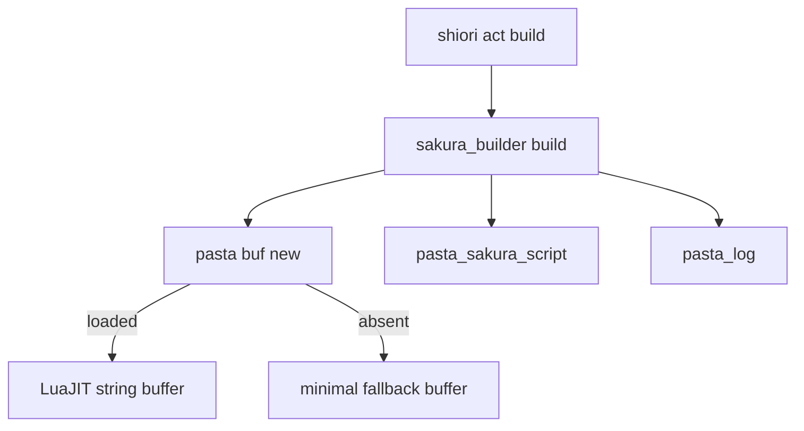
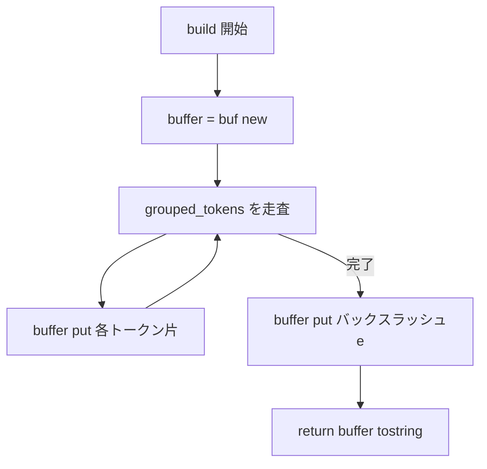

# Design Document

## Overview

**Purpose**: さくらスクリプト組み立ての中核 `pasta.shiori.sakura_builder.BUILDER.build` を、再利用可能なバッファ抽象 `pasta.buf` 経由の組み立てへ置き換え、LuaJIT String Buffer Library による高速化を、**出力バイト一致（外部振る舞い不変）** を保ったまま実現する。

**Users**: ゴースト作者のトーク（`act:build()` 経由）は従来と完全に同一のさくらスクリプトを得る。pasta ランタイム開発者は `pasta.buf` を文字列連結の共通部品として再利用できる。

**Impact**: 現在の `local buffer = {}` + `table.insert` + `table.concat` パターンを、`pasta.buf.new()` が返すバッファ object（LuaJIT ネイティブ or 最小実装）の `:put()` / `:tostring()` 呼び出しへ置換する。`pasta.buf` は新規モジュール、`sakura_builder.build` は内部実装のみ変更（公開契約は不変）。

### Goals
- `pasta.buf.new()` の提供：LuaJIT `string.buffer` を採用、不在時は最小実装へフォールバック（1, 2）
- `sakura_builder.build` のバッファ化と出力バイト一致の維持（3）
- 既存テスト全パス＋ `pasta.buf` 単体検証＋フォールバック経路検証（4）
- 対象ランタイムで String Buffer 高速パスが採用されることの実機検証（5）

### Non-Goals
- `act.lua` / `scene.lua` 等、他モジュールの文字列組み立てバッファ化（将来 `pasta.buf` 再利用先として記録のみ）
- `pasta.buf` の高度 API（`get`/`set`/`reserve`/`skip`/`encode`/`decode`/FFI 連携）
- 速度の数値ベンチマーク・閾値による合否判定（採用有無は検証するが数値測定はしない）
- `pasta.lua_version` の Luau 等（標準Lua/LuaJIT 以外）対応（本プロジェクト未使用のため `1xx`/`2xx` のみ）

## Boundary Commitments

### This Spec Owns
- 新規モジュール `pasta.buf`（公開 API：`new()` / `backend` / `new_fallback()`）と、その最小実装フォールバック
- 新規モジュール `pasta.lua_version`（公開 API：`get()`）— ランタイム版を単一整数で返す葉ユーティリティ
- `sakura_builder.build` 内部のバッファ組み立てロジック（`buf` への依存導入）
- 上記モジュールに対応する Lua 単体/結合テストと、String Buffer 採用の実機検証テスト

### Out of Boundary
- `BUILDER.build` の**出力契約**（引数仕様・`\e` 終端・バイト一致出力）の変更 — 不変として扱う
- `act.lua`（呼び出し元）の改修 — 無改修
- `@pasta_sakura_script` / `@pasta_log` 等 Rust 登録モジュールの変更
- mlua/LuaJIT のビルド設定変更（StdLib 構成等）。R5 が不可と判明した場合のみ別途エスカレーション（本スペックでは行わない）

### Allowed Dependencies
- `pasta.buf` → LuaJIT `string.buffer`（`pcall(require, ...)` による任意依存。不在を許容）。他依存なし（葉ユーティリティ）
- `sakura_builder` → `pasta.buf`（新規・下向き依存）、既存の `@pasta_sakura_script` / `@pasta_log` 継続
- 依存方向：`sakura_builder`（上位）→ `pasta.buf`（下位ユーティリティ）。逆方向禁止

### Revalidation Triggers
- `BUILDER.build` の出力契約（バイト一致・`\e` 終端）が変わる変更 → `act.lua` 及び全 sakura_builder テストの再検証
- `pasta.buf` の公開 API（`new`/`backend`/`new_fallback` のシグネチャ）変更 → 将来の `buf` 利用箇所の再検証
- 取り出しメソッド（`tostring`）や `put` シグネチャの変更 → フォールバックと利用側の同時再検証

## Architecture

### Existing Architecture Analysis
- `BUILDER.build`（[sakura_builder.lua:57-144](crates/pasta_lua/pasta_scripts/pasta/shiori/sakura_builder.lua#L57)）は `buffer={}` に `table.insert` で逐次追記し、末尾で `table.concat(buffer) .. "\\e"` を返す唯一の大規模文字列連結ホットパス。
- 呼び出し元は [act.lua:68](crates/pasta_lua/pasta_scripts/pasta/shiori/act.lua#L68) の1箇所のみ。戻り値文字列をそのまま返すため、**出力がバイト一致なら呼び出し元は無改修**。
- フォールバック作法の前例：[config.lua:13-16](crates/pasta_lua/pasta_scripts/pasta/config.lua#L13) が `pcall(require, "@...")` で不在を許容。`pasta.buf` はこの確立パターンを踏襲する。
- `package.path` は Rust 側で `pasta_scripts/?.lua` を含むため、新規 `pasta/buf.lua` は追加設定なしで `require("pasta.buf")` 解決される。

### Architecture Pattern & Boundary Map



**Architecture Integration**:
- 選択パターン：薄い**アダプタ無し**の選択（Selection without wrapper）。`pasta.buf.new()` はロード時に決定したバックエンドの**生成関数そのもの**を保持し、生成した object を**ラップせず直接返す**。これにより LuaJIT ネイティブバッファに余計な間接呼び出しを挟まず、高速化目的を殺さない。
- 境界分離：`pasta.buf` は「バッファ生成とバックエンド選択」のみを所有。`sakura_builder` は「トークン→さくらスクリプト変換」を所有。両者の責務は重複しない。
- 既存パターン維持：`pcall(require)` フォールバック（config.lua）、`local M = {} ... return M` モジュール構造、`@module` アノテーション。
- 新規コンポーネント根拠：`pasta.buf` は再利用可能な葉ユーティリティとして独立（要件 1 が独立モジュールを要求）。

### Technology Stack

| Layer | Choice / Version | Role in Feature | Notes |
|-------|------------------|-----------------|-------|
| Runtime | LuaJIT 2.1 (mlua 0.11, luajit52/vendored) | `string.buffer` 提供元 | vendored ビルドに `lib_buffer.c` コンパイル済みを確認（target/debug/build 実物） |
| Script | Lua（pasta_scripts） | `pasta.buf` / `sakura_builder` | `.luacheckrc` は Lua 5.1 モード。pcall/require/table/string 許可済み |
| Test | lua_test（scriptlibs） + Rust 統合テスト | 単体/結合/採用検証 | describe/test/expect。Rust 側は ALL_SAFE で string.buffer 可用性検証 |

## File Structure Plan

### New Files
```
crates/pasta_lua/pasta_scripts/pasta/
├── buf.lua                          # バッファ抽象：new()/backend/new_fallback()＋最小実装
└── lua_version.lua                  # ランタイム版を単一整数で返す：get()（1xx=Lua / 2xx=LuaJIT）

crates/pasta_lua/tests/lua_specs/
├── buf_test.lua                     # pasta.buf 単体テスト（put/tostring・フォールバック・backend検証）
└── lua_version_test.lua             # pasta.lua_version 単体テスト（整数返却・LuaJIT=221・>=200判定）

crates/pasta_lua/tests/
└── string_buffer_availability_test.rs  # R5：本番同一経路(RuntimeConfig::default().to_stdlib())でstring.buffer可用性を実機検証
```

### Modified Files
- `crates/pasta_lua/pasta_scripts/pasta/shiori/sakura_builder.lua` — `build()` のバッファ組み立てを `pasta.buf` 経由へ置換（出力契約は不変）
- `crates/pasta_lua/tests/lua_specs/init.lua` — `specs` テーブルに `buf_test` と `lua_version_test` を登録

> 各ファイルは単一責務。`buf.lua` は生成・選択のみ、`buf_test.lua` は buf 検証のみ、Rust テストは可用性検証のみ。

## System Flows

### バッファ取り出しフロー（build 内部）



**Key Decisions**:
- `table.insert(buffer, x)` → `buffer:put(x)` の 1:1 写像。走査順・連結順は不変。
- 末尾 `\e` も `buffer:put` で追記し、`buffer:tostring()`（非破壊）で単一文字列化。`table.concat(buffer) .. "\\e"` と**バイト一致**（空入力時は `\e` のみ）。

## Requirements Traceability

| Requirement | Summary | Components | Interfaces | Flows |
|-------------|---------|------------|------------|-------|
| 1.1-1.5 | `pasta.buf.new()` 提供・追記/取り出し・LuaJIT採用 | pasta.buf | `new()`, `Buffer:put`, `Buffer:tostring` | 取り出しフロー |
| 2.1-2.4 | 最小実装フォールバック・例外抑止・署名一致 | pasta.buf（FallbackBuffer） | `new_fallback()`, `Buffer:put/tostring` | — |
| 3.1-3.5 | build のバッファ化・出力バイト一致・空入力 `\e` | sakura_builder.build | `BUILDER.build`（不変契約） | build 内部フロー |
| 4.1-4.3 | 既存テスト全パス・フォールバック検証・buf単体検証 | buf_test.lua, sakura_builder_test.lua | テストスイート | — |
| 5.1-5.3 | String Buffer 採用の実機検証・不在時finding（版番号併記） | string_buffer_availability_test.rs, buf_test.lua（backend表明）, pasta.lua_version | `pasta.buf.backend`, `lua_version.get` | — |
| 6.1-6.5 | ランタイム版を単一整数で取得（1xx Lua / 2xx LuaJIT） | pasta.lua_version | `lua_version.get()` | — |

## Components and Interfaces

| Component | Layer | Intent | Req Coverage | Key Dependencies | Contracts |
|-----------|-------|--------|--------------|------------------|-----------|
| pasta.buf | Script/Util | バッファ生成とバックエンド選択 | 1, 2, 5 | string.buffer (P1, optional) | Service, State |
| pasta.lua_version | Script/Util | ランタイム版を単一整数で返す | 6 | jit table (P2, optional) | Service |
| sakura_builder.build | Script/SakuraScript | トークン→さくらスクリプト（バッファ化） | 3 | pasta.buf (P0) | Service |
| buf_test / lua_version_test / availability_test | Test | 単体・フォールバック・採用検証 | 4, 5, 6 | pasta.buf, pasta.lua_version, string.buffer | — |

### Script / Util

#### pasta.buf

| Field | Detail |
|-------|--------|
| Intent | 文字列連結用バッファの生成とバックエンド選択（ネイティブ優先・最小実装フォールバック） |
| Requirements | 1.1, 1.2, 1.3, 1.4, 1.5, 2.1, 2.2, 2.3, 2.4, 5.1 |

**Responsibilities & Constraints**
- ロード時に1度だけ `pcall(require, "string.buffer")` を評価し、バックエンドを確定する（例外を送出しない：2.2）
- `new()` は確定済みバックエンドの生成関数を呼び、生成 object を**ラップせず**返す（1.2、性能維持）
- 最小実装 `FallbackBuffer` は常に定義し、`new_fallback()` で明示生成可能にする（テスト seam：4.2 / B4）
- データ所有：バッファ object は内部蓄積（ネイティブは LuaJIT 管理、フォールバックは内部配列）

**Dependencies**
- Outbound: なし（葉ユーティリティ）
- External: LuaJIT `string.buffer` — バッファ実体（P1, 任意。不在を許容）

**Contracts**: Service [x] / State [x]

##### Service Interface（LuaDoc）
```lua
--- @class Buffer
--- @field put fun(self: Buffer, s: string): Buffer   -- 文字列を追記（追記順保持・self返却）
--- @field tostring fun(self: Buffer): string         -- 蓄積済み全片を追記順に連結（非破壊）

--- @class pasta.buf
--- @field new fun(): Buffer                 -- バックエンド object を生成して返す
--- @field backend string                    -- "luajit" | "fallback"（採用検証用）
--- @field new_fallback fun(): Buffer         -- 最小実装を明示生成（テスト用）
local M = {}
```
- **Preconditions**: `put` の引数は文字列（`build` 用途。フォールバックは `table.concat` 互換＝string/number を想定）
- **Postconditions**: `tostring()` は `put` 順の連結結果を返す。複数回呼んでも蓄積を破壊しない（非破壊）
- **Invariants**: `backend == "luajit"` のとき `new()` はネイティブ `string.buffer` を返す。`require` 失敗時のみ `backend == "fallback"`

##### State Management
- ネイティブ：LuaJIT `string.buffer` の内部状態（C 管理）
- フォールバック：`{ _parts = {} }` を metatable `FallbackBuffer` で包む。`put` は `_parts` へ追記、`tostring` は `table.concat(_parts)`

**Implementation Notes**
- Integration: `M.new` はロード時に `string.buffer.new` または `FallbackBuffer.new` を束縛（分岐は1度だけ）
- Validation: `pcall` 成功かつ `type(sb.new)=="function"` を確認してからネイティブ採用
- Risks: ネイティブ `:tostring()` メソッドの存在前提（LuaJIT 2.1 で提供）。フォールバックは同名メソッドで揃える

#### pasta.lua_version

| Field | Detail |
|-------|--------|
| Intent | 実行中ランタイム（標準Lua/LuaJIT）の種別＋版を単一整数で返す |
| Requirements | 6.1, 6.2, 6.3, 6.4, 6.5 |

**Responsibilities & Constraints**
- `rawget(_G, "jit")` で LuaJIT を判定（`_VERSION` は LuaJIT を "Lua 5.1" と誤報するため不可：6.4）
- LuaJIT は `jit.version_num`（例 20100）から major/minor を抽出し `200 + major*10 + minor`（6.2）
- 標準 Lua は `_VERSION`（"Lua 5.4"）を解析し `100 + major*10 + minor`（6.3）
- 例外を送出せず常に整数を返す（6.5）。判定不能時は防御的な既定値

**Dependencies**
- Outbound: なし（葉ユーティリティ）
- External: LuaJIT `jit` テーブル — 存在判定とバージョン取得（P2, 任意）

**Contracts**: Service [x]

##### Service Interface（LuaDoc）
```lua
--- @class pasta.lua_version
--- @field get fun(): integer   -- 1xy=標準Lua x.y / 2xy=LuaJIT x.y（例: 154, 221）
local M = {}
```
- **Preconditions**: なし
- **Postconditions**: `1xx`（標準Lua）または `2xx`（LuaJIT）の整数。`>= 200` で LuaJIT 判定可
- **Invariants**: ランタイムは不変のためプロセス内で値は一定（ロード時計算・memo 可）

**Implementation Notes**
- Integration: R5 の finding 記録が `pasta.lua_version.get()` を併記（5.3）
- Validation: 本 LuaJIT 2.1 ランタイムでは `221` を返す想定（lua_version_test で表明）
- Risks: `jit.version_num` 欠落時は `jit.version` 文字列解析へフォールバック。Luau 等（3xx 相当）は対象外

### Script / SakuraScript

#### sakura_builder.build（変更）

| Field | Detail |
|-------|--------|
| Intent | グループ化トークンをさくらスクリプトへ変換（組み立てを `pasta.buf` 経由化） |
| Requirements | 3.1, 3.2, 3.3, 3.4, 3.5 |

**Responsibilities & Constraints**
- 公開契約（戻り値文字列・`\e` 終端・既存呼び出しの挙動）は**不変**。`config` に**任意の** `buffer_factory`（既定 `buf.new`）を追加（テスト seam・後方互換：既存呼び出しは省略のまま動作）
- 内部の `local buffer = {}` を `local buffer = (config.buffer_factory or buf.new)()` に置換し、全 `table.insert(buffer, x)` を `buffer:put(x)` へ写像
- 末尾を `buffer:put("\\e"); return buffer:tostring()` とする（旧 `table.concat(buffer) .. "\\e"` とバイト一致）

**Dependencies**
- Outbound: `pasta.buf` — バッファ生成（P0）
- External: `@pasta_sakura_script`（継続）, `@pasta_log`（継続）

**Contracts**: Service [x]

**Implementation Notes**
- Integration: ファイル先頭で `local buf = require("pasta.buf")` を追加。`config.buffer_factory` 既定は `buf.new`（テスト時のみ `buf.new_fallback` を注入）
- Validation: 既存 `sakura_builder_test.lua` がバイト一致を回帰検証（3.2）。空入力 `\e`（3.4）と buffer_factory 注入によるフォールバック実走比較（4.2）は新規ケースとして test 追加
- Risks: `put` へ非文字列が渡らないこと（現コードは全片が `string.format`/リテラルで文字列化済み）

## Error Handling

### Error Strategy
- **String Buffer 不在**：`pcall` で捕捉し最小実装へ無言フォールバック（2.1, 2.2）。例外は伝播させない。
- **採用検証の失敗**：R5 テストが `string.buffer` ロード不可を検出した場合、**テスト失敗として明示**し finding 化する（5.2）。黙ってフォールバックを合格扱いにしない。finding には `pasta.lua_version.get()` の数値を併記し、どのランタイムで落ちたかを明示する（5.3）。
- **`put` 異常入力**：設計上 `build` は文字列のみ `put` するため発生しない。フォールバックの `table.concat` は string/number のみ受理（契約 Precondition で明示）。

### Monitoring
- バックエンド選択結果は `pasta.buf.backend` で観測可能（テスト・将来の診断で参照）。ランタイムログ追加は不要（高頻度パスのため `@pasta_log` 出力は行わない）。

## Testing Strategy

### Unit Tests（buf_test.lua）
1. `pasta.buf.new()` が `put`/`tostring` を持つ object を返す（1.2）
2. `new_fallback()` の最小実装で `put("ab")` → `put("c")` → `tostring()` が `"abc"`（追記順連結、2.4）
3. `new_fallback()` バッファの空 `tostring()` が `""`（空連結）
4. `pasta.buf.backend == "luajit"`（テストランタイムでネイティブ採用、5.1）

### Unit Tests（lua_version_test.lua）
1. `pasta.lua_version.get()` が整数を返す（6.1, 6.5）
2. 本 LuaJIT 2.1 ランタイムで `get() == 221`（2.1 → 200+21、6.2）
3. `get() >= 200` が真（LuaJIT 判定、6.4）

### Integration Tests
1. `sakura_builder_test.lua` 既存ケース全パス（バイト一致回帰、3.2 / 4.1）
2. 空 `grouped_tokens` で `BUILDER.build` が `"\\e"` のみを返す（3.4・新規ケース）
3. 同一 grouped_tokens を `BUILDER.build` に与え、(i) 既定（native buf）と (ii) `config.buffer_factory = buf.new_fallback`（フォールバックを build で実走）の出力が**バイト一致**（2.4 / 3.5 / 4.2）

### Availability Verification（string_buffer_availability_test.rs）
1. 本番同一経路（`RuntimeConfig::default().to_stdlib()` ＋ `unsafe_new_with`）で構築したランタイムで `pcall(require, "string.buffer")` が成功し `new()` が機能する（5.1）
2. 失敗時はテスト失敗で finding 化し、finding に `pasta.lua_version.get()` の数値を併記（5.2, 5.3）
3. `buf_test.lua` の `backend == "luajit"` 表明はテストランタイム（`Lua::new()`）補助。R5 の authoritative はこの Rust テストに固定する

## Risks & Mitigations
- **R5 がフォールバックを示す可能性**：mlua の StdLib 構成が `string.buffer` の preload を塞ぐ場合、常時フォールバックとなり高速化が出ない。→ 物証（`lib_buffer.c` コンパイル済み）から可用性は高いと判断。実機検証は availability_test が**本番同一の `to_stdlib()` 経路**で担い、不可なら finding（`lua_version` 数値併記）としてエスカレーション（StdLib/preload 対応は本スペック外）。
- **`:tostring()` 不在リスク**：ネイティブ object が想定メソッドを欠く場合 → LuaJIT 2.1 は `buf:tostring()` を提供。フォールバックは同名で実装し、利用側はメソッド名のみに依存。
- **改行コード差異（CRLF）**：Lua 文字列リテラルの内容には影響しないが、テスト比較は文字列値で行い、ファイル改行に依存しない。
