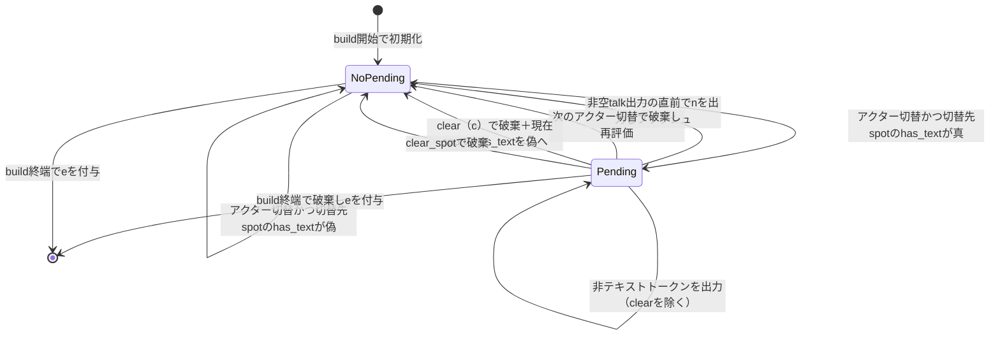

# Design Document: sakura-script-newline

## Overview

**Purpose**: さくらスクリプトビルダーの段落区切り改行 `\n[N]` を先出し（eager: 離脱側スコープ末尾）から完全遅延（fully-lazy: 再登場スコープの次の一般文字列直前）へ変更し、キャラ切替で離脱したバルーンに残る約1.5行分のゴミ改行を排除する。

**Users**: ゴースト作者は、A→B で終了するトークや同一スポットでの話者交代を含むトークで、余分な空行のない正規形さくらスクリプト出力を得る。保守担当は、改行判定の根拠となるビルドローカル状態（per-spot has-text・pending）の明確なライフサイクルを得る。

**Impact**: `crates/pasta_lua/pasta_scripts/pasta/shiori/sakura_builder.lua` 単一モジュールの内部ロジック変更。`BUILDER.build()` の外部シグネチャ・呼び出し側（`act.lua`）・永続状態（`STORE.actor_spots`）は不変。#21 で導入されたグローバル抑制フラグ `text_since_break` は per-spot 追跡へ完全置換（research.md「#21 包摂可否」で全ケース検証済み）。

### Goals

- アクター切替時、離脱側スコープ末尾に段落区切り改行を出力しない（切替先タグ `\p[spot]` のみ出力）
- 段落区切り改行を「切替先スポットが同一ビルド内で一般文字列出力済み、かつその後実際に一般文字列が続く」場合に限り、その一般文字列の直前で1回だけフラッシュする
- テキストを伴わず離脱・終端する場合は保留改行を破棄し、いずれのバルーンにもゴミ改行を残さない
- #21 の全さくらスクリプト手番抑制挙動を per-spot 追跡で包摂する（グローバルフラグ削除）
- 同一スポット共有アクターの交代にも段落区切りを入れる（`last_spot == spot` ガードは復活させない）

### Non-Goals

- `spot_newlines` 設定の意味・デフォルト値（1.5）の変更
- SSP など特定ベースウェアの描画仕様への対応・回避策
- budoux 改行・`\n` トークン（明示改行）など段落区切り以外の改行処理
- トークン生成側（`act.lua` / トランスパイラ）の変更、`actor_spots` の永続化仕様
- 同一スポット話者交代時のサーフェス／着せ替え状態の復旧（別仕様 `actor-surface-restore` が所有）

## Boundary Commitments

### This Spec Owns

- `sakura_builder.lua` 内の段落区切り改行 `\n[N]` の**出力位置と出力条件**の決定ロジック
- ビルドローカル状態 `spot_has_text`（スポットごとの一般文字列出力済みマップ）と `pending_break`（改行保留フラグ）の定義・初期化・更新・リセット
- 上記変更に伴う既存テスト期待値の更新と新規テストケース（`sakura_builder_test.lua` / `shiori_act_test.lua` / `startup_test.rs`）

### Out of Boundary

- `STORE.actor_spots` の内容・永続化挙動（persist-spot-position 仕様が所有。本設計は読み取り＋`spot`/`clear_spot` トークンによる従来どおりの更新のみ）
- `talk_to_script` のウェイト挿入・各トークン種別の変換内容（段落区切り改行の位置以外は一切変更しない）
- 切替先アクターのサーフェス状態再適用（`actor-surface-restore`）
- トーク間バルーン状態管理（`\c` タグの変換出力自体は不変。ただし `\c` 処理時のビルドローカル状態リセット（has-text/pending、R4.6）は This Spec Owns）

### Allowed Dependencies

- `@pasta_sakura_script`（`talk_to_script`）・`@pasta_log`・`pasta.buf` — 現行どおり。新規依存なし
- `config.spot_newlines`（`act.lua` 経由で `CONFIG.get("ghost", "spot_newlines", 1.5)`）— 読み取りのみ
- `input_actor_spots`（= `STORE.actor_spots`）— 直接変更方式の現行規約を維持（`spot`/`clear_spot` トークン処理のみが書き込む）

### Revalidation Triggers

- `BUILDER.build()` のシグネチャまたは grouped_tokens スキーマの変更
- 段落区切り改行の出力位置・条件の再変更（`actor-surface-restore` 実装時に同一スポット交代パスへタグ挿入が入る場合、挿入位置と `\n[N]` の順序関係を再検証すること）
- `spot_newlines` の per-actor 化など設定解決方式の変更
- `pasta-user-manual` / `pasta-ghost-authoring` スキルの段落区切り挙動記述（出力例が変わるため追随要否を確認）

## Architecture

### Existing Architecture Analysis

- `SHIORI_ACT_IMPL.build`（`act.lua`）→ `BUILDER.build(grouped_tokens, config, STORE.actor_spots)` の単一呼び出し経路。
- 現行の改行判定は `emit_actor_switch()` 内の `allow_break and last_spot ~= nil and last_spot ~= spot` で、`\p[spot]` の**前**に `\n[N]` を出力する（先出し）。`allow_break` は #21 のグローバルフラグ `text_since_break`。
- 本設計はこの判定を廃し、判定材料を「切替先スポットの has-text」へ、出力位置を「次の一般文字列の直前」へ移す。レイヤ構造・依存方向（act → sakura_builder → buf/sakura_script）は不変。

### Architecture Pattern & Boundary Map

選択パターン: **既存モジュール内の状態機械変更**（research.md Option A）。新規コンポーネント・新規依存なし。

- ビルドローカル状態機械: `last_actor` / `last_spot`（既存）＋ `spot_has_text` / `pending_break`（新規、`text_since_break` を置換）
- 既存パターン維持: バッファ抽象（`buffer_factory` 注入）、`actor_spots` 直接変更方式、スポット解決フォールバック（未設定→0＋warn）
- ステアリング適合: pasta_lua の Lua ランタイムスクリプト規約（`pasta_scripts/pasta/**`、luacheck、lua_test）に準拠

### Technology Stack

| Layer | Choice / Version | Role in Feature | Notes |
|-------|------------------|-----------------|-------|
| Lua ランタイム | LuaJIT 2.1 (mlua 0.11) | `sakura_builder.lua` 実行 | 変更なし |
| テスト | lua_test (scriptlibs) / cargo test | Lua ユニット＋Rust 統合 | 既存基盤のみ使用 |

## File Structure Plan

新規ファイルなし。変更は以下の4ファイルに閉じる。

### Modified Files

- `crates/pasta_lua/pasta_scripts/pasta/shiori/sakura_builder.lua` — 中核変更。`text_since_break` を `spot_has_text`＋`pending_break` へ置換。`emit_actor_switch` をスポット解決＋`\p[spot]` 出力のみへ縮小。ビルドループに pending セット／フラッシュ／破棄の状態遷移を実装
- `crates/pasta_lua/tests/lua_specs/sakura_builder_test.lua` — 先出し順序前提の期待値更新（8箇所、research.md 全数調査参照）＋新規ケース追加（A→B終了・A→B→A・同一スポット交代・pending破棄・clear_spot・フラッシュ位置）
- `crates/pasta_lua/tests/lua_specs/shiori_act_test.lua` — 「スポット変更時に段落改行」ケース（A→B）を A→B→A 往復へ書き換え
- `crates/pasta_lua/tests/loader/startup_test.rs` — `test_shiori_act_uses_config_spot_newlines`（A→B で `\n[200]` 確認）を A→B→A へ書き換え、config 値伝搬の検証を維持

## System Flows

### 段落区切り改行の状態遷移（ビルドローカル）



フロー上の決定事項:

- pending は常に**現在スコープ**（`last_spot`）に対する保留。切替のたびに破棄→切替先の has-text で再評価するため、単一 boolean で表現できる（research.md 設計判断参照）
- `\n[N]` は `\p[spot]` と介在する非テキストトークン（surface/wait 等）の**後**、非空 talk の変換出力（`talk_to_script` 結果全体）の**直前**に出力（1.3, 2.2）
- 非空 talk の出力時に `spot_has_text[last_spot] = true`。同一アクター継続グループの初テキストでも pending はフラッシュされる（pending の破棄契機は切替・`clear`（`\c`）・clear_spot・ビルド終端のみ）
- `clear`（`\c`）はバルーン上のテキストを物理的に消すため、ビルダーの認識も現実に合わせる: 現在スポットの has-text を偽へリセットし、pending を破棄する（R4.6。クリア済みバルーン先頭に段落改行を出さない）

## Requirements Traceability

| Requirement | Summary | Components | Interfaces | Flows |
|-------------|---------|------------|------------|-------|
| 1.1 | 切替時は離脱側末尾に改行を出さず `\p[spot]` を出力 | ビルドループ / emit_actor_switch | build() | 状態遷移図 |
| 1.2 | 改行条件を満たさない切替は `\p[spot]` のみ | ビルドループ | build() | NoPending 遷移 |
| 1.3 | `\n[N]` は `\p` の後・次の一般文字列の直前のみ | pending フラッシュ | build() | Pending→NoPending |
| 1.4 | 同一アクター連続はタグも改行も出力しない | ビルドループ（切替検出） | build() | — |
| 2.1 | 切替先 has-text 真で保留セット | pending セット | build() | NoPending→Pending |
| 2.2 | 非空 talk 直前に `\n[N]` を1回出力し解除 | pending フラッシュ | build() | Pending→NoPending |
| 2.3 | 未フラッシュのまま次切替で破棄・再評価 | pending 破棄 | build() | Pending→NoPending(切替) |
| 2.4 | 切替先 has-text 偽（初回登場含む）は保留しない | pending セット判定 | build() | NoPending 維持 |
| 2.5 | 同一スポット交代でも has-text のみで判定（旧ガード復活禁止） | pending セット判定 | build() | — |
| 2.6 | `\p[0]A1\p[0]\n[150]B1` 等価出力 | ビルドループ全体 | build() | テスト固定 |
| 2.7 | `\p[0]A1\p[1]B1\p[0]\n[150]A2` 等価出力 | ビルドループ全体 | build() | テスト固定 |
| 2.8 | N = `math.floor(spot_newlines * 100)` | pending フラッシュ | build() | — |
| 3.1 | A→B 終了で改行ゼロ | pending 未セット（初回登場） | build() | テスト固定 |
| 3.2 | 戻らないスコープの末尾に改行を残さない | 先出し廃止の帰結 | build() | — |
| 3.3 | テキストなし終端で保留破棄・ゴミ改行なし | ビルド終端破棄 | build() | Pending→終端 |
| 3.4 | 全ケースで末尾 `\e` | build() 終端処理（既存） | build() | — |
| 4.1 | build 開始で has-text 空・保留なしに初期化 | 状態初期化 | build() | 初期化遷移 |
| 4.2 | 非空 talk で当該スポットの has-text 真 | has-text 更新 | build() | — |
| 4.3 | 非テキストトークンは has-text 更新もフラッシュもしない | inner ループ判定 | build() | Pending 維持 |
| 4.4 | clear_spot で has-text・保留をリセット | clear_spot 分岐 | build() | Pending→NoPending |
| 4.5 | 状態はビルドローカル、actor_spots は読取専用扱い | 状態スコープ | build() | — |
| 4.6 | `clear`（`\c`）で現在スポットの has-text リセット＋保留破棄 | inner ループ `clear` 分岐（S4b） | build() | Pending→NoPending(clear) |
| 5.1 | 全さくらスクリプト手番のスポットへの切替で改行なし | has-text 偽判定 | build() | — |
| 5.2 | 先頭サーフェス手番で改行なし | has-text 偽判定 | build() | — |
| 5.3 | #21 挙動と矛盾しない（per-spot で包摂・完全置換） | text_since_break 削除 | build() | research.md 検証表 |
| 6.1 | 各トークン変換は改行位置以外不変 | emit_inner_token（無変更） | build() | — |
| 6.2 | spot/clear_spot の actor_spots 更新不変 | spot/clear_spot 分岐（無変更） | build() | — |
| 6.3 | SSP 上の A→B→A 見た目不変 | 手動検証チェックリスト | — | Testing Strategy |
| 6.4 | 空 grouped_tokens は `\e` のみ | build() 終端処理（既存） | build() | — |
| 6.5 | ネイティブ/フォールバックでバイト一致 | バッファ抽象（無変更） | build() | — |
| 6.6 | 同一スポット交代の改行は意図的挙動変更 | pending セット判定 | build() | テスト固定 |
| 7.1 | 特性化テスト先行 | 既存スイート＝ベースライン | — | Testing Strategy |
| 7.2 | 先出し前提の既存テスト期待値更新 | テスト3ファイル | — | File Structure Plan |
| 7.3 | 新規ケース追加 | sakura_builder_test.lua | — | Testing Strategy |
| 7.4 | Lua/Rust 双方でリグレッションなし | lua_unittest_runner / cargo test | — | Testing Strategy |

## Components and Interfaces

| Component | Domain/Layer | Intent | Req Coverage | Key Dependencies | Contracts |
|-----------|--------------|--------|--------------|------------------|-----------|
| BUILDER.build ビルドループ | pasta_lua ランタイム | 状態機械の実装（pending/has-text の遷移と改行出力） | 1.x, 2.x, 3.x, 4.x, 5.x, 6.6 | pasta.buf (P0), talk_to_script (P0) | Service, State |
| emit_actor_switch | 同上（内部関数） | スポット解決＋`\p[spot]` 出力（改行判定を持たない） | 1.1, 1.2, 1.4 | @pasta_log (P2) | Service |
| emit_inner_token | 同上（内部関数・無変更） | トークン種別ごとの変換 | 6.1 | talk_to_script (P0) | Service |
| テストスイート | tests | 期待値更新＋新規ケース | 7.1–7.4, 2.6, 2.7, 3.1, 3.3 | lua_test (P0) | — |

### pasta_lua ランタイム層

#### BUILDER.build ビルドループ（変更の中核）

| Field | Detail |
|-------|--------|
| Intent | grouped_tokens 走査中に pending/has-text 状態機械を駆動し、段落区切り改行を完全遅延で出力する |
| Requirements | 1.1–1.4, 2.1–2.8, 3.1–3.4, 4.1–4.5, 5.1–5.3, 6.4, 6.6 |

**Responsibilities & Constraints**

- ビルドローカル状態の所有: `last_actor`, `last_spot`（既存）, `spot_has_text: table<integer, boolean>`, `pending_break: boolean`（新規）
- `text_since_break`（#21 グローバルフラグ）は削除する。抑制挙動は per-spot has-text が包摂（research.md 検証表）
- `input_actor_spots` への書き込みは `spot`/`clear_spot` トークン処理のみ（従来どおり）。has-text/pending を `STORE.actor_spots` へ漏らさない（4.5）

**Dependencies**

- Outbound: `pasta.buf` — 出力バッファ（P0）／ `@pasta_sakura_script.talk_to_script` — talk 変換（P0）／ `@pasta_log` — スポットフォールバック警告（P2）
- Inbound: `act.lua` `SHIORI_ACT_IMPL.build` — 唯一の呼び出し元（P0、シグネチャ不変）

**Contracts**: Service [x] / State [x]

##### Service Interface（外部シグネチャ不変）

```lua
--- @param grouped_tokens table[]  グループ化されたトークン配列
--- @param config BuildConfig|nil  { spot_newlines: number = 1.5, buffer_factory: (fun(): table)|nil }
--- @param input_actor_spots table<string, integer>|nil  アクター→スポットマップ（直接変更される）
--- @return string  さくらスクリプト文字列（\e 終端）
function BUILDER.build(grouped_tokens, config, input_actor_spots)
```

- Preconditions: なし（空配列・nil config・nil actor_spots は従来どおり許容）
- Postconditions: 戻り値は `\e` 終端（3.4, 6.4）。`\n[N]`（N = `math.floor(spot_newlines * 100)`）は「`\p[spot]` より後・当該スコープの次の非空 talk 変換出力の直前」にのみ出現（1.3, 2.2, 2.8）。離脱側スコープ末尾に `\n[N]` が出現しない（1.1, 3.2）
- Invariants: `buffer_factory` 注入経路と native 経路で同一入力に対しバイト一致（6.5）。`emit_inner_token` の変換結果は不変（6.1）

##### State Management（ビルドローカル状態機械）

状態遷移（正規定義。System Flows の図と対応）:

| # | イベント | ガード | アクション |
|---|---------|--------|-----------|
| S0 | `build()` 開始 | — | `spot_has_text = {}`, `pending_break = false`, `last_actor = nil`, `last_spot = nil`（4.1） |
| S1 | `actor` トークンで切替検出（`token.actor` 非nil かつ `~= last_actor`） | — | spot 解決（未設定→0＋warn、既存）→ **`pending_break = (spot_has_text[spot] == true)`**（旧 pending は暗黙破棄: 2.1, 2.3, 2.4, 2.5）→ `\p[spot]` 出力（1.1, 1.2）→ `last_spot = spot`, `last_actor = actor` |
| S2 | 同一アクターの連続 `actor` トークン | `token.actor == last_actor` | 何も出力しない（1.4）。pending・has-text は変更しない |
| S3 | 非空 `talk`（inner） | `inner.text ~= nil and ~= ""` | `pending_break` 真なら `\n[math.floor(spot_newlines * 100)]` を出力し `pending_break = false`（2.2, 2.8）→ `last_spot ~= nil` なら `spot_has_text[last_spot] = true`（4.2）→ `talk_to_script` 出力 |
| S4 | 空 `talk`・`surface`・`wait`・`sakura_script`・`newline`・`choice`・`choice_timeout`・`raw_script`・`yield`（inner） | — | 従来どおり変換出力のみ。has-text・pending は不変（4.3, 5.1, 5.2, 6.1） |
| S4b | `clear`（`\c`）トークン（inner） | — | `\c` を従来どおり出力（6.1）＋ `pending_break = false`、`last_spot ~= nil` なら `spot_has_text[last_spot] = false`（4.6。クリアで区切るべき先行テキストが消えるため） |
| S5 | `clear_spot` トークン | — | `clear_spots(actor_spots)`・`last_actor/last_spot = nil`（既存）＋ `spot_has_text = {}`, `pending_break = false`（4.4） |
| S6 | `spot` トークン / トップレベル `raw_script` | — | 従来どおり（6.2）。状態不変 |
| S7 | ループ終端 | — | pending は出力せず破棄（3.3）→ `\e` 出力（3.4, 6.4） |

- 補足（S1）: 同一スポット交代（離脱側と切替先が同一 spot）でも判定は S1 のとおり has-text のみ。旧 `last_spot ~= spot` ガードは復活させない（2.5, 2.6, 6.6）
- 補足（S3）: **明示的仮定** — `last_spot == nil` の間（初回切替前、または actor が nil のグループのみの場合）は has-text を記録しない。pending は切替（S1）でしかセットされないため、この区間でフラッシュが起きることもない。現行実装でも `\p` タグなしで出力される既存挙動であり、本設計はそれを変更しない
- Persistence & consistency: 全状態はビルドローカル（4.5）。`clear_spot` を除きビルド間で持ち越さない
- Concurrency: 単一 Lua VM 上の同期実行のみ（考慮不要）

**Implementation Notes**

- Integration: `emit_actor_switch` は `(buffer, actor_spots, actor) -> spot` へ縮小（`last_spot`/`spot_newlines`/`allow_break` 引数と `emitted_break` 戻り値を削除）。スポット解決フォールバック（0＋`log.warn`）は現状維持
- Validation: luacheck（scriptlibs 規約）＋ lua_unittest_runner 経由の `cargo test`
- Risks: 期待値反転の見落とし（research.md 全数調査で3ファイル8箇所に確定済み）

#### emit_actor_switch（責務縮小）

| Field | Detail |
|-------|--------|
| Intent | アクターのスポット解決と `\p[spot]` 出力のみを行う |
| Requirements | 1.1, 1.2, 1.4 |

- 契約: `emit_actor_switch(buffer, actor_spots, actor) -> integer spot`。改行出力・改行判定を一切行わない（判定材料はビルドループが所有）
- 呼び出し前提: `actor` 非nil（呼び出し元が保証、既存どおり）

#### emit_inner_token（無変更）

- 6.1 の回帰防止対象。本設計での変更なし（summary のみ）

## Data Models

ビルドローカル状態のみ（永続データ・スキーマ変更なし）:

- `spot_has_text: table<integer, boolean>` — キーは**解決済みスポットID**（`actor_spots[name]` にフォールバック 0 適用後の値）。アクター名キーにしない理由: 段落区切りは「バルーンに既にテキストがあるか」の意味論であり、同一スポット共有アクターの交代（2.5/2.6）はスポットキーでのみ成立する（research.md 設計判断）
- `pending_break: boolean` — 現在スコープ（`last_spot`）に対する保留。切替ごとに破棄・再評価されるため単一 boolean で十分（複数スポットの保留が同時生存する状態は要件上存在しない）
- `STORE.actor_spots`（`table<string, integer>`）— 本設計では従来規約のまま（読み取り＋`spot`/`clear_spot` 処理での更新のみ）

## Error Handling

- スポット未解決（`actor_spots[name] == nil`）: 既存どおり spot 0 フォールバック＋ `log.warn`。has-text/pending も解決後の 0 をキーに扱う（新規エラーパスなし）
- 不正トークン種別: 既存どおり無視（`emit_inner_token` の else なし分岐）。本設計で変更しない
- 本変更は純粋な文字列生成ロジックであり、新たな失敗モード・例外経路を導入しない

## Testing Strategy

### 特性化ベースライン（7.1）

1. 変更着手前に既存スイート（`sakura_builder_test.lua`・`shiori_act_test.lua`・`startup_test.rs`）が green であることを確認し、現行挙動のベースラインとする（既存スイートが先出し順序の特性化テストを兼ねる）

### Unit Tests — `sakura_builder_test.lua`（7.2, 7.3）

期待値更新（research.md 全数調査の8箇所）に加え、新規ケース:

1. **A→B 終了で改行ゼロ**（3.1）: `\p[0]A\p[1]B\e` に `\n[` が含まれない
2. **A→B→A 往復**（2.7）: 出力が `\p[0]A1\p[1]B1\p[0]\n[150]A2` と等価な順序（A1・B1 前に改行なし、A2 直前のみ `\n[150]`）
3. **同一スポット交代**（2.6, 6.6）: `\p[0]A1\p[0]\n[150]B1` と等価な順序（アクターA→B、同一 spot 0）
4. **pending 破棄→再評価**（2.3）: has-text 済みスポットへ戻り surface のみで次の切替 → 破棄され、切替先で改行条件を再評価
5. **テキストなし終端の保留破棄**（3.3）: has-text 済みスポットへ戻り surface/wait のみでビルド終端 → 末尾に `\n[` なし・`\e` 終端
6. **フラッシュ位置**（1.3）: 戻り手番の先頭に surface を挟む（`…\p[0]\s[5]\n[150]C…` — `\n` は `\p` 直後でなく talk 直前）
7. **同一アクター継続グループでのフラッシュ**（2.2）: 切替グループが surface のみ→同一アクターの次グループで talk → その talk 直前でフラッシュ
8. **clear_spot リセット**（4.4）: has-text 済み状態で clear_spot → 以後の切替で保留なし
8b. **`\c` で保留破棄＋has-text リセット**（4.6）: has-text 済みスポットへ戻り（pending セット）→ `clear` トークン → 後続 talk の前に `\n[` が出ない（`\p[0]A1\p[1]B1\p[0]\c A2` 等価）。かつ `\c` 後に他スポットを経て再訪しても、新たにテキストを出すまで改行なし
9. **N 算出**（2.8）: `spot_newlines = 1.5 → \n[150]` / `2.0 → \n[200]`（A→B→A で観測）
10. **バイト一致**（6.5）: A→B→A 往復シナリオ（`\n[200]` を含む）で native / `buf.new_fallback` のバイト一致を検証する**新規ケースを追加**。既存 string-buffer テストの clear_spot 経路シナリオは**削除せず**、期待値のみ遅延方式へ更新して併存させる（`\n[200]` カバレッジは往復ケースが担い、clear_spot 経路のバイト一致検証は既存ケースが担う）

### Integration Tests（7.4）

1. `shiori_act_test.lua`: `act:talk` A→B→A で `\n[150]` が戻り手番のみに出ること（既存 A→B ケースの書き換え）
2. `startup_test.rs` `test_shiori_act_uses_config_spot_newlines`: A→B→A で `spot_newlines = 2.0 → \n[200]` の config 伝搬を維持
3. `cargo test`（pasta_lua 全体）: `tests/sakura_script/*.rs` を含む全既存テストのリグレッションなし

### 手動検証（6.3、実機 SSP・自動化対象外）

- (a) A→B 終了トーク: 両バルーンに空行が残らない
- (b) A→B→A 往復（異なるスポット）: 戻り側の段落先頭に約1.5行の区切り＝修正前と同じ見た目
- (c) 同一スポット話者交代: 段落区切りが入る（意図的挙動変更の確認）

## Migration Strategy

段階的リファクタリング（プロジェクト方針: 特性化テスト先行・1変更=1検証=1コミットの可逆な小ステップ）:

1. ベースライン確認（既存スイート green）
2. `sakura_builder.lua` の状態機械置換＋既存テスト期待値更新（挙動変更と期待値更新は不可分のため同一ステップ。反転箇所には「意図した変更」コメントを付す）
3. 新規テストケース追加（Unit 1–10）
4. 統合テスト書き換え（`shiori_act_test.lua` / `startup_test.rs`）
5. 手動 SSP 検証（a/b/c チェックリスト）

ロールバック: 各ステップは独立コミットで revert 可能。ステップ2が green にならない場合は状態機械定義（S0–S7）と要件の齟齬を疑い、実装で暗黙補正しない。
