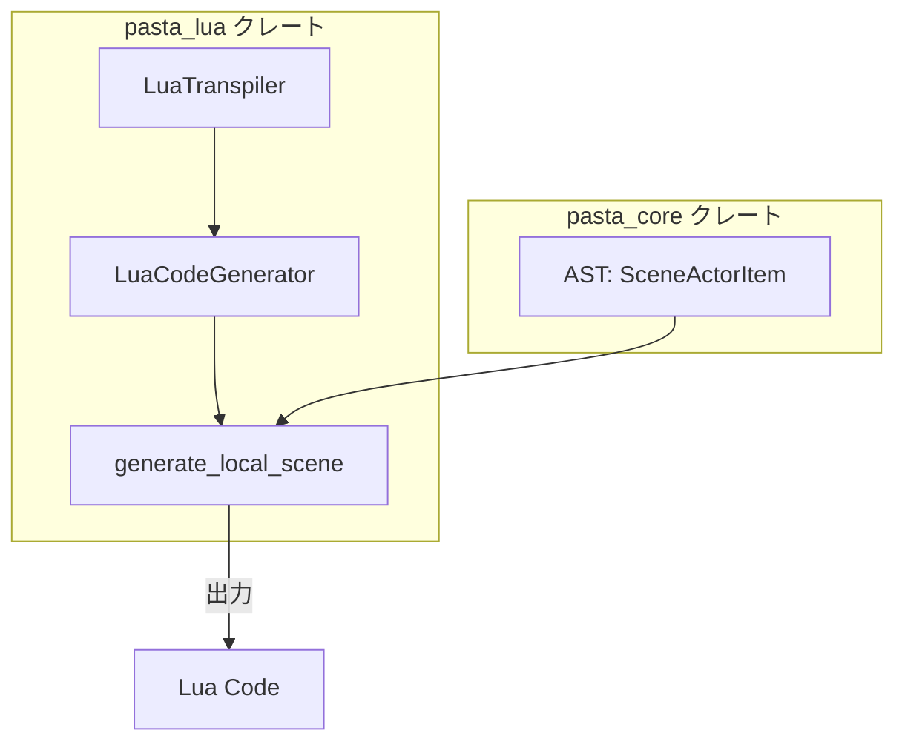
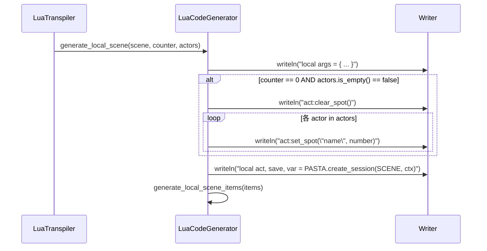

# Design Document: scene-actor-initialization-refactoring

## Overview

**Purpose**: pasta_luaトランスパイラーにおけるシーンアクター初期化コードの出力形式を変更し、Luaランタイム側で一貫したアクター管理APIを使用できるようにする。

**Users**: トランスパイラー開発者およびLuaランタイム開発者が、アクター初期化処理の順序と形式を統一したAPIで扱えるようになる。

**Impact**: `generate_local_scene()` メソッド内のアクター初期化出力ロジックを変更。既存テストの検証文字列更新が必要。

### Goals
- `act:clear_spot()` と `act:set_spot("名前", 位置)` 形式でアクター初期化コードを出力
- `PASTA.create_session()` 呼び出しの前にアクター初期化を配置
- 既存機能（アクター辞書、会話アクション、シーン呼び出し）への影響なし

### Non-Goals
- Luaランタイム側の `act:clear_spot()` / `act:set_spot()` 実装（別仕様）
- ローカルシーン（非`__start__`）でのアクター初期化出力
- 新規テストケースの追加（既存テスト修正のみ）

## Architecture

### Existing Architecture Analysis

**現在の実装パターン** ([`code_generator.rs`](c:\home\maz\git\pasta\crates\pasta_lua\src\code_generator.rs) L237-280):

```rust
pub fn generate_local_scene(&mut self, scene, counter, actors) {
    // ...
    self.writeln("local args = { ... }")?;
    self.writeln("local act, save, var = PASTA.create_session(SCENE, ctx)")?;  // ← 現在の位置
    
    if counter == 0 && !actors.is_empty() {
        for actor in actors {
            self.writeln(&format!("act.{}:set_spot({})", actor.name, actor.number))?;  // ← 現在の形式
        }
    }
    // ...
}
```

**変更後の出力順序**:
1. `local args = { ... }`
2. `act:clear_spot()` (アクターが存在する場合)
3. `act:set_spot("名前", 位置)` × N
4. `local act, save, var = PASTA.create_session(SCENE, ctx)`

### Architecture Pattern & Boundary Map



**Architecture Integration**:
- **Selected pattern**: 既存メソッド内での変更（Option A）
- **Domain boundaries**: `pasta_lua` クレート内で完結、`pasta_core` への変更なし
- **Existing patterns preserved**: `generate_*()` メソッド群の構造維持
- **New components rationale**: 新コンポーネント不要
- **Steering compliance**: 既存の `pasta_lua` アーキテクチャに準拠

### Technology Stack

| Layer   | Choice / Version  | Role in Feature            | Notes    |
| ------- | ----------------- | -------------------------- | -------- |
| Backend | Rust 2024 edition | トランスパイラー実装       | 既存     |
| Output  | Lua 5.3+          | 生成コード対象             | 既存     |
| Parser  | pasta_core        | AST提供 (`SceneActorItem`) | 変更なし |

## System Flows

### アクター初期化コード生成フロー



## Requirements Traceability

| Requirement   | Summary            | Components       | Interfaces           | Flows                |
| ------------- | ------------------ | ---------------- | -------------------- | -------------------- |
| 1.1, 1.2      | 出力位置変更       | LuaCodeGenerator | generate_local_scene | アクター初期化フロー |
| 2.1, 2.2      | clear_spot()追加   | LuaCodeGenerator | generate_local_scene | アクター初期化フロー |
| 3.1, 3.2, 3.3 | set_spot()形式変更 | LuaCodeGenerator | generate_local_scene | アクター初期化フロー |
| 4.1, 4.2      | コード構造整合性   | LuaCodeGenerator | generate_local_scene | アクター初期化フロー |
| 5.1, 5.2, 5.3 | 互換性維持         | -                | -                    | - (変更なし)         |

## Components and Interfaces

| Component        | Domain/Layer         | Intent         | Req Coverage | Key Dependencies    | Contracts |
| ---------------- | -------------------- | -------------- | ------------ | ------------------- | --------- |
| LuaCodeGenerator | pasta_lua/transpiler | Lua コード生成 | 1, 2, 3, 4   | SceneActorItem (P0) | Service   |

### pasta_lua/transpiler

#### LuaCodeGenerator

| Field        | Detail                                      |
| ------------ | ------------------------------------------- |
| Intent       | Pasta AST から Lua コードを生成する         |
| Requirements | 1.1, 1.2, 2.1, 2.2, 3.1, 3.2, 3.3, 4.1, 4.2 |

**Responsibilities & Constraints**
- `generate_local_scene()` メソッド内でアクター初期化コードの出力順序と形式を制御
- `__start__` シーン（counter == 0）のみでアクター初期化を出力
- アクターが存在しない場合は `clear_spot()` を出力しない

**Dependencies**
- Inbound: LuaTranspiler — シーン生成の委譲 (P0)
- Inbound: pasta_core::parser::SceneActorItem — アクター情報 (P0)
  - **補足**: `actors` パラメータの出典・フィルタリング方法は議題化（Issue 3）
- Outbound: Writer — Lua コード出力 (P0)

**Contracts**: Service [x]

##### Service Interface

```rust
impl<'a, W: Write> LuaCodeGenerator<'a, W> {
    /// ローカルシーン関数を生成する
    /// 
    /// # Arguments
    /// * `scene` - ローカルシーンスコープ
    /// * `counter` - シーンカウンター（0 = __start__）
    /// * `actors` - シーンアクター配列
    /// 
    /// # Preconditions
    /// - scene は有効な LocalSceneScope
    /// - actors は GlobalSceneScope.actors から渡される
    /// 
    /// # Postconditions
    /// - counter == 0 かつ actors.is_empty() == false の場合:
    ///   - "local args = { ... }" の直後に "act:clear_spot()" を出力
    ///   - 各アクターに対して "act:set_spot(\"name\", number)" を出力（順序は actors 配列順）
    ///   - その後 "local act, save, var = PASTA.create_session(SCENE, ctx)" を出力
    /// - counter != 0 の場合:
    ///   - アクター初期化ブロック全体をスキップ
    ///   - 従来通り "local args" の直後に "PASTA.create_session()" を出力
    /// - counter == 0 かつ actors.is_empty() == true の場合:
    ///   - アクター初期化ブロック全体をスキップ（clear_spot() 不出力）
    ///   - 従来通り "local args" の直後に "PASTA.create_session()" を出力
    pub fn generate_local_scene(
        &mut self,
        scene: &LocalSceneScope,
        counter: usize,
        actors: &[SceneActorItem],
    ) -> Result<(), TranspileError>;
}
```

**Implementation Notes**
- **変更箇所**: L253-267 のアクター初期化ロジック
- **出力形式変更**: `act.名前:set_spot(位置)` → `act:set_spot("名前", 位置)`
- **新規出力追加**: `act:clear_spot()` をアクター初期化ブロックの先頭に追加
- **順序変更**: `create_session()` をアクター初期化ブロックの後に移動

## Error Handling

### Error Strategy
本変更では新規エラーパターンは導入しない。既存の `TranspileError` で対応。

### Error Categories and Responses
- **該当なし**: 本変更はコード生成ロジックの順序・形式変更のみ

## Testing Strategy

### Unit Tests
本変更では新規ユニットテスト追加は不要。既存テストの検証文字列を更新。

### Integration Tests
既存テストの修正対象:

| テスト名                             | 修正内容                                     |
| ------------------------------------ | -------------------------------------------- |
| `test_set_spot_multiple_actors`      | 検証文字列を新形式に変更＋clear_spot検証追加 |
| `test_set_spot_single_actor`         | 同上＋clear_spot検証追加                     |
| `test_set_spot_empty_actors`         | set_spot出力なし＋clear_spot不出力を確認     |
| `test_set_spot_with_explicit_number` | 検証文字列を新形式に変更＋clear_spot検証追加 |

### テスト検証項目
**文字列置換に加えて、以下の検証アサーションを追加:**

1. **clear_spot()の存在確認** （アクター存在時）
   - `assert!(lua_code.contains("act:clear_spot()"), "Missing clear_spot call")`

2. **出力順序検証** （create_session より前）
   - create_session の位置と clear_spot の位置を比較
   - set_spot が clear_spot より後かつ create_session より前に来ているか確認

3. **clear_spot不出力確認** （アクター非存在時）
   - test_set_spot_empty_actors で `!lua_code.contains("act:clear_spot()")`

### テスト修正例

```rust
// Before
assert!(lua_code.contains("act.さくら:set_spot(0)"));

// After
assert!(lua_code.contains("act:set_spot(\"さくら\", 0)"));
assert!(lua_code.contains("act:clear_spot()"));
```
