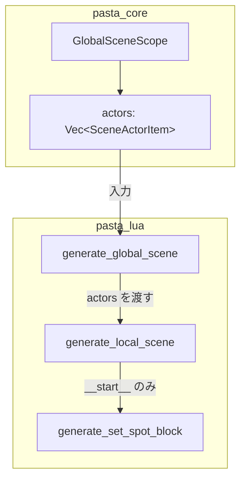
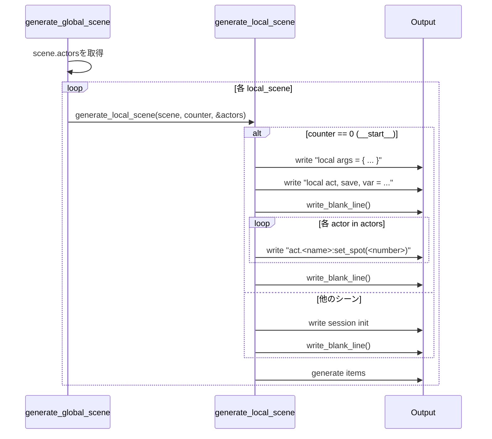

# 技術設計ドキュメント: scene-actors-lua-codegen

## 概要

本設計では、pasta_coreで定義された`SceneActorItem` ASTをpasta_luaで受け取り、`SCENE.__start__`関数内でアクターの立ち位置（spot番号）を初期設定するLuaコードを生成する機能を追加する。

### スコープ

- **対象**: pasta_lua（`code_generator.rs`）
- **対象外**: pasta_core（変更なし、ASTは実装済み）

### ゴール

1. `GlobalSceneScope.actors`からアクター情報を取得し、`set_spot`呼び出しを生成
2. `__start__`関数でのみ生成（他のローカルシーン関数では生成しない）
3. `PASTA.create_session`行の直後に配置し、前後に空行を挿入

### 非ゴール

- `set_spot` Lua API側の実装
- エラーハンドリング（不正なアクター参照など）
- アクター追加情報（スポット名など）の対応

## アーキテクチャ

### コンポーネント図



### データフロー

1. `generate_global_scene`が`GlobalSceneScope.actors`を取得
2. `generate_local_scene`に`actors`を渡す（署名変更）
3. `generate_local_scene`内で`counter == 0`（`__start__`）の場合のみ`set_spot`ブロックを生成

## 技術スタック

| レイヤー | ツール/ライブラリ | 役割 |
|----------|-------------------|------|
| AST | pasta_core | `SceneActorItem`提供（変更なし） |
| コード生成 | pasta_lua | Luaコード出力 |
| テスト | cargo test | 統合テスト |

## システムフロー

### set_spot生成シーケンス



## 要件トレーサビリティ

| 要件 | 概要 | コンポーネント | インターフェース | フロー |
|------|------|----------------|------------------|--------|
| 1.1 | actors非空時にset_spot生成 | generate_local_scene | actors: &[SceneActorItem] | set_spot生成 |
| 1.2 | act.<name>:set_spot(<number>)形式 | generate_local_scene | - | set_spot生成 |
| 1.3 | actors空時は生成しない | generate_local_scene | - | set_spot生成 |
| 1.4 | 宣言順序を保持 | generate_local_scene | - | set_spot生成 |
| 2.1 | __start__のみで生成 | generate_local_scene | counter == 0判定 | set_spot生成 |
| 2.2 | create_session直後に配置 | generate_local_scene | - | set_spot生成 |
| 2.3 | 複数行アクター集約 | generate_global_scene | scene.actors | データフロー |
| 3.1, 3.2, 3.3 | テスト検証 | transpiler_integration_test | - | テスト |

## コンポーネントとインターフェース

### コンポーネントサマリ

| コンポーネント | ドメイン | 目的 | 要件 | 主要依存 |
|----------------|----------|------|------|----------|
| generate_global_scene | コード生成 | actors取得・伝播 | 2.3 | GlobalSceneScope (P0) |
| generate_local_scene | コード生成 | set_spot生成 | 1.1-1.4, 2.1-2.2 | SceneActorItem (P0) |

---

### コード生成レイヤー

#### generate_global_scene（既存・修正）

| フィールド | 詳細 |
|-----------|------|
| 目的 | actors情報をgenerate_local_sceneに伝播 |
| 要件 | 2.3 |

**責任と制約**
- `scene.actors`を取得し、`generate_local_scene`呼び出し時に渡す
- 既存の処理フローは変更なし
- 呼び出し箇所は`code_generator.rs` line 184のみ（単一箇所、テストコードからの呼び出しなし）

**変更箇所**
```rust
// 変更前（line 184）
self.generate_local_scene(local_scene, counter)?;

// 変更後
self.generate_local_scene(local_scene, counter, &scene.actors)?;
```

---

#### generate_local_scene（既存・修正）

| フィールド | 詳細 |
|-----------|------|
| 目的 | __start__関数でset_spot呼び出しを生成 |
| 要件 | 1.1, 1.2, 1.3, 1.4, 2.1, 2.2 |

**責任と制約**
- 署名変更: `actors: &[SceneActorItem]`パラメータ追加
- `counter == 0`（`__start__`）の場合のみ`set_spot`ブロックを生成
- `actors`が空の場合は何も生成しない

**依存関係**
- Inbound: generate_global_scene — actors配列提供 (P0)
- Outbound: Output — Luaコード出力 (P0)

**サービスインターフェース**

```rust
// 変更後の署名
pub fn generate_local_scene(
    &mut self,
    scene: &LocalSceneScope,
    counter: usize,
    actors: &[SceneActorItem],  // NEW
) -> Result<(), TranspileError>
```

**実装ノート**
- 前提条件: `scene`は有効な`LocalSceneScope`、`actors`はpasta_coreで計算済み
- 事後条件: `__start__`関数内に`set_spot`呼び出しが生成される
- 不変条件: アクターの宣言順序が保持される

---

#### set_spot生成ロジック

**生成パターン（議題3対応）**

```rust
// generate_local_scene内（create_session後）

// Session initialization (Requirement 3c)
self.writeln("local args = { ... }")?;
self.writeln("local act, save, var = PASTA.create_session(SCENE, ctx)")?;

// NEW: set_spot block for __start__ only (counter == 0)
if counter == 0 && !actors.is_empty() {
    self.write_blank_line()?;  // 空行（create_session直後）
    for actor in actors {
        self.writeln(&format!("act.{}:set_spot({})", actor.name, actor.number))?;
    }
    self.write_blank_line()?;  // 空行（set_spot直後、items前）
} else {
    // other scenes: just blank line after session init
    self.write_blank_line()?;
}

// ... items generation below ...
```

**空行配置の厳密性（要件4「生成コード例」対応）**

```lua
function SCENE.__start__(ctx, ...)
    local args = { ... }
    local act, save, var = PASTA.create_session(SCENE, ctx)
    [空行 1]
    act.さくら:set_spot(0)      
    act.うにゅう:set_spot(2)
    act.まりか:set_spot(3)
    [空行 2]
    act.さくら:talk(...)
end
```

注記: `counter != 0` の場合（他のローカルシーン）は `set_spot` ブロック全体がスキップされ、既存の 1 行空行のみ生成。

## データモデル

### 入力データ（pasta_coreから）

| 型 | フィールド | 説明 |
|----|-----------|------|
| `SceneActorItem` | `name: String` | アクター名 |
| `SceneActorItem` | `number: u32` | スポット番号（C#採番済み） |
| `SceneActorItem` | `span: Span` | ソース位置（未使用） |
| `GlobalSceneScope` | `actors: Vec<SceneActorItem>` | アクター一覧 |

### 出力データ（Luaコード）

```lua
act.<name>:set_spot(<number>)
```

## テスト戦略

### テスト配置計画（議題2対応）

- **新規関数配置**: `crates/pasta_lua/tests/transpiler_integration_test.rs` の最後に4つのテスト関数を追加
- **既存テストとの関係**: 既存テスト（`test_transpile_sample_pasta_*`）に依存なし、独立したテストとして実行
- **パターン遵守**: 既存テストに倣い同ファイル内に配置、`parse_str()` → `transpile()` → `lua_code.contains()` パターン

### 統合テスト（transpiler_integration_test.rs）

| テスト | 説明 | 検証内容 |
|--------|------|----------|
| test_set_spot_single_actor | 単一アクター | `act.さくら:set_spot(0)` |
| test_set_spot_multiple_actors | 複数アクター | 順序保持、正しい番号 |
| test_set_spot_empty_actors | アクターなし | set_spot未生成 |
| test_set_spot_with_explicit_number | 明示的番号 | `＝２`の反映 |

### テスト実装パターン

```rust
#[test]
fn test_set_spot_multiple_actors() {
    let source = r#"
＊シーン
％さくら、うにゅう＝２
・
　さくら：こんにちは
"#;
    let file = parse_str(source, "test.pasta").unwrap();
    let transpiler = LuaTranspiler::default();
    let mut output = Vec::new();
    transpiler.transpile(&file, &mut output).unwrap();
    let lua_code = String::from_utf8(output).unwrap();

    assert!(lua_code.contains("act.さくら:set_spot(0)"));
    assert!(lua_code.contains("act.うにゅう:set_spot(2)"));
    
    // 順序検証
    let sakura_pos = lua_code.find("act.さくら:set_spot").unwrap();
    let unyu_pos = lua_code.find("act.うにゅう:set_spot").unwrap();
    assert!(sakura_pos < unyu_pos, "アクター順序が保持されていない");
}
```

## 実装順序

1. **Task 1**: `code_generator.rs` - `generate_local_scene`署名変更 + `set_spot`生成ロジック
2. **Task 2**: `code_generator.rs` - `generate_global_scene`の呼び出し部分修正
3. **Task 3**: `transpiler_integration_test.rs` - 新規テスト追加
4. **Task 4**: 全テスト実行・検証
