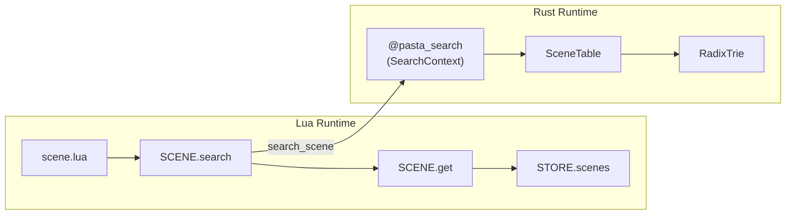
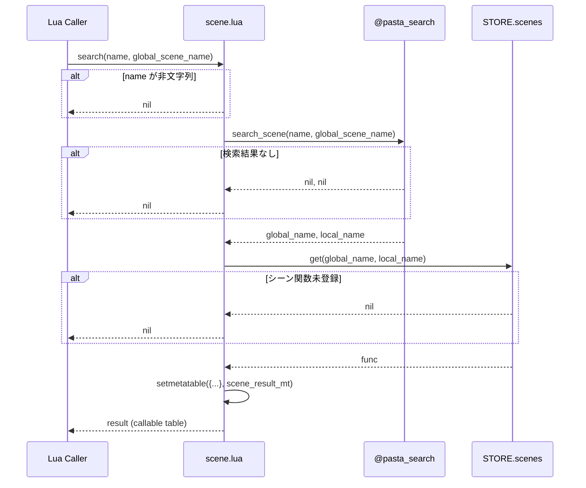
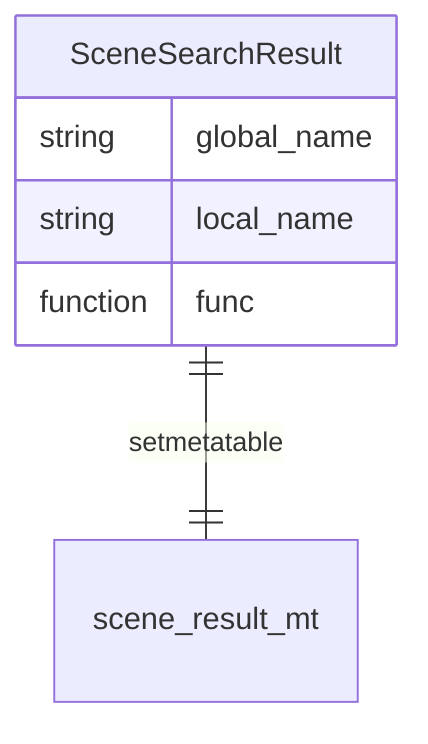

# Design Document: scene-search-integration

## Overview

**Purpose**: `SCENE.search()` 関数を `scene.lua` に追加し、`@pasta_search` モジュールを活用した動的シーン検索機能を提供する。

**Users**: 
- **トランスパイラ出力**: `act:call()` と組み合わせた動的シーン遷移
- **ゴースト開発者**: SHIORI イベントハンドラ（`REG.OnBoot` 等）からのシーン実行

**Impact**: 既存の `scene.lua` モジュールに約20行の追加。既存APIへの影響なし。

### Goals
- `@pasta_search` の前方一致検索を Lua 側から利用可能にする
- 検索結果をメタデータ付きで返却し、関数として直接呼び出し可能にする
- 既存 API との後方互換性を維持する

### Non-Goals
- `act.lua` への変更（将来検討: `act:call_dynamic()`）
- イベントハンドラ内での CTX/ACT 初期化パターンの定義（既存機能で対応）
- トランスパイラ出力形式の変更

## Architecture

### Existing Architecture Analysis

**現在のシーン管理構造**:
- `scene.lua`: シーンレジストリ管理（`STORE.scenes` への登録・取得）
- `@pasta_search`: Rust側シーン辞書への前方一致検索（SearchContext UserData）
- `store.lua`: データストア（`STORE.scenes` = `{global_name: SceneTable}`）

**現在のモジュール依存関係**:
```
scene.lua
├── STORE (pasta.store)
└── WORD (pasta.word)
```

**拡張後の依存関係**:
```
scene.lua
├── STORE (pasta.store)
├── WORD (pasta.word)
└── SEARCH (@pasta_search)  ← 新規追加
```

### Architecture Pattern & Boundary Map



**Architecture Integration**:
- **選択パターン**: モジュール内拡張（既存 scene.lua への関数追加）
- **ドメイン境界**: Lua側シーンレジストリ / Rust側検索エンジン
- **既存パターン維持**: `@pasta_persistence` と同様の require パターン
- **新規コンポーネント**: `scene_result_mt`（メタテーブル）、`SCENE.search()`（関数）
- **Steering準拠**: 単一責任原則、最小変更

### Technology Stack

| Layer | Choice / Version | Role in Feature | Notes |
|-------|------------------|-----------------|-------|
| Backend | Lua 5.4 (mlua) | シーン検索関数の実装 | 既存 |
| Runtime | PastaLuaRuntime | @pasta_search の提供 | 既存、初期化順序保証 |
| Search | @pasta_search (SearchContext) | 前方一致検索エンジン | Rust UserData |

## System Flows

### シーン検索フロー



## Requirements Traceability

| Requirement | Summary | Components | Interfaces | Flows |
|-------------|---------|------------|------------|-------|
| 1.1-1.7 | シーン検索関数の追加 | SCENE.search | search() | シーン検索フロー |
| 2.1-2.4 | act:call() との統合 | scene_result_mt | __call | - |
| 3.1-3.4 | @pasta_search ロード | - | require() | 初期化 |
| 4.1-4.3 | エラーハンドリング | SCENE.search | - | シーン検索フロー |
| 5.1-5.3 | 既存 API 互換性 | - | - | - |
| 6.1-6.3 | イベント駆動サポート | SCENE.search | - | シーン検索フロー |

## Components and Interfaces

| Component | Domain/Layer | Intent | Req Coverage | Key Dependencies | Contracts |
|-----------|--------------|--------|--------------|------------------|-----------|
| SCENE.search | scene.lua | シーン検索・取得 | 1, 2, 4, 6 | @pasta_search (P0), SCENE.get (P0) | Service |
| scene_result_mt | scene.lua | 呼び出し可能テーブル | 1.4, 1.7, 2.1 | - | - |

### scene.lua Module

#### SCENE.search Function

| Field | Detail |
|-------|--------|
| Intent | @pasta_search を使用してシーン関数を検索・取得 |
| Requirements | 1.1-1.7, 2.1-2.4, 4.1-4.3, 6.1-6.3 |

**Responsibilities & Constraints**
- 検索プレフィックスを `@pasta_search` に委譲
- 検索結果から `SCENE.get()` でシーン関数を取得
- メタデータ付きテーブルを返却
- 入力バリデーション（nil/非文字列 → nil）

**Dependencies**
- Inbound: Lua呼び出し元 — シーン検索要求 (P0)
- Outbound: @pasta_search — search_scene() 呼び出し (P0)
- Outbound: SCENE.get — シーン関数取得 (P0)
- Outbound: STORE.scenes — データアクセス (P1、SCENE.get経由)

**Contracts**: Service [x]

##### Service Interface

```lua
--- @class SceneSearchResult
--- @field global_name string グローバルシーン名
--- @field local_name string ローカルシーン名
--- @field func function シーン関数
--- メタテーブル: scene_result_mt (__call メタメソッド付き)

--- シーン検索（@pasta_search 活用）
--- @param name string 検索プレフィックス
--- @param global_scene_name string|nil 親シーン名（nil でグローバル検索）
--- @return SceneSearchResult|nil メタデータ付き検索結果テーブル、またはnil
function SCENE.search(name, global_scene_name)
```

**Preconditions**:
- `@pasta_search` がロード済み（PastaLuaRuntime保証）
- `name` は string 型であること（nil/非文字列 → nil 返却）

**Postconditions**:
- 成功時: `SceneSearchResult` テーブルを返却（`__call` で呼び出し可能）
- 失敗時: `nil` を返却
- `@pasta_search` エラー時: エラーを上位に伝播

**Invariants**:
- 既存 `SCENE` API への影響なし
- `STORE.scenes` の構造変更なし

#### scene_result_mt Metatable

| Field | Detail |
|-------|--------|
| Intent | 検索結果テーブルを関数として呼び出し可能にする |
| Requirements | 1.4, 1.7, 2.1 |

**Structure**:
```lua
local scene_result_mt = {
    __call = function(self, ...)
        return self.func(...)
    end
}
```

**Usage**:
```lua
local result = SCENE.search("選択肢", SCENE.__global_name__)
if result then
    -- 関数として呼び出し（__call メタメソッド）
    result(act, ...)
    
    -- メタデータアクセス
    print(result.global_name, result.local_name)
end
```

**Implementation Notes**
- **Integration**: モジュールスコープで1回のみ定義
- **Validation**: 不要（search() が常に有効な func を設定）
- **Risks**: なし（標準的な Lua パターン）

## Data Models

### Domain Model

**SceneSearchResult**（値オブジェクト）:
| Field | Type | Description |
|-------|------|-------------|
| global_name | string | グローバルシーン名（例: "メイン1"） |
| local_name | string | ローカルシーン名（例: "__選択肢_1__"） |
| func | function | シーン関数 |

**Metatable**: `scene_result_mt`
- `__call(self, ...)` → `self.func(...)` への委譲

### Logical Data Model



## Error Handling

### Error Strategy

| Error Type | Handling | Response |
|------------|----------|----------|
| name が nil/非文字列 | 早期リターン | `nil` |
| 検索結果なし | 正常ケース | `nil` |
| シーン関数未登録 | 正常ケース | `nil` |
| @pasta_search エラー | 伝播 | Lua エラー発生 |

### Error Categories and Responses

**User Errors**: 
- 無効な引数 → `nil` 返却（サイレント処理）

**System Errors**: 
- @pasta_search 内部エラー → Lua エラーとして伝播
- 呼び出し元で必要に応じて `pcall` でキャッチ

**Business Logic Errors**: 
- シーン未発見 → `nil`（エラーではなく正常な検索結果なし）

## Testing Strategy

### Unit Tests
1. **正常系**: 存在するシーンの検索・取得（ローカル検索）
2. **正常系**: グローバル検索（`global_scene_name = nil`）
3. **境界値**: `name` が空文字列の場合
4. **エラー系**: `name` が nil の場合 → nil 返却
5. **エラー系**: `name` が非文字列の場合 → nil 返却

### Integration Tests
1. **PastaLuaRuntime 統合**: `@pasta_search` 登録後の `SCENE.search()` 動作
2. **シーン登録フロー**: `SCENE.register()` → `SCENE.search()` → 取得確認
3. **フォールバック検索**: ローカル→グローバル段階検索
4. **__call メタメソッド**: 検索結果の関数呼び出し

### E2E Tests
1. **イベントハンドラ統合**: `REG.OnBoot` からの `SCENE.search()` 呼び出し
2. **トランスパイル出力統合**: 生成コードからの動的シーン呼び出し

## Implementation Guidance

### 実装ファイル
- **変更対象**: `crates/pasta_lua/scripts/pasta/scene.lua`
- **変更量**: 約20行追加

### 実装パターン

```lua
-- ファイル先頭に追加（既存の require の後）
local SEARCH = require("@pasta_search")

-- scene_result_mt の定義（SCENE_TABLE_IMPL 定義の後に追加）
local scene_result_mt = {
    __call = function(self, ...)
        return self.func(...)
    end
}

-- SCENE.search() 関数（return SCENE の前に追加）
--- シーン検索（@pasta_search 活用）
--- @param name string 検索プレフィックス
--- @param global_scene_name string|nil 親シーン名（nil でグローバル検索）
--- @return table|nil メタデータ付き検索結果テーブル、またはnil
function SCENE.search(name, global_scene_name)
    if type(name) ~= "string" then return nil end
    
    local global_name, local_name = SEARCH:search_scene(name, global_scene_name)
    if not global_name then return nil end
    
    local func = SCENE.get(global_name, local_name)
    if not func then return nil end
    
    return setmetatable({
        global_name = global_name,
        local_name = local_name,
        func = func,
    }, scene_result_mt)
end
```

### 挿入位置

1. `local SEARCH = require("@pasta_search")` → L9（`local WORD = require("pasta.word")` の後）
2. `scene_result_mt` 定義 → L32付近（`scene_table_mt` 定義（L29-31）の直後）
3. `SCENE.search()` 関数 → L120付近（`SCENE.create_scene()` の後、`return SCENE` の前）

### テストファイル
- **新規作成**: `crates/pasta_lua/tests/scene_search_test.rs`
- **前提**: PastaLuaRuntime を使用（`@pasta_search` 登録のため）
