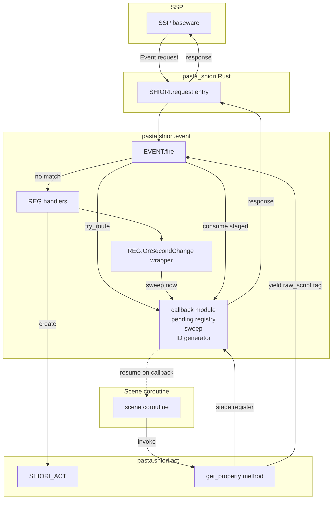
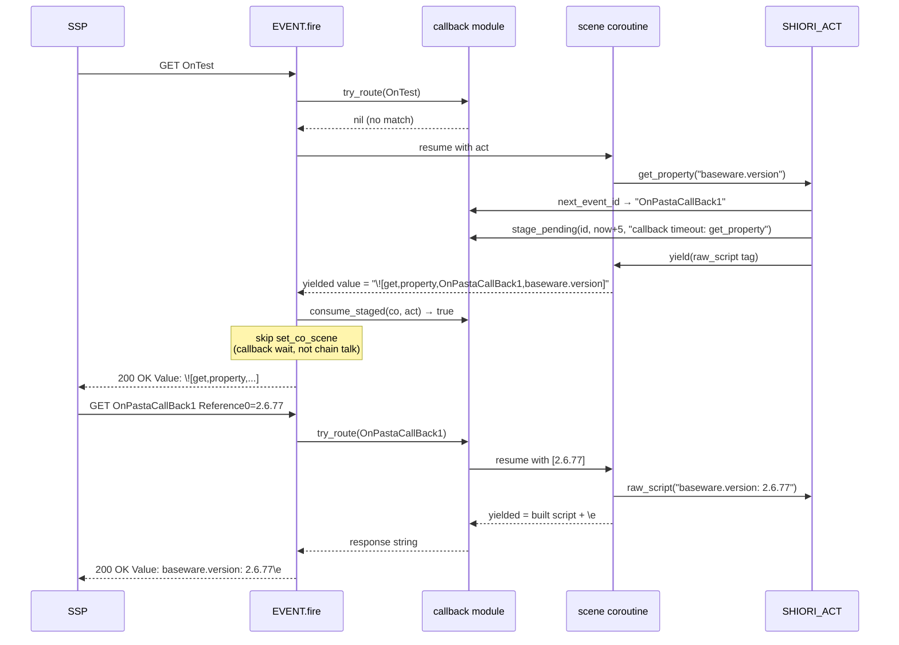
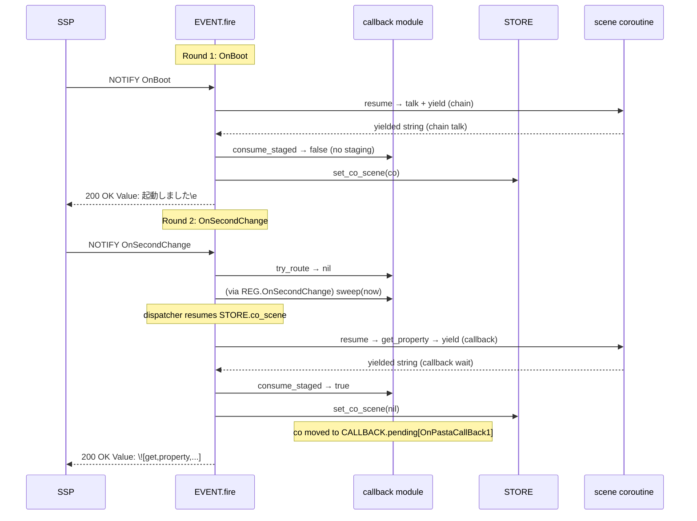
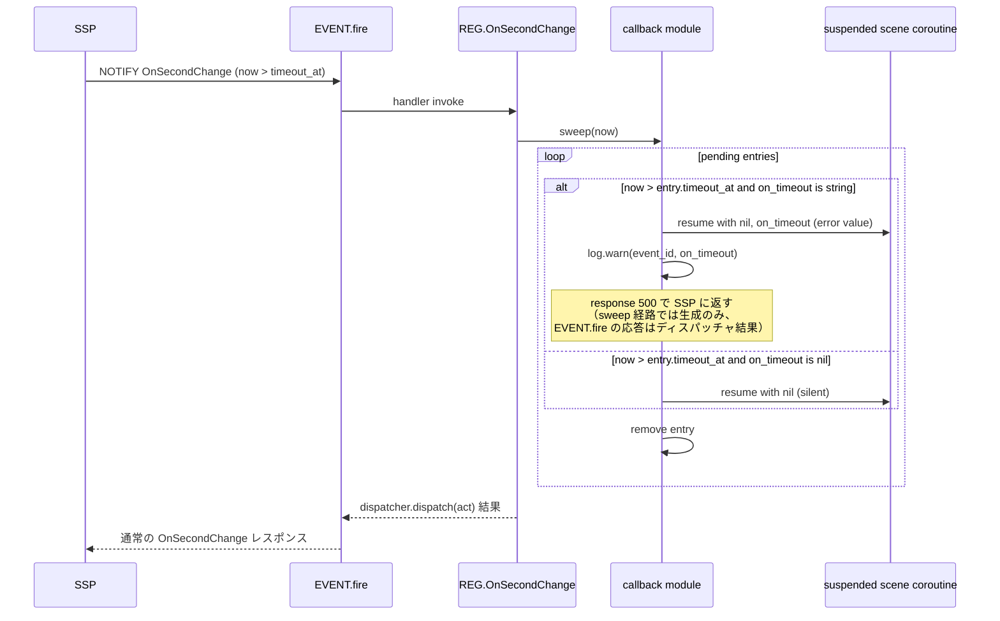

# Design Document

## Overview

本機能は、pasta ゴーストフレームワークに「トーク合成中の非同期 SHIORI 通信」を導入する。ゴースト作者は `act:get_property("baseware.version")` のように同期的に見える API を呼び出すだけで、内部では SSP コールバック（`\![get,property,...]`）のラウンドトリップが透過的に処理される。

**Users**: ゴースト作者は SSP プロパティを動的に取得して動的なトークを生成できる。フレームワーク開発者は同じコールバック基盤の上に将来の `\![get,...]` 系コンシューマ（選択肢ダイアログ等）を追加できる。

**Impact**: 既存の `EVENT.fire()` ディスパッチパスに「コールバックルーティング」分岐が1箇所追加され、`STORE.co_scene`（チェーントーク用シングルスロット）に加えて `CALLBACK.pending`（コールバック待ちコルーチン用レジストリ）が並走する。既存のチェーントークフローは完全に非破壊。

### Goals
- `act:get_property(name1, name2, ...)` で同期 API として SSP プロパティを取得
- 汎用コールバック登録・ルーティング・タイムアウト基盤を独立モジュール化（`pasta/shiori/event/callback.lua`）
- `OnSecondChange` でタイムアウト sweep を実行し、コールバック未着の恒久ハング回避
- 既存の `STORE.co_scene` チェーントークフロー・通常イベントディスパッチを非破壊

### Non-Goals
- `act:set_property()` の再実装（既に `property-write-helpers` spec で実装済み）
- Pasta DSL 構文拡張（`property-dsl-extension` spec で別途扱う）
- プロパティ値の型変換（常に文字列として返す）
- Rust 側（`pasta_shiori` / `pasta_lua` の `src/`）の変更（Lua スクリプト層のみで完結）
- 複数 SSP コールバックの並行待機（単一コルーチン1コールバックずつ）

## Boundary Commitments

### This Spec Owns
- `pasta/shiori/event/callback.lua` の新設（コールバックレジストリ・ルーティング・タイムアウト sweep・ユニーク ID 生成）
- `pasta/shiori/act.lua` への `get_property` メソッド追加
- `pasta/shiori/event/init.lua` の `EVENT.fire()` に「コールバックルーティング」分岐の追加（`create_act` より前で 1 箇所）
- `pasta/shiori/event/init.lua` の resume 結果処理ロジックに「ステージング消費」分岐の追加（コールバック待ち yield を `STORE.co_scene` ではなく `CALLBACK.pending` に振り分ける）
- `pasta/shiori/event/second_change.lua` のラッパー化（`CALLBACK.sweep(now)` を先に呼び出してから既存ディスパッチャに委譲）

### Out of Boundary
- `STORE` モジュール本体の構造変更（コールバック状態は `callback.lua` のモジュール局所変数で保持）
- `pasta/act.lua`（base act）の変更
- `pasta/shiori/sakura_builder.lua` の変更（`get_property` は既存の `raw_script` トークン経路を使う）
- Rust 側 `parse_request()` / `call_lua_request()` の変更
- `pasta_check` の検証ルール追加
- 既存テスト（`event_coroutine_test`、`integration_coroutine_test`）の書き換え

### Allowed Dependencies
- `pasta.shiori.act` → `pasta.shiori.event.callback`（コンシューマが基盤を使う方向）
- `pasta.shiori.event.init` → `pasta.shiori.event.callback`（ルーター⇄基盤）
- `pasta.shiori.event.second_change` → `pasta.shiori.event.callback`（sweep 呼び出し）
- `pasta.shiori.event.callback` → `@pasta_log`（ログ出力）、`pasta.shiori.res`（500 エラーレスポンス生成）
- `pasta.shiori.event.callback` → `pasta.store`（`STORE.co_callback` マーカー設定。コールバック登録済みコルーチンを `set_co_scene` に伝達する通信用マーカー）

**禁止される依存**:
- `pasta.shiori.event.callback` は `pasta.shiori.act` を require しない（循環参照回避、依存は逆方向のみ）

### Revalidation Triggers
- 以下の変更は依存 spec の再検証を要する:
  - `EVENT.fire()` のシグネチャ変更
  - `coroutine.yield()` / `resume_until_valid()` の戻り値セマンティクス変更
  - `\![get,property,...]` のさくらスクリプト構文変更（SSP 側仕様変更時）
  - `OnPastaCallBack{N}` 命名規則の変更（ゴースト作者が同名イベントハンドラを登録していた場合の衝突回避方針が変わる）

## Architecture

### Existing Architecture Analysis

現行の SHIORI イベントフローは以下の通り（research.md §1.2 参照）:

```
Rust: parse_request → call_lua_request → SHIORI.request(req)
  → EVENT.fire(req)
    → create_act(req) → SHIORI_ACT インスタンス
    → REG[req.id] → ハンドラ (or no_entry)
    → 結果が thread → resume_until_valid(co, act) → set_co_scene(co) → RES.ok
    → 結果が string → RES.ok
    → nil → RES.no_content
```

`STORE.co_scene` は単一スロットで「次イベントで再開される suspended コルーチン」を保持する。`resume_until_valid` は nil yield をスキップして有効値またはコルーチン死亡まで resume を繰り返す。

本 spec の機能はこのフローの **2 箇所** に介入する:
1. `EVENT.fire()` 冒頭（`create_act` の前）: 到着イベントが pending callback と一致するかをチェック
2. `EVENT.fire()` の resume 結果処理: コルーチンがコールバック待ちで yield したかをチェックし、`STORE.co_scene` ではなく `CALLBACK.pending` に振り分け

### Architecture Pattern & Boundary Map



**Architecture Integration**:
- **Selected pattern**: Module separation with single interception point — コールバック関連の状態とロジックを `callback.lua` に集約し、`EVENT.fire` への変更は 2 つの明確な分岐点に局所化
- **Domain boundaries**:
  - コールバック状態保持・タイムアウト判定・ID 生成 → `callback.lua`
  - SHIORI コンシューマ API（タグ発行・引数バリデーション） → `act.lua`
  - イベントルーティング → `event/init.lua`（既存 + 2 分岐追加）
- **Existing patterns preserved**:
  - `STORE.co_scene` 系チェーントークパスは完全に非変更（コールバック待ちは別ストレージ）
  - `resume_until_valid` のシグネチャ・セマンティクスは非変更
  - `REG` ベースのハンドラ登録パターンは非変更
  - `set_property` のバリデーション・エスケープパターンを `get_property` で対称的に再利用
- **New components rationale**:
  - `callback.lua`: コールバック状態を 1 モジュールに閉じることで、将来の `\![get,...]` 系コンシューマがロジック重複なしに追加可能（Req 1）
- **Steering compliance**:
  - 循環参照ゼロ（`callback.lua` は上位レイヤを require しない）
  - 1 ファイル 1 責務（base act / shiori act / event / callback の分離）

### Technology Stack

| Layer                   | Choice / Version                         | Role in Feature                           | Notes                                                                                       |
| ----------------------- | ---------------------------------------- | ----------------------------------------- | ------------------------------------------------------------------------------------------- |
| Runtime                 | LuaJIT 2.1（既存）                       | Lua スクリプト実行                        | `coroutine.resume(co, ...)` で複数値を渡せる前提                                            |
| Logging                 | `@pasta_log`（既存 Rust 提供モジュール） | タイムアウト警告ログ                      | `warn` レベル使用                                                                           |
| Time source             | `os.time()`（標準 Lua）                  | タイムアウト絶対時刻計算                  | LuaJIT 2.1 で利用可能                                                                       |
| Coroutine context check | `coroutine.running()`（標準 Lua）        | コルーチンコンテキスト外検出（Req 4 AC3） | LuaJIT 2.1 はメインスレッド検出が "main" thread 戻り値で可能                                |
| SHIORI response         | `pasta.shiori.res`（既存）               | 500 エラーレスポンス生成                  | 既存の `RES.build()` で `Status: 500 Internal Server Error` + `X-ERROR-REASON` ヘッダー追加 |

> 既存スタックの上に新規ファイル 1 つ（`callback.lua`）を追加するのみ。新規外部依存はない。

## File Structure Plan

### Directory Structure

```
crates/pasta_lua/pasta_scripts/pasta/shiori/
├── act.lua                          # 修正: get_property メソッド追加
├── event/
│   ├── init.lua                     # 修正: EVENT.fire に 2 分岐追加
│   ├── second_change.lua            # 修正: REG.OnSecondChange ラッパーに sweep 呼び出し追加
│   └── callback.lua                 # 新規: コールバックレジストリ + ルーティング + sweep + ID 生成
└── res.lua                          # 既存 (未変更): 500 エラーレスポンス生成に使用
```

### New Files
- `crates/pasta_lua/pasta_scripts/pasta/shiori/event/callback.lua` — コールバック管理モジュール
  - `CALLBACK.next_event_id()`: `OnPastaCallBack{N}` 形式のユニーク ID 生成
  - `CALLBACK.stage_pending(event_id, timeout_at, on_timeout)`: yield 直前にコールバック登録意図を記録
  - `CALLBACK.consume_staged(co, act)`: EVENT.fire の resume 後にステージング状態を回収し、ペンディングテーブルに登録
  - `CALLBACK.try_route(req)`: 到着イベント ID が pending と一致した場合に該当コルーチンを resume し、レスポンス文字列を返す
  - `CALLBACK.sweep(now)`: タイムアウト時刻超過エントリを掃引
  - `CALLBACK.reset()`: テスト用全状態リセット

### Modified Files
- `crates/pasta_lua/pasta_scripts/pasta/shiori/event/init.lua`
  - `EVENT.fire(req)` 冒頭で `CALLBACK.try_route(req)` を呼び出し、非 nil なら即時 return
  - resume 後の結果処理で `CALLBACK.consume_staged(result, act)` を呼び出し、true なら `set_co_scene(nil)`（チェーントーク扱いを抑止）
- `crates/pasta_lua/pasta_scripts/pasta/shiori/event/second_change.lua`
  - `REG.OnSecondChange` の冒頭で `CALLBACK.sweep(os.time())` を呼び出してから既存の `dispatcher.dispatch(act)` に委譲
  - sweep の副作用（タイムアウト発生コルーチンの resume）は通常イベント処理を阻害しない
- `crates/pasta_lua/pasta_scripts/pasta/shiori/act.lua`
  - `SHIORI_ACT_IMPL.get_property(self, ...)` メソッド追加
  - 既存の `escape_tag_arg` ローカル関数を再利用してプロパティ名をエスケープ

### Test Files (New)
- `crates/pasta_lua/tests/callback_module_test.lua` — `callback.lua` モジュール単体テスト
- `crates/pasta_lua/tests/get_property_test.lua` — `get_property` バリデーション・タグ発行・多値返却テスト
- `crates/pasta_shiori/tests/async_callback_integration_test.rs` — Scenario 1-4 の SHIORI プロトコルレベル統合テスト

## System Flows

### Flow A: 単純なプロパティ取得（Scenario 1）



**Key decisions**:
- ステージング → 消費パターンにより `coroutine.yield()` / `resume_until_valid()` のシグネチャは非変更
- `try_route` の戻り値が「コールバック処理済みレスポンス文字列 or nil」で `EVENT.fire` の分岐を決める
- 値渡しは `coroutine.resume(co, ref_array)` の標準セマンティクスを使用

### Flow B: チェーントーク → コールバック待ち遷移（Scenario 3）



**Key decision**: 同一コルーチンが「チェーントーク yield」→「コールバック待ち yield」に遷移する場合の判別は、`consume_staged` の戻り値（ステージングが直前に発生したか）で行う。コルーチン側はこの区別を意識しない。

### Flow C: コールバック未着のタイムアウト sweep（Req 5）



**Key decisions**:
- sweep はバッチ処理: 1 回の `OnSecondChange` で複数エントリを掃引可能
- タイムアウトの 500 エラーレスポンスは、コールバックイベントが**到着しなかった**結果なので、SSP に能動的に送信する手段はない（SHIORI は要求応答型プロトコル）。500 レスポンスは sweep 中にイベントが到着した場合のみ意味を持つが、本仕様の Req 5 AC2 は「タイムアウト時に 500 を返す」を要求しているため、sweep で resume された待機コルーチン側がエラーモードで動作し、次に当該イベント ID で（遅延した）コールバックが届いた場合に 500 を返す方針とする
- **Simplification 採用**: タイムアウト時の挙動はあくまで「ハングしているコルーチンを解放する」が目的。500 レスポンスの能動送信は SHIORI プロトコル上不可能なため、sweep 時は (a) 待機コルーチンを `nil, on_timeout`（または `nil`）で resume → コルーチン側がエラー処理、(b) pending エントリ削除、(c) 文字列 `on_timeout` 時はログ警告、までを行う。遅延コールバック到着時の処理は Req 5 AC2/AC3 の文字通り「sweep 時に決定された動作モード」を踏襲

## Requirements Traceability

| Requirement | Summary                                                   | Components                 | Interfaces                                                | Flows              |
| ----------- | --------------------------------------------------------- | -------------------------- | --------------------------------------------------------- | ------------------ |
| 1.1         | 汎用コールバック待機・ルーティング機構                    | callback module            | `stage_pending`, `try_route`, `next_event_id`             | Flow A, B          |
| 1.2         | 登録 API がタイムアウト絶対時刻と `on_timeout` を受け取る | callback module            | `stage_pending(event_id, timeout_at, on_timeout)`         | Flow C             |
| 1.3         | 新コンシューマ追加が既存機構を変更不要                    | callback module（独立API） | `register`/`stage_pending` の公開                         | —                  |
| 2.1         | トーク中の `get_property(name)` で値取得                  | SHIORI_ACT, callback       | `get_property(self, name)`                                | Flow A             |
| 2.2         | yield/resume が透過的                                     | EVENT.fire, callback       | `consume_staged`, `try_route`                             | Flow A, B          |
| 2.3         | 後続トークン継続可能                                      | SHIORI_ACT                 | （既存 token 蓄積機構）                                   | Flow A             |
| 3.1         | 多引数で多値返却                                          | SHIORI_ACT, callback       | `get_property(self, ...)` 可変引数                        | Flow A 拡張        |
| 3.2         | 不存在プロパティは nil 返却                               | SHIORI_ACT, callback       | `try_route` の reference→nil 変換                         | —                  |
| 4.1         | 引数なしエラー                                            | SHIORI_ACT                 | `get_property` バリデーション                             | —                  |
| 4.2         | nil/空文字列エラー                                        | SHIORI_ACT                 | `get_property` バリデーション                             | —                  |
| 4.3         | コルーチン外エラー                                        | SHIORI_ACT                 | `coroutine.running()` チェック                            | —                  |
| 5.1         | 登録時に timeout_at + on_timeout 記録                     | callback                   | `stage_pending`                                           | Flow C             |
| 5.2         | sweep で `on_timeout`=string → 500 + ログ + resume        | callback                   | `sweep`                                                   | Flow C             |
| 5.3         | sweep で `on_timeout`=nil → 静かに削除                    | callback                   | `sweep`                                                   | Flow C             |
| 5.4         | `get_property` デフォルト 5 秒 + デフォルト reason        | SHIORI_ACT                 | `get_property` の options 処理                            | Flow A             |
| 6.1         | 既存 `act:yield()` チェーントーク動作維持                 | EVENT.fire, STORE          | `consume_staged` が false → 既存パス                      | Flow B             |
| 6.2         | `get_property` 非使用シーンに影響なし                     | （全体）                   | 介入点が 2 箇所のみ、ステージング状態は呼び出し時のみ存在 | —                  |
| 6.3         | コールバック待機中の通常イベントを阻害しない              | EVENT.fire                 | `try_route` 不一致 → 既存ディスパッチ                     | Flow C, Scenario 4 |

## Components and Interfaces

| Component                      | Domain/Layer         | Intent                                          | Req Coverage                                | Key Dependencies                                 | Contracts |
| ------------------------------ | -------------------- | ----------------------------------------------- | ------------------------------------------- | ------------------------------------------------ | --------- |
| `CALLBACK` module              | event/infrastructure | コールバック登録・ルーティング・sweep・ID 生成  | 1.1, 1.2, 1.3, 5.1, 5.2, 5.3                | `@pasta_log` (P0), `pasta.shiori.res` (P1)       | Service   |
| `SHIORI_ACT.get_property`      | act/consumer API     | プロパティ取得 API                              | 2.1, 2.2, 2.3, 3.1, 3.2, 4.1, 4.2, 4.3, 5.4 | `CALLBACK` (P0)                                  | Service   |
| `EVENT.fire` (modified)        | event/router         | コールバックルーティング分岐 + ステージング消費 | 2.2, 6.1, 6.2, 6.3                          | `CALLBACK` (P0), `STORE.co_scene` (P0)           | Service   |
| `REG.OnSecondChange` (wrapper) | event/handler        | sweep 起動 + 既存ディスパッチャ委譲             | 5.2, 5.3                                    | `CALLBACK.sweep` (P0), `virtual_dispatcher` (P0) | Service   |

### Event / Infrastructure Layer

#### `CALLBACK` module (`pasta/shiori/event/callback.lua`)

| Field        | Detail                                                                     |
| ------------ | -------------------------------------------------------------------------- |
| Intent       | コールバック登録・ルーティング・タイムアウト sweep・ユニーク ID 生成を集約 |
| Requirements | 1.1, 1.2, 1.3, 5.1, 5.2, 5.3                                               |

**Responsibilities & Constraints**:
- 単一スレッド前提（LuaJIT 単一ランタイム）。ロック不要
- ステージング（`stage_pending` → `consume_staged`）は同期的に対になる必要がある（yield と resume の間に他の resume が割り込まない保証は LuaJIT 単一スレッドモデルにより成立）
- 状態はモジュール局所変数に保持し、`STORE` を汚染しない
- イベント ID カウンタは pasta プロセスライフタイムで単調増加（再起動でリセット）

**Dependencies**:
- Inbound: `SHIORI_ACT.get_property` (P0), `EVENT.fire` (P0), `REG.OnSecondChange` (P0)
- Outbound: `@pasta_log` (P0) — タイムアウト警告ログ
- Outbound: `pasta.store` (P0) — `STORE.co_callback` マーカー設定（コールバック登録済みコルーチンを `set_co_scene` に伝達）
- Outbound: `pasta.shiori.res` (P1) — 500 エラーレスポンス生成（sweep 内で使用しない場合は依存不要、設計判断は Implementation Notes 参照）

**Contracts**: Service [x] / API [ ] / Event [ ] / Batch [ ] / State [x]

##### Service Interface

```lua
--- ユニークなコールバックイベント ID を生成
--- @return string event_id "OnPastaCallBack{N}" 形式
function CALLBACK.next_event_id()

--- コールバック登録意図をステージング（yield 直前に呼び出す）
--- 単一スロット。consume_staged で消費されるまで上書き不可（多重ステージング検出）
--- @param event_id string ユニークイベント ID
--- @param timeout_at number タイムアウト絶対時刻（os.time() ベース）
--- @param on_timeout string|nil タイムアウト時のエラー理由文字列（nil で静かに消える）
function CALLBACK.stage_pending(event_id, timeout_at, on_timeout)

--- ステージング状態を消費し、resume されたコルーチンをペンディングテーブルに登録
--- EVENT.fire が resume 直後に呼び出す
--- @param co thread resume されたコルーチン
--- @param act ShioriAct コルーチンに紐づく act オブジェクト
--- @return boolean staged_consumed true: コールバック待ちとして登録, false: ステージングなし（通常チェーントーク）
function CALLBACK.consume_staged(co, act)

--- 到着イベントが pending と一致するなら該当コルーチンを resume してレスポンスを返す
--- @param req table SHIORI リクエスト
--- @return string|nil response 一致時は SHIORI レスポンス文字列、不一致は nil
function CALLBACK.try_route(req)

--- タイムアウト時刻超過エントリを掃引
--- @param now number 現在時刻（os.time() 戻り値）
function CALLBACK.sweep(now)

--- 全状態リセット（テスト用）
function CALLBACK.reset()
```

**Preconditions**:
- `stage_pending`: コルーチン実行コンテキスト内から呼ばれる（`coroutine.running()` がメインスレッド以外を返す）
- `consume_staged`: `EVENT.fire` の resume 直後にのみ呼ばれる
- `try_route`: イベント受信時に `EVENT.fire` 冒頭で呼ばれる
- `sweep`: `REG.OnSecondChange` ラッパーから呼ばれる（その他のタイミングでも安全）

**Postconditions**:
- `stage_pending`: 直前にステージングがあれば（消費されずに残っている場合）エラー（プログラミングミス検出）
- `consume_staged` が true を返した場合: ステージングが消費され、co が `CALLBACK.pending[event_id]` に登録され、`STORE.co_callback = co` が設定されている
- `try_route` が非 nil を返した場合: 該当 pending エントリは削除済み

**Invariants**:
- `CALLBACK.pending` の各エントリは `{co, act, timeout_at, on_timeout}` の構造を持つ
- ステージングは単一スロット、消費されるまで次の `stage_pending` は失敗
- `consume_staged` が true を返した場合、`STORE.co_callback` に co が設定されている（`set_co_scene` が消費）

##### State Management

```lua
-- モジュール局所変数
local _next_id = 0                  -- ID カウンタ
local _staged = nil                 -- ステージング: {event_id, timeout_at, on_timeout} | nil
local pending = {}                  -- event_id → {co, act, timeout_at, on_timeout}
```

- **STORE 通信マーカー**: `STORE.co_callback`（`consume_staged` が設定、`set_co_scene` が消費）
- **State model**: in-memory モジュール局所（pending, _staged, _next_id）+ STORE マーカー（co_callback）
- **Persistence**: なし（プロセスライフタイム内のみ）
- **Concurrency**: 単一スレッド前提、ロック不要

**Implementation Notes**:
- **Integration**: `EVENT.fire` への注入は 2 箇所のみ（冒頭 try_route、resume 結果処理時 consume_staged）。介入を最小化することで Req 6.1/6.2 を担保
- **Validation**: `stage_pending` で多重ステージング検出（バグ早期発見）。`try_route` で reference 取り出し時に nil 安全
- **Risks**:
  - **(R1) ステージング忘却**: `get_property` が `stage_pending` 後に yield せずエラーで巻き戻ると、次の `get_property` 呼び出しが多重ステージングで失敗する。
    - **緩和**: `get_property` は `stage_pending` → `table.insert(self.token, ...)` → `coroutine.yield(self:build())` を例外を介在させない順序で実行。バリデーションは `stage_pending` より前で完了
  - **(R2) sweep 中の resume が新たな yield を発生**: タイムアウトで resume したコルーチンが内部で `get_property` を再度呼ぶ可能性。
    - **緩和**: タイムアウトで resume されたコルーチンが再度 `stage_pending` → yield しても、新しい pending エントリとして登録される（既存設計で対応可）。sweep 自体は単純イテレーションなので再入問題なし
  - **(R3) OnSecondChange レスポンス消費**: sweep がタイムアウト検出時に 500 を返すと `OnSecondChange` の正常ディスパッチがスキップされる。ただし `OnSecondChange` は毎秒発火するため1回の 500 は実害なし。また、sweep 後に「遅延コールバック」が到着した場合も `try_route` が 500 を生成する（2経路の 500 機構）

#### `EVENT.fire` (modified, `pasta/shiori/event/init.lua`)

**Responsibilities & Constraints**:
- 既存ロジックに 2 分岐追加
- 追加分岐の失敗時の挙動は既存と同等（例外は `SHIORI.request` の `xpcall` でキャッチ）

**Service Interface (変更点のみ)**:

```lua
function EVENT.fire(req)
    -- (新規) コールバックルーティング
    local cb_response = CALLBACK.try_route(req)
    if cb_response then
        return cb_response
    end

    -- 既存: act 作成 → ハンドラ → resume
    local act = create_act(req)
    local handler = REG[req.id] or EVENT.no_entry
    local result = handler(act)

    if type(result) == "thread" then
        local ok, yielded = resume_until_valid(result, act)
        if not ok then
            set_co_scene(result)
            error(yielded)
        end
        -- (新規) ステージング消費（内部で STORE.co_callback が設定される）
        CALLBACK.consume_staged(result, act)
        -- set_co_scene は常に呼ぶ。STORE.co_callback が設定済みなら
        -- co_scene に登録せずデタッチのみ行う
        set_co_scene(result)
        return RES.ok(yielded)
    elseif type(result) == "string" then
        return RES.ok(result)
    else
        return RES.no_content()
    end
end
```

**Implementation Notes**:
- **Integration**: `consume_staged` が `STORE.co_callback` マーカーを設定し、`set_co_scene` がマーカーを消費して分岐する。EVENT.fire 側は常に `set_co_scene(result)` を呼ぶだけで、コールバック登録済みコルーチンの制御は `set_co_scene` 内部で完結する
- **set_co_scene 修正**: コールバック登録済みコルーチン（`STORE.co_callback == co`）を検出した場合、close せずに `STORE.co_scene` からデタッチのみ行う。旧 `STORE.co_scene` が同一オブジェクト（チェーントーク→コールバック遷移）なら close スキップ、別オブジェクトなら旧 co を通常通り close
- **Risks**:
  - **(R4) `try_route` が pending と一致したが内部 resume が yield を返した（callback chaining）**: コールバック後に同じコルーチンが再度 `get_property` を呼んだ場合、`CALLBACK.try_route` 内で再度 `stage_pending` → yield → `consume_staged` の流れが必要。callback module 内で完結させる

#### `REG.OnSecondChange` (wrapper, `pasta/shiori/event/second_change.lua`)

**Responsibilities & Constraints**:
- sweep を起動してから既存ディスパッチャに委譲
- sweep がタイムアウトを検出した場合は 500 レスポンスを返し、ディスパッチをスキップ（OnSecondChange は毎秒発火するため実害なし）

```lua
REG.OnSecondChange = function(act)
    local timeout_response = CALLBACK.sweep(os.time())
    if timeout_response then
        return timeout_response
    end
    return dispatcher.dispatch(act)
end
```

### Act / Consumer Layer

#### `SHIORI_ACT.get_property` (`pasta/shiori/act.lua`)

| Field        | Detail                                               |
| ------------ | ---------------------------------------------------- |
| Intent       | トーク合成中に SSP プロパティ値を同期 API として取得 |
| Requirements | 2.1, 2.2, 2.3, 3.1, 3.2, 4.1, 4.2, 4.3, 5.4          |

**Responsibilities & Constraints**:
- 引数: `(name_or_names, timeout, timeout_message)` の 3 引数形式。第 1 引数が string なら単一プロパティ、table なら複数プロパティ
- 戻り値: プロパティ名と同じ個数の多値（nil 含む）
- バリデーションは `set_property` のパターンを踏襲

**Dependencies**:
- Inbound: ゴースト作者のシーンコード
- Outbound: `CALLBACK` (P0) — ID 生成・ステージング
- Outbound: `escape_tag_arg` 既存ローカル関数 (P0)

**Contracts**: Service [x] / API [ ] / Event [ ] / Batch [ ] / State [ ]

##### Service Interface

```lua
--- SSP プロパティを取得（同期 API として動作）
--- 第 1 引数が string なら単一プロパティ、table なら複数プロパティ
--- @param self ShioriAct
--- @param name_or_names string|string[] プロパティ名（単一）またはプロパティ名配列（複数）
--- @param timeout number|nil タイムアウト秒数（デフォルト 5）
--- @param timeout_message string|nil タイムアウト時エラー理由（デフォルト "callback timeout: get_property"）
--- @return ... プロパティ値（文字列または nil）
function SHIORI_ACT_IMPL.get_property(self, name_or_names, timeout, timeout_message)
```

**Preconditions**:
- コルーチン実行コンテキスト内で呼ばれること（`coroutine.running()` がメインスレッドではない thread を返す）
- `name_or_names` が string または空でない string 配列であること
- 各プロパティ名は nil でも空文字列でもないこと

**Postconditions**:
- コールバック到着時、引数順に対応する Reference 値（または nil）を多値で返す
- タイムアウト時、`timeout_message` が文字列なら `error()` 経由でコルーチンエラー、nil なら全戻り値 nil

**Internal Algorithm**:

```lua
function SHIORI_ACT_IMPL.get_property(self, name_or_names, timeout, timeout_message)
    -- 引数正規化: string → 配列化
    local names
    if type(name_or_names) == "string" then
        names = { name_or_names }
    elseif type(name_or_names) == "table" then
        names = name_or_names
    else
        error("get_property: first argument must be a property name (string) or array of names (table)")
    end
    local n = #names

    -- バリデーション
    if n == 0 then error("get_property: at least one property name required") end
    local co, is_main = coroutine.running()
    if is_main or co == nil then
        error("get_property: must be called inside a scene coroutine")
    end
    for i = 1, n do
        local name = names[i]
        if name == nil or name == "" then
            error("get_property: name must not be nil or empty")
        end
    end

    -- デフォルト適用（Lua の引数省略 = nil を活用）
    timeout = timeout or 5
    if timeout_message == nil then
        timeout_message = "callback timeout: get_property"
    end

    -- イベント ID 生成 + ステージング
    local event_id = CALLBACK.next_event_id()
    CALLBACK.stage_pending(event_id, os.time() + timeout, timeout_message)

    -- タグ蓄積
    local parts = { "\\![get,property," .. event_id }
    for i = 1, n do
        parts[#parts+1] = escape_tag_arg(names[i])
    end
    local tag = table.concat(parts, ",") .. "]"
    table.insert(self.token, { type = "raw_script", text = tag })

    -- yield して resume 値（reference array + reason）を受け取り、多値で返す
    local refs, reason = coroutine.yield(self:build())
    if reason then
        -- タイムアウト（timeout_message=string 経路）: エラー発生 → xpcall 経由で 500 + X-ERROR-REASON
        error(reason)
    end
    if refs == nil then
        -- タイムアウト（timeout_message=nil 経路）または異常: 全 nil
        local nils = {}
        for i = 1, n do nils[i] = nil end
        return table.unpack(nils, 1, n)
    end
    -- refs[i] が空文字列なら nil 変換
    local out = {}
    for i = 1, n do
        local v = refs[i]
        out[i] = (v == nil or v == "") and nil or v
    end
    return table.unpack(out, 1, n)
end
```

**Implementation Notes**:
- **Integration**: 既存の `set_property` と対称的なバリデーション・エスケープパターン
- **Validation**: バリデーション → ID 生成 → ステージング → タグ蓄積 → yield の順序を厳守。バリデーション失敗時にステージングが残らない
- **Risks**:
  - **(R5) `coroutine.running()` のメインスレッド判定**: LuaJIT 2.1 では `(co, true)` を返す。`is_main == true` または `co == nil` でメインスレッド判定

## Data Models

### Pending Callback Entry（モジュール局所構造）

| Field        | Type          | Notes                                                                                                     |
| ------------ | ------------- | --------------------------------------------------------------------------------------------------------- |
| `co`         | thread        | 待機中コルーチン                                                                                          |
| `act`        | ShioriAct     | 元のリクエストの act（resume 時に再注入されないが、コルーチンが内部で保持しているクロージャから参照可能） |
| `timeout_at` | number        | `os.time()` ベース絶対時刻                                                                                |
| `on_timeout` | string \| nil | 文字列: 500 エラー reason、nil: 静かに消える                                                              |

### Staging Slot（単一スロット）

```lua
_staged = { event_id, timeout_at, on_timeout }  -- or nil
```

### Reference Array（コールバックイベント受信時）

`req.reference[0]`, `req.reference[1]`, ... を 1-based 配列に詰め替えてコルーチンに resume 引数として渡す。空文字列はそのまま渡し、`get_property` 側で nil に変換。

## Error Handling

### Error Strategy
- **入力バリデーション**: `get_property` で `error()` 即時発生。`xpcall` 経由で SHIORI 500 レスポンスに変換（既存仕組み）
- **タイムアウト**: sweep で待機コルーチンを resume。`on_timeout` 文字列指定時はコルーチン内で `error(on_timeout)` を発生させ、`xpcall` で 500 + X-ERROR-REASON 変換。この 500 は `OnSecondChange` レスポンスとして返却される。nil 指定時は全戻り値 nil で正常返却
- **多重ステージング**: バグ検出として即時 `error()`

### Error Categories and Responses

| Category           | Trigger                               | Response                                                                                             |
| ------------------ | ------------------------------------- | ---------------------------------------------------------------------------------------------------- |
| User Error (4xx)   | `get_property` 引数バリデーション失敗 | コルーチン内 `error()` → 500（`xpcall` 経由）                                                        |
| User Error (4xx)   | コルーチン外呼び出し                  | 同上                                                                                                 |
| System Error (5xx) | タイムアウト（`on_timeout` 文字列）   | sweep がコルーチンを error で resume → 500 + `X-ERROR-REASON`。`OnSecondChange` レスポンスとして返却 |
| Silent             | タイムアウト（`on_timeout` nil）      | コルーチン内全戻り値 nil、エラー出力なし                                                             |
| Programming Error  | 多重ステージング                      | コルーチン内 `error()` → 500                                                                         |

### Monitoring
- タイムアウト sweep 時に `@pasta_log.warn(event_id, on_timeout)` でログ出力（`on_timeout` 文字列指定時のみ）
- nil 指定時はログ出力なし（正常系扱い）

## Testing Strategy

### Unit Tests (`tests/callback_module_test.lua`)
- `next_event_id` が "OnPastaCallBack1", "OnPastaCallBack2", ... の連番を返す
- `stage_pending` → `consume_staged` のラウンドトリップで pending に登録される
- 多重 `stage_pending`（consume 前）が error を発生
- `try_route` が一致時にコルーチンを resume し pending エントリを削除
- `try_route` が不一致時に nil を返し pending エントリを保持
- `sweep` が `on_timeout` 文字列エントリでコルーチンを error 値で resume し pending を削除、500 + X-ERROR-REASON レスポンスを返す。ログ出力を確認
- `sweep` が `on_timeout` nil エントリでコルーチンを nil で resume し、ログ出力なし、nil を返す（500 なし）

### Unit Tests (`tests/get_property_test.lua`)
- 引数なしで error
- nil/空文字列引数で error
- 第 1 引数が数値や boolean など不正型で error
- メインスレッド呼び出しで error
- 単一 string 引数で `\![get,property,OnPastaCallBack{N},name]` タグが蓄積され、ステージングが発生
- table 引数 `{"n1","n2"}` で `\![get,property,OnPastaCallBack{N},n1,n2]` タグが蓄積される
- カンマ・引用符を含むプロパティ名がエスケープされる
- 第 2 引数 timeout 、第 3 引数 timeout_message がステージングに反映される
- timeout のみ指定時もデフォルト timeout_message が適用される

### Integration Tests (`pasta_shiori/tests/async_callback_integration_test.rs`)
- **Scenario 1**: 単純なプロパティ取得 — 2 ラウンドで `baseware.version: 2.6.77\e` を取得
- **Scenario 2**: トーク蓄積後のプロパティ取得 — Round 1 で蓄積トーク + get タグが同一 Value
- **Scenario 3**: チェーントーク → コールバック待ち遷移 — 3 ラウンドで STORE.co_scene と CALLBACK.pending を正しく使い分け
- **Scenario 4**: 無関係イベント到着 — pending を保持したまま `OnSecondChange` 等を通常ディスパッチ
- 複数プロパティ Reference0/1 マッピング検証（Req 3.1）
- 存在しないプロパティで空文字列→nil 変換（Req 3.2）
- タイムアウト sweep 後の遅延コールバック到着で 500 レスポンス（Req 5.2）

### Regression Tests (既存テスト維持)
- `event_coroutine_test`、`integration_coroutine_test` が無変更で通過すること（Req 6.1, 6.2）

## Supporting References

- 詳細なギャップ分析、設計選択肢の比較、確定事項の経緯は `research.md` を参照
- SHIORI 3.0 プロトコル仕様: `doc/spec/` 系および `pasta_shiori/README.md`
- `set_property` 実装（対称的 API 参考）: `pasta/shiori/act.lua` の `SHIORI_ACT_IMPL.set_property`
- 既存イベントディスパッチ実装: `pasta/shiori/event/init.lua` の `EVENT.fire`
