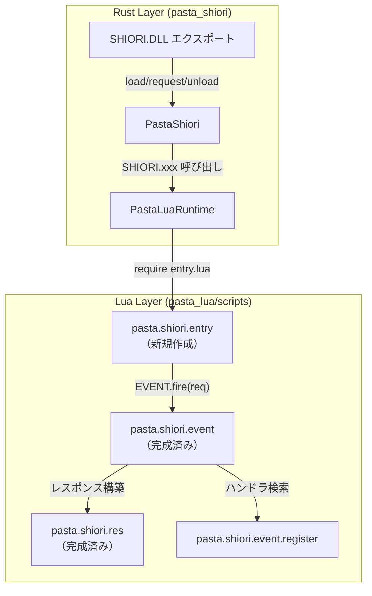
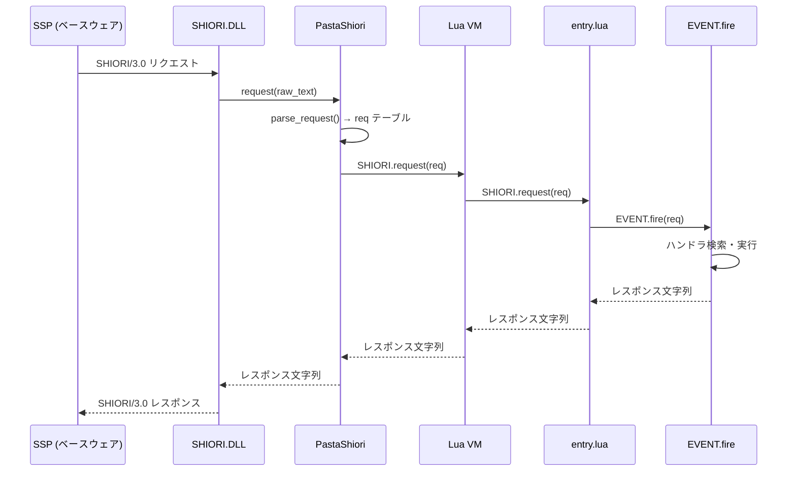

# Design Document: shiori-entry

## Overview

**Purpose**: SHIORI/3.0プロトコルのLua側エントリーポイント `pasta.shiori.entry` を提供し、Rustランタイムからのイベント処理を `pasta.shiori.event` モジュールに委譲する。

**Users**: 
- Rustランタイム（`pasta_shiori`クレート）がDLL load/request/unloadを呼び出す
- 将来のゴースト開発者が拡張ポイントを利用してカスタム初期化を実装

**Impact**: 既存の `pasta.shiori.main` を完全に置き換え、イベント振り分けを機能させる。

### Goals

- `pasta.shiori.entry` モジュールの新規作成
- `SHIORI.load/request/unload` の実装（EVENT.fire 委譲）
- Rust側のファイルパス変更（main.lua → entry.lua）
- 既存main.luaの完全削除

### Non-Goals

- SHIORI.load/unload の本格的な初期化・クリーンアップ処理（将来拡張）
- イベントハンドラの追加実装（EVENT モジュールの責務）
- レスポンス生成ロジック（RES モジュールの責務）

---

## Architecture

### Existing Architecture Analysis

現在のアーキテクチャにおける統合ポイント:

| 層 | コンポーネント | 状態 | 役割 |
|----|---------------|------|------|
| Rust | `pasta_shiori::PastaShiori` | 完成済み | SHIORI DLL エクスポート |
| Rust | `pasta_lua::runtime::PastaLuaRuntime` | **変更必要** | Luaランタイム初期化、entry.lua読み込み |
| Lua | `pasta.shiori.main` | **削除対象** | 現行エントリーポイント（ミニマル実装） |
| Lua | `pasta.shiori.entry` | **新規作成** | 新エントリーポイント |
| Lua | `pasta.shiori.event` | 完成済み | イベント振り分け（EVENT.fire） |
| Lua | `pasta.shiori.res` | 完成済み | レスポンス構築 |

### Architecture Pattern & Boundary Map



**Architecture Integration**:

- **Selected pattern**: Facade Pattern - `entry.lua` は SHIORI プロトコルの Lua 側ファサードとして機能
- **Domain boundaries**: entry = プロトコル境界、event = ディスパッチ、res = レスポンス構築
- **Existing patterns preserved**: グローバル `SHIORI` テーブル、UPPER_CASE モジュール名
- **New components rationale**: main.lua の責務を明確化し、EVENT.fire 委譲を実装
- **Steering compliance**: `lua-coding.md` のモジュール構造規約、`UPPER_CASE` テーブル命名に準拠

### Technology Stack

| Layer | Choice / Version | Role in Feature | Notes |
|-------|------------------|-----------------|-------|
| Lua Runtime | mlua 0.10 (Lua 5.4) | スクリプト実行 | ALL_SAFE サンドボックス |
| Rust Integration | pasta_shiori | DLL ⇔ Lua ブリッジ | グローバル SHIORI キャッシュ |
| Event System | pasta.shiori.event | イベント振り分け | xpcall エラーハンドリング |
| Response Builder | pasta.shiori.res | SHIORI レスポンス生成 | 200/204/500 テンプレート |

---

## System Flows

### SHIORI Request Processing Flow



**Flow-level decisions**:
- `parse_request()` は Rust 側で実行済み（`lua_request.rs`）
- `entry.lua` は単純なパススルー（ビジネスロジックなし）
- エラーハンドリングは `EVENT.fire` 内の xpcall で処理

---

## Requirements Traceability

| Requirement | Summary | Components | Interfaces | Flows |
|-------------|---------|------------|------------|-------|
| 1.1-1.4 | グローバル SHIORI 初期化 | entry.lua | SHIORI テーブル | require 時 |
| 2.1-2.5 | SHIORI.load 実装 | entry.lua | SHIORI.load(hinst, load_dir) | DLL load |
| 3.1-3.4 | SHIORI.request 実装 | entry.lua, EVENT | SHIORI.request(req), EVENT.fire(req) | リクエスト処理 |
| 4.1-4.4 | SHIORI.unload 実装 | entry.lua | SHIORI.unload() | DLL unload |
| 5.1-5.5 | 既存モジュール移行 | runtime/mod.rs, entry.lua | ファイルパス | 初期化 |
| 6.1-6.3 | Rust 整合性 | runtime/mod.rs | SHIORI キャッシュ | 初期化 |
| 7.1-7.4 | テスト要件 | テストフィクスチャ | - | テスト実行 |
| 8.1-8.3 | ドキュメント更新 | README.md | - | - |

---

## Components and Interfaces

| Component | Domain/Layer | Intent | Req Coverage | Key Dependencies | Contracts |
|-----------|--------------|--------|--------------|-----------------|-----------|
| entry.lua | Lua/SHIORI | プロトコルファサード | 1-4 | EVENT (P0) | Service |
| runtime/mod.rs | Rust/Runtime | entry.lua 読み込み | 5.4, 6.3 | mlua (P0) | - |
| テストフィクスチャ | Test | テスト用 entry.lua | 7.3 | - | - |

### Lua Layer

#### entry.lua

| Field | Detail |
|-------|--------|
| Intent | SHIORI/3.0 プロトコルの Lua 側ファサード |
| Requirements | 1.1-1.4, 2.1-2.5, 3.1-3.4, 4.1-4.4 |
| File Path | `crates/pasta_lua/scripts/pasta/shiori/entry.lua` |

**Responsibilities & Constraints**

- グローバル `SHIORI` テーブルの初期化（既存テーブルがあれば追加）
- `SHIORI.load`: DLL ロード時の初期化ポイント（現時点は true 返却のみ）
- `SHIORI.request`: `EVENT.fire(req)` への委譲
- `SHIORI.unload`: DLL アンロード時のクリーンアップポイント（現時点は空実装）
- ビジネスロジックを持たない（単純なファサード）

**Dependencies**

- Inbound: `PastaLuaRuntime` → require 実行 (P0)
- Outbound: `pasta.shiori.event` → EVENT.fire 呼び出し (P0)
- External: なし

**Contracts**: Service [x] / API [ ] / Event [ ] / Batch [ ] / State [ ]

##### Service Interface

```lua
-- 1. require文（モジュールレベル）
local EVENT = require("pasta.shiori.event")

-- 2. グローバルテーブル宣言
--- @class SHIORI
--- SHIORI/3.0 プロトコルインターフェース（グローバル）
SHIORI = SHIORI or {}

-- 3. 公開関数

--- DLLロード時の初期化
--- @param hinst integer DLLインスタンスハンドル
--- @param load_dir string ゴーストの master/ ディレクトリパス
--- @return boolean 初期化成功時 true
function SHIORI.load(hinst, load_dir)
    -- 将来の拡張ポイント: 設定ファイル読み込み、セーブデータ復元
    return true
end

--- リクエスト処理
--- @param req table リクエストテーブル（Rust側で parse_request() により生成）
--- @return string SHIORI/3.0 形式のレスポンス文字列
function SHIORI.request(req)
    return EVENT.fire(req)
end

--- DLLアンロード時のクリーンアップ
function SHIORI.unload()
    -- 将来の拡張ポイント: セーブデータ保存、リソース解放
end
```

**Preconditions**:
- `pasta.shiori.event` モジュールが require 可能であること
- `req` テーブルが Rust 側 `lua_request.rs` で生成された構造を持つこと

**Postconditions**:
- グローバル `SHIORI` テーブルに `load`, `request`, `unload` 関数が登録される
- `SHIORI.request` は常に SHIORI/3.0 形式の文字列を返却する

**Invariants**:
- `SHIORI` テーブルは require 後に必ず存在する
- `EVENT.fire` のエラーは xpcall でキャッチされ、エラーレスポンスに変換される

**Implementation Notes**

- Integration: グローバル `SHIORI` テーブルとして Rust 側からアクセス
- Validation: `req` テーブルの検証は EVENT 側で実施（entry では行わない）
- Risks: 将来の load/unload 拡張時にエラーハンドリング追加が必要

### Rust Layer

#### runtime/mod.rs 変更

| Field | Detail |
|-------|--------|
| Intent | entry.lua を読み込みグローバル SHIORI を初期化 |
| Requirements | 5.4, 6.3 |
| File Path | `crates/pasta_lua/src/runtime/mod.rs` |

**変更箇所**

```rust
// Line 309 (PastaLuaRuntime::new_with_scene_dic)
let main_lua_path = loader_context
    .base_dir
    .join("scripts/pasta/shiori/entry.lua");  // main.lua → entry.lua

// Line 378 (PastaLuaRuntime::from_loader_with_scene_dic)  
let main_lua_path = loader_context
    .base_dir
    .join("scripts/pasta/shiori/entry.lua");  // main.lua → entry.lua
```

**Responsibilities & Constraints**

- `entry.lua` ファイルの存在チェックと読み込み
- 読み込み失敗時は warn ログを出力し継続（既存動作維持）
- グローバル `SHIORI` テーブルの初期化をトリガー

### Test Layer

#### テストフィクスチャ

| Field | Detail |
|-------|--------|
| Intent | テスト用の entry.lua 実装 |
| Requirements | 7.3 |

**変更対象ファイル**

| 変更前 | 変更後 | 内容 |
|--------|--------|------|
| `tests/support/.../main.lua` | `tests/support/.../entry.lua` | リネーム + req テーブル対応 |
| `tests/fixtures/shiori_lifecycle/.../main.lua` | `tests/fixtures/shiori_lifecycle/.../entry.lua` | リネーム（既に req 対応済み） |

---

## Data Models

### req テーブル構造

Rust 側 `lua_request.rs` で生成されるリクエストテーブル:

```lua
--- @class ShioriRequest
--- @field id string イベント名（例: "OnBoot"）
--- @field method string "get" | "notify"
--- @field version integer SHIORI バージョン（30 = SHIORI/3.0）
--- @field charset string 文字セット（例: "UTF-8"）
--- @field sender string ベースウェア名（例: "SSP"）
--- @field reference table 0-indexed Reference 配列
--- @field dic table 全ヘッダー辞書
```

**Invariants**:
- `req.id` は常に存在（空文字列の可能性あり）
- `req.version` は整数 30（SHIORI/3.0）
- `req` テーブルは read-only 契約（ハンドラ内で変更禁止）

---

## Error Handling

### Error Strategy

entry.lua 自体はエラーハンドリングを行わず、EVENT.fire に委譲する。

### Error Categories and Responses

| エラー種別 | 発生箇所 | 対応 |
|-----------|----------|------|
| ハンドラ実行エラー | EVENT.fire 内 xpcall | RES.err() で 500 レスポンス |
| require 失敗 | entry.lua 読み込み時 | Rust 側 warn ログ、継続 |
| SHIORI.load 失敗 | 将来拡張 | false 返却 |

---

## Testing Strategy

### Unit Tests (Lua)

`crates/pasta_lua/tests/lua_specs/shiori_entry_spec.lua`:

1. `require("pasta.shiori.entry")` でグローバル `SHIORI` テーブルが作成される
2. `SHIORI.load(0, "/path")` が `true` を返す
3. `SHIORI.request(valid_req)` が文字列を返す
4. `SHIORI.unload()` がエラーなく完了する

### Integration Tests (Rust)

既存テストで検証:

1. `shiori_lifecycle_test.rs` - SHIORI ライフサイクル（load → request → unload）
2. `shiori_event_test.rs` - イベント振り分け動作

### Regression Tests

`cargo test --all` で以下を確認:

1. 既存の SHIORI テストが全て通過
2. EVENT モジュールテストが影響を受けない
3. トランスパイラテストが影響を受けない

---

## Migration Strategy

### Phase 1: entry.lua 作成

1. `crates/pasta_lua/scripts/pasta/shiori/entry.lua` を新規作成
2. グローバル `SHIORI` テーブル初期化
3. `SHIORI.load/request/unload` 実装

### Phase 2: Rust 側変更

1. `runtime/mod.rs:309` のパス変更
2. `runtime/mod.rs:378` のパス変更
3. テスト実行で動作確認

### Phase 3: main.lua 削除

1. `crates/pasta_lua/scripts/pasta/shiori/main.lua` 削除
2. テスト実行で回帰確認

### Phase 4: テストフィクスチャ更新

1. `tests/support/.../main.lua` → `entry.lua` リネーム + req 対応
2. `tests/fixtures/shiori_lifecycle/.../main.lua` → `entry.lua` リネーム
3. 全テスト実行

### Phase 5: ドキュメント更新

1. `crates/pasta_lua/scripts/README.md` 更新
2. 関連 steering ドキュメント確認・更新

### Rollback Triggers

- `cargo test --all` 失敗時は Phase 2 の Rust 変更を revert
- entry.lua に問題がある場合は main.lua のパスに戻す
