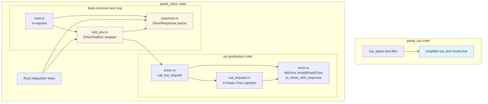
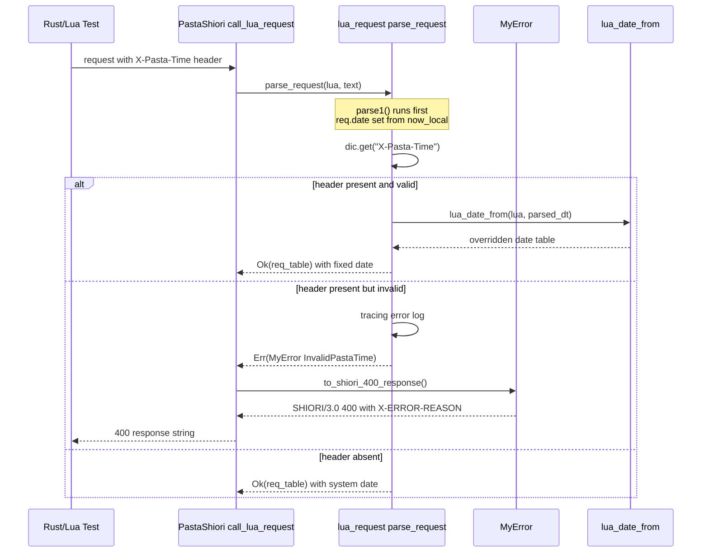
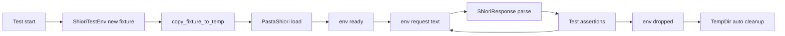

# Design Document

## Overview

**Purpose**: SHIORIイベントフロー試験のボイラープレートを排除し、時刻依存イベント・モック設定・レスポンス検証を最小記述で実行できるテスト基盤を提供する。

**Users**: pasta エンジン開発者（Rust/Luaテスト作成者）。`pasta_lua` の Lua-first ユニットテスト作成者と、`pasta_shiori` の Rust 統合テスト作成者の両方を対象とする。

**Impact**: 既存テストへの影響はゼロ（追加的変更のみ）。新規テストは X-Pasta-Time ヘッダーで時刻を決定論化し、`scriptlibs/lua_test/mocks.lua` でモックを一括設定し、`ShioriTestEnv` でフィクスチャ準備〜SHIORI往復〜構造化検証を一体化する。後続の `shiori-async-talk` 仕様のマルチステップ往復テスト基盤として機能する。

### Goals

- SHIORIリクエストヘッダー `X-Pasta-Time` (RFC 3339) による決定論的時刻注入
- Luaモック一括注入ライブラリ（5モジュール: `@pasta_persistence` / `@pasta_search` / `@pasta_sakura_script` / `@pasta_config` / `@pasta_log`）の単一ソース化
- SHIORIレスポンスの構造化パースによる個別フィールド検証
- フィクスチャ準備〜load〜request〜レスポンス検証を統合した `ShioriTestEnv`
- 不正な `X-Pasta-Time` ヘッダー値を 400 Bad Request + `X-ERROR-REASON` で詳細返却

### Non-Goals

- 既存テスト（950+ tests）の本フレームワークへの移行
- コルーチンステップ制御API（`shiori-async-talk` 仕様で構築）
- `pasta_check` への `test` サブコマンド追加
- テスト実行パフォーマンス最適化
- 他クレートから `ShioriTestEnv` を `dev-dependencies` 経由で利用する公開（将来 `shiori-async-talk` で必要になれば feature gate 化を検討）

## Boundary Commitments

### This Spec Owns

- `lua_request.rs::parse_request()` 内の `X-Pasta-Time` 検出・パース・`req.date` 上書きロジック
- `MyError::InvalidPastaTime` バリアントと `MyError::to_shiori_400_response()` メソッド
- `pasta_lua/scriptlibs/lua_test/mocks.lua` Luaモックライブラリの API と 5モジュールのデフォルトスタブ
- `pasta_shiori/tests/common/response.rs` (`ShioriResponse` 構造体と パーサー)
- `pasta_shiori/tests/common/test_env.rs` (`ShioriTestEnv` ラッパー)
- 上記コンポーネントの単体動作検証テスト

### Out of Boundary

- 既存テスト（`pasta_lua/tests/common/mod.rs`, `pasta_shiori/tests/common/mod.rs` の `copy_fixture_to_temp` 等）の書き換え・統合
- `pasta_lua/tests/common/mod.rs` のインラインモック削除（既存テストが利用中のため放置；新規テストは mocks.lua を使う）
- コルーチン状態の試験ステップ制御（`shiori-async-talk` 担当）
- `pasta_check test` サブコマンド
- 他クレート（`pasta_dsl` 等）からの `ShioriTestEnv` 利用

### Allowed Dependencies

- **`pasta_shiori`**: 既存の `PastaShiori`, `MyError`, `lua_request`, `parsers` モジュール
- **`pasta_lua`**: `PastaLuaRuntime` (`ShioriTestEnv` の内部参照経由のみ)
- **`time` crate 0.3**: `local-offset` + 新規追加の `parsing` feature
- **`mlua` 0.11**: `Lua`, `Table` (既存と同一)
- **`tempfile` 3**: `TempDir` (既存パターン)
- **制約**: `pasta_lua` クレートは `time` crate および SHIORI プロトコルに依存しない。Luaモックライブラリは純粋な Lua コードとして `scriptlibs/lua_test/mocks.lua` に配置される

### Revalidation Triggers

- `parse_request()` のシグネチャ変更（`X-Pasta-Time` 注入位置に影響）
- `ShioriResponse` フィールド構造変更（テスト作成者の検証コードに影響）
- モック対象モジュール集合の変更（`@pasta_*` モジュール追加・削除時に mocks.lua 更新）
- `MyError` バリアント追加（`to_shiori_400_response()` の分岐に影響）
- `default_400_response()` の呼び出し箇所変更（パースエラー時の詳細メッセージ返却パスに影響）

## Architecture

### Existing Architecture Analysis

- `lua_request::parse_request()` (L53) は内部で `lua_date(lua)?` を呼び `req.date` を **`parse1()` 実行前** にセット → `parse1()` が dic を埋める → 戻り値返却。`X-Pasta-Time` 検出は `parse1()` 完了後に dic を参照する位置に挿入できる
- `lua_date_from(lua, dt: OffsetDateTime)` (L11) は **既に public で固定時刻対応済み** — 上書きには既存関数をそのまま再利用
- `MyError::to_shiori_response()` (`error.rs` L86) は 500 専用で `X-ERROR-REASON` ヘッダーに詳細を載せる。本仕様で 400 版 (`to_shiori_400_response()`) を同パターンで追加
- `PastaShiori::default_400_response()` (`shiori.rs` L343) は固定文字列。本仕様で **削除し**、`MyError::to_shiori_400_response()` 呼び出しに置換
- `tests/common/mod.rs` (`pasta_shiori`) は既に `copy_fixture_to_temp` / `copy_sample_ghost_to_temp` を持つ。`ShioriResponse` / `ShioriTestEnv` を別ファイルで追加し `mod.rs` から `pub use` する
- PEG 文法 (`req_parser.pest`) は `_key_sep = { "-" }`, `key_other = @{ id }` のため `X-Pasta-Time` は文法変更なしで `dic["X-Pasta-Time"]` に格納される

### Architecture Pattern & Boundary Map



**Key Decisions**:
- **2層独立**: Layer 1 (Luaモック) は SHIORI プロトコルおよび `time` crate に依存せず `pasta_lua` 内で完結。Layer 2 (Rust テスト環境) は `pasta_shiori` 内の `tests/common/` に配置
- **本番コード変更最小**: `src/` 配下の変更は `lua_request.rs` への X-Pasta-Time 注入と `error.rs` への 400 レスポンス生成メソッド追加のみ
- **dependency direction**: `lua_request` → `error`、`shiori::call_lua_request` → `lua_request` + `error`、`test_env` → `shiori` + `response`。逆方向の依存なし
- **既存 `default_400_response()` 削除**: `MyError::to_shiori_400_response()` に統一することで「400 はエラー詳細を返さない」という暗黙ルールを排除

### Technology Stack

| Layer                    | Choice / Version                                 | Role in Feature                                                 | Notes                       |
| ------------------------ | ------------------------------------------------ | --------------------------------------------------------------- | --------------------------- |
| Backend / Services       | Rust 2024 edition                                | `lua_request.rs`, `error.rs`, `ShioriResponse`, `ShioriTestEnv` | 既存ワークスペース          |
| Data / Time              | `time` 0.3 (`local-offset` + **追加 `parsing`**) | RFC 3339 パース → `OffsetDateTime` → `lua_date_from()`          | `Cargo.toml` workspace 修正 |
| Scripting                | LuaJIT 2.1 / mlua 0.11                           | `mocks.lua` Luaモック、`Lua` / `Table` API                      | 既存                        |
| Testing infra            | `tempfile` 3                                     | `ShioriTestEnv` の一時ディレクトリ管理                          | 既存パターン継承            |
| Logging                  | `tracing` 0.1                                    | `X-Pasta-Time` 不正値の `error!` ログ                           | 既存パターン継承            |
| Parsing (SHIORI request) | `pest` 2.8.6 (`req_parser.pest`)                 | `X-Pasta-Time` を `key_other` として既存文法でパース            | **文法変更なし**            |

## File Structure Plan

### Directory Structure

```
Cargo.toml                                       # MODIFIED: time crate に parsing feature 追加
crates/
├── pasta_lua/
│   └── scriptlibs/
│       └── lua_test/
│           └── mocks.lua                        # NEW: 5モジュールのデフォルトスタブと install/reset API
├── pasta_shiori/
│   ├── src/
│   │   ├── lua_request.rs                       # MODIFIED: X-Pasta-Time 注入ロジック追加
│   │   ├── error.rs                             # MODIFIED: InvalidPastaTime variant + to_shiori_400_response() メソッド追加
│   │   └── shiori.rs                            # MODIFIED: default_400_response() 削除、to_shiori_400_response() 呼び出しに置換
│   └── tests/
│       ├── common/
│       │   ├── mod.rs                           # MODIFIED: response/test_env モジュールを pub use
│       │   ├── response.rs                      # NEW: ShioriResponse 構造体とパーサー
│       │   └── test_env.rs                      # NEW: ShioriTestEnv ラッパー
│       ├── lua_request_test.rs                  # MODIFIED: X-Pasta-Time テスト追加
│       ├── shiori_test_env_test.rs              # NEW: ShioriTestEnv の動作検証
│       └── shiori_response_test.rs              # NEW: ShioriResponse パーサー検証
```

### Modified Files

- `Cargo.toml` (workspace) — `time = { version = "0.3", features = ["local-offset", "parsing"] }` に変更
- `crates/pasta_shiori/src/lua_request.rs` — `parse_request()` 末尾近くで `dic["X-Pasta-Time"]` を検出、RFC 3339 パース、`lua_date_from()` で `req.date` 上書き
- `crates/pasta_shiori/src/error.rs` — `MyError::InvalidPastaTime { value, reason }` 追加、`to_shiori_400_response(&self) -> String` メソッド追加
- `crates/pasta_shiori/src/shiori.rs` — `default_400_response()` メソッドを削除、`call_lua_request()` のパース失敗時は `e.to_shiori_400_response()` を返却
- `crates/pasta_shiori/src/shiori_tests.rs` — `test_default_400_response_format()` を `to_shiori_400_response()` ベースに書き換え（`default_400_response()` 削除に伴う更新）
- `crates/pasta_shiori/tests/common/mod.rs` — `pub mod response; pub mod test_env;` と `pub use` を追記

### New Files

- `crates/pasta_lua/scriptlibs/lua_test/mocks.lua` — Luaモック一括注入ライブラリ
- `crates/pasta_shiori/tests/common/response.rs` — `ShioriResponse` 構造体、`parse(text: &str) -> Result<ShioriResponse, ShioriResponseError>` 関数
- `crates/pasta_shiori/tests/common/test_env.rs` — `ShioriTestEnv` 構造体、`new(fixture: &str)` / `request(text: &str) -> Result<ShioriResponse, _>` / `runtime() -> &PastaLuaRuntime` 等
- `crates/pasta_shiori/tests/shiori_test_env_test.rs` — `ShioriTestEnv` の動作検証
- `crates/pasta_shiori/tests/shiori_response_test.rs` — `ShioriResponse` パーサー検証

## System Flows

### X-Pasta-Time 注入フロー



### ShioriTestEnv ライフサイクル



## Requirements Traceability

| Requirement | Summary                                                  | Components                                                                                                                    | Interfaces                                                                                   | Flows                                |
| ----------- | -------------------------------------------------------- | ----------------------------------------------------------------------------------------------------------------------------- | -------------------------------------------------------------------------------------------- | ------------------------------------ |
| 1.1         | 有効な X-Pasta-Time → req.date 上書き                    | `lua_request::parse_request`                                                                                                  | `parse_request(lua, text) -> MyResult<Table>`                                                | X-Pasta-Time 注入フロー (alt: valid) |
| 1.2         | ヘッダー無し → 従来通り now_local                        | `lua_request::parse_request`                                                                                                  | 同上                                                                                         | 同 (alt: absent)                     |
| 1.3         | 不正値 → tracing::error! + MyError 返却 + X-ERROR-REASON | `lua_request::parse_request`, `MyError::InvalidPastaTime`, `MyError::to_shiori_400_response`, `PastaShiori::call_lua_request` | `to_shiori_400_response(&self) -> String`                                                    | 同 (alt: invalid)                    |
| 1.4         | タイムゾーンオフセット反映                               | `lua_request::parse_request`, `lua_date_from`                                                                                 | `lua_date_from(lua, dt: OffsetDateTime) -> MyResult<Table>` (既存)                           | 同 (alt: valid)                      |
| 1.5         | 既存 PEG 文法無変更                                      | `req_parser.pest` (変更なし)                                                                                                  | `key_other` ルール                                                                           | —                                    |
| 2.1         | 5モジュール対応                                          | `mocks.lua`                                                                                                                   | `install(opts?)`, `reset()`                                                                  | —                                    |
| 2.2         | 一括インストール                                         | `mocks.lua`                                                                                                                   | `install()`                                                                                  | —                                    |
| 2.3         | カスタムスタブ指定                                       | `mocks.lua`                                                                                                                   | `install({ persistence = {...}, log = {...}, ... })`                                         | —                                    |
| 2.4         | リセット                                                 | `mocks.lua`                                                                                                                   | `reset()`                                                                                    | —                                    |
| 2.5         | SHIORI/time 非依存                                       | `mocks.lua`                                                                                                                   | pure Lua, `pasta_lua` 内完結                                                                 | —                                    |
| 2.6         | デフォルトスタブ最小実装                                 | `mocks.lua`                                                                                                                   | `make_persistence()`, `make_search()`, `make_sakura_script()`, `make_config()`, `make_log()` | —                                    |
| 3.1         | 構造化分解 (status, headers, value)                      | `tests/common/response.rs::ShioriResponse`                                                                                    | `parse(text: &str) -> Result<ShioriResponse, ShioriResponseError>`                           | —                                    |
| 3.2         | Value 無しレスポンス (204等)                             | `ShioriResponse`                                                                                                              | `value: Option<String>` または空文字列                                                       | —                                    |
| 3.3         | 不正レスポンス → エラー返却                              | `ShioriResponse`, `ShioriResponseError`                                                                                       | `Result<_, ShioriResponseError>`                                                             | —                                    |
| 3.4         | 複数カスタムヘッダー保持・個別取得                       | `ShioriResponse`                                                                                                              | `headers: HashMap<String, String>`, `header(name: &str) -> Option<&str>`                     | —                                    |
| 4.1         | フィクスチャ準備 + load 完了状態                         | `tests/common/test_env.rs::ShioriTestEnv::new`                                                                                | `new(fixture: &str) -> ShioriTestEnv`                                                        | ShioriTestEnv ライフサイクル         |
| 4.2         | TempDir 自動クリーンアップ                               | `ShioriTestEnv::Drop` (tempfile 自動)                                                                                         | —                                                                                            | 同                                   |
| 4.3         | request → 構造化レスポンス                               | `ShioriTestEnv::request`                                                                                                      | `request(text: &str) -> Result<ShioriResponse, MyError>`                                     | 同                                   |
| 4.4         | 複数 request の状態維持                                  | `ShioriTestEnv` (内部 `PastaShiori` を保持)                                                                                   | 同上を複数回呼び出し可能                                                                     | 同                                   |
| 4.5         | Luaランタイム直接アクセス                                | `ShioriTestEnv::runtime`                                                                                                      | `runtime(&self) -> Option<&PastaLuaRuntime>`                                                 | —                                    |
| 5.1         | X-Pasta-Time 無し → 従来動作                             | `lua_request::parse_request`                                                                                                  | 同上                                                                                         | —                                    |
| 5.2         | 既存全テスト無変更で成功                                 | (検証項目)                                                                                                                    | —                                                                                            | —                                    |

## Components and Interfaces

| Component                              | Domain/Layer                          | Intent                                                     | Req Coverage                 | Key Dependencies (P0/P1)                                                               | Contracts     |
| -------------------------------------- | ------------------------------------- | ---------------------------------------------------------- | ---------------------------- | -------------------------------------------------------------------------------------- | ------------- |
| `lua_request::parse_request` (拡張)    | pasta_shiori / SHIORI request parsing | `X-Pasta-Time` 検出と `req.date` 上書き                    | 1.1, 1.2, 1.3, 1.4, 1.5, 5.1 | `time::OffsetDateTime` parsing (P0), `lua_date_from` (P0), `MyError` (P0)              | Service       |
| `MyError` (拡張)                       | pasta_shiori / error model            | `InvalidPastaTime` バリアント + `to_shiori_400_response()` | 1.3                          | —                                                                                      | Service       |
| `PastaShiori::call_lua_request` (修正) | pasta_shiori / SHIORI core            | パースエラー時の 400 詳細返却                              | 1.3                          | `MyError::to_shiori_400_response` (P0)                                                 | Service       |
| `lua_test.mocks`                       | pasta_lua / Lua test library          | 5モジュールの `package.loaded` 一括設定                    | 2.1–2.6                      | Lua標準 (P0)                                                                           | Service (Lua) |
| `ShioriResponse`                       | pasta_shiori / test utility           | SHIORI/3.0 レスポンスの構造化分解                          | 3.1, 3.2, 3.3, 3.4           | —                                                                                      | Service       |
| `ShioriTestEnv`                        | pasta_shiori / test utility           | フィクスチャ準備〜load〜request〜レスポンス検証統合        | 4.1, 4.2, 4.3, 4.4, 4.5      | `PastaShiori` (P0), `TempDir` (P0), `ShioriResponse` (P0), `copy_fixture_to_temp` (P0) | Service       |

### pasta_shiori / SHIORI request parsing

#### `lua_request::parse_request` (拡張)

| Field        | Detail                                                                                                                          |
| ------------ | ------------------------------------------------------------------------------------------------------------------------------- |
| Intent       | SHIORIリクエストをパースして Lua テーブル化。本拡張で `X-Pasta-Time` ヘッダーを検出し、有効な RFC 3339 値で `req.date` を上書き |
| Requirements | 1.1, 1.2, 1.3, 1.4, 1.5, 5.1                                                                                                    |

**Responsibilities & Constraints**
- `parse1()` 完了後、`dic["X-Pasta-Time"]` を `Option<String>` として取得
- 値が `Some` の場合: `time::OffsetDateTime::parse(value, &Rfc3339)` でパース
  - 成功時: `lua_date_from(lua, dt)?` で `req.date` を上書き
  - 失敗時: `tracing::error!(value = %value, error = %e, "Invalid X-Pasta-Time header")` + `Err(MyError::InvalidPastaTime { value: value.into(), reason: e.to_string() })` 返却
- 値が `None` の場合: 何もせず従来動作（`parse1()` 開始前にセット済みの `now_local` ベース `req.date` を維持）
- 既存の `parse_request()` シグネチャは不変

**Dependencies**
- Inbound: `PastaShiori::call_lua_request` (P0)
- Outbound: `lua_date_from` (P0), `MyError::InvalidPastaTime` (P0)
- External: `time::OffsetDateTime`, `time::format_description::well_known::Rfc3339` (P0)

**Contracts**: Service [x] / API [ ] / Event [ ] / Batch [ ] / State [ ]

##### Service Interface

```rust
// 既存シグネチャ（不変）
pub fn parse_request(lua: &Lua, text: &str) -> MyResult<Table>;
```

- Preconditions: `text` は SHIORI/3.0 リクエスト文字列
- Postconditions:
  - 戻り値の `req.date` テーブルは、`X-Pasta-Time` ヘッダーが有効な RFC 3339 文字列ならその時刻、それ以外（ヘッダー無し）なら `now_local()`
  - `X-Pasta-Time` ヘッダーが不正な形式の場合は `Err(MyError::InvalidPastaTime)` を返す
- Invariants: PEG 文法 (`req_parser.pest`) は変更しない

**Implementation Notes**
- Integration: 注入は `parse1()` 呼び出し後、戻り値返却直前
- Validation: `tracing::error!` のログ出力 + `MyError` 返却の両方を実施
- Risks: `time::OffsetDateTime::parse` 呼び出しに `time` crate の `parsing` feature が必須。`Cargo.toml` workspace 修正と同時にデプロイすること

---

### pasta_shiori / error model

#### `MyError` (拡張)

| Field        | Detail                                                                                                  |
| ------------ | ------------------------------------------------------------------------------------------------------- |
| Intent       | エラーの分類と SHIORI レスポンス文字列生成。本拡張で 400 用の詳細付きレスポンス生成と新規バリアント追加 |
| Requirements | 1.3                                                                                                     |

**Responsibilities & Constraints**
- 新規バリアント `InvalidPastaTime { value: String, reason: String }` を追加（`thiserror::Error` `#[error("Invalid X-Pasta-Time header value '{value}': {reason}")]`）
- 新規メソッド `to_shiori_400_response(&self) -> String` を追加。既存の `to_shiori_response()`（500用）と同形式で、ステータスを `400 Bad Request` にする
- 既存 `to_shiori_response()` は 500 用として維持（後方互換）

**Dependencies**
- Inbound: `PastaShiori::call_lua_request` (P0), `lua_request::parse_request` (P0)
- Outbound: なし
- External: `thiserror` (P0)

**Contracts**: Service [x] / API [ ] / Event [ ] / Batch [ ] / State [ ]

##### Service Interface

```rust
#[derive(Clone, Eq, PartialEq, Debug, Error)]
pub enum MyError {
    // ... 既存バリアント ...

    #[error("Invalid X-Pasta-Time header value '{value}': {reason}")]
    InvalidPastaTime { value: String, reason: String },
}

impl MyError {
    /// 既存（500用）— 変更なし
    pub fn to_shiori_response(&self) -> String;

    /// 新規（400用）— X-ERROR-REASON ヘッダーにエラー詳細を載せる
    ///
    /// 形式:
    /// ```text
    /// SHIORI/3.0 400 Bad Request\r\n
    /// Charset: UTF-8\r\n
    /// X-ERROR-REASON: <error message>\r\n
    /// \r\n
    /// ```
    pub fn to_shiori_400_response(&self) -> String;
}
```

- Preconditions: なし
- Postconditions: `to_shiori_400_response()` は CRLF 区切りの SHIORI/3.0 400 レスポンス文字列を返す
- Invariants: `X-ERROR-REASON` ヘッダー値は `Display` 実装の結果と一致

**Implementation Notes**
- Integration: `PastaShiori::call_lua_request` のパース失敗時パスから呼ばれる
- Risks: 既存の `PastaShiori::default_400_response()` (固定文字列) は **削除**。利用箇所は `e.to_shiori_400_response()` に置換
- Design Decision: `Sender: Pasta` ヘッダーはエラーレスポンスに含めない（500 と統一）。プロトコルメタデータ（Sender 等）の注入はエラー発生側の責務ではなく、必要であれば応答ディスパッチ層（`shiori::request` 近傍）で共通的に行う

---

#### `PastaShiori::call_lua_request` (修正)

| Field        | Detail                                                                           |
| ------------ | -------------------------------------------------------------------------------- |
| Intent       | SHIORI request のディスパッチ。パース失敗時の 400 レスポンスにエラー詳細を含める |
| Requirements | 1.3                                                                              |

**Responsibilities & Constraints**
- 現状: `lua_request::parse_request()` が `Err` を返した場合 `default_400_response()` を返却（詳細なし）
- 変更後: `Err(e)` の場合 `e.to_shiori_400_response()` を返却（`X-ERROR-REASON` に詳細）
- 既存の `error!(error = %e, "SHIORI request parsing failed")` ログは維持
- 既存の `default_400_response()` メソッドは **削除**

**Dependencies**
- Inbound: `PastaShiori::request` (P0)
- Outbound: `MyError::to_shiori_400_response` (P0), `lua_request::parse_request` (P0)

**Contracts**: Service [x]

**Implementation Notes**
- Integration: 既存のエラーログパターンを維持しつつ、レスポンス文字列生成のみを `MyError` 側に委譲。400 レスポンス経路を `MyError::to_shiori_400_response()` に統一し、`default_400_response()` は廃止
- Risks: `shiori_tests.rs` の `test_default_400_response_format()` は `to_shiori_400_response()` ベースに書き換え（Modified Files に記載済み）。`test_request_with_invalid_shiori_request_returns_400()` は `contains("SHIORI/3.0 400 Bad Request")` で検証しており、ステータス行は不変のため影響なし

---

### pasta_lua / Lua test library

#### `lua_test.mocks`

| Field        | Detail                                                                                                                |
| ------------ | --------------------------------------------------------------------------------------------------------------------- |
| Intent       | 5つの Rust バックエンドモジュールのデフォルトスタブを `package.loaded` に一括登録し、テスト毎のボイラープレートを排除 |
| Requirements | 2.1, 2.2, 2.3, 2.4, 2.5, 2.6                                                                                          |

**Responsibilities & Constraints**
- 純粋な Lua コードで実装。Rust 側依存なし
- 対象モジュール: `@pasta_persistence`, `@pasta_search`, `@pasta_sakura_script`, `@pasta_config`, `@pasta_log`
- デフォルトスタブの設計判断（research.md 検討項目 #4: `@pasta_search` のメタテーブル vs 明示定義）:
  - **採用**: メタテーブルキャッチオール方式を維持。理由は (a) 既存 `pasta_lua/tests/common/mod.rs` がメタテーブル方式で動作実績あり、(b) `search_scene`/`search_word`/`set_scene_selector`/`set_word_selector` 等の全メソッドを明示列挙すると mocks.lua が `@pasta_search` の内部仕様に密結合する、(c) テスト作成者が必要時に `install({ search = { search_scene = function() ... end } })` で個別オーバーライド可能
  - 他モジュール（`@pasta_persistence`, `@pasta_sakura_script`, `@pasta_config`, `@pasta_log`）は明示的関数定義（インターフェースが具体的で安定）
- カスタムスタブ指定時はデフォルトスタブをマージせず置換（テスト作成者の明示的意図を優先）

**Dependencies**
- Inbound: Lua test files (`pasta_lua/tests/lua_specs/*.lua`)
- Outbound: なし（Lua 標準のみ）

**Contracts**: Service [x] (Lua API)

##### Service Interface (Lua)

```lua
-- scriptlibs/lua_test/mocks.lua
local M = {}

-- デフォルトスタブのファクトリ関数（個別利用可能）
function M.make_persistence() end  -- { load = function() return {} end, save = function() return true end }
function M.make_search() end       -- setmetatable({}, { __index = function() return function() return nil end end })
function M.make_sakura_script() end -- { talk_to_script = function(_, t) return t or "" end, break_lines = function(t) return t end }
function M.make_config() end       -- { } 空テーブル（テスト側で必要なフィールドを上書き）
function M.make_log() end          -- { trace = function() end, debug = function() end, info = function() end, warn = function() end, error = function() end }

--- 5モジュールを package.loaded に一括登録
---@param opts? { persistence?: table, search?: table, sakura_script?: table, config?: table, log?: table }
function M.install(opts) end

--- 5モジュールを package.loaded から削除（nil 設定）
function M.reset() end

return M
```

- 利用例:
  ```lua
  local mocks = require("lua_test.mocks")
  mocks.install()                                              -- 全モジュールをデフォルトで設定
  mocks.install({ persistence = { load = function() return { ... } end } })  -- 一部カスタム
  mocks.reset()                                                -- 全削除
  ```

**Implementation Notes**
- Integration: `pasta_lua/scriptlibs/lua_test/` 既存ディレクトリに追加（既存 `expect.lua`, `test.lua` と並列）
- Validation: 新規テストで `install()` → `package.loaded["@pasta_persistence"]` 等が正しく設定されることを確認
- Risks: 既存 `pasta_lua/tests/common/mod.rs` のインラインモック（Rust 側）は触らない。新規テストのみ `mocks.lua` を使用

---

### pasta_shiori / test utility

#### `ShioriResponse`

| Field        | Detail                                              |
| ------------ | --------------------------------------------------- |
| Intent       | SHIORI/3.0 レスポンス文字列を構造化フィールドに分解 |
| Requirements | 3.1, 3.2, 3.3, 3.4                                  |

**Responsibilities & Constraints**
- 配置: `crates/pasta_shiori/tests/common/response.rs` (test binary 内のみ可視)
- 入力: SHIORI/3.0 レスポンス文字列（CRLF 区切り、`\r\n\r\n` でヘッダー/ボディ分離）
- 出力: `status_code`, `status_text`, `headers (HashMap)`, `value (Option<String>)`
- 実装方式: Rust 文字列処理（PEG 拡張なし。research.md Option B を採用）
- ヘッダー大文字小文字: SHIORI 仕様に従い大文字小文字区別なし → `headers` の key は元の大文字小文字を保持し、`header(name)` メソッドで大文字小文字無視取得

**Dependencies**
- Inbound: `ShioriTestEnv::request`, Rust 統合テスト
- Outbound: なし
- External: `std::collections::HashMap` (P0)

**Contracts**: Service [x]

##### Service Interface

```rust
#[derive(Debug, Clone, PartialEq, Eq)]
pub struct ShioriResponse {
    pub status_code: u16,        // 例: 200, 204, 400, 500
    pub status_text: String,     // 例: "OK", "No Content"
    pub headers: HashMap<String, String>,  // 元の大文字小文字を保持
    pub value: Option<String>,   // Value ヘッダーの値、無ければ None
}

#[derive(Debug, thiserror::Error)]
pub enum ShioriResponseError {
    #[error("Empty response")]
    Empty,
    #[error("Missing status line")]
    MissingStatusLine,
    #[error("Invalid status line: '{0}'")]
    InvalidStatusLine(String),
    #[error("Invalid header line: '{0}'")]
    InvalidHeaderLine(String),
}

impl ShioriResponse {
    pub fn parse(text: &str) -> Result<Self, ShioriResponseError>;

    /// 大文字小文字を無視してヘッダー値を取得
    pub fn header(&self, name: &str) -> Option<&str>;

    /// status_code が 2xx かどうか
    pub fn is_success(&self) -> bool;
}
```

- Preconditions: なし（不正入力は `Err` を返す）
- Postconditions:
  - 有効な SHIORI/3.0 レスポンスは全フィールドが埋まる
  - Value ヘッダーが存在しない場合 `value` は `None`
- Invariants: パニックしない

**Implementation Notes**
- Integration: `tests/common/mod.rs` から `pub use response::*`
- Validation: `shiori_response_test.rs` で 200/204/400/500 各パターン、複数カスタムヘッダー、不正入力のテスト
- Risks: SHIORI レスポンス仕様 (`pasta_shiori/README.md` L79 参照) と整合性確認

---

#### `ShioriTestEnv`

| Field        | Detail                                                                       |
| ------------ | ---------------------------------------------------------------------------- |
| Intent       | フィクスチャ準備〜SHIORI load〜request〜レスポンス検証を一体化したテスト環境 |
| Requirements | 4.1, 4.2, 4.3, 4.4, 4.5                                                      |

**Responsibilities & Constraints**
- 配置: `crates/pasta_shiori/tests/common/test_env.rs` (test binary 内のみ可視)
- `PastaShiori` インスタンスと `TempDir` を保持
- `new(fixture)` 時に `copy_fixture_to_temp(fixture)` → `PastaShiori::load(temp.path())` を実行し、ロード失敗時は panic（テスト用途のため）
- `Drop` 時に `TempDir` が自動削除（`tempfile::TempDir` の既存挙動）
- 複数 `request()` 呼び出し間で `PastaShiori` 内部の Lua ランタイム状態（グローバル変数、コルーチン）を維持

**Dependencies**
- Inbound: Rust 統合テスト
- Outbound: `PastaShiori` (P0), `ShioriResponse::parse` (P0), `copy_fixture_to_temp` (P0)
- External: `tempfile::TempDir` (P0)

**Contracts**: Service [x] / State [x] (内部 PastaShiori のランタイム状態を保持)

##### Service Interface

```rust
pub struct ShioriTestEnv {
    shiori: PastaShiori,
    _temp: TempDir,  // Drop 時クリーンアップ
}

impl ShioriTestEnv {
    /// フィクスチャをコピーし PastaShiori をロード
    /// ロード失敗時は panic（テスト用途）
    pub fn new(fixture: &str) -> Self;

    /// SHIORI リクエストを送信し、構造化レスポンスを返す
    /// パース失敗時は ShioriResponseError を返す
    pub fn request(&mut self, text: &str) -> Result<ShioriResponse, ShioriRequestError>;

    /// 内部の PastaLuaRuntime への参照（Lua グローバル変数等の検査用）
    pub fn runtime(&self) -> Option<&PastaLuaRuntime>;

    /// テンポラリディレクトリのパス（フィクスチャファイル確認用）
    pub fn path(&self) -> &Path;
}

#[derive(Debug, thiserror::Error)]
pub enum ShioriRequestError {
    #[error("SHIORI execution error: {0}")]
    Shiori(#[from] pasta_shiori::MyError),
    #[error("Response parse error: {0}")]
    Parse(#[from] ShioriResponseError),
}
```

**State Management**
- State model: 内部 `PastaShiori` の Lua ランタイム状態を完全に保持
- Persistence & consistency: テスト終了時に `TempDir` ごと破棄
- Concurrency strategy: テスト関数毎に独立した `ShioriTestEnv` を作成（並列テスト時の干渉なし）

**Implementation Notes**
- Integration: 既存 `tests/common/mod.rs::copy_fixture_to_temp` を再利用。`pub use test_env::*` で公開
- Validation: `shiori_test_env_test.rs` で (1) フィクスチャコピー成功, (2) `request()` 成功時に `ShioriResponse` 取得, (3) 複数 request 間の状態維持, (4) `runtime()` から Lua グローバル変数取得を確認
- Risks: フィクスチャが存在しない場合の panic はテスト用途では許容範囲

## Data Models

### `MyError::InvalidPastaTime` バリアント

| Field    | Type     | Constraint                                                           |
| -------- | -------- | -------------------------------------------------------------------- |
| `value`  | `String` | 受信した不正な X-Pasta-Time ヘッダー値（ログとレスポンスに含まれる） |
| `reason` | `String` | `time::OffsetDateTime::parse` のエラーメッセージ                     |

### `ShioriResponse` 構造体

| Field         | Type                      | Constraint                            |
| ------------- | ------------------------- | ------------------------------------- |
| `status_code` | `u16`                     | 100–599                               |
| `status_text` | `String`                  | 例: "OK", "No Content", "Bad Request" |
| `headers`     | `HashMap<String, String>` | 元の大文字小文字を保持                |
| `value`       | `Option<String>`          | Value ヘッダーが存在しなければ None   |

## Error Handling

### Error Strategy

| シナリオ                                | 検出層                       | 応答                                                                                                                                               |
| --------------------------------------- | ---------------------------- | -------------------------------------------------------------------------------------------------------------------------------------------------- |
| `X-Pasta-Time` 不正な形式               | `lua_request::parse_request` | `tracing::error!` ログ + `MyError::InvalidPastaTime` 返却 → `call_lua_request` が `to_shiori_400_response()` で SHIORI 400 + `X-ERROR-REASON` 返却 |
| SHIORI リクエストパース失敗（その他）   | `lua_request::parse_request` | 既存パスと同じ。`MyError::ParseRequest` → `to_shiori_400_response()` で 400 + `X-ERROR-REASON`                                                     |
| `ShioriResponse::parse` 不正入力        | `tests/common/response.rs`   | `ShioriResponseError` バリアント返却（panic しない）                                                                                               |
| `ShioriTestEnv::new` フィクスチャ不存在 | `tests/common/test_env.rs`   | panic（テスト用途のため許容）                                                                                                                      |
| `ShioriTestEnv::request` SHIORI エラー  | `tests/common/test_env.rs`   | `ShioriRequestError::Shiori(MyError)` 返却                                                                                                         |

### Error Categories

- **400 Bad Request** (今回拡張): `X-Pasta-Time` 不正値、SHIORI リクエスト構文エラー → `X-ERROR-REASON` で詳細返却
- **500 Internal Server Error** (既存): Lua 実行エラー、I/O エラー等 → 既存 `to_shiori_response()`

### Monitoring

- `tracing::error!` ログ: `X-Pasta-Time` 不正値（既存パターン踏襲）
- 既存の `call_lua_request` 内 `error!(error = %e, "SHIORI request parsing failed")` は維持

## Testing Strategy

### Unit Tests

- **lua_request `X-Pasta-Time` 注入** (`lua_request_test.rs` 追加): (a) 有効 RFC 3339 → `req.date` 上書き確認, (b) ヘッダー無し → `now_local` 動作確認, (c) 不正値 → `MyError::InvalidPastaTime` 返却確認, (d) タイムゾーンオフセット付き値の各フィールド正確性確認
- **`MyError::to_shiori_400_response()`** (`error.rs` 内 `#[cfg(test)]` または既存テストファイル): 形式が CRLF 区切りで `X-ERROR-REASON` を含むことを確認
- **`ShioriResponse::parse()`** (`shiori_response_test.rs` 新規): 200/204/400/500 レスポンス、複数カスタムヘッダー、空 Value、不正入力（空文字列、ヘッダー区切り無し）の各ケース
- **`lua_test.mocks`** (`pasta_lua` の Lua テストに追加): `install()` → 5モジュール全て `package.loaded` 設定、カスタムスタブ指定時の置換、`reset()` → `nil` 化

### Integration Tests

- **`ShioriTestEnv` ライフサイクル** (`shiori_test_env_test.rs` 新規): フィクスチャコピー→load→request→`ShioriResponse` 取得→TempDir 自動クリーンアップ
- **複数 request での状態維持**: 同一 `ShioriTestEnv` に対し連続 request を実行し、Lua グローバル変数の累積を確認
- **`runtime()` 経由の Lua アクセス**: `env.runtime().unwrap().lua().globals().get(...)` でテスト中の内部状態検査
- **`X-Pasta-Time` end-to-end**: `ShioriTestEnv` 経由で `X-Pasta-Time` 付きリクエストを送信し、Lua 側ハンドラが固定時刻を観測することを確認
- **400 Bad Request 詳細返却**: 不正な `X-Pasta-Time` 値を含むリクエストに対し、`ShioriResponse` の `status_code == 400` かつ `header("X-ERROR-REASON")` に "Invalid X-Pasta-Time" を含むことを確認

### 後方互換性検証

- 既存全テスト（pasta_lua, pasta_shiori, pasta_sample_ghost 等）が変更なしで成功すること（CI で確認）

### 設計フェーズで解決した検討項目

| 検討項目                               | 解決                                                                                                                                   |
| -------------------------------------- | -------------------------------------------------------------------------------------------------------------------------------------- |
| #1 `time` crate `parsing` feature 影響 | `Cargo.toml` の workspace `time` 依存に `parsing` を追加。バイナリサイズ・コンパイル時間影響は実装フェーズで実測（research.md で追跡） |
| #2 レスポンスパーサー実装方式          | Rust 文字列処理（Option B）採用。PEG 拡張は過剰                                                                                        |
| #3 `tests/common/` モジュール分割      | `mod.rs` (既存) + `response.rs` (新規) + `test_env.rs` (新規) の3分割で確定                                                            |
| #4 `@pasta_search` モック戦略          | メタテーブルキャッチオール方式を採用（既存実績・密結合回避）                                                                           |
| #5 他クレートからの利用                | 現状は `tests/common/` 配置で十分。`shiori-async-talk` 着手時に再評価                                                                  |
| #6 400 エラー詳細返却                  | `MyError::to_shiori_400_response()` メソッドを追加。`default_400_response()` は削除し統一                                              |

## Supporting References

- 既存 `MyError::to_shiori_response()` 実装: `crates/pasta_shiori/src/error.rs` L86-100
- 既存 `PastaShiori::default_400_response()` (削除対象): `crates/pasta_shiori/src/shiori.rs` L343-349
- 既存 `lua_request::lua_date_from()`: `crates/pasta_shiori/src/lua_request.rs` L11-29
- 既存 PEG 文法: `crates/pasta_shiori/src/util/parsers/req_parser.pest` (`key_other = @{ id }`)
- 既存 Luaモックパターン: `crates/pasta_lua/tests/common/mod.rs` L42-73
- 既存 `lua_test` BDD フレームワーク: `crates/pasta_lua/scriptlibs/lua_test/` (`expect.lua`, `test.lua`)
- 詳細な調査・選択肢検討: `.kiro/specs/shiori-event-test-framework/research.md`
