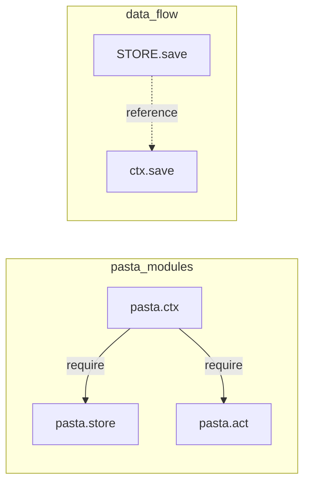
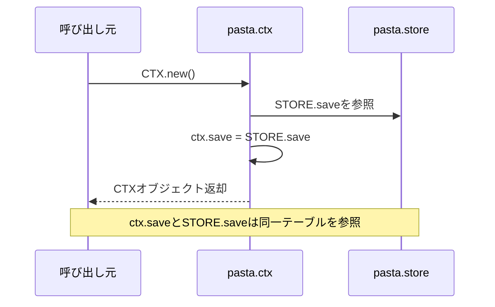

# Design Document: store-save-table

## Overview

**Purpose**: このフィーチャーは、`pasta.store`モジュールに永続変数用の`save`テーブルを追加し、`CTX.new`メソッドで自動的に`STORE.save`を環境コンテキストに注入する機能を提供する。

**Users**: シーン作成者およびランタイム開発者が、セッション間で保持される永続変数を簡潔に利用できるようになる。

**Impact**: `pasta.store`モジュールに新規フィールドを追加し、`pasta.ctx`モジュールに`pasta.store`への依存を追加する。

### Goals
- `STORE.save`テーブルによる永続変数の一元管理
- `CTX.new()`呼び出し時の`STORE.save`自動注入
- シンプルなインターフェース設計

### Non-Goals
- 永続変数のシリアライズ・デシリアライズ機能（将来のスコープ）
- saveデータの検証・スキーマ定義

## Architecture

### Existing Architecture Analysis

現在のモジュール依存関係:
```
pasta.ctx → pasta.act
pasta.store → (なし)
```

**循環参照回避パターン**: `pasta.store`は他モジュールをrequireしない中央データストアとして機能。他モジュールがSTOREをrequireする一方向依存を維持。

### Architecture Pattern & Boundary Map



**Architecture Integration**:
- Selected pattern: 中央データストアパターン（既存パターン維持）
- Domain boundaries: STOREがデータ所有、CTXが参照を保持
- Existing patterns preserved: 循環参照回避、一方向依存
- New components rationale: 新規コンポーネントなし、既存モジュールへのフィールド追加のみ
- Steering compliance: `lua-coding.md`の命名規約・モジュール構造規約に準拠

### Technology Stack

| Layer      | Choice / Version | Role in Feature    | Notes              |
| ---------- | ---------------- | ------------------ | ------------------ |
| Runtime    | Lua 5.4 (mlua)   | スクリプト実行     | 既存               |
| Data Store | pasta.store      | 永続変数の一元管理 | saveフィールド追加 |
| Context    | pasta.ctx        | セッション管理     | STORE依存追加      |

## Requirements Traceability

| Requirement | Summary                          | Components  | Interfaces    | Flows          |
| ----------- | -------------------------------- | ----------- | ------------- | -------------- |
| 1.1         | STORE.saveフィールド追加         | pasta.store | STORE.save    | -              |
| 1.2         | STORE.reset()でsaveリセット      | pasta.store | STORE.reset() | -              |
| 1.3         | @field save LuaDocアノテーション | pasta.store | -             | -              |
| 2.1         | CTX.new()でSTORE.save自動注入    | pasta.ctx   | CTX.new()     | save参照フロー |
| 2.2         | CTXがSTOREをrequire              | pasta.ctx   | -             | -              |
| 2.3         | save引数を受け付けない           | pasta.ctx   | CTX.new()     | -              |
| 3.1         | STOREのゼロ依存維持              | pasta.store | -             | -              |
| 3.2         | CTXがSTOREをrequire              | pasta.ctx   | -             | -              |

## Components and Interfaces

| Component   | Domain/Layer | Intent             | Req Coverage       | Key Dependencies     | Contracts |
| ----------- | ------------ | ------------------ | ------------------ | -------------------- | --------- |
| pasta.store | Data Store   | 永続変数の一元管理 | 1.1, 1.2, 1.3, 3.1 | なし                 | State     |
| pasta.ctx   | Context      | STORE.save参照注入 | 2.1, 2.2, 2.3, 3.2 | STORE (P0), ACT (P0) | Service   |

### Data Store Layer

#### pasta.store

| Field        | Detail                               |
| ------------ | ------------------------------------ |
| Intent       | 永続変数`save`テーブルの管理と一元化 |
| Requirements | 1.1, 1.2, 1.3, 3.1                   |

**Responsibilities & Constraints**
- `save`テーブルの所有とライフサイクル管理
- `reset()`呼び出し時の全フィールド（save含む）のリセット
- ゼロ依存の維持（他モジュールをrequireしない）

**Dependencies**
- Inbound: pasta.ctx, その他モジュール — saveデータへのアクセス (P0)
- Outbound: なし
- External: なし

**Contracts**: State [x]

##### State Management

```lua
--- @class Store
--- @field save table<string, any> 永続変数（セッションを跨いで保持）
--- @field actors table<string, Actor> アクターキャッシュ
--- @field scenes table<string, table> シーンレジストリ
--- @field counters table<string, number> シーン名カウンタ
--- @field global_words table<string, table> グローバル単語レジストリ
--- @field local_words table<string, table> ローカル単語レジストリ
--- @field actor_words table<string, table> アクター単語レジストリ

--- 永続変数（セッションを跨いで保持）
--- @type table<string, any>
STORE.save = {}

--- 全データをリセット
--- @return nil
function STORE.reset()
    STORE.save = {}
    STORE.actors = {}
    STORE.scenes = {}
    STORE.counters = {}
    STORE.global_words = {}
    STORE.local_words = {}
    STORE.actor_words = {}
end
```

- State model: グローバルシングルトン（モジュールテーブル直接管理）
- Persistence: 外部からの明示的な保存・復元に依存（本フィーチャー外）
- Concurrency strategy: シングルスレッド（Lua VM制約）

**Implementation Notes**
- Integration: 既存フィールド群と同列に`save`を追加
- Validation: なし（任意のkey-value格納を許可）
- Risks: なし

### Context Layer

#### pasta.ctx

| Field        | Detail                          |
| ------------ | ------------------------------- |
| Intent       | CTX作成時にSTORE.saveを自動注入 |
| Requirements | 2.1, 2.2, 2.3, 3.2              |

**Responsibilities & Constraints**
- `CTX.new()`で常に`STORE.save`を`ctx.save`に設定
- `save`引数を受け付けない（シンプルなインターフェース）
- `pasta.store`への依存追加

**Dependencies**
- Inbound: シーン関数、ランタイム — CTX生成 (P0)
- Outbound: pasta.store — STORE.save取得 (P0)
- Outbound: pasta.act — ACT生成 (P0)

**Contracts**: Service [x]

##### Service Interface

```lua
--- 新規CTXを作成
--- @param actors table|nil 登録アクター
--- @return CTX 環境オブジェクト
function CTX.new(actors)
    local obj = {
        save = STORE.save,
        actors = actors or {},
    }
    return setmetatable(obj, CTX_IMPL)
end
```

- Preconditions: `pasta.store`がロード済み
- Postconditions: `ctx.save`は`STORE.save`を参照
- Invariants: `ctx.save`は常に`STORE.save`と同一の参照

**Implementation Notes**
- Integration: ファイル先頭に`local STORE = require("pasta.store")`を追加
- Validation: 型チェックなし（既存パターン踏襲）
- Risks: なし

## System Flows



## Testing Strategy

### Unit Tests
- `STORE.save`の初期状態が空テーブルであることを確認
- `STORE.reset()`後に`STORE.save`が空テーブルにリセットされることを確認
- `CTX.new()`で`ctx.save`が`STORE.save`と同一参照であることを確認
- `CTX.new(actors)`で`ctx.save`が`STORE.save`を参照し、actorsが正しく設定されることを確認

### Integration Tests
- `STORE.save`に値を設定後、`CTX.new()`で作成したctxから同じ値にアクセスできることを確認
- `ctx.save`に値を設定後、`STORE.save`から同じ値にアクセスできることを確認（参照同一性）
