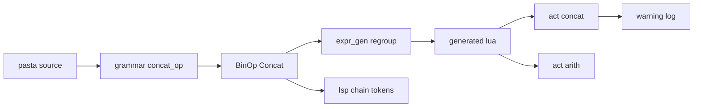
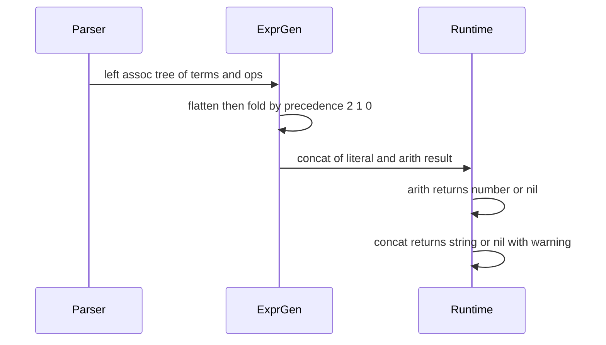

# Design Document — string-concat-operator

## Overview

**Purpose**: Pasta DSL の式に文字列の連結演算子 `＆`（半角 `&`）を加える。ゴースト作者は Lua ブロックを書かずに `＄表示＝「合計」＆＄n＆「個」` と書ける。

**Users**: 辞書（`.pasta`）を書くゴースト作者。変数代入の右辺・関数や Call の引数・動的コールのターゲットで使う。

**Impact**: 式の演算子が 1 つ増える。既存の算術の流儀（パーサは優先順位なしの左結合木を作り、コード生成が優先順位で組み直し、実行時ヘルパーが「警告＋値なし」で 500 を防ぐ）をそのまま延長する。新しい位置・新しい項の種類・新しいクレートは作らない。

### Goals
- `＆`／`&` を `BinOp` の 1 変種として加え、算術より低い優先順位で評価する（2.1）。
- 連結できる値は Lua の `..` と同じ（文字列と数値）。それ以外は「警告＋値なし」にし、生成コードに実行時エラーの経路を残さない（3.3・3.4・6.4）。
- 属性・台詞・Call 行の既存の書き方を変えず、`call-attribute-filter` が前提にできる切り分けを固定する（4.1–4.8）。
- マニュアル・スキル生成物・エディタ表示を新しい文法にそろえる（7.1–7.10）。

### Non-Goals
- `＋` の意味の変更、`＆` 以外の演算子の追加。
- 単語参照（`＠単語`）を式の項にすること。
- 値なしを空文字に読み替えるなどの独自規則。
- 動的コールのターゲットが値なしのときの nil ガード（`call-execution-correctness` の領域）。
- パーサに優先順位を持たせる文法の 2 層化。

## Boundary Commitments

### This Spec Owns
- 文法規則 `concat_op` と `BinOp::Concat`（式の演算子としての `＆`／`&`）。
- 式の二項連鎖のコード生成（算術と連結の 3 段の優先順位の組み直し）。
- 実行時ヘルパー `act:concat` の契約（名前・引数・戻り値・警告ログの文面）。
- LSP の意味トークンにおける二項連鎖の演算子の位置決め。
- 「式の中で `＆` の直後に置けるのは項の開始文字だけ（識別子は不可）」という切り分けと、その `call-attribute-filter` への申し送り。
- 上記に対応するマニュアル章・スキル `references/`・ステアリング `grammar.md` の記述。

### Out of Boundary
- `act:arith` の契約と算術の結果・警告（変えない。6.3）。
- 属性の文法と保持（`scene-attribute-store`）、属性フィルターの構文と意味論（`call-attribute-filter`）。
- `act.lua` のグループ化・`build`（`act-token-grouping-fix` が持つ）。
- Call 文のコード生成と動的コールの nil ガード（`call-execution-correctness`）。
- TextMate 文法の変更（演算子のスコープを持たないため、確認テストだけを足す）。
- `pasta_dsl` の AST の組み方（優先順位なしの左結合）の変更。

### Allowed Dependencies
- `pasta_lua::code_gen` → `pasta_dsl` の AST（読むだけ）、`StringLiteralizer`。
- 生成コード → `act:concat`・`act:arith`（act のメソッド）。`act.lua` → `@pasta_log`（既存の require のみ）。
- `pasta_lsp` → `pasta_dsl` の AST（読むだけ）。
- 新しいクレート・Lua モジュール・外部ライブラリは追加しない。
- 依存の向き: `pasta_dsl` → `pasta_lua`（code_gen）→ 生成 Lua → `act.lua`。`pasta_dsl` → `pasta_lsp`。逆向きは作らない。

### Revalidation Triggers
- `act:concat` の名前・引数・戻り値・警告文面の変更。
- `BinOp` の変種の追加・変更（`precedence`・`binary_node` の網羅 `match` を更新する）。
- 式の項（`term`）に識別子で始まるものを加える変更（4.5・4.7・4.8 の切り分けが崩れる。`call-attribute-filter` の再確認が要る）。
- `build_left_assoc_expr` の組み方の変更（コード生成の組み直しと LSP の連鎖走査が前提にする）。
- 文法の演算子文字（`add`・`sub`・`mul`・`div`・`modulo`・`amp`）の変更（LSP の演算子文字の集合を合わせる）。

## Architecture

### Existing Architecture Analysis
- **パーサ**: `expr = term ~ s ~ bin*`。優先順位を持たず、`build_left_assoc_expr` が左結合の木を作る（`test_binary_no_operator_precedence` が固定）。
- **コード生成**: `element_gen.rs` の `arith_to_string` が連鎖を平らに戻し、`＊／％` → `＋－` の 2 段で畳んで `act:arith(...)` の入れ子にする。乗除以外をすべて加減の段に入れる書き方のため、変種を足すだけでは連結が加減の段に黙って混ざる。
- **実行時**: `act:arith` は数値にできない被演算子ごとに警告して nil を返す。値も説明も nil の被演算子（内側の失敗）は黙って伝播する。
- **LSP**: 式に span が無く、テキストを走査してトークンを出す。二項演算は「頂点の演算子の文字が最初に現れる位置」で分割する（`find_binary_op`）。木は左結合で頂点は最後の演算子のため、同じ演算子が 2 回以上続く連鎖（`1＋2＋3`）は現状でも分割を誤る。文字列リテラルの中・`＄＊`・`＠＊`・`＄％` の記号も演算子と見誤る。
- **ファイルサイズ**: `element_gen.rs` は 761 行、`element_gen_tests.rs` は 769 行で、ステアリングの目安（600 行未満）を超えている。

### Architecture Pattern & Boundary Map

採用: research.md の Option C（文法・AST は最小の追加、コード生成で優先順位を持つ、式の生成を別ファイルへ切り出す）。



**Architecture Integration**:
- 既存パターンの維持: 優先順位なしの左結合木、コード生成での組み直し、存在確認付きヘルパー経由の生成コード、説明なし nil の黙った伝播。
- 新しい要素とその理由:
  - `act:concat` — Lua の素の `..` は nil・真偽値でエラーになるため必須（3.3・3.4）。
  - `expr_gen.rs` — 式の生成の切り出し先。目安を超えているファイルへさらに足さないため。
- ステアリング準拠: 「パーサは優先順位を持たない」設計、600 行の目安、マニュアルが文法の権威。

### 設計判断（結論）

| # | 論点 | 結論 | 理由 |
| - | ---- | ---- | ---- |
| D1 | 優先順位をどこで持つか | コード生成 | 既存の設計とテストの前提を崩さない。パーサ・AST の変更が変種 1 つで済む |
| D2 | 優先順位の定義の置き方 | `precedence(op)` の網羅 `match` 1 か所（乗除 2・加減 1・連結 0）と、`binary_node(op, …)` の網羅 `match` | 変種を足すとコンパイルエラーになり、黙って別の段に混ざる誤りを型で防ぐ |
| D3 | ヘルパーの形 | 二項の `act:concat(lhs, rhs, lhs_desc?, rhs_desc?)`。連鎖は入れ子 | `act:arith` と同じ形。`arith` の契約（数値を返す）を変えない。可変長にしない（警告・伝播の規則を被演算子ごとに保つ仕掛けが別に要るため） |
| D4 | マニュアルでの扱い | `lua/script-api.md` に `act:arith` と並べて載せる | act のメソッド名が増えると `＠concat（…）` の検索 3 段目と同名アクターの扱いに影響し、作者に見える。`arith` と同じ扱いが一貫する |
| D5 | 式の生成の切り出し | 機能追加の前に、`element_gen.rs` から `expr_gen.rs` へ振る舞い不変で移す | 600 行の目安。Wave 2 で `element_gen.rs` を触る並走 spec は無い。移動と機能追加を別コミットにする |
| D6 | 優先順位の回帰テスト | 「平らな Lua 式（`..` と算術）と同じ値」比較を主とし、生成コードの形の単体テストで補う | Lua の `..` は算術より低い優先順位で、期待値をそのまま Lua に計算させられる |
| D7 | LSP の演算子の位置決め | 連鎖を平らにして左から 1 回走査する方式に置き換える | 見出しの例 `「合計」＆＄n＆「個」` が現行方式では誤って着色される。`「A＆B」＆＄x` の誤分割も同じ修正で消える |
| D8 | 申し送りの置き場所 | マニュアル `call-jump.md` と `.kiro/specs/call-attribute-filter/brief.md` の Constraints | 下流 spec が要件定義で必ず読む場所 |

D5・D7 は代替案との得失があったが、設計ディスカッションで起草時の前提どおりに確定した（「Open Questions」の表に記録）。D4・D8 と警告の文面は、`act:arith` の前例と brief の指示から決まるため確定とする。

### Technology Stack

| Layer | Choice / Version | Role in Feature | Notes |
|-------|------------------|-----------------|-------|
| パーサ | pest（既存） | `concat_op` の追加 | 新しい依存なし |
| コード生成 | Rust（`pasta_lua::code_gen`） | 3 段の組み直し | 新しい依存なし |
| ランタイム | LuaJIT 2.1（mlua） | `act:concat` | `tostring` の数値表記はアクション行と同じ（`%.14g`） |
| LSP | Rust（`pasta_lsp`） | 連鎖の演算子トークン | 新しい依存なし |
| ドキュメント | mdBook・`gen-skill-refs.mjs`・`link-check.mjs` | 章の更新と生成物の再生成 | 既存の仕組みを使うだけ |

## File Structure Plan

### Directory Structure（新規）
```
crates/pasta_lua/src/code_gen/
├── expr_gen.rs            # 式の生成（element_gen.rs から移す）＋ 3 段の組み直しと連結
└── expr_gen_tests.rs      # 式の生成の単体テスト（element_gen_tests.rs の式の部分を移す）＋ 連結
crates/pasta_lua/tests/lua_specs/
└── act_concat_test.lua    # act:concat の契約のテスト
crates/pasta_lsp/tests/
└── binary_chain_token_test.rs   # 連鎖の演算子トークン（算術・連結）
```

### Modified Files
- `crates/pasta_dsl/src/parser/grammar.pest` — `concat_op = @{ amp }` を加え、`bin_op` の選択肢に足す。
- `crates/pasta_dsl/src/parser/ast/action.rs` — `BinOp::Concat`。
- `crates/pasta_dsl/src/parser/parse_action.rs` — `bin_op_from_rule` と `try_parse_expr` の演算子規則の列挙に `concat_op`。
- `crates/pasta_dsl/tests/expr_parse_test.rs` — 連結のパース・切り分け・パースエラー。
- `crates/pasta_lua/src/code_gen/element_gen.rs` — 式の生成（`generate_expr`〜`generate_args_string`、`flatten_binary`・`arith_node`・`format_args_suffix`・`global_fn_call`）を `expr_gen.rs` へ移す。両方のファイルから使う関数（`format_args_suffix`・`global_fn_call`・`expr_to_string`・`generate_args_string`・`resolve_var_path`・`dynamic_ref_args`）は `pub(super)` にする。
- `crates/pasta_lua/src/code_gen/element_gen_tests.rs` — 式のテストを `expr_gen_tests.rs` へ移す。
- `crates/pasta_lua/src/code_gen/mod.rs` — `mod expr_gen;`。
- `crates/pasta_lua/pasta_scripts/pasta/act.lua` — `ACT_IMPL.arith` の直後に `concat_operand`・`ACT_IMPL.concat`。ほかの領域は触らない。
- `crates/pasta_lua/tests/lua_specs/init.lua` — `act_concat_test` の登録。
- `crates/pasta_lua/tests/transpiler/runtime_safety_test.rs` — 連結の「平らな Lua と同じ値」比較と、失敗時の警告。
- `crates/pasta_lua/tests/transpiler/source_map_seam_test.rs` — 連結を含む行の行対応。
- `crates/pasta_shiori/tests/codegen_runtime_safety_e2e_test.rs`・`fixtures/codegen_runtime_safety/dic/runtime_safety.pasta` — 連結の失敗で 500 にならないシーン。
- `crates/pasta_lsp/src/analysis/text_utils.rs` — `find_binary_op` を連鎖の走査 `find_chain_ops` に置き換える。
- `crates/pasta_lsp/src/analysis/visit_expr.rs` — Binary アームを連鎖単位の処理にする。
- `crates/pasta_lsp/tests/diagnostics_test.rs` — `＆` を含む正しい式と誤った式の診断。
- `editors/vscode/src/test/tmGrammar.test.ts` — 式の `＆`・行頭の属性・台詞の `＆` の表示の確認。
- `book/src/grammar/{variables,markers,index,call-jump,action-line}.md`・`book/src/lua/script-api.md`・`book/src/internals/{transpiler,internal-modules}.md` — 記述の更新。
- `.claude/skills/pasta-ghost-authoring/references/*`・`.claude/skills/pasta-lua-coding/references/*` — 生成スクリプトで再生成。手書きの `SKILL.md` は演算子・連結の記述だけ直す。
- `.kiro/steering/grammar.md` — マーカー早見表の `＆` の行に式の連結演算子を併記。
- `.kiro/specs/call-attribute-filter/brief.md` — Constraints に申し送りを追記。

## System Flows

`＄表示＝「合計」＆＄a＋＄b` の流れ。



- パーサの木は `（「合計」＆＄a）＋＄b`。コード生成が平らに戻し、乗除 → 加減 → 連結の順に左から畳む。
- 内側の演算が失敗して nil を返すと、外側は説明なしの nil を受け取り、警告を足さずに nil を返す（3.5）。

## Requirements Traceability

| Requirement | Summary | Components | Interfaces | Flows |
|-------------|---------|------------|------------|-------|
| 1.1 | 2 項の連結 | ConcatGrammar・ExprGen・ConcatRuntime | `act:concat` | 上図 |
| 1.2 | 全角・半角 | ConcatGrammar | `concat_op = @{ amp }` | — |
| 1.3 | 左から順に連結 | ExprGen | 段ごとの左畳み込み | 上図 |
| 1.4 | 空白 | ConcatGrammar | 既存の `bin` の `s` | — |
| 1.5 | 被演算子は算術と同じ | ConcatGrammar | `term` を変えない | — |
| 1.6 | 位置は算術と同じ | ConcatGrammar | `bin_op` の共有（`set`・`args`・`key_expr`・`call_target_expr`） | — |
| 1.7 | 代入と表示 | ExprGen・ConcatRuntime | 既存の代入の生成 | — |
| 1.8 | 引数への受け渡し | ExprGen | `generate_args_string` | — |
| 2.1 | 算術より低い | ExprGen | `precedence` | 上図 |
| 2.2 | 算術どうしは不変 | ExprGen | `precedence`（乗除 2・加減 1） | — |
| 2.3 | 括弧 | ExprGen | `Expr::Paren` は 1 つの項 | — |
| 2.4 | 連結結果を算術へ | ConcatRuntime・`act:arith`（既存） | 文字列は `tonumber` | — |
| 3.1 | 文字列はそのまま | ConcatRuntime | `act:concat` | — |
| 3.2 | 数値の表記 | ConcatRuntime | `tostring`（アクション行と同じ） | — |
| 3.3 | 値なしは警告＋値なし | ConcatRuntime・ExprGen | 警告文面・`operand_desc` | — |
| 3.4 | 文字列・数値以外 | ConcatRuntime | 警告文面（値の種類） | — |
| 3.5 | 伝播は黙る | ConcatRuntime・ExprGen | 説明なし nil | 上図 |
| 3.6 | 代入後は未代入 | 既存（nil の代入・`act:talk`） | — | — |
| 3.7 | 区切りを入れない | ConcatRuntime | `act:concat` | — |
| 4.1 | 属性は不変 | ConcatGrammar | `attr` は `expr` を使わない（テストで固定） | — |
| 4.2 | 台詞の `＆` は文字 | ConcatGrammar | `talk_word` は不変。引数は `args` | — |
| 4.3 | 式以外の位置は不変 | ConcatGrammar | テストで固定 | — |
| 4.4 | 動的ターゲット | ConcatGrammar・ExprGen | `call_target_expr = { expr }` | — |
| 4.5 | `＞…＆k＝v` はエラー | ConcatGrammar | `＆` の後は `term` のみ | — |
| 4.6 | `＞名前＆…` はエラー | ConcatGrammar | `id` 分岐の確定 | — |
| 4.7 | `＠単語＆k＝v` はエラー | ConcatGrammar | 単語参照は項でない | — |
| 4.8 | `＆` の後は項の開始文字 | ConcatGrammar・Docs | `term` を変えない＋申し送り | — |
| 5.1 | 被演算子の欠け | ConcatGrammar | 既存のパースエラー経路 | — |
| 5.2 | 括弧の不対応 | ConcatGrammar | 同上 | — |
| 6.1 | `＆` なしの辞書は不変 | ExprGen | 切り出しは振る舞い不変・算術の生成形は不変 | — |
| 6.2 | `＠名前（…＆…）` は関数呼び出し | ConcatGrammar・Docs | `args` が成功する | — |
| 6.3 | 算術は不変 | ExprGen・`act:arith`（触らない） | — | — |
| 6.4 | SHIORI で 500 にしない | ConcatRuntime | E2E | — |
| 6.5 | 行の対応 | ExprGen | 式は 1 行の文字列として出す | — |
| 6.6 | 回帰の固定 | Tests | Testing Strategy | — |
| 6.7 | LSP の診断 | ConcatGrammar（診断はパーサの結果） | — | — |
| 7.1–7.4・7.8・7.9 | マニュアル | Docs | — | — |
| 7.5 | スキル生成物 | Docs | `gen-skill-refs.mjs`・`link-check.mjs` | — |
| 7.6 | VSCode の表示 | LspChainTokens | `OPERATOR` トークン | — |
| 7.7 | マニュアルのハイライト | Docs（確認のみ） | TextMate 文法は不変 | — |
| 7.10 | ステアリング | Docs | — | — |

## Components and Interfaces

| Component | Layer | Intent | Req Coverage | Key Dependencies | Contracts |
|-----------|-------|--------|--------------|------------------|-----------|
| ConcatGrammar | `pasta_dsl` | `＆` を式の演算子として受理 | 1.1–1.6, 4.1–4.8, 5.1, 5.2, 6.2, 6.7 | pest（P0） | — |
| ExprGen | `pasta_lua::code_gen` | 3 段の組み直しと `act:concat` の生成 | 1.3, 1.7, 1.8, 2.1–2.3, 3.3, 3.5, 6.1, 6.3, 6.5 | AST（P0） | Service |
| ConcatRuntime | `act.lua` | 連結と「警告＋値なし」 | 1.1, 2.4, 3.1–3.7, 6.4 | `@pasta_log`（P0） | Service |
| LspChainTokens | `pasta_lsp` | 連鎖の演算子トークン | 7.6 | AST（P0） | — |
| Docs | `book/`・skills・steering | 記述の更新と再生成 | 4.8, 6.2, 7.1–7.10 | 生成スクリプト（P0） | — |

### pasta_dsl

#### ConcatGrammar

| Field | Detail |
|-------|--------|
| Intent | `bin_op` に連結の規則を 1 つ足す |
| Requirements | 1.1–1.6, 4.1–4.8, 5.1, 5.2, 6.2, 6.7 |

**Responsibilities & Constraints**
- `concat_op = @{ amp }` を定義し、`bin_op` の選択肢に足す。`amp` は属性マーカーと同じ文字集合（`＆`・`&`）を共有する。
- `term`・`expr`・`bin`・`set`・`args`・`call_scene` は変えない。4.5–4.8・5.1・5.2 は、`bin = bin_op ~ s ~ term ~ s` で `＆` の後に項が無ければ `bin` が不成立になる既存の構造から導かれる。新しい規則で禁止するのではなく、テストで固定する。
- `BinOp::Concat` を加える。木の組み方は変えない（`「a」＆1＋2` は `（「a」＆1）＋2` の木になる）。

**Implementation Notes**
- Integration: `BinOp` の網羅 `match` を持つ `pasta_lua`・`pasta_lsp` が同時にコンパイルエラーになる。変種の追加と各クレートの対応は同じ変更単位にする。
- Validation: `expr_parse_test.rs` に、位置ごと（代入・式文・引数・キーワード引数・Call の引数・動的ターゲット・台詞の関数呼び出しの引数）のパースと、4.1–4.7・5.1・5.2 の例を足す。
- Risks: `＠f（＄a＆＄b）` が単語参照から関数呼び出しに変わる（6.2。意図した変更）。

### pasta_lua::code_gen

#### ExprGen

| Field | Detail |
|-------|--------|
| Intent | 式の二項連鎖を、優先順位で組み直した `act:arith`・`act:concat` の入れ子にする |
| Requirements | 1.3, 1.7, 1.8, 2.1–2.3, 3.3, 3.5, 6.1, 6.3, 6.5 |

**Responsibilities & Constraints**
- 連鎖を平らに戻し（左の背骨だけ。右辺の Binary と Paren は 1 つの項）、優先順位の高い段から順に左から畳む。
- 段の定義は `precedence` の 1 か所だけ。演算ごとの生成形は `binary_node` の 1 か所だけ。どちらも `BinOp` の網羅 `match`。
- 被演算子の説明は既存の `operand_desc` を使う（変数の経路・`@名前()`・`@*名前()`・`@$経路()`。リテラルと入れ子の演算は説明なし）。
- 算術だけの式の生成結果は 1 文字も変えない（6.1・6.3）。

##### Service Interface
```rust
/// 段の高さ。数が大きいほど先に畳む。
fn precedence(op: BinOp) -> u8; // Mul|Div|Mod => 2, Add|Sub => 1, Concat => 0

/// 1 つの演算の生成コード。結果は入れ子の演算なので説明を持たない。
fn binary_node(
    op: BinOp,
    lhs: (String, Option<String>),
    rhs: (String, Option<String>),
) -> (String, Option<String>);
```
- Postconditions: 算術は `act:arith("op", 左, 右[, 左の説明, 右の説明])`、連結は `act:concat(左, 右[, 左の説明, 右の説明])`。説明の省略規則は両者で同じ（両方なしなら省略、左だけなしなら `nil` で埋める）。
- Invariants: 同じ段の演算は左から畳む。算術だけの連鎖の出力は変更前と同じ。

生成形の例:

| DSL | 生成 Lua |
| --- | -------- |
| `＄表示＝「合計」＆＄n＆「個」` | `var.表示 = act:concat(act:concat("合計", var.n, nil, "var.n"), "個")` |
| `＄s＝「合計」＆＄a＋＄b` | `var.s = act:concat("合計", act:arith("+", var.a, var.b, "var.a", "var.b"))` |
| `＄n＝（「1」＆「2」）＋1` | `var.n = act:arith("+", (act:concat("1", "2")), 1)` |
| `＞＄種類＆「_挨拶」` | 既存の動的コールの形のターゲットに `act:concat(var.種類, "_挨拶", "var.種類")` |

**Implementation Notes**
- Integration: 先に `element_gen.rs` から `expr_gen.rs` へ式の生成を移す（振る舞い不変。既存のテストとスナップショットが緑のままであることが検証）。移動 1 回 = 検証 1 回 = コミット 1 つ。機能追加はその後の別コミット。
- Validation: `expr_gen_tests.rs` に生成形、`runtime_safety_test.rs` に「平らな Lua と同じ値」。
- Risks: 動的コールのターゲットで連結が値なしのとき、既存どおり `"nil"` を検索して「見つからない」警告になる（連結の警告と合わせて 2 行）。nil ガードは `call-execution-correctness` が持つ。

### pasta_lua ランタイム

#### ConcatRuntime

| Field | Detail |
|-------|--------|
| Intent | 文字列・数値を連結し、それ以外は警告して nil を返す |
| Requirements | 1.1, 2.4, 3.1–3.7, 6.4 |

**Responsibilities & Constraints**
- act の状態を読み書きしない。エラーを投げない。
- `__concat`・`__tostring` などのメタメソッドを呼ばない（文字列と数値だけを連結するため届かない）。

##### Service Interface
```lua
--- @param lhs any
--- @param rhs any
--- @param lhs_desc string|nil 警告用の説明（"var.x"・"@f()" など）
--- @param rhs_desc string|nil
--- @return string|nil
act:concat(lhs, rhs, lhs_desc, rhs_desc)
```

| 被演算子の値 | 扱い |
| ------------ | ---- |
| 文字列 | そのまま |
| 数値 | `tostring` した文字列（アクション行の表示と同じ表記） |
| nil で説明も nil | 警告なしで結果は nil（内側の失敗の伝播） |
| 上記以外（説明つきの nil・真偽値・テーブル・関数など） | 警告を 1 行出し、結果は nil |

- Postconditions: 両方が文字列か数値なら、左の文字列表現の直後に右の文字列表現をつないだ文字列を返す（区切りを入れない）。どちらかがそうでなければ nil。両方が不正なら警告は 2 行（被演算子ごと。`act:arith` と同じ）。
- 警告文面: `act:concat - operand is not a string or number: op='&', operand='var.x', value=nil`。`operand=` は説明があるときだけ。`value=` は `act:arith` と同じ表記（`nil`・`true (boolean)`・`(table)`）で、既存の `arith_value_text` を使う。`op` は書いた文字（全角・半角）によらず `&`。

**Implementation Notes**
- Integration: `ACT_IMPL.arith` の直後に置く。`act-token-grouping-fix` と同じファイルを触るため、ほかの領域には触れない。
- Validation: `act_concat_test.lua`（値ごとの表・警告文面・伝播・`-0`・`inf`・`nan`・指数表記がアクション行の `tostring` と一致すること）。
- Risks: `concat` が act のメソッド名になり、`＠concat（…）` の検索 3 段目と、同名アクターの `act.concat` に影響する（`arith` と同じ制限。マニュアルに書く）。

### pasta_lsp

#### LspChainTokens

| Field | Detail |
|-------|--------|
| Intent | 二項連鎖の演算子と項に、正しい位置の意味トークンを出す |
| Requirements | 7.6 |

**Responsibilities & Constraints**
- 連鎖を平らにし（項 n+1 個・演算子 n 個）、式のテキストを左から 1 回走査して演算子の位置を n 個見つける。i 番目の位置が i 番目の演算子で、あいだの区間が各項のテキストになる。
- 演算子とみなす文字は、次のすべてを満たすもの: 括弧の深さ 0、文字列リテラル（`「…」`・`"…"`）の外、項の先頭でない（負号 `－1` を除く）、`＄`・`＠` の直後でない（`＄＊`・`＠＊`・`＄％` を除く）。
- 演算子の文字の集合は文法（`add`・`sub`・`mul`・`div`・`modulo`・`amp`）と同じにする。
- 見つかった数が n と合わないときは、現行と同じく式全体を 1 トークンで出す（落ちない）。
- 演算子のトークン種別は `OPERATOR` のまま。属性の `DECORATOR` は AST の属性からだけ出すので、式の `＆` が属性として着色されることはない。

**Implementation Notes**
- Integration: 連結を足す前に、算術の連鎖に対してこの置き換えを行う（既存のトークンのテストが緑のまま＋ `1＋2＋3` の新しいテスト）。その後に `＆` の文字を足す。
- Validation: `binary_chain_token_test.rs`（`「合計」＆＄n＆「個」`・`「A＆B」＆＄x`・`＄＊g＊2`・`1－－2`・`（1＋2）＆「x」`）。
- Risks: 既存の算術の表示が変わる（誤りが直る方向）。範囲を広げすぎないよう、Binary アームと `find_binary_op` の置き換えだけに限る。

### Docs

| 対象 | 変更 | Req |
| ---- | ---- | --- |
| `grammar/variables.md` | 「連結する演算子は無い」を改める。式の表・優先順位・括弧・値ごとの扱い・Lua 展開の表 | 7.1 |
| `grammar/markers.md`・`grammar/index.md` | 演算子の表に `＆`／`&`。属性マーカーとの違い（書く位置で決まる・台詞では文字） | 7.2 |
| `grammar/call-jump.md` | 動的ターゲットの `＆`、4.5・4.6 がパースエラーであること | 7.3, 4.8 |
| `grammar/action-line.md` | 台詞の `＆` は文字、関数呼び出しの引数では連結（6.2 で変わる書き方） | 7.9, 6.2 |
| `lua/script-api.md`・`internals/transpiler.md`・`internals/internal-modules.md` | `act:concat` の API と生成形 | 7.4 |
| スキル `references/` | `node book/tools/gen-skill-refs.mjs` で再生成し、`--check` と `link-check.mjs` を通す。手書き `SKILL.md` を確認 | 7.5 |
| `.kiro/steering/grammar.md` | 早見表の `＆` の行に連結演算子を併記 | 7.10 |
| `.kiro/specs/call-attribute-filter/brief.md` | 申し送り: 「式の `＆` の後は項の開始文字（`＄`・`＠`・数字・`－`・文字列の開き・括弧の開き）だけ。フィルターのキーは識別子で始めること。`＞＄名前＆k＝v`・`＞シーン名＆k＝v`・`＄x＝＠単語＆k＝v` は本仕様の後もパースエラー」 | 4.8 |

- コード例は読み込める例にし、パースエラーの例はそう明記する（7.8）。既存の `book/tools` の検証（`verify-content.mjs` ほか）を通す。
- 書けない形の「代わりの書き方」は、要件が挙げた `＞「挨拶」＆＄種類` 以外は個別に載せない。
- マニュアルのハイライトと TextMate 文法は変更しない。`tmGrammar.test.ts` に確認を足す（7.7）。

## Error Handling

| 事象 | 検出 | 応答 |
| ---- | ---- | ---- |
| 被演算子の欠け・括弧の不対応（5.1・5.2） | 辞書の読み込み（パーサ） | 既存のパースエラー（行の位置つき）。LSP の診断も同じ |
| `＆` の後が識別子（4.5–4.7） | 同上 | 同上 |
| 値なし・文字列と数値以外の被演算子（3.3・3.4） | 実行時（`act:concat`） | 警告 1 行＋結果 nil。イベントは続く |
| 内側の演算の失敗（3.5） | 実行時 | 外側は警告なしで nil |

生成コードに `..` を直接出さないため、連結に由来する Lua の実行時エラーの経路は無い（6.4）。

## Testing Strategy

### パーサ（`expr_parse_test.rs`）
- 全角・半角の `＆` が同じ `BinOp::Concat` の木になる。空白の有無で木が変わらない（1.1・1.2・1.4）。
- 位置ごとに受理する: 代入（ローカル・グローバル・プロパティ）・式文・位置引数・キーワード引数・Call の引数・動的ターゲット・台詞の `＠f（…＆…）`・`＠＊f（…）`・`＠＄f（…）`（1.5・1.6・4.4・6.2）。
- 変わらないこと: 行頭の属性・シーン宣言行の属性・台詞の `＄a＆＄b`・文字列リテラルの中・単語定義・選択肢行・キューコマンド行・コメント（4.1–4.3）。
- パースエラー: `＞＄名前＆k＝v`・`＞シーン名＆k＝v`・`＞挨拶＆＄種類`・`＄x＝＠単語名＆category＝food`・`「a」＆`・`＆「a」`・`「a」＆＆「b」`・括弧の不対応（4.5–4.8・5.1・5.2）。

### コード生成（`expr_gen_tests.rs`・`runtime_safety_test.rs`・`source_map_seam_test.rs`）
- 生成形: 上の表の 4 例と、説明の付き方（`nil` 埋め・括弧つき変数・入れ子は説明なし）（1.3・2.1–2.3・3.3）。
- 平らな Lua と同じ値: `「x」＆1＋2＊3`（`"x" .. 1 + 2 * 3`）・`1＋2＆3＊4`・`（「1」＆「2」）＋1`・`「a」＆「b」＆「c」`・`7／2` の表記などを、既存の `ARITH_CASES` と同じ仕組みで比較する。既存の算術の比較は変えずに通す（2.1–2.4・6.3）。
- 算術だけの式の生成結果と既存スナップショットが変わらない（6.1）。
- 連結を含む行の行対応が算術の行と同じ（6.5）。

### ランタイム（`act_concat_test.lua`）
- 値ごとの表（文字列・空文字・`「01」`・整数・小数・指数表記・`inf`）と、アクション行の `tostring` との一致（3.1・3.2・3.7）。
- 説明つきの nil・真偽値・テーブルで nil と警告文面（3.3・3.4）。両方不正なら 2 行。
- 伝播: 内側の `act:arith`・`act:concat` の失敗で、外側は警告を足さない。両方向（連結の中の算術・算術の中の連結）（3.5）。
- nil を代入した変数が未代入になり、アクション行で空文字＋警告になる（3.6）。

### SHIORI 経由（`codegen_runtime_safety_e2e_test.rs`）
- 未代入の変数を連結するシーンのイベントが、500 でなく通常の応答を返す（6.4）。

### LSP・エディタ
- `binary_chain_token_test.rs`: 連鎖の演算子が `OPERATOR` で正しい位置に出る（7.6）。
- `diagnostics_test.rs`: 正しい式は診断なし、5.1 の誤りは診断あり（6.7）。
- `tmGrammar.test.ts`: 式の行の `＆` が `＋` と同じスコープ、行頭の属性と台詞は不変（7.6・7.7）。

### ドキュメント
- `gen-skill-refs.mjs --check`・`link-check.mjs`・`book/tools` の既存の検証が成功する（7.5・7.8）。

## Migration Strategy

実装の順序（各段は単独で緑になる）:

1. 式の生成を `expr_gen.rs` へ移す（振る舞い不変。コミットを分ける）。
2. LSP の連鎖の走査を算術に対して置き換える（連結はまだ無い）。
3. `act:concat` と Lua のテスト（生成コードからはまだ呼ばれない）。
4. `concat_op`・`BinOp::Concat`・コード生成の 3 段化・LSP の演算子文字（コンパイル単位として同時）。
5. E2E・TextMate の確認テスト。
6. マニュアル・スキル生成物・ステアリング・申し送り。

1 と 2 は機能追加から独立しており、取り消しても 3 以降に影響しない形にする（1 を取り消す場合は 4 を `element_gen.rs` へ書く）。

## Open Questions（設計ディスカッションへの申し送り）

すべて確定済み。未決事項は残っていない。

| ID | 対象の節 | 起草時の前提 | 代替案 |
| -- | -------- | ------------ | ------ |
| DQ-1（**確定**: 起草時の前提どおり先に切り出す。設計ディスカッション議題 1。Wave 2 は本 spec が `element_gen.rs` の持ち主で衝突が無く、移動だけの独立コミットで取り消せる） | File Structure Plan・Migration 1・D5 | 機能追加の前に式の生成を `expr_gen.rs` へ切り出す | (B) `element_gen.rs` にそのまま足す（差分は最小。761 行がさらに 40 行ほど増える）。(C) 切り出しを別 spec にする |
| DQ-2（**確定**: 起草時の前提どおり連鎖の走査に置き換える。設計ディスカッション議題 2。代表例 `「合計」＆＄n＆「個」` が正しく表示されることを 7.6 の達成条件とし、連結を足す前に算術だけで置き換えて固定する） | LspChainTokens・D7 | LSP の連鎖の位置決めを置き換える（既存の算術の誤りも直る） | (B) `BinOp` の `match` に `＆` を 1 行足すだけ（`＆` は `＋` と同じ誤りを持つ。3 項以上の連結と `「A＆B」` で着色を誤る）。(C) 文字列リテラルを飛ばす修正だけ |
| DQ-3（**確定**: 起草時の前提どおり。`act:arith` と同じ扱い。リポジトリ内の辞書・スクリプトに `concat` という名前の関数・アクターは無い） | ConcatRuntime・Docs・D4 | ヘルパー名は `concat`。`script-api.md` に `act:arith` と並べて載せる | (B) 内部設計の章だけに載せる（`＠concat` の検索への影響は別に注記が要る）。名前の代替: `join` など |
| DQ-4（**確定**: 起草時の前提どおり。brief が「`call-attribute-filter` へ申し送る」と指示しており、下流が要件定義で必ず読む場所に置く） | Docs・D8 | 申し送りを `.kiro/specs/call-attribute-filter/brief.md` の Constraints に追記する（他 spec のファイルを編集する） | (B) マニュアル `call-jump.md` と本 spec の design だけに書き、下流の要件定義で拾う |
| DQ-5（**確定**: 起草時の前提どおり。`act:arith` の警告が生成コードの半角の演算子を出しているのと同じ） | ConcatRuntime | 警告の `op` は常に半角 `&`。文面は `operand is not a string or number` | (B) 書いた文字（全角 `＆`）を出す。文面の言い回しの変更 |
