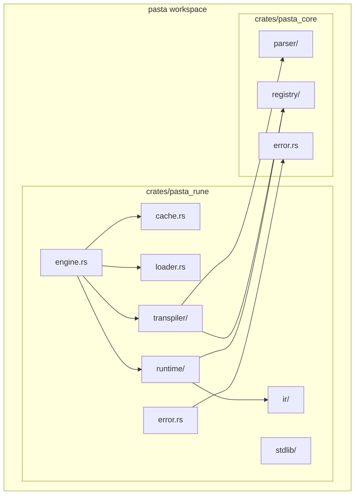
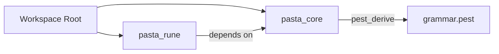
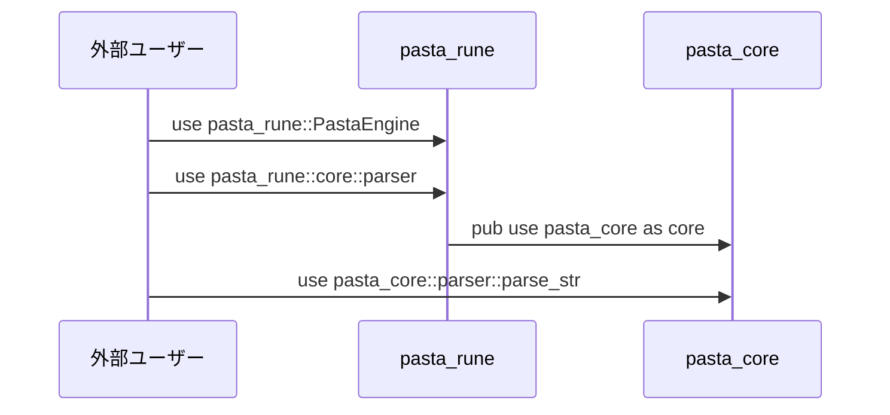
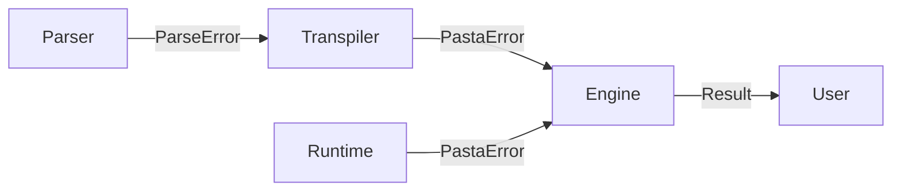

# Design Document: workspace-migration

## Overview

**Purpose**: 本設計書は、pastaプロジェクトを単一クレート構成からCargoワークスペース＋2クレート構成に移行するためのアーキテクチャと実装詳細を定義します。

**Users**: pastaを利用するRust開発者、およびプロジェクトの保守・拡張を行う開発者がこの構成を使用します。

**Impact**: 既存の単一`pasta`クレートを`pasta_core`（言語非依存層）と`pasta_rune`（Rune言語層）に分離し、将来的な言語バックエンド切り替え（Lua等）を可能にします。

### Goals
- Cargoワークスペースによる複数クレート統合管理
- 言語非依存層（parser, registry）とRune言語層の責任分離
- 28個の既存テストの継続的実行保証
- 依存関係バージョンの一元管理

### Non-Goals
- 既存APIの機能変更・拡張
- 後方互換性レイヤー（未公開プロジェクトのため不要）
- 新規機能の追加

## Architecture

### Architecture Pattern & Boundary Map

本設計は**レイヤードアーキテクチャ + ワークスペース分離**パターンを採用します。



**Architecture Integration**:
- **Selected pattern**: レイヤードアーキテクチャ（言語非依存層→言語依存層）
- **Domain boundaries**: pasta_core（DSL文法・共有型） vs pasta_rune（トランスパイル・実行）
- **Existing patterns preserved**: モジュール公開パターン、エラー型統合
- **New components rationale**: クレート境界による責任分離
- **Steering compliance**: 2パス変換、Yield型エンジン、UI独立性原則を維持

### Technology Stack

| Layer | Choice / Version | Role in Feature | Notes |
|-------|------------------|-----------------|-------|
| Language | Rust 2024 edition | 両クレート共通 | `[workspace.package]`で統一 |
| Parser | pest 2.8, pest_derive 2.8 | pasta_core | grammar.pest解析 |
| Error | thiserror 2 | 両クレート | ParseError, PastaError定義 |
| Data Structure | fast_radix_trie 1.1.0 | pasta_core | 前方一致単語・シーン検索 |
| Random | rand 0.9 | pasta_core | DefaultRandomSelector実装（言語非依存） |
| Logging | tracing 0.1 | 両クレート共通 | システム全体の統一ロギング |
| Runtime | rune 0.14 | pasta_rune | Rune VM実行 |
| Utilities | glob 0.3, futures 0.3, toml 0.9.8 | pasta_rune のみ | ファイル読み込み・非同期・設定 |

## System Flows

### ビルド依存関係フロー



### インポート解決フロー



## Requirements Traceability

| Requirement | Summary | Components | Interfaces | Flows |
|-------------|---------|------------|------------|-------|
| 1.1, 1.2, 1.3, 1.4 | Cargoワークスペース導入 | RootCargoToml | workspace, workspace.dependencies | Build |
| 2.1, 2.2, 2.3, 2.4, 2.5 | pasta_core分離 | PastaCoreLib, Parser, Registry, CoreError | pub mod API | Import |
| 3.1, 3.2, 3.3, 3.4, 3.5 | pasta_rune分離 | PastaRuneLib, Engine, Transpiler, Runtime | pub use API | Import, Build |
| 4.1, 4.2, 4.3, 4.4 | ルートCargo.toml構成 | RootCargoToml | workspace.dependencies | Build |
| 5.1, 5.2, 5.3, 5.4, 5.5, 5.6 | ディレクトリ移行 | FileSystem | なし | Migration |
| 6.1, 6.2, 6.3, 6.4, 6.5, 6.6 | テスト継続性 | TestSuite, TestCommon | fixtures_path() | Test |
| 7.1, 7.2, 7.3, 7.4 | ビルド互換性 | CargoWorkspace | cargo build/test | Build |
| 8.1, 8.2, 8.3, 8.4 | ドキュメント更新 | Docs | なし | Documentation |
| 9.1, 9.2, 9.3, 9.4, 9.5 | 公開API境界 | PastaCoreLib, PastaRuneLib | pub mod, pub use | API |

## Components and Interfaces

### Component Summary

| Component | Domain/Layer | Intent | Req Coverage | Key Dependencies | Contracts |
|-----------|--------------|--------|--------------|------------------|-----------|
| RootCargoToml | Workspace | ワークスペース定義・依存管理 | 1, 4 | なし | Config |
| PastaCoreLib | Core | パーサー・レジストリ公開API | 2, 9 | pest, pest_derive, thiserror, fast_radix_trie, tracing | API |
| PastaRuneLib | Rune | エンジン・ランタイム公開API | 3, 9 | pasta_core, rune, 他 | API |
| Parser | Core | DSL→AST変換 | 2.2 | pest | Service |
| Registry | Core | シーン・単語登録・検索テーブル | 2.2 | fast_radix_trie, RandomSelector (P0) | Service |
| CoreError | Core | ParseError定義 | 2.2, 2.4 | thiserror | Type |
| RandomSelector | Core | ランダム選択の抽象インターフェース | 2.2 | なし | Trait |
| Engine | Rune | 統合API層 | 3.2 | Transpiler, Runtime (P0) | Service |
| Transpiler | Rune | AST→Runeコード変換 | 3.2 | Parser, Registry (P0) | Service |
| Runtime | Rune | Rune VM実行 | 3.2 | Registry, IR (P0) | Service |
| RuneError | Rune | PastaError定義 | 3.2 | CoreError (P1) | Type |
| TestCommon | Test | フィクスチャパス解決 | 6.5, 6.6 | なし | Utility |

### Workspace Configuration

#### RootCargoToml

| Field | Detail |
|-------|--------|
| Intent | ワークスペース全体の構成管理と依存関係バージョン統一 |
| Requirements | 1.1, 1.2, 1.3, 1.4, 4.1, 4.2, 4.3, 4.4 |

**Responsibilities & Constraints**
- ワークスペースメンバーの定義（`members = ["crates/*"]`）
- 共通依存関係バージョンの一元管理
- 共通パッケージメタデータの定義

**Contracts**: Config

##### Configuration Structure

```toml
[workspace]
members = ["crates/*"]
resolver = "2"

[workspace.package]
edition = "2024"
authors = ["Dot-Station Master <dot.station@gmail.com>"]
license = "MIT OR Apache-2.0"

[workspace.dependencies]
# pasta_core dependencies
pest = "2.8"
pest_derive = { version = "2.8", features = ["grammar-extras"] }
thiserror = "2"

# pasta_rune dependencies
rune = "0.14"
glob = "0.3"
tracing = "0.1"
rand = "0.9"
futures = "0.3"
toml = "0.9.8"
fast_radix_trie = "1.1.0"

# Development dependencies
tempfile = "3"

# Internal dependencies
pasta_core = { path = "crates/pasta_core" }
```

**Implementation Notes**
- `[package]`セクションは削除し、ワークスペース専用構成に
- 各クレートは`dependency.workspace = true`で参照

---

### Core Layer

#### PastaCoreLib

| Field | Detail |
|-------|--------|
| Intent | 言語非依存層の公開API提供（parser, registry, error） |
| Requirements | 2.1, 2.4, 9.1 |

**Responsibilities & Constraints**
- Pasta DSL文法の解析機能提供
- シーン・単語レジストリ型の定義
- パース関連エラー型の定義
- Rune言語への依存なし（言語非依存性保証）

**Dependencies**
- External: pest, pest_derive — PEG文法解析（P0）
- External: thiserror — エラー型マクロ（P0）

**Contracts**: API

##### Crate Configuration

```toml
# crates/pasta_core/Cargo.toml
[package]
name = "pasta_core"
version = "0.1.0"
edition.workspace = true
authors.workspace = true
license.workspace = true
publish = true

[dependencies]
pest.workspace = true
pest_derive.workspace = true
thiserror.workspace = true
fast_radix_trie.workspace = true
rand.workspace = true
tracing.workspace = true
```

##### Module Structure

```rust
// crates/pasta_core/src/lib.rs
//! Pasta Core - Language-independent DSL parsing and registry layer.

pub mod error;
pub mod parser;
pub mod registry;

// Convenience re-exports
pub use error::{ParseError, ParseErrorInfo, ParseResult};
pub use parser::{parse_file, parse_str, PastaFile};
pub use registry::{SceneEntry, SceneRegistry, WordDefRegistry, WordEntry};
```

**Implementation Notes**
- grammar.pestは`parser/`ディレクトリ内に配置
- `pub(crate)`で内部実装を隠蔽

---

#### Parser

| Field | Detail |
|-------|--------|
| Intent | Pasta DSL文法のPEG解析とAST生成 |
| Requirements | 2.2 |

**Responsibilities & Constraints**
- grammar.pestに基づくDSL解析
- AST型（Statement, Expr, LabelDef等）の定義
- ファイル・文字列からの解析API提供

**Dependencies**
- Inbound: PastaCoreLib — 公開API（P0）
- External: pest, pest_derive — 文法解析（P0）

**Contracts**: Service

##### Service Interface

```rust
// crates/pasta_core/src/parser/mod.rs
/// Parse Pasta source code from string.
pub fn parse_str(source: &str, filename: &str) -> ParseResult<PastaFile>;

/// Parse Pasta source code from file.
pub fn parse_file(path: &Path) -> ParseResult<PastaFile>;
```

- Preconditions: 有効なUTF-8ソースコード
- Postconditions: 成功時はAST、失敗時はParseError
- Invariants: grammar.pest仕様に準拠

---

#### Registry

| Field | Detail |
|-------|--------|
| Intent | シーン・単語定義および検索テーブルの共有型管理（Pass 1登録 + ランタイム検索） |
| Requirements | 2.2 |

**Responsibilities & Constraints**
- SceneRegistry/WordDefRegistry: Pass 1時の登録機能
- SceneTable/WordTable: ランタイム検索テーブル（前方一致・シャッフル）
- RandomSelector: ランダム選択の抽象インターフェース（trait）
- AST型への非依存（文字列ベース）
- Rune非依存（ランダム選択はtraitで抽象化）

**Dependencies**
- Inbound: PastaCoreLib — 公開API（P0）
- Inbound: Transpiler, Runtime — 共有型使用（P0）

**Contracts**: Service

##### Service Interfaces

```rust
// crates/pasta_core/src/registry/mod.rs

// Pass 1: Scene/Word registration
pub use scene_registry::{SceneEntry, SceneRegistry};
pub use word_registry::{WordDefRegistry, WordEntry};

// Runtime: Lookup tables
pub use scene_table::SceneTable;
pub use word_table::WordTable;

// Random selection (language-agnostic)
pub use random::{RandomSelector, DefaultRandomSelector, MockRandomSelector};
```

**Pass 1 APIs** (Transpiler):  
SceneRegistry, WordDefRegistry — AST処理時のエントリー登録

**Runtime APIs** (Engine, Runtime):  
SceneTable, WordTable — ランタイム検索テーブル（前方一致・シャッフル）

**Random Selection** (Language-agnostic):  
- RandomSelector — ランダム選択の抽象trait
- DefaultRandomSelector — 標準実装（rand使用、あらゆる言語で再利用可能）
- MockRandomSelector — テスト用実装

---

#### CoreError

| Field | Detail |
|-------|--------|
| Intent | パース関連エラー型の定義 |
| Requirements | 2.2, 2.4 |

**Responsibilities & Constraints**
- ParseError: ファイル位置情報付きパースエラー
- ParseErrorInfo: エラー詳細情報
- ParseResult: Result型エイリアス

**Contracts**: Type

##### Type Definition

```rust
// crates/pasta_core/src/error.rs
use thiserror::Error;

pub type ParseResult<T> = std::result::Result<T, ParseError>;

#[derive(Error, Debug, Clone)]
pub enum ParseError {
    #[error("Parse error at {file}:{line}:{column}: {message}")]
    SyntaxError {
        file: String,
        line: usize,
        column: usize,
        message: String,
    },
    
    #[error("Pest parse error: {0}")]
    PestError(String),
    
    #[error("IO error: {0}")]
    IoError(String),
    
    #[error("Multiple parse errors ({} errors)", .errors.len())]
    MultipleErrors { errors: Vec<ParseErrorInfo> },
}

#[derive(Debug, Clone, PartialEq)]
pub struct ParseErrorInfo {
    pub file: String,
    pub line: usize,
    pub column: usize,
    pub message: String,
}
```

---

### Rune Layer

#### PastaRuneLib

| Field | Detail |
|-------|--------|
| Intent | Rune言語層の公開API提供（engine, transpiler, runtime, ir） |
| Requirements | 3.1, 3.4, 9.2 |

**Responsibilities & Constraints**
- PastaEngine統合API公開
- pasta_coreへの間接公開（`pub use pasta_core as core`）
- Rune VM実行・コード生成

**Dependencies**
- Outbound: pasta_core — AST・Registry使用（P0）
- External: rune — VM実行（P0）
- External: thiserror, glob, tracing, rand, futures, toml, fast_radix_trie — ユーティリティ（P1）

**Contracts**: API

##### Crate Configuration

```toml
# crates/pasta_rune/Cargo.toml
[package]
name = "pasta_rune"
version = "0.1.0"
edition.workspace = true
authors.workspace = true
license.workspace = true
publish = true

[dependencies]
pasta_core.workspace = true
rune.workspace = true
thiserror.workspace = true
glob.workspace = true
tracing.workspace = true
rand.workspace = true
futures.workspace = true
toml.workspace = true
fast_radix_trie.workspace = true

[dev-dependencies]
tempfile.workspace = true
```

##### Module Structure

```rust
// crates/pasta_rune/src/lib.rs
//! Pasta Rune - Script engine with Rune language backend.

pub mod cache;
pub mod engine;
pub mod error;
pub mod ir;
mod loader;
pub mod runtime;
pub mod stdlib;
pub mod transpiler;

// Re-export pasta_core as core
pub use pasta_core as core;

// Convenience re-exports
pub use cache::ParseCache;
pub use engine::PastaEngine;
pub use error::{PastaError, Result};
pub use ir::{ContentPart, ScriptEvent};
pub use loader::{DirectoryLoader, LoadedFiles};
pub use runtime::{
    DefaultRandomSelector, RandomSelector, SceneTable, ScriptGenerator,
    ScriptGeneratorState, VariableManager, VariableScope, VariableValue,
};
```

**Implementation Notes**
- `pub use pasta_core as core;`により外部から`pasta_rune::core::parser`、`pasta_rune::core::registry`でアクセス可能
- RandomSelector, DefaultRandomSelector, SceneTable, WordTableは pasta_coreに配置され、`pasta_rune::core::registry`で参照
- loaderは内部モジュール（`mod loader`）として非公開

---

#### RuneError

| Field | Detail |
|-------|--------|
| Intent | Rune実行時エラー型の統合定義 |
| Requirements | 3.2 |

**Responsibilities & Constraints**
- PastaError: 全実行時エラーの統合型
- ParseErrorからの変換実装
- Rune VM, ファイルシステム, ビジネスロジックエラー統合

**Dependencies**
- Inbound: Engine, Transpiler, Runtime — エラー報告（P0）
- Outbound: CoreError — ParseError変換（P1）
- External: rune — VmError（P0）

**Contracts**: Type

##### Type Definition

```rust
// crates/pasta_rune/src/error.rs
use thiserror::Error;
use pasta_core::error::ParseError;

pub type Result<T> = std::result::Result<T, PastaError>;

#[derive(Error, Debug)]
pub enum PastaError {
    #[error(transparent)]
    Parse(#[from] ParseError),
    
    #[error("Scene not found: {scene}")]
    SceneNotFound { scene: String },
    
    #[error("Rune compilation error: {0}")]
    RuneCompileError(String),
    
    #[error("Rune VM error: {0}")]
    VmError(#[from] rune::runtime::VmError),
    
    #[error("IO error: {0}")]
    IoError(#[from] std::io::Error),
    
    // ... 他のエラーバリアント
}
```

**Implementation Notes**
- `#[from] ParseError`でpasta_core::ParseErrorから自動変換
- 既存PastaErrorのバリアントを維持

---

### Test Infrastructure

#### TestCommon

| Field | Detail |
|-------|--------|
| Intent | テスト共通ユーティリティ（フィクスチャパス解決） |
| Requirements | 6.5, 6.6 |

**Responsibilities & Constraints**
- ワークスペースレベル`/tests/fixtures/`へのパス解決
- 両クレートのテストから共有可能な関数提供

**Contracts**: Utility

##### Utility Functions

```rust
// tests/common/mod.rs
use std::path::PathBuf;

/// Get the path to the test fixtures directory.
pub fn fixtures_path() -> PathBuf {
    let workspace_root = std::env::var("CARGO_MANIFEST_DIR")
        .map(PathBuf::from)
        .unwrap_or_else(|_| PathBuf::from("."));
    
    // Navigate to workspace root from crate directory
    let root = if workspace_root.ends_with("pasta_core") 
        || workspace_root.ends_with("pasta_rune") {
        workspace_root.parent().unwrap().parent().unwrap().to_path_buf()
    } else {
        workspace_root
    };
    
    root.join("tests").join("fixtures")
}

/// Get path to a specific fixture file.
pub fn fixture(name: &str) -> PathBuf {
    fixtures_path().join(name)
}
```

---

## Data Models

### Directory Structure Model

移行後のディレクトリ構造を以下に定義します。

```
pasta/                          # Workspace root
├── Cargo.toml                  # Workspace configuration
├── crates/
│   ├── pasta_core/
│   │   ├── Cargo.toml
│   │   └── src/
│   │       ├── lib.rs
│   │       ├── error.rs
│   │       ├── parser/
│   │       │   ├── mod.rs
│   │       │   ├── ast.rs
│   │       │   └── grammar.pest
│   │       └── registry/
│   │           ├── mod.rs
│   │           ├── scene_registry.rs
│   │           ├── scene_table.rs      ★ ランタイム検索
│   │           ├── word_registry.rs
│   │           ├── word_table.rs       ★ ランタイム検索
│   │           └── random.rs           ★ RandomSelector trait + DefaultRandomSelector
│   └── pasta_rune/
│       ├── Cargo.toml
│       └── src/
│           ├── lib.rs
│           ├── error.rs
│           ├── engine.rs
│           ├── cache.rs
│           ├── loader.rs
│           ├── ir/
│           │   └── mod.rs
│           ├── transpiler/
│           │   ├── mod.rs
│           │   ├── code_generator.rs
│           │   ├── context.rs
│           │   └── error.rs
│           ├── runtime/
│           │   ├── mod.rs
│           │   ├── generator.rs
│           │   ├── variables.rs
│           │   └── ...
│           ├── stdlib/
│           │   ├── mod.rs
│           │   └── persistence.rs
│           └── examples/
│               └── ...
├── tests/
│   ├── common/
│   │   └── mod.rs              # Shared test utilities
│   └── fixtures/               # Shared test fixtures
│       └── *.pasta
├── README.md
├── GRAMMAR.md
├── SPECIFICATION.md
└── LICENSE
```

### File Migration Map

| Source | Destination | Notes |
|--------|-------------|-------|
| `src/parser/` | `crates/pasta_core/src/parser/` | 3ファイル移動 |
| `src/registry/` | `crates/pasta_core/src/registry/` | 3ファイル移動 |
| `src/runtime/words.rs` | `crates/pasta_core/src/registry/word_table.rs` | WordTable（registry層） |
| `src/runtime/scene.rs` | `crates/pasta_core/src/registry/scene_table.rs` | SceneTable（registry層） |
| `src/runtime/random.rs` | `crates/pasta_core/src/registry/random.rs` | RandomSelector + DefaultRandomSelector（言語非依存） |
| `src/error.rs` (ParseError部分) | `crates/pasta_core/src/error.rs` | 新規作成（抽出） |
| `src/transpiler/` | `crates/pasta_rune/src/transpiler/` | 4ファイル移動（code_generator, context, error, mod） |
| `src/runtime/` (Rune実装層) | `crates/pasta_rune/src/runtime/` | generator.rs, variables.rs, 他Rune固有実装 ⚠️ **scene.rs, words.rs, random.rs を除外** |
| `src/stdlib/` | `crates/pasta_rune/src/stdlib/` | 2ファイル移動 |
| `src/engine.rs` | `crates/pasta_rune/src/engine.rs` | 移動 |
| `src/cache.rs` | `crates/pasta_rune/src/cache.rs` | 移動 |
| `src/loader.rs` | `crates/pasta_rune/src/loader.rs` | 移動 |
| `src/error.rs` (PastaError部分) | `crates/pasta_rune/src/error.rs` | 移動・修正（ParseError を include） |
| `src/ir/` | `crates/pasta_rune/src/ir/` | 移動 |
| `examples/` | `crates/pasta_rune/examples/` | 移動 |
| `tests/fixtures/` | `tests/fixtures/` | 維持（移動なし） |

## Error Handling

### Error Strategy

**pasta_core**:
- ParseError: 構文エラー、ファイルI/Oエラー
- 位置情報（file, line, column）を含む詳細なエラー報告

**pasta_rune**:
- PastaError: ParseErrorを含む全実行時エラー
- `#[from]`トレイトによる自動変換

### Error Flow



## Testing Strategy

### Unit Tests
- **pasta_core::parser**: parse_str, parse_file, AST構造検証
- **pasta_core::registry**: SceneRegistry登録・検索、WordDefRegistry操作
- **pasta_core::error**: ParseError生成・表示

### Integration Tests
- **pasta_rune transpiler**: AST→Runeコード変換、2パス処理
- **pasta_rune runtime**: Rune VM実行、Generator継続
- **pasta_rune engine**: 統合フロー（parse→transpile→execute）

### E2E Tests
- **フルパイプライン**: `.pasta`ファイル読み込み→ScriptEvent出力
- **既存28テストファイル**: インポートパス修正後の全テスト成功

### Test Migration

| Test Category | Current Location | Post-Migration | Import Changes |
|---------------|------------------|----------------|----------------|
| Parser tests | `tests/parser2_*` | 維持 | `use pasta_core::parser` |
| Transpiler tests | `tests/pasta_transpiler2_*` | 維持 | `use pasta_rune::transpiler` |
| Engine tests | `tests/pasta_engine_*` | 維持 | `use pasta_rune::PastaEngine` |
| Integration tests | `tests/pasta_integration_*` | 維持 | 両クレート参照 |

## Migration Strategy

### Phase 1: Workspace Setup
1. `/crates/`ディレクトリ作成
2. ルートCargo.toml修正（workspace定義）
3. pasta_core/Cargo.toml作成
4. pasta_rune/Cargo.toml作成

### Phase 2: Core Migration
1. `src/parser/`を`crates/pasta_core/src/parser/`に移動
2. `src/registry/`を`crates/pasta_core/src/registry/`に移動
3. `crates/pasta_core/src/error.rs`新規作成（ParseError抽出）
4. `crates/pasta_core/src/lib.rs`作成

### Phase 3: Rune Migration
1. 残りの`src/`モジュールを`crates/pasta_rune/src/`に移動
2. `crates/pasta_rune/src/error.rs`修正（ParseError依存追加）
3. `crates/pasta_rune/src/lib.rs`作成
4. `examples/`を`crates/pasta_rune/examples/`に移動

### Phase 4: Test Adaptation
1. `tests/common/mod.rs`にfixtures_path()追加
2. 28テストファイルのインポートパス修正
3. `cargo test --workspace`で全テスト実行

### Phase 5: Documentation
1. `.kiro/steering/structure.md`更新
2. `.kiro/steering/tech.md`更新
3. `README.md`のビルド手順更新

### Rollback Triggers
- Phase 2-3でビルドエラー解消不可 → Phase 1に戻りCargo.toml修正
- Phase 4でテスト10件以上失敗 → インポートパス修正漏れ確認
- 依存関係循環検出 → クレート境界再設計

### Validation Checkpoints
- Phase 1完了: `cargo check --workspace`成功
- Phase 2完了: `cargo build -p pasta_core`成功
- Phase 3完了: `cargo build --workspace`成功
- Phase 4完了: `cargo test --workspace`全テスト成功
- Phase 5完了: ドキュメントレビュー完了

## Query Points (開発者確認必須)

本設計を実装するにあたり、以下3点の確認が必須です。設計レビュー段階で不確実性があり、Phase 1前に開発者と協議する必要があります。

### Query 1: Registry層の参照パターン確認 ✅ **解決済み**

**背景**: Runtime層（transpiler/, runtime/）が SceneTable/WordTable に依存するか不明確

**調査結果**:
- ✅ **Transpiler層**: `SceneRegistry`, `WordDefRegistry` のみを参照（Pass 1の登録処理）
  - 参照箇所: `src/transpiler/mod.rs` line 47, 72-73, 108
  - テーブルへの参照なし（設計通り）
  
- ✅ **Registry → Table 変換**: Engine層で実行
  - `src/engine.rs` line 193: `SceneTable::from_scene_registry(scene_registry, ...)`
  - `src/engine.rs` line 197: `WordTable::from_word_def_registry(word_def_registry, ...)`
  
- ✅ **Runtime層**: `SceneTable`, `WordTable` を参照
  - 参照箇所: `src/stdlib/mod.rs` line 20-21, 100, 171
  - `src/runtime/scene.rs` line 100-106: `SceneTable` 検索API
  - `src/runtime/words.rs` line 53-74: `WordTable::from_word_def_registry()` 変換ロジック

**設計への影響**: ✅ **確認 - 設計は正確**

設計.md の以下の記述が実装と完全に一致：
- Transpiler は Pass 1 で Registry のみを使用（登録）
- Runtime/Engine は Table を使用（検索・実行）
- Table は Registry から変換されたもの（言語非依存性を保証）

**結論**: SceneTable/WordTable を pasta_core の registry/ に移動する設計は正確です。

---

### Query 2: テスト配置戦略の確定 ✅ **解決済み**

**背景**: 既存28テストファイルのワークスペース内配置

**決定**: ✅ **クレート別配置**（過去の議論で確定済み）

**テスト分類**:

**pasta_core層テスト**（parser, registry）→ `crates/pasta_core/tests/`
- `parser2_integration_test.rs` - parser層
- 合計: **1テスト**

**pasta_rune層テスト**（transpiler, runtime, engine, stdlib）→ `crates/pasta_rune/tests/`
- `pasta_transpiler2_*_test.rs` (4個) - transpiler層
- `pasta_engine_*_test.rs` (6個) - engine層
- `pasta_integration_*_test.rs` (6個) - E2E統合テスト
- `pasta_rune_*_test.rs`, `pasta_stdlib_*_test.rs`, `pasta_word_definition_*_test.rs` (8個) - runtime層
- その他（sakura_debug, scene_id_consistency等）(3個)
- 合計: **27テスト**

**共有リソース** → ワークスペースレベル
- `tests/common/mod.rs` - fixtures_path() 関数
- `tests/fixtures/` - 共有フィクスチャ

**fixtures_path() 実装**:
```rust
// tests/common/mod.rs
pub fn fixtures_path() -> PathBuf {
    // cargo test 実行時のCARGO_MANIFEST_DIRを判定
    let manifest_dir = PathBuf::from(std::env::var("CARGO_MANIFEST_DIR").unwrap_or_else(|_| ".".to_string()));
    
    // クレート直下なら親→親→testsへナビゲート
    // ワークスペースなら直接testsへアクセス
    let root = if manifest_dir.ends_with("pasta_core") || manifest_dir.ends_with("pasta_rune") {
        manifest_dir.parent().unwrap().parent().unwrap().to_path_buf()
    } else {
        manifest_dir
    };
    
    root.join("tests").join("fixtures")
}
```

**理由**: 
- 28テストの大半（27個）が言語依存テスト（pasta_rune層）
- クレート別配置により、各層が独立したテストスイートを保有
- 共有フィクスチャは ワークスペースレベルで一元管理

**結論**: ✅ **クレート別配置で確定**

---

### Query 3: Steering更新計画の スコープ確定 ✅ **解決済み**

**背景**: 新設計でワークスペース構成に変更されるため、既存steering.mdとの矛盾

**更新対象ファイル**:

| Steering File | 更新内容 | 影響度 |
|---------------|---------|--------|
| `steering/structure.md` | ✅ 必須 | **高** |
| `steering/tech.md` | ✅ 必須 | **高** |
| `steering/product.md` | ❌ 不要 | 低 |
| `steering/grammar.md` | ❌ 不要 | 低 |
| `steering/workflow.md` | ❌ 不要 | 低 |

**steering/structure.md 更新差分**:
- **現在**: 単一クレート `src/` レイアウト（単一lib.rs）
- **変更後**: Cargoワークスペース `crates/` レイアウト
  ```
  pasta/
  ├── Cargo.toml                          # ワークスペース定義
  ├── crates/
  │   ├── pasta_core/
  │   │   └── src/
  │   │       ├── lib.rs
  │   │       ├── error.rs
  │   │       ├── parser/
  │   │       └── registry/
  │   └── pasta_rune/
  │       └── src/
  │           ├── lib.rs
  │           ├── engine.rs
  │           ├── transpiler/
  │           ├── runtime/
  │           └── ...
  ├── tests/
  │   ├── common/mod.rs
  │   └── fixtures/
  ```

**steering/tech.md 更新差分**:
- **アーキテクチャ図**: 単一クレート → 2クレート構成に変更
  ```
  Before: Engine → Transpiler → Parser
  After:  pasta_rune (Engine→Transpiler→Runtime) 
          ↓
          pasta_core (Parser, Registry)
  ```

**変更対象セクション**:
1. `## アーキテクチャ原則 > レイヤー構成` - クレート境界を明示
2. `## 依存関係管理 > バージョン戦略` - workspace.dependencies 説明を追加

**実装タイミング**: Phase 5（Documentation）で実施

**結論**: ✅ **steering/structure.md と steering/tech.md を Phase 5で更新**

---
- Phase 3完了: `cargo build --workspace`成功
- Phase 4完了: `cargo test --workspace`全テスト成功
- Phase 5完了: ドキュメントレビュー完了
