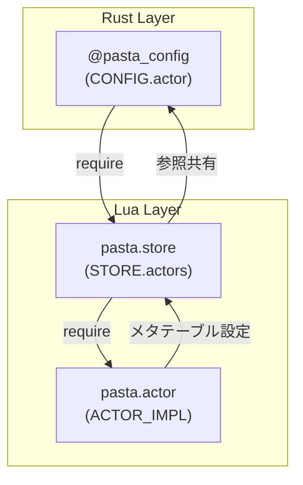
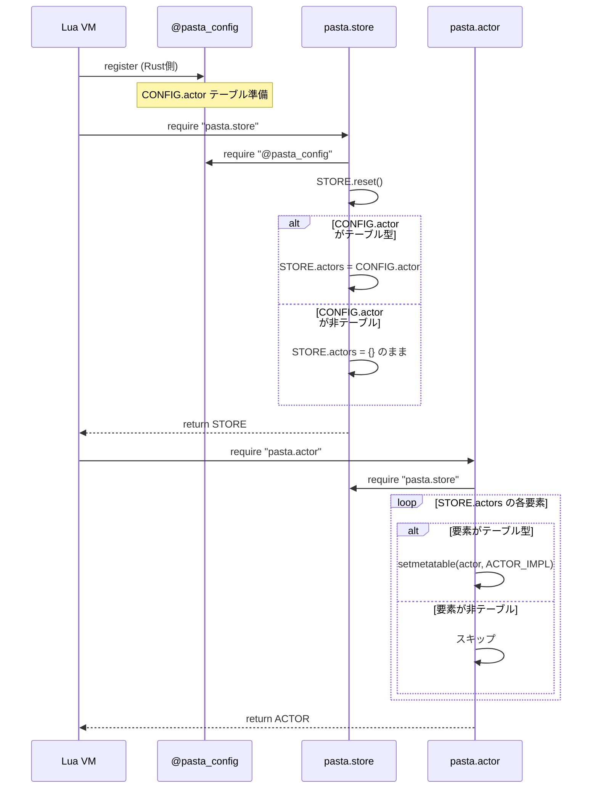

# Design Document: config-actors-initialization

## Overview

**Purpose**: pasta.toml の `[actor.*]` セクションで定義されたアクター設定を、Lua ランタイム起動時に `STORE.actors` へ自動反映する機能を提供する。

**Users**: ゴースト作成者は、Lua コードを書かずに宣言的にアクターのプロパティ（spot、default_surface 等）を設定できるようになる。

**Impact**: 既存の `pasta.store` および `pasta.actor` モジュールの初期化フローを拡張し、`@pasta_config` から CONFIG.actor を読み込んで STORE.actors を初期化する。

### Goals
- CONFIG.actor が存在する場合、STORE.actors を参照共有で初期化
- 既存の STORE.reset() ロジックを活用し、コード重複を回避
- ACTOR_IMPL メタテーブルを CONFIG 由来アクターにも設定

### Non-Goals
- TOML パース処理の変更（既存実装で対応済み）
- モジュール登録順序の変更（既存実装で最適化済み）
- アクター検証・バリデーション（設定ミスは許容）

## Architecture

### Existing Architecture Analysis

**現行アーキテクチャ**:
- `@pasta_config` モジュール: Rust 側で TOML をパースし、Lua テーブルとして公開（`runtime/mod.rs:538`）
- `pasta.store` モジュール: グローバルデータストア、`STORE.actors = {}` で静的初期化
- `pasta.actor` モジュール: `ACTOR_IMPL` メタテーブル管理、`get_or_create()` で動的生成

**制約**:
- `store.lua` は「他の Lua モジュールを require しない」ポリシー（循環参照回避）
- `@pasta_config` は Rust 組み込みモジュールのため例外扱い

### Architecture Pattern & Boundary Map



**Architecture Integration**:
- **Selected pattern**: 参照共有 + 遅延メタテーブル設定
- **Domain boundaries**: store.lua = データ所有、actor.lua = メタテーブル管理
- **Existing patterns preserved**: store.lua の非依存ポリシー（Rust モジュール例外）
- **Steering compliance**: lua-coding.md のモジュール構造規約に準拠

### Technology Stack

| Layer | Choice / Version | Role in Feature | Notes |
|-------|------------------|-----------------|-------|
| Backend | Lua 5.4 (mlua 0.10) | 初期化ロジック実行 | 既存 |
| Data | TOML via @pasta_config | CONFIG.actor 提供 | 既存実装活用 |
| Runtime | pasta.store, pasta.actor | 初期化対象モジュール | 拡張 |

## System Flows



## Requirements Traceability

| Requirement | Summary | Components | Interfaces | Flows |
|-------------|---------|------------|------------|-------|
| 1.1-1.4 | TOML→CONFIG.actor 公開 | @pasta_config | - | ✅ 既存実装 |
| 2.1 | reset() 呼び出し | pasta.store | STORE.reset() | 初期化フロー |
| 2.2-2.3 | CONFIG.actor 代入 | pasta.store | STORE.actors | 初期化フロー |
| 2.4 | メタテーブル委譲 | pasta.store | - | - |
| 2.5-2.6 | ACTOR_IMPL 設定 | pasta.actor | setmetatable() | 初期化フロー |
| 2.7 | get_or_create 既存返却 | pasta.actor | ACTOR.get_or_create() | - |
| 3.1-3.4 | モジュール早期公開 | runtime/mod.rs | - | ✅ 既存実装 |
| 4.1 | 動的追加共存 | pasta.store | STORE.actors[name] | - |
| 4.2 | CONFIG プロパティ保持 | pasta.actor | ACTOR.get_or_create() | - |
| 4.3-4.4 | reset() 再初期化 | pasta.store | STORE.reset() | リセットフロー |

## Components and Interfaces

| Component | Domain/Layer | Intent | Req Coverage | Key Dependencies | Contracts |
|-----------|--------------|--------|--------------|------------------|-----------|
| pasta.store | Data Store | CONFIG.actor からの初期化 | 2.1-2.4, 4.1, 4.3-4.4 | @pasta_config (P0) | State |
| pasta.actor | Actor Management | メタテーブル設定 | 2.5-2.7, 4.2 | pasta.store (P0) | Service |

### Data Store Layer

#### pasta.store

| Field | Detail |
|-------|--------|
| Intent | CONFIG.actor を STORE.actors に参照共有で設定 |
| Requirements | 2.1, 2.2, 2.3, 2.4, 4.1, 4.3, 4.4 |

**Responsibilities & Constraints**
- STORE.actors の初期化（reset() 内で CONFIG.actor を参照）
- メタテーブル設定は行わない（actor.lua に委譲）
- `@pasta_config` 以外の Lua モジュールを require しない

**Dependencies**
- Inbound: pasta.actor — STORE.actors 参照 (P0)
- External: @pasta_config — CONFIG.actor 取得 (P0)

**Contracts**: State [x]

##### State Management

**追加するコード（store.lua 末尾）**:
```lua
-- CONFIG.actor からの初期化
local CONFIG = require "@pasta_config"
STORE.reset()
if type(CONFIG.actor) == "table" then
    STORE.actors = CONFIG.actor
end
```

**STORE.reset() 内の変更（actors 初期化部分）**:
```lua
function STORE.reset()
    -- ... 既存のクリーンアップ ...
    
    STORE.actors = {}  -- 既存
    -- CONFIG.actor の再設定
    local ok, CONFIG = pcall(require, "@pasta_config")
    if ok and type(CONFIG.actor) == "table" then
        STORE.actors = CONFIG.actor
    end
    
    -- ... 他フィールドの初期化 ...
end
```

**実装上の注意**:
- `pcall` で `@pasta_config` の require を保護（テスト環境での安全性）
- 型チェック `type(CONFIG.actor) == "table"` で nil/非テーブル値をガード

### Actor Management Layer

#### pasta.actor

| Field | Detail |
|-------|--------|
| Intent | STORE.actors の各要素に ACTOR_IMPL メタテーブルを設定 |
| Requirements | 2.5, 2.6, 2.7, 4.2 |

**Responsibilities & Constraints**
- モジュール初期化時に STORE.actors を走査
- テーブル型の要素にのみ ACTOR_IMPL を設定
- get_or_create() で既存アクター（メタテーブル設定済み）を返却

**Dependencies**
- Inbound: ユーザースクリプト — ACTOR.get_or_create() 呼び出し
- Outbound: pasta.store — STORE.actors 参照 (P0)

**Contracts**: Service [x]

##### Service Interface

**追加するコード（actor.lua 末尾、return ACTOR の前）**:
```lua
-- CONFIG 由来アクターへのメタテーブル設定
for name, actor in pairs(STORE.actors) do
    if type(actor) == "table" then
        setmetatable(actor, ACTOR_IMPL)
    end
end
```

**get_or_create() の既存動作（変更なし）**:
```lua
function ACTOR.get_or_create(name)
    if not STORE.actors[name] then
        -- 新規作成
        local actor = { name = name, spot = nil }
        setmetatable(actor, ACTOR_IMPL)
        STORE.actors[name] = actor
    end
    return STORE.actors[name]  -- 既存なら既存を返す
end
```

## Error Handling

### Error Strategy
- **型チェックによるフォールバック**: CONFIG.actor が非テーブルなら空テーブルで初期化
- **スキップ処理**: STORE.actors[name] が非テーブルならメタテーブル設定をスキップ
- **pcall 保護**: @pasta_config の require 失敗時は空テーブルで継続

### Error Categories and Responses
| Error Case | Detection | Response | Requirement |
|------------|-----------|----------|-------------|
| CONFIG.actor が nil | `type() ~= "table"` | 空テーブル {} で初期化 | 2.3 |
| CONFIG.actor が非テーブル | `type() ~= "table"` | 空テーブル {} で初期化 | 2.3 |
| STORE.actors[name] が非テーブル | `type() ~= "table"` | スキップ（エラーにしない） | 2.6 |
| @pasta_config require 失敗 | `pcall` | 空テーブル {} で継続 | - |

## Testing Strategy

### Unit Tests (pasta.actor, pasta.store)
- `STORE.reset()` 後に `CONFIG.actor` が `STORE.actors` に反映される
- `CONFIG.actor` が nil の場合、`STORE.actors` は空テーブル
- `CONFIG.actor` が非テーブル（文字列等）の場合、`STORE.actors` は空テーブル
- `STORE.actors` の各要素に `ACTOR_IMPL` メタテーブルが設定される
- 非テーブル要素はスキップされエラーにならない

### Integration Tests
- pasta.toml に `[actor.さくら]` を定義し、`STORE.actors["さくら"].spot` で値取得
- `ACTOR.get_or_create("さくら")` が CONFIG 由来プロパティを保持
- 動的追加 `STORE.actors["新規"] = {}` と CONFIG 由来アクターが共存
- `STORE.reset()` 後に CONFIG 状態に復帰

### E2E Tests
- SHIORI イベントループ内でアクター参照が正常動作
- メタテーブルメソッド（`actor:talk()` 等）が利用可能
