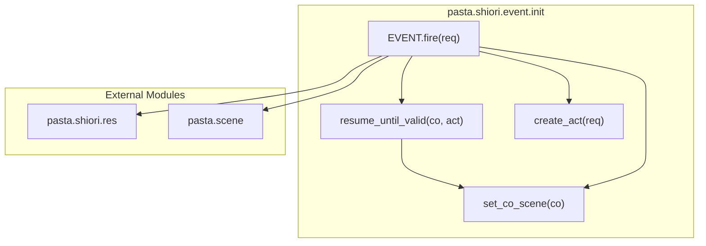
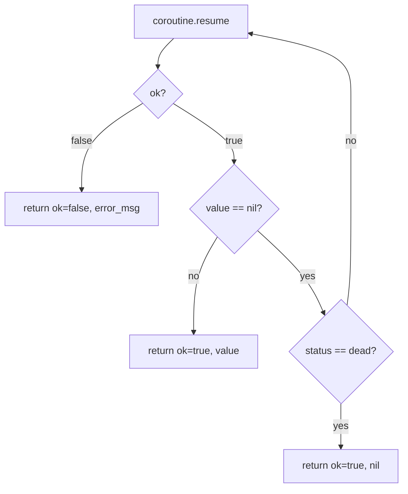

# Design Document

## Overview

**Purpose**: 本機能は、SHIORIイベントハンドラーのコルーチン実行において、想定外のnil yieldを防御的に処理し、システムの堅牢性を向上させる。

**Users**: SHIORIランタイム（EVENTモジュール）が、シーン関数のバグや特殊ケースに対して安定動作を維持する。

**Impact**: 既存の`EVENT.fire`内のコルーチン処理部分を拡張し、nil yieldをスキップするループ機構を導入する。後方互換性を完全に維持する。

### Goals
- nil yieldに対する防御的処理の実装
- 既存ハンドラ（文字列/nil戻り値）との後方互換性維持
- 既存の責務分離パターン（`set_co_scene`）との一貫性維持

### Non-Goals
- ループ上限の実装（`wrapped_fn`が終了を保証するため不要）
- シーン関数側のnil yield発生源の修正（本機能はfire側の防御処理）
- 新規モジュール・ファイルの追加（既存ファイル内で完結）

## Architecture

### Existing Architecture Analysis

**Current Flow**:
```
EVENT.fire(req) → handler(act) → thread型判定 → coroutine.resume(co, act) → set_co_scene(co) → RES.ok(value)
```

**制約**:
- `set_co_scene`がコルーチンのライフサイクル管理を担当
- エラー時は`error()`で伝搬し、上位の`xpcall`でキャッチ
- `RES.ok(nil)`は自動的に`RES.no_content()`に変換

**統合ポイント**:
- `EVENT.fire`のthread分岐内（L126-141）

### Architecture Pattern & Boundary Map



**Architecture Integration**:
- **Selected pattern**: ローカル関数追加（Extension - Option B）
- **Domain boundaries**: EVENTモジュール内部に閉じた変更
- **Existing patterns preserved**: `set_co_scene`と同様の責務分離パターン
- **New components rationale**: `resume_until_valid` - nil yieldスキップループの責務を分離
- **Steering compliance**: lua-coding.md §2.1（標準モジュール構造）に準拠

### Technology Stack

| Layer | Choice / Version | Role in Feature | Notes |
|-------|------------------|-----------------|-------|
| Runtime | Lua 5.5 (mlua 0.11) | コルーチン実行基盤 | `coroutine.resume`, `coroutine.status` |

## System Flows

### nil yieldスキップループ



**フロー決定事項**:
- エラー発生時（ok=false）: 即座にエラー情報を返し、呼び出し元で処理
- 有効値（value ≠ nil）: ループ終了、値を返す
- nil + dead: ループ終了、nilを有効値として返す（空シーン）
- nil + suspended: ループ継続、再度resume

## Requirements Traceability

| Requirement | Summary | Components | Interfaces | Flows |
|-------------|---------|------------|------------|-------|
| 1.1 | nil + suspended で再resume | resume_until_valid | - | nil yieldスキップループ |
| 1.2 | nil以外 or dead でループ終了 | resume_until_valid | - | nil yieldスキップループ |
| 1.3 | エラー時はエラー伝搬 | resume_until_valid, EVENT.fire | - | nil yieldスキップループ |
| 1.4 | ローカル関数実装 | resume_until_valid | resume_until_valid | - |
| 2.1 | EVENT.fireでループ関数使用 | EVENT.fire | - | - |
| 2.2 | 文字列ハンドラ互換 | EVENT.fire | - | - |
| 2.3 | nil戻り値互換 | EVENT.fire | - | - |
| 2.4 | suspended時コルーチン保存 | EVENT.fire, set_co_scene | - | - |
| 3.1 | エラー時set_co_sceneでclose | EVENT.fire | - | - |
| 3.2 | エラーメッセージ伝搬 | EVENT.fire | - | - |
| 3.3 | deadコルーチンclose | set_co_scene（既存） | - | - |

## Components and Interfaces

| Component | Domain/Layer | Intent | Req Coverage | Key Dependencies | Contracts |
|-----------|--------------|--------|--------------|------------------|-----------|
| resume_until_valid | EVENT/Internal | nil yieldスキップループ | 1.1-1.4 | coroutine (P0) | Service |
| EVENT.fire | EVENT/Public | イベント振り分け（修正） | 2.1-2.4, 3.1-3.2 | resume_until_valid (P0), set_co_scene (P0), RES (P0) | Service |

### EVENT / Internal

#### resume_until_valid

| Field | Detail |
|-------|--------|
| Intent | コルーチンを有効値またはdead状態まで繰り返しresumeする |
| Requirements | 1.1, 1.2, 1.3, 1.4 |

**Responsibilities & Constraints**
- nil yieldをスキップし、有効値またはdead状態までループ継続
- 初回resumeで引数（act）を渡し、2回目以降は引数なし
- エラー時は`ok=false`とエラーメッセージを返す（closeは呼び出し元責務）

**Dependencies**
- Inbound: EVENT.fire — コルーチン実行委譲 (P0)
- External: coroutine.resume, coroutine.status — Lua標準API (P0)

**Contracts**: Service [x]

##### Service Interface
```lua
--- nil yieldをスキップして有効値またはdead状態まで繰り返しresumeする
--- @param co thread コルーチン
--- @param ... any 初回resume引数（通常はact）
--- @return boolean, any ok, value（エラー時はok=false, エラーメッセージ）
local function resume_until_valid(co, ...)
```

- **Preconditions**: 
  - `co`は有効なthread型
  - `co`のstatusは"suspended"または未開始
- **Postconditions**: 
  - 戻り値`ok=true`の場合、`value`はnil以外または`co`がdead状態でのnil
  - 戻り値`ok=false`の場合、`value`はエラーメッセージ
- **Invariants**: 
  - ループ内でエラーが発生しない限り、必ず終了する（`wrapped_fn`が終了を保証）

### EVENT / Public

#### EVENT.fire（修正）

| Field | Detail |
|-------|--------|
| Intent | SHIORIリクエストを処理し、適切なハンドラを呼び出す |
| Requirements | 2.1, 2.2, 2.3, 2.4, 3.1, 3.2 |

**Responsibilities & Constraints**
- thread型結果に対して`resume_until_valid`を使用
- 既存の文字列/nil戻り値処理は変更なし
- エラー時は`set_co_scene`でcloseし、`error()`で伝搬

**Dependencies**
- Outbound: resume_until_valid — ループ実行委譲 (P0)
- Outbound: set_co_scene — コルーチン状態管理 (P0)
- Outbound: RES.ok, RES.no_content — レスポンス生成 (P0)

**Contracts**: Service [x]

##### Service Interface（変更箇所のみ）
```lua
--- イベント振り分け（thread分岐の変更）
--- @param req table リクエストテーブル
--- @return string SHIORI レスポンス
function EVENT.fire(req)
    -- ... (既存処理) ...
    
    if type(result) == "thread" then
        -- 変更: resume_until_validを使用
        local ok, yielded_value = resume_until_valid(result, act)
        if not ok then
            set_co_scene(result)
            error(yielded_value)
        end
        set_co_scene(result)
        return RES.ok(yielded_value)
    end
    
    -- ... (既存処理変更なし) ...
end
```

- **Preconditions**: 変更なし
- **Postconditions**: 変更なし（動作は同等、nil yieldスキップが追加）
- **Invariants**: 後方互換性維持

## Testing Strategy

### 単体テスト（resume_until_valid）

| ケース | 入力 | 期待結果 |
|--------|------|----------|
| 即座に有効値yield | `yield("value")` | `ok=true, value="value"` |
| nil後に有効値yield | `yield(nil); yield("value")` | `ok=true, value="value"` |
| 複数nil後に有効値 | `yield(nil); yield(nil); yield("value")` | `ok=true, value="value"` |
| nil後にdead（return nil） | `yield(nil); return nil` | `ok=true, value=nil` |
| 即座にdead（return） | `return "value"` | `ok=true, value="value"` |
| エラー発生 | `error("test")` | `ok=false, value=エラーメッセージ` |
| nil後にエラー | `yield(nil); error("test")` | `ok=false, value=エラーメッセージ` |

### 統合テスト（EVENT.fire）

| ケース | 期待結果 |
|--------|----------|
| 既存テストケース全パス | 後方互換性確認 |
| nil yieldスキップ動作 | 正常レスポンス返却 |
| 空シーン（nil + dead） | 204 No Content |
